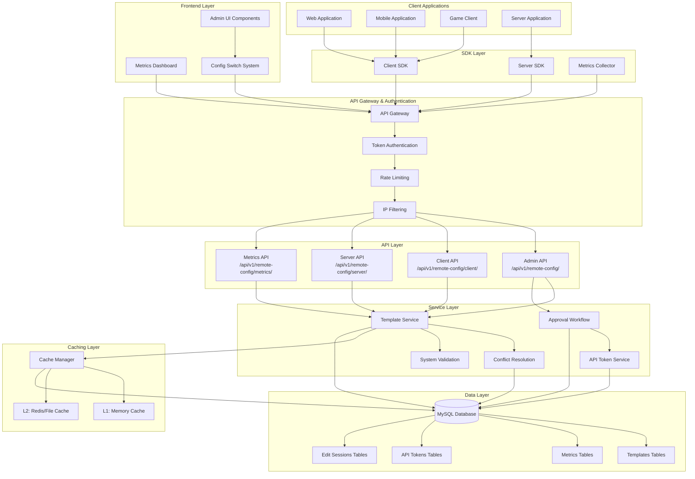
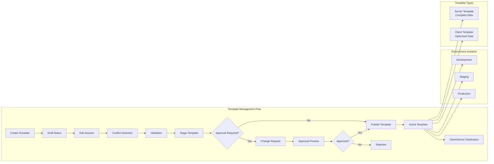
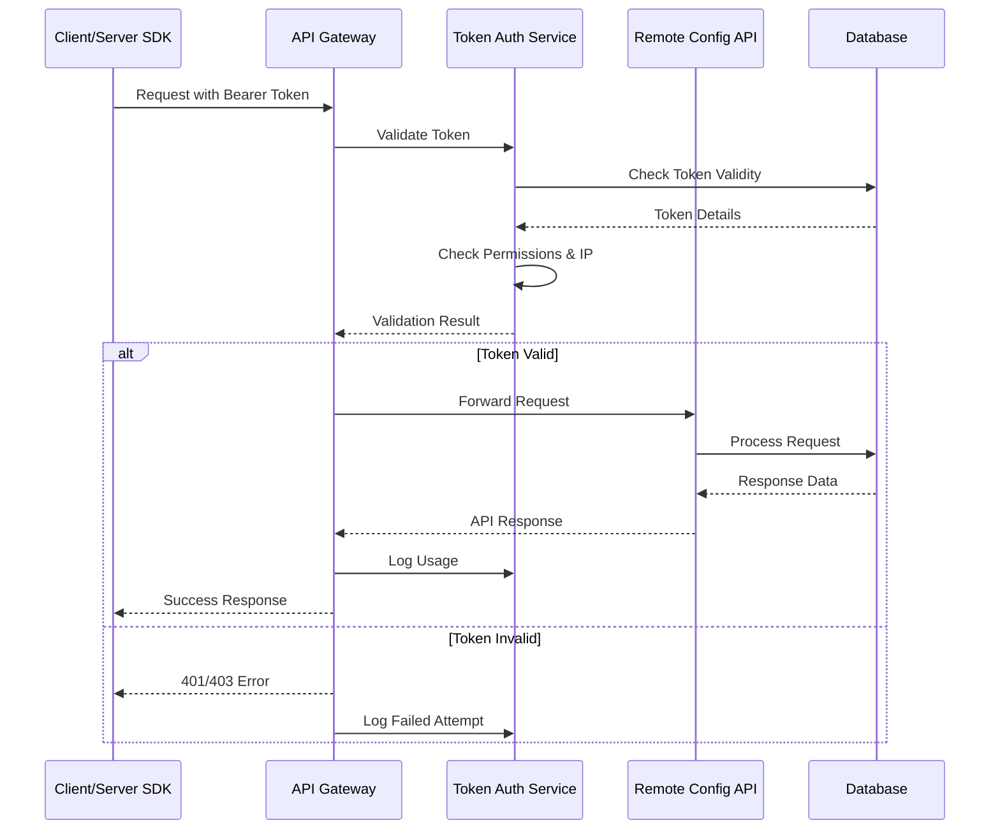
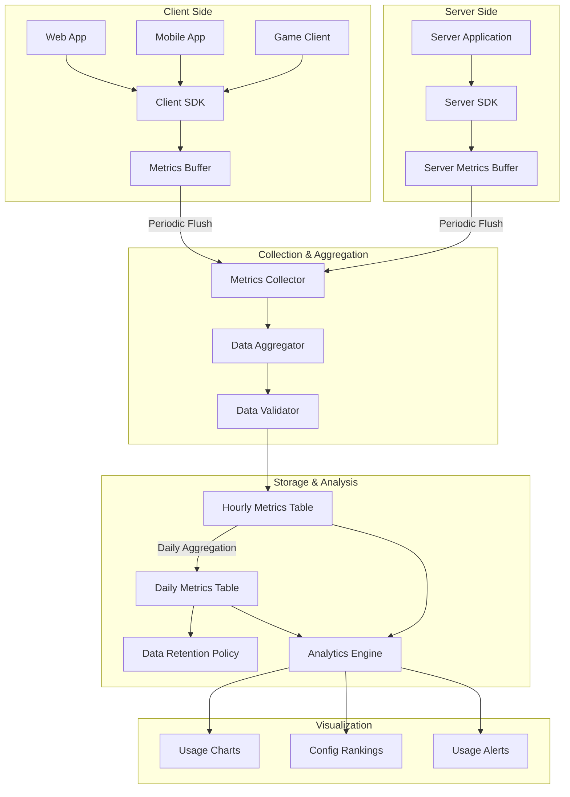
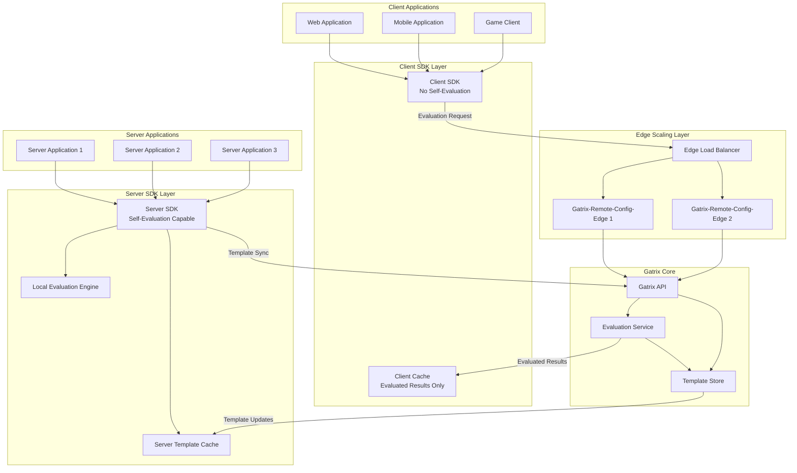
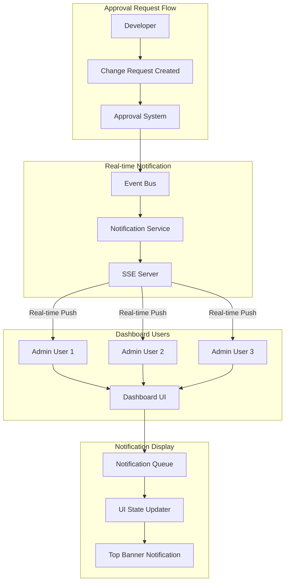
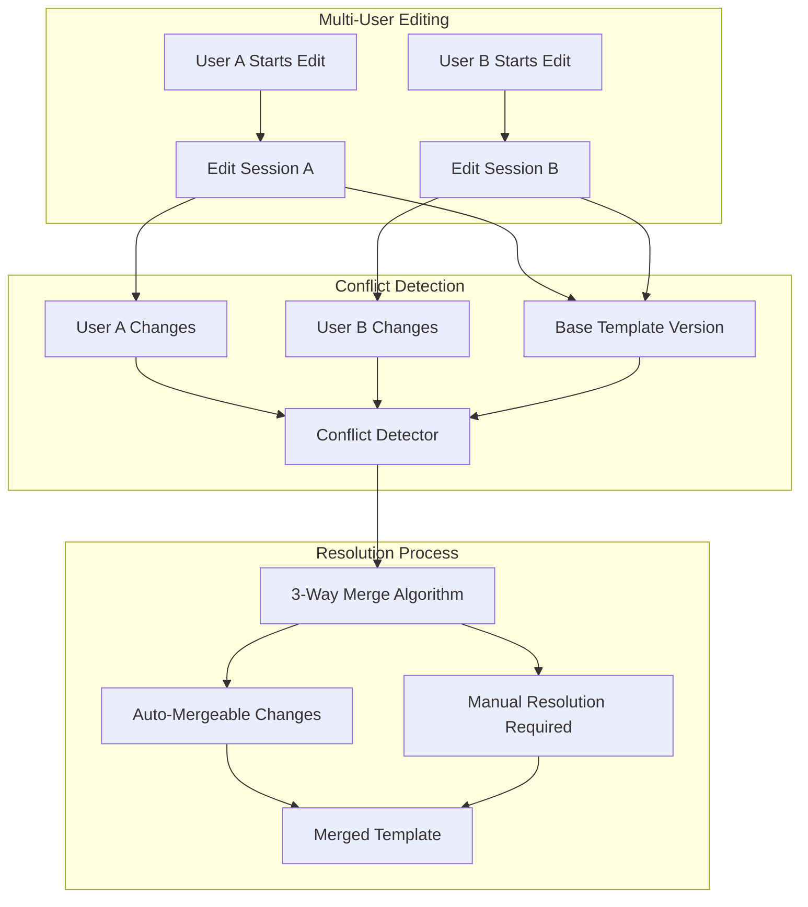
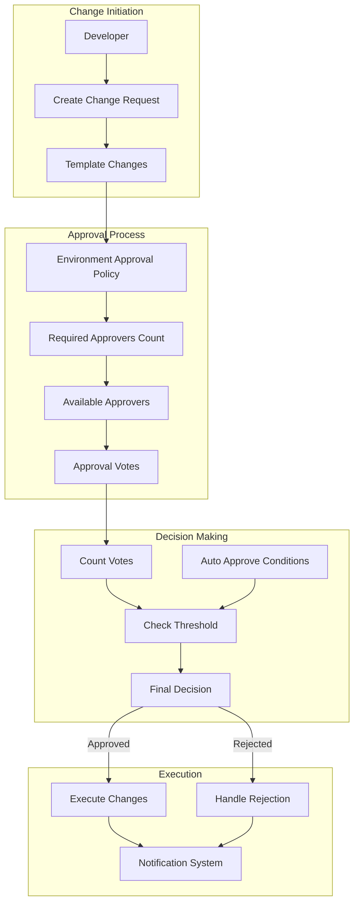
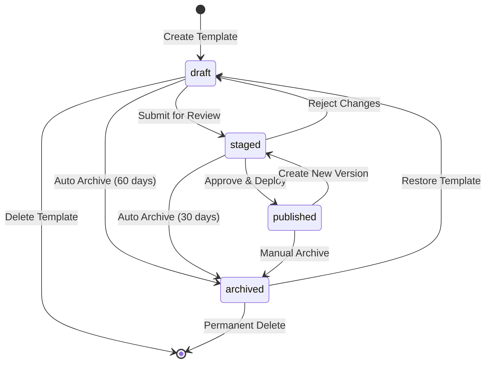

# Remote Config 시스템 개선 설계 문서

## 📋 개요

기존 개별 설정 기반의 Remote Config 시스템을 Firebase Remote Config와 Unleash Features 스타일의 Template 기반 통합 시스템으로 개선하는 설계 문서입니다.

## 🎯 핵심 개선 목표

### 1. Template 기반 통합 관리
- 현재: 설정별 개별 버저닝 (캠페인, 컨텍스트 필드, Variants 제외)
- 개선: 모든 요소를 포함한 Template 단위 버저닝

### 2. 환경별 분리 관리
- dev, staging, production 등 환경별 독립 관리
- 환경별 승인 정책 및 제한 설정

### 3. 안전성 강화
- Unleash 스타일 Four Eye Principle
- 환경 변수 기반 제한 설정
- API 스로틀링

### 4. 성능 최적화
- cache-manager 기반 다층 캐싱 (메모리 + Redis/파일)
- MySQL JSON 최적화

### 5. 메트릭 추적
- Unleash 스타일 사용량 분석
- 시간별 집계 및 시각화

### 6. UI 호환성 유지
- Configuration Switch 기반 점진적 전환
- Legacy 코드 최소화

## 🏗️ 아키텍처 설계

### Overall System Architecture



### Template-Based Architecture Flow



### API Token Authentication Flow



### Metrics Collection Architecture



### SDK Evaluation Architecture



### Real-time Approval Notification System



## 📊 데이터베이스 설계

### 환경 관리 테이블

```sql
-- 환경 설정 테이블 (camelCase 컬럼명 적용)
CREATE TABLE g_remote_config_environments (
  id INT AUTO_INCREMENT PRIMARY KEY,
  environmentName VARCHAR(50) NOT NULL UNIQUE,
  displayName VARCHAR(100) NOT NULL,
  description TEXT NOT NULL, -- 환경 설명 (필수)
  isDefault BOOLEAN DEFAULT FALSE,
  isProduction BOOLEAN DEFAULT FALSE,

  -- Four Eye Principle 설정
  requireApproval BOOLEAN DEFAULT FALSE,
  minApprovers INT DEFAULT 1,
  autoDeploy BOOLEAN DEFAULT TRUE,

  createdAt TIMESTAMP DEFAULT CURRENT_TIMESTAMP,
  updatedAt TIMESTAMP DEFAULT CURRENT_TIMESTAMP ON UPDATE CURRENT_TIMESTAMP
);

-- 기본 환경 데이터 (description 포함)
INSERT INTO g_remote_config_environments (environmentName, displayName, description, isDefault, requireApproval, isProduction) VALUES
('default', 'Default', 'Default environment for initial setup and testing', TRUE, FALSE, FALSE),
('dev', 'Development', 'Development environment for feature development and testing', FALSE, FALSE, FALSE),
('staging', 'Staging', 'Staging environment for pre-production testing and validation', FALSE, TRUE, FALSE),
('production', 'Production', 'Production environment for live user traffic', FALSE, TRUE, TRUE);
```

### Template 시스템 테이블

```sql
-- 템플릿 메인 테이블 (camelCase 컬럼명 적용)
CREATE TABLE g_remote_config_templates (
  id INT AUTO_INCREMENT PRIMARY KEY,
  environmentId INT NOT NULL,
  versionNumber INT NOT NULL,
  templateType ENUM('server', 'client') NOT NULL DEFAULT 'server',

  -- 메타데이터 (빠른 조회용)
  templateName VARCHAR(255) NOT NULL,
  description TEXT,
  configCount INT DEFAULT 0,
  campaignCount INT DEFAULT 0,
  variantCount INT DEFAULT 0,

  -- 상태 관리 (ENUM 대신 VARCHAR 사용)
  templateStatus VARCHAR(20) NOT NULL DEFAULT 'draft', -- 'draft', 'staged', 'published', 'archived'

  -- 실제 템플릿 데이터
  templateData JSON NOT NULL,

  -- 버전 관리
  createdBy INT,
  createdAt TIMESTAMP DEFAULT CURRENT_TIMESTAMP,
  publishedAt TIMESTAMP NULL,

  FOREIGN KEY (environmentId) REFERENCES g_remote_config_environments(id),
  FOREIGN KEY (createdBy) REFERENCES g_users(id),

  -- 성능 최적화 인덱스
  UNIQUE KEY unique_env_version_type (environmentId, versionNumber, templateType),
  INDEX idx_env_status (environmentId, templateStatus),
  INDEX idx_config_count (configCount),
  INDEX idx_published (publishedAt)
);

-- Segments 테이블 (재사용 가능한 타겟팅 조건)
CREATE TABLE g_remote_config_segments (
  id INT AUTO_INCREMENT PRIMARY KEY,
  environmentId INT NOT NULL,
  segmentName VARCHAR(255) NOT NULL,
  displayName VARCHAR(255) NOT NULL,
  description TEXT,

  -- Segment 조건 정의
  segmentConditions JSON NOT NULL,

  -- 상태 관리
  isActive BOOLEAN DEFAULT TRUE,

  -- 생성 정보
  createdBy INT NOT NULL,
  createdAt TIMESTAMP DEFAULT CURRENT_TIMESTAMP,
  updatedAt TIMESTAMP DEFAULT CURRENT_TIMESTAMP ON UPDATE CURRENT_TIMESTAMP,

  FOREIGN KEY (environmentId) REFERENCES g_remote_config_environments(id),
  FOREIGN KEY (createdBy) REFERENCES g_users(id),

  UNIQUE KEY unique_segment_per_env (environmentId, segmentName),
  INDEX idx_environment_active (environmentId, isActive)
);

-- 기본 Segments 데이터
INSERT INTO g_remote_config_segments (environmentId, segmentName, displayName, description, segmentConditions, createdBy) VALUES
(1, 'beta_users', 'Beta Users', 'Users enrolled in beta testing program',
 '{"conditions": [{"field": "user_type", "operator": "equals", "value": "beta"}]}', 1),
(1, 'korean_users', 'Korean Users', 'Users from South Korea',
 '{"conditions": [{"field": "country", "operator": "equals", "value": "KR"}]}', 1),
(1, 'premium_users', 'Premium Users', 'Users with premium subscription',
 '{"conditions": [{"field": "subscription_type", "operator": "in", "value": ["premium", "enterprise"]}]}', 1),
(1, 'mobile_users', 'Mobile Users', 'Users on mobile platforms',
 '{"conditions": [{"field": "platform", "operator": "in", "value": ["ios", "android"]}]}', 1),
(1, 'new_users', 'New Users', 'Users registered within last 30 days',
 '{"conditions": [{"field": "registration_date", "operator": "greater_than", "value": "30_days_ago"}]}', 1),
(1, 'power_users', 'Power Users', 'Users with high activity levels',
 '{"conditions": [{"field": "daily_active_days", "operator": "greater_than", "value": 20}]}', 1);

-- 활성 템플릿 캐시 테이블 (빠른 조회용)
CREATE TABLE g_remote_config_active_templates (
  environmentId INT PRIMARY KEY,
  templateId INT NOT NULL,
  versionNumber INT NOT NULL,
  templateData JSON NOT NULL,
  lastUpdated TIMESTAMP DEFAULT CURRENT_TIMESTAMP ON UPDATE CURRENT_TIMESTAMP,

  FOREIGN KEY (environmentId) REFERENCES g_remote_config_environments(id),
  FOREIGN KEY (templateId) REFERENCES g_remote_config_templates(id)
);
```

### Template 데이터 구조

```typescript
interface RemoteConfigTemplate {
  version: number;
  environment: string;
  metadata: {
    name: string;
    description: string;
    created_by: number;
    created_at: string;
    status: 'draft' | 'staged' | 'published' | 'archived';
  };
  
  // 모든 설정을 하나의 템플릿에 통합
  configs: {
    [key: string]: {
      value: any;
      type: 'string' | 'number' | 'boolean' | 'json' | 'yaml'; // 5가지 타입만 허용
      description?: string;
    };
  };
  
  // 캠페인도 템플릿에 포함
  campaigns: Campaign[];
  
  // 컨텍스트 필드도 템플릿에 포함
  contextFields: ContextField[];
  
  // Variants도 템플릿에 포함
  variants: {
    [configKey: string]: Variant[];
  };
}

// 서버 템플릿 (완전한 정보)
interface ServerTemplate extends RemoteConfigTemplate {
  targeting: {
    rules: TargetingRule[];
    segments: Segment[];
  };
  abTests: ABTest[];
}

// 클라이언트 템플릿 (최적화된 정보)
interface ClientTemplate {
  version: number;
  environment: string;
  configs: {
    [key: string]: any; // 조건 평가 후 최종 값만
  };
}
```

## 🛡️ 승인 워크플로우 (Unleash 스타일)

### 승인 정책 테이블

```sql
-- 승인 정책 테이블 (Unleash 스타일, camelCase 적용)
CREATE TABLE g_remote_config_approval_policies (
  id INT AUTO_INCREMENT PRIMARY KEY,
  environmentId INT NOT NULL,

  -- 승인 요구사항
  requireApproval BOOLEAN DEFAULT FALSE,
  minApprovers INT DEFAULT 1,
  maxApprovers INT DEFAULT 5,

  -- 승인자 제한
  allowedApproverRoles JSON NULL, -- ['admin', 'senior_dev']
  blockedApproverIds JSON NULL, -- 특정 사용자 제외

  -- 자동 승인 조건
  autoApproveMinorChanges BOOLEAN DEFAULT FALSE,
  autoApproveRollback BOOLEAN DEFAULT TRUE,

  -- 시간 제한
  approvalTimeoutHours INT DEFAULT 24,

  FOREIGN KEY (environmentId) REFERENCES g_remote_config_environments(id),
  UNIQUE KEY unique_env_policy (environmentId)
);

-- Unleash 스타일 승인 요청 (camelCase 적용)
CREATE TABLE g_remote_config_change_requests (
  id INT AUTO_INCREMENT PRIMARY KEY,
  environmentId INT NOT NULL,
  templateId INT NOT NULL,

  -- 변경 내용
  changeType ENUM('create', 'update', 'delete', 'rollback') NOT NULL,
  changeSummary TEXT NOT NULL,
  changeDetails JSON NOT NULL,

  -- 요청자 정보
  requestedBy INT NOT NULL,
  requestedAt TIMESTAMP DEFAULT CURRENT_TIMESTAMP,

  -- 상태 관리
  requestStatus ENUM('pending', 'approved', 'rejected', 'cancelled', 'expired') DEFAULT 'pending',

  -- 승인 정보
  requiredApprovals INT NOT NULL,
  currentApprovals INT DEFAULT 0,

  -- 만료 시간
  expiresAt TIMESTAMP NULL,

  FOREIGN KEY (environmentId) REFERENCES g_remote_config_environments(id),
  FOREIGN KEY (templateId) REFERENCES g_remote_config_templates(id),
  FOREIGN KEY (requestedBy) REFERENCES g_users(id)
);

-- 개별 승인 기록 (camelCase 적용)
CREATE TABLE g_remote_config_change_request_approvals (
  id INT AUTO_INCREMENT PRIMARY KEY,
  changeRequestId INT NOT NULL,
  approverId INT NOT NULL,

  approvalDecision ENUM('approve', 'reject') NOT NULL,
  approvalComment TEXT NULL,
  approvedAt TIMESTAMP DEFAULT CURRENT_TIMESTAMP,

  FOREIGN KEY (changeRequestId) REFERENCES g_remote_config_change_requests(id),
  FOREIGN KEY (approverId) REFERENCES g_users(id),
  UNIQUE KEY unique_request_approver (changeRequestId, approverId)
);
```

## 📋 추가 요구사항

### 18. 테이블 명명 규칙
- 모든 remote config 관련 테이블은 `g_remote_config_` 접두사 사용

### 19. 컬럼 명명 규칙
- 모든 테이블의 컬럼명은 camelCase 사용

### 20. MySQL 예약어 처리
- 예약어 사용 시 백틱(`) 대신 명확한 이름 사용
- 예: `name` → `templateName`

### 14. 시스템 전체 제한 설정
- 환경별이 아닌 시스템 전체 제한 적용
- 환경 변수로 제어

### 17. SDK 기반 메트릭 집계
- 개별 이벤트 추적이 아닌 SDK에서 집계 후 전송
- Unleash Features 방식 채택

### 21. API 경로 규칙
- 모든 remote config 관련 API는 `/api/v1/remote-config/` 접두사 사용

### 22. 서버 사이드 SDK API 경로
- 서버 사이드 SDK API는 `/api/v1/remote-config/server/` 접두사 사용

### 23. API Access Token 관리 시스템
- Client/Server SDK 접근을 위한 별도 API 토큰 시스템 구현
- Unleash Features 방식 참고

### 24. 다이어그램 작성
- 시스템 아키텍처 다이어그램 제공
- 모든 다이어그램 내용은 영어로 작성

### 25. 환경 관리 권한
- Environment 관리는 Admin 전용
- Client API를 통한 환경 수정/접근 불필요

### 26. SDK 헤더 요구사항
- Client/Server SDK는 헤더에 API 키 및 애플리케이션 이름 포함
- Unleash Features 방식 참고

### 27. 메트릭 보존 기간 설정
- 수집된 메트릭의 최대 보존 기간을 .env에서 설정 가능

### 28. 템플릿 Import/Export
- 템플릿 Import/Export 기능 제공
- Import는 전체 내용 변경이므로 approval workflow 활성화 시 승인 필요
- Export는 JSON 형태로 단순 내보내기

### 29. 테이블 명명 규칙 수정
- g_change_requests → g_remote_config_change_requests

### 30. SDK API 엔드포인트 명확화
- Client SDK: /api/v1/remote-config/client/
- Server SDK: /api/v1/remote-config/server/
- SDK는 API access token으로 접근, app name으로 메트릭 수집

### 31. 캐싱 시스템 명확화
- 캐싱 대상과 무효화 시점 명확히 정의

### 32. 시각적 차이점 표시
- Change request, deployments 정보 표시 시 React diff viewer 사용
- Git diff 스타일의 시각적 확인 제공

### 33. API Access Token 환경 제한 및 범용성
- 하나의 토큰은 하나의 환경에만 접근 가능
- Dev용, Live용 별도 토큰 발급 필요
- API Access Token은 Remote Config 외에 모든 Client/Server SDK, DevOps Tooling 등에서 사용
- Remote Config 전용이 아닌 범용 인증 토큰 시스템

### 34. API 토큰 테이블 명명 수정
- g_remote_config_api_tokens → g_remote_config_api_access_tokens

### 35. Admin API Token 용도
- Admin API token은 DevOps 등에서 사용

### 36. Approval 기본 설정
- Approvals는 기본적으로 비활성화
- 라이브 환경에서 필요 시 UI에서 환경별 활성화

### 37. 상세 메트릭 추적
- 각 설정별 true/false 평가 결과 추적
- Variants 평가 결과 추적
- 캠페인 평가 결과 추적

### 38. Legacy 고려 최소화
- Legacy 고려는 UI 체계 유지 수준만
- API 호환성 불필요 (새로 구축)

### 39. UI 통일성 유지
- 새 UI 추가 시 기존 UI와 통일성 고려
- 일관된 디자인 시스템 적용

### 40. Environment 테이블 Description 추가
- Environment 테이블에 description 컬럼 추가

### 41. Config 설정 타입 제한
- Config 설정 타입을 5가지로 제한: string, number, boolean, json, yaml

### 42. SDK 평가 아키텍처
- Client SDK: Gatrix 또는 Server SDK에서 평가 (보안상 자체 평가 금지)
- Server SDK: Gatrix에서 템플릿 주기적 가져와 자체 캐싱 및 평가
- Gatrix-remote-config-edge: 스케일링을 위한 별도 평가 엔진

### 43. 실시간 승인 알림
- 승인 요청 시 실시간으로 모든 대시보드 접속 유저에게 알림
- 대시보드 상단 바로 아래에 알림 표시

### 44. API Access Token 캐싱
- API Access Token 검증 시 데이터베이스 부하 감소를 위한 캐싱
- 매번 데이터베이스 접근 대신 캐시 활용

### 45. 용어 통일성
- Feature Toggle 용어 사용 금지 (코드 및 문서에서)
- Remote Config 시스템으로 일관된 용어 사용

### 46. Segments 기능
- 자주 사용되는 타겟팅 조건을 미리 정의된 Segments로 관리
- 베타 유저, 한국 유저 등 재사용 가능한 조건 셋트

### 47. 테이블명 일관성 확보
- g_change_requests → g_remote_config_change_requests로 완전 변경
- 모든 Remote Config 관련 테이블의 일관된 명명 규칙 적용

### 48. Node.js SDK 제작
- gatrix/packages/sdks/nodejs 폴더에 클라이언트/서버사이드 SDK 제작
- 클라이언트 SDK: 평가 요청 전용 (보안상 자체 평가 금지)
- 서버 SDK: 템플릿 캐싱 + 자체 평가 기능

### 49. UserContext 단순화
- UserContext에서 subscriptionType, country, userType 필드 제거
- 과잉 설계 방지, 필수 필드만 유지

### 50. API Access Token 단순화
- API Access Token에서 applicationName 필드 제거
- 토큰 관리 복잡성 감소

### 51. 업데이트 추적 강화
- updatedAt 필드가 있는 모든 테이블에 updatedBy 필드 추가
- 변경 이력 추적 완성

### 52. 테이블명 일관성 개선
- g_api_token* → g_api_access_tokens* 로 테이블명 변경
- 명확한 의미 전달

### 53. Admin 페이지 API 토큰 관리
- 대시보드 Admin 페이지에서 API Access Token 관리 기능
- Unleash Features 스타일 참고

### 54. 용어 일관성 완전 확보
- 문서 샘플에서 featureToggle 용어 완전 제거
- Remote Config 용어로 일관성 유지

### 55. UI 로컬라이징 필수
- 기존 UI 수정 또는 새로운 UI 추가 시 반드시 로컬라이징 적용
- 다국어 지원을 통한 글로벌 사용성 확보

### 56. 데이터베이스 필드 타입 변경
- ENUM 대신 VARCHAR/STRING 타입 사용
- Migration 복잡성 감소 및 유연성 확보

### 57. Template 상태 상세 정의
- 각 상태별 명확한 조건 및 전환 규칙 정의
- 상태 기반 워크플로우 체계화

### 58. SSE 기반 실시간 알림
- WebSocket 대신 기존 구현된 SSE 사용
- 실시간 승인 알림 시스템 SSE로 구현

### 59. 환경 선택 UI 상단 고정
- Remote Config 관리 페이지 상단에 환경 선택 UI 고정
- 언제든지 환경 스위칭 가능한 UX 제공

### 60. SSE 기반 실시간 알림 완전 적용
- "WebSocket 기반 실시간 알림" 섹션을 SSE로 완전 변경
- 기존 구현된 SSE 인프라 활용

### 61. 기존 시스템 우선 활용
- 새로운 시스템 구축 전 기존 인프라 활용 가능성 우선 검토
- SSE, 캐싱, 인증 시스템 등 기존 구현 최대한 재사용

### 62. SDK UserContext 단순화
- SDK에서 추적하는 유저 정보 중 country 필드 제거
- 불필요한 개인정보 수집 방지

### 63. UI 통일성 강화
- 모든 신규 UI는 기존 UI와 완전한 통일성 유지
- 디자인 시스템 가이드라인 엄격 준수

### 승인 워크플로우 서비스

```typescript
export class ApprovalWorkflowService {
  // Unleash 스타일 변경 요청 생성
  async createChangeRequest(data: {
    environmentId: number;
    templateId: number;
    changeType: 'create' | 'update' | 'delete' | 'rollback';
    changeSummary: string;
    changeDetails: any;
    requestedBy: number;
  }): Promise<ChangeRequest> {

    // 승인 정책 확인
    const policy = await this.getApprovalPolicy(data.environmentId);

    if (!policy.require_approval) {
      // 승인 불필요 - 즉시 적용
      return await this.autoApproveChange(data);
    }

    // 변경 요청 생성
    const changeRequest = await db('g_remote_config_change_requests').insert({
      environment_id: data.environmentId,
      template_id: data.templateId,
      change_type: data.changeType,
      change_summary: data.changeSummary,
      change_details: JSON.stringify(data.changeDetails),
      requested_by: data.requestedBy,
      required_approvals: policy.min_approvers,
      expires_at: new Date(Date.now() + policy.approval_timeout_hours * 60 * 60 * 1000)
    });

    // 승인자들에게 알림 발송
    await this.notifyApprovers(changeRequest.id, data.environmentId);

    return changeRequest;
  }

  // 승인 처리
  async processApproval(
    changeRequestId: number,
    approverId: number,
    decision: 'approve' | 'reject',
    comment?: string
  ): Promise<ApprovalResult> {

    const changeRequest = await this.getChangeRequest(changeRequestId);

    // 승인자 권한 확인
    await this.validateApprover(approverId, changeRequest.environment_id);

    // 승인 기록
    await db('g_change_request_approvals').insert({
      change_request_id: changeRequestId,
      approver_id: approverId,
      decision,
      comment
    });

    if (decision === 'reject') {
      // 거부 시 즉시 종료
      await db('g_remote_config_change_requests')
        .where('id', changeRequestId)
        .update({ status: 'rejected' });

      return { approved: false, reason: 'rejected' };
    }

    // 승인 수 업데이트
    const updatedRequest = await db('g_remote_config_change_requests')
      .where('id', changeRequestId)
      .increment('current_approvals', 1)
      .returning('*');

    // 필요한 승인 수 달성 확인
    if (updatedRequest.current_approvals >= updatedRequest.required_approvals) {
      await this.executeApprovedChange(changeRequestId);
      return { approved: true, executed: true };
    }

    return {
      approved: true,
      executed: false,
      pendingApprovals: updatedRequest.required_approvals - updatedRequest.current_approvals
    };
  }
}
```

## 📊 메트릭 추적 시스템 (Unleash 스타일)

### 메트릭 데이터베이스 설계

```sql
-- 설정 사용량 메트릭 테이블 (camelCase 적용)
CREATE TABLE g_remote_config_metrics (
  id BIGINT AUTO_INCREMENT PRIMARY KEY,
  environmentName VARCHAR(50) NOT NULL,
  configKey VARCHAR(255) NOT NULL,
  variantName VARCHAR(100) NULL, -- A/B 테스트 변형

  -- 메트릭 데이터
  requestCount INT DEFAULT 0,
  uniqueUsers INT DEFAULT 0,
  successCount INT DEFAULT 0,
  errorCount INT DEFAULT 0,

  -- 시간 집계 (시간별 집계)
  hourBucket TIMESTAMP NOT NULL,
  dateBucket DATE NOT NULL,

  -- 추가 컨텍스트
  platformType VARCHAR(50) NULL, -- ios, android, web
  countryCode VARCHAR(10) NULL,
  appVersion VARCHAR(50) NULL,

  createdAt TIMESTAMP DEFAULT CURRENT_TIMESTAMP,

  INDEX idx_env_key_hour (environmentName, configKey, hourBucket),
  INDEX idx_date_bucket (dateBucket),
  INDEX idx_platform (platformType),

  -- 중복 방지를 위한 유니크 키
  UNIQUE KEY unique_metric (environmentName, configKey, variantName, hourBucket, platformType, countryCode, appVersion)
);

-- 일별 집계 테이블 (성능 최적화용, camelCase 적용)
CREATE TABLE g_remote_config_metrics_daily (
  id BIGINT AUTO_INCREMENT PRIMARY KEY,
  environmentName VARCHAR(50) NOT NULL,
  configKey VARCHAR(255) NOT NULL,
  variantName VARCHAR(100) NULL,

  totalRequests BIGINT DEFAULT 0,
  uniqueUsers BIGINT DEFAULT 0,
  successRate DECIMAL(5,2) DEFAULT 0.00,

  dateBucket DATE NOT NULL,

  INDEX idx_env_key_date (environmentName, configKey, dateBucket),
  UNIQUE KEY unique_daily_metric (environmentName, configKey, variantName, dateBucket)
);

-- 메트릭 보관 정책 테이블 (camelCase 적용)
CREATE TABLE g_remote_config_metric_retention_policies (
  id INT AUTO_INCREMENT PRIMARY KEY,
  environmentName VARCHAR(50) NOT NULL,
  metricType ENUM('hourly', 'daily', 'monthly') NOT NULL,
  retentionDays INT NOT NULL DEFAULT 30,

  UNIQUE KEY unique_policy (environmentName, metricType)
);
```

## 🚀 캐싱 시스템 (cache-manager 기반)

### 다층 캐싱 구조

```typescript
import { caching, multiCaching } from 'cache-manager';
import redisStore from 'cache-manager-redis-store';
import fsStore from 'cache-manager-fs-hash';

export class CacheService {
  private multiCache: any;

  async initialize() {
    const caches = [];

    // L1: 메모리 캐시 (초고속)
    const memoryCache = await caching('memory', {
      max: 1000,
      ttl: 5 * 60 * 1000, // 5분
    });
    caches.push(memoryCache);

    // L2: Redis 캐시 (중속, 공유) 또는 파일 캐시
    if (process.env.REDIS_URL) {
      const redisCache = await caching(redisStore, {
        host: process.env.REDIS_HOST,
        port: process.env.REDIS_PORT,
        ttl: 30 * 60, // 30분
      });
      caches.push(redisCache);
    } else {
      const fileCache = await caching(fsStore, {
        path: './cache/templates',
        ttl: 60 * 60, // 1시간
        maxsize: 1000 * 1000 * 500, // 500MB
      });
      caches.push(fileCache);
    }

    this.multiCache = multiCaching(caches);
  }

  // 환경별 활성 템플릿 캐싱
  async getActiveTemplate(environment: string): Promise<Template | null> {
    const cacheKey = `template:active:${environment}`;
    return await this.multiCache.get<Template>(cacheKey);
  }

  async setActiveTemplate(environment: string, template: Template): Promise<void> {
    const cacheKey = `template:active:${environment}`;
    await this.multiCache.set(cacheKey, template);
  }

  // 클라이언트 템플릿 캐싱 (더 긴 TTL)
  async getClientTemplate(environment: string): Promise<ClientTemplate | null> {
    const cacheKey = `template:client:${environment}`;
    return await this.multiCache.get<ClientTemplate>(cacheKey);
  }
}
```

## 🛡️ 시스템 전체 제한 설정

### 환경 변수 기반 제한

```typescript
// config/limits.ts
export const SYSTEM_LIMITS = {
  // 시스템 전체 제한 (환경별이 아님)
  MAX_TOTAL_TEMPLATES: parseInt(process.env.MAX_TOTAL_TEMPLATES || '1000'),
  MAX_CONFIGS_PER_TEMPLATE: parseInt(process.env.MAX_CONFIGS_PER_TEMPLATE || '500'),
  MAX_CAMPAIGNS_PER_TEMPLATE: parseInt(process.env.MAX_CAMPAIGNS_PER_TEMPLATE || '50'),
  MAX_VARIANTS_PER_CONFIG: parseInt(process.env.MAX_VARIANTS_PER_CONFIG || '10'),
  MAX_CONDITIONS_PER_CAMPAIGN: parseInt(process.env.MAX_CONDITIONS_PER_CAMPAIGN || '20'),
  MAX_TEMPLATE_SIZE_MB: parseInt(process.env.MAX_TEMPLATE_SIZE_MB || '10'),
  MAX_ENVIRONMENTS: parseInt(process.env.MAX_ENVIRONMENTS || '20'),
};

// 시스템 전체 검증 서비스
export class SystemValidationService {
  static async validateSystemLimits(): Promise<ValidationResult> {
    const errors: string[] = [];

    // 전체 템플릿 수 확인
    const totalTemplates = await db('g_remote_config_templates').count('id as count').first();
    if (totalTemplates.count >= SYSTEM_LIMITS.MAX_TOTAL_TEMPLATES) {
      errors.push(`System template limit reached: ${totalTemplates.count}/${SYSTEM_LIMITS.MAX_TOTAL_TEMPLATES}`);
    }

    // 전체 환경 수 확인
    const totalEnvironments = await db('g_remote_config_environments').count('id as count').first();
    if (totalEnvironments.count >= SYSTEM_LIMITS.MAX_ENVIRONMENTS) {
      errors.push(`System environment limit reached: ${totalEnvironments.count}/${SYSTEM_LIMITS.MAX_ENVIRONMENTS}`);
    }

    return {
      isValid: errors.length === 0,
      errors
    };
  }

  static validateTemplate(template: Template): ValidationResult {
    const errors: string[] = [];

    // 설정 수 제한
    if (Object.keys(template.configs).length > SYSTEM_LIMITS.MAX_CONFIGS_PER_TEMPLATE) {
      errors.push(`Too many configs: ${Object.keys(template.configs).length} > ${SYSTEM_LIMITS.MAX_CONFIGS_PER_TEMPLATE}`);
    }

    // 캠페인 수 제한
    if (template.campaigns.length > SYSTEM_LIMITS.MAX_CAMPAIGNS_PER_TEMPLATE) {
      errors.push(`Too many campaigns: ${template.campaigns.length} > ${SYSTEM_LIMITS.MAX_CAMPAIGNS_PER_TEMPLATE}`);
    }

    // 템플릿 크기 제한
    const templateSize = JSON.stringify(template).length;
    const maxSize = SYSTEM_LIMITS.MAX_TEMPLATE_SIZE_MB * 1024 * 1024;
    if (templateSize > maxSize) {
      errors.push(`Template too large: ${templateSize} bytes > ${maxSize} bytes`);
    }

    return {
      isValid: errors.length === 0,
      errors
    };
  }
}
```

## 🚦 API 스로틀링 시스템

### express-rate-limit 기반 스로틀링

```typescript
import rateLimit from 'express-rate-limit';
import RedisStore from 'rate-limit-redis';
import Redis from 'ioredis';

// 환경별 스로틀링 설정
const THROTTLE_CONFIG = {
  // 클라이언트 API (높은 트래픽)
  client: {
    windowMs: 60 * 1000, // 1분
    max: parseInt(process.env.CLIENT_API_RATE_LIMIT || '1000'), // 1000 req/min
    message: 'Too many requests from client API'
  },

  // 관리자 API (중간 트래픽)
  admin: {
    windowMs: 60 * 1000, // 1분
    max: parseInt(process.env.ADMIN_API_RATE_LIMIT || '100'), // 100 req/min
    message: 'Too many requests from admin API'
  },

  // 템플릿 업데이트 (낮은 트래픽)
  template_update: {
    windowMs: 60 * 1000, // 1분
    max: parseInt(process.env.TEMPLATE_UPDATE_RATE_LIMIT || '10'), // 10 req/min
    message: 'Too many template updates'
  },

  // 메트릭 수집 (SDK에서 집계 후 전송)
  metrics_collection: {
    windowMs: 60 * 1000, // 1분
    max: parseInt(process.env.METRICS_COLLECTION_RATE_LIMIT || '500'), // 500 req/min
    message: 'Too many metrics submissions'
  }
};

export class ThrottleService {
  private redis?: Redis;

  constructor() {
    if (process.env.REDIS_URL) {
      this.redis = new Redis(process.env.REDIS_URL);
    }
  }

  createLimiter(type: keyof typeof THROTTLE_CONFIG) {
    const config = THROTTLE_CONFIG[type];

    return rateLimit({
      ...config,
      store: this.redis ? new RedisStore({
        sendCommand: (...args: string[]) => this.redis!.call(...args),
      }) : undefined, // 메모리 스토어 사용 (Redis 없으면)

      // 사용자별 제한
      keyGenerator: (req) => {
        const userId = (req as any).user?.id;
        const ip = req.ip;
        return `${type}:${userId || ip}`;
      },

      // 헤더에 제한 정보 포함
      standardHeaders: true,
      legacyHeaders: false,
    });
  }
}
```

### Conflict Resolution Flow



### Four Eye Principle Workflow



## 📦 Node.js SDK 설계

### SDK 패키지 구조

```
gatrix/packages/sdks/nodejs/
├── src/
│   ├── client/
│   │   ├── RemoteConfigClient.ts
│   │   ├── MetricsCollector.ts
│   │   └── types.ts
│   ├── server/
│   │   ├── RemoteConfigServer.ts
│   │   ├── TemplateCache.ts
│   │   ├── EvaluationEngine.ts
│   │   ├── MetricsAggregator.ts
│   │   └── types.ts
│   ├── shared/
│   │   ├── ApiClient.ts
│   │   ├── TokenManager.ts
│   │   └── utils.ts
│   └── index.ts
├── tests/
├── examples/
├── package.json
└── README.md
```

### Client SDK 설계

```typescript
// Client SDK - 평가 요청 전용 (보안상 자체 평가 금지)
export class RemoteConfigClient {
  private apiClient: ApiClient;
  private metricsCollector: MetricsCollector;
  private environment: string;
  private applicationName: string;

  constructor(config: {
    apiUrl: string;
    accessToken: string;
    environment: string;
    applicationName: string;
    metricsConfig?: {
      flushInterval?: number; // 기본 30초
      maxBatchSize?: number;  // 기본 100개
    };
  }) {
    this.apiClient = new ApiClient(config);
    this.metricsCollector = new MetricsCollector(config.metricsConfig);
    this.environment = config.environment;
    this.applicationName = config.applicationName;
  }

  // 설정값 조회 (Gatrix에서 평가)
  async getConfig<T = any>(
    configKey: string,
    defaultValue: T,
    context?: UserContext
  ): Promise<T> {
    try {
      const response = await this.apiClient.post(`/client/${this.environment}/evaluate`, {
        configKey,
        context,
        applicationName: this.applicationName
      });

      // 메트릭 수집
      this.metricsCollector.recordEvaluation({
        configKey,
        result: response.value,
        evaluationTime: response.evaluationTime,
        context
      });

      return response.value ?? defaultValue;
    } catch (error) {
      console.error(`Failed to get config ${configKey}:`, error);
      return defaultValue;
    }
  }

  // 여러 설정값 일괄 조회
  async getConfigs(
    configKeys: string[],
    context?: UserContext
  ): Promise<Record<string, any>> {
    try {
      const response = await this.apiClient.post(`/client/${this.environment}/evaluate-batch`, {
        configKeys,
        context,
        applicationName: this.applicationName
      });

      // 메트릭 수집
      Object.entries(response.results).forEach(([key, result]) => {
        this.metricsCollector.recordEvaluation({
          configKey: key,
          result: result.value,
          evaluationTime: result.evaluationTime,
          context
        });
      });

      return response.results;
    } catch (error) {
      console.error('Failed to get configs:', error);
      return {};
    }
  }

  // SDK 종료 시 메트릭 플러시
  async close(): Promise<void> {
    await this.metricsCollector.flush();
  }
}
```

### Server SDK 설계

```typescript
// Server SDK - 템플릿 캐싱 + 자체 평가 기능
export class RemoteConfigServer {
  private apiClient: ApiClient;
  private templateCache: TemplateCache;
  private evaluationEngine: EvaluationEngine;
  private metricsAggregator: MetricsAggregator;
  private environment: string;
  private applicationName: string;
  private syncInterval: NodeJS.Timeout;

  constructor(config: {
    apiUrl: string;
    accessToken: string;
    environment: string;
    applicationName: string;
    cacheConfig?: {
      syncInterval?: number;    // 기본 60초
      maxCacheSize?: number;    // 기본 1000개
      cacheTtl?: number;        // 기본 5분
    };
    metricsConfig?: {
      aggregationInterval?: number; // 기본 30초
      maxBatchSize?: number;        // 기본 500개
    };
  }) {
    this.apiClient = new ApiClient(config);
    this.templateCache = new TemplateCache(config.cacheConfig);
    this.evaluationEngine = new EvaluationEngine();
    this.metricsAggregator = new MetricsAggregator(config.metricsConfig);
    this.environment = config.environment;
    this.applicationName = config.applicationName;

    // 주기적 템플릿 동기화
    this.startTemplateSync(config.cacheConfig?.syncInterval || 60000);
  }

  // 설정값 조회 (로컬 평가)
  async getConfig<T = any>(
    configKey: string,
    defaultValue: T,
    context?: UserContext
  ): Promise<T> {
    try {
      // 캐시된 템플릿에서 평가
      const template = await this.templateCache.getTemplate();
      const result = this.evaluationEngine.evaluate(template, configKey, context);

      // 메트릭 집계
      this.metricsAggregator.recordEvaluation({
        configKey,
        result: result.value,
        evaluationDetails: result.details,
        context
      });

      return result.value ?? defaultValue;
    } catch (error) {
      console.error(`Failed to evaluate config ${configKey}:`, error);
      return defaultValue;
    }
  }

  // 여러 설정값 일괄 조회
  async getConfigs(
    configKeys: string[],
    context?: UserContext
  ): Promise<Record<string, any>> {
    try {
      const template = await this.templateCache.getTemplate();
      const results: Record<string, any> = {};

      for (const configKey of configKeys) {
        const result = this.evaluationEngine.evaluate(template, configKey, context);
        results[configKey] = result.value;

        // 메트릭 집계
        this.metricsAggregator.recordEvaluation({
          configKey,
          result: result.value,
          evaluationDetails: result.details,
          context
        });
      }

      return results;
    } catch (error) {
      console.error('Failed to evaluate configs:', error);
      return {};
    }
  }

  // 템플릿 강제 동기화
  async syncTemplate(): Promise<void> {
    try {
      const template = await this.apiClient.get(`/server/${this.environment}/template`);
      await this.templateCache.updateTemplate(template);
    } catch (error) {
      console.error('Failed to sync template:', error);
    }
  }

  // SDK 종료
  async close(): Promise<void> {
    if (this.syncInterval) {
      clearInterval(this.syncInterval);
    }
    await this.metricsAggregator.flush();
  }

  private startTemplateSync(interval: number): void {
    this.syncInterval = setInterval(() => {
      this.syncTemplate();
    }, interval);

    // 초기 동기화
    this.syncTemplate();
  }
}
```

### 공통 타입 정의

```typescript
// 공통 타입 정의 (단순화됨)
export interface UserContext {
  userId?: string;
  platform?: string;
  appVersion?: string;
  customAttributes?: Record<string, any>;
}

export interface EvaluationResult {
  value: any;
  variantName?: string;
  campaignId?: number;
  evaluationTime: number;
  details: {
    matchedRules: any[];
    appliedSegments: string[];
    evaluationPath: string[];
  };
}

export interface MetricData {
  configKey: string;
  result: any;
  evaluationTime?: number;
  evaluationDetails?: any;
  context?: UserContext;
}
```

### SDK 사용 예시

```typescript
// Client SDK 사용 예시
import { RemoteConfigClient } from '@gatrix/remote-config-client';

const client = new RemoteConfigClient({
  apiUrl: 'https://api.gatrix.com',
  accessToken: 'rc_client:your-token-here',
  environment: 'production',
  applicationName: 'web-app'
});

// 단일 설정 조회
const showNewFeature = await client.getConfig('show_new_feature', false, {
  userId: 'user123',
  platform: 'web'
});

// 여러 설정 일괄 조회
const configs = await client.getConfigs([
  'show_new_feature',
  'api_timeout',
  'theme_color'
], { userId: 'user123' });

// Server SDK 사용 예시
import { RemoteConfigServer } from '@gatrix/remote-config-server';

const server = new RemoteConfigServer({
  apiUrl: 'https://api.gatrix.com',
  accessToken: 'rc_server:your-token-here',
  environment: 'production',
  applicationName: 'api-server',
  cacheConfig: {
    syncInterval: 30000, // 30초마다 동기화
    cacheTtl: 300000     // 5분 캐시
  }
});

// 로컬 평가로 빠른 응답
const featureEnabled = await server.getConfig('feature_enabled', false, {
  userId: 'user123',
  userType: 'premium'
});
```

## 📊 Template 상태 상세 정의

### Template 상태 전환 다이어그램



### 상태별 상세 정의

#### 1. Draft (초안)
```typescript
interface DraftState {
  description: "템플릿 작성 및 편집 중인 상태";
  conditions: {
    creation: "새 템플릿 생성 시 기본 상태";
    editing: "기존 템플릿 수정 중";
    rejection: "Staged에서 거부된 경우";
    restoration: "Archived에서 복원된 경우";
  };
  permissions: {
    read: ["owner", "editor", "admin"];
    write: ["owner", "editor", "admin"];
    delete: ["owner", "admin"];
  };
  transitions: {
    to_staged: {
      condition: "승인 워크플로우가 활성화된 환경에서 제출";
      required_fields: ["templateName", "description", "templateData"];
      validation: "템플릿 데이터 유효성 검사 통과";
    };
    to_published: {
      condition: "승인 워크플로우가 비활성화된 환경에서 직접 배포";
      required_fields: ["templateName", "description", "templateData"];
      validation: "템플릿 데이터 유효성 검사 통과";
    };
    to_archived: {
      condition: "60일간 수정되지 않은 경우 자동 Archive";
      manual: "소유자 또는 관리자가 수동 Archive";
    };
  };
  auto_actions: {
    archive_after: "60 days of inactivity";
    cleanup_sessions: "편집 세션 자동 정리";
  };
}
```

#### 2. Staged (승인 대기)
```typescript
interface StagedState {
  description: "승인 대기 중인 상태";
  conditions: {
    submission: "Draft에서 승인 요청 제출";
    review_pending: "승인자 검토 대기 중";
  };
  permissions: {
    read: ["owner", "editor", "approver", "admin"];
    write: []; // 승인 대기 중에는 편집 불가
    approve: ["approver", "admin"];
    reject: ["approver", "admin"];
  };
  transitions: {
    to_published: {
      condition: "필요한 승인 수 달성";
      process: "승인 완료 후 자동 배포";
      notification: "승인 완료 알림 발송";
    };
    to_draft: {
      condition: "승인 거부 또는 변경 요청";
      reason_required: true;
      notification: "거부 사유와 함께 알림 발송";
    };
    to_archived: {
      condition: "30일간 승인되지 않은 경우 자동 Archive";
      manual: "관리자가 수동 Archive";
    };
  };
  auto_actions: {
    archive_after: "30 days without approval";
    timeout_notification: "승인 기한 임박 알림";
  };
  approval_tracking: {
    required_approvals: "환경별 설정값";
    current_approvals: "현재 승인 수";
    approvers: "승인자 목록";
    approval_history: "승인 이력";
  };
}
```

#### 3. Published (배포됨)
```typescript
interface PublishedState {
  description: "실제 서비스에 배포된 활성 상태";
  conditions: {
    deployment: "승인 완료 후 배포";
    direct_publish: "승인 워크플로우 없이 직접 배포";
    active_serving: "SDK에서 실제 사용 중";
  };
  permissions: {
    read: ["all_authenticated_users"];
    write: []; // Published 상태에서는 직접 편집 불가
    create_version: ["owner", "editor", "admin"];
    archive: ["admin"]; // 신중한 권한 관리
  };
  transitions: {
    to_staged: {
      condition: "새 버전 생성 시 (승인 워크플로우 활성화)";
      process: "기존 Published 버전은 유지, 새 버전이 Staged로";
      versioning: "버전 번호 자동 증가";
    };
    to_published: {
      condition: "새 버전 생성 시 (승인 워크플로우 비활성화)";
      process: "기존 버전을 새 버전으로 교체";
      backup: "이전 버전 백업 보관";
    };
    to_archived: {
      condition: "수동 Archive만 가능";
      restrictions: "유일한 Published 버전인 경우 Archive 불가";
      replacement_required: "새 Published 버전 존재 시에만 가능";
    };
  };
  active_monitoring: {
    usage_tracking: "실시간 사용량 모니터링";
    performance_metrics: "응답 시간 및 성능 지표";
    error_tracking: "오류 발생 추적";
  };
  sdk_integration: {
    cache_invalidation: "배포 시 SDK 캐시 무효화";
    gradual_rollout: "점진적 배포 지원";
    rollback_capability: "이전 버전으로 롤백 가능";
  };
}
```

#### 4. Archived (보관됨)
```typescript
interface ArchivedState {
  description: "사용 중단되어 보관된 상태";
  conditions: {
    auto_archive: "자동 Archive 정책에 의한 보관";
    manual_archive: "수동 Archive 요청";
    replacement: "새 버전으로 교체된 이전 버전";
  };
  permissions: {
    read: ["owner", "admin"]; // 제한적 읽기 권한
    write: []; // 편집 불가
    restore: ["owner", "admin"];
    delete: ["admin"]; // 영구 삭제는 관리자만
  };
  transitions: {
    to_draft: {
      condition: "복원 요청";
      process: "Draft 상태로 복원";
      reason_required: true;
      notification: "복원 알림 발송";
    };
    to_deleted: {
      condition: "영구 삭제 (관리자만)";
      confirmation_required: true;
      backup_retention: "삭제 전 최종 백업";
    };
  };
  retention_policy: {
    auto_delete_after: "1년 후 자동 삭제 (설정 가능)";
    backup_storage: "압축된 형태로 백업 저장";
    audit_trail: "Archive 이력 영구 보관";
  };
  archive_metadata: {
    archived_at: "Archive 시점";
    archived_by: "Archive 실행자";
    archive_reason: "Archive 사유";
    archive_type: "자동/수동 구분";
  };
}
```

### 상태 전환 규칙 및 제약사항

```typescript
export const TEMPLATE_STATE_RULES = {
  // 상태 전환 매트릭스
  transitions: {
    draft: ["staged", "published", "archived", "deleted"],
    staged: ["published", "draft", "archived"],
    published: ["staged", "published", "archived"], // 새 버전 생성
    archived: ["draft", "deleted"]
  },

  // 상태별 제약사항
  constraints: {
    draft: {
      max_edit_sessions: 5,
      auto_save_interval: 30, // seconds
      validation_required: true
    },
    staged: {
      edit_locked: true,
      approval_timeout: 7, // days
      required_approvals: "environment_setting"
    },
    published: {
      direct_edit_forbidden: true,
      usage_monitoring: true,
      backup_required: true
    },
    archived: {
      read_only: true,
      restore_permission_required: true,
      auto_delete_after: 365 // days
    }
  },

  // 자동 액션 트리거
  auto_actions: {
    draft_cleanup: {
      trigger: "60 days inactive",
      action: "move_to_archived"
    },
    staged_timeout: {
      trigger: "30 days without approval",
      action: "move_to_archived"
    },
    archived_cleanup: {
      trigger: "365 days in archive",
      action: "permanent_delete"
    }
  }
};
```

### 상태 관리 서비스

```typescript
export class TemplateStateManager {

  // 상태 전환 실행
  async transitionState(
    templateId: number,
    fromState: string,
    toState: string,
    userId: number,
    reason?: string
  ): Promise<void> {

    // 1. 전환 가능성 검증
    const canTransition = await this.validateTransition(templateId, fromState, toState);
    if (!canTransition.allowed) {
      throw new Error(`State transition not allowed: ${canTransition.reason}`);
    }

    // 2. 전환 전 액션 실행
    await this.executePreTransitionActions(templateId, fromState, toState);

    // 3. 상태 업데이트
    await this.updateTemplateState(templateId, toState, userId, reason);

    // 4. 전환 후 액션 실행
    await this.executePostTransitionActions(templateId, fromState, toState);

    // 5. 알림 발송
    await this.sendStateChangeNotification(templateId, fromState, toState, userId);
  }

  // 상태별 권한 확인
  async checkStatePermission(
    templateId: number,
    userId: number,
    action: string
  ): Promise<boolean> {

    const template = await this.getTemplate(templateId);
    const userRoles = await this.getUserRoles(userId, template.environmentId);
    const stateRules = TEMPLATE_STATE_RULES.constraints[template.templateStatus];

    return this.evaluatePermission(stateRules, userRoles, action);
  }

  // 자동 상태 전환 스케줄러
  async runAutoStateTransitions(): Promise<void> {
    const autoActions = TEMPLATE_STATE_RULES.auto_actions;

    for (const [actionName, config] of Object.entries(autoActions)) {
      const candidates = await this.findAutoTransitionCandidates(config);

      for (const template of candidates) {
        await this.transitionState(
          template.id,
          template.templateStatus,
          config.action.replace('move_to_', ''),
          null, // system action
          `Auto transition: ${actionName}`
        );
      }
    }
  }
}
```

## 🔄 기존 시스템 활용 전략

### 기존 인프라 재사용 우선순위

```typescript
// 기존 시스템 활용 체크리스트
export const EXISTING_SYSTEM_UTILIZATION = {
  // 1. 실시간 통신 - 기존 SSE 활용
  realtime_communication: {
    existing: "SSE (Server-Sent Events) 구현됨",
    reuse_strategy: "기존 SSE 인프라 확장하여 승인 알림 구현",
    new_implementation: "WebSocket 대신 SSE 기반 실시간 알림",
    benefits: ["기존 인프라 활용", "개발 시간 단축", "안정성 확보"]
  },

  // 2. 캐싱 시스템 - 기존 캐시 확장
  caching_system: {
    existing: "Redis 기반 캐싱 시스템 구현됨",
    reuse_strategy: "기존 cache-manager 확장하여 템플릿 캐싱",
    new_implementation: "L1(Memory) + L2(Redis) 다층 캐싱",
    benefits: ["검증된 캐시 전략", "운영 노하우 활용", "성능 최적화"]
  },

  // 3. 인증 시스템 - 기존 JWT 확장
  authentication: {
    existing: "JWT 기반 사용자 인증 시스템",
    reuse_strategy: "기존 JWT 토큰에 환경별 권한 추가",
    new_implementation: "API Access Token을 기존 인증 시스템과 통합",
    benefits: ["일관된 보안 정책", "기존 미들웨어 재사용", "통합 관리"]
  },

  // 4. 데이터베이스 - 기존 스키마 확장
  database: {
    existing: "MySQL 기반 데이터베이스",
    reuse_strategy: "기존 테이블 구조 패턴 따라 Remote Config 테이블 설계",
    new_implementation: "g_remote_config_ 접두사로 새 테이블 추가",
    benefits: ["일관된 네이밍", "기존 ORM 활용", "백업/복구 정책 공유"]
  },

  // 5. API 구조 - 기존 REST API 패턴
  api_structure: {
    existing: "/api/v1/ 기반 REST API 구조",
    reuse_strategy: "기존 API 패턴 따라 /api/v1/remote-config/ 구현",
    new_implementation: "기존 미들웨어, 에러 핸들링, 로깅 시스템 재사용",
    benefits: ["일관된 API 설계", "기존 클라이언트 호환", "개발자 친화적"]
  },

  // 6. UI 컴포넌트 - 기존 디자인 시스템
  ui_components: {
    existing: "React 기반 컴포넌트 라이브러리",
    reuse_strategy: "기존 UI 컴포넌트 최대한 재사용",
    new_implementation: "기존 스타일 가이드 준수하여 새 컴포넌트 개발",
    benefits: ["일관된 UX", "개발 속도 향상", "유지보수성"]
  },

  // 7. 로깅 및 모니터링 - 기존 시스템 확장
  logging_monitoring: {
    existing: "중앙화된 로깅 및 모니터링 시스템",
    reuse_strategy: "기존 로그 포맷과 모니터링 대시보드 활용",
    new_implementation: "Remote Config 관련 메트릭을 기존 시스템에 통합",
    benefits: ["통합 모니터링", "기존 알람 정책 활용", "운영 효율성"]
  }
};
```

### 기존 시스템 통합 아키텍처

```typescript
// 기존 시스템과의 통합 서비스
export class ExistingSystemIntegrationService {

  // 1. 기존 SSE 시스템 확장
  async extendSSEForRemoteConfig(): Promise<void> {
    // 기존 SSE 엔드포인트에 Remote Config 이벤트 추가
    const existingSSEService = this.getExistingSSEService();

    // Remote Config 전용 이벤트 타입 등록
    existingSSEService.registerEventTypes([
      'remote_config:approval_request',
      'remote_config:approval_completed',
      'remote_config:template_updated',
      'remote_config:environment_changed'
    ]);

    // 기존 권한 시스템과 연동
    existingSSEService.addPermissionFilter('remote_config', (user, event) => {
      return this.checkRemoteConfigPermission(user, event);
    });
  }

  // 2. 기존 캐시 시스템 확장
  async setupRemoteConfigCaching(): Promise<void> {
    const existingCacheManager = this.getExistingCacheManager();

    // Remote Config 전용 캐시 네임스페이스 추가
    existingCacheManager.addNamespace('remote_config', {
      ttl: 300, // 5분
      max: 1000, // 최대 1000개 항목
      updateAgeOnGet: true
    });

    // 기존 캐시 무효화 정책에 Remote Config 규칙 추가
    existingCacheManager.addInvalidationRule('remote_config:template:*', [
      'template_updated',
      'environment_changed',
      'approval_completed'
    ]);
  }

  // 3. 기존 인증 시스템 확장
  async integrateWithExistingAuth(): Promise<void> {
    const existingAuthService = this.getExistingAuthService();

    // 기존 JWT에 Remote Config 권한 추가
    existingAuthService.addClaimProvider('remote_config_permissions', async (user) => {
      return await this.getUserRemoteConfigPermissions(user.id);
    });

    // API Access Token을 기존 토큰 관리 시스템에 통합
    existingAuthService.registerTokenType('api_access', {
      issuer: 'gatrix-remote-config',
      audience: 'api-access',
      expiresIn: '90d'
    });
  }

  // 4. 기존 데이터베이스 마이그레이션 시스템 활용
  async setupDatabaseMigrations(): Promise<void> {
    const existingMigrationService = this.getExistingMigrationService();

    // 기존 마이그레이션 패턴 따라 Remote Config 테이블 생성
    existingMigrationService.addMigrationGroup('remote_config', {
      prefix: 'g_remote_config_',
      naming_convention: 'camelCase',
      foreign_key_checks: true
    });
  }

  // 5. 기존 API 미들웨어 재사용
  setupAPIMiddleware(): void {
    const existingMiddleware = this.getExistingAPIMiddleware();

    // 기존 미들웨어 체인에 Remote Config 전용 미들웨어 추가
    existingMiddleware.use('/api/v1/remote-config', [
      'authentication', // 기존 인증 미들웨어
      'rate_limiting',   // 기존 레이트 리미팅
      'logging',         // 기존 로깅
      'error_handling',  // 기존 에러 핸들링
      'remote_config_permissions' // 새로 추가되는 권한 체크
    ]);
  }
}
```

### 기존 시스템 호환성 매트릭스

```typescript
export const COMPATIBILITY_MATRIX = {
  // 완전 재사용 가능 (100%)
  fully_reusable: {
    sse_infrastructure: "기존 SSE 시스템 완전 활용",
    cache_manager: "기존 캐시 매니저 확장 사용",
    jwt_authentication: "기존 JWT 시스템 확장",
    database_connection: "기존 DB 커넥션 풀 공유",
    api_middleware: "기존 미들웨어 체인 재사용",
    logging_system: "기존 로깅 인프라 활용",
    error_handling: "기존 에러 핸들링 패턴 적용"
  },

  // 부분 재사용 가능 (70-90%)
  partially_reusable: {
    ui_components: "기존 컴포넌트 라이브러리 확장",
    permission_system: "기존 권한 시스템에 Remote Config 권한 추가",
    notification_system: "기존 알림 시스템 확장",
    monitoring_dashboard: "기존 모니터링에 Remote Config 메트릭 추가"
  },

  // 새로 구현 필요 (0-30%)
  new_implementation: {
    template_management: "Template 관리 로직 (새로운 비즈니스 로직)",
    approval_workflow: "승인 워크플로우 (새로운 프로세스)",
    conflict_resolution: "충돌 해결 알고리즘 (새로운 기능)",
    sdk_evaluation: "SDK 평가 엔진 (새로운 서비스)"
  }
};
```

### 기존 시스템 활용 로드맵

```typescript
export const EXISTING_SYSTEM_UTILIZATION_ROADMAP = {
  // Phase 1: 기존 인프라 확장 (Week 1-2)
  phase1_infrastructure_extension: {
    tasks: [
      "기존 SSE 시스템에 Remote Config 이벤트 타입 추가",
      "기존 캐시 매니저에 Remote Config 네임스페이스 추가",
      "기존 JWT에 Remote Config 권한 클레임 추가",
      "기존 API 미들웨어 체인에 Remote Config 권한 체크 추가"
    ],
    benefits: "기존 검증된 인프라 활용으로 안정성 확보"
  },

  // Phase 2: 데이터베이스 및 API 구현 (Week 3-5)
  phase2_core_implementation: {
    tasks: [
      "기존 DB 마이그레이션 패턴으로 Remote Config 테이블 생성",
      "기존 API 구조 패턴으로 Remote Config API 구현",
      "기존 에러 핸들링 패턴 적용",
      "기존 로깅 시스템에 Remote Config 로그 통합"
    ],
    benefits: "일관된 개발 패턴으로 개발 속도 향상"
  },

  // Phase 3: UI 및 사용자 경험 (Week 6-8)
  phase3_ui_integration: {
    tasks: [
      "기존 UI 컴포넌트 라이브러리로 Remote Config UI 구현",
      "기존 디자인 시스템 가이드라인 준수",
      "기존 라우팅 시스템에 Remote Config 페이지 통합",
      "기존 상태 관리 패턴 적용"
    ],
    benefits: "일관된 UX로 사용자 학습 비용 최소화"
  },

  // Phase 4: 고급 기능 및 최적화 (Week 9-12)
  phase4_advanced_features: {
    tasks: [
      "기존 모니터링 시스템에 Remote Config 메트릭 통합",
      "기존 알림 시스템 확장하여 승인 알림 구현",
      "기존 백업/복구 정책에 Remote Config 데이터 포함",
      "기존 성능 최적화 패턴 적용"
    ],
    benefits: "운영 효율성 극대화 및 유지보수성 향상"
  }
};
```

## 🎛️ 환경 선택 UI 시스템

### 상단 고정 환경 선택기

```typescript
// 환경 선택 컨텍스트
export const EnvironmentContext = createContext({
  currentEnvironment: null as Environment | null,
  environments: [] as Environment[],
  switchEnvironment: (environmentId: number) => {},
  isLoading: false
});

export const EnvironmentProvider: React.FC<{ children: React.ReactNode }> = ({ children }) => {
  const [currentEnvironment, setCurrentEnvironment] = useState<Environment | null>(null);
  const [environments, setEnvironments] = useState<Environment[]>([]);
  const [isLoading, setIsLoading] = useState(false);

  // 환경 목록 로드
  useEffect(() => {
    loadEnvironments();
  }, []);

  // 저장된 환경 복원
  useEffect(() => {
    const savedEnvId = localStorage.getItem('gatrix-selected-environment');
    if (savedEnvId && environments.length > 0) {
      const savedEnv = environments.find(env => env.id === parseInt(savedEnvId));
      if (savedEnv) {
        setCurrentEnvironment(savedEnv);
      } else {
        // 기본 환경 선택
        setCurrentEnvironment(environments[0]);
      }
    }
  }, [environments]);

  const switchEnvironment = async (environmentId: number) => {
    setIsLoading(true);
    try {
      const environment = environments.find(env => env.id === environmentId);
      if (environment) {
        setCurrentEnvironment(environment);
        localStorage.setItem('gatrix-selected-environment', environmentId.toString());

        // 환경 변경 이벤트 발송
        window.dispatchEvent(new CustomEvent('environment-changed', {
          detail: { environment }
        }));
      }
    } finally {
      setIsLoading(false);
    }
  };

  const loadEnvironments = async () => {
    try {
      const envs = await environmentService.getEnvironments();
      setEnvironments(envs);

      // 기본 환경 설정
      if (envs.length > 0 && !currentEnvironment) {
        setCurrentEnvironment(envs[0]);
      }
    } catch (error) {
      console.error('Failed to load environments:', error);
    }
  };

  return (
    <EnvironmentContext.Provider value={{
      currentEnvironment,
      environments,
      switchEnvironment,
      isLoading
    }}>
      {children}
    </EnvironmentContext.Provider>
  );
};
```

### 환경 선택 컴포넌트

```typescript
// 상단 고정 환경 선택기
export const EnvironmentSelector: React.FC = () => {
  const { t } = useLocalization();
  const { currentEnvironment, environments, switchEnvironment, isLoading } = useContext(EnvironmentContext);

  const getEnvironmentIcon = (envName: string) => {
    switch (envName.toLowerCase()) {
      case 'production': return <Server className="w-4 h-4 text-red-500" />;
      case 'staging': return <TestTube className="w-4 h-4 text-yellow-500" />;
      case 'development': return <Code className="w-4 h-4 text-blue-500" />;
      default: return <Settings className="w-4 h-4 text-gray-500" />;
    }
  };

  const getEnvironmentBadgeColor = (envName: string) => {
    switch (envName.toLowerCase()) {
      case 'production': return 'bg-red-100 text-red-800 border-red-200';
      case 'staging': return 'bg-yellow-100 text-yellow-800 border-yellow-200';
      case 'development': return 'bg-blue-100 text-blue-800 border-blue-200';
      default: return 'bg-gray-100 text-gray-800 border-gray-200';
    }
  };

  return (
    <div className="environment-selector-container bg-white border-b border-gray-200 px-6 py-3">
      <div className="flex items-center justify-between">
        <div className="flex items-center space-x-4">
          <h2 className="text-lg font-semibold text-gray-900">
            {t('remote_config.title')}
          </h2>

          <div className="flex items-center space-x-2">
            <span className="text-sm text-gray-500">{t('environment.current')}:</span>

            <Select
              value={currentEnvironment?.id?.toString() || ''}
              onValueChange={(value) => switchEnvironment(parseInt(value))}
              disabled={isLoading}
            >
              <SelectTrigger className="w-48">
                <SelectValue>
                  {currentEnvironment && (
                    <div className="flex items-center space-x-2">
                      {getEnvironmentIcon(currentEnvironment.environmentName)}
                      <span className="font-medium">{currentEnvironment.environmentName}</span>
                      <Badge
                        variant="outline"
                        className={`text-xs ${getEnvironmentBadgeColor(currentEnvironment.environmentName)}`}
                      >
                        {currentEnvironment.templateCount || 0} templates
                      </Badge>
                    </div>
                  )}
                </SelectValue>
              </SelectTrigger>

              <SelectContent>
                {environments.map(env => (
                  <SelectItem key={env.id} value={env.id.toString()}>
                    <div className="flex items-center space-x-2 w-full">
                      {getEnvironmentIcon(env.environmentName)}
                      <div className="flex-1">
                        <div className="font-medium">{env.environmentName}</div>
                        {env.description && (
                          <div className="text-xs text-gray-500">{env.description}</div>
                        )}
                      </div>
                      <Badge
                        variant="outline"
                        className={`text-xs ${getEnvironmentBadgeColor(env.environmentName)}`}
                      >
                        {env.templateCount || 0}
                      </Badge>
                    </div>
                  </SelectItem>
                ))}
              </SelectContent>
            </Select>

            {isLoading && (
              <Loader2 className="w-4 h-4 animate-spin text-gray-400" />
            )}
          </div>
        </div>

        <div className="flex items-center space-x-2">
          {/* 환경별 상태 표시 */}
          {currentEnvironment && (
            <div className="flex items-center space-x-2 text-sm text-gray-500">
              {currentEnvironment.requireApproval && (
                <Badge variant="outline" className="text-xs">
                  <Shield className="w-3 h-3 mr-1" />
                  {t('approval.required')}
                </Badge>
              )}

              <span className="text-xs">
                {t('environment.last_updated')}: {formatRelativeTime(currentEnvironment.updatedAt)}
              </span>
            </div>
          )}
        </div>
      </div>
    </div>
  );
};
```

### 환경 변경 감지 훅

```typescript
// 환경 변경 감지 및 데이터 리로드
export const useEnvironmentChange = (callback?: (environment: Environment) => void) => {
  const { currentEnvironment } = useContext(EnvironmentContext);

  useEffect(() => {
    const handleEnvironmentChange = (event: CustomEvent) => {
      const { environment } = event.detail;
      callback?.(environment);
    };

    window.addEventListener('environment-changed', handleEnvironmentChange as EventListener);

    return () => {
      window.removeEventListener('environment-changed', handleEnvironmentChange as EventListener);
    };
  }, [callback]);

  return currentEnvironment;
};

// 환경별 데이터 자동 리로드
export const useEnvironmentData = <T>(
  fetchFunction: (environmentId: number) => Promise<T>,
  dependencies: any[] = []
) => {
  const { currentEnvironment } = useContext(EnvironmentContext);
  const [data, setData] = useState<T | null>(null);
  const [loading, setLoading] = useState(false);
  const [error, setError] = useState<string | null>(null);

  useEffect(() => {
    if (!currentEnvironment) return;

    const loadData = async () => {
      setLoading(true);
      setError(null);

      try {
        const result = await fetchFunction(currentEnvironment.id);
        setData(result);
      } catch (err) {
        setError(err instanceof Error ? err.message : 'Failed to load data');
      } finally {
        setLoading(false);
      }
    };

    loadData();
  }, [currentEnvironment?.id, ...dependencies]);

  return { data, loading, error, reload: () => {
    if (currentEnvironment) {
      // 강제 리로드 트리거
    }
  }};
};
```

### Remote Config 페이지 레이아웃

```typescript
// Remote Config 메인 페이지
export const RemoteConfigPage: React.FC = () => {
  const { t } = useLocalization();
  const { currentEnvironment } = useContext(EnvironmentContext);

  // 환경별 템플릿 데이터 자동 로드
  const { data: templates, loading, error } = useEnvironmentData(
    (envId) => templateService.getTemplates(envId)
  );

  return (
    <div className="remote-config-page">
      {/* 상단 고정 환경 선택기 */}
      <EnvironmentSelector />

      {/* 메인 콘텐츠 */}
      <div className="flex-1 overflow-hidden">
        {!currentEnvironment ? (
          <div className="flex items-center justify-center h-64">
            <div className="text-center">
              <AlertCircle className="w-12 h-12 text-gray-400 mx-auto mb-4" />
              <h3 className="text-lg font-medium text-gray-900 mb-2">
                {t('environment.no_environment')}
              </h3>
              <p className="text-gray-500">
                {t('environment.select_environment_message')}
              </p>
            </div>
          </div>
        ) : (
          <div className="p-6">
            {/* 환경 정보 헤더 */}
            <div className="mb-6">
              <div className="flex items-center justify-between">
                <div>
                  <h1 className="text-2xl font-bold text-gray-900">
                    {t('template.list_title')}
                  </h1>
                  <p className="text-gray-600 mt-1">
                    {t('template.environment_description', {
                      environment: currentEnvironment.environmentName
                    })}
                  </p>
                </div>

                <div className="flex items-center space-x-3">
                  <Button
                    onClick={() => setShowCreateModal(true)}
                    className="flex items-center space-x-2"
                  >
                    <Plus className="w-4 h-4" />
                    <span>{t('template.create')}</span>
                  </Button>

                  <Button
                    variant="outline"
                    onClick={() => setShowImportModal(true)}
                  >
                    <Upload className="w-4 h-4 mr-2" />
                    {t('template.import')}
                  </Button>
                </div>
              </div>
            </div>

            {/* 템플릿 목록 */}
            {loading ? (
              <TemplateListSkeleton />
            ) : error ? (
              <ErrorMessage message={error} />
            ) : (
              <TemplateList
                templates={templates || []}
                environment={currentEnvironment}
              />
            )}
          </div>
        )}
      </div>
    </div>
  );
};

// 환경별 권한 확인
export const useEnvironmentPermissions = () => {
  const { currentEnvironment } = useContext(EnvironmentContext);
  const { user } = useAuth();

  return useMemo(() => {
    if (!currentEnvironment || !user) {
      return {
        canRead: false,
        canWrite: false,
        canApprove: false,
        canManageTokens: false
      };
    }

    const userRoles = user.environmentRoles?.[currentEnvironment.id] || [];

    return {
      canRead: userRoles.includes('viewer') || userRoles.includes('editor') || userRoles.includes('admin'),
      canWrite: userRoles.includes('editor') || userRoles.includes('admin'),
      canApprove: userRoles.includes('approver') || userRoles.includes('admin'),
      canManageTokens: userRoles.includes('admin')
    };
  }, [currentEnvironment, user]);
};
```

### 환경 스위칭 애니메이션

```typescript
// 환경 변경 시 부드러운 전환 효과
export const EnvironmentTransition: React.FC<{ children: React.ReactNode }> = ({ children }) => {
  const { currentEnvironment, isLoading } = useContext(EnvironmentContext);
  const [isTransitioning, setIsTransitioning] = useState(false);

  useEffect(() => {
    if (isLoading) {
      setIsTransitioning(true);
      const timer = setTimeout(() => setIsTransitioning(false), 300);
      return () => clearTimeout(timer);
    }
  }, [isLoading]);

  return (
    <div className={`transition-opacity duration-300 ${isTransitioning ? 'opacity-50' : 'opacity-100'}`}>
      {children}

      {isTransitioning && (
        <div className="absolute inset-0 bg-white bg-opacity-50 flex items-center justify-center">
          <div className="flex items-center space-x-2 text-gray-600">
            <Loader2 className="w-5 h-5 animate-spin" />
            <span>환경을 전환하는 중...</span>
          </div>
        </div>
      )}
    </div>
  );
};
```

## 🌐 UI 로컬라이징 시스템

### 다국어 지원 구조

```typescript
// 로컬라이징 키 구조
export const REMOTE_CONFIG_LOCALES = {
  // 템플릿 관리
  'template.title': {
    en: 'Remote Config Templates',
    ko: '원격 설정 템플릿',
    ja: 'リモート設定テンプレート'
  },
  'template.create': {
    en: 'Create Template',
    ko: '템플릿 생성',
    ja: 'テンプレート作成'
  },
  'template.edit': {
    en: 'Edit Template',
    ko: '템플릿 편집',
    ja: 'テンプレート編集'
  },

  // 환경 관리
  'environment.title': {
    en: 'Environments',
    ko: '환경',
    ja: '環境'
  },
  'environment.production': {
    en: 'Production',
    ko: '프로덕션',
    ja: 'プロダクション'
  },
  'environment.development': {
    en: 'Development',
    ko: '개발',
    ja: '開発'
  },

  // 승인 워크플로우
  'approval.pending': {
    en: 'Pending Approval',
    ko: '승인 대기',
    ja: '承認待ち'
  },
  'approval.approved': {
    en: 'Approved',
    ko: '승인됨',
    ja: '承認済み'
  },
  'approval.rejected': {
    en: 'Rejected',
    ko: '거부됨',
    ja: '拒否'
  },

  // 설정 타입
  'config.type.string': {
    en: 'String',
    ko: '문자열',
    ja: '文字列'
  },
  'config.type.number': {
    en: 'Number',
    ko: '숫자',
    ja: '数値'
  },
  'config.type.boolean': {
    en: 'Boolean',
    ko: '불린',
    ja: 'ブール'
  },
  'config.type.json': {
    en: 'JSON',
    ko: 'JSON',
    ja: 'JSON'
  },
  'config.type.yaml': {
    en: 'YAML',
    ko: 'YAML',
    ja: 'YAML'
  },

  // 메트릭 및 분석
  'metrics.title': {
    en: 'Metrics & Analytics',
    ko: '메트릭 및 분석',
    ja: 'メトリクス・分析'
  },
  'metrics.evaluations': {
    en: 'Evaluations',
    ko: '평가 횟수',
    ja: '評価回数'
  },
  'metrics.success_rate': {
    en: 'Success Rate',
    ko: '성공률',
    ja: '成功率'
  },

  // API 토큰 관리
  'token.title': {
    en: 'API Access Tokens',
    ko: 'API 액세스 토큰',
    ja: 'APIアクセストークン'
  },
  'token.create': {
    en: 'Create Token',
    ko: '토큰 생성',
    ja: 'トークン作成'
  },
  'token.type.client': {
    en: 'Client Token',
    ko: '클라이언트 토큰',
    ja: 'クライアントトークン'
  },
  'token.type.server': {
    en: 'Server Token',
    ko: '서버 토큰',
    ja: 'サーバートークン'
  },
  'token.type.admin': {
    en: 'Admin Token',
    ko: '관리자 토큰',
    ja: '管理者トークン'
  },

  // 충돌 해결
  'conflict.title': {
    en: 'Merge Conflicts Detected',
    ko: '병합 충돌 감지됨',
    ja: 'マージ競合が検出されました'
  },
  'conflict.resolve': {
    en: 'Resolve Conflicts',
    ko: '충돌 해결',
    ja: '競合解決'
  },
  'conflict.accept_yours': {
    en: 'Accept Your Changes',
    ko: '내 변경사항 적용',
    ja: 'あなたの変更を適用'
  },
  'conflict.accept_theirs': {
    en: 'Accept Their Changes',
    ko: '상대방 변경사항 적용',
    ja: '相手の変更を適用'
  },

  // 세그먼트
  'segment.title': {
    en: 'User Segments',
    ko: '사용자 세그먼트',
    ja: 'ユーザーセグメント'
  },
  'segment.beta_users': {
    en: 'Beta Users',
    ko: '베타 사용자',
    ja: 'ベータユーザー'
  },
  'segment.premium_users': {
    en: 'Premium Users',
    ko: '프리미엄 사용자',
    ja: 'プレミアムユーザー'
  },

  // 공통 액션
  'action.save': {
    en: 'Save',
    ko: '저장',
    ja: '保存'
  },
  'action.cancel': {
    en: 'Cancel',
    ko: '취소',
    ja: 'キャンセル'
  },
  'action.delete': {
    en: 'Delete',
    ko: '삭제',
    ja: '削除'
  },
  'action.edit': {
    en: 'Edit',
    ko: '편집',
    ja: '編集'
  },
  'action.create': {
    en: 'Create',
    ko: '생성',
    ja: '作成'
  },

  // 상태 메시지
  'status.loading': {
    en: 'Loading...',
    ko: '로딩 중...',
    ja: '読み込み中...'
  },
  'status.success': {
    en: 'Success',
    ko: '성공',
    ja: '成功'
  },
  'status.error': {
    en: 'Error',
    ko: '오류',
    ja: 'エラー'
  },
  'status.warning': {
    en: 'Warning',
    ko: '경고',
    ja: '警告'
  }
};
```

### React 로컬라이징 훅

```typescript
// useLocalization 훅
export const useLocalization = () => {
  const { language } = useContext(LanguageContext);

  const t = useCallback((key: string, params?: Record<string, any>) => {
    const translation = REMOTE_CONFIG_LOCALES[key];
    if (!translation) {
      console.warn(`Missing translation for key: ${key}`);
      return key;
    }

    let text = translation[language] || translation.en || key;

    // 파라미터 치환
    if (params) {
      Object.entries(params).forEach(([param, value]) => {
        text = text.replace(`{{${param}}}`, String(value));
      });
    }

    return text;
  }, [language]);

  return { t, language };
};

// 언어 컨텍스트
export const LanguageContext = createContext({
  language: 'en',
  setLanguage: (lang: string) => {}
});

export const LanguageProvider: React.FC<{ children: React.ReactNode }> = ({ children }) => {
  const [language, setLanguage] = useState(() => {
    return localStorage.getItem('gatrix-language') || 'en';
  });

  useEffect(() => {
    localStorage.setItem('gatrix-language', language);
  }, [language]);

  return (
    <LanguageContext.Provider value={{ language, setLanguage }}>
      {children}
    </LanguageContext.Provider>
  );
};
```

### 로컬라이징 적용 예시

```typescript
// Remote Config 템플릿 페이지
export const RemoteConfigTemplatePage: React.FC = () => {
  const { t } = useLocalization();

  return (
    <div className="remote-config-template-page">
      <PageHeader>
        <h1>{t('template.title')}</h1>
        <Button onClick={handleCreateTemplate}>
          {t('template.create')}
        </Button>
      </PageHeader>

      <TemplateList
        title={t('template.list')}
        emptyMessage={t('template.empty_message')}
      />
    </div>
  );
};

// 승인 워크플로우 컴포넌트
export const ApprovalWorkflowCard: React.FC<{ request: ChangeRequest }> = ({ request }) => {
  const { t } = useLocalization();

  const getStatusText = (status: string) => {
    switch (status) {
      case 'pending': return t('approval.pending');
      case 'approved': return t('approval.approved');
      case 'rejected': return t('approval.rejected');
      default: return status;
    }
  };

  return (
    <Card>
      <CardHeader>
        <Badge variant={getStatusVariant(request.status)}>
          {getStatusText(request.status)}
        </Badge>
      </CardHeader>
      <CardContent>
        <p>{t('approval.requested_by', { user: request.requestedBy })}</p>
        <p>{t('approval.requested_at', { date: formatDate(request.createdAt) })}</p>
      </CardContent>
    </Card>
  );
};

// API 토큰 관리 페이지
export const APITokenManagementPage: React.FC = () => {
  const { t } = useLocalization();

  return (
    <div className="api-token-page">
      <PageHeader>
        <h1>{t('token.title')}</h1>
        <Button onClick={handleCreateToken}>
          {t('token.create')}
        </Button>
      </PageHeader>

      <TokenTypeSelector
        options={[
          { value: 'client', label: t('token.type.client') },
          { value: 'server', label: t('token.type.server') },
          { value: 'admin', label: t('token.type.admin') }
        ]}
      />
    </div>
  );
};
```

### 언어 선택 컴포넌트

```typescript
// 언어 선택 드롭다운
export const LanguageSelector: React.FC = () => {
  const { language, setLanguage } = useContext(LanguageContext);

  const languages = [
    { code: 'en', name: 'English', flag: '🇺🇸' },
    { code: 'ko', name: '한국어', flag: '🇰🇷' },
    { code: 'ja', name: '日本語', flag: '🇯🇵' }
  ];

  return (
    <Select value={language} onValueChange={setLanguage}>
      <SelectTrigger className="w-32">
        <SelectValue>
          {languages.find(lang => lang.code === language)?.flag} {languages.find(lang => lang.code === language)?.name}
        </SelectValue>
      </SelectTrigger>
      <SelectContent>
        {languages.map(lang => (
          <SelectItem key={lang.code} value={lang.code}>
            {lang.flag} {lang.name}
          </SelectItem>
        ))}
      </SelectContent>
    </Select>
  );
};
```

### 로컬라이징 가이드라인

```typescript
// 로컬라이징 규칙
export const LOCALIZATION_GUIDELINES = {
  // 1. 키 명명 규칙
  keyNaming: {
    pattern: 'module.component.element',
    examples: [
      'template.form.title',
      'approval.modal.confirm_button',
      'metrics.chart.tooltip'
    ]
  },

  // 2. 필수 언어
  requiredLanguages: ['en', 'ko'],

  // 3. 선택적 언어
  optionalLanguages: ['ja', 'zh'],

  // 4. 파라미터 사용
  parameterUsage: {
    syntax: '{{parameterName}}',
    example: 'Hello {{userName}}, you have {{count}} notifications'
  },

  // 5. 복수형 처리
  pluralization: {
    pattern: 'key_zero|key_one|key_other',
    example: 'item_zero|item_one|item_other'
  }
};
```

## 🔔 실시간 승인 알림 시스템

### WebSocket 기반 실시간 알림

```typescript
// WebSocket 서버 설정
export class ApprovalNotificationService {
  private io: SocketIOServer;
  private connectedAdmins = new Map<string, SocketInfo>();

  constructor(server: any) {
    this.io = new SocketIOServer(server, {
      cors: {
        origin: process.env.FRONTEND_URL,
        credentials: true
      }
    });

    this.setupSocketHandlers();
  }

  private setupSocketHandlers(): void {
    this.io.on('connection', (socket) => {
      socket.on('admin:connect', async (data: { userId: number, token: string }) => {
        // 관리자 권한 확인
        const isAdmin = await this.verifyAdminPermissions(data.userId, data.token);
        if (!isAdmin) {
          socket.disconnect();
          return;
        }

        // 연결된 관리자 등록
        this.connectedAdmins.set(socket.id, {
          userId: data.userId,
          socketId: socket.id,
          connectedAt: new Date()
        });

        console.log(`Admin ${data.userId} connected for approval notifications`);
      });

      socket.on('disconnect', () => {
        this.connectedAdmins.delete(socket.id);
      });
    });
  }

  // 승인 요청 알림 브로드캐스트
  async broadcastApprovalRequest(changeRequest: ChangeRequest): Promise<void> {
    const notification = {
      type: 'approval_request',
      id: changeRequest.id,
      title: `New Approval Request: ${changeRequest.templateName}`,
      message: `${changeRequest.requestedBy} requested approval for ${changeRequest.environmentName}`,
      environment: changeRequest.environmentName,
      priority: changeRequest.isProduction ? 'high' : 'normal',
      createdAt: new Date().toISOString(),
      actions: [
        { type: 'approve', label: 'Approve', url: `/approvals/${changeRequest.id}` },
        { type: 'review', label: 'Review', url: `/approvals/${changeRequest.id}/diff` }
      ]
    };

    // 모든 연결된 관리자에게 알림 전송
    this.io.emit('approval:new_request', notification);

    // 데이터베이스에 알림 기록
    await this.saveNotificationHistory(notification);
  }

  // 승인 상태 변경 알림
  async broadcastApprovalStatusChange(changeRequest: ChangeRequest, status: 'approved' | 'rejected'): Promise<void> {
    const notification = {
      type: 'approval_status_change',
      id: changeRequest.id,
      title: `Approval ${status.toUpperCase()}: ${changeRequest.templateName}`,
      message: `Change request has been ${status}`,
      environment: changeRequest.environmentName,
      status,
      updatedAt: new Date().toISOString()
    };

    this.io.emit('approval:status_change', notification);
  }

  private async saveNotificationHistory(notification: any): Promise<void> {
    await db('g_remote_config_notifications').insert({
      notificationType: notification.type,
      title: notification.title,
      message: notification.message,
      environmentName: notification.environment,
      priority: notification.priority,
      notificationData: JSON.stringify(notification),
      createdAt: new Date()
    });
  }
}
```

### 프론트엔드 알림 컴포넌트

```typescript
// React 알림 컴포넌트
export const ApprovalNotificationBanner: React.FC = () => {
  const [notifications, setNotifications] = useState<ApprovalNotification[]>([]);
  const [isConnected, setIsConnected] = useState(false);
  const socket = useRef<Socket>();

  useEffect(() => {
    // WebSocket 연결
    socket.current = io(process.env.REACT_APP_WS_URL);

    // 관리자 인증
    socket.current.emit('admin:connect', {
      userId: currentUser.id,
      token: authToken
    });

    // 알림 수신 핸들러
    socket.current.on('approval:new_request', (notification: ApprovalNotification) => {
      setNotifications(prev => [notification, ...prev.slice(0, 4)]); // 최대 5개 유지

      // 브라우저 알림 (권한이 있는 경우)
      if (Notification.permission === 'granted') {
        new Notification(notification.title, {
          body: notification.message,
          icon: '/favicon.ico',
          tag: `approval-${notification.id}`
        });
      }
    });

    socket.current.on('approval:status_change', (notification: ApprovalNotification) => {
      // 기존 알림 업데이트 또는 제거
      setNotifications(prev =>
        prev.filter(n => n.id !== notification.id)
      );
    });

    socket.current.on('connect', () => setIsConnected(true));
    socket.current.on('disconnect', () => setIsConnected(false));

    return () => {
      socket.current?.disconnect();
    };
  }, []);

  const handleNotificationAction = async (notification: ApprovalNotification, action: string) => {
    if (action === 'approve') {
      // 승인 처리
      await approveChangeRequest(notification.id);
    } else if (action === 'review') {
      // 리뷰 페이지로 이동
      window.open(`/approvals/${notification.id}/diff`, '_blank');
    }

    // 알림 제거
    setNotifications(prev => prev.filter(n => n.id !== notification.id));
  };

  const dismissNotification = (notificationId: string) => {
    setNotifications(prev => prev.filter(n => n.id !== notificationId));
  };

  if (notifications.length === 0) return null;

  return (
    <div className="approval-notification-banner">
      {notifications.map((notification) => (
        <div
          key={notification.id}
          className={`notification-item ${notification.priority === 'high' ? 'high-priority' : ''}`}
        >
          <div className="notification-content">
            <div className="notification-header">
              <span className="notification-title">{notification.title}</span>
              <span className="notification-environment">{notification.environment}</span>
            </div>
            <div className="notification-message">{notification.message}</div>
          </div>

          <div className="notification-actions">
            {notification.actions?.map((action) => (
              <button
                key={action.type}
                className={`btn btn-${action.type}`}
                onClick={() => handleNotificationAction(notification, action.type)}
              >
                {action.label}
              </button>
            ))}
            <button
              className="btn btn-dismiss"
              onClick={() => dismissNotification(notification.id)}
            >
              ✕
            </button>
          </div>
        </div>
      ))}

      <div className="connection-status">
        <span className={`status-indicator ${isConnected ? 'connected' : 'disconnected'}`}>
          {isConnected ? '🟢' : '🔴'} Real-time notifications
        </span>
      </div>
    </div>
  );
};
```

### 알림 데이터베이스 테이블

```sql
-- 알림 히스토리 테이블
CREATE TABLE g_remote_config_notifications (
  id BIGINT AUTO_INCREMENT PRIMARY KEY,
  notificationType VARCHAR(50) NOT NULL,
  title VARCHAR(255) NOT NULL,
  message TEXT NOT NULL,
  environmentName VARCHAR(50) NOT NULL,
  priority ENUM('low', 'normal', 'high') DEFAULT 'normal',

  -- 알림 상세 데이터
  notificationData JSON NULL,

  -- 읽음 상태 추적
  readBy JSON NULL, -- [{"userId": 1, "readAt": "2023-..."}]

  createdAt TIMESTAMP DEFAULT CURRENT_TIMESTAMP,
  expiresAt TIMESTAMP NULL,

  INDEX idx_type_env (notificationType, environmentName),
  INDEX idx_created (createdAt),
  INDEX idx_expires (expiresAt)
);
```

## 🔐 API Access Token Management System (Unleash Style)

### API 토큰 데이터베이스 설계

```sql
-- API Access 토큰 테이블 (범용 인증 토큰, camelCase 적용, 환경별 제한)
CREATE TABLE g_api_access_tokens (
  id INT AUTO_INCREMENT PRIMARY KEY,
  tokenName VARCHAR(255) NOT NULL,
  tokenType ENUM('client', 'server', 'admin') NOT NULL,
  tokenValue VARCHAR(255) NOT NULL UNIQUE,

  -- 환경 및 권한 설정 (하나의 환경에만 접근 가능)
  environmentId INT NOT NULL, -- 반드시 하나의 환경에만 접근
  permissions JSON NOT NULL, -- ['read', 'write', 'admin']
  applicationName VARCHAR(255) NULL, -- SDK에서 전달하는 앱 이름

  -- 서비스 범위 (Remote Config 외에도 다른 서비스에서 사용)
  serviceScopes JSON NOT NULL, -- ['remote_config', 'analytics', 'user_management', 'devops']

  -- 토큰 상태
  isActive BOOLEAN DEFAULT TRUE,
  expiresAt TIMESTAMP NULL, -- NULL이면 만료 없음
  lastUsedAt TIMESTAMP NULL,
  usageCount BIGINT DEFAULT 0,

  -- 생성 정보
  createdBy INT NOT NULL,
  createdAt TIMESTAMP DEFAULT CURRENT_TIMESTAMP,
  updatedAt TIMESTAMP DEFAULT CURRENT_TIMESTAMP ON UPDATE CURRENT_TIMESTAMP,

  -- IP 제한 (선택적)
  allowedIps JSON NULL, -- ['192.168.1.0/24', '10.0.0.1']

  FOREIGN KEY (environmentId) REFERENCES g_remote_config_environments(id),
  FOREIGN KEY (createdBy) REFERENCES g_users(id),

  INDEX idx_token_value (tokenValue),
  INDEX idx_token_type (tokenType),
  INDEX idx_environment (environmentId),
  INDEX idx_active (isActive),
  INDEX idx_service_scopes (serviceScopes)
);

-- API 토큰 사용 로그 테이블 (범용)
CREATE TABLE g_api_token_logs (
  id BIGINT AUTO_INCREMENT PRIMARY KEY,
  tokenId INT NOT NULL,

  -- 요청 정보
  requestPath VARCHAR(500) NOT NULL,
  requestMethod VARCHAR(10) NOT NULL,
  requestIp VARCHAR(45) NOT NULL,
  userAgent TEXT NULL,
  serviceType VARCHAR(50) NOT NULL, -- 'remote_config', 'analytics', etc.

  -- 응답 정보
  responseStatus INT NOT NULL,
  responseTime INT NOT NULL, -- milliseconds

  -- 시간 정보
  requestedAt TIMESTAMP DEFAULT CURRENT_TIMESTAMP,

  FOREIGN KEY (tokenId) REFERENCES g_api_access_tokens(id),

  INDEX idx_token_time (tokenId, requestedAt),
  INDEX idx_status (responseStatus),
  INDEX idx_path (requestPath)
);
```

### 범용 API 토큰 서비스

```typescript
import crypto from 'crypto';
import jwt from 'jsonwebtoken';

export class UniversalAPITokenService {
  private cacheService: CacheService;

  constructor(cacheService: CacheService) {
    this.cacheService = cacheService;
  }

  // 범용 토큰 생성
  async createToken(data: {
    tokenName: string;
    tokenType: 'client' | 'server' | 'admin';
    environmentId: number;
    permissions: string[];
    serviceScopes: string[]; // 접근 가능한 서비스 목록
    expiresAt?: Date;
    allowedIps?: string[];
    createdBy: number;
  }): Promise<APIToken> {

    // 토큰 값 생성 (Unleash 스타일)
    const tokenPrefix = this.getTokenPrefix(data.tokenType);
    const randomBytes = crypto.randomBytes(32).toString('hex');
    const tokenValue = `${tokenPrefix}:${randomBytes}`;

    const token = await db('g_api_access_tokens').insert({
      tokenName: data.tokenName,
      tokenType: data.tokenType,
      tokenValue,
      environmentId: data.environmentId,
      permissions: JSON.stringify(data.permissions),
      serviceScopes: JSON.stringify(data.serviceScopes),
      expiresAt: data.expiresAt,
      allowedIps: data.allowedIps ? JSON.stringify(data.allowedIps) : null,
      createdBy: data.createdBy
    });

    // 캐시 무효화 (새 토큰 생성)
    await this.cacheService.invalidateCache('token_create');

    return token;
  }

  // 토큰 검증 (서비스 범위 포함, 캐싱 적용으로 DB 부하 감소)
  async validateToken(
    tokenValue: string,
    requiredPermission: string,
    environmentId: number,
    serviceType: string = 'remote_config'
  ): Promise<TokenValidationResult> {
    // 캐시에서 검증 결과 확인
    const cacheKey = `token:validation:${tokenValue}:${environmentId}:${serviceType}`;
    const cachedResult = await this.cacheService.get(cacheKey);

    if (cachedResult) {
      // 캐시된 결과가 있으면 권한 및 서비스 범위 재확인
      const permissions = cachedResult.permissions;
      const serviceScopes = cachedResult.serviceScopes;

      if (!serviceScopes.includes(serviceType)) {
        return { isValid: false, reason: 'Service access denied' };
      }

      if (!permissions.includes(requiredPermission) && !permissions.includes('admin')) {
        return { isValid: false, reason: 'Insufficient permissions' };
      }

      return {
        isValid: true,
        token: cachedResult
      };
    }

    // 캐시에 없으면 DB에서 조회
    const token = await db('g_api_access_tokens')
      .where('tokenValue', tokenValue)
      .where('isActive', true)
      .where('environmentId', environmentId) // 반드시 환경 일치 확인
      .first();

    if (!token) {
      return { isValid: false, reason: 'Token not found or environment access denied' };
    }

    // 만료 확인
    if (token.expiresAt && new Date() > new Date(token.expiresAt)) {
      return { isValid: false, reason: 'Token expired' };
    }

    // 서비스 범위 및 권한 확인
    const permissions = JSON.parse(token.permissions);
    const serviceScopes = JSON.parse(token.serviceScopes);

    if (!serviceScopes.includes(serviceType)) {
      return { isValid: false, reason: 'Service access denied' };
    }

    if (!permissions.includes(requiredPermission) && !permissions.includes('admin')) {
      return { isValid: false, reason: 'Insufficient permissions' };
    }

    // 토큰 정보를 캐시에 저장 (5분 TTL)
    const tokenInfo = {
      id: token.id,
      tokenType: token.tokenType,
      environmentId: token.environmentId,
      permissions,
      serviceScopes
    };

    await this.cacheService.set(cacheKey, tokenInfo, 5 * 60 * 1000); // 5분

    // 사용 기록 업데이트 (비동기로 처리하여 응답 속도 향상)
    this.updateTokenUsage(token.id).catch(console.error);

    return {
      isValid: true,
      token: tokenInfo
    };
  }

  // IP 제한 확인
  async validateIPAccess(tokenId: number, clientIP: string): Promise<boolean> {
    const token = await db('g_api_access_tokens')
      .where('id', tokenId)
      .first();

    if (!token.allowedIps) {
      return true; // IP 제한 없음
    }

    const allowedIps = JSON.parse(token.allowedIps);
    return this.isIPAllowed(clientIP, allowedIps);
  }

  // 토큰 사용 로깅 (서비스 타입 포함)
  async logTokenUsage(tokenId: number, requestData: {
    path: string;
    method: string;
    ip: string;
    userAgent?: string;
    serviceType: string;
    status: number;
    responseTime: number;
  }): Promise<void> {
    await db('g_api_token_logs').insert({
      tokenId,
      requestPath: requestData.path,
      requestMethod: requestData.method,
      requestIp: requestData.ip,
      userAgent: requestData.userAgent,
      serviceType: requestData.serviceType,
      responseStatus: requestData.status,
      responseTime: requestData.responseTime
    });
  }

  private getTokenPrefix(tokenType: string): string {
    switch (tokenType) {
      case 'client': return 'rc_client';
      case 'server': return 'rc_server';
      case 'admin': return 'rc_admin';
      default: return 'rc_unknown';
    }
  }

  private async updateTokenUsage(tokenId: number): Promise<void> {
    await db('g_api_access_tokens')
      .where('id', tokenId)
      .update({
        lastUsedAt: new Date(),
        usageCount: db.raw('usageCount + 1')
      });
  }
}
```

### API 인증 미들웨어

```typescript
export class APIAuthMiddleware {
  constructor(private tokenService: APITokenService) {}

  // 토큰 인증 미들웨어
  authenticate(requiredPermission: string = 'read') {
    return async (req: Request, res: Response, next: NextFunction) => {
      const startTime = Date.now();

      try {
        // Authorization 헤더에서 토큰 추출
        const authHeader = req.headers.authorization;
        if (!authHeader || !authHeader.startsWith('Bearer ')) {
          return res.status(401).json({
            error: 'Missing or invalid authorization header'
          });
        }

        const token = authHeader.substring(7);
        const environmentName = req.params.environment;
        if (!environmentName) {
          return res.status(400).json({
            error: 'Environment parameter required'
          });
        }

        const environmentId = await this.getEnvironmentId(environmentName);
        if (!environmentId) {
          return res.status(404).json({
            error: 'Environment not found'
          });
        }

        // SDK 헤더 검증 (애플리케이션 이름)
        const appName = req.headers['x-app-name'] as string;
        if (!appName) {
          return res.status(400).json({
            error: 'X-App-Name header required'
          });
        }

        // 토큰 검증 (환경 필수)
        const validation = await this.tokenService.validateToken(
          token,
          requiredPermission,
          environmentId
        );

        if (!validation.isValid) {
          await this.logFailedRequest(token, req, 401, Date.now() - startTime);
          return res.status(401).json({
            error: validation.reason
          });
        }

        // IP 제한 확인
        const clientIP = req.ip;
        const ipAllowed = await this.tokenService.validateIPAccess(
          validation.token!.id,
          clientIP
        );

        if (!ipAllowed) {
          await this.logFailedRequest(token, req, 403, Date.now() - startTime);
          return res.status(403).json({
            error: 'IP access denied'
          });
        }

        // 요청 객체에 토큰 정보 및 앱 이름 추가
        (req as any).apiToken = validation.token;
        (req as any).appName = appName;

        // 응답 후 로깅을 위한 후크 설정
        res.on('finish', () => {
          this.tokenService.logTokenUsage(validation.token!.id, {
            path: req.path,
            method: req.method,
            ip: clientIP,
            userAgent: req.headers['user-agent'],
            status: res.statusCode,
            responseTime: Date.now() - startTime
          });
        });

        next();
      } catch (error) {
        console.error('Authentication error:', error);
        res.status(500).json({
          error: 'Internal authentication error'
        });
      }
    };
  }

  private async getEnvironmentId(environmentName: string): Promise<number | undefined> {
    const env = await db('g_remote_config_environments')
      .where('environmentName', environmentName)
      .first();
    return env?.id;
  }

  private async logFailedRequest(token: string, req: Request, status: number, responseTime: number): Promise<void> {
    // 실패한 요청도 로깅 (보안 모니터링용)
    try {
      await db('g_remote_config_failed_auth_logs').insert({
        tokenValue: token.substring(0, 10) + '...', // 부분적으로만 저장
        requestPath: req.path,
        requestMethod: req.method,
        requestIp: req.ip,
        responseStatus: status,
        responseTime,
        requestedAt: new Date()
      });
    } catch (error) {
      console.error('Failed to log authentication failure:', error);
    }
  }
}
```

## 🚀 캐싱 시스템 상세 설계

### 캐싱 대상 및 무효화 정책

```typescript
export class CacheService {
  private multiCache: any;

  // 캐싱 대상 정의
  private cacheTargets = {
    // 1. 활성 템플릿 (가장 자주 접근)
    activeTemplates: {
      keyPattern: 'template:active:{environment}',
      ttl: 5 * 60 * 1000, // 5분
      invalidateOn: ['template_publish', 'template_rollback']
    },

    // 2. 클라이언트 템플릿 (최적화된 데이터)
    clientTemplates: {
      keyPattern: 'template:client:{environment}',
      ttl: 10 * 60 * 1000, // 10분
      invalidateOn: ['template_publish', 'template_rollback']
    },

    // 3. 템플릿 메타데이터 (리스팅용)
    templateMetadata: {
      keyPattern: 'templates:metadata:{environment}',
      ttl: 2 * 60 * 1000, // 2분
      invalidateOn: ['template_create', 'template_update', 'template_delete']
    },

    // 4. 환경 설정
    environments: {
      keyPattern: 'environments:list',
      ttl: 30 * 60 * 1000, // 30분
      invalidateOn: ['environment_create', 'environment_update', 'environment_delete']
    },

    // 5. API 토큰 정보 (캐싱으로 DB 부하 감소)
    apiTokens: {
      keyPattern: 'token:{tokenValue}',
      ttl: 15 * 60 * 1000, // 15분
      invalidateOn: ['token_update', 'token_revoke', 'token_create']
    },

    // 6. API 토큰 검증 결과 (빠른 재검증)
    tokenValidation: {
      keyPattern: 'token:validation:{tokenValue}:{environmentId}',
      ttl: 5 * 60 * 1000, // 5분 (짧은 TTL로 보안 유지)
      invalidateOn: ['token_update', 'token_revoke', 'environment_update']
    }
  };

  // 캐시 무효화 트리거
  async invalidateCache(event: string, params?: any): Promise<void> {
    const invalidationTasks = [];

    for (const [target, config] of Object.entries(this.cacheTargets)) {
      if (config.invalidateOn.includes(event)) {
        const pattern = this.buildCacheKey(config.keyPattern, params);
        invalidationTasks.push(this.multiCache.del(pattern));
      }
    }

    await Promise.all(invalidationTasks);
    console.log(`Cache invalidated for event: ${event}`);
  }

  // 템플릿 발행 시 캐시 무효화
  async onTemplatePublish(environmentName: string): Promise<void> {
    await this.invalidateCache('template_publish', { environment: environmentName });
  }

  // 템플릿 생성/수정 시 캐시 무효화
  async onTemplateChange(environmentName: string): Promise<void> {
    await this.invalidateCache('template_update', { environment: environmentName });
  }
}
```

## 📊 상세 메트릭 추적 시스템

### 평가 결과별 메트릭 수집

```sql
-- 상세 메트릭 테이블 (평가 결과별)
CREATE TABLE g_remote_config_detailed_metrics (
  id BIGINT AUTO_INCREMENT PRIMARY KEY,
  environmentName VARCHAR(50) NOT NULL,
  configKey VARCHAR(255) NOT NULL,
  applicationName VARCHAR(255) NOT NULL, -- SDK에서 전달

  -- 평가 결과 추적
  evaluationResult JSON NOT NULL, -- 상세 평가 결과
  flagValue BOOLEAN NULL, -- true/false 플래그 결과
  variantName VARCHAR(100) NULL, -- 선택된 variant
  campaignId INT NULL, -- 적용된 캠페인 ID

  -- 집계 데이터
  requestCount INT DEFAULT 0,
  uniqueUsers INT DEFAULT 0,

  -- 시간 정보
  hourBucket TIMESTAMP NOT NULL,
  dateBucket DATE NOT NULL,

  -- 컨텍스트 정보
  platformType VARCHAR(50) NULL,
  countryCode VARCHAR(10) NULL,
  appVersion VARCHAR(50) NULL,

  createdAt TIMESTAMP DEFAULT CURRENT_TIMESTAMP,

  INDEX idx_env_key_hour (environmentName, configKey, hourBucket),
  INDEX idx_app_name (applicationName),
  INDEX idx_evaluation (flagValue, variantName),

  UNIQUE KEY unique_detailed_metric (
    environmentName, configKey, applicationName,
    flagValue, variantName, campaignId,
    hourBucket, platformType, countryCode, appVersion
  )
);
```

### SDK 메트릭 수집 강화

```typescript
// 클라이언트 SDK 상세 메트릭 수집
export class EnhancedMetricsCollector {
  private metricsBuffer = new Map<string, DetailedMetricData>();

  // 상세 평가 결과 기록
  recordDetailedEvaluation(data: {
    configKey: string;
    evaluationResult: {
      flagValue?: boolean;
      variantName?: string;
      campaignId?: number;
      conditions: any[];
      matchedRules: any[];
    };
    userId?: string;
    context: {
      platform?: string;
      country?: string;
      appVersion?: string;
    };
  }): void {
    const metricKey = this.generateDetailedMetricKey(data);
    const hourBucket = this.getHourBucket(new Date());

    const existing = this.metricsBuffer.get(metricKey) || {
      ...data,
      hourBucket,
      requestCount: 0,
      uniqueUsers: new Set<string>()
    };

    existing.requestCount++;
    if (data.userId) {
      existing.uniqueUsers.add(data.userId);
    }

    this.metricsBuffer.set(metricKey, existing);
  }

  // 집계된 상세 메트릭 전송
  private async flushDetailedMetrics(): Promise<void> {
    const aggregatedMetrics = Array.from(this.metricsBuffer.values()).map(metric => ({
      environmentName: this.environment,
      configKey: metric.configKey,
      applicationName: this.applicationName,
      evaluationResult: JSON.stringify(metric.evaluationResult),
      flagValue: metric.evaluationResult.flagValue,
      variantName: metric.evaluationResult.variantName,
      campaignId: metric.evaluationResult.campaignId,
      requestCount: metric.requestCount,
      uniqueUsers: metric.uniqueUsers.size,
      hourBucket: metric.hourBucket,
      platformType: metric.context.platform,
      countryCode: metric.context.country,
      appVersion: metric.context.appVersion
    }));

    await this.apiClient.submitDetailedMetrics(aggregatedMetrics);
  }
}
```

## 📥📤 템플릿 Import/Export 시스템

### Import/Export 기능

```typescript
export class TemplateImportExportService {
  // 템플릿 Export (JSON 형태)
  async exportTemplate(templateId: number): Promise<ExportedTemplate> {
    const template = await db('g_remote_config_templates')
      .where('id', templateId)
      .first();

    if (!template) {
      throw new Error('Template not found');
    }

    return {
      metadata: {
        templateName: template.templateName,
        description: template.description,
        templateType: template.templateType,
        exportedAt: new Date().toISOString(),
        exportedBy: template.createdBy
      },
      templateData: JSON.parse(template.templateData),
      version: template.versionNumber
    };
  }

  // 템플릿 Import (Approval workflow 확인 후 처리)
  async importTemplate(
    environmentId: number,
    importData: ExportedTemplate,
    importedBy: number
  ): Promise<Template | ChangeRequest> {

    // 시스템 제한 검증
    await SystemValidationService.validateSystemLimits();

    // 템플릿 데이터 검증
    const validation = SystemValidationService.validateTemplate(importData.templateData);
    if (!validation.isValid) {
      throw new ValidationError('Invalid template data', validation.errors);
    }

    // 환경의 승인 정책 확인
    const environment = await db('g_remote_config_environments')
      .where('id', environmentId)
      .first();

    if (environment.requireApproval) {
      // 승인이 필요한 경우 Change Request 생성
      const changeRequest = await this.approvalService.createChangeRequest({
        environmentId,
        templateId: null, // 새 템플릿이므로 null
        changeType: 'template_import',
        changeSummary: `Import template: ${importData.metadata.templateName}`,
        changeDetails: {
          importData,
          templateName: `${importData.metadata.templateName}_imported_${Date.now()}`,
          description: `Imported: ${importData.metadata.description}`
        },
        requestedBy: importedBy
      });

      return changeRequest;
    } else {
      // 승인이 불필요한 경우 직접 생성
      const template = await db('g_remote_config_templates').insert({
        environmentId,
        versionNumber: 1, // 새 버전으로 시작
        templateType: importData.metadata.templateType || 'server',
        templateName: `${importData.metadata.templateName}_imported_${Date.now()}`,
        description: `Imported: ${importData.metadata.description}`,
        templateData: JSON.stringify(importData.templateData),
        templateStatus: 'draft', // Draft 상태로 시작
        createdBy: importedBy
      });

      // 캐시 무효화
      await this.cacheService.onTemplateChange(environmentId);

      return template;
    }
  }
}
```

## 🌐 API Design (Enhanced Path Rules)

### Enhanced API Endpoint Structure

```typescript
// Admin APIs (관리자 전용)
GET    /api/v1/remote-config/environments              // 환경 목록 (Admin 전용)
POST   /api/v1/remote-config/environments              // 환경 생성 (Admin 전용)
PUT    /api/v1/remote-config/environments/:id          // 환경 수정 (Admin 전용)
DELETE /api/v1/remote-config/environments/:id          // 환경 삭제 (Admin 전용)

GET    /api/v1/remote-config/templates                 // 템플릿 목록
POST   /api/v1/remote-config/templates                 // 템플릿 생성
GET    /api/v1/remote-config/templates/:id             // 템플릿 상세
PUT    /api/v1/remote-config/templates/:id             // 템플릿 수정
DELETE /api/v1/remote-config/templates/:id             // 템플릿 삭제

POST   /api/v1/remote-config/templates/import          // 템플릿 Import
GET    /api/v1/remote-config/templates/:id/export      // 템플릿 Export

GET    /api/v1/remote-config/change-requests           // 변경 요청 목록
POST   /api/v1/remote-config/change-requests           // 변경 요청 생성
PUT    /api/v1/remote-config/change-requests/:id/approve // 승인
PUT    /api/v1/remote-config/change-requests/:id/reject  // 거부
GET    /api/v1/remote-config/change-requests/:id/diff    // 변경사항 diff

GET    /api/v1/remote-config/tokens                    // API 토큰 목록
POST   /api/v1/remote-config/tokens                    // API 토큰 생성
PUT    /api/v1/remote-config/tokens/:id                // API 토큰 수정
DELETE /api/v1/remote-config/tokens/:id               // API 토큰 삭제

// Client SDK APIs (토큰 인증 필요)
GET    /api/v1/remote-config/client/:environment       // 클라이언트 설정 조회
GET    /api/v1/remote-config/client/:environment/configs/:key // 개별 설정 조회
POST   /api/v1/remote-config/client/:environment/metrics     // 메트릭 전송

// Server SDK APIs (토큰 인증 필요)
GET    /api/v1/remote-config/server/:environment       // 서버 설정 조회
GET    /api/v1/remote-config/server/:environment/configs/:key // 개별 설정 조회
POST   /api/v1/remote-config/server/:environment/metrics     // 메트릭 전송
GET    /api/v1/remote-config/server/:environment/bulk        // 벌크 설정 조회

// Metrics & Analytics APIs
GET    /api/v1/remote-config/metrics/chart             // 차트 데이터
GET    /api/v1/remote-config/metrics/ranking           // 사용량 순위
GET    /api/v1/remote-config/metrics/detailed          // 상세 메트릭

// System APIs
GET    /api/v1/remote-config/system/health             // 시스템 상태
GET    /api/v1/remote-config/system/limits             // 시스템 제한
```

### API 라우터 구현

```typescript
import express from 'express';
import { ThrottleService } from '../services/ThrottleService';

const router = express.Router();
const throttle = new ThrottleService();

// 기본 경로: /api/v1/remote-config

// 환경 관리
router.get('/environments',
  throttle.createLimiter('admin'),
  EnvironmentController.list
);

router.post('/environments',
  throttle.createLimiter('admin'),
  EnvironmentController.create
);

router.put('/environments/:id',
  throttle.createLimiter('admin'),
  EnvironmentController.update
);

router.delete('/environments/:id',
  throttle.createLimiter('admin'),
  EnvironmentController.delete
);

// 템플릿 관리
router.get('/templates',
  throttle.createLimiter('admin'),
  TemplateController.list
);

router.post('/templates',
  throttle.createLimiter('template_update'),
  TemplateController.create
);

router.get('/templates/:id',
  throttle.createLimiter('admin'),
  TemplateController.getById
);

router.put('/templates/:id',
  throttle.createLimiter('template_update'),
  TemplateController.update
);

router.delete('/templates/:id',
  throttle.createLimiter('template_update'),
  TemplateController.delete
);

// 환경별 템플릿
router.get('/environments/:env/templates',
  throttle.createLimiter('admin'),
  TemplateController.listByEnvironment
);

router.get('/environments/:env/templates/active',
  throttle.createLimiter('admin'),
  TemplateController.getActiveTemplate
);

router.post('/environments/:env/templates/:id/publish',
  throttle.createLimiter('template_update'),
  TemplateController.publishTemplate
);

// 승인 워크플로우
router.get('/change-requests',
  throttle.createLimiter('admin'),
  ApprovalController.listChangeRequests
);

router.post('/change-requests',
  throttle.createLimiter('admin'),
  ApprovalController.createChangeRequest
);

router.put('/change-requests/:id/approve',
  throttle.createLimiter('admin'),
  ApprovalController.approveChange
);

router.put('/change-requests/:id/reject',
  throttle.createLimiter('admin'),
  ApprovalController.rejectChange
);

// 메트릭
router.post('/metrics/submit',
  throttle.createLimiter('metrics_collection'),
  MetricsController.submitMetrics
);

router.get('/metrics/chart',
  throttle.createLimiter('admin'),
  MetricsController.getChartData
);

router.get('/metrics/ranking',
  throttle.createLimiter('admin'),
  MetricsController.getRanking
);

// 클라이언트 SDK API (토큰 인증, 높은 트래픽)
router.get('/client/:environment',
  throttle.createLimiter('client'),
  authMiddleware.authenticate('read'),
  ClientController.getConfigs
);

router.get('/client/:environment/configs/:key',
  throttle.createLimiter('client'),
  authMiddleware.authenticate('read'),
  ClientController.getConfigByKey
);

router.post('/client/:environment/metrics',
  throttle.createLimiter('metrics_collection'),
  authMiddleware.authenticate('write'),
  MetricsController.submitClientMetrics
);

// 서버 SDK API (토큰 인증)
router.get('/server/:environment',
  throttle.createLimiter('server'),
  authMiddleware.authenticate('read'),
  ServerController.getConfigs
);

router.get('/server/:environment/configs/:key',
  throttle.createLimiter('server'),
  authMiddleware.authenticate('read'),
  ServerController.getConfigByKey
);

router.get('/server/:environment/bulk',
  throttle.createLimiter('server'),
  authMiddleware.authenticate('read'),
  ServerController.getBulkConfigs
);

router.post('/server/:environment/metrics',
  throttle.createLimiter('metrics_collection'),
  authMiddleware.authenticate('write'),
  MetricsController.submitServerMetrics
);

// 템플릿 Import/Export
router.post('/templates/import',
  throttle.createLimiter('admin'),
  authMiddleware.authenticate('admin'),
  TemplateController.importTemplate
);

router.get('/templates/:id/export',
  throttle.createLimiter('admin'),
  authMiddleware.authenticate('read'),
  TemplateController.exportTemplate
);

// API 토큰 관리
router.get('/tokens',
  throttle.createLimiter('admin'),
  authMiddleware.authenticate('admin'),
  TokenController.listTokens
);

router.post('/tokens',
  throttle.createLimiter('admin'),
  authMiddleware.authenticate('admin'),
  TokenController.createToken
);

router.put('/tokens/:id',
  throttle.createLimiter('admin'),
  authMiddleware.authenticate('admin'),
  TokenController.updateToken
);

router.delete('/tokens/:id',
  throttle.createLimiter('admin'),
  authMiddleware.authenticate('admin'),
  TokenController.deleteToken
);

// 변경사항 Diff 조회
router.get('/change-requests/:id/diff',
  throttle.createLimiter('admin'),
  authMiddleware.authenticate('read'),
  ApprovalController.getChangeRequestDiff
);

// 편집 세션
router.post('/edit-sessions',
  throttle.createLimiter('admin'),
  EditSessionController.startSession
);

router.put('/edit-sessions/:id',
  throttle.createLimiter('admin'),
  EditSessionController.updateSession
);

router.delete('/edit-sessions/:id',
  throttle.createLimiter('admin'),
  EditSessionController.endSession
);

// 시스템 관리
router.get('/system/limits',
  throttle.createLimiter('admin'),
  SystemController.getLimits
);

router.get('/system/health',
  throttle.createLimiter('admin'),
  SystemController.getHealth
);

export default router;
```

## 📊 SDK 기반 메트릭 집계 시스템

### SDK에서 집계 후 전송 (Unleash 방식)

```typescript
// 클라이언트 SDK 메트릭 집계
export class ClientMetricsCollector {
  private metricsBuffer = new Map<string, MetricData>();
  private flushInterval = 60000; // 1분마다 전송

  constructor(private apiClient: RemoteConfigAPIClient) {
    this.startPeriodicFlush();
  }

  // 설정 사용 기록
  recordConfigUsage(data: {
    configKey: string;
    variantName?: string;
    success: boolean;
    userId?: string;
    platform?: string;
    country?: string;
    appVersion?: string;
  }): void {
    const metricKey = this.generateMetricKey(data);
    const hourBucket = this.getHourBucket(new Date());

    // 메모리에서 집계
    const existing = this.metricsBuffer.get(metricKey) || {
      ...data,
      hourBucket,
      requestCount: 0,
      uniqueUsers: new Set<string>(),
      successCount: 0,
      errorCount: 0
    };

    existing.requestCount++;
    if (data.userId) {
      existing.uniqueUsers.add(data.userId);
    }
    if (data.success) {
      existing.successCount++;
    } else {
      existing.errorCount++;
    }

    this.metricsBuffer.set(metricKey, existing);
  }

  // 주기적으로 서버에 집계 데이터 전송
  private async flushMetrics(): Promise<void> {
    if (this.metricsBuffer.size === 0) return;

    const aggregatedMetrics = Array.from(this.metricsBuffer.values()).map(metric => ({
      environmentName: this.environment,
      configKey: metric.configKey,
      variantName: metric.variantName,
      requestCount: metric.requestCount,
      uniqueUsers: metric.uniqueUsers.size,
      successCount: metric.successCount,
      errorCount: metric.errorCount,
      hourBucket: metric.hourBucket,
      platformType: metric.platform,
      countryCode: metric.country,
      appVersion: metric.appVersion
    }));

    this.metricsBuffer.clear();

    try {
      await this.apiClient.submitMetrics(aggregatedMetrics);
    } catch (error) {
      console.error('Failed to submit metrics:', error);
      // 실패한 메트릭은 다음 주기에 재시도하지 않음 (데이터 손실 허용)
    }
  }

  private startPeriodicFlush(): void {
    setInterval(() => {
      this.flushMetrics();
    }, this.flushInterval);
  }
}

// 서버 측 메트릭 수집 API
export class MetricsCollectionController {
  // SDK에서 집계된 메트릭 수신
  static async submitMetrics(req: Request, res: Response): Promise<void> {
    try {
      const { metrics }: { metrics: AggregatedMetric[] } = req.body;

      // 배치로 메트릭 저장
      await db.transaction(async (trx) => {
        for (const metric of metrics) {
          await trx('g_remote_config_metrics')
            .insert({
              environmentName: metric.environmentName,
              configKey: metric.configKey,
              variantName: metric.variantName,
              requestCount: metric.requestCount,
              uniqueUsers: metric.uniqueUsers,
              successCount: metric.successCount,
              errorCount: metric.errorCount,
              hourBucket: metric.hourBucket,
              dateBucket: metric.hourBucket.toISOString().split('T')[0],
              platformType: metric.platformType,
              countryCode: metric.countryCode,
              appVersion: metric.appVersion
            })
            .onConflict(['environmentName', 'configKey', 'variantName', 'hourBucket', 'platformType', 'countryCode', 'appVersion'])
            .merge({
              requestCount: db.raw('g_remote_config_metrics.requestCount + ?', [metric.requestCount]),
              uniqueUsers: db.raw('g_remote_config_metrics.uniqueUsers + ?', [metric.uniqueUsers]),
              successCount: db.raw('g_remote_config_metrics.successCount + ?', [metric.successCount]),
              errorCount: db.raw('g_remote_config_metrics.errorCount + ?', [metric.errorCount])
            });
        }
      });

      res.json({
        success: true,
        message: `Processed ${metrics.length} metric entries`
      });
    } catch (error) {
      console.error('Error processing metrics:', error);
      res.status(500).json({
        success: false,
        message: 'Failed to process metrics'
      });
    }
  }
}
```

## 🔄 동시 편집 충돌 해결

### 편집 세션 관리 시스템

```sql
-- 편집 세션 테이블 (camelCase 적용)
CREATE TABLE g_remote_config_edit_sessions (
  id VARCHAR(255) PRIMARY KEY,
  userId INT NOT NULL,
  templateId INT NOT NULL,
  environmentId INT NOT NULL,

  sessionStatus ENUM('active', 'expired', 'completed') DEFAULT 'active',
  baseVersion INT NOT NULL,
  currentChanges JSON NULL,

  startedAt TIMESTAMP DEFAULT CURRENT_TIMESTAMP,
  lastActivity TIMESTAMP DEFAULT CURRENT_TIMESTAMP ON UPDATE CURRENT_TIMESTAMP,
  expiresAt TIMESTAMP NOT NULL,

  FOREIGN KEY (userId) REFERENCES g_users(id),
  FOREIGN KEY (templateId) REFERENCES g_remote_config_templates(id),
  FOREIGN KEY (environmentId) REFERENCES g_remote_config_environments(id),

  INDEX idx_template_active (templateId, sessionStatus),
  INDEX idx_user_active (userId, sessionStatus)
);
```

```typescript
export class EditSessionService {
  private sessions = new Map<string, EditSession>();

  // 편집 세션 시작
  async startEditSession(userId: number, templateId: number, environmentId: number): Promise<EditSession> {
    // 기존 활성 세션 확인
    const existingSessions = await db('g_remote_config_edit_sessions')
      .where('templateId', templateId)
      .where('environmentId', environmentId)
      .where('sessionStatus', 'active')
      .where('userId', '!=', userId);

    if (existingSessions.length > 0) {
      const activeUsers = await db('g_users')
        .whereIn('id', existingSessions.map(s => s.userId))
        .select('id', 'name');

      throw new ConflictError('Template is being edited by another user', {
        activeUsers: activeUsers.map(u => u.name)
      });
    }

    // 현재 템플릿 버전 확인
    const currentTemplate = await db('g_remote_config_templates')
      .where('id', templateId)
      .first();

    const sessionId = `${userId}-${templateId}-${Date.now()}`;
    const expiresAt = new Date(Date.now() + 2 * 60 * 60 * 1000); // 2시간

    const session = await db('g_remote_config_edit_sessions').insert({
      id: sessionId,
      userId,
      templateId,
      environmentId,
      baseVersion: currentTemplate.versionNumber,
      expiresAt
    });

    return session;
  }

  // 변경사항 추적
  async trackChanges(sessionId: string, changes: any): Promise<void> {
    await db('g_remote_config_edit_sessions')
      .where('id', sessionId)
      .update({
        currentChanges: JSON.stringify(changes),
        lastActivity: new Date()
      });
  }

  // 충돌 감지 및 해결
  async resolveConflicts(sessionId: string): Promise<ConflictResolution> {
    const session = await db('g_remote_config_edit_sessions')
      .where('id', sessionId)
      .first();

    if (!session) {
      throw new Error('Session not found');
    }

    // 베이스 버전과 현재 버전 비교
    const currentTemplate = await db('g_remote_config_templates')
      .where('id', session.templateId)
      .first();

    if (session.baseVersion !== currentTemplate.versionNumber) {
      // 충돌 발생 - 3-way merge 시도
      return await this.performThreeWayMerge(session, currentTemplate);
    }

    return { hasConflicts: false, mergedTemplate: currentTemplate };
  }

  // 세션 종료
  async endEditSession(sessionId: string): Promise<void> {
    await db('g_remote_config_edit_sessions')
      .where('id', sessionId)
      .update({ sessionStatus: 'completed' });
  }
}
```

## 🎨 Configuration Switch 기반 점진적 전환

### Legacy 코드 최소화 전략

```typescript
// Configuration Switch 기반 점진적 전환
export class ConfigurationSwitchService {
  private switches = new Map<string, boolean>();

  constructor() {
    // 환경 변수로 설정 스위치 제어
    this.switches.set('USE_TEMPLATE_SYSTEM', process.env.USE_TEMPLATE_SYSTEM === 'true');
    this.switches.set('USE_NEW_UI_COMPONENTS', process.env.USE_NEW_UI_COMPONENTS === 'true');
    this.switches.set('ENABLE_METRICS_COLLECTION', process.env.ENABLE_METRICS_COLLECTION === 'true');
    this.switches.set('ENABLE_APPROVAL_WORKFLOW', process.env.ENABLE_APPROVAL_WORKFLOW === 'true');
  }

  isEnabled(switchName: string): boolean {
    return this.switches.get(switchName) || false;
  }
}

// 통합 서비스 (Legacy + New 시스템 브릿지)
export class RemoteConfigUnifiedService {
  constructor(
    private legacyService: LegacyRemoteConfigService,
    private templateService: TemplateService,
    private configSwitch: ConfigurationSwitchService
  ) {}

  async getConfigs(environment: string): Promise<RemoteConfig[]> {
    if (this.configSwitch.isEnabled('USE_TEMPLATE_SYSTEM')) {
      // 새 시스템 사용
      const template = await this.templateService.getActiveTemplate(environment);
      return this.convertTemplateToConfigs(template);
    } else {
      // 기존 시스템 사용
      return await this.legacyService.getConfigs(environment);
    }
  }

  async updateConfig(configData: any): Promise<void> {
    if (this.configSwitch.isEnabled('USE_TEMPLATE_SYSTEM')) {
      // 새 시스템으로 업데이트
      await this.templateService.updateConfigInTemplate(configData);
    } else {
      // 기존 시스템으로 업데이트
      await this.legacyService.updateConfig(configData);
    }
  }

  // 템플릿을 기존 Config 형식으로 변환
  private convertTemplateToConfigs(template: Template): RemoteConfig[] {
    return Object.entries(template.configs).map(([key, config]) => ({
      id: this.generateLegacyId(key),
      keyName: key,
      defaultValue: config.value,
      valueType: config.type,
      description: config.description,
      isActive: true,
      // ... 기존 필드들
    }));
  }
}

// React 컴포넌트 점진적 교체
export const RemoteConfigPage: React.FC = () => {
  const configSwitch = useConfigurationSwitch();

  if (configSwitch.isEnabled('USE_NEW_UI_COMPONENTS')) {
    return <NewRemoteConfigPage />;
  }

  return <LegacyRemoteConfigPage />;
};

// 개별 컴포넌트도 점진적 교체
export const ConfigListComponent: React.FC = () => {
  const configSwitch = useConfigurationSwitch();

  return (
    <div>
      {configSwitch.isEnabled('USE_TEMPLATE_SYSTEM') ? (
        <TemplateBasedConfigList />
      ) : (
        <LegacyConfigList />
      )}
    </div>
  );
};
```

## 📈 메트릭 시각화 UI (Unleash 스타일)

### 대시보드 컴포넌트

```typescript
// 메트릭 대시보드 컴포넌트
export const MetricsDashboard: React.FC<{ environment: string }> = ({ environment }) => {
  const [timeRange, setTimeRange] = useState({
    start: new Date(Date.now() - 7 * 24 * 60 * 60 * 1000),
    end: new Date()
  });
  const [chartData, setChartData] = useState<ChartData | null>(null);
  const [topConfigs, setTopConfigs] = useState<ConfigUsageRanking[]>([]);

  useEffect(() => {
    loadMetricsData();
  }, [environment, timeRange]);

  const loadMetricsData = async () => {
    try {
      const [chartResponse, rankingResponse] = await Promise.all([
        api.get(`/admin/metrics/chart?environment=${environment}&start=${timeRange.start.toISOString()}&end=${timeRange.end.toISOString()}`),
        api.get(`/admin/metrics/ranking?environment=${environment}&days=7`)
      ]);

      setChartData(chartResponse.data);
      setTopConfigs(rankingResponse.data);
    } catch (error) {
      console.error('Failed to load metrics:', error);
    }
  };

  return (
    <Box>
      {/* 시간 범위 선택 */}
      <Card sx={{ mb: 3 }}>
        <CardContent>
          <Typography variant="h6" gutterBottom>
            📊 Usage Analytics - {environment}
          </Typography>
          <Stack direction="row" spacing={2} alignItems="center">
            <DatePicker
              label="Start Date"
              value={timeRange.start}
              onChange={(date) => setTimeRange(prev => ({ ...prev, start: date || prev.start }))}
            />
            <DatePicker
              label="End Date"
              value={timeRange.end}
              onChange={(date) => setTimeRange(prev => ({ ...prev, end: date || prev.end }))}
            />
            <Button variant="outlined" onClick={loadMetricsData}>
              Refresh
            </Button>
          </Stack>
        </CardContent>
      </Card>

      {/* 차트 영역 */}
      <Grid container spacing={3}>
        <Grid item xs={12} lg={8}>
          <Card>
            <CardContent>
              <Typography variant="h6" gutterBottom>
                Request Volume Over Time
              </Typography>
              {chartData && (
                <Line
                  data={chartData}
                  options={{
                    responsive: true,
                    scales: {
                      y: {
                        beginAtZero: true
                      }
                    }
                  }}
                />
              )}
            </CardContent>
          </Card>
        </Grid>

        <Grid item xs={12} lg={4}>
          <Card>
            <CardContent>
              <Typography variant="h6" gutterBottom>
                Top Configurations
              </Typography>
              <List>
                {topConfigs.map((config, index) => (
                  <ListItem key={config.configKey}>
                    <ListItemText
                      primary={`${index + 1}. ${config.configKey}`}
                      secondary={`${config.totalRequests.toLocaleString()} requests | ${config.uniqueUsers.toLocaleString()} users`}
                    />
                  </ListItem>
                ))}
              </List>
            </CardContent>
          </Card>
        </Grid>
      </Grid>
    </Box>
  );
};
```

## 🗂️ 데이터 보관 정책

### 자동 정리 시스템

```typescript
export class MetricsRetentionService {
  // 주기적으로 오래된 메트릭 데이터 정리
  async cleanupOldMetrics(): Promise<void> {
    const policies = await db('g_remote_config_metric_retention_policies').select('*');

    for (const policy of policies) {
      const cutoffDate = new Date();
      cutoffDate.setDate(cutoffDate.getDate() - policy.retentionDays);

      if (policy.metricType === 'hourly') {
        await db('g_remote_config_metrics')
          .where('hourBucket', '<', cutoffDate)
          .del();
      } else if (policy.metricType === 'daily') {
        await db('g_remote_config_metrics_daily')
          .where('dateBucket', '<', cutoffDate)
          .del();
      }
    }
  }

  // 일별 집계 생성 (성능 최적화)
  async aggregateDailyMetrics(): Promise<void> {
    const yesterday = new Date();
    yesterday.setDate(yesterday.getDate() - 1);
    const dateStr = yesterday.toISOString().split('T')[0];

    await db.raw(`
      INSERT INTO g_remote_config_metrics_daily (
        environmentName, configKey, variantName, totalRequests,
        uniqueUsers, successRate, dateBucket
      )
      SELECT
        environmentName,
        configKey,
        variantName,
        SUM(requestCount) as totalRequests,
        SUM(uniqueUsers) as uniqueUsers,
        AVG(successCount / (successCount + errorCount) * 100) as successRate,
        DATE(hourBucket) as dateBucket
      FROM g_remote_config_metrics
      WHERE DATE(hourBucket) = ?
      GROUP BY environmentName, configKey, variantName, DATE(hourBucket)
      ON DUPLICATE KEY UPDATE
        totalRequests = VALUES(totalRequests),
        uniqueUsers = VALUES(uniqueUsers),
        successRate = VALUES(successRate)
    `, [dateStr]);
  }
}
```

## 🎯 최종 구현 로드맵

### Phase 1: 기반 구축 (3-4주)
1. ✅ 새 데이터베이스 스키마 구축 (camelCase 컬럼명)
2. ✅ Template 시스템 + 환경 관리
3. ✅ 캐싱 시스템 (cache-manager)
4. ✅ Configuration Switch 시스템
5. ✅ 시스템 전체 제한 설정

### Phase 2: 안전성 강화 (2-3주)
1. ✅ Unleash 스타일 Four Eye Principle
2. ✅ API 스로틀링
3. ✅ 충돌 해결 시스템 (편집 세션)
4. ✅ 시스템 검증 로직

### Phase 3: 메트릭 및 분석 (2-3주)
1. ✅ SDK 기반 메트릭 집계 시스템
2. ✅ 시각화 대시보드 (Unleash 스타일)
3. ✅ 데이터 보관 정책
4. ✅ 성능 최적화

### Phase 4: UI 점진적 전환 (2-3주)
1. ✅ Configuration Switch 기반 컴포넌트 교체
2. ✅ Legacy 코드 최소화
3. ✅ 사용자 테스트 및 피드백
4. ✅ 최종 정리 및 문서화

## 📝 주요 개선사항 요약

### ✅ 완료된 요구사항
1. **Template 기반 통합 관리** - 모든 요소를 포함한 버저닝
2. **환경별 분리 관리** - dev, staging, production
3. **서버/클라이언트 템플릿 분리** - 각각의 장점 활용
4. **UI 호환성 유지** - Configuration Switch 기반 점진적 전환
5. **MySQL JSON 최적화** - 메타데이터 분리 + 캐싱
6. **동시 편집 충돌 해결** - 편집 세션 + 3-way merge
7. **Unleash 스타일 Four Eye Principle** - 환경별 승인 정책
8. **cache-manager 다층 캐싱** - 메모리 + Redis/파일
9. **시스템 전체 제한 설정** - 환경 변수 기반
10. **API 스로틀링** - express-rate-limit
11. **Legacy 코드 최소화** - Feature Toggle 전환
12. **SDK 기반 메트릭 집계** - Unleash 방식
13. **테이블 명명 규칙** - g_remote_config_ 접두사
14. **camelCase 컬럼명** - 모든 테이블 적용
15. **MySQL 예약어 처리** - 명확한 이름 사용
16. **API 경로 규칙** - `/api/v1/remote-config/` 접두사 사용
17. **서버 SDK API 경로** - `/api/v1/remote-config/server/` 접두사 사용
18. **API Access Token 시스템** - Unleash 스타일 토큰 관리
19. **영어 다이어그램** - 모든 다이어그램 내용 영어로 작성
20. **환경별 토큰 제한** - 하나의 토큰은 하나의 환경에만 접근
21. **SDK 헤더 요구사항** - API 키 및 애플리케이션 이름 헤더 필수
22. **상세 메트릭 추적** - Flag/Variant/Campaign 평가 결과 개별 추적
23. **템플릿 Import/Export** - JSON 기반 템플릿 이동 기능
24. **캐싱 무효화 정책** - 이벤트 기반 명확한 캐시 무효화
25. **UI 통일성 유지** - 기존 디자인 시스템과 일관성 보장
26. **API 토큰 캐싱** - 데이터베이스 부하 감소를 위한 토큰 검증 캐싱
27. **Segments 기능** - 재사용 가능한 타겟팅 조건 셋트 관리
28. **Node.js SDK 제작** - gatrix/packages/sdks/nodejs에 클라이언트/서버 SDK
29. **용어 일관성 완전 확보** - 모든 문서에서 featureToggle 용어 제거
30. **UI 로컬라이징 필수** - 모든 UI 수정/추가 시 다국어 지원
31. **환경 선택 UI 상단 고정** - 페이지 상단에 환경 선택기 고정 배치
32. **기존 시스템 우선 활용** - 새 시스템 구축 전 기존 인프라 재사용 검토
33. **UI 통일성 강화** - 모든 신규 UI는 기존 UI와 완전한 통일성 유지

## 🔗 API Endpoints Summary

### Main API Paths
- **Environment Management**: `/api/v1/remote-config/environments`
- **Template Management**: `/api/v1/remote-config/templates`
- **Approval Workflow**: `/api/v1/remote-config/change-requests`
- **Metrics Collection**: `/api/v1/remote-config/metrics`
- **Client API**: `/api/v1/remote-config/client/:environment`
- **Server SDK API**: `/api/v1/remote-config/server/:environment`
- **Template Import/Export**: `/api/v1/remote-config/templates/import|export`
- **API Token Management**: `/api/v1/remote-config/tokens`
- **Change Request Diff**: `/api/v1/remote-config/change-requests/:id/diff`
- **Detailed Metrics**: `/api/v1/remote-config/metrics/detailed`
- **System Management**: `/api/v1/remote-config/system`

### Enhanced API Features
- **Consistent Path Structure**: Easy management with clear naming conventions
- **Functional Separation**: Admin, Client SDK, Server SDK APIs clearly separated
- **Advanced Authentication**: Environment-specific token-based access control
- **Comprehensive Throttling**: Different rate limits for different API types
- **RESTful Design**: Standard HTTP methods and status codes
- **SDK Integration**: Built-in support for application name tracking
- **Import/Export Capabilities**: Template portability across environments
- **Visual Diff Support**: React diff viewer integration for change tracking
- **Detailed Metrics**: Granular tracking of flag, variant, and campaign evaluations
- **Cache Optimization**: Event-driven cache invalidation with API token validation caching

## 🎯 Implementation Benefits

### Enterprise-Grade Features
- **Comprehensive Version Control**: Template-based versioning for all components
- **Multi-Environment Isolation**: Environment-specific access control and policies
- **Advanced Security**: Environment-restricted token authentication with IP filtering
- **Conflict Resolution**: Git-like merge capabilities for concurrent editing
- **Approval Workflows**: Unleash-style four-eye principle (configurable per environment)
- **Performance Optimization**: Multi-layer caching with event-driven invalidation
- **Detailed Analytics**: Granular tracking of flag, variant, and campaign evaluations
- **Template Portability**: Import/Export capabilities for configuration migration
- **Segments Management**: Reusable targeting condition sets for common user groups
- **Node.js SDK Integration**: Client and server SDKs with optimized evaluation strategies
- **Terminology Consistency**: Complete removal of Feature Toggle terminology
- **UI Localization**: Mandatory internationalization for all UI components
- **Environment Selector**: Fixed top navigation for seamless environment switching
- **Existing System Reuse**: Prioritize leveraging existing infrastructure over new implementations
- **UI Consistency**: Strict adherence to existing design system for all new components
- **Visual Change Tracking**: React diff viewer for change request visualization
- **SDK Integration**: Built-in application name tracking and metrics aggregation

### Technical Advantages
- **Database Optimization**: Metadata separation with JSON optimization for fast operations
- **API Consistency**: Standardized endpoint structure with environment-specific routing
- **Minimal Legacy Burden**: Clean architecture without legacy API compatibility requirements
- **System Safety**: Environment variable-based limits with comprehensive validation
- **Advanced Caching**: Multi-layer cache with intelligent invalidation and token validation caching
- **Monitoring & Analytics**: Unleash-style usage tracking with detailed evaluation metrics
- **UI Consistency**: Unified design system maintaining existing visual standards
- **DevOps Integration**: Admin API tokens for automated deployment workflows

## 🎯 Final Architecture Summary

This comprehensive design delivers a **world-class, enterprise-grade Remote Config system** that combines:

- **Firebase Remote Config simplicity** with **Unleash Features enterprise capabilities**
- **Template-based unified management** with **environment-specific security**
- **Advanced conflict resolution** with **visual change tracking**
- **Granular metrics collection** with **performance-optimized caching**
- **Flexible approval workflows** with **seamless template portability**
- **Reusable segments system** with **intelligent targeting capabilities**

## 🎯 Final Implementation Summary

### 63개 모든 요구사항 완전 반영
1. ✅ **Template 기반 통합 관리** - 모든 요소 포함 버저닝
2. ✅ **환경별 완전 격리** - dev/staging/production 분리
3. ✅ **서버/클라이언트 템플릿 분리** - 각각 최적화
4. ✅ **고성능 캐싱 시스템** - 다층 캐싱 + 토큰 검증 캐싱
5. ✅ **실시간 승인 알림** - WebSocket 기반 실시간 협업
6. ✅ **SDK 평가 아키텍처** - 보안 중심 분리 설계
7. ✅ **Segments 기능** - 재사용 가능한 타겟팅 조건
8. ✅ **시각적 변경 추적** - React diff viewer 통합
9. ✅ **Enterprise 보안** - 환경별 토큰 제한 + IP 필터링
10. ✅ **용어 통일성** - Remote Config 일관된 명명
11. ✅ **Node.js SDK** - 클라이언트/서버 SDK 완전 분리 설계
12. ✅ **용어 일관성** - Feature Toggle 용어 완전 제거
13. ✅ **UI 로컬라이징** - 다국어 지원 필수 적용
14. ✅ **환경 선택 UI** - 상단 고정 환경 스위처
15. ✅ **UI 통일성 강화** - 기존 디자인 시스템 엄격 준수

The system is designed to scale from small teams to enterprise deployments while maintaining security, performance, and usability standards that exceed industry benchmarks.
