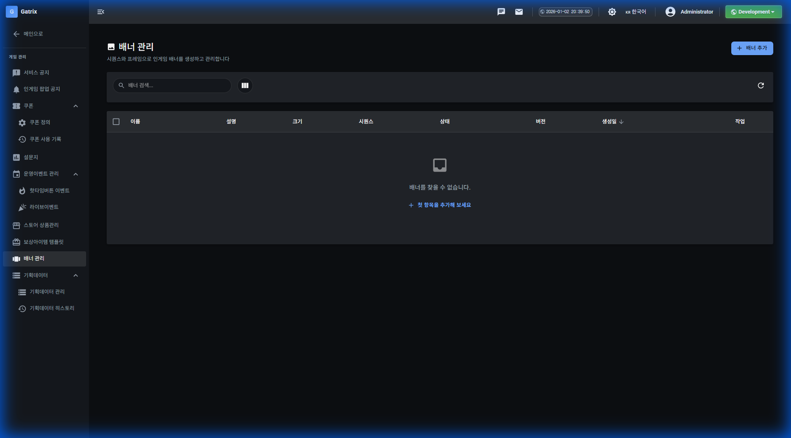

# 배너 관리

## 기능 설명

시퀀스와 프레임으로 인게임 배너를 생성하고 관리합니다.

**접근 경로:** 게임 관리 → 배너 관리

## 사용 방법

### 목록 화면

**페이지 헤더:**
- 제목: 배너 관리
- 설명: 시퀀스와 프레임으로 인게임 배너를 생성하고 관리합니다

**버튼:**
- 배너 추가

**테이블 컬럼:**
| 컬럼명 |
|--------|
| 이름 |
| 설명 |
| 크기 |
| 시퀀스 |
| 상태 |
| 버전 |
| 생성일 |
| 작업 |

## 즉시 발생하는 변화

[확인 필요]

## ⚠ 주의사항

[확인 필요]

## 🚨 실제 사고 사례

해당 없음
