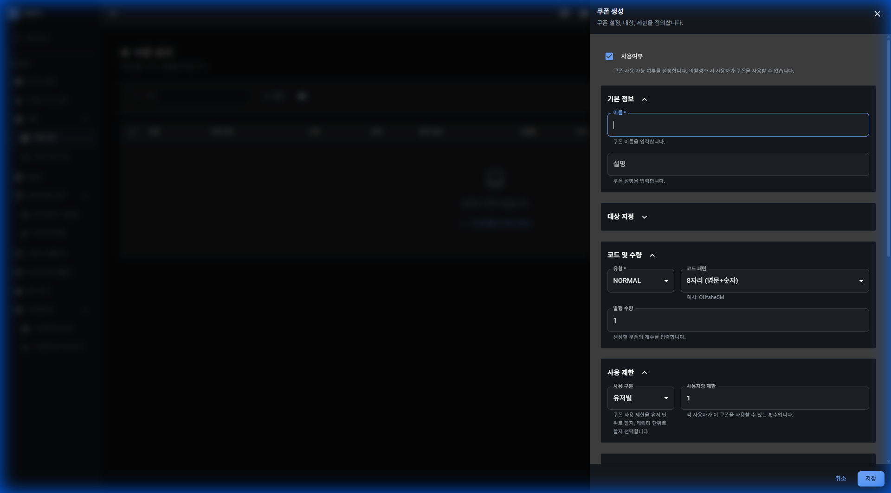

# 쿠폰

## 기능 설명

쿠폰을 생성하고 사용 내역을 관리합니다.

**접근 경로:** 게임 관리 → 쿠폰

## 사용 방법

### 쿠폰 정의

**접근 경로:** 게임 관리 → 쿠폰 → 쿠폰 정의

**페이지 헤더:**
- 제목: 쿠폰 정의
- 설명: 쿠폰 설정, 대상, 제한을 정의합니다.

**버튼:**
- + 쿠폰 생성
- SDK 연동 가이드

**테이블 컬럼:**
| 컬럼명 |
|--------|
| 이름 |
| 쿠폰 코드 |
| 유형 |
| 상태 |
| 참여 보상 |
| 사용률 |
| 시작 |
| 종료 |
| 생성일 |
| 설명 |
| 작업 |

### 쿠폰 생성

"+ 쿠폰 생성" 버튼 클릭 시 폼이 표시됩니다.

**입력 필드:**

| 필드명 | 타입 | 필수 | 설명 |
|--------|------|------|------|
| 사용여부 | Switch | - | 쿠폰 사용 기능 활성화/비활성화 |
| **기본 정보** | 섹션 | - | |
| ┗ 이름 | Text Input | 필수 | 쿠폰 이름 입력 |
| ┗ 설명 | Text Input | - | 쿠폰 설명 입력 |
| **대상 지정** | 섹션 | - | |
| **코드 및 수량** | 섹션 | - | |
| ┗ 유형 | Select | 필수 | 쿠폰 유형 선택 (기본값: NORMAL) |
| ┗ 코드 패턴 | Select | - | 쿠폰 생성 규칙 선택 (기본값: 8자리 (영문+숫자)) |
| ┗ 발행 수량 | Number | - | 생성할 쿠폰 개수 (기본값: 1) |
| **사용 제한** | 섹션 | - | |
| ┗ 사용 구분 | Select | - | 유저별/캐릭터별 선택 |
| ┗ 사용자당 제한 | Number | - | 각 사용자가 쿠폰을 사용할 수 있는 횟수 (기본값: 1) |
| **날짜 범위** | 섹션 | - | |
| ┗ 시작 일시 | Date & Time Picker | - | 쿠폰 사용 시작 시간 |
| ┗ 종료 일시 | Date & Time Picker | - | 쿠폰 사용 종료 시간 |

**버튼:**
- 취소
- 생성

### 쿠폰 사용 기록

**접근 경로:** 게임 관리 → 쿠폰 → 쿠폰 사용 기록

**페이지 헤더:**
- 제목: 쿠폰 사용 기록
- 설명: 쿠폰 사용 내역을 조회하고 필터링합니다.

**버튼:**
- 내보내기

**테이블 컬럼:**
| 컬럼명 |
|--------|
| 쿠폰 이름 |
| 쿠폰 코드 |
| 사용자 ID |
| 사용자명 |
| 캐릭터 ID |
| 순번 |
| 사용 일시 |
| 쿠폰 시작일 |
| 쿠폰 종료일 |
| 게임 월드 |
| 플랫폼 |
| 채널 |
| 서브채널 |

## 즉시 발생하는 변화

[확인 필요] 버튼 클릭 시 발생하는 변화 확인 필요

## ⚠ 주의사항

[확인 필요] 주의사항 확인 필요

## 🚨 실제 사고 사례

해당 없음
