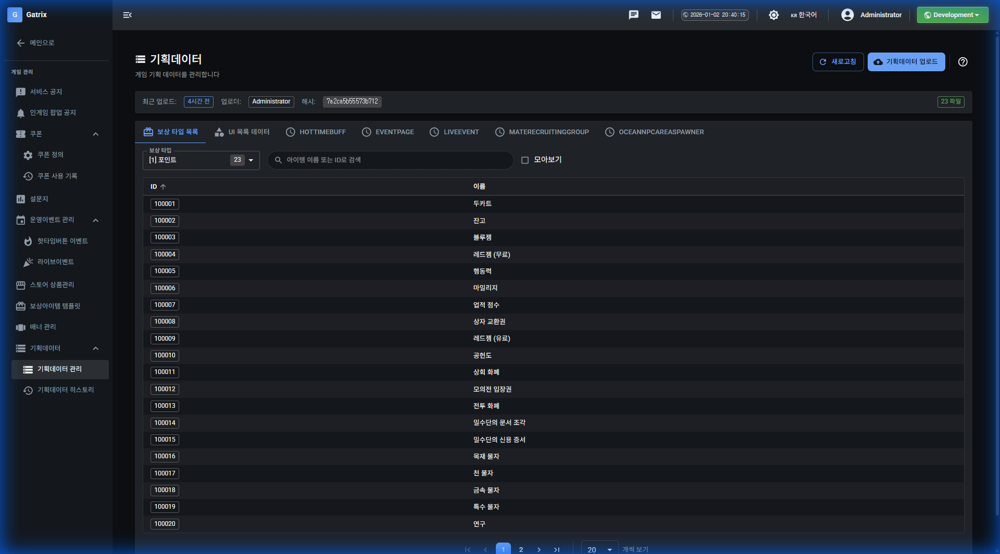

# 기획데이터

## 기능 설명

게임 기획 데이터를 관리합니다.

**접근 경로:** 게임 관리 → 기획데이터 → 기획데이터 관리

## 사용 방법

### 목록 화면

**페이지 헤더:**
- 제목: 기획데이터
- 설명: 게임 기획 데이터를 관리합니다

**버튼:**
- 새로고침
- 기획데이터 업로드

**표시 정보:**
- 최근 업로드 시간
- 업로더
- 해시값
- 총 파일 수

**데이터 탭:**
- 보상 타입 목록
- UI 목록 데이터
- HotTimeBuff
- EventPage
- LiveEvent
- MateRecruitingGroup
- OceanNpcAreaSpawner

**테이블 컬럼 (보상 타입 목록):**
| 컬럼명 |
|--------|
| ID |
| 이름 |

## 즉시 발생하는 변화

[확인 필요]

## ⚠ 주의사항

[확인 필요]

## 🚨 실제 사고 사례

해당 없음
