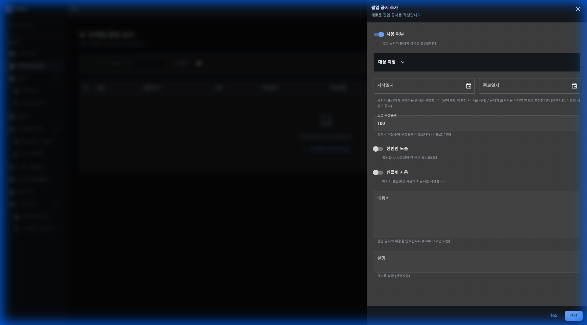

# 인게임 팝업 공지

## 기능 설명

게임 내 팝업 공지를 작성하고 관리합니다.

**접근 경로:** 게임 관리 → 인게임 팝업 공지

## 사용 방법

### 목록 화면

**페이지 헤더:**
- 제목: 인게임 팝업 공지
- 설명: 게임 내 팝업 공지를 작성하고 관리합니다

**버튼:**
- 팝업 공지 추가
- SDK 연동 가이드

**검색 및 필터:**
- 검색창 플레이스홀더: "내용 또는 설명으로 검색"
- 필터 버튼
- 컬럼 설정 (아이콘)

**테이블 컬럼:**
| 순서 | 컬럼명 |
|------|--------|
| 1 | (체크박스) |
| 2 | 내용 |
| 3 | 현재 표시 |
| 4 | 상태 |
| 5 | 우선순위 |
| 6 | 대상 설정 |
| 7 | 적용 기간 |
| 8 | 생성일 |
| 9 | 작업 |

**데이터 없음 상태:**
- 메시지: "등록된 팝업 공지가 없습니다."
- 버튼: "첫 항목을 추가해 보세요"

### 팝업 공지 추가

"팝업 공지 추가" 버튼 클릭 시 폼이 표시됩니다.

**폼 헤더:**
- 제목: 팝업 공지 추가
- 설명: 새로운 팝업 공지를 작성합니다

**입력 필드:**

| 필드명 | 타입 | 필수 | 설명 |
|--------|------|------|------|
| 사용 여부 | Switch | - | 팝업 공지의 활성화 상태를 설정합니다 |
| 대상 지정 | Accordion | - | (하위 필드 참조) |
| ┗ 대상 플랫폼 | Multi-Select | - | 쿠폰이 적용될 플랫폼을 선택합니다 (복수 선택 가능, 미선택 시 전체) |
| ┗ 대상 채널 | Multi-Select | - | 쿠폰이 적용될 채널을 선택합니다 (복수 선택 가능, 미선택 시 전체) |
| ┗ 대상 게임월드 | Multi-Select | - | 쿠폰이 적용될 게임월드를 선택합니다 (복수 선택 가능, 미선택 시 전체) |
| ┗ 대상 유저 ID 목록 | Text Input | - | 플레이스홀더: "user1, user2, user3...". 쿠폰을 사용할 수 있는 유저 ID를 입력합니다 (줄바꿈으로 구분, 미입력 시 전체) |
| 시작일시 | Date & Time Picker | - | 공지가 표시되기 시작하는 일시를 설정합니다 (선택사항, 미설정 시 바로 시작) |
| 종료일시 | Date & Time Picker | - | 공지가 표시되는 마지막 일시를 설정합니다 (선택사항, 미설정 시 영구 공지) |
| 노출 우선순위 | Number Input | - | 기본값: 100. 숫자가 작을수록 우선순위가 높습니다 |
| 한번만 노출 | Switch | - | 활성화 시 사용자당 한 번만 표시됩니다 |
| 템플릿 사용 | Switch | - | 메시지 템플릿을 사용하여 공지를 작성합니다 |
| 내용 | Textarea | 필수 | 플레이스홀더: "팝업 공지 내용을 입력하세요". 팝업 공지의 내용을 입력합니다 (Plain Text만 지원) |
| 설명 | Textarea | - | 관리용 설명 (선택사항) |

**버튼:**
- 취소
- 생성

## 즉시 발생하는 변화

[확인 필요] 생성 버튼 클릭 시 발생하는 변화 확인 필요

## ⚠ 주의사항

- 대상 지정 섹션의 도움말에 "쿠폰"이라는 문구가 표시됩니다. (화면에 표시된 그대로)

## 🚨 실제 사고 사례

해당 없음
