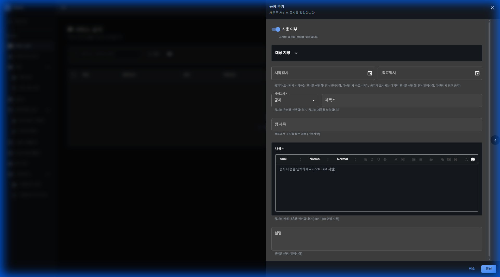

# 서비스 공지

## 기능 설명

서비스 공지사항을 작성하고 관리합니다.

**접근 경로:** 게임 관리 → 서비스 공지

## 사용 방법

### 목록 화면

**페이지 헤더:**
- 제목: 서비스 공지
- 설명: 서비스 공지사항을 작성하고 관리합니다

**버튼:**
- 미리보기
- 공지 추가
- 웹뷰 미리보기 (아이콘)
- URL 복사 (아이콘)
- 필터
- 컬럼 설정 (아이콘)
- 새로고침 (아이콘)

**검색:**
- 플레이스홀더: "제목 또는 내용으로 검색"

**테이블 컬럼:**
| 순서 | 컬럼명 |
|------|--------|
| 1 | (체크박스) |
| 2 | 제목 |
| 3 | 현재 표시 |
| 4 | 상태 |
| 5 | 카테고리 |
| 6 | 적용 대상 |
| 7 | 적용 기간 |
| 8 | 생성일 |
| 9 | 작업 |

**데이터 없음 상태:**
- 메시지: "공지가 없습니다"
- 버튼: "첫 항목을 추가해 보세요"

### 공지 추가

"공지 추가" 버튼 클릭 시 폼이 표시됩니다.

**폼 헤더:**
- 제목: 공지 추가
- 설명: 새로운 서비스 공지를 작성합니다.

**입력 필드:**

| 필드명 | 타입 | 필수 | 설명 |
|--------|------|------|------|
| 사용 여부 | Switch | - | 공지의 활성화 상태를 설정합니다 |
| 대상 지정 | 섹션 | - | 상세 대상을 지정하기 위한 섹션 |
| 시작일시 | Date & Time Picker | - | 공지가 표시되기 시작하는 일시를 설정합니다 (선택사항, 미설정 시 바로 시작) |
| 종료일시 | Date & Time Picker | - | 공지가 표시되는 마지막 일시를 설정합니다 (선택사항, 미설정 시 영구 공지) |
| 카테고리 | Select/Dropdown | 필수 | 공지의 유형을 선택합니다. 기본값: 공지 |
| 제목 | Text Input | 필수 | 공지의 제목을 입력합니다 |
| 탭 제목 | Text Input | - | 목록에서 표시될 짧은 제목 (선택사항) |
| 내용 | Rich Text Editor | 필수 | 공지의 상세 내용을 작성합니다. 플레이스홀더: "공지 내용을 입력하세요 (Rich Text 지원)". 서식: 굵게, 기울임, 밑줄, 취소선, 목록, 링크, 이미지, 동영상, 이모지 지원 |
| 설명 | Textarea | - | 관리용 설명 (선택사항) |

**버튼:**
- 창 닫기 (X 아이콘)
- 취소
- 생성

## 즉시 발생하는 변화

[확인 필요] 생성 버튼 클릭 시 발생하는 변화 확인 필요

## ⚠ 주의사항

[확인 필요] 주의사항 확인 필요

## 🚨 실제 사고 사례

해당 없음
