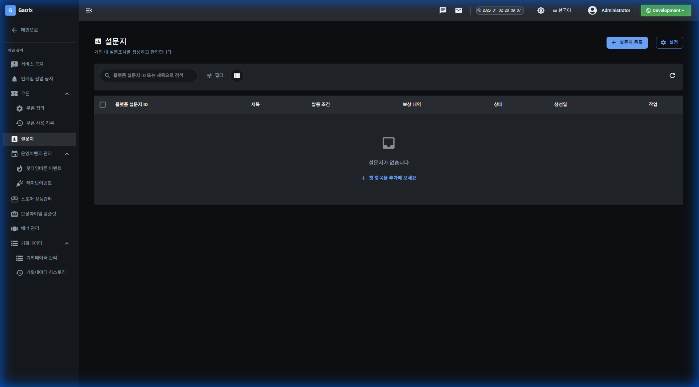

# 설문지

## 기능 설명

게임 내 설문조사를 생성하고 관리합니다.

**접근 경로:** 게임 관리 → 설문지

## 사용 방법

### 목록 화면

**페이지 헤더:**
- 제목: 설문지
- 설명: 게임 내 설문조사를 생성하고 관리합니다

**버튼:**
- 설문지 등록
- 설정

**테이블 컬럼:**
| 컬럼명 |
|--------|
| 플랫폼 설문지 ID |
| 제목 |
| 발동 조건 |
| 보상 내역 |
| 상태 |
| 생성일 |
| 작업 |

## 즉시 발생하는 변화

[확인 필요]

## ⚠ 주의사항

[확인 필요]

## 🚨 실제 사고 사례

해당 없음
