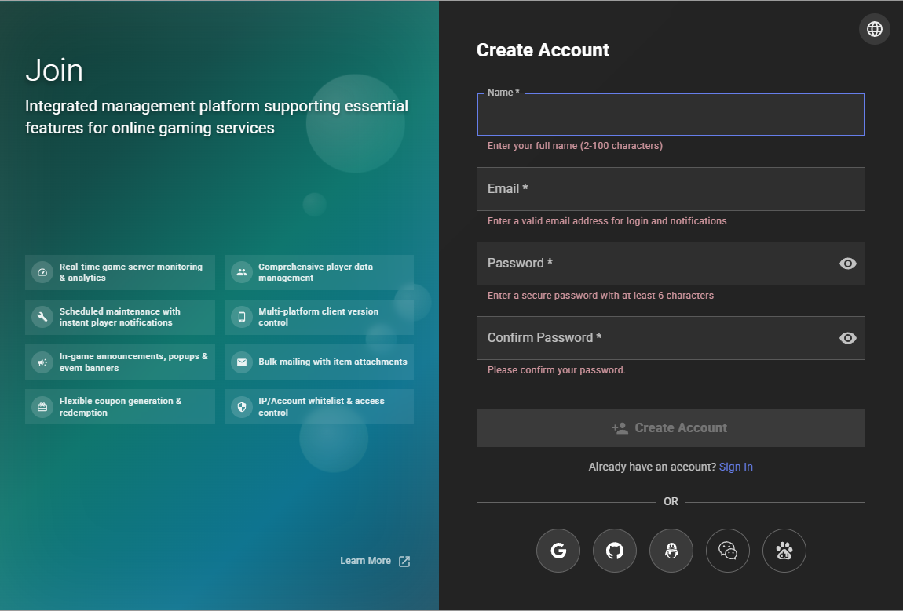
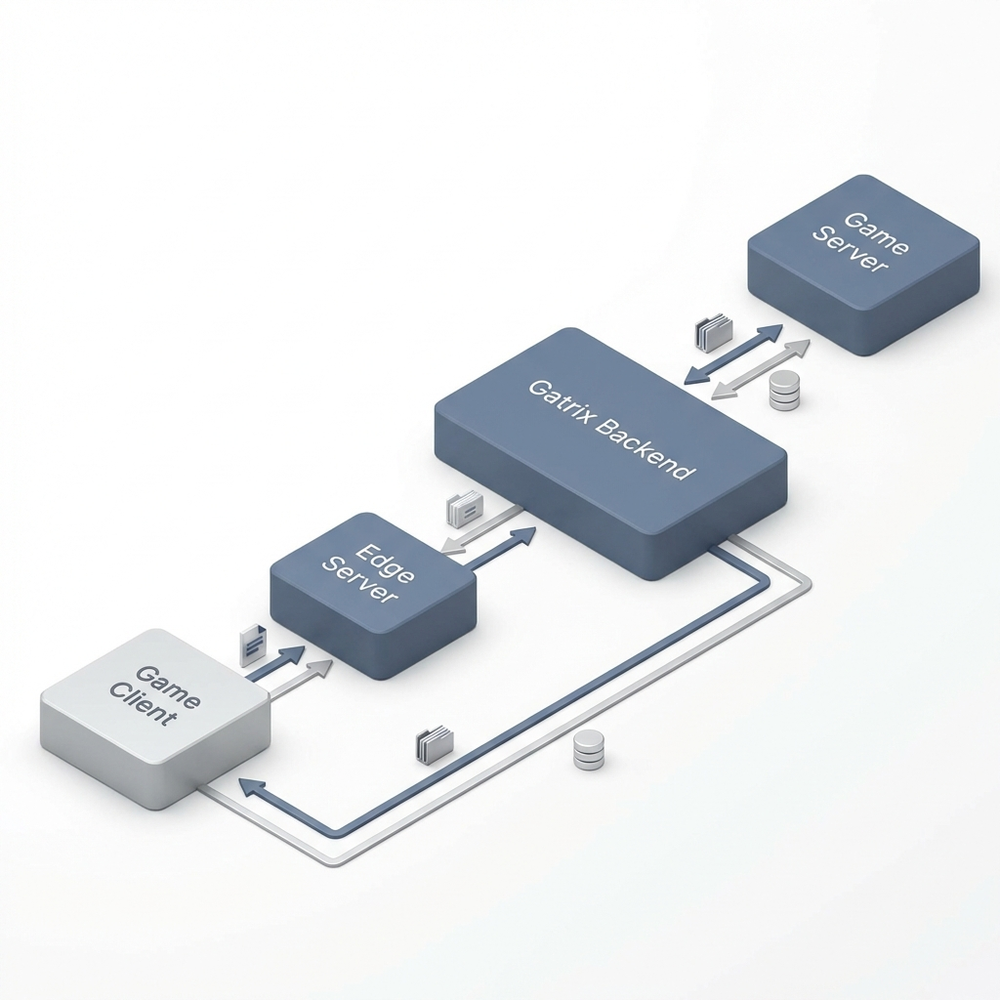
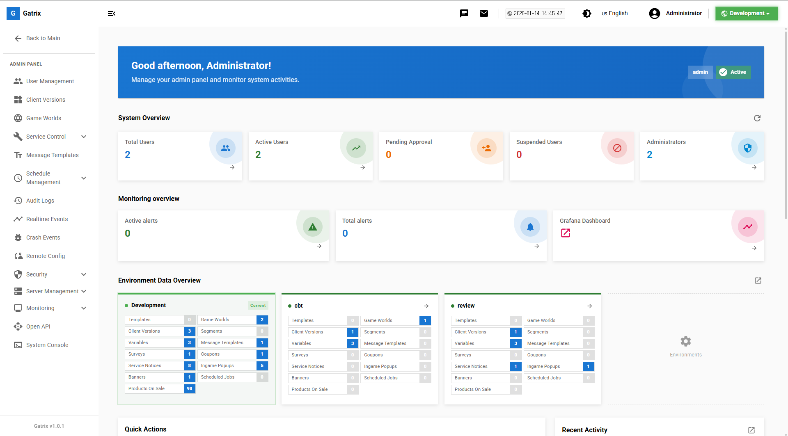
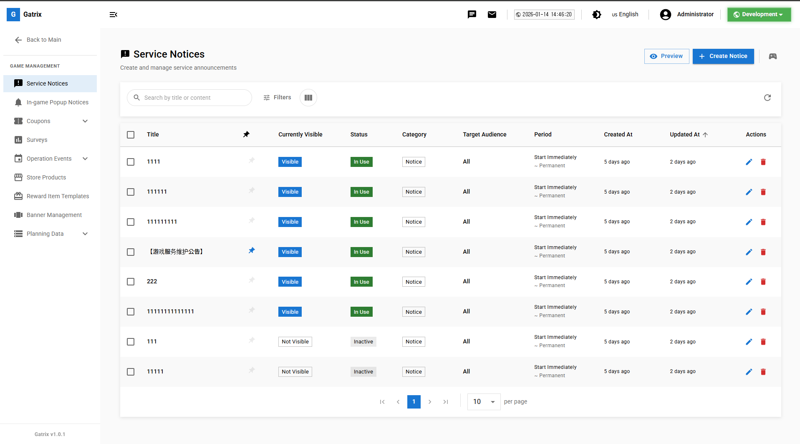

# 제 1장: 소개 (Introduction)

## Gatrix란 무엇인가요?

Gatrix는 온라인 게임 서비스 운영에 필요한 모든 기능을 통합적으로 관리할 수 있는 **게임 서비스 대시보드(Game Service Dashboard)**입니다. 

Gatrix를 통해 다음과 같은 업무를 수행할 수 있습니다:
- **게임 클라이언트 관리:** 앱 버전 등록, 강제 업데이트 설정, 점검 모드 전환
- **게임 월드 관리:** 게임 서버 등록 및 상태 관리 (혼잡도, 점검 중 표시 등)
- **플레이어 소통:** 공지사항, 인게임 팝업, 설문조사 등을 통한 정보 전달
- **프로모션:** 쿠폰 코드 발행, 배너 관리, 이벤트 진행
- **운영 모니터링:** 서버 상태 확인, 관리자 활동 로그(Audit Log) 추적
- **실시간 제어:** 클라이언트 패치 없이 게임 설정 변경 (Remote Config - 개발 중)

---

## 사용 대상

이 매뉴얼은 게임 서비스를 실제 운영하는 **게임 서비스 담당자(GM, 운영자, QA, 사업 PM)**를 위해 작성되었습니다.

주요 독자:
- 일일 게임 운영을 담당하는 운영자 (GM)
- 이벤트 및 프로모션을 기획하고 실행하는 사업 담당자
- 서버 점검 및 배포를 관리하는 기술 담당자
- 사용자 권한을 관리하는 최고 관리자

> **참고:** 이 매뉴얼은 개발자가 아닌 **사용자(운영자)** 관점에서 작성되었습니다. SDK 연동 등 기술적인 내용은 포함되어 있지 않습니다.

---

## 시스템 요구사항

### 브라우저 지원
Gatrix 대시보드는 최신 웹 표준을 준수하며, 다음 브라우저에서 최적화되어 있습니다:
- **Google Chrome** (권장)
- **Microsoft Edge**
- **Mozilla Firefox**
- **Safari**

### 기타
- 안정적인 인터넷 연결
- 사내 보안 정책에 따른 VPN 접속 (필요시)

---

## 접속하기

### 로그인

1. 브라우저에서 Gatrix 대시보드 주소로 접속합니다.
2. **이메일(아이디)**과 **비밀번호**를 입력합니다.
3. **로그인** 버튼을 클릭합니다.

> **🎬 영상 가이드:** [로그인 방법 보기](videos/00-login.mp4)

> **처음이신가요?** 관리자로부터 초대 메일을 받으셨다면, 메일 내 링크를 클릭하여 계정을 생성해 주세요.

### 회원가입

초대 메일을 받은 후 계정을 생성하는 과정입니다.

> **🎬 영상 가이드:** [회원가입 방법 보기](videos/01-register.mp4)

### 계정 상태

- **활성 (Active):** 정상적으로 이용 가능한 상태입니다.
- **대기 (Pending):** 관리자 승인을 기다리는 중입니다. 승인 전까지는 로그인할 수 없습니다.
- **정지 (Suspended):** 계정이 비활성화되었습니다. 관리자에게 문의하세요.

### 비밀번호 찾기

비밀번호를 잊으셨나요?
1. 로그인 화면에서 **"비밀번호 찾기"** 링크를 클릭하세요.
2. 가입한 이메일 주소를 입력하면 재설정 링크가 발송됩니다.

> **🎬 영상 가이드:** [비밀번호 재설정 방법 보기](videos/02-resetpassword.mp4)

---

## 3. 시스템 구조 및 흐름

Gatrix와 클라이언트, 게임 서버 간의 상호작용 흐름입니다.

---

## 4. 인터페이스 둘러보기

### 메인 화면 구성

| 영역 | 설명 |
|------|------|
| **상단 헤더** | 로고, 환경 선택기, 알림, 프로필 메뉴 |
| **좌측 사이드바** | 메인 네비게이션 메뉴 |
| **중앙 콘텐츠** | 현재 페이지의 주요 내용 |

### 환경 선택기 (Environment Selector)

상단 헤더의 **환경 선택기**는 매우 중요합니다. 현재 작업 중인 환경이 어디인지 항상 확인하세요.

- **Development (개발):** 새로운 기능 테스트 용도
- **Staging (스테이징):** 배포 전 최종 확인 용도
- **Production (운영/라이브):** **실제 플레이어가 접속하는 환경**

> **⚠️ 중요:** 운영 환경(Production)에서의 변경 사항은 즉시 실제 유저들에게 반영됩니다. 작업 전에 반드시 상단의 환경 이름을 확인하세요!

### 사이드바 메뉴

- **대시보드:** 전체 현황 요약
- **관리 (Admin):** 사용자 관리, 서버 설정, 시스템 모니터링 등 테크니컬 설정
- **게임 (Game):** 공지사항, 쿠폰, 배너 등 플레이어 대상 콘텐츠 관리
- **설정 (Settings):** 시스템 전역 설정

---

## 공통 기능

### 목록 및 테이블
대부분의 관리 페이지는 데이터 목록을 보여줍니다.
- **검색:** 이름이나 ID로 항목을 찾습니다.
- **필터:** 상태, 날짜 등으로 목록을 좁혀서 봅니다.
- **정렬:** 컬럼 제목을 클릭하여 오름차순/내림차순 정렬합니다.

### 액션 버튼
| 버튼 | 설명 |
|------|------|
| **+ 생성 / 추가** | 새로운 항목을 만듭니다. |
| **수정 (연필 아이콘)** | 기존 내용을 변경합니다. |
| **삭제 (휴지통 아이콘)** | 항목을 삭제합니다. (주의 필요) |
| **새로고침** | 최신 데이터로 목록을 갱신합니다. |

---

## 시작하기 팁

1. **내 권한 확인:** 본인에게 부여된 권한에 따라 메뉴가 보이거나 안 보일 수 있습니다. 필요한 메뉴가 없다면 관리자에게 요청하세요.
2. **개발 환경 활용:** 익숙하지 않은 기능은 **Development** 환경에서 먼저 테스트해 보세요.
3. **저장 습관:** 내용을 수정하고 반드시 **[저장]** 버튼을 눌러야 반영됩니다.
4. **환경 확인:** 작업 전 상단의 환경 선택기를 반드시 확인하세요. Production에서의 실수는 즉시 유저에게 영향을 줍니다.

---

## 다국어(로컬라이징) 메시지 안내

Gatrix는 공지사항, 점검 메시지, 팝업 등에서 **다국어 메시지**를 지원합니다.

### 다국어 메시지가 필요한 경우

- 글로벌 동시 서비스 (한국, 일본, 미국 등)
- 앱스토어 심사 시 현지 언어 필요
- 다양한 언어권 유저 대상 서비스

### 단일 국가 서비스 시

> **💡 단일 국가에서만 서비스하는 경우** (예: 한국 전용 또는 중국 전용 서비스), 다국어 메시지 설정은 **필요하지 않습니다.**

- **기본 메시지만 입력**하면 됩니다. 기본 언어는 **운영자가 사용하는 서비스 국가의 언어**가 됩니다.
  - 예: 한국 서비스 → 한국어가 기본 언어
  - 예: 중국 서비스 → 중국어(간체)가 기본 언어
- "언어별 메시지 사용" 옵션은 비활성화 상태로 두세요.
- 번역 작업 부담 없이 빠르게 운영할 수 있습니다.

| 서비스 지역 | 다국어 메시지 | 권장 설정 |
|------------|:------------:|----------|
| 한국 단독 | 불필요 | 기본 메시지(한국어)만 입력 |
| 중국 단독 | 불필요 | 기본 메시지(중국어)만 입력 |
| 한국 + 일본 | 필요 | 한국어/일본어 입력 |
| 글로벌 | 필수 | 주요 언어 모두 입력 |

---

## 동영상 가이드 모음

주요 기능별 동영상 가이드입니다. 각 영상을 클릭하여 재생할 수 있습니다.

### 🔐 로그인
<video width="100%" controls>
  <source src="videos/00-login.mp4" type="video/mp4">
  브라우저가 비디오를 지원하지 않습니다.
</video>

### 📝 회원가입
<video width="100%" controls>
  <source src="videos/01-register.mp4" type="video/mp4">
  브라우저가 비디오를 지원하지 않습니다.
</video>

### 🔑 비밀번호 재설정
<video width="100%" controls>
  <source src="videos/02-resetpassword.mp4" type="video/mp4">
  브라우저가 비디오를 지원하지 않습니다.
</video>

---

**다음 장:** [제 2장: 대시보드 개요 →](02-dashboard.md)
