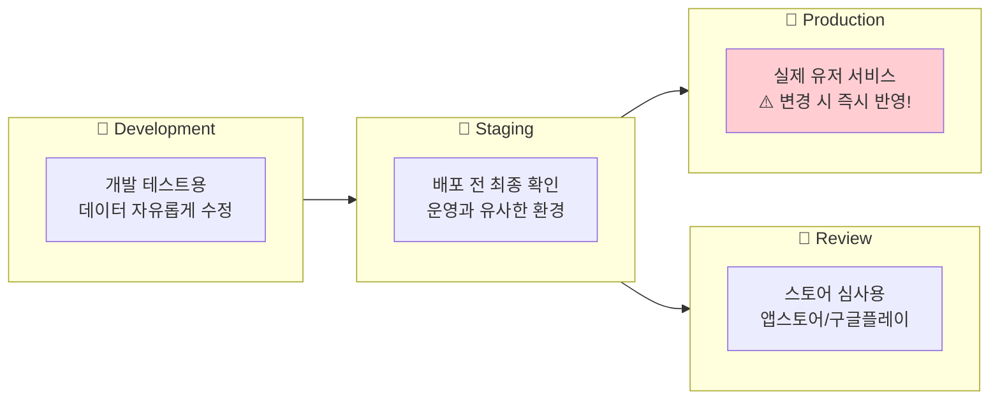
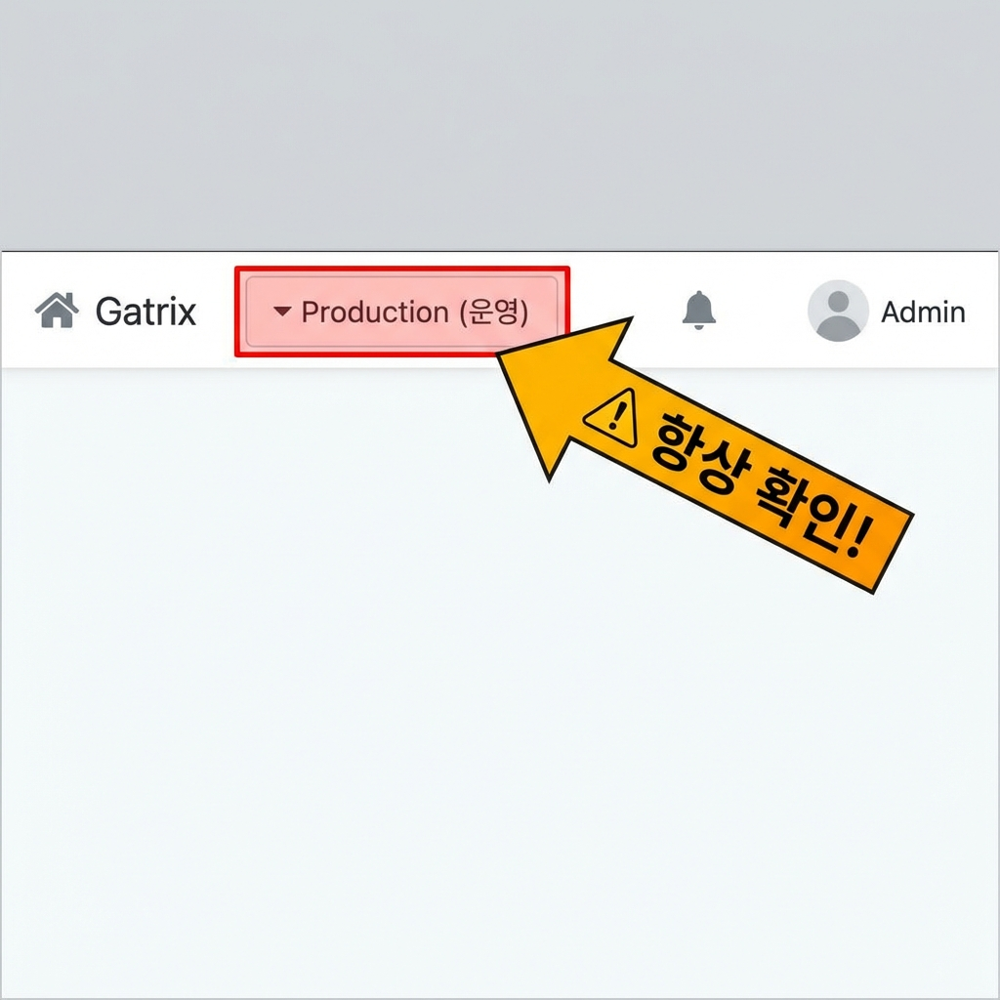
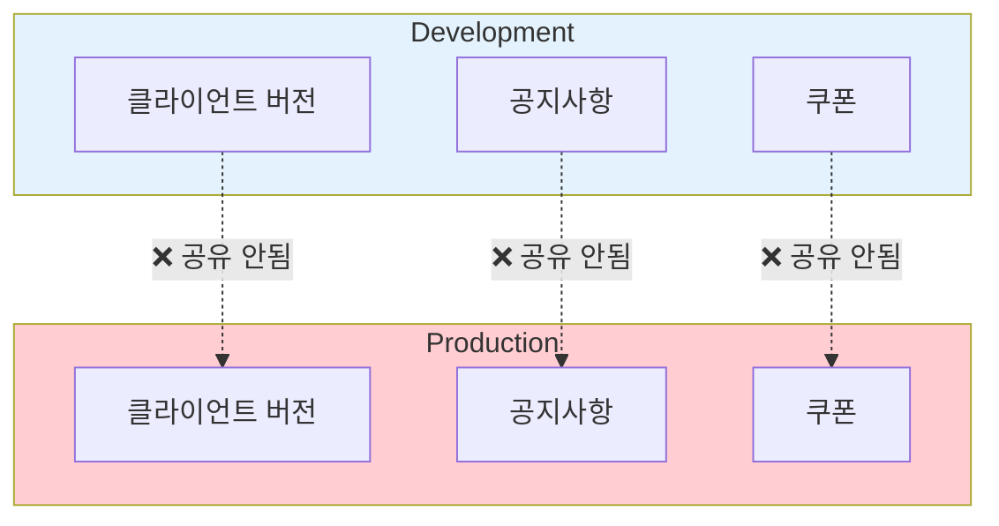
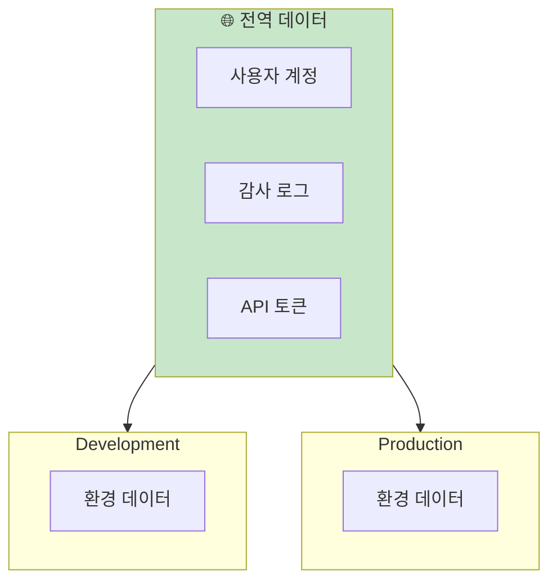
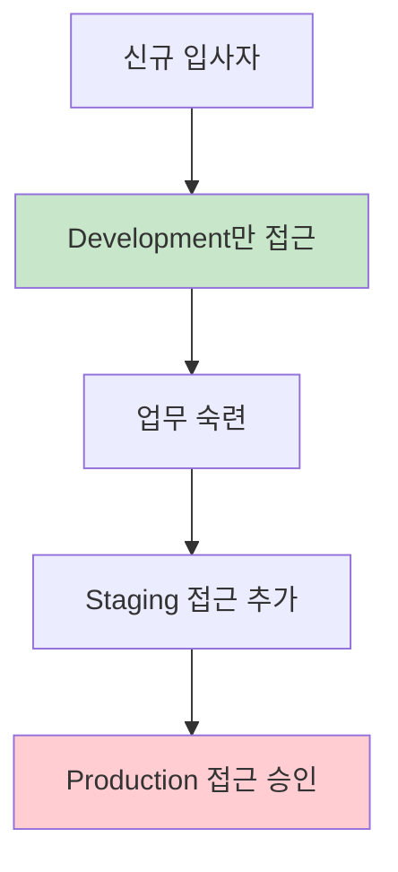
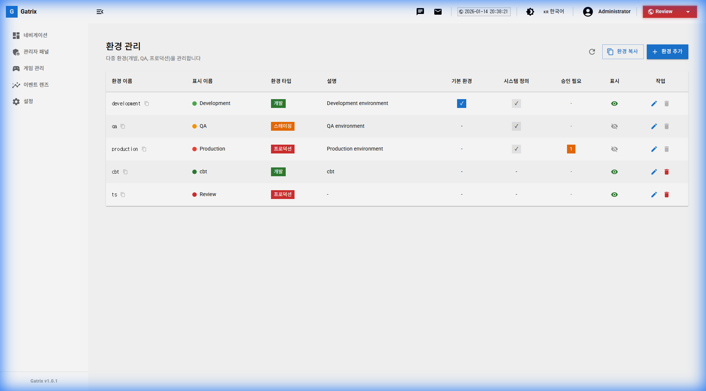
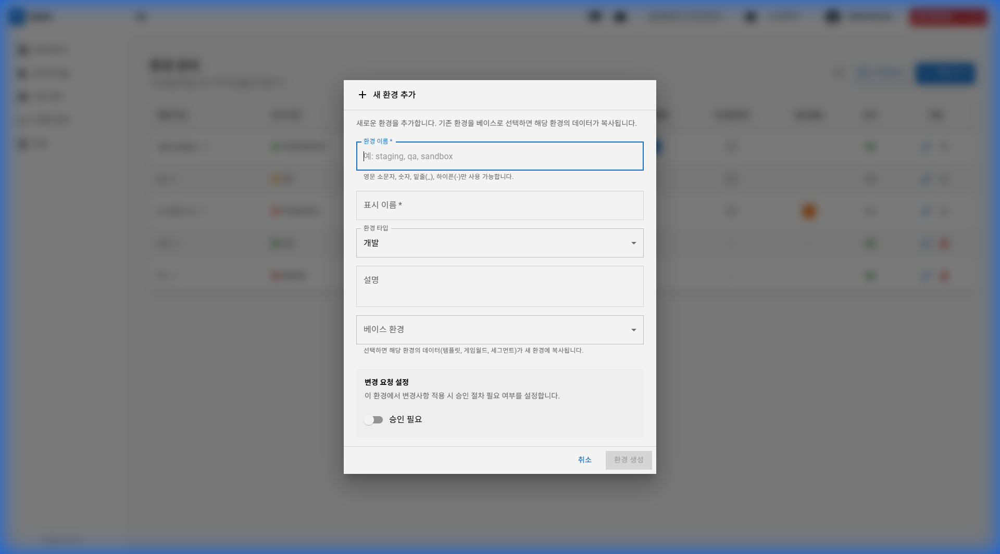
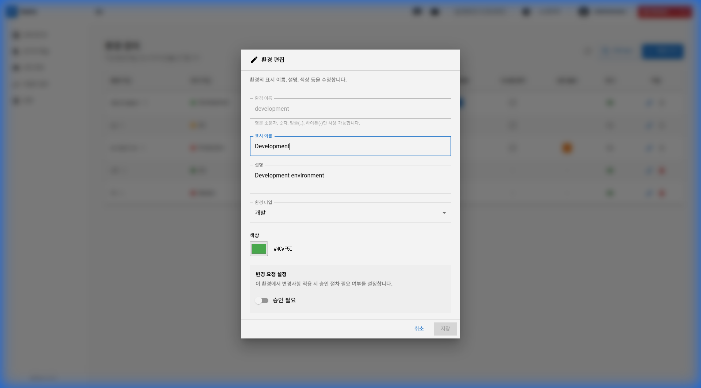

# 제 2-1장: 환경 관리 (Environment Management)

Gatrix는 **여러 환경(Environment)**을 지원하여 개발, 테스트, 운영을 효과적으로 분리할 수 있습니다. 이 장에서는 환경별 데이터 격리와 공유 정책, 그리고 환경 혼동을 방지하는 방법을 설명합니다.

---

## 1. 환경이란?

환경(Environment)은 **독립된 데이터 공간**입니다. 각 환경은 별도의 게임 서버, 설정, 콘텐츠를 가질 수 있습니다.

### 일반적인 환경 구성

| 환경            | 용도                   |  주의 수준  |
| --------------- | ---------------------- | :---------: |
| **Development** | 새 기능 개발 및 테스트 |   🟢 낮음   |
| **Staging**     | 배포 전 최종 검증      |   🟡 중간   |
| **Review**      | 스토어 심사팀 접속용   |   🟡 중간   |
| **CBT**         | 클로즈드 베타 테스트   |   🟡 중간   |
| **Production**  | **실제 유저 서비스**   | 🔴 **높음** |

---

## 2. 환경 선택기

상단 헤더의 **환경 선택 드롭다운**에서 현재 작업 환경을 선택합니다.

> **⚠️ 경고:** 환경 선택을 확인하지 않고 작업하면, 테스트용 데이터가 운영 환경에 등록되거나, 운영 데이터가 삭제되는 심각한 사고가 발생할 수 있습니다!

---

## 3. 환경별 데이터 격리 정책

### 🔒 환경별로 격리되는 데이터 (독립적)

아래 데이터는 **각 환경마다 별도로 관리**됩니다. 한 환경에서 수정해도 다른 환경에 영향을 주지 않습니다.

| 데이터              | 설명                         |
| ------------------- | ---------------------------- |
| **클라이언트 버전** | 환경별로 다른 버전 정책 가능 |
| **게임 월드**       | 환경별 서버 목록             |
| **서비스 점검**     | 환경별 점검 상태             |
| **공지사항**        | 환경별 공지 내용             |
| **인게임 팝업**     | 환경별 팝업 설정             |
| **쿠폰**            | 환경별 쿠폰 발행             |
| **배너**            | 환경별 배너 설정             |
| **기획 데이터**     | 환경별 데이터 버전           |
| **리모트 컨피그**   | 환경별 설정 값               |

### 데이터 격리 및 공유 구조

### 🌐 환경과 무관하게 공유되는 데이터 (전역)

아래 데이터는 **모든 환경에서 공유**됩니다. 한 곳에서 수정하면 모든 환경에 반영됩니다.

| 데이터             | 설명                                         |
| ------------------ | -------------------------------------------- |
| **사용자 계정**    | 운영자 계정은 전역으로 관리                  |
| **환경 접근 권한** | 사용자별 환경 접근 권한은 전역 설정          |
| **API 토큰**       | 환경 지정은 있지만 토큰 목록은 전역 조회     |
| **감사 로그**      | 모든 환경의 활동이 통합 기록                 |
| **화이트리스트**   | 환경별로 별도 관리 가능하나 설정에 따라 공유 |

---

## 4. 환경 혼동 방지 가이드

### ❌ 흔한 실수 사례

| 실수                            | 결과                           | 예방법            |
| ------------------------------- | ------------------------------ | ----------------- |
| Production에서 테스트 공지 등록 | 실제 유저에게 테스트 문구 노출 | 환경 확인 후 작업 |
| Dev에서 작업 후 Prod 미등록     | 운영에 콘텐츠 누락             | 체크리스트 사용   |
| Prod에서 데이터 삭제 테스트     | 실제 데이터 영구 삭제          | Dev에서 테스트    |
| 환경별 쿠폰 코드 혼동           | 잘못된 코드 배포               | 환경 명시 습관    |

### ✅ 환경 혼동 방지 체크리스트

**작업 전:**

- [ ] 상단 환경 선택기에서 **현재 환경 확인**
- [ ] Production인 경우 **정말 필요한 작업인지 재확인**
- [ ] 대용량 작업 시 **먼저 Dev에서 테스트**

**작업 후:**

- [ ] 의도한 환경에 데이터가 등록되었는지 확인
- [ ] 다른 환경에 잘못 등록되지 않았는지 확인
- [ ] Production 작업 시 **팀원에게 공유**

### 💡 환경 구분 팁

1. **색상 구분**: Production 환경은 빨간색 테두리로 표시됩니다.
2. **이름 확인**: 환경 선택기의 텍스트를 소리 내어 읽어보세요.
3. **작업 로그**: 중요 작업 시 사내 메신저에 "Production에서 OO 작업 시작" 알림

---

## 5. 환경 간 데이터 복사

일부 데이터는 환경 간 복사가 가능합니다.

### 복사 가능한 항목

| 항목                | 방법                                        |
| ------------------- | ------------------------------------------- |
| **클라이언트 버전** | 목록에서 복사 버튼 → 대상 환경에서 붙여넣기 |
| **공지사항**        | 수동으로 내용 복사 후 재등록                |
| **기획 데이터**     | 동일 파일을 각 환경에 업로드                |

### 복사 시 주의사항

- **서버 주소**: Dev와 Prod의 게임 서버 주소가 다름
- **쿠폰 코드**: 중복 발급 방지를 위해 환경별 별도 운영 권장
- **날짜/시간**: 시간대(Timezone) 설정 동일한지 확인

---

## 6. 환경별 권한 관리

사용자마다 접근 가능한 환경을 제한할 수 있습니다.

### 권한 설정 예시

| 역할          | Development | Staging | Review | Production |
| ------------- | :---------: | :-----: | :----: | :--------: |
| 신규 운영자   |     ✅      |   ❌    |   ❌   |     ❌     |
| 일반 운영자   |     ✅      |   ✅    |   ✅   |     ❌     |
| 시니어 운영자 |     ✅      |   ✅    |   ✅   |     ✅     |
| 관리자        |     ✅      |   ✅    |   ✅   |     ✅     |

> **💡 권장:** 신규 입사자는 처음 1~2주간 Development만 접근하도록 설정하여 실수를 방지하세요.

## 7. 환경 추가/편집/삭제

환경을 직접 추가, 수정, 삭제할 수 있습니다.

**경로:** 설정 (Settings) → 환경 관리 (Environment Management)  
**필요 권한:** `environments.manage`

### 환경 목록 화면

#### 테이블 컬럼 설명

| 컬럼            | 설명                                             |
| --------------- | ------------------------------------------------ |
| **환경 이름**   | 시스템 내부 식별자 (예: development, production) |
| **표시 이름**   | 대시보드에 표시되는 이름                         |
| **환경 타입**   | Development / Staging / Production               |
| **설명**        | 환경에 대한 부가 설명                            |
| **기본 환경**   | 새 사용자의 기본 접속 환경                       |
| **시스템 정의** | 시스템에서 자동 생성한 환경 여부                 |
| **승인 필요**   | 변경 시 승인 프로세스 필요 여부                  |
| **표시**        | 환경 선택기에 표시 여부                          |
| **작업**        | ✏️ 편집, 🗑️ 삭제 버튼                            |

---

### 환경 추가하기

**[환경 추가]** 버튼을 클릭하여 새 환경을 생성합니다.

#### 입력 항목

| 항목               | 필수 | 설명                                                 |
| ------------------ | :--: | ---------------------------------------------------- |
| **환경 이름**      |  ✅  | 시스템 내부 식별자 (영문, 소문자, 언더스코어만 사용) |
| **표시 이름**      |  ✅  | 대시보드에 표시될 이름                               |
| **환경 타입**      |  ✅  | Development / Staging / Production 중 선택           |
| **설명**           |      | 환경 용도에 대한 설명                                |
| **베이스 환경**    |      | 기존 환경의 데이터를 복사할 경우 선택                |
| **승인 필요 설정** |      | 이 환경에서 변경 시 승인 절차 필요 여부              |

> **💡 베이스 환경 기능:** 새 환경 생성 시 기존 환경을 선택하면, 해당 환경의 데이터(월드, 세그먼트, 템플릿 등)가 복사됩니다.

---

### 환경 편집하기

목록에서 **[✏️ 편집]** 버튼을 클릭하여 환경 설정을 수정합니다.

#### 수정 가능한 항목

| 항목               | 설명                                    |
| ------------------ | --------------------------------------- |
| **환경 이름**      | 변경 불가 (시스템 식별자)               |
| **표시 이름**      | 대시보드 표시명 변경 가능               |
| **설명**           | 환경 설명 변경                          |
| **환경 타입**      | Development / Staging / Production 변경 |
| **색상**           | 환경 구분용 색상 코드 (예: #4CAF50)     |
| **승인 필요 설정** | 승인 프로세스 활성화/비활성화           |

> **⚠️ 주의:** Production 환경의 설정을 변경할 때는 신중하게 진행하세요.

---

### 환경 삭제하기

목록에서 **[🗑️ 삭제]** 버튼을 클릭하여 환경을 삭제합니다.

> **⚠️ 경고:** 환경을 삭제하면 해당 환경의 **모든 데이터(클라이언트 버전, 공지사항, 쿠폰 등)**가 영구 삭제됩니다! 복구할 수 없습니다.

**삭제 전 확인 사항:**

- [ ] 해당 환경에 중요 데이터가 없는지 확인
- [ ] 백업이 필요한 데이터는 미리 내보내기
- [ ] 다른 팀원에게 삭제 사실 공유

---

### 환경 복사하기

기존 환경의 데이터를 포함한 새 환경을 빠르게 생성할 수 있습니다.

1. 환경 목록에서 **[복사]** 버튼 클릭
2. 새 환경 이름 입력
3. 복사할 데이터 범위 선택
4. **[생성]** 클릭

---

## 8. 자주 묻는 질문 (FAQ)

**Q: 환경을 새로 추가하려면 어떻게 하나요?**

A: 설정 → 환경 관리에서 **[환경 추가]** 버튼을 클릭하여 새 환경을 생성할 수 있습니다. `environments.manage` 권한이 필요합니다.

---

**Q: 실수로 Production에 테스트 데이터를 넣었어요!**

A: 즉시 해당 데이터를 비활성화하거나 삭제하세요. 그리고 감사 로그에서 영향 범위를 확인하고 팀에 공유하세요.

---

**Q: Dev에서 작업한 내용을 Prod에 일괄 적용할 수 있나요?**

A: 현재는 자동 동기화 기능이 없습니다. 각 환경에서 개별적으로 등록해야 합니다. 단, 새 환경 생성 시 베이스 환경을 선택하면 데이터를 복사할 수 있습니다.

---

**Q: 환경 삭제 시 데이터가 복구 가능한가요?**

A: 아니요, 환경 삭제 시 해당 환경의 모든 데이터가 영구 삭제됩니다. 삭제 전 반드시 백업하세요.

---

**Q: "승인 필요" 설정은 무엇인가요?**

A: 이 설정을 활성화하면, 해당 환경에서 데이터 변경 시 상위 관리자의 승인이 필요합니다. Production 환경에 권장되는 설정입니다.

---

**이전 장:** [← 제 2장: 대시보드 개요](02-dashboard.md)  
**다음 장:** [제 3장: 사용자 관리 →](03-user-management.md)
