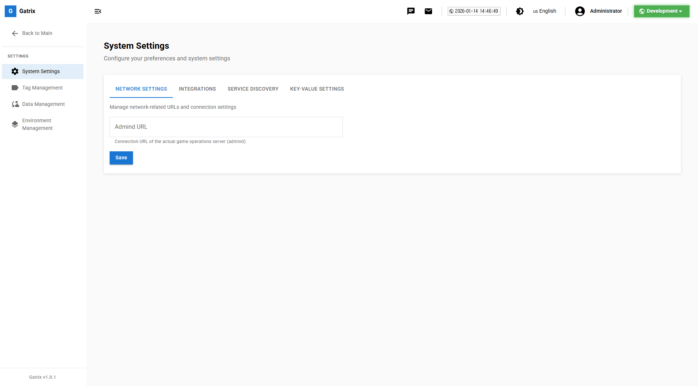

# 제 2장: 대시보드 개요 (Dashboard Overview)

로그인 후 가장 먼저 만나는 화면이 바로 **대시보드**입니다. 현재 게임 서비스의 주요 지표와 상태를 한눈에 파악할 수 있도록 구성되어 있습니다.

---

## 대시보드 화면 구성

### 1. 환영 문구 및 개인 정보

상단에는 접속 시간에 따른 환영 인사와 로그인한 사용자의 이름, 역할(Admin/User)이 표시됩니다.

### 2. 주요 통계 카드 (Statistics Cards)

현재 환경의 주요 데이터 현황을 숫자로 보여줍니다. 각 카드를 클릭하면 해당 관리 페이지로 바로 이동합니다.

- **Environments:** 구성된 총 환경 수
- **Users:** 대시보드에 등록된 관리자 수
- **Game Worlds:** 등록된 게임 서버 수
- **Active Notices:** 현재 게시 중인 공지사항 수
- **Coupons:** 진행 중인 쿠폰 캠페인 수

### 3. 빠른 작업 (Quick Actions)

자주 사용하는 기능으로 바로 이동할 수 있는 단축 버튼입니다.

| 기능                           | 설명                                             |
| ------------------------------ | ------------------------------------------------ |
| **공지사항 (Service Notices)** | 새로운 공지사항을 작성하거나 관리합니다.         |
| **점검 (Maintenance)**         | 긴급 점검을 설정하거나 예정된 점검을 확인합니다. |
| **쿠폰 (Coupons)**             | 새로운 프로모션 쿠폰을 생성합니다.               |
| **클라이언트 버전**            | 앱 업데이트 정책을 변경합니다.                   |

### 4. 환경별 데이터 현황

운영 중인 모든 환경(Dev, Stage, Prod 등)의 데이터 개수를 요약해서 보여줍니다. 특정 환경에 데이터가 누락되지 않았는지 비교할 때 유용합니다.

### 5. 최근 활동 내역 (Recent Activities)

누가, 언제, 무엇을 변경했는지 실시간 로그를 보여줍니다.
예: `"관리자A님이 '주말 이벤트' 공지사항을 수정했습니다. (5분 전)"`

> **팁:** 더 자세한 전체 로그가 필요하다면 **관리 > 감사 로그 (Audit Logs)** 메뉴를 이용하세요.

### 6. 클라이언트 크래시 요약 (Crash Events)

최근 플레이어들에게 발생한 앱 충돌(Crash) 리포트 현황을 보여줍니다. 갑작스러운 크래시 증가를 모니터링하여 신속하게 대응할 수 있습니다.

### 7. 서버 라이프사이클 (Server Lifecycle)

현재 백엔드 서버들의 상태 신호(Heartbeat)를 보여줍니다.

- 🟢 **Ready:** 정상 작동 중
- 🔴 **Stopped:** 중지됨
- 🟡 **Starting:** 시작 중

### 8. 점검 상태 알림

현재 점검 중인 경우, 대시보드 상단에 **"점검 중 (MAINTENANCE)"** 배너가 큼지막하게 표시됩니다. 실수로 운영 중인 줄 알고 데이터를 조작하는 일을 방지해 줍니다.

---

## 대시보드 개인화

### 테마 변경 (다크 모드)

눈의 피로를 줄이기 위해 다크 모드를 지원합니다.

1. 우측 상단 **프로필 아이콘** 클릭
2. **설정 (Settings)** 선택
3. 테마(Theme)에서 **Dark** 또는 **Light** 선택

### 언어 변경

대시보드 UI 언어를 변경할 수 있습니다.

1. 우측 상단 **프로필 아이콘** 클릭
2. **설정 (Settings)** 선택
3. 언어(Language)에서 **한국어**, **English**, **中文** 중 선택

---

> **💡 참고:** 대시보드에 표시되는 데이터는 현재 상단에서 선택된 **환경(Environment)**에 대한 데이터입니다. 다른 환경의 현황을 보고 싶다면 상단 환경 선택기를 변경하세요.

---

**이전 장:** [← 제 1장: 소개](01-introduction.md)  
**다음 장:** [제 3장: 사용자 관리 →](03-user-management.md)
