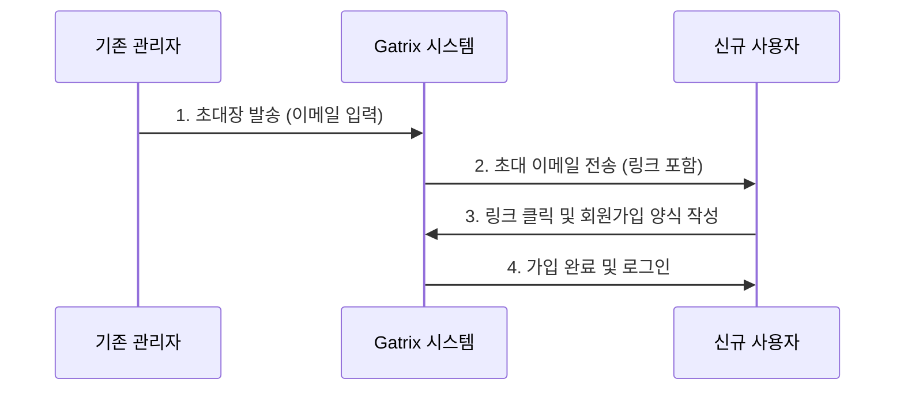
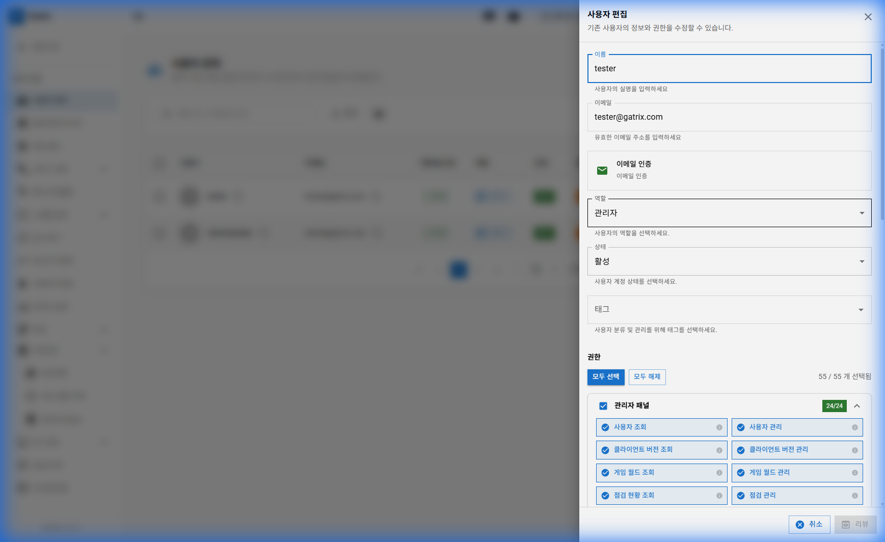
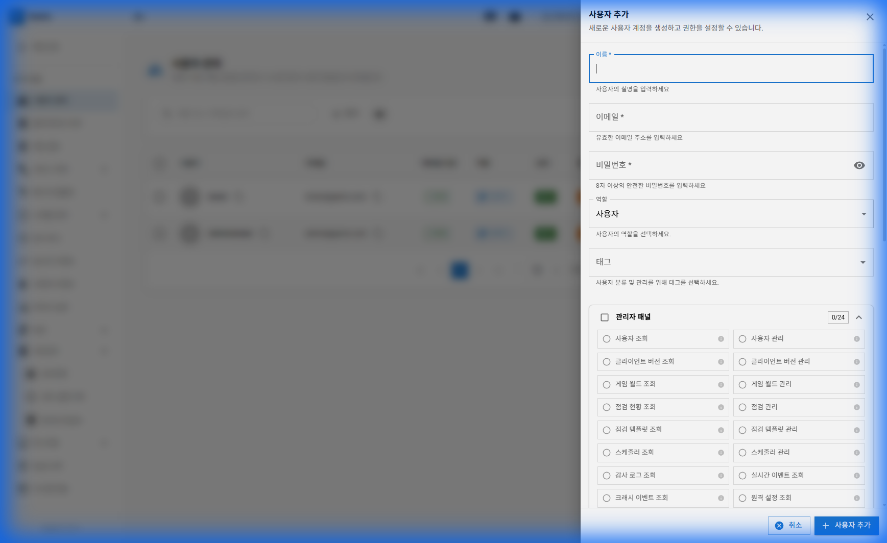
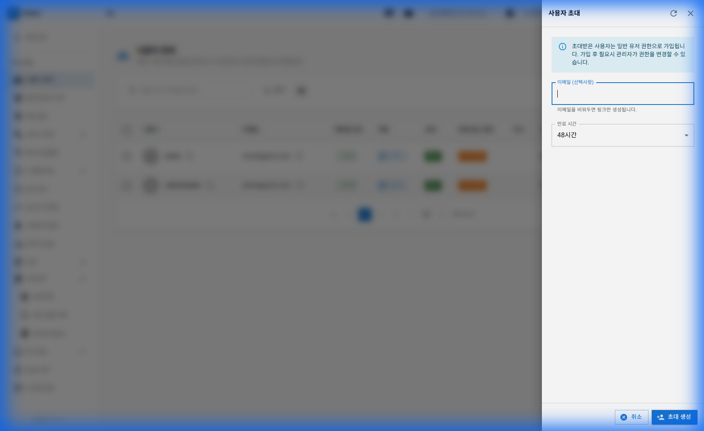
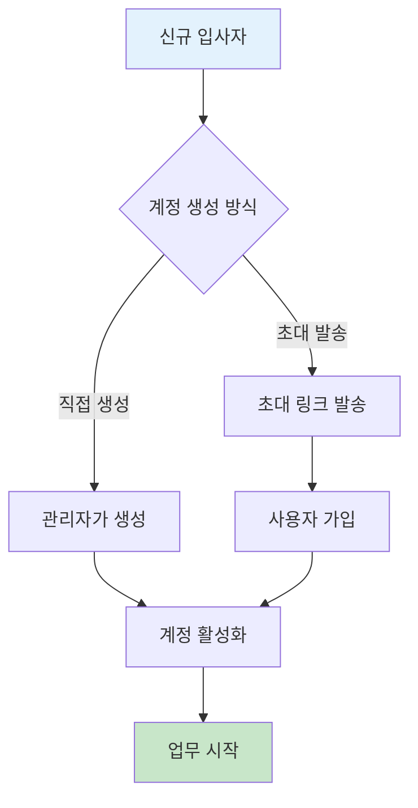
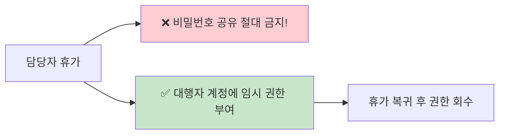
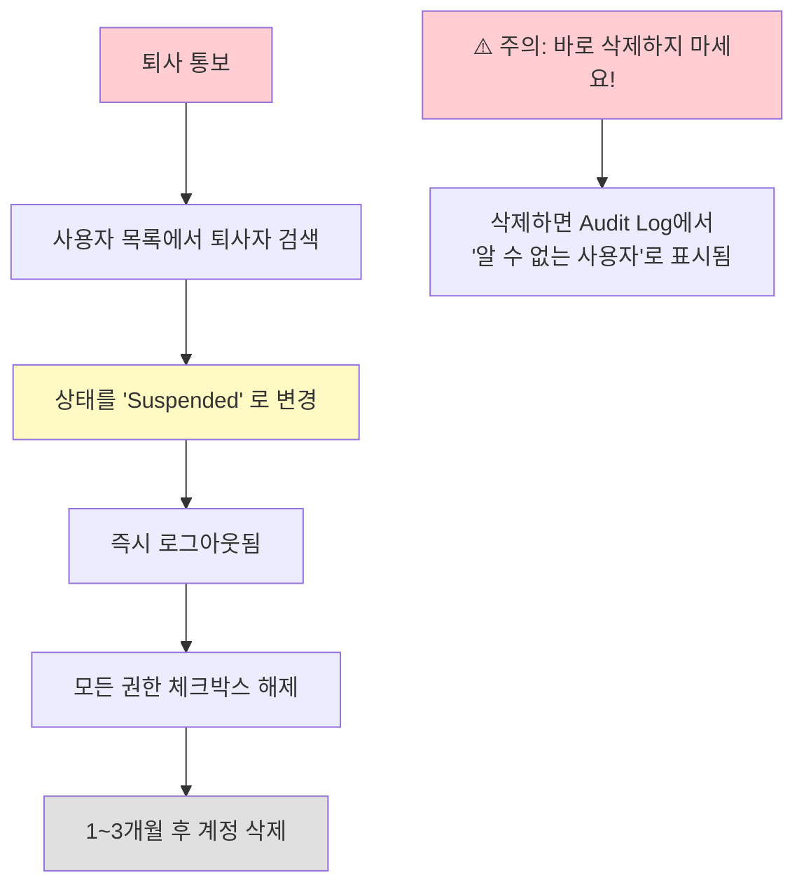

# 제 3장: 사용자 관리 (User Management)

사용자 관리는 대시보드에 접속할 수 있는 운영자 계정을 관리하고 권한을 제어하는 기능입니다. 이 챕터에서는 단순한 기능 설명을 넘어, 입사/퇴사 등 실제 업무 상황에서의 처리 절차를 안내합니다.

**경로:** 관리 (Admin) → 사용자 (Users)  
**필요 권한:** `users.manage` (수정 시), `users.view` (조회 시)

> **🎬 영상 가이드:** [사용자 관리 방법 보기](videos/03-usermanagement.mp4)

---

## 1. 화면 구성

사용자 관리 페이지의 전체 화면입니다.

### 3.1 초대 기반 가입 프로세스

### 상단 툴바 버튼 설명

| 버튼 | 설명 |
|------|------|
| **사용자 추가** | 이름, 이메일, 비밀번호를 직접 입력하여 계정을 즉시 생성합니다. |
| **새 초대 생성** | 이메일로 초대 링크를 발송합니다. 사용자가 직접 가입하도록 유도할 때 사용합니다. |

> **⚠️ 중요: SMTP 설정 필수**
>
> 이메일 발송 기능(초대장 발송, 비밀번호 재설정 등)을 사용하려면 **SMTP 서버 설정**이 올바르게 되어 있어야 합니다.
> SMTP가 설정되지 않은 경우 이메일이 발송되지 않으며, 이 기능을 사용할 수 없습니다.
>
> 🔧 **관리자 가이드:** 상세 설정 방법은 **[부록 A: 시스템 설정 가이드](A-setup-guide.md)**를 참고하세요.

### 테이블 컬럼 설명

| 컬럼 | 설명 |
|------|------|
| **사용자** | 사용자 이름 (프로필 사진 포함) |
| **이메일** | 로그인에 사용하는 이메일 주소 |
| **이메일 인증** | 이메일 인증 완료 여부 |
| **역할** | 관리자(Admin) 또는 사용자(User) |
| **상태** | 활성(Active), 대기(Pending), 정지(Suspended) |
| **환경 접근 권한** | 접근 가능한 환경 목록 (Dev, Staging, Production 등) |
| **태그** | 분류용 태그 |
| **가입일** | 계정 생성 일시 |
| **마지막 로그인** | 최근 접속 일시 |
| **작업** | ✏️ 편집, 🗑️ 삭제 버튼 |

---

## 2. 역할(Role) 및 권한 구조

Gatrix의 권한 시스템은 **역할(Role)**과 **세부 권한(Permissions)**의 조합으로 이루어집니다.

### 역할 (Role)

사용자의 기본적인 등급을 결정합니다.

| 역할 | 설명 | 추천 대상 |
|------|------|----------|
| **User (사용자)** | 기본 사용자. **조회(View)** 기능 위주입니다. 데이터를 수정하거나 삭제할 수 없습니다. | 신규 입사자, 단순 모니터링 담당자, 타 부서 참관인 |
| **Admin (관리자)** | 관리자. 대부분의 **수정(Edit)** 권한을 가질 수 있습니다. | 게임 운영자, 사업 PM, QA 담당자, 개발자 |

### 세부 권한 (Permissions)

Admin 역할이라도 모든 것을 할 수 있는 것은 아닙니다. 업무에 필요한 권한만 부여하세요.

**주요 권한 목록:**

| 권한 | 설명 | 추천 대상 |
|------|------|----------|
| `users.manage` | 동료 계정을 생성/수정/삭제 | 팀장급 |
| `game-worlds.manage` | 서버 상태 변경 | 서버/인프라 담당 |
| `coupons.manage` | 쿠폰 발행 | 사업/마케팅 담당 |
| `service-notices.manage` | 공지사항 작성 | 운영자 |
| `audit-logs.view` | 감사 로그 조회 | 보안 담당 |
| `maintenance.manage` | 점검 관리 | 서버/인프라 담당 |

> **💡 원칙:** *"권한은 최소한으로 주고, 필요할 때 늘린다"* (Principle of Least Privilege)

---

## 3. 사용자 추가 방법

### 방법 1: 직접 추가

관리자가 직접 계정을 생성합니다.

**입력 항목:**

| 항목 | 필수 | 설명 |
|------|:----:|------|
| 이름 | ✅ | 사용자의 표시 이름 |
| 이메일 | ✅ | 로그인에 사용할 이메일 주소 |
| 비밀번호 | ✅ | 8자 이상의 안전한 비밀번호 |
| 역할 | ✅ | 관리자(Admin) 또는 사용자(User) |
| 태그 | | 분류용 태그 (복수 선택 가능) |
| 권한 채널 | | 세부 권한 설정 |

### 방법 2: 초대 링크 발송

사용자가 직접 가입하도록 초대합니다.

**입력 항목:**

| 항목 | 필수 | 설명 |
|------|:----:|------|
| 이메일 | ✅ | 초대할 이메일 주소 (복수 입력 가능) |
| 만료 시간 | | 초대 링크 유효 기간 (기본: 48시간) |

---

## 4. 상황별 업무 가이드 (Scenarios)

### 상황 A: 신규 운영자 입사 시 (온보딩)

신규 GM '홍길동'님이 입사했습니다.

**상세 절차:**

1. **[사용자 추가]** 또는 **[새 초대 생성]** 버튼 클릭
2. 이메일: `gildong.hong@company.com` 입력
3. 역할: 초기 적응을 위해 `User` 역할 부여 권장 (실수 방지)
4. 초대 방식의 경우, 링크를 복사하여 메신저로 전달
5. 홍길동님이 링크를 통해 가입 완료
6. 관리자가 목록에서 `Pending` → `Active`로 변경
7. 업무에 익숙해지면 `Admin`으로 승격 및 필요한 세부 권한 추가

### 상황 B: 담당자가 휴가/출장 갔을 때

특정 담당자만의 권한이 필요할 때 (예: 쿠폰 발행 권한이 김철수님에게만 있는데 휴가를 감)

- **절대 비밀번호를 공유받지 마세요.** (보안 위반)
- 최고 관리자에게 요청하여 **대행자의 계정에 임시로 권한을 부여**받으세요.
- 휴가 복귀 후 다시 권한을 회수하면 됩니다.

### 상황 C: 운영자 퇴사 시 (오프보딩)

보안 사고 방지를 위해 퇴사 즉시 접근을 차단해야 합니다.

**상세 절차:**

1. 사용자 목록에서 퇴사자 검색
2. **일시정지 (Suspend)** 버튼 클릭 → 즉시 로그아웃됨
3. 모든 권한 체크박스 해제
4. **⚠️ 중요:** 계정을 바로 **삭제하지 마세요.** 삭제하면 과거 로그(Audit Log)에서 퇴사자의 이름이 사라져서 "알 수 없는 사용자"로 표시됩니다. 1~3개월 후 삭제하는 것이 좋습니다.

---

## 5. 환경 접근 권한 관리

특정 사용자에게 특정 환경만 접근하도록 제한할 수 있습니다.

| 환경 | 설명 | 접근 허용 대상 |
|------|------|--------------|
| **Development** | 개발 환경 | 개발자, QA |
| **Staging** | 스테이징 환경 | QA, 운영자 |
| **Production** | 운영 환경 (실제 유저) | 승인된 운영자만 |
| **Review** | 스토어 심사용 환경 | 심사 담당자 |
| **CBT** | 클로즈드 베타 환경 | CBT 담당자 |

> **💡 팁:** 신규 입사자는 먼저 Development 환경만 접근하도록 설정하고, 익숙해진 후 Production 접근 권한을 부여하세요.

---

## 6. 자주 묻는 질문 (FAQ) & 문제 해결

**Q: 초대 메일이 안 온다고 합니다.**

A: 스팸 메일함을 먼저 확인해 주세요. 그래도 없다면, 초대 링크의 유효기간이 만료되었을 수 있습니다. 기존 초대를 삭제하고 다시 초대를 생성하여 링크를 직접 메신저로 전달해 주세요.

---

**Q: 갑자기 "권한이 없습니다(403 Forbidden)"라고 뜹니다.**

A: 다음을 확인하세요.
1. 관리자가 귀하의 권한 설정을 변경했을 수 있습니다.
2. 접속하려는 환경(Environment)에 대한 접근 권한이 없을 수도 있습니다.
3. 팀장님께 문의하세요.

---

**Q: 실수로 동료 계정을 정지시켰습니다.**

A: 당황하지 마세요. 목록에서 해당 사용자를 찾아 상태를 다시 **Active**로 변경하면 즉시 복구됩니다.

---

**Q: 비밀번호를 5회 틀려서 잠겼다고 합니다.**

A: 보안 정책상 잠긴 것입니다. 관리자 화면에서 해당 사용자의 편집 버튼을 클릭하고 **[비밀번호 초기화 메일 발송]**을 눌러주세요.

---

## 7. 권한 관리 체크리스트

### 신규 입사자 온보딩 체크리스트

- [ ] 계정 생성 완료 (직접 추가 또는 초대)
- [ ] 역할 설정 (초기에는 User 권장)
- [ ] 환경 접근 권한 설정 (Development부터 시작)
- [ ] 필요한 세부 권한 부여
- [ ] 본인에게 로그인 정보 전달

### 퇴사자 오프보딩 체크리스트

- [ ] 계정 상태를 Suspended로 변경
- [ ] 모든 세부 권한 해제
- [ ] 환경 접근 권한 해제
- [ ] 1~3개월 후 계정 삭제 예약

---

## 8. 트러블슈팅 케이스

### 🔴 케이스 1: 초대 메일이 도착하지 않아요

**증상:** 초대 링크를 발송했는데 메일을 받지 못함

**원인 및 해결:**

| 원인 | 해결 방법 |
|------|----------|
| 스팸 메일함 | 스팸/정크 폴더 확인 |
| 메일 주소 오타 | 이메일 주소 정확히 입력했는지 확인 |
| 사내 메일 필터 | IT팀에 화이트리스트 요청 |
| 초대 유효기간 만료 | 새 초대 생성 후 직접 링크 공유 |

---

### 🔴 케이스 2: 비밀번호를 잊어버렸어요

**증상:** 사용자가 비밀번호를 분실하여 로그인 불가

**해결 방법:**
1. 로그인 페이지 → "비밀번호 찾기" 클릭
2. 등록된 이메일로 재설정 링크 발송
3. 메일 확인 후 새 비밀번호 설정

관리자가 직접 재설정하려면:
1. 사용자 관리 → 해당 사용자 편집
2. **[비밀번호 초기화 메일 발송]** 클릭

---

### 🔴 케이스 3: 권한이 없다고 표시돼요 (403 Forbidden)

**증상:** 특정 메뉴나 기능에 접근 시 "권한이 없습니다" 오류

**원인 및 해결:**

| 원인 | 해결 방법 |
|------|----------|
| 해당 권한 미부여 | 관리자에게 권한 요청 |
| 환경 접근 권한 없음 | 해당 환경 접근 권한 추가 |
| 세션 만료 | 로그아웃 후 재로그인 |
| 역할(Role) 부족 | User → Admin 승격 필요 |

---

## 9. 동영상 가이드

### 사용자 관리 전체 흐름
<video width="100%" controls>
  <source src="videos/03-usermanagement.mp4" type="video/mp4">
  브라우저가 비디오를 지원하지 않습니다.
</video>

---

**이전 장:** [← 제 2장: 대시보드 개요](02-dashboard.md)  
**다음 장:** [제 4장: 클라이언트 버전 관리 →](04-client-versions.md)
