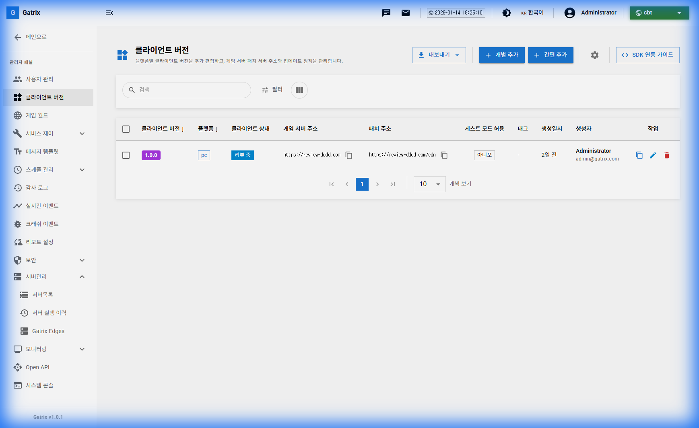
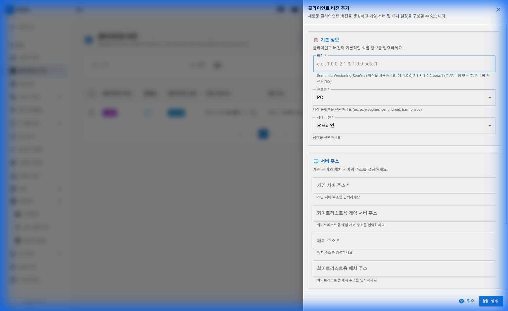
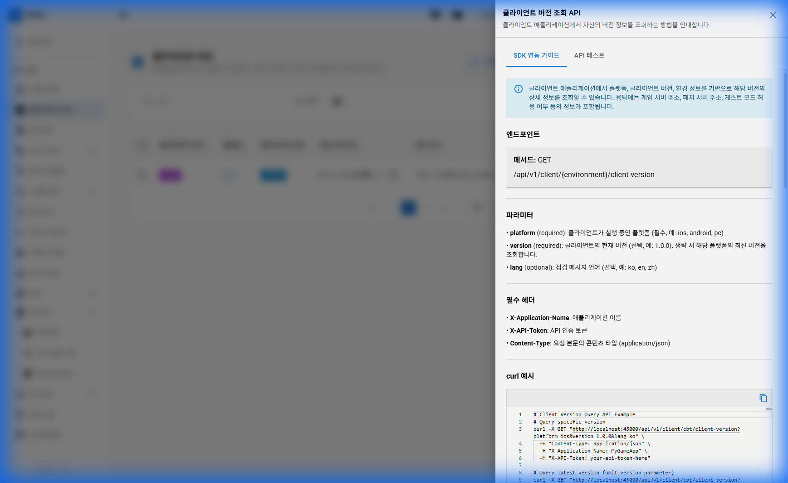
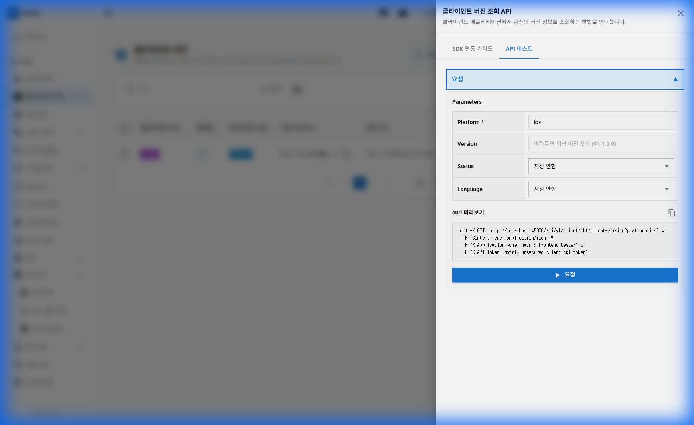
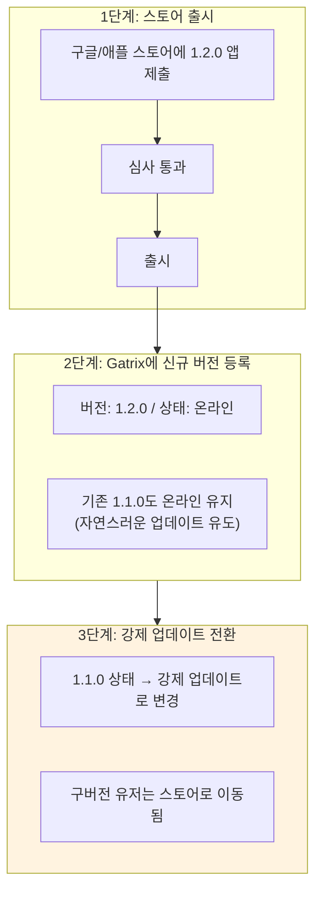
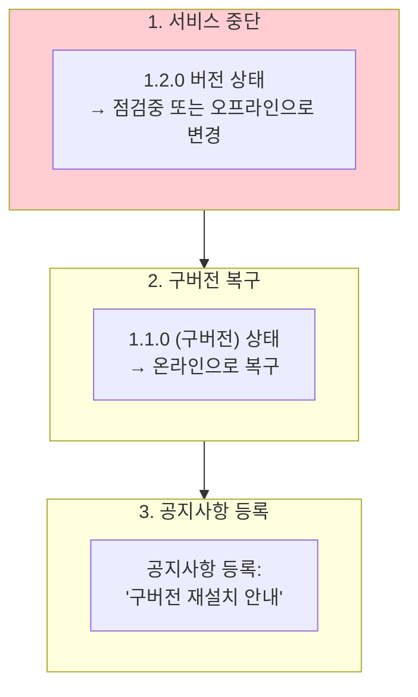

# 제 4장: 클라이언트 버전 관리 (Client Version Management)

앱 업데이트 시 가장 핵심이 되는 기능입니다. 사용자의 앱 버전과 서버의 허용 버전을 매칭하여 "업데이트를 받을지", "게임을 계속할지"를 결정합니다.

**경로:** 관리 (Admin) → 클라이언트 버전 (Client Versions)  
**필요 권한:** `client-versions.manage`

> **🎬 영상 가이드:** [클라이언트 버전 관리 방법 보기](videos/04-clientversions.mp4)

---

## 1. 화면 구성

클라이언트 버전 관리 페이지의 전체 화면입니다.

### 상단 툴바 버튼 설명

화면 상단에는 다음과 같은 버튼들이 있습니다:

| 번호 | 버튼                | 설명                                                                              |
| :--: | ------------------- | --------------------------------------------------------------------------------- |
|  ①   | **내보내기**        | 현재 버전 리스트를 CSV/Excel 파일로 내보냅니다. 백업이나 외부 공유 시 유용합니다. |
|  ②   | **개별 추가**       | 서버 주소, 화이트리스트 설정 등 모든 항목을 직접 지정하여 새 버전을 추가합니다.   |
|  ③   | **간편 추가**       | 버전과 플랫폼만 입력하면 나머지는 기본값을 사용합니다. 빠른 등록에 적합합니다.    |
|  ④   | **SDK 연동 가이드** | 클라이언트 개발자를 위한 API 문서와 테스트 도구를 제공합니다.                     |

### 테이블 컬럼 설명

| 컬럼                 | 설명                                             |
| -------------------- | ------------------------------------------------ |
| **클라이언트 버전**  | SemVer 형식의 버전 번호 (예: 1.0.0, 2.1.3)       |
| **플랫폼**           | PC, iOS, Android, HarmonyOS 등 클라이언트 플랫폼 |
| **클라이언트 상태**  | 업데이트 정책 상태 (온라인, 강제 업데이트 등)    |
| **게임 서버 주소**   | 게임 로직 서버 URL                               |
| **패치 주소**        | CDN 또는 패치 다운로드 URL                       |
| **게스트 모드 허용** | 비로그인 상태로 게임 가능 여부                   |
| **태그**             | 분류용 태그 (필터링에 활용)                      |
| **생성일시**         | 버전 등록 일시                                   |
| **생성자**           | 버전을 등록한 관리자                             |
| **작업**             | 🔄 복사, ✏️ 편집, 🗑️ 삭제 버튼                   |

### 필터 및 검색 기능

- **검색창:** 버전 번호로 빠르게 검색합니다.
- **상세 필터:** 플랫폼, 상태 등으로 목록을 필터링합니다.
- **컬럼 설정:** 표시할 컬럼을 커스터마이징합니다.

---

## 2. 버전 상태 (Status) 완전 정복

상태를 잘못 설정하면 유저가 게임에 접속하지 못하거나, 심각한 버그가 있는 버전으로 계속 게임을 하게 됩니다.

| 상태                  | 아이콘 | 화면 예시                                           | 언제 쓰나요?                     |
| --------------------- | :----: | --------------------------------------------------- | -------------------------------- |
| **온라인**            |   🟢   | (아무 팝업 없음)                                    | 현재 문제가 없는 정상 버전일 때  |
| **오프라인**          |   ⚫   | "서비스가 종료되었습니다."                          | 서비스 중단 상태                 |
| **권장 업데이트**     |   🔵   | "새로운 기능이 추가되었습니다. [나중에] [업데이트]" | 마이너 버그 수정, 편의성 개선 등 |
| **강제 업데이트**     |   🟠   | "필수 업데이트가 필요합니다. [확인]"                | 시즌 시작, 치명적 버그 수정 시   |
| **리뷰 중**           |   🟡   | (심사팀 전용 접속)                                  | 스토어 심사 중인 버전            |
| **접속불가&패치허용** |   🟣   | "점검 중이지만 패치를 받을 수 있습니다."            | 게임은 막고 패치만 허용          |
| **점검중**            |   🔴   | "현재 점검 중입니다."                               | 특정 버전 차단 필요 시           |

> **⚠️ 주의:** 운영 환경(Production)에서 상태를 변경하면 **즉시** 실제 유저에게 반영됩니다. 변경 전 반드시 테스트 환경에서 검증하세요.

---

## 3. 버전 추가하기

### 개별 추가 (상세 설정)

**[개별 추가]** 버튼을 클릭하면 아래와 같은 폼이 나타납니다.

#### 입력 항목 상세 설명

| 섹션          | 항목                          | 필수 | 설명                                              |
| ------------- | ----------------------------- | :--: | ------------------------------------------------- |
| **기본 정보** | 버전                          |  ✅  | SemVer 형식으로 입력 (예: 1.0.0, 2.1.3-beta.1)    |
|               | 플랫폼                        |  ✅  | PC, iOS, Android, HarmonyOS 등 선택               |
|               | 상태 라벨                     |  ✅  | 위 상태 중 선택 (기본값: 온라인)                  |
| **서버 주소** | 게임 서버 주소                |  ✅  | 게임 로직 서버 URL (예: https://game.example.com) |
|               | 화이트리스트용 게임 서버 주소 |      | 테스터/심사팀용 별도 서버 URL                     |
|               | 패치 주소                     |      | CDN 또는 패치 서버 URL                            |
|               | 화이트리스트용 패치 주소      |      | 테스터/심사팀용 별도 패치 URL                     |
| **기타**      | 태그                          |      | 분류용 태그 (복수 선택 가능)                      |
|               | 게스트 모드 허용              |      | 비로그인 플레이 허용 여부                         |

#### 화이트리스트 기능이란?

특정 **계정 ID** 또는 **IP 주소**를 화이트리스트에 등록하면, 해당 사용자는 일반 서버 대신 **화이트리스트용 서버 주소**로 연결됩니다.

**활용 예시:**

- 스토어 심사팀이 새 버전을 테스트할 때 (심사 계정 ID 등록)
- 내부 QA팀이 개발 서버에서 테스트할 때 (사내 IP 등록)
- 베타 테스터에게 별도 서버 제공 시

### 간편 추가

빠르게 버전만 등록하고 싶을 때 사용합니다.

- 버전과 플랫폼만 입력
- 서버 주소는 **플랫폼별 기본값** 자동 적용
- 상태는 '온라인'으로 기본 설정

> **팁:** 기본값을 잘 설정해 두면 간편 추가로 수초 내에 버전 등록이 가능합니다.

---

## 4. 플랫폼별 기본값 설정

각 플랫폼에 대해 공통으로 사용할 기본 서버 주소를 미리 설정합니다.

**설정 항목:**

- 게임 서버 주소 (기본값)
- 패치 주소 (기본값)
- 화이트리스트용 서버 주소 (기본값)

설정된 기본값은 **간편 추가** 시 자동으로 적용됩니다.

---

## 5. SDK 연동 가이드

클라이언트에서 버전 정보를 조회할 수 있는 API를 제공합니다.

### API 가이드 탭

**[SDK 연동 가이드]** 버튼을 클릭하면 아래와 같은 화면이 나타납니다.

#### 표시 정보

| 항목           | 설명                                              |
| -------------- | ------------------------------------------------- |
| **엔드포인트** | `GET /api/v1/client/{environment}/client-version` |
| **파라미터**   | platform (필수), version (필수), lang (선택)      |
| **필수 헤더**  | X-Application-Name, X-API-Token, Content-Type     |
| **curl 예시**  | 복사하여 터미널에서 바로 테스트 가능              |

### API 테스트 탭

실제 API를 호출해 볼 수 있는 테스트 도구입니다.

#### 테스트 방법

1. **Platform** 선택 (ios, android, pc 등)
2. **Version** 입력 (예: 1.0.0)
3. **Status**, **Language** 선택 (선택사항)
4. **curl 미리보기**에서 명령어 확인
5. **[요청]** 버튼 클릭하여 실제 API 호출
6. 응답 결과 확인

> **활용 팁:** 버전 등록 후 API 테스트 탭에서 올바르게 응답되는지 반드시 확인하세요.

---

## 6. 업데이트 배포 시나리오 (Workflow)

신규 버전 `1.2.0`을 배포하는 상황을 가정해 봅시다.

### 상세 단계

**1단계:** 마켓에 앱 제출 및 출시 확인

**2단계:** Gatrix에 새 버전 등록

1. **[개별 추가]** 또는 **[간편 추가]** 클릭
2. 버전: `1.2.0`, 상태: `온라인`
3. **[저장]**
4. API 테스트로 정상 응답 확인

**3단계:** 구버전 강제 업데이트 설정

1. `1.1.0` 편집 버튼 클릭
2. 상태를 **강제 업데이트**로 변경
3. **[저장]**

---

## 7. 긴급 대응 시나리오

### 상황: 1.2.0 버전에서 치명적 버그 발견!

**대응 메시지 예시:**

> "버전 1.2.0에서 발견된 오류로 인해 임시로 서비스를 중단합니다. 앱 스토어에서 이전 버전을 재설치해 주시기 바랍니다."

---

## 8. 버전 관리 체크리스트

업데이트 배포 전 반드시 확인하세요.

### 배포 전 체크리스트

- [ ] **버전 등록 확인:** 새 버전이 Gatrix에 등록되었는가?
- [ ] **서버 주소 검증:** 게임 서버, 패치 서버 URL이 올바른가?
- [ ] **스토어 URL 검증:** 업데이트 버튼 클릭 시 올바른 스토어로 이동하는가?
- [ ] **메시지 다국어:** 업데이트 안내 메시지가 모든 언어로 등록되었는가?
- [ ] **플랫폼 구분:** iOS/Android 각각 올바르게 설정되었는가?
- [ ] **API 테스트:** SDK 가이드 → API 테스트에서 정상 응답하는가?
- [ ] **QA 테스트:** 실제 단말기에서 구버전 접속 시 팝업이 정상 동작하는가?

### 리뷰 버전 체크리스트 (스토어 심사 시)

- [ ] **리뷰 중 상태 설정:** 새 버전이 '리뷰 중' 상태인가?
- [ ] **화이트리스트 등록:** 심사팀 기기가 화이트리스트에 추가되었는가?
- [ ] **심사팀 접속 테스트:** 실제로 심사팀 기기에서 접속 가능한가?

---

## 9. 자주 묻는 질문 (FAQ)

**Q: 버전을 등록했는데 클라이언트에서 조회가 안 됩니다.**

A: 다음을 순서대로 확인하세요.

1. 환경(Environment) 선택이 올바른가요? (상단 헤더 확인)
2. 플랫폼이 정확한가요? (PC, ios, android 등)
3. SDK 가이드 → API 테스트에서 해당 버전을 조회해 보세요.
4. API 토큰이 유효한가요?

---

**Q: 화이트리스트용 서버 주소는 언제 사용되나요?**

A: 화이트리스트에 등록된 **계정 ID** 또는 **IP 주소**로 접속하면 화이트리스트용 서버 주소가 반환됩니다.

**활용 사례:**

- 스토어 심사팀 테스트 (심사 계정 ID 등록)
- 내부 QA팀 개발 서버 접속 (사내 IP 등록)
- 베타 테스터 전용 서버 제공 (테스터 계정 ID 등록)

---

**Q: 간편 추가와 개별 추가의 차이는 무엇인가요?**

| 구분         | 간편 추가            | 개별 추가         |
| ------------ | -------------------- | ----------------- |
| 입력 항목    | 버전, 플랫폼         | 모든 항목         |
| 서버 주소    | 플랫폼별 기본값 사용 | 직접 입력         |
| 화이트리스트 | 기본값 사용          | 직접 설정 가능    |
| 적합한 경우  | 빠른 등록            | 상세 커스터마이징 |

---

**Q: 버전 복사 기능은 무엇인가요?**

A: 기존 버전의 모든 설정을 복사하여 새 버전을 생성합니다. 버전 번호만 변경하면 되어 반복 작업 시 편리합니다.

---

## 10. 트러블슈팅 케이스

### 🔴 케이스 1: 버전을 등록했는데 클라이언트에서 조회가 안 돼요

**증상:** API 테스트에서도 버전 정보가 조회되지 않음

**원인 및 해결:**

| 원인                     | 해결 방법                              |
| ------------------------ | -------------------------------------- |
| 환경(Environment) 불일치 | 올바른 환경에 등록했는지 확인          |
| 플랫폼 불일치            | ios, android, pc 등 정확한 플랫폼 확인 |
| 버전 형식 오류           | SemVer 형식(1.0.0) 준수 확인           |
| API 토큰 문제            | 유효한 토큰인지 확인                   |

---

### 🔴 케이스 2: 강제 업데이트를 설정했는데 팝업이 안 떠요

**증상:** 구버전을 강제 업데이트로 설정했는데 유저에게 팝업 미표시

**원인 및 해결:**

| 원인                  | 해결 방법                             |
| --------------------- | ------------------------------------- |
| 클라이언트 SDK 미구현 | 개발팀에 버전 체크 로직 확인 요청     |
| 스토어 URL 미설정     | 업데이트 버튼 클릭 시 이동할 URL 설정 |
| 캐싱 문제             | 앱 완전 종료 후 재시작, 5분 대기      |
| 잘못된 버전 선택      | 현재 유저가 사용하는 정확한 버전 확인 |

---

### 🔴 케이스 3: 스토어 심사팀이 접속을 못해요

**증상:** 앱스토어/구글플레이 심사팀이 게임 접속 불가

**원인 및 해결:**

| 원인                  | 해결 방법                          |
| --------------------- | ---------------------------------- |
| 리뷰 버전 미등록      | Review 환경에 해당 버전 등록       |
| 상태가 "리뷰 중" 아님 | 상태를 "리뷰 중"으로 변경          |
| 화이트리스트 누락     | 심사 계정 ID를 화이트리스트에 추가 |
| 서버 주소 오류        | 화이트리스트용 서버 주소 확인      |

---

## 11. 동영상 가이드

### 클라이언트 버전 관리 전체 흐름

<video width="100%" controls>
  <source src="videos/04-clientversions.mp4" type="video/mp4">
  브라우저가 비디오를 지원하지 않습니다.
</video>

---

**이전 장:** [← 제 3장: 사용자 관리](03-user-management.md)  
**다음 장:** [제 5장: 게임 월드 관리 →](05-game-worlds.md)
