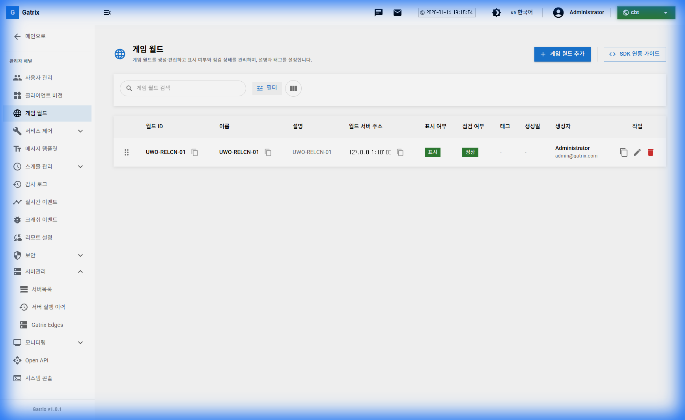
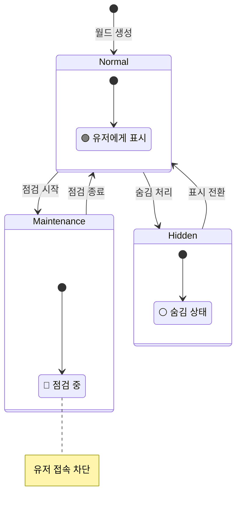
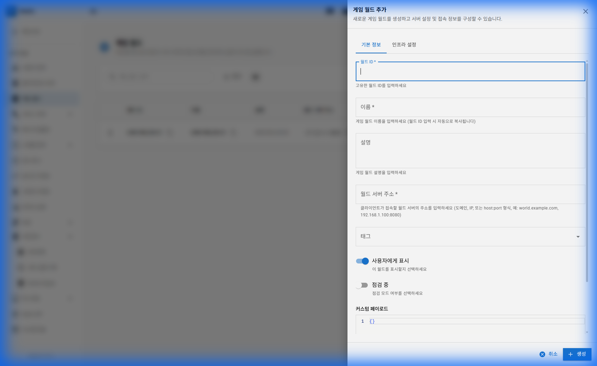
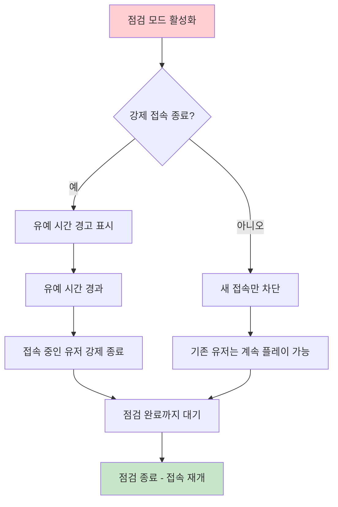
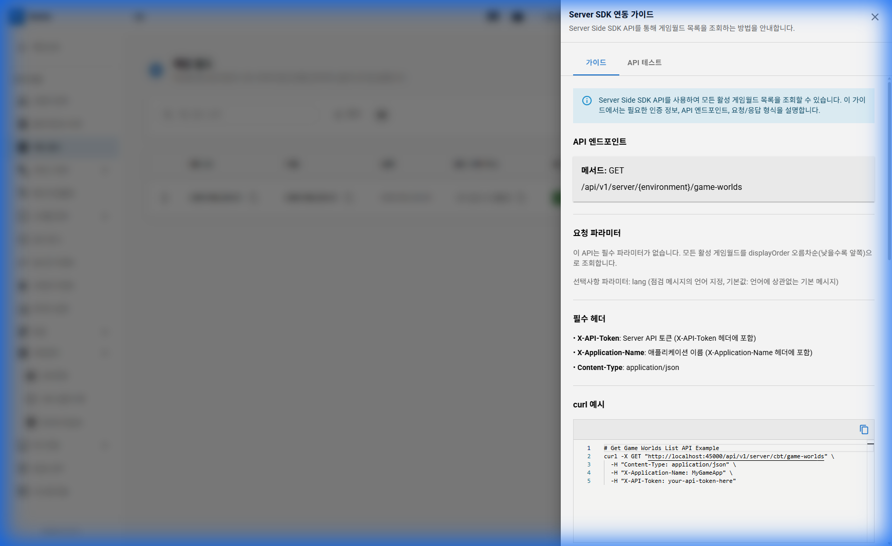
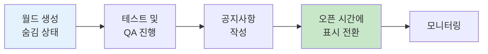
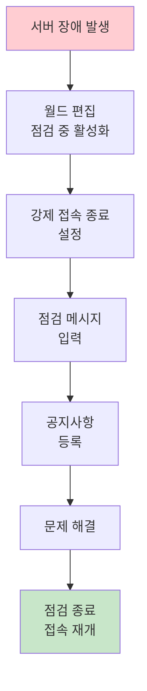

# 제 5장: 게임 월드 관리 (Game World Management)

게임의 월드(서버) 목록을 관리하고 점검 상태를 제어하는 기능입니다. 유저가 게임에 접속할 때 보게 되는 서버 목록이 여기서 관리됩니다.

**경로:** 관리 (Admin) → 게임 월드 (Game Worlds)  
**필요 권한:** `game-worlds.manage`

> **🎬 영상 가이드:** [게임 월드 관리 방법 보기](videos/05-gameworlds.mp4)

---

## 1. 화면 구성

게임 월드 관리 페이지의 전체 화면입니다.



### 상단 툴바 버튼 설명

| 버튼                | 설명                                                       |
| ------------------- | ---------------------------------------------------------- |
| **게임 월드 추가**  | 새로운 게임 월드(서버)를 등록합니다.                       |
| **SDK 연동 가이드** | 클라이언트에서 월드 목록을 조회하는 API 문서를 제공합니다. |

### 테이블 컬럼 설명

| 컬럼               | 설명                                               |
| ------------------ | -------------------------------------------------- |
| **월드 ID**        | 시스템에서 사용하는 고유 식별자 (예: UWO-RELCN-01) |
| **이름**           | 유저에게 표시되는 월드 이름                        |
| **설명**           | 월드에 대한 부가 설명                              |
| **월드 서버 주소** | 게임 로직 서버 URL                                 |
| **표시 여부**      | 유저에게 월드 목록에 노출될지 여부                 |
| **점검 여부**      | 현재 점검 중인지 여부                              |
| **태그**           | 분류용 태그                                        |
| **생성일**         | 월드 등록 일시                                     |
| **생성자**         | 월드를 등록한 관리자                               |
| **작업**           | 📋 복사, ✏️ 편집, 🗑️ 삭제 버튼                     |

---

## 2. 월드 상태 (Status)

월드는 다음 상태들을 가질 수 있습니다.



| 상태                      | 아이콘 | 설명                                                   |
| ------------------------- | :----: | ------------------------------------------------------ |
| **표시 (Visible)**        |   🟢   | 유저에게 월드 목록에 노출됩니다.                       |
| **숨김 (Hidden)**         |   ⚪   | 유저에게 보이지 않습니다. 개발 중인 월드에 적합합니다. |
| **정상 (Normal)**         |   🟢   | 유저 접속이 가능한 상태입니다.                         |
| **점검 중 (Maintenance)** |   🔴   | 점검 중인 상태로, 유저 접속이 차단됩니다.              |

---

## 3. 게임 월드 추가하기

**[게임 월드 추가]** 버튼을 클릭하면 아래와 같은 폼이 나타납니다.



### 기본 정보 탭

| 항목            | 필수 | 설명                                          |
| --------------- | :--: | --------------------------------------------- |
| 월드 ID         |  ✅  | 고유한 월드 식별자 (예: UWO-RELCN-01)         |
| 이름            |  ✅  | 유저에게 표시되는 월드 이름                   |
| 설명            |      | 월드에 대한 부가 설명                         |
| 월드 서버 주소  |  ✅  | 게임 로직 서버 URL (예: 127.0.0.1:10000)      |
| 태그            |      | 분류용 태그                                   |
| 사용자에게 표시 |      | 이 월드를 유저에게 표시할지 여부              |
| 점검 중         |      | 점검 모드 설정 시 체크                        |
| 커스텀 페이로드 |      | JSON 형식의 추가 데이터 (클라이언트에 전달됨) |

### 인프라 설정 탭

고급 서버 및 인프라 설정을 JSON 형식으로 관리할 수 있습니다.

---

## 4. 점검 설정 (Maintenance)

월드별로 점검 상태를 설정하여 유저 접속을 제어할 수 있습니다.



### 점검 설정 항목

| 항목               | 설명                                       |
| ------------------ | ------------------------------------------ |
| **점검 기간**      | 점검 시작 시간과 종료 시간                 |
| **점검 메시지**    | 유저 접속 시도 시 표시할 안내 메시지       |
| **다국어 지원**    | 한국어, 영어, 중국어 등 언어별 메시지 설정 |
| **강제 접속 종료** | 점검 시작 시 접속 중인 유저 강제 퇴장 여부 |
| **유예 시간**      | 강제 종료 전 경고 메시지 표시 시간 (분)    |

---

## 5. 월드 순서 변경

월드 목록에서 **드래그 핸들**을 이용하여 월드의 노출 순서를 변경할 수 있습니다.

> **💡 팁:** 신규 월드나 이벤트 월드를 상단에 배치하여 유저의 관심을 유도할 수 있습니다.

---

## 6. SDK 연동 가이드

클라이언트에서 월드 목록을 조회할 수 있는 API를 제공합니다.



### API 엔드포인트

```
GET /api/v1/client/{environment}/game-worlds
```

### API 테스트

SDK 가이드의 **API 테스트** 탭에서 직접 API를 호출하여 응답을 확인할 수 있습니다.

---

## 7. 운영 시나리오

### 시나리오: 신규 월드 오픈



1. **월드 생성** (숨김 상태로) - 개발팀에서 새 월드 등록
2. **테스트** - QA팀에서 접속 테스트 진행
3. **공지사항 작성** - 신규 월드 오픈 안내
4. **표시 전환** - 오픈 시간에 맞춰 "사용자에게 표시" 활성화
5. **모니터링** - 유저 접속 상황 확인

### 시나리오: 긴급 점검



---

## 8. 자주 묻는 질문 (FAQ)

**Q: 월드를 숨겼는데 기존 접속자는 어떻게 되나요?**

A: "사용자에게 표시" 옵션은 목록 노출만 제어합니다. 이미 접속 중인 유저는 영향을 받지 않습니다. 접속을 차단하려면 "점검 중" 옵션을 사용하세요.

---

**Q: 점검 시간을 예약할 수 있나요?**

A: 현재 버전에서는 수동으로 점검 모드를 전환해야 합니다. 예약 기능이 필요하면 전체 점검 관리 메뉴를 활용하세요.

---

**Q: 커스텀 페이로드는 어떻게 사용하나요?**

A: JSON 형식으로 추가 데이터를 입력하면, 클라이언트에서 월드 목록 조회 시 함께 전달됩니다. 예: `{"event": "summer_festival", "maxPlayers": 5000}`

---

## 9. 트러블슈팅 케이스

### 🔴 케이스 1: 월드를 등록했는데 게임에서 안 보여요

**증상:** 대시보드에서 월드를 등록했으나 게임 내 서버 목록에 표시되지 않음

**원인 및 해결:**

| 원인                       | 해결 방법                         |
| -------------------------- | --------------------------------- |
| "사용자에게 표시" 비활성화 | 토글 상태 확인                    |
| 환경 불일치                | Production 환경에 등록했는지 확인 |
| 점검 중 상태               | 점검 중이면 숨김 처리될 수 있음   |
| 캐싱 문제                  | 앱 재시작 또는 5분 대기           |

---

### 🔴 케이스 2: 월드 순서가 변경되지 않아요

**증상:** 드래그로 순서를 변경했는데 저장 후에도 반영되지 않음

**원인 및 해결:**

| 원인               | 해결 방법                      |
| ------------------ | ------------------------------ |
| 저장 버튼 미클릭   | 순서 변경 후 [저장] 클릭 필수  |
| 새로고침 없이 확인 | 페이지 새로고침 후 재확인      |
| 권한 부족          | `game-worlds.manage` 권한 확인 |

---

## 10. 동영상 가이드

### 게임 월드 관리 전체 흐름

<video width="100%" controls>
  <source src="videos/05-gameworlds.mp4" type="video/mp4">
  브라우저가 비디오를 지원하지 않습니다.
</video>

---

**이전 장:** [← 제 4장: 클라이언트 버전 관리](04-client-versions.md)  
**다음 장:** [제 6장: 점검 관리 →](06-maintenance.md)
