# 제 6장: 점검 관리 (Maintenance Management)

점검은 유저들에게 가장 큰 불편을 주는 작업이므로, 정확한 시간 안내와 안정적인 종료가 생명입니다.

> **🎬 영상 가이드:** [점검 관리 방법 보기](videos/06-maintenance.mp4)

---

## 1. 점검 체계 개요

Gatrix는 **3단계 점검 체계**를 제공합니다. 각 단계별로 점검 범위가 다르며, 상황에 맞게 적절한 점검 방식을 선택해야 합니다.

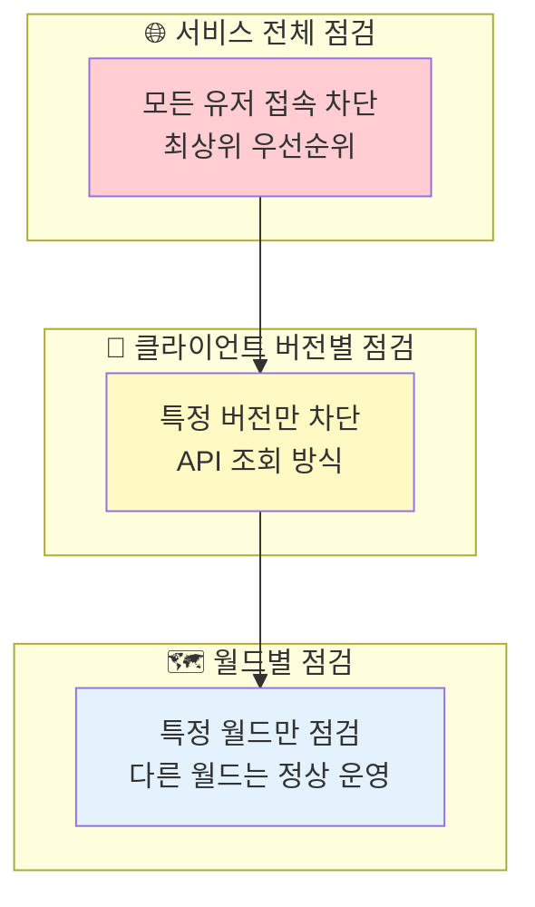

### 점검 적용 우선순위

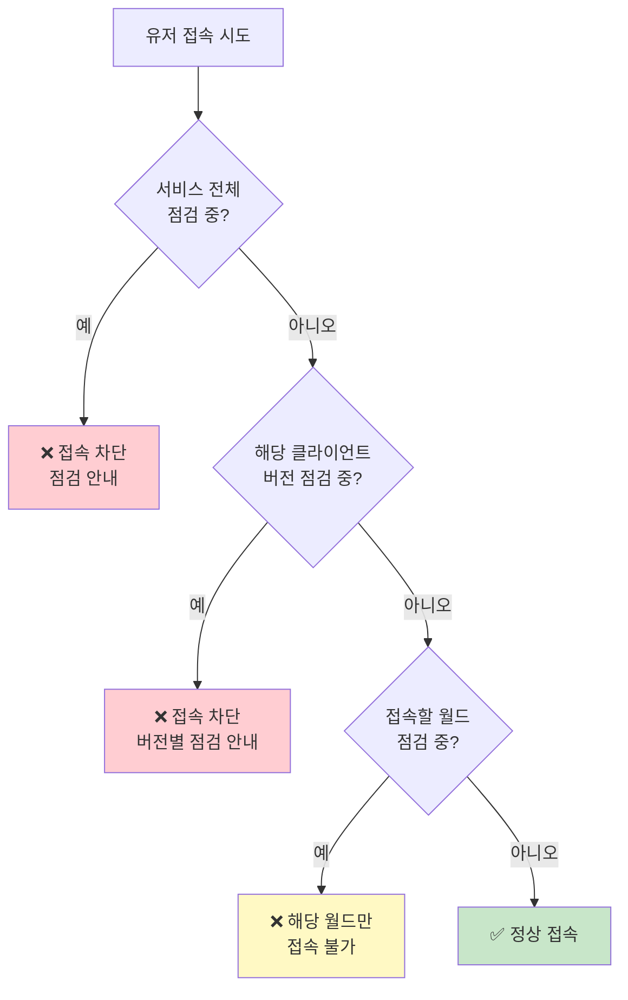

---

## 2. 서비스 전체 점검 (Service Maintenance)

모든 유저의 접속을 차단하는 **최상위 점검**입니다. 서버 업데이트, DB 마이그레이션 등 전체 서비스에 영향을 주는 작업 시 사용합니다.

**경로:** 관리자 패널 → 서비스 제어 → 서비스 점검  
**필요 권한:** `maintenance.manage`

### 화면 구성

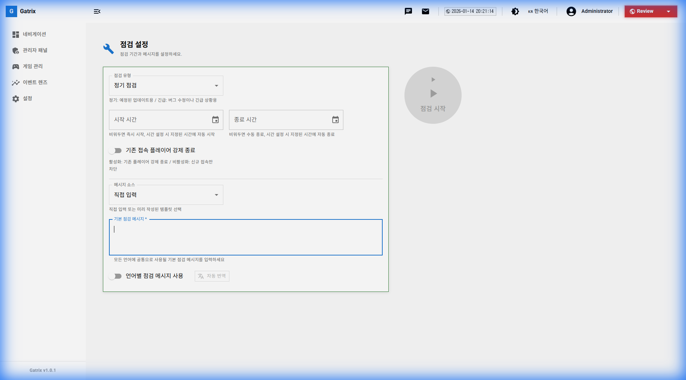

### 설정 항목

| 항목 | 설명 |
|------|------|
| **점검 상태** | 현재 점검 활성화 여부 |
| **시작 시간** | 점검 시작 일시 (비워두면 즉시 시작) |
| **종료 시간** | 점검 종료 일시 (비워두면 수동 종료) |
| **기존 플레이어 강제 종료** | 점검 시작 시 접속 중인 유저 강제 퇴장 |
| **점검 메시지** | 유저에게 표시할 안내 메시지 |
| **다국어 메시지** | 언어별로 다른 메시지 설정 가능 |

### 서비스 점검의 특징

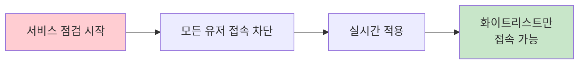

- **실시간 적용:** 설정 즉시 모든 접속에 반영됩니다.
- **최상위 우선순위:** 월드별, 버전별 점검보다 우선 적용됩니다.
- **화이트리스트 예외:** 등록된 계정/IP는 점검 중에도 접속 가능합니다.

### ⚠️ 기존 플레이어 동작

점검이 시작되어도 **이미 접속 중인 플레이어는 즉시 차단되지 않습니다.**

| 설정 | 동작 |
|------|------|
| **강제 종료: OFF** | 기존 플레이어는 계속 플레이 가능. 단, 게임 화면 **우측 상단**에 점검 중임을 알리는 **작은 배너**가 표시됩니다. |
| **강제 종료: ON** | 점검 시작 시 접속 중인 모든 유저를 강제 퇴장시킵니다. 설정에 따라 **즉시** 또는 **일정 시간(예: 5분) 후** 킥됩니다. 킥 전 게임 내에서 안내 메시지가 표시됩니다. |

> **💡 게임 내 점검 배너:** 점검 중에도 플레이할 수 있는 유저들에게는 화면 우측 상단 아래에 "점검 중" 배너가 나타나, 서비스 상태를 인지할 수 있도록 안내합니다. 점검 종료 후 배너는 자동으로 사라집니다.

---

## 3. 클라이언트 버전별 점검 (Version Maintenance)

특정 클라이언트 버전만 점검 상태로 전환합니다. **API 조회 방식**으로 동작하며, 클라이언트가 버전 체크 API를 호출할 때 점검 상태를 반환합니다.

**경로:** 관리자 패널 → 클라이언트 버전 → 버전 편집  
**필요 권한:** `client-versions.manage`

> **🎬 영상 가이드:** [클라이언트 버전 관리 보기](videos/04-clientversions.mp4)

### 설정 방법

1. 클라이언트 버전 목록에서 해당 버전의 **[편집]** 클릭
2. **상태 라벨**을 **점검 중 (Maintenance)**으로 변경
3. 점검 메시지 입력
4. **[저장]**

### API 조회 방식의 특징

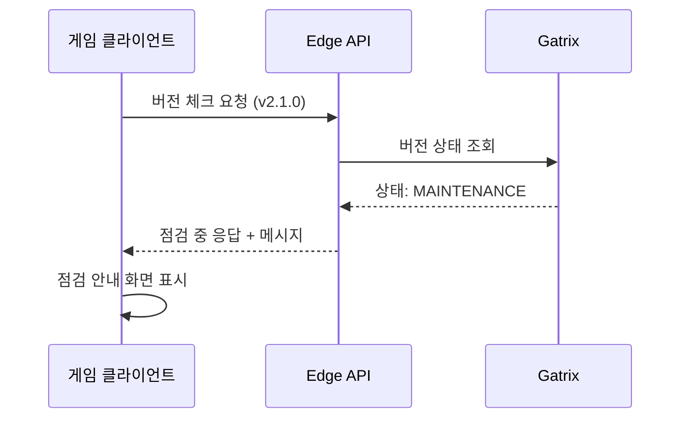

**주요 특징:**
- 클라이언트가 **버전 체크 API를 호출할 때** 점검 상태를 확인합니다.
- 이미 접속 중인 유저에게는 **즉시 반영되지 않습니다.**
- 신규 접속자 또는 재접속 시에만 점검이 적용됩니다.

### 활용 시나리오

| 상황 | 설명 |
|------|------|
| **구버전 점검** | 강제 업데이트 전 구버전 유저 차단 |
| **신버전 테스트** | 신버전을 점검 상태로 두고 화이트리스트로 테스트 |
| **롤백 대비** | 문제 발생 시 특정 버전만 빠르게 차단 |

---

## 4. 월드별 점검 (World Maintenance)

특정 게임 월드(서버)만 점검 상태로 전환합니다. 다른 월드는 정상 운영됩니다.

**경로:** 관리자 패널 → 게임 월드 → 월드 편집  
**필요 권한:** `game-worlds.manage`

> **🎬 영상 가이드:** [게임 월드 관리 보기](videos/05-gameworlds.mp4)

### 설정 방법

1. 게임 월드 목록에서 해당 월드의 **[편집]** 클릭
2. **점검 중** 토글을 **활성화**
3. 점검 일정 설정 (선택사항)
4. **[저장]**

### 월드별 점검 흐름

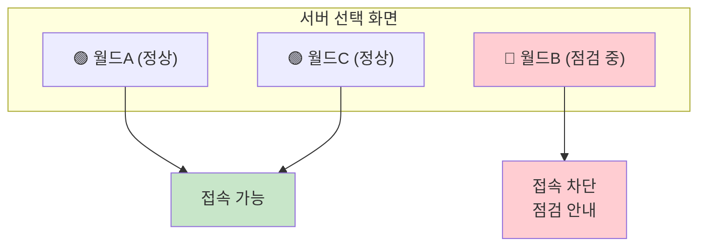

### 활용 시나리오

| 상황 | 설명 |
|------|------|
| **월드별 업데이트** | 특정 월드만 데이터 마이그레이션 |
| **부하 분산** | 과부하 월드 임시 점검 |
| **이벤트 준비** | 이벤트 월드 사전 세팅 |

---

## 5. 실시간 점검 vs API 조회 점검

Gatrix의 점검은 **적용 방식**에 따라 두 가지로 나뉩니다.

### 비교표

| 구분 | 실시간 적용 | API 조회 적용 |
|------|:-----------:|:------------:|
| **서비스 전체 점검** | ✅ | |
| **클라이언트 버전 점검** | | ✅ |
| **월드별 점검** | ✅ | |
| **기존 접속자** | 즉시 적용 | 재접속 시 적용 |
| **적용 시점** | 설정 즉시 | API 호출 시 |

### 실시간 적용 점검

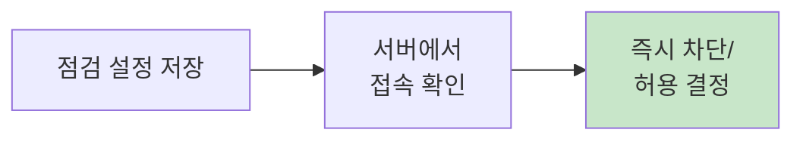

- **서비스 전체 점검**, **월드별 점검**에 해당
- 설정 저장 즉시 모든 접속에 반영
- 기존 접속자도 강제 종료 옵션으로 퇴장 가능

### API 조회 적용 점검

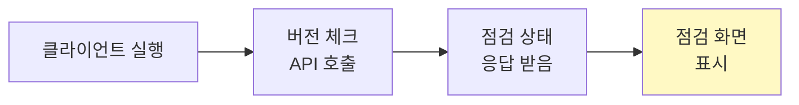

- **클라이언트 버전별 점검**에 해당
- 클라이언트가 API를 호출해야 점검 상태 확인
- 이미 게임 중인 유저는 재시작 전까지 영향 없음

---

## 6. 화이트리스트 (Whitelist)

점검 중에도 QA팀, 개발팀, 마켓 검수팀이 접속할 수 있도록 예외를 설정합니다.

**경로:** 관리자 패널 → 화이트리스트  
**필요 권한:** `whitelist.manage`

> **🎬 영상 가이드:** [화이트리스트 관리 보기](videos/08-whitelists.mp4)

### 화면 구성

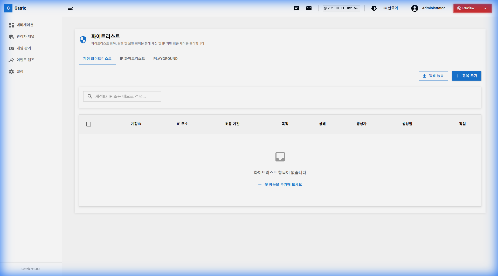

### 지원하는 화이트리스트 유형

| 유형 | 설명 | 사용 사례 |
|------|------|----------|
| **계정 ID (Account ID)** | 특정 유저 계정만 허용 | QA 테스터 개인 계정, 마켓 검수 계정 |
| **IP 주소** | 특정 IP에서의 접속 허용 | 사내 네트워크, 개발실 IP |

> **⚠️ 참고:** Device ID는 화이트리스트 조건으로 사용하지 않습니다. **계정 ID**와 **IP 주소**만 체크합니다.

### 화이트리스트 동작 흐름

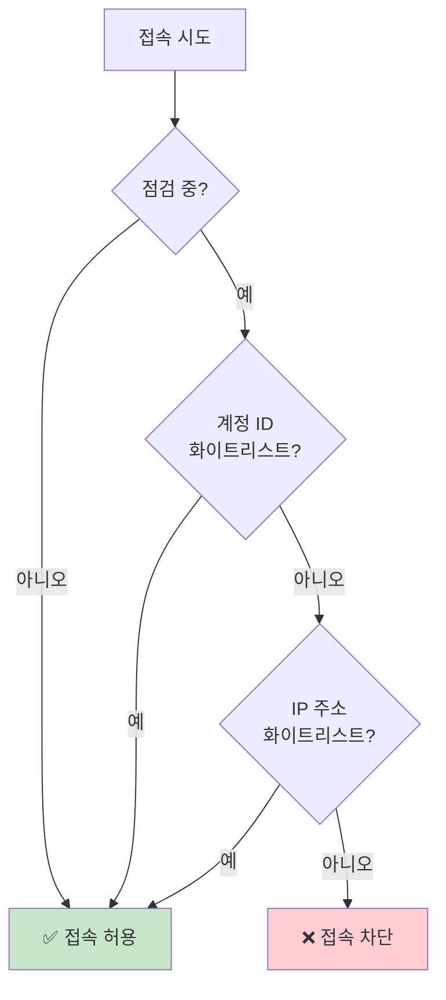

### 등록 가이드

| 대상 | 추천 유형 | 이유 |
|------|----------|------|
| **애플/구글 검수팀** | 계정 ID | 검수팀 IP 알 수 없음 |
| **사내 전체** | IP 주소 | 일괄 허용 편리 |
| **재택 근무자** | 계정 ID | IP 변경 가능성 |
| **외부 QA 업체** | 계정 ID | 보안상 계정 단위 관리 |

---

## 7. 점검 종류별 설정 가이드

### 정기 점검 (전체 서비스)

### 정기 점검 및 긴급 점검 프로세스

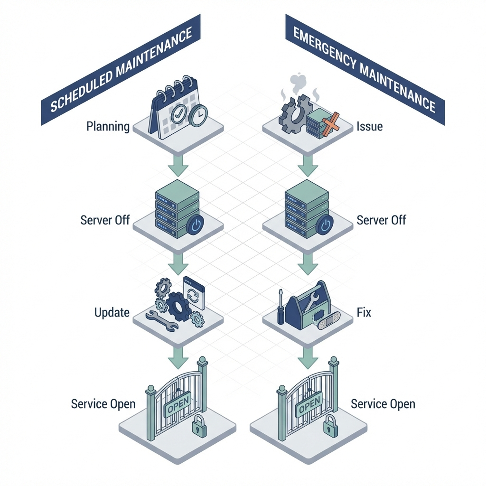

### 버전별 강제 업데이트

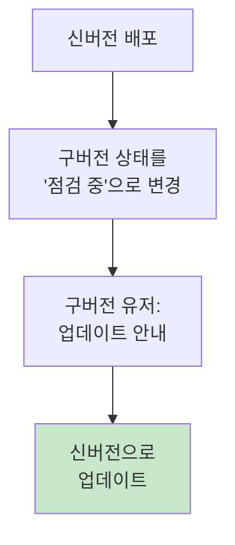

---

## 8. 점검 설정 체크리스트

### ✅ 정기 점검

**D-1일 (전일)**
- [ ] 서비스 점검 예약 설정
- [ ] 시작/종료 시간 정확히 입력
- [ ] 사전 공지사항 게시
- [ ] QA/검수 계정 화이트리스트 등록

**D-Day**
- [ ] 30분 전 인게임 알림 발송
- [ ] 점검 시작 확인
- [ ] QA 테스트 완료
- [ ] 점검 종료 및 서버 오픈 확인
- [ ] 점검 완료 공지사항 게시

### ✅ 긴급 점검

- [ ] 즉시 서비스 점검 시작
- [ ] 긴급 공지사항 게시
- [ ] 문제 원인 파악 및 해결
- [ ] 화이트리스트로 테스트
- [ ] 조기 종료

---

## 9. 자주 묻는 질문 (FAQ)

**Q: 버전별 점검을 설정했는데 기존 유저가 계속 플레이하고 있어요.**

A: 클라이언트 버전별 점검은 **API 조회 방식**입니다. 이미 접속 중인 유저에게는 적용되지 않으며, 재접속 시에만 점검 상태가 반영됩니다.

---

**Q: 화이트리스트에 Device ID를 등록할 수 있나요?**

A: 아니요, 현재 화이트리스트는 **계정 ID**와 **IP 주소**만 지원합니다. Device ID는 사용하지 않습니다.

---

**Q: 서비스 점검 중에 월드별 점검을 따로 설정해야 하나요?**

A: 아니요, 서비스 전체 점검이 **최상위 우선순위**이므로 모든 월드가 자동으로 차단됩니다.

---

**Q: 점검 시간을 연장하려면?**

A: 서비스 점검 화면에서 종료 시간을 수정하고 저장하면 됩니다. 연장 시 최소 30분 전에 공지를 갱신하세요.

---

## 10. 트러블슈팅 케이스

### 🔴 케이스 1: 점검을 걸었는데 유저가 계속 접속해요

**증상:** 서비스 점검을 시작했는데 일부 유저가 여전히 게임 중

**원인 및 해결:**

| 원인 | 해결 방법 |
|------|----------|
| "기존 플레이어 강제 종료" 비활성화 | 해당 옵션 활성화 후 재저장 |
| 화이트리스트에 등록된 계정/IP | 화이트리스트 목록 확인 |
| 잘못된 환경에서 점검 설정 | 환경 선택기 확인 (Production인지) |
| 클라이언트 버전 점검만 설정 | 서비스 전체 점검으로 변경 |

---

### 🔴 케이스 2: 점검 종료 버튼을 눌렀는데 서버가 안 열려요

**증상:** 점검 종료를 했는데 유저가 여전히 접속 불가

**원인 및 해결:**

| 원인 | 해결 방법 |
|------|----------|
| 월드별 점검이 별도로 남아있음 | 게임 월드에서 점검 해제 |
| 클라이언트 버전 상태가 점검 중 | 클라이언트 버전 상태 확인 |
| 게임 서버 자체가 미기동 | 인프라팀에 서버 상태 확인 요청 |
| 캐시/CDN 문제 | 5분 대기 후 재확인 |

---

### 🔴 케이스 3: 화이트리스트 등록했는데 QA팀이 접속 못해요

**증상:** 화이트리스트에 등록한 계정/IP인데 점검 안내가 표시됨

**원인 및 해결:**

| 원인 | 해결 방법 |
|------|----------|
| 계정 ID 오타 | UUID 정확히 복사했는지 확인 |
| IP 주소 변경 | VPN 사용 시 IP 변경 가능, 계정 ID로 등록 |
| 환경 불일치 | 올바른 환경에 화이트리스트 등록했는지 확인 |
| 클라이언트 캐싱 | 앱 강제 종료 후 재시작 |

---

### 🔴 케이스 4: 점검 예약을 했는데 시간이 되어도 안 걸려요

**증상:** 점검 시작 시간을 설정했는데 자동으로 시작되지 않음

**원인 및 해결:**

| 원인 | 해결 방법 |
|------|----------|
| 시간대(Timezone) 불일치 | UTC vs KST 확인 |
| 과거 시간 입력 | 현재 시간 이후로 재설정 |
| 저장 안 함 | [저장] 버튼 눌렀는지 확인 |
| 백엔드 서버 문제 | 담당 개발팀 확인 요청 |

---

### 🔴 케이스 5: 점검 메시지가 이상하게 표시돼요

**증상:** 점검 안내 메시지에 HTML 태그가 그대로 보이거나 깨짐

**원인 및 해결:**

| 원인 | 해결 방법 |
|------|----------|
| HTML 태그 사용 | 점검 메시지는 Plain Text만 지원, 태그 제거 |
| 특수문자 문제 | `<`, `>`, `&` 등 특수문자 확인 |
| 인코딩 문제 | 복사/붙여넣기 대신 직접 입력 |

---

## 11. 동영상 가이드

### 점검 관리 전체 흐름
<video width="100%" controls>
  <source src="videos/06-maintenance.mp4" type="video/mp4">
  브라우저가 비디오를 지원하지 않습니다.
</video>

### 화이트리스트 관리
<video width="100%" controls>
  <source src="videos/08-whitelists.mp4" type="video/mp4">
  브라우저가 비디오를 지원하지 않습니다.
</video>

---

**이전 장:** [← 제 5장: 게임 월드 관리](05-game-worlds.md)  
**다음 장:** [제 7장: 공지사항 관리 →](07-service-notices.md)
