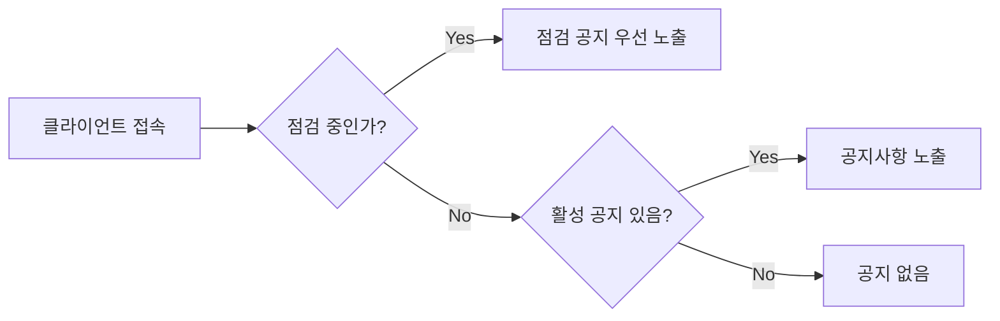
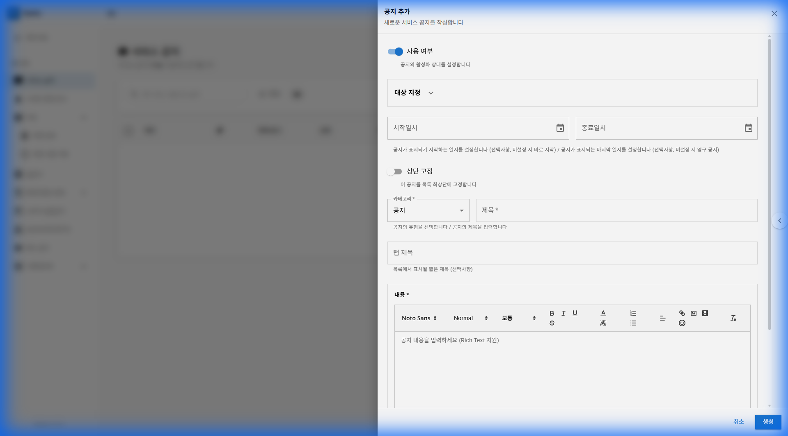
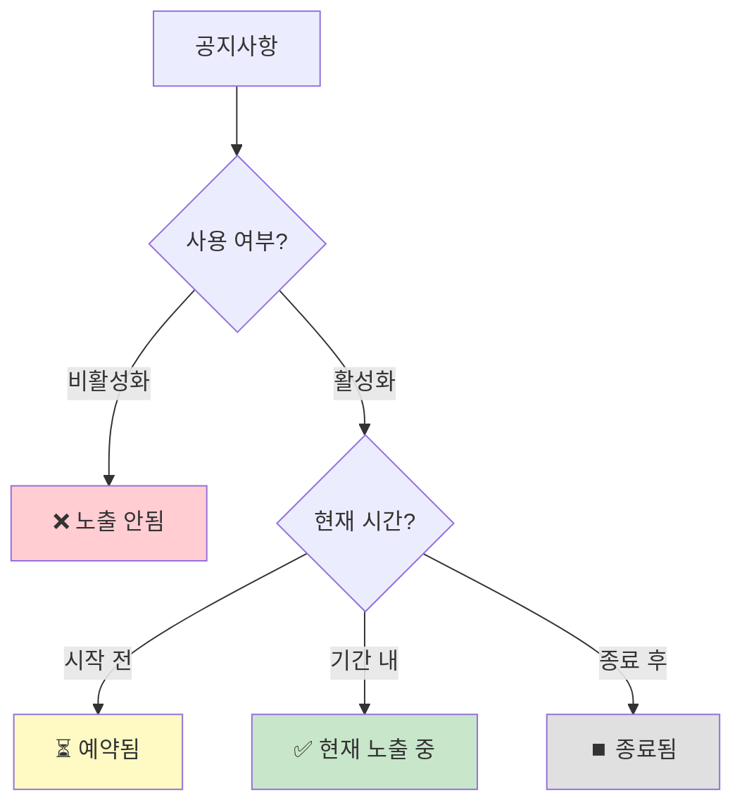
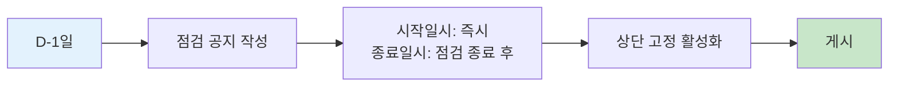
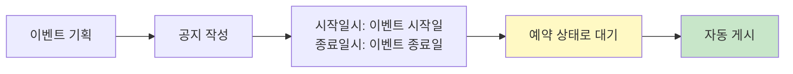

# 제 7장: 공지사항 관리 (Service Notices)

게임 내 공지사항은 유저와의 가장 기본적인 소통 창구입니다. 점검 안내, 이벤트 홍보, 버그 수정 내역 등을 알릴 때 사용합니다.

**경로:** 게임 관리 (Game) → 서비스 공지 (Service Notices)  
**필요 권한:** `service-notices.manage`

> **🎬 영상 가이드:** [공지사항 관리 방법 보기](videos/09-servicenotices.mp4)

---

## 1. 화면 구성

공지사항 관리 페이지의 전체 화면입니다.

### 공지사항 노출 로직

### 상단 툴바 버튼 설명

| 버튼 | 설명 |
|------|------|
| **미리보기** | 게임 내 웹뷰에서 공지사항이 어떻게 보이는지 미리 확인합니다. |
| **공지 추가** | 새로운 공지사항을 작성합니다. |

### 테이블 컬럼 설명

| 컬럼 | 설명 |
|------|------|
| **제목** | 공지사항 제목 |
| **📌 (상단 고정)** | 상단 고정 여부 |
| **현재 표시** | 현재 유저에게 노출 중인지 여부 |
| **상태** | 활성(Active) / 비활성(Inactive) |
| **카테고리** | 점검, 이벤트, 공지, 프로모션, 기타 |
| **적용 대상** | 대상 플랫폼 및 채널 |
| **적용 기간** | 노출 시작~종료 일시 |
| **생성일** | 공지 작성 일시 |
| **수정일** | 최근 수정 일시 |
| **작업** | ✏️ 편집, 🗑️ 삭제 버튼 |

---

## 2. 공지사항 작성하기

**[공지 추가]** 버튼을 클릭하면 아래와 같은 폼이 나타납니다.

### 입력 항목 상세 설명

| 섹션 | 항목 | 필수 | 설명 |
|------|------|:----:|------|
| **기본 설정** | 사용 여부 | ✅ | 토글 스위치로 활성화/비활성화 설정 |
| **대상 지정** | 대상 플랫폼 | | 전체 또는 특정 플랫폼(iOS, Android, PC 등) 선택 |
| | 대상 채널 | | 특정 서비스 채널 선택 |
| **노출 기간** | 시작일시 | | 비워두면 즉시 게시 |
| | 종료일시 | | 비워두면 영구 게시 |
| **표시 옵션** | 상단 고정 | | 중요 공지를 목록 최상단에 고정 |
| **분류** | 카테고리 | ✅ | 점검/이벤트/공지/프로모션/기타 |
| | 태그 | | 분류용 태그 |
| **내용** | 제목 | ✅ | 유저에게 표시되는 제목 |
| | 내용 | ✅ | Rich Text Editor로 HTML 형식 작성 |

### 카테고리 종류

| 카테고리 | 용도 | 예시 |
|----------|------|------|
| **점검 (Maintenance)** | 점검 관련 안내 | "1/15 정기점검 안내" |
| **이벤트 (Event)** | 게임 이벤트 홍보 | "설날 이벤트 안내" |
| **공지 (Notice)** | 일반 공지사항 | "이용약관 변경 안내" |
| **프로모션 (Promotion)** | 상품/결제 관련 | "신규 패키지 출시 안내" |
| **기타 (Other)** | 그 외 안내 | "커뮤니티 가이드라인" |

---

## 3. 다국어 공지 작성 (Multi-language Support)

Gatrix는 글로벌 서비스를 위해 다국어 공지 입력을 지원합니다.  
특히 **중국 서비스**를 고려하여 간체/번체 입력을 올바르게 구분해야 합니다.

| 언어 | 코드 | 입력 예시 (제목) |
|---|---|---|
| **한국어** | `ko-KR` | 정기 점검 안내 |
| **영어** | `en-US` | Scheduled Maintenance |
| **중국어(간체)** | `zh-CN` | 定期维护通知 (중국 본토) |
| **중국어(번체)** | `zh-TW` | 定期維護通知 (대만/홍콩) |

> **🌏 유의사항:** 
> - 중국 서비스를 준비 중이라면 반드시 **중국어(간체)** 내용을 포함하세요.
> - 번역된 내용이 없으면 기본 언어(한국어 또는 영어)로 표시될 수 있습니다.

공지사항 내용은 **Rich Text Editor**를 통해 HTML 형식으로 작성할 수 있습니다.

### 에디터 기능

| 기능 | 설명 |
|------|------|
| **폰트 설정** | 폰트 종류 선택 (Noto Sans 등) |
| **크기 조절** | 텍스트 크기 조절 |
| **텍스트 스타일** | 굵게(B), 기울임(I), 밑줄(U) |
| **색상 설정** | 글자색, 배경색 변경 |
| **정렬** | 왼쪽, 가운데, 오른쪽 정렬 |
| **목록** | 번호 목록, 글머리 기호 목록 |
| **이미지 삽입** | 이미지 URL 또는 업로드 |
| **동영상 삽입** | YouTube 등 동영상 임베드 |
| **링크 삽입** | 외부 링크 추가 |
| **이모지** | 이모지 삽입 |

> **💡 팁:** 모바일 화면에서의 가독성을 위해 복잡한 레이아웃은 피하고, 간결하게 작성하세요.

---

## 5. 노출 관리 (Visibility)

공지사항의 노출 상태는 여러 조건에 따라 결정됩니다.

### 노출 상태 아이콘

| 상태 | 아이콘 | 조건 |
|------|:------:|------|
| **현재 노출 중** | 🟢 | Active + 현재 시간이 기간 내 |
| **예약됨** | 🟡 | Active + 시작 시간이 미래 |
| **종료됨** | ⚪ | 종료 시간이 지남 |
| **비활성** | ⚫ | 사용 여부 비활성화 |

---

## 6. 미리보기 및 공유

### 웹뷰 미리보기 (Preview)

작성된 공지사항이 실제 게임 내 웹뷰에서 어떻게 보일지 미리 확인할 수 있습니다.

1. 목록 상단의 **[미리보기]** 버튼 클릭
2. 새 창에서 실제 게임에 적용되는 웹뷰 화면 확인

### URL 복사 (Copy URL)

공지사항의 직접 링크가 필요할 때 사용합니다. (예: 커뮤니티에 링크 공유)

---

## 7. 운영 시나리오

### 시나리오: 점검 공지 작성

1. **[공지 추가]** 클릭
2. 카테고리: **점검** 선택
3. 제목: "1/15(수) 정기점검 안내 (10:00~12:00)"
4. 상단 고정: **활성화**
5. 내용 작성 후 **[저장]**

### 시나리오: 이벤트 공지 예약

1. **[공지 추가]** 클릭
2. 카테고리: **이벤트** 선택
3. 시작일시: 이벤트 시작일 설정
4. 종료일시: 이벤트 종료일 설정
5. 내용 작성 후 **[저장]** → 자동으로 예약됨

---

## 8. 공지사항 관리 체크리스트

### 점검 공지 체크리스트

- [ ] 카테고리가 "점검"으로 설정되었는가?
- [ ] 상단 고정이 활성화되었는가?
- [ ] 점검 시간이 정확하게 명시되었는가?
- [ ] 다국어 번역이 완료되었는가?
- [ ] 미리보기로 모바일 화면 확인했는가?

### 이벤트 공지 체크리스트

- [ ] 이벤트 기간이 정확하게 설정되었는가?
- [ ] 이벤트 참여 방법이 명확하게 안내되었는가?
- [ ] 이미지/배너가 올바르게 표시되는가?
- [ ] 링크가 정상 작동하는가?

---

## 9. 자주 묻는 질문 (FAQ)

**Q: 공지사항을 올렸는데 게임에서 안 보여요.**

A: 다음을 순서대로 확인하세요.
1. **사용 여부**가 활성화되어 있나요?
2. **현재 시간**이 게시 기간(시작일시 ~ 종료일시) 사이인가요?
3. **플랫폼** 설정이 올바른가요? (예: iOS로 접속했는데 타겟이 Android만 설정된 경우)
4. **환경(Environment)** 선택이 올바른가요?

---

**Q: HTML 태그를 쓸 수 있나요?**

A: 네, 내용은 웹뷰를 통해 렌더링되므로 HTML 태그 사용이 가능합니다. Rich Text Editor에서 자동으로 HTML 코드가 생성됩니다.

---

**Q: 이미지를 넣으려면 어떻게 하나요?**

A: Rich Text Editor의 이미지 아이콘을 클릭하여 이미지 URL을 입력하거나 직접 업로드할 수 있습니다.

---

## 10. 트러블슈팅 케이스

### 🔴 케이스 1: 공지사항을 등록했는데 게임에서 안 보여요

**증상:** 대시보드에서는 등록된 공지가 게임 내에서 표시되지 않음

**원인 및 해결:**

| 원인 | 해결 방법 |
|------|----------|
| 사용 여부 비활성화 | "사용" 토글 상태 확인 |
| 기간 설정 오류 | 시작일시가 미래이거나 종료일시가 과거 |
| 플랫폼/채널 불일치 | 대상 설정이 해당 유저에게 적용되는지 확인 |
| 환경 불일치 | Production 환경에 등록했는지 확인 |

---

### 🔴 케이스 2: 이미지가 깨져서 보여요

**증상:** 공지 내 이미지가 X 표시이거나 로딩 안됨

**원인 및 해결:**

| 원인 | 해결 방법 |
|------|----------|
| 이미지 URL 오류 | URL을 브라우저에서 직접 열어 확인 |
| HTTP/HTTPS 혼용 | HTTPS URL 사용 권장 |
| CDN 접근 제한 | 이미지 호스팅 서비스 접근성 확인 |
| 이미지 삭제됨 | 원본 이미지 존재 여부 확인 |

---

### 🔴 케이스 3: 한국어는 보이는데 영어 공지가 비어있어요

**증상:** 다국어 공지에서 특정 언어만 표시됨

**원인 및 해결:**

| 원인 | 해결 방법 |
|------|----------|
| 해당 언어 미입력 | 언어별 내용 모두 입력 확인 |
| 빈 문자열 저장 | 공백만 있는 경우도 비어 보임 |
| 기본 언어 Fallback | 기본 언어(한국어)만 입력 시 다른 언어에도 표시됨 확인 |

> **💡 단일 국가 서비스 시:** 다국어 메시지 입력은 필요하지 않습니다. 기본 메시지만 입력하세요.

---

## 11. 동영상 가이드

### 공지사항 관리 전체 흐름
<video width="100%" controls>
  <source src="videos/09-servicenotices.mp4" type="video/mp4">
  브라우저가 비디오를 지원하지 않습니다.
</video>

---

**이전 장:** [← 제 6장: 점검 관리](06-maintenance.md)  
**다음 장:** [제 8장: 인게임 팝업 관리 →](08-popup-notices.md)
