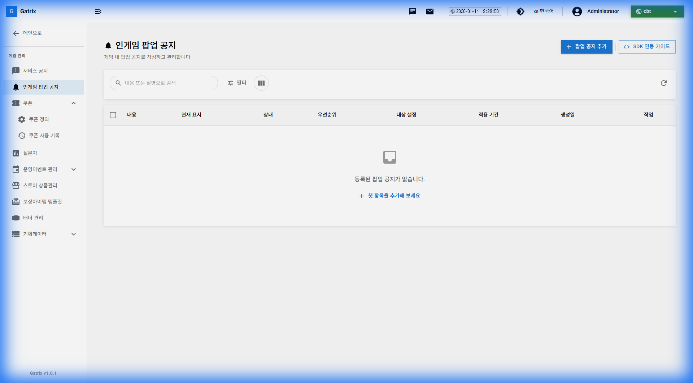
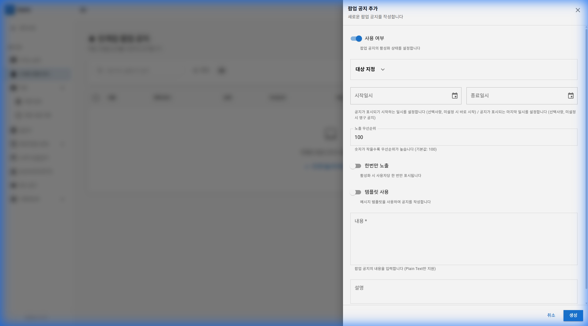
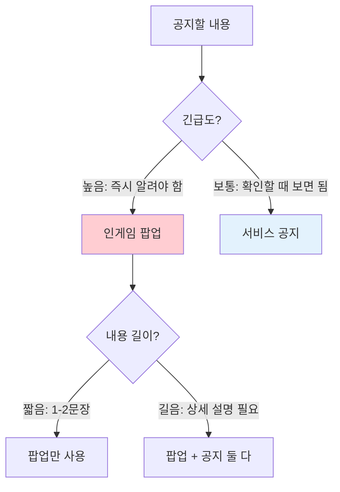
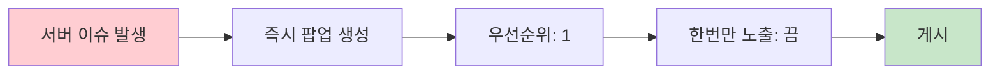

# 제 8장: 인게임 팝업 관리 (Ingame Popup Notices)

게임 접속 시 또는 특정 조건에서 자동으로 표시되는 팝업 공지입니다. 긴급 안내, 이벤트 홍보, 중요 정보 전달 등에 활용됩니다.

**경로:** 게임 관리 (Game) → 인게임 팝업 공지 (Ingame Popup Notices)  
**필요 권한:** `popup-notices.manage`

> **🎬 영상 가이드:** [인게임 팝업 관리 방법 보기](videos/10-ingamepopups.mp4)

---

## 1. 화면 구성

인게임 팝업 관리 페이지의 전체 화면입니다.



### 상단 툴바 버튼 설명

| 버튼 | 설명 |
|------|------|
| **팝업 공지 추가** | 새로운 팝업 공지를 작성합니다. |
| **SDK 연동 가이드** | 클라이언트에서 팝업 공지를 조회하는 API 문서를 제공합니다. |

### 테이블 컬럼 설명

| 컬럼 | 설명 |
|------|------|
| **내용** | 팝업에 표시되는 메시지 내용 (미리보기) |
| **현재 표시** | 현재 유저에게 노출 중인지 여부 |
| **상태** | 활성(Active) / 비활성(Inactive) |
| **우선순위** | 노출 순서 (숫자가 작을수록 먼저 표시) |
| **대상 설정** | 대상 플랫폼 및 채널 |
| **적용 기간** | 노출 시작~종료 일시 |
| **생성일** | 팝업 생성 일시 |
| **작업** | ✏️ 편집, 🗑️ 삭제 버튼 |

---

## 2. 팝업 공지 작성하기

**[팝업 공지 추가]** 버튼을 클릭하면 아래와 같은 폼이 나타납니다.



### 입력 항목 상세 설명

| 섹션 | 항목 | 필수 | 설명 |
|------|------|:----:|------|
| **기본 설정** | 사용 여부 | ✅ | 토글 스위치로 활성화/비활성화 설정 |
| **대상 지정** | 대상 플랫폼 | | 전체 또는 특정 플랫폼 선택 |
| | 대상 채널 | | 특정 서비스 채널 선택 |
| **노출 기간** | 시작일시 | | 비워두면 즉시 표시 |
| | 종료일시 | | 비워두면 영구 표시 |
| **노출 설정** | 우선순위 | | 숫자가 작을수록 먼저 표시 (기본: 100) |
| | 한번만 노출 | | 유저당 1회만 표시 (로그인/접속 시마다 표시하지 않음) |
| | 템플릿 사용 | | 메시지 템플릿에서 내용 불러오기 |
| **내용** | 내용 | ✅ | Plain Text 형식으로 팝업 메시지 입력 |
| | 설명 | | 관리용 메모 (유저에게 표시되지 않음) |

---

## 3. 팝업 vs 서비스 공지 비교

어떤 공지 방식을 사용해야 할지 헷갈린다면 아래 표를 참고하세요.

| 구분 | 인게임 팝업 | 서비스 공지 |
|------|-----------|-----------|
| **표시 방식** | 게임 내 팝업창 자동 표시 | 공지사항 메뉴 클릭 시 표시 |
| **노출 시점** | 게임 접속/로그인 시 자동 | 유저가 직접 확인 |
| **내용 형식** | Plain Text (간결하게) | Rich HTML (상세하게) |
| **적합한 용도** | 긴급 안내, 짧은 공지 | 상세한 이벤트 안내, 점검 상세 |
| **한번만 노출** | 지원 ✅ | 미지원 |



---

## 4. 우선순위 설정

여러 팝업이 동시에 활성화된 경우, **우선순위**에 따라 표시 순서가 결정됩니다.

| 우선순위 | 표시 순서 | 권장 용도 |
|:--------:|:--------:|----------|
| **1-10** | 먼저 표시 | 긴급 공지, 치명적 버그 안내 |
| **50-100** | 중간 | 일반 이벤트, 업데이트 안내 |
| **100-200** | 나중 표시 | 덜 중요한 안내, 광고 |

> **💡 팁:** 우선순위는 "숫자가 작을수록 먼저 표시"됩니다. 긴급 공지는 우선순위 1-10을 사용하세요.

---

### 팝업 노출 우선순위

```mermaid
flowchart TD
    A[로그인 성공] --> B[활성 팝업 목록 조회]
    B --> C[우선순위 정렬 (내림차순)]
    C --> D[1순위 팝업 노출]
    D --> E{닫기 버튼 클릭}
    E --> F[오늘 하루 보지 않기 체크?]
    F -->|Yes| G[24시간 동안 노출 안 함]
    F -->|No| H[다음 접속 시 다시 노출]
    E --> I[다음 순위 팝업 노출]
```

**적합한 활용:**
- 신규 기능 안내 (한 번만 알려주면 됨)
- 이벤트 시작 알림 (반복 알림 불필요)
- 약관 변경 고지 (동의 후 재표시 불필요)

---

## 6. 운영 시나리오

### 시나리오: 긴급 서버 이슈 알림



1. **[팝업 공지 추가]** 클릭
2. 내용: "현재 일부 서버에서 접속 지연 현상이 발생하고 있습니다. 빠른 시일 내 복구하겠습니다."
3. 우선순위: **1** (최우선)
4. 한번만 노출: **끔** (접속할 때마다 표시)
5. **[저장]**

### 시나리오: 이벤트 시작 안내

1. **[팝업 공지 추가]** 클릭
2. 내용: "🎉 설날 이벤트가 시작되었습니다! 자세한 내용은 공지사항을 확인해 주세요."
3. 시작일시: 이벤트 시작일
4. 종료일시: 이벤트 종료일
5. 한번만 노출: **켬** (한 번만 알림)
6. **[저장]**

---

## 7. 자주 묻는 질문 (FAQ)

**Q: 팝업이 너무 많으면 어떻게 되나요?**

A: 우선순위에 따라 순차적으로 표시됩니다. 유저가 첫 번째 팝업을 닫으면 두 번째 팝업이 나타납니다. 너무 많은 팝업은 유저 경험에 좋지 않으니 5개 이내로 유지하세요.

---

**Q: "한번만 노출"을 설정했는데 유저가 다시 보고 싶어합니다.**

A: "한번만 노출"은 유저 기기에 쿠키/로컬 스토리지로 기록됩니다. 유저가 앱을 재설치하거나 브라우저 데이터를 삭제하면 다시 표시됩니다.

---

**Q: 팝업에 이미지를 넣을 수 있나요?**

A: 현재 인게임 팝업은 Plain Text만 지원합니다. 이미지가 필요하면 서비스 공지(Rich HTML)를 활용하고, 팝업에서는 "자세한 내용은 공지사항을 확인해 주세요"라고 안내하세요.

---

## 8. 트러블슈팅 케이스

### 🔴 케이스 1: 팝업이 여러 번 표시돼요

**증상:** "한번만 노출"을 설정했는데 유저에게 반복적으로 표시됨

**원인 및 해결:**

| 원인 | 해결 방법 |
|------|----------|
| 앱 재설치 | 정상 동작 - 재설치 시 기록 초기화 |
| 다른 기기 접속 | 정상 동작 - 기기별 기록 |
| 팝업 ID 변경 | 팝업 수정 시 ID 유지 확인 |

---

### 🔴 케이스 2: 팝업이 전혀 표시되지 않아요

**증상:** 활성화한 팝업이 게임 접속 시 표시되지 않음

**원인 및 해결:**

| 원인 | 해결 방법 |
|------|----------|
| 사용 여부 비활성화 | 토글 상태 확인 |
| 기간 설정 오류 | 시작/종료 일시 확인 |
| 플랫폼 대상 불일치 | 유저 플랫폼에 맞는 대상 설정 확인 |
| 이미 본 것으로 기록됨 | "한번만 노출"이 켜져 있고 이미 확인한 경우 |

---

## 9. 동영상 가이드

### 인게임 팝업 관리 전체 흐름
<video width="100%" controls>
  <source src="videos/10-ingamepopups.mp4" type="video/mp4">
  브라우저가 비디오를 지원하지 않습니다.
</video>

---

**이전 장:** [← 제 7장: 공지사항 관리](07-service-notices.md)  
**다음 장:** [제 9장: 쿠폰 관리 →](09-coupons.md)
