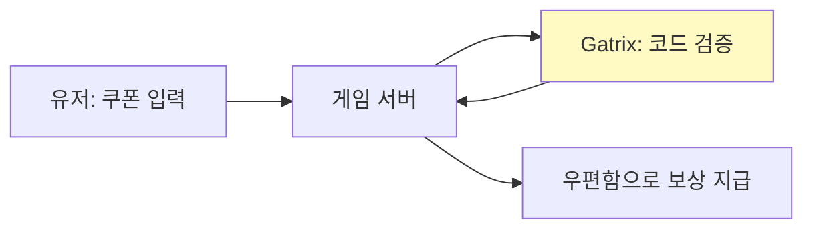
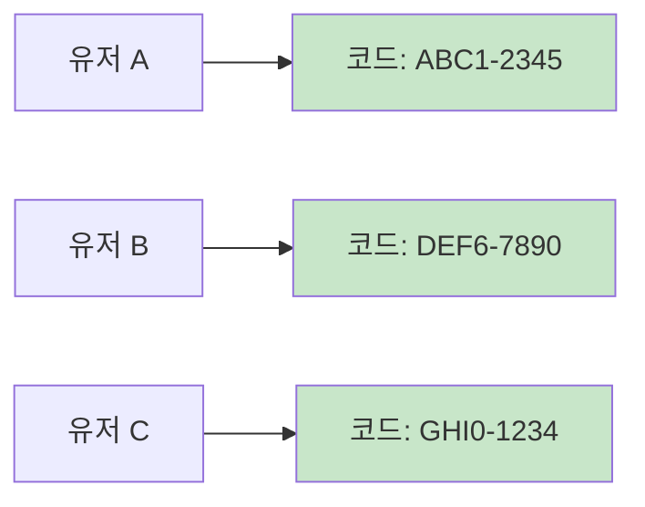
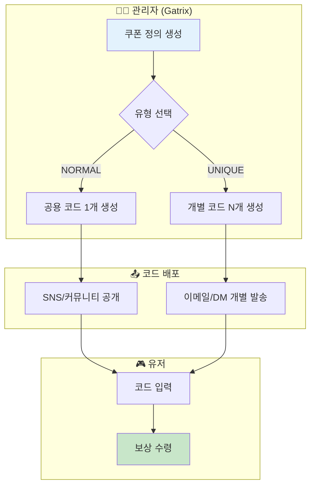
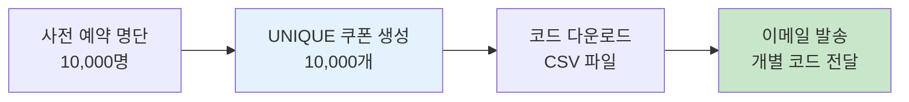
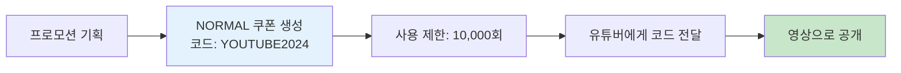

# 제 9장: 쿠폰 관리 (Coupon Management)

쿠폰은 마케팅, 보상, 프로모션에 필수적인 기능입니다. 이벤트 보상, 사전 예약 혜택, 협찬 코드 등 다양한 용도로 활용됩니다.

**경로:** 게임 관리 (Game) → 쿠폰 → 쿠폰 정의 (Coupon Definitions)  
**필요 권한:** `coupons.manage`

---

## 1. 화면 구성

쿠폰 관리 페이지의 전체 화면입니다.


### 상단 툴바 버튼 설명

| 버튼 | 설명 |
|------|------|
| **쿠폰 생성** | 새로운 쿠폰을 정의합니다. |
| **SDK 연동 가이드** | 클라이언트에서 쿠폰을 사용하는 API 문서를 제공합니다. |

### 테이블 컬럼 설명

| 컬럼 | 설명 |
|------|------|
| **이름** | 쿠폰 이름 (관리용) |
| **쿠폰 코드** | 실제 사용되는 쿠폰 코드 또는 코드 패턴 |
| **유형** | NORMAL(일반) / UNIQUE(고유) |
| **참여 보상** | 쿠폰 사용 시 지급되는 보상 |
| **사용률** | 사용된 코드 수 / 전체 발행 수 |
| **시작** | 쿠폰 유효 시작일 |
| **종료** | 쿠폰 유효 종료일 |
| **생성일 / 상태** | 생성 일시 및 현재 상태 |
| **작업** | 코드 확인, ✏️ 편집, 🗑️ 삭제 버튼 |

---

## 2. 쿠폰 생성하기

**[쿠폰 생성]** 버튼을 클릭하면 아래와 같은 폼이 나타납니다.


### 입력 항목 상세 설명

| 섹션 | 항목 | 필수 | 설명 |
|------|------|:----:|------|
| **기본 설정** | 사용중 | ✅ | 쿠폰 활성화 여부 |
| **기본 정보** | 이름 | ✅ | 쿠폰 이름 (관리용) |
| | 설명 | | 쿠폰에 대한 부가 설명 |
| **대상 지정** | 대상 플랫폼 | | 사용 가능한 플랫폼 제한 |
| | 대상 채널 | | 사용 가능한 채널 제한 |
| **코드 및 수량** | 유형 | ✅ | NORMAL(공용) / UNIQUE(개별 생성) |
| | 코드 패턴 | | 코드 생성 패턴 (영문+숫자 등) |
| | 발행 수량 | | 생성할 쿠폰 코드 개수 |
| **사용 제한** | 유저별 사용 횟수 | | 한 유저가 사용할 수 있는 최대 횟수 |
| | 사용 가능 기간 | | 쿠폰 유효 기간 (시작~종료) |

---

## 3. 쿠폰 유형 이해

### NORMAL (공용 쿠폰)

모든 유저가 **동일한 코드**를 사용합니다.

### 쿠폰 보상 프로세스



**특징:**
- 한 개의 코드로 여러 유저가 사용
- SNS, 커뮤니티에 코드 공개 시 적합
- 총 발행 수량 = 전체 사용 가능 횟수

**예시:** 이벤트 프로모션 코드 `SUMMER2024`

### UNIQUE (개별 쿠폰)

유저마다 **고유한 코드**가 생성됩니다.



**특징:**
- 유저마다 다른 코드 발급
- 코드 유출 방지
- 개인별 추적 가능

**예시:** 사전 예약 보상, VIP 전용 쿠폰

---

## 4. 쿠폰 발행 플로우



---

## 5. 보상 설정

쿠폰 사용 시 지급될 보상을 설정합니다.

### 보상 템플릿 사용

미리 정의된 보상 템플릿을 선택하여 간편하게 설정할 수 있습니다.

### 직접 설정

JSON 형식으로 보상 내용을 직접 입력합니다.

```json
{
  "items": [
    { "itemId": "gold", "quantity": 1000 },
    { "itemId": "gem", "quantity": 50 }
  ]
}
```

---

## 6. 운영 시나리오

### 시나리오: 사전 예약 쿠폰 발급



1. **[쿠폰 생성]** 클릭
2. 유형: **UNIQUE** 선택
3. 발행 수량: **10,000**
4. 보상 설정
5. **[저장]** → 코드 자동 생성
6. **[코드 다운로드]** → CSV 파일로 내보내기
7. 사전 예약 명단과 매칭하여 이메일 발송

### 시나리오: 미디어/인플루언서 공용 코드



1. **[쿠폰 생성]** 클릭
2. 유형: **NORMAL** 선택
3. 코드: `YOUTUBE2024` (직접 지정)
4. 발행 수량: **10,000** (최대 사용 횟수)
5. 유저별 사용 횟수: **1** (중복 사용 방지)
6. **[저장]**

---

## 7. 쿠폰 관리 체크리스트

### 쿠폰 생성 전 체크리스트

- [ ] 쿠폰 이름이 명확하게 구분되는가? (예: "설날2024_사전예약")
- [ ] 보상 아이템이 올바르게 설정되었는가?
- [ ] 유효 기간이 적절하게 설정되었는가?
- [ ] 플랫폼/채널 제한이 필요한가?
- [ ] 유저별 사용 횟수 제한이 설정되었는가?

### 쿠폰 발급 후 체크리스트

- [ ] 테스트 계정으로 쿠폰 사용 테스트 완료
- [ ] 보상이 정상적으로 지급되는지 확인
- [ ] 중복 사용 차단이 정상 동작하는지 확인
- [ ] 만료된 쿠폰 사용 시 적절한 에러 메시지 표시

---

## 8. 자주 묻는 질문 (FAQ)

**Q: 쿠폰 코드를 직접 지정할 수 있나요?**

A: NORMAL 쿠폰의 경우 코드를 직접 지정할 수 있습니다. UNIQUE 쿠폰은 패턴에 따라 자동 생성됩니다.

---

**Q: 발급된 쿠폰 코드를 확인하려면?**

A: 쿠폰 목록에서 해당 쿠폰의 **[발행된 코드 수]**를 클릭하면 발급된 코드 목록을 확인할 수 있습니다. CSV로 다운로드도 가능합니다.

---

**Q: 쿠폰 사용 내역을 추적할 수 있나요?**

A: 네, 감사 로그(Audit Log)에서 쿠폰 사용 내역을 확인할 수 있습니다. 또한 쿠폰별 사용률도 목록에서 바로 확인 가능합니다.

---

**Q: 이미 발급된 쿠폰을 비활성화하면?**

A: 쿠폰을 비활성화하면 더 이상 새로운 사용이 불가능합니다. 이미 사용된 보상은 회수되지 않습니다.

---

**이전 장:** [← 제 9장: 인게임 팝업 관리](08-popup-notices.md)  
**다음 장:** [제 11장: 설문조사 관리 →](10-surveys.md)
