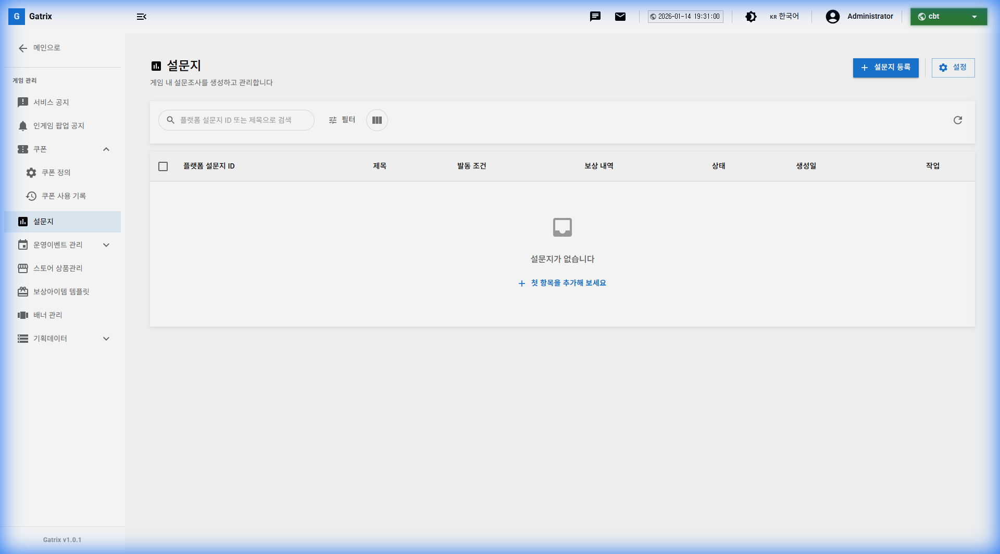
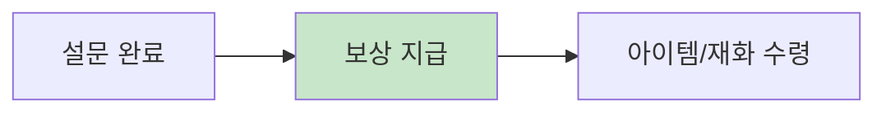

# 제 10장: 설문조사 관리 (Surveys)

게임 내 설문조사를 만들어 유저 의견을 수집하고 분석할 수 있습니다. 설문 참여 보상을 통해 참여율을 높일 수 있습니다.

**경로:** 게임 관리 (Game) → 설문지 (Surveys)  
**필요 권한:** `surveys.manage`

---

## 1. 화면 구성

설문조사 관리 페이지의 전체 화면입니다.

### 상단 툴바 버튼 설명

| 버튼          | 설명                          |
| ------------- | ----------------------------- |
| **설문 추가** | 새로운 설문조사를 생성합니다. |

### 테이블 컬럼 설명

| 컬럼          | 설명                            |
| ------------- | ------------------------------- |
| **설문 ID**   | 플랫폼별 설문 고유 식별자       |
| **제목**      | 설문조사 제목                   |
| **발동 조건** | 설문이 표시되는 조건            |
| **보상**      | 설문 참여 시 지급되는 보상      |
| **상태**      | 활성(Active) / 비활성(Inactive) |
| **생성일**    | 설문 생성 일시                  |
| **작업**      | ✏️ 편집, 🗑️ 삭제 버튼           |

---

## 2. 설문조사 생성

### 기본 정보

| 항목    | 필수 | 설명                  |
| ------- | :--: | --------------------- |
| 설문 ID |  ✅  | 플랫폼별 고유 식별자  |
| 제목    |  ✅  | 설문조사 제목         |
| 설명    |      | 설문에 대한 부가 설명 |
| 상태    |      | 활성화 여부           |

### 발동 조건

설문이 유저에게 표시되는 조건을 설정합니다.

| 조건                | 설명                     |
| ------------------- | ------------------------ |
| **즉시 표시**       | 조건 없이 바로 표시      |
| **특정 레벨 도달**  | 게임 내 특정 레벨 이상   |
| **플레이 시간**     | 일정 플레이 시간 경과 후 |
| **스테이지 클리어** | 특정 스테이지 완료 후    |

---

## 3. 설문 참여 보상

유저 참여를 유도하기 위해 보상을 설정할 수 있습니다.

### 보상 설정

| 보상 종류     | 예시                |
| ------------- | ------------------- |
| **게임 재화** | 골드 1,000, 젬 50   |
| **아이템**    | 가챠 티켓 1장       |
| **쿠폰**      | 설문 참여 감사 쿠폰 |

---

## 4. 설문 결과 분석

수집된 설문 결과를 분석하여 게임 개선에 활용합니다.

### 결과 확인

1. 설문 목록에서 해당 설문 선택
2. **결과 보기** 클릭
3. 통계 및 개별 응답 확인

---

## 5. 자주 묻는 질문 (FAQ)

**Q: 설문을 특정 유저에게만 보여줄 수 있나요?**

A: 네, 발동 조건을 설정하여 특정 조건을 만족하는 유저에게만 표시할 수 있습니다.

---

**Q: 보상이 중복 지급되지 않나요?**

A: 기본적으로 유저당 1회만 참여 및 보상 지급이 가능합니다.

---

**이전 장:** [← 제 10장: 쿠폰 관리](09-coupons.md)  
**다음 장:** [제 12장: 배너 관리 →](12-banners.md)
