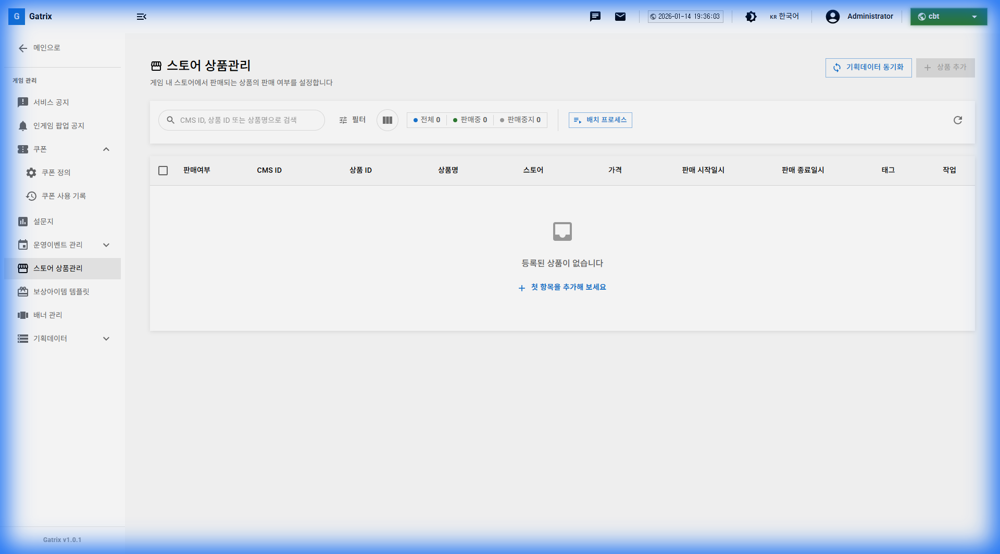
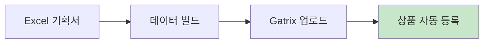
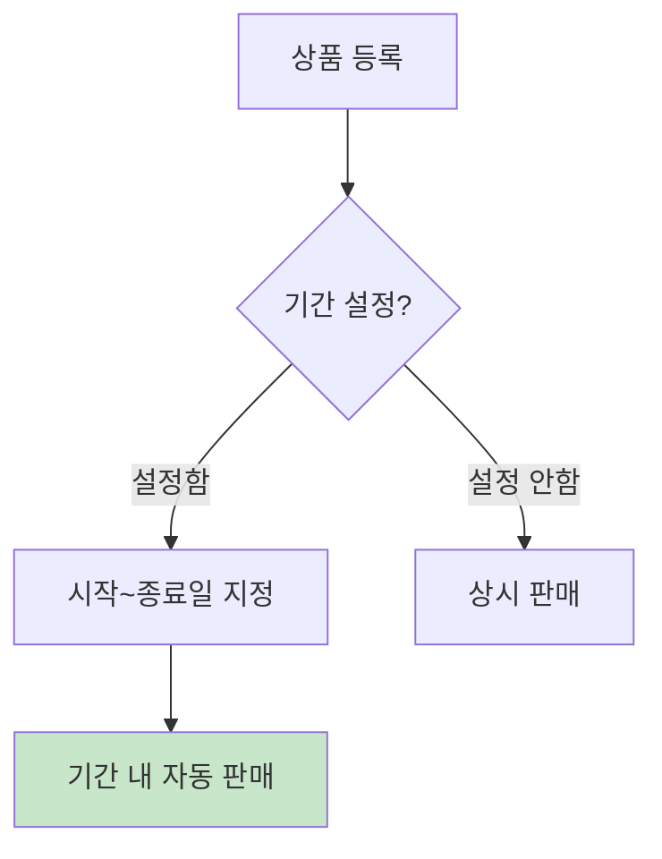

# 제 12장: 상점 상품 관리 (Store Products)

게임 내 상점에서 판매되는 상품들을 관리합니다. 주로 기획 데이터 동기화를 통해 상품이 등록되며, 대시보드에서는 판매 상태와 세부 설정을 조정할 수 있습니다.

**경로:** 게임 관리 (Game) → 스토어 상품관리 (Store Products)  
**필요 권한:** `store-products.manage`

---

## 1. 화면 구성

상점 상품 관리 페이지의 전체 화면입니다.

### 상단 툴바 버튼 설명

| 버튼 | 설명 |
|------|------|
| **상품 추가** | 새 상품 추가 (기획 데이터 동기화 권장) |
| **배치 프로세스** | 여러 상품 일괄 처리 |

### 테이블 컬럼 설명

| 컬럼 | 설명 |
|------|------|
| **판매여부** | 현재 판매 중 여부 |
| **CMS ID** | 기획 데이터 시스템 ID |
| **상품 ID** | 상품 고유 식별자 |
| **상품명** | 상품 표시 이름 |
| **스토어** | 판매 스토어 (IAP, 인게임 등) |
| **가격** | 판매 가격 |
| **시작/종료** | 판매 기간 |
| **태그** | 분류용 태그 |
| **작업** | ✏️ 편집, 🗑️ 삭제 버튼 |

---

## 2. 상품 등록 방법

### 방법 1: 기획 데이터 동기화 (권장)

상점 상품은 주로 기획 데이터(Excel/JSON)에서 정의되어 동기화됩니다.

### 방법 2: 직접 추가

대시보드에서 직접 상품을 추가할 수도 있습니다.

---

## 3. 상품 상태 관리

### 판매 상태

| 상태 | 설명 |
|------|------|
| **판매 중** | 유저가 구매 가능 |
| **판매 중지** | 목록에서 숨김 |
| **기간 한정** | 특정 기간에만 판매 |

### 판매 기간 설정

---

## 4. 스토어 종류

| 스토어 | 설명 | 결제 방식 |
|--------|------|----------|
| **IAP** | 인앱 결제 상품 | 실제 현금 |
| **인게임** | 게임 재화 상품 | 골드, 젬 등 |
| **이벤트** | 이벤트 한정 상품 | 재화/현금 혼합 |

---

## 5. 배치 프로세스

여러 상품을 한 번에 처리할 때 사용합니다.

| 작업 | 설명 |
|------|------|
| **일괄 판매 시작** | 선택한 상품들 판매 시작 |
| **일괄 판매 중지** | 선택한 상품들 판매 중지 |
| **일괄 삭제** | 선택한 상품들 삭제 |

---

## 6. 자주 묻는 질문 (FAQ)

**Q: 상품 가격을 변경하면 기존 구매자에게 영향이 있나요?**

A: 아니요, 가격 변경은 이후 구매에만 적용됩니다. 기존 구매는 영향받지 않습니다.

---

**Q: 기획 데이터와 충돌하면 어떻게 되나요?**

A: 기획 데이터 동기화 시 최신 데이터로 덮어씌워집니다. 대시보드에서 수정한 내용은 유지하려면 기획 측에 반영을 요청하세요.

---

**이전 장:** [← 제 11장: 설문조사 관리](10-surveys.md)  
**다음 장:** [제 13장: 배너 관리 →](12-banners.md)
