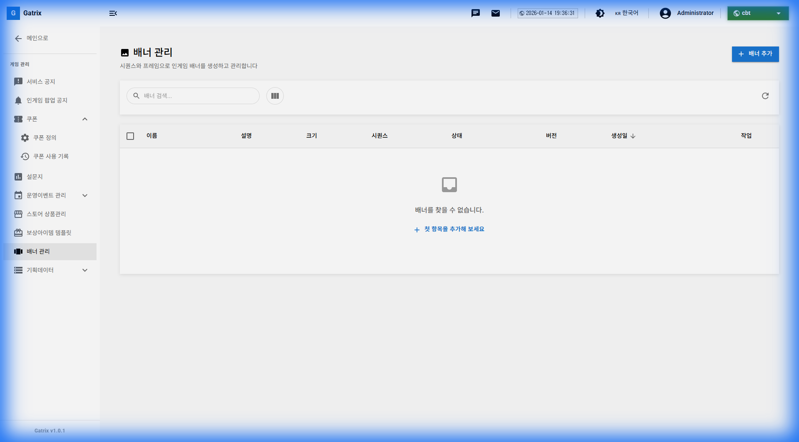
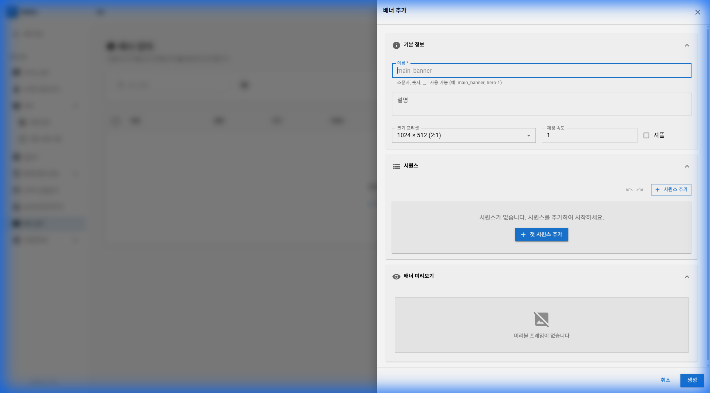
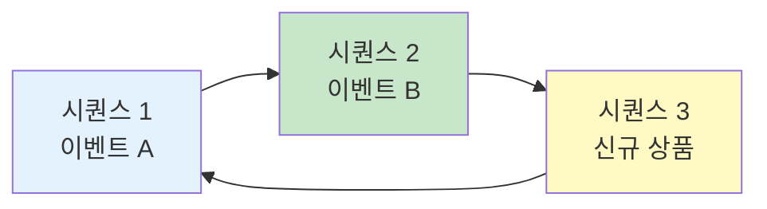
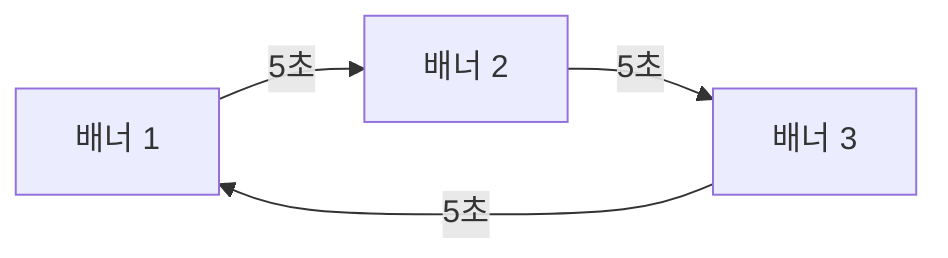
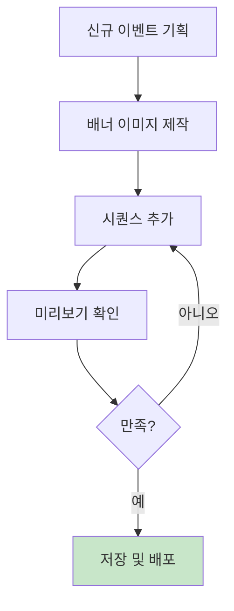

# 제 12장: 배너 관리 (Banner Management)

게임 내 배너는 이벤트 홍보, 상품 광고, 신규 콘텐츠 안내 등에 활용됩니다. Gatrix에서는 시퀀스 기반의 동적 배너를 생성하고 관리할 수 있습니다.

**경로:** 게임 관리 (Game) → 배너 관리 (Banner Management)  
**필요 권한:** `banners.manage`

---

## 1. 화면 구성

배너 관리 페이지의 전체 화면입니다.

### 상단 툴바 버튼 설명

| 버튼 | 설명 |
|------|------|
| **배너 추가** | 새로운 배너를 생성합니다. |

### 테이블 컬럼 설명

| 컬럼 | 설명 |
|------|------|
| **이름** | 배너 이름 (관리용) |
| **설명** | 배너에 대한 부가 설명 |
| **크기** | 배너 사이즈 (예: 1024×512) |
| **시퀀스** | 배너에 포함된 프레임/시퀀스 수 |
| **상태** | 활성(Active) / 비활성(Inactive) |
| **버전** | 배너 버전 (수정 시 버전 업) |
| **생성일** | 배너 생성 일시 |
| **작업** | ✏️ 편집, 🗑️ 삭제 버튼 |

---

## 2. 배너 생성하기

**[배너 추가]** 버튼을 클릭하면 아래와 같은 폼이 나타납니다.

### 입력 항목 상세 설명

| 섹션 | 항목 | 필수 | 설명 |
|------|------|:----:|------|
| **기본 정보** | 이름 | ✅ | 배너 이름 (예: main_banner, event_2024) |
| | 설명 | | 배너에 대한 부가 설명 |
| | 크기 프리셋 | ✅ | 배너 사이즈 선택 (예: 1024×512) |
| | 재생 속도 | | 시퀀스 전환 속도 (초 단위) |
| | 사용 | | 배너 활성화 여부 |
| **시퀀스** | 시퀀스 목록 | | 배너에 포함될 프레임들 |
| **미리보기** | 배너 미리보기 | | 실시간으로 배너 렌더링 결과 확인 |

---

## 3. 시퀀스 기반 배너 구조

Gatrix 배너는 여러 **시퀀스(프레임)**로 구성됩니다.

### 시퀀스 설정 항목

| 항목 | 설명 |
|------|------|
| **이미지 URL** | 배너 프레임 이미지 경로 |
| **링크 URL** | 클릭 시 이동할 URL (선택) |
| **노출 시간** | 해당 프레임 표시 시간 |
| **순서** | 프레임 표시 순서 |

---

## 4. 크기 프리셋

게임 내 배치 위치에 따라 적절한 크기를 선택합니다.

| 프리셋 | 크기 | 권장 용도 |
|--------|------|----------|
| **1024×512 (2:1)** | 가로형 | 메인 배너, 이벤트 배너 |
| **512×512 (1:1)** | 정사각형 | 아이콘, 썸네일 |
| **512×1024 (1:2)** | 세로형 | 사이드 배너, 팝업 |

---

### 배너 노출 로직

## 5. 운영 시나리오

### 시나리오: 이벤트 배너 교체

1. **[배너 추가]** 또는 기존 배너 **[편집]** 클릭
2. 새 이벤트 이미지 URL 입력
3. 링크 URL 설정 (이벤트 상세 페이지)
4. **미리보기**에서 확인
5. **[저장]**

---

## 6. 자주 묻는 질문 (FAQ)

**Q: 배너 이미지는 어디에 업로드하나요?**

A: 배너 이미지는 별도의 CDN이나 이미지 호스팅 서비스에 업로드한 후, URL을 입력합니다. Gatrix에서는 이미지 URL만 관리합니다.

---

**Q: 시퀀스 순서를 변경하려면?**

A: 시퀀스 목록에서 드래그 앤 드롭으로 순서를 변경할 수 있습니다.

---

**이전 장:** [← 제 11장: 상점 상품 관리](11-store-products.md)  
**다음 장:** [제 13장: 기획 데이터 관리 →](13-planning-data.md)
