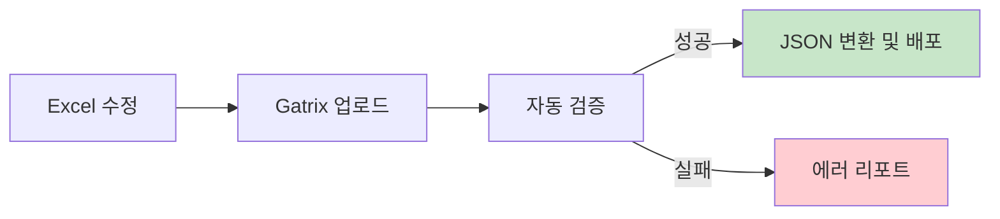
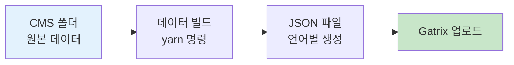
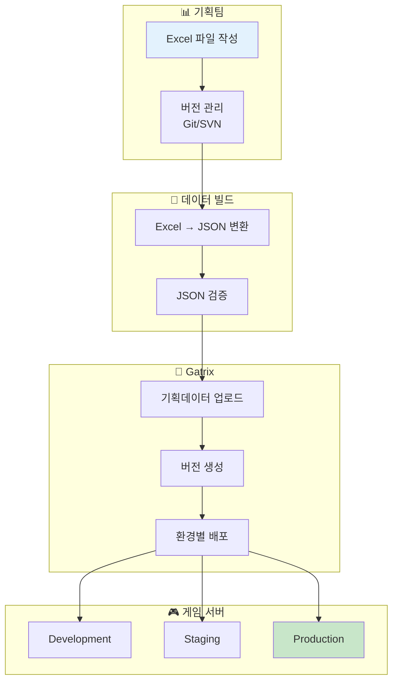
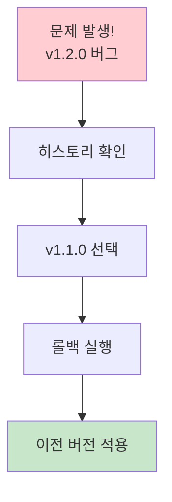

# 제 13장: 기획 데이터 관리 (Planning Data)

기획 데이터는 게임의 밸런스, 아이템 정보, 스테이지 설정 등 핵심 콘텐츠 데이터를 관리합니다. Excel로 작성된 기획 데이터를 JSON으로 변환하여 게임에 적용합니다.

**경로:** 게임 관리 (Game) → 기획데이터 → 기획데이터 관리  
**필요 권한:** `planning-data.manage`

---

## 1. 화면 구성

### 데이터 처리 파이프라인



### 상단 툴바 버튼 설명

| 버튼 | 설명 |
|------|------|
| **새로고침** | 현재 데이터 목록 새로고침 |
| **기획데이터 업로드** | 새로운 기획 데이터 업로드 |

---

## 2. 업로드 방법 안내

기획 데이터를 업로드하는 방법은 크게 3가지입니다.

### 방법 1: 웹 UI를 통한 업로드

1. **[기획데이터 업로드]** 버튼 클릭
2. 파일 선택기에서 Excel/JSON 파일 선택
3. 업로드 완료

### 방법 2: CMS → JSON 변환 (빌드)

CMS 폴더의 원본 데이터를 JSON 파일로 변환하는 과정입니다.



**CLI 명령어:**
```bash
# 프로젝트 루트에서 실행 (권장)
yarn planning-data:convert

# 옵션 사용
yarn planning-data:convert --input <CMS폴더경로> --output <출력폴더경로>

# 도움말 보기
yarn planning-data:convert --help
```

**옵션 설명:**

| 옵션 | 설명 | 기본값 |
|------|------|--------|
| `--input <path>` | CMS 폴더 경로 | `./packages/backend/cms` |
| `--output <path>` | 출력 폴더 경로 | `./packages/backend/data/planning` |
| `--verbose` | 상세 로깅 | - |

### 방법 3: CLI를 통한 원격 업로드

빌드된 JSON 파일들을 원격 Gatrix 서버에 업로드합니다.

```bash
# 기본 사용법
yarn upload-planning-data \
  --api-url=https://gatrix.example.com \
  --env=production \
  --dir=./packages/backend/data/planning \
  --token=<SERVER_API_TOKEN>

# 업로더 이름 및 코멘트 추가 (CI/CD용)
yarn upload-planning-data \
  --api-url=https://gatrix.example.com \
  --env=qa \
  --dir=./planning-data \
  --token=$GATRIX_API_TOKEN \
  --uploader="Jenkins CI" \
  --comment="Build #123"
```

**옵션 설명:**

| 옵션 | 필수 | 설명 |
|------|:----:|------|
| `--api-url` | ✅ | Gatrix 백엔드 API URL |
| `--env` | ✅ | 대상 환경 (dev, qa, production, development) |
| `--dir` | | 업로드할 JSON 파일이 있는 폴더 (기본값: `./output`) |
| `--token` | | Server API 토큰 (기본값: `gatrix-unsecured-server-api-token`) |
| `--uploader` | | 업로더 이름 (예: "Jenkins CI") |
| `--comment` | | 업로드 코멘트 |

### 방법 4: game 저장소 독립 도구

Gatrix 저장소 없이 game 저장소만으로 기획 데이터를 변환하고 업로드할 수 있습니다.

**위치:** `game/gatrix/planning-data/`

```bash
# 1. 도구 디렉토리로 이동
cd game/gatrix/planning-data

# 2. 의존성 설치 (최초 1회)
yarn install

# 3. 기획데이터 변환 (game/cms → ./output)
yarn convert

# 4. Gatrix 서버에 업로드
yarn upload --api-url=gatrix.example.com --env=production
```

**변환 옵션:**

| 옵션 | 설명 | 기본값 |
|------|------|--------|
| `--source-root` | 소스 루트 경로 (client/, locdata/ 포함) | `../../cms` |
| `--output` | 출력 폴더 경로 | `./output` |
| `--binary-code` | 바이너리 코드 (kr, us, cn) | `cn` |
| `--country-code` | 국가 코드 (0=KOREA, 2=GLOBAL, 6=CHINA) | `6` |

**업로드 옵션:**

| 옵션 | 필수 | 설명 |
|------|:----:|------|
| `--api-url` | ✅ | Gatrix 백엔드 API URL (프로토콜 생략 가능) |
| `--env` | ✅ | 대상 환경 (development, qa, production) |
| `--dir` | | 업로드할 폴더 (기본값: `./output`) |
| `--token` | | API 토큰 (기본값: 개발용 토큰) |

**출력 예시:**

```
╔════════════════════════════════════════════════════════════════╗
║           Gatrix Planning Data Uploader                        ║
╚════════════════════════════════════════════════════════════════╝

📋 Configuration
────────────────────────────────────────────────────────────────
   API URL     : http://127.0.0.1:45000
   Environment : development
   Source Dir  : C:\work\uwo\game\gatrix\planning-data\output
   Token       : (default dev token)

📁 Files to Upload (23 files)
   From: C:\work\uwo\game\gatrix\planning-data\output
────────────────────────────────────────────────────────────────
   • cashshop-lookup.json
   • eventpage-lookup-kr.json
   ...

📤 Uploading...

╔════════════════════════════════════════════════════════════════╗
║                    ✅ Upload Successful                        ║
╚════════════════════════════════════════════════════════════════╝

📊 Result Summary
────────────────────────────────────────────────────────────────
   Environment    : development
   Files Uploaded : 23
   Changed Files  : 23
   Upload Hash    : c9e3586f4f9960e1
```

---

## 3. 데이터 동기화 플로우



---

## 4. 버전 관리

업로드된 기획 데이터는 버전으로 관리됩니다.

| 항목 | 설명 |
|------|------|
| **버전** | 업로드 시 자동 생성되는 버전 번호 |
| **업로드 일시** | 데이터 업로드 시간 |
| **업로더** | 업로드한 관리자 |
| **변경 내역** | 이전 버전과의 차이점 |
| **롤백** | 이전 버전으로 되돌리기 |

---

## 5. 히스토리 및 롤백

데이터 문제 발생 시 이전 버전으로 롤백할 수 있습니다.



---

## 6. 자주 묻는 질문 (FAQ)

**Q: 기획 데이터 형식은 무엇인가요?**

A: Excel(.xlsx) 또는 JSON 형식을 지원합니다. Excel 파일은 빌드 과정에서 JSON으로 자동 변환됩니다.

---

**Q: 환경별로 다른 데이터를 적용할 수 있나요?**

A: 네, 환경(Development, Staging, Production)별로 다른 버전의 데이터를 배포할 수 있습니다.

---

**Q: 롤백하면 현재 데이터는 어떻게 되나요?**

A: 롤백해도 현재 버전의 데이터는 히스토리에 남아있습니다. 언제든지 다시 적용할 수 있습니다.

---

**이전 장:** [← 제 12장: 배너 관리](12-banners.md)  
**다음 장:** [제 14장: 리모트 컨피그 →](14-remote-config.md)
