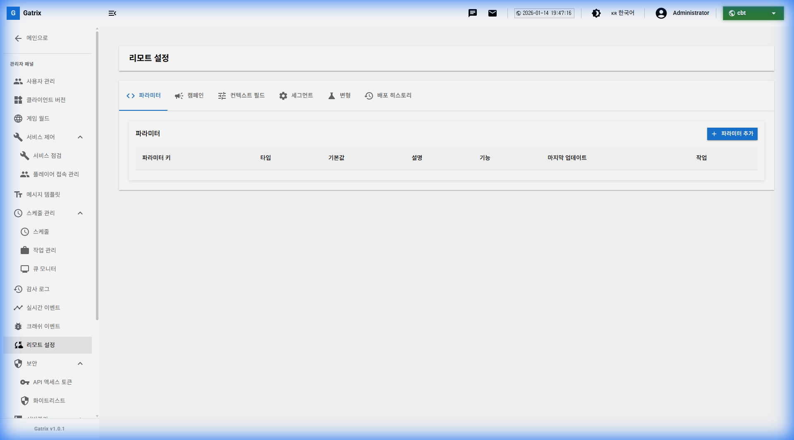
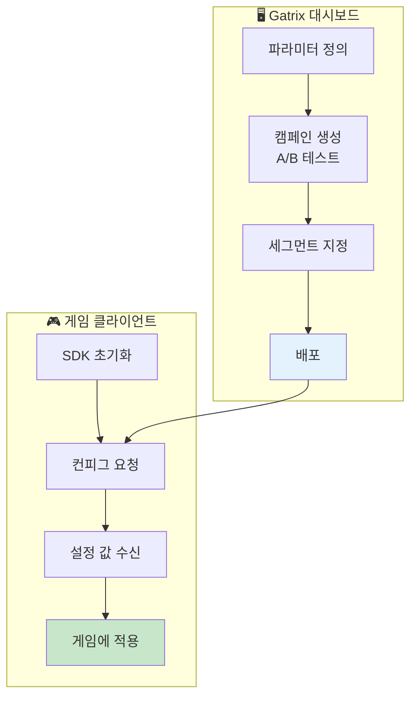
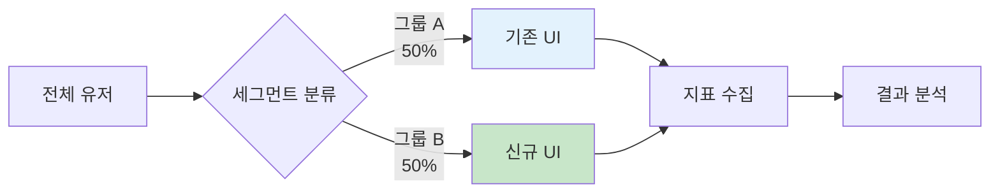
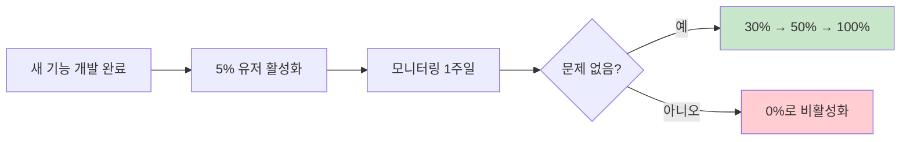
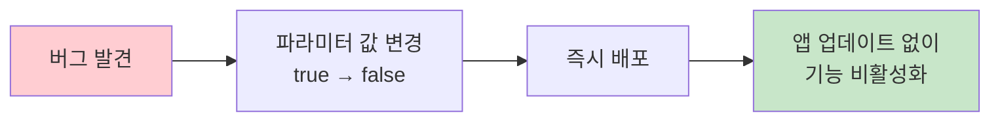

# 제 14장: 리모트 컨피그 (Remote Config - 개발 중)

리모트 컨피그는 앱 업데이트 없이 게임의 동작을 원격으로 제어할 수 있는 기능입니다. A/B 테스트, 기능 플래그, 동적 설정 변경 등에 활용됩니다.

**경로:** 관리자 패널 (Admin Panel) → 리모트 설정 (Remote Setting)  
**필요 권한:** `remote-config.manage`

---

## 1. 화면 구성

리모트 컨피그 관리 페이지의 전체 화면입니다.

### 탭 구성

| 탭 | 설명 |
|------|------|
| **파라미터** | 기본 설정 값 관리 |
| **캠페인** | A/B 테스트 캠페인 관리 |
| **컨텍스트 필드** | 유저 속성 필드 정의 |
| **세그먼트** | 유저 그룹 세분화 |
| **변형** | 실험 변형(Variant) 관리 |
| **배포 히스토리** | 배포 이력 확인 |

---

## 2. 파라미터 관리

게임에서 사용하는 설정 값들을 정의하고 관리합니다.

### 파라미터 목록 컬럼

| 컬럼 | 설명 |
|------|------|
| **파라미터 키** | 고유 식별자 (예: `welcome_message`) |
| **타입** | 데이터 타입 (String, Number, Boolean, JSON) |
| **기본값** | 기본 설정 값 |
| **설명** | 파라미터에 대한 설명 |
| **기능** | 적용된 기능 플래그 |
| **마지막 업데이트** | 최근 수정 일시 |

### 파라미터 타입

| 타입 | 용도 예시 |
|------|----------|
| **String** | 공지 메시지, URL, 텍스트 |
| **Number** | 보너스 배율, 타이머 값 |
| **Boolean** | 기능 On/Off 플래그 |
| **JSON** | 복잡한 설정 객체 |

---

## 3. 리모트 컨피그 활용 플로우

---

## 4. A/B 테스트 (캠페인)

특정 유저 그룹에게 다른 설정 값을 적용하여 효과를 비교합니다.

### 캠페인 설정 항목

| 항목 | 설명 |
|------|------|
| **캠페인 이름** | 실험 식별용 이름 |
| **대상 파라미터** | 변경할 파라미터 |
| **변형 (Variant)** | 각 그룹별 설정 값 |
| **트래픽 배분** | 그룹별 유저 비율 (%) |
| **기간** | 캠페인 진행 기간 |

---

## 5. 세그먼트 (유저 그룹)

특정 조건을 만족하는 유저 그룹을 정의합니다.

### 세그먼트 조건 예시

| 조건 | 설명 | 예시 |
|------|------|------|
| **플랫폼** | OS 종류 | iOS, Android |
| **국가** | 접속 국가 | KR, US, JP |
| **앱 버전** | 클라이언트 버전 | >= 2.0.0 |
| **유저 레벨** | 게임 내 레벨 | >= 10 |
| **VIP 등급** | 결제 등급 | Gold, Platinum |

---

## 6. 운영 시나리오

### 시나리오: 신규 기능 점진적 롤아웃

1. 파라미터 생성: `new_feature_enabled` (Boolean)
2. 기본값: `false`
3. 캠페인 생성: 5% 유저에게 `true` 적용
4. 1주일 모니터링 후 점진적 확대

### 시나리오: 긴급 기능 비활성화

---

## 7. 자주 묻는 질문 (FAQ)

**Q: 파라미터 변경이 즉시 반영되나요?**

A: 배포 후 클라이언트가 다음 요청 시 새 값을 받습니다. 즉시 반영이 필요하면 클라이언트에서 폴링 주기를 조정하세요.

---

**Q: 배포를 롤백할 수 있나요?**

A: 네, **배포 히스토리** 탭에서 이전 버전으로 롤백할 수 있습니다.

---

**이전 장:** [← 제 13장: 기획 데이터 관리](13-planning-data.md)  
**다음 장:** [제 15장: 감사 로그 →](15-audit-logs.md)
