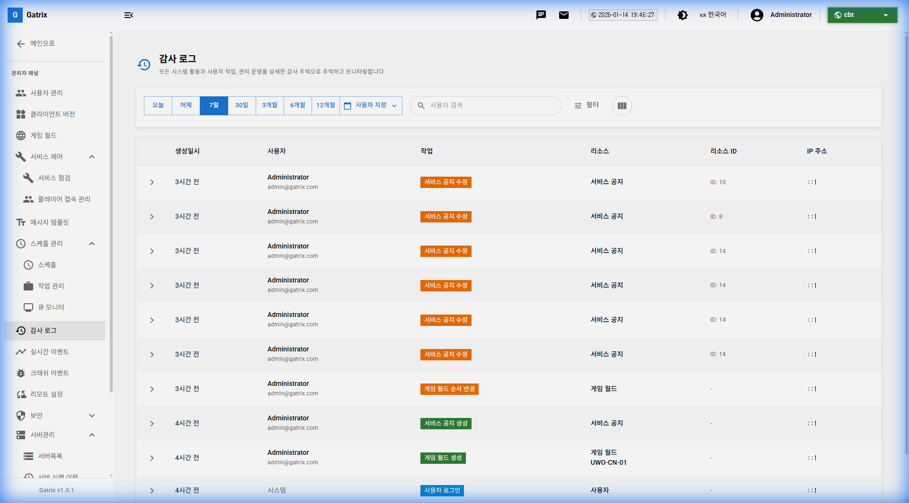
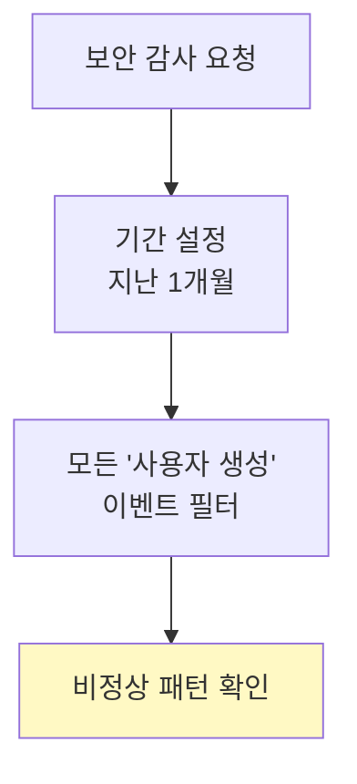

# 제 15장: 감사 로그 (Audit Logs)

감사 로그는 대시보드에서 발생하는 모든 관리자 활동을 기록합니다. 보안 감사, 문제 추적, 책임 소재 확인에 필수적인 기능입니다.

**경로:** 관리자 패널 (Admin Panel) → 감사 로그 (Audit Log)  
**필요 권한:** `audit-logs.view`

---

## 1. 화면 구성

감사 로그 페이지의 전체 화면입니다.

### 필터 옵션

| 필터            | 설명                      |
| --------------- | ------------------------- |
| **오늘**        | 오늘 발생한 로그만 표시   |
| **어제**        | 어제 발생한 로그만 표시   |
| **7일**         | 최근 7일 로그             |
| **1개월**       | 최근 1개월 로그           |
| **사용자 지정** | 날짜 범위 직접 선택       |
| **사용자 검색** | 특정 사용자의 활동만 필터 |

### 테이블 컬럼 설명

| 컬럼          | 설명                  |
| ------------- | --------------------- |
| **생성일시**  | 활동 발생 시간        |
| **사용자**    | 활동을 수행한 관리자  |
| **작업**      | 수행한 작업 종류      |
| **리소스**    | 작업 대상 리소스 종류 |
| **리소스 ID** | 작업 대상의 고유 ID   |
| **IP 주소**   | 접속 IP               |

---

## 2. 기록되는 활동 유형

### 주요 이벤트 목록

| 이벤트                  | 설명                  | 리소스      |
| ----------------------- | --------------------- | ----------- |
| **서비스 공지 고정**    | 공지사항 상단 고정    | 서비스 공지 |
| **게임 월드 순서 변경** | 월드 목록 순서 수정   | 게임 월드   |
| **월드 편집**           | 월드 정보 수정        | 게임 월드   |
| **사용자 생성**         | 새 관리자 계정 생성   | 사용자      |
| **사용자 편집**         | 관리자 정보/권한 수정 | 사용자      |
| **쿠폰 생성**           | 새 쿠폰 발행          | 쿠폰        |
| **로그인**              | 대시보드 로그인       | 사용자      |
| **감사 로그 조회**      | 감사 로그 확인        | 감사 로그   |

---

## 3. 감사 로그 활용 시나리오

### 시나리오: "누가 이 공지를 수정했지?"

1. 감사 로그 페이지 접속
2. 리소스 검색: "서비스 공지"
3. 해당 공지 ID로 필터링
4. 최근 수정 이력 확인

### 시나리오: 보안 감사

---

## 4. 상세 정보 확인

각 로그 항목을 클릭하면 상세 정보를 확인할 수 있습니다.

| 정보                | 설명                    |
| ------------------- | ----------------------- |
| **변경 전 데이터**  | 수정 전 상태 (JSON)     |
| **변경 후 데이터**  | 수정 후 상태 (JSON)     |
| **요청 정보**       | HTTP 메서드, 경로 등    |
| **사용자 에이전트** | 접속 브라우저/기기 정보 |

---

## 5. 자주 묻는 질문 (FAQ)

**Q: 감사 로그는 얼마나 오래 보관되나요?**

A: 기본적으로 90일간 보관됩니다. 보관 기간은 시스템 설정에서 조정할 수 있습니다.

---

**Q: 감사 로그를 CSV로 내보낼 수 있나요?**

A: 현재 버전에서는 화면에서 조회만 가능합니다. 내보내기가 필요하면 데이터베이스 담당자에게 문의하세요.

---

**Q: 특정 사용자의 모든 활동을 추적하려면?**

A: 검색창에 사용자 이메일을 입력하면 해당 사용자의 모든 활동 로그가 필터링됩니다.

---

**이전 장:** [← 제 14장: 리모트 컨피그](14-remote-config.md)  
**다음 장:** [제 16장: API 토큰 관리 →](16-api-tokens.md)
