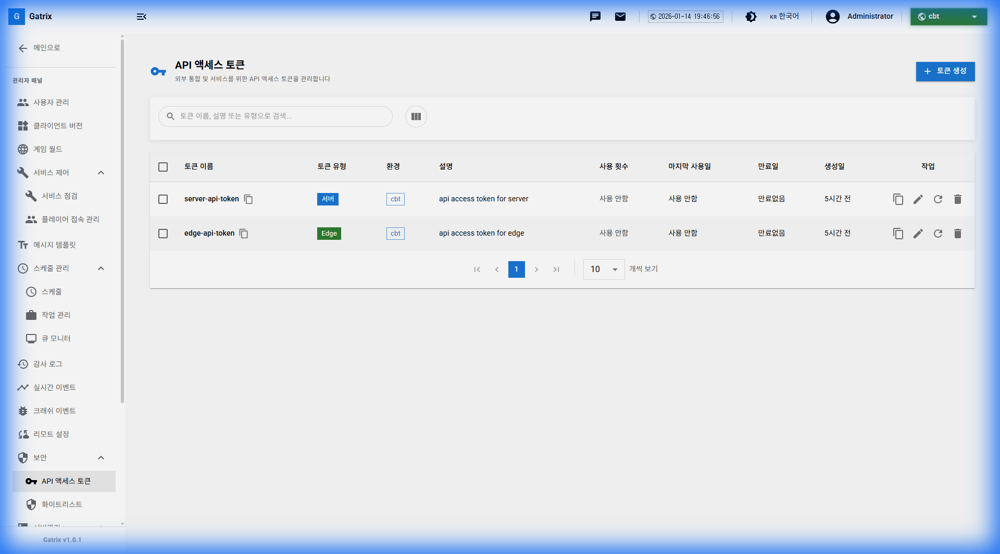
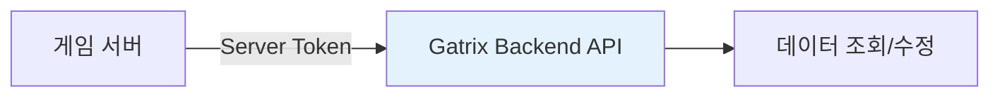
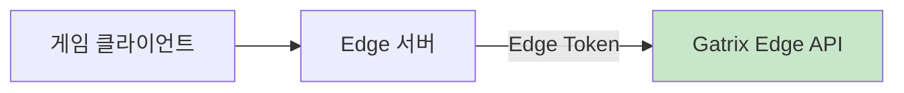
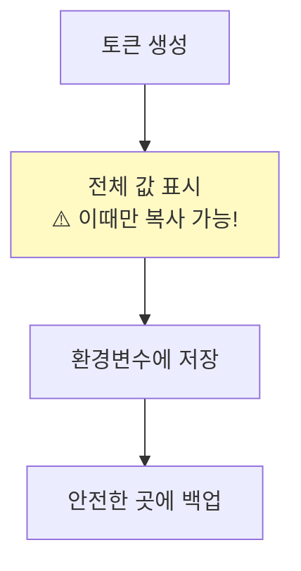

# 제 16장: API 토큰 관리 (API Access Tokens)

API 토큰은 외부 시스템(게임 서버, Edge 서버, CI/CD 파이프라인 등)이 Gatrix API에 접근할 때 인증에 사용됩니다.

**경로:** 관리자 패널 (Admin Panel) → 보안 (Security) → API 액세스 토큰  
**필요 권한:** `api-tokens.manage`

> **🎬 영상 가이드:** [API 토큰 관리 방법 보기](videos/07-apitokens.mp4)

---

## 1. 화면 구성

API 토큰 관리 페이지의 전체 화면입니다.



### 상단 툴바 버튼 설명

| 버튼          | 설명                          |
| ------------- | ----------------------------- |
| **토큰 생성** | 새로운 API 토큰을 생성합니다. |

### 테이블 컬럼 설명

| 컬럼              | 설명                                    |
| ----------------- | --------------------------------------- |
| **토큰 이름**     | 토큰 식별용 이름                        |
| **토큰 유형**     | API / Edge                              |
| **환경**          | 적용 환경 (dev, staging, production 등) |
| **설명**          | 토큰 용도 설명                          |
| **사용 횟수**     | 토큰이 사용된 횟수                      |
| **마지막 사용일** | 최근 사용 일시                          |
| **만료일**        | 토큰 만료 예정일                        |
| **생성일**        | 토큰 생성 일시                          |
| **작업**          | 복사, ✏️ 편집, 🔄 재생성, 🗑️ 삭제 버튼  |

---

## 2. 토큰 유형

### 2.1 Server API 토큰

게임 서버가 Gatrix 백엔드 API를 호출할 때 사용합니다.



**용도:**

- 점검 상태 조회
- 공지사항 조회
- 쿠폰 검증
- 기획 데이터 동기화

### 2.2 Edge API 토큰

Edge 서버가 Gatrix Edge API를 호출할 때 사용합니다.



- 게임 월드 목록 조회
- 실시간 설정 조회

---

## 3. 토큰 생성하기

**[토큰 생성]** 버튼을 클릭하여 새 토큰을 생성합니다.

### 입력 항목

| 항목   | 필수 | 설명                                    |
| ------ | :--: | --------------------------------------- |
| 이름   |  ✅  | 토큰 식별용 이름 (예: game-server-prod) |
| 유형   |  ✅  | API / Edge 선택                         |
| 환경   |  ✅  | 적용 환경 선택                          |
| 설명   |      | 토큰 용도 메모                          |
| 만료일 |      | 토큰 유효 기간 (비워두면 무기한)        |

---

## 4. 토큰 보안 관리

### 토큰 값 확인

토큰은 생성 시 **한 번만** 전체 값이 표시됩니다. 이후에는 마스킹된 형태로만 확인 가능합니다.



> **⚠️ 중요:** 토큰 값을 분실하면 재생성해야 합니다. 재생성하면 기존 토큰은 무효화됩니다.

### 토큰 재생성

보안상의 이유로 토큰을 변경해야 할 때 사용합니다.

1. 목록에서 **[🔄 재생성]** 버튼 클릭
2. 새 토큰 값이 생성됨
3. **기존 토큰은 즉시 무효화**됨
4. 연결된 모든 서버의 토큰 업데이트 필요

---

## 5. 환경별 토큰 관리

보안을 위해 환경별로 별도의 토큰을 사용하는 것이 좋습니다.

| 환경            | 토큰 예시         | 보안 수준 |
| --------------- | ----------------- | :-------: |
| **Development** | dev-api-token     |  🟢 낮음  |
| **Staging**     | staging-api-token |  🟡 중간  |
| **Production**  | prod-api-token    |  🔴 높음  |

> **💡 원칙:** Production 토큰은 최소한의 인원만 접근 가능하도록 관리하세요.

---

## 6. 토큰 사용 예시

### HTTP Header에 토큰 포함

```bash
curl -X GET https://api.gatrix.com/v1/game-worlds \
  -H "Authorization: Bearer YOUR_API_TOKEN" \
  -H "Content-Type: application/json"
```

### 환경변수 설정 (Node.js)

```javascript
const GATRIX_API_TOKEN = process.env.GATRIX_API_TOKEN;

const response = await fetch('https://api.gatrix.com/v1/game-worlds', {
  headers: {
    Authorization: `Bearer ${GATRIX_API_TOKEN}`,
    'Content-Type': 'application/json',
  },
});
```

---

## 7. 자주 묻는 질문 (FAQ)

**Q: 토큰이 유출되었을 때 어떻게 하나요?**

A: 즉시 해당 토큰의 **[🔄 재생성]** 버튼을 클릭하여 무효화하세요. 그리고 새 토큰을 서버에 적용하세요.

---

**Q: 토큰에 만료일을 설정하는 것이 좋나요?**

A: 보안 정책에 따라 다릅니다. 정기적인 토큰 교체가 필요하면 만료일을 설정하고, 만료 전에 재생성하세요.

---

**Q: 사용 횟수가 비정상적으로 높으면?**

A: 토큰 유출 또는 시스템 오류의 징후일 수 있습니다. 감사 로그를 확인하고 필요시 토큰을 재생성하세요.

---

## 8. 동영상 가이드

### API 토큰 관리 전체 흐름

<video width="100%" controls>
  <source src="videos/07-apitokens.mp4" type="video/mp4">
  브라우저가 비디오를 지원하지 않습니다.
</video>

---

**이전 장:** [← 제 15장: 감사 로그](15-audit-logs.md)
