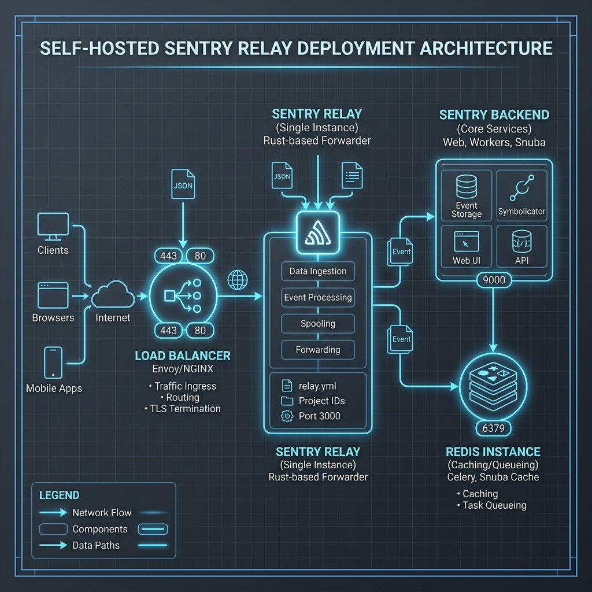
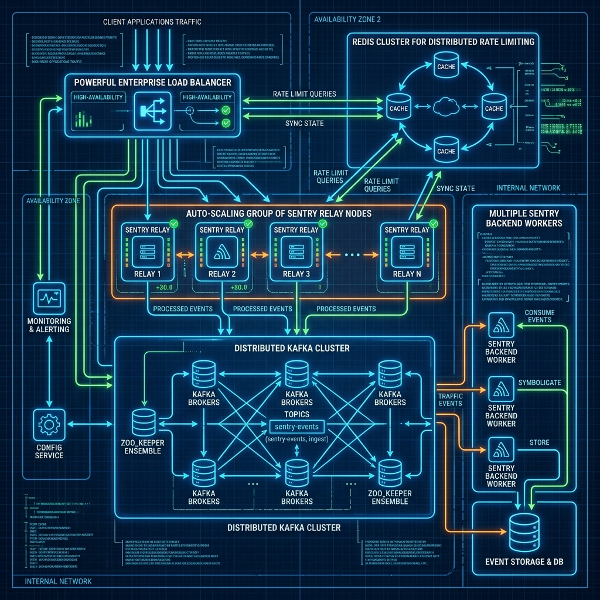

# Argus Relay (Rust) 마스터 아키텍처 구현 계획

이 문서는 Sentry SDK의 멀티파트 Envelope 포맷을 완벽하게 수집하고 고성능으로 처리하기 위해, **실제 Sentry Relay(`getsentry/relay`)의 방대한 구조와 코드베이스 수준을 그대로 재현**하는 독립적인 고성능 Rust 수집 서버(Argus Relay)의 마스터 아키텍처 플랜입니다.

단순한 라우팅을 넘어, 다중 크레이트(Multi-Crate) 분할, 복잡한 스레드 모델(CPU vs I/O), 메모리 파편화 방지, 다계층 쿼터 제어, 메트릭 추출 등을 모두 포함합니다.

---

## 1. 다중 크레이트 워크스페이스 (Multi-Crate Workspace) 아키텍처
Relay의 거대한 복잡성을 관리하기 위해, 단일 바이너리가 아닌 역할별로 분리된 하위 크레이트(Crate)들의 워크스페이스로 구축합니다.

* **`argus-relay-server`**: 애플리케이션 엔트리포인트 및 `axum` 기반 HTTP 웹 서버. 수신된 Envelope를 스레드 풀로 넘기는(Handoff) 역할.
* **`argus-relay-event-schema`**: Sentry 데이터 스키마(Error, Transaction, Session 등)에 대한 강력한 Rust `struct` 및 `enum` 정의. 직렬화/역직렬화의 코어.
* **`argus-relay-event-normalization`**: 지저분하게 인입된 데이터를 표준 포맷으로 확장/정규화(예: User-Agent 파싱, 타임스탬프 보정, 스택트레이스 프레임 역전 등)하는 로직.
* **`argus-relay-pii`**: Advanced Data Scrubbing 전용 엔진. 방대한 정규식을 매우 빠르게 처리하고, JSON 트리를 순회하며 민감 정보(이메일, 카드번호, IP, 비밀번호)를 `[Filtered]`로 치환.
* **`argus-relay-metrics`**: APM 트랜잭션과 스팬 데이터를 파싱하여, 시계열 통계용 메트릭(StatsD 호환 카운터/타이머)을 별도로 추출(Extraction)해내는 엔진.
* **`argus-relay-dynamic-config`**: Node.js 백엔드로부터 프로젝트의 설정(DSN, 쿼터, 인바운드 필터 룰)을 주기적으로 Polling하여 로컬 상태(`moka` 캐시)에 동기화.
* **`argus-relay-threading`**: 비동기 I/O 런타임(`tokio`)과 별개로, 무거운 CPU 바운드 연산(PII 정규식, JSON 렌더링)을 처리할 전용 스레드 풀(Thread Pool) 관리.

---

## 2. 코어 시스템 메커니즘 (Core Mechanisms)

### 2.1. 하이브리드 스레드 모델 (Hybrid Threading Model)
* **I/O Pool (`tokio`)**: 수만 개의 동시 HTTP 연결을 받아내고, Redpanda/Redis로 데이터를 네트워크 송출하는 가벼운 비동기 작업 전담.
* **Processing Pool (`rayon` / Dedicated Threads)**: `tokio` 워커가 블로킹되지 않도록, CPU를 100% 점유하는 PII 스크러빙이나 200MB짜리 거대 JSON 트리 순회 작업은 전용 백그라운드 프로세싱 스레드 큐로 오프로딩(Offloading)합니다.

### 2.2. 다계층 Rate Limiting (Multi-Tier Quotas)
단순한 429 에러가 아닌, Sentry 규격에 맞는 다계층 토큰 버킷(Token Bucket) 시스템입니다.
* **Global Limit**: 시스템 전체의 물리적 보호(예: 초당 10만 건 초과 시 전체 Drop).
* **Organization Limit**: 특정 회사의 요금제 한도 보호.
* **Project Limit**: 개별 프로젝트별 트래픽 스파이크 제어.
* **Category Limit**: 에러(Error) 한도는 찼으나 트랜잭션(Transaction)은 허용하는 식의 페이로드 카테고리별 부분 제어(Partial Rate Limiting).

### 2.3. 무중단 메모리 관리 (Memory Management)
* 거대한 Envelope(특히 리플레이나 미니덤프)를 파싱할 때 잦은 Heap 할당/해제로 인한 메모리 파편화(Fragmentation)를 막기 위해, `bumpalo` 같은 아레나 할당기(Arena Allocator) 사용을 고려하거나, Zero-copy 파싱(`memchr` 바이트 슬라이싱)을 통해 원본 버퍼의 포인터만 차용하여 라이프사이클을 관리합니다.

### 2.4. 데드 레터 큐 (Dead Letter Queue, DLQ)
* 파싱 불가능한 깨진 JSON, 스펙과 완전히 어긋난 바이너리 쓰레기, 정규화 도중 패닉이 발생할 위험이 있는 페이로드는 무시하지 않고 별도의 DLQ로 덤프를 떠서 디버깅에 활용합니다.

---

## 3. 전체 아키텍처 다이어그램 및 파이프라인 흐름

### 3.1. 거시적 시스템 시퀀스 다이어그램 (Macro Sequence Diagram)

```mermaid
sequenceDiagram
    participant SDK as Client SDK
    participant Axum as Relay Server (Tokio)
    participant Config as Dynamic Config
    participant Redis as Redis (Rate Limit)
    participant CPU as Processor Pool
    participant Broker as Redpanda (Kafka API)
    
    SDK->>Axum: POST /api/:project_id/envelope/
    
    Axum->>Config: Get Project Config & Check DSN
    alt Config Not Found / DSN Revoked
        Axum-->>SDK: 401 Unauthorized
    end
    
    Axum->>Redis: Check Quotas (Org, Project, Category)
    alt Token Bucket Exhausted
        Redis-->>Axum: Limit Hit
        Axum-->>SDK: 429 Too Many Requests (X-Sentry-Rate-Limits)
    end
    Redis-->>Axum: Tokens Allocated
    
    Axum->>CPU: Handoff Raw Envelope Buffer
    
    rect rgb(30, 40, 50)
    Note over CPU: [argus-relay-event-normalization]
    Note over CPU: [argus-relay-pii] Scrubbing
    Note over CPU: [argus-relay-metrics] Extraction
    end
    
    alt Parsing Error
        CPU->>Broker: Send to DLQ
    else Successfully Processed
        CPU->>Broker: Produce (Events, Transactions, Replays)
    end
    
    Axum-->>SDK: 202 Accepted
```



### 3.2. 크레이트간 데이터 파이프라인 플로우차트 (Crate Pipeline)

```mermaid
graph TD
    A([HTTP Stream (argus-relay-server)]) --> B[Zero-copy Envelope Split]
    B --> C{Rate Limit Check}
    
    C -->|Limit Hit| D([Drop & Return 429])
    C -->|Pass| E[Offload to ThreadPool (argus-relay-threading)]
    
    E --> F[argus-relay-event-normalization]
    F -->|Invalid Data| G[DLQ Storage]
    
    F -->|Valid Normalization| H[argus-relay-pii]
    H -->|Regex / AST Masking| I[argus-relay-metrics]
    
    I -->|Extract StatsD/Metrics| J[Metrics Pipeline / Redpanda]
    I -->|Pass Payload| K{Category Router}
    
    K -->|type: event/transaction| L[Events Redpanda Topic]
    K -->|type: replay_recording| M[Replay Redpanda Topic / S3]
    K -->|type: session/check_in| N[Sessions Redpanda Topic]
```

---

## 4. 구현 로드맵 (Execution Roadmap)

1. **Milestone 1: Core I/O & Routing**
   - 워크스페이스 세팅 (`argus-relay-server`, `argus-relay-config`).
   - `axum` 라우터와 Zero-copy Envelope 파서 기초 구현.
2. **Milestone 2: Dynamic Config & Rate Limiting**
   - 백엔드 폴링 기능(`argus-relay-dynamic-config`).
   - Redis 비동기 연동 및 `X-Sentry-Rate-Limits` 토큰 버킷 구현.
3. **Milestone 3: Normalization & CPU Pool**
   - `argus-relay-event-schema` 정의.
   - `tokio` 런타임에서 무거운 작업을 분리하는 스레드 풀 모델 적용.
4. **Milestone 4: PII & Metrics & Production Readiness**
   - `regex` 기반의 초고속 PII 스크러빙(`argus-relay-pii`).
   - 최종적으로 **Redpanda** 프로듀서 연동 (`rdkafka` 크레이트 사용).

---

## 5. 인프라 배포 아키텍처 (Deployment Architecture)

Relay는 내부적으로 상태를 보관하지 않는(Stateless) 프록시 애플리케이션이므로, 트래픽 규모에 따라 매우 유연하게 횡적 확장(Horizontal Scaling)이 가능합니다. 

### 5.1. 소규모 / Self-Hosted 단일 노드 환경
초기 도입 혹은 수백 TPS 이하의 상대적으로 작은 환경에서는 인프라 복잡도를 낮추기 위해 단일 노드 구성을 가져갑니다.



* **구조**: `Client SDK` ➔ `Nginx/HAProxy (LB)` ➔ `Single Argus Relay` ➔ `Redis (GroupMQ)` ➔ `Node.js Backend`
* **특징**:
  * **단순화된 큐**: 무거운 분산 브로커 없이, 기존 Gatrix 아키텍처에서 사용 중인 Redis 기반의 GroupMQ를 인메모리 메시지 브로커로 활용합니다. 데이터 유실의 위험이 존재하지만 운영 리소스가 극도로 적게 듭니다.

### 5.2. 대규모 / 엔터프라이즈 분산 클러스터 환경
수십만 단위의 동시 연결과 대용량 데이터(Replay 영상 등) 스파이크를 견뎌내야 하는 프로덕션 환경에서는 모든 요소가 병렬 처리되어야 합니다.



* **구조**: `Client SDKs` ➔ `AWS ALB / L4 LB` ➔ `Auto-scaling Relay Nodes` ➔ `Redpanda Cluster` ➔ `Distributed Node.js Workers`
* **특징**:
  * **Auto-Scaling Relay**: 여러 대의 Relay 컨테이너가 LB 뒤에서 트래픽을 나눠 받으며, 단일 장애점(SPOF) 없이 수평 확장됩니다.
  * **분산 Rate Limiting**: 여러 Relay가 독립적으로 트래픽을 받으므로, 글로벌 쿼터를 정확히 계산하기 위해 중앙 **Redis Cluster**를 바라보며 분산 락/토큰 버킷을 관리합니다.
  * **초고성능 메시지 브로커 (Redpanda)**: JVM 기반의 무겁고 느린 전통적 Kafka를 대체하여, **C++ 기반의 가볍고 압도적으로 빠른 Redpanda Cluster**를 메시지 브로커로 사용합니다. Kafka API와 100% 호환되므로 코드 변경 없이 즉시 도입 가능하며, 메모리 폭주 위험 없이 백엔드 워커들이 병렬로 ClickHouse에 데이터를 적재할 수 있는 고가용성 파이프라인을 완성합니다.
