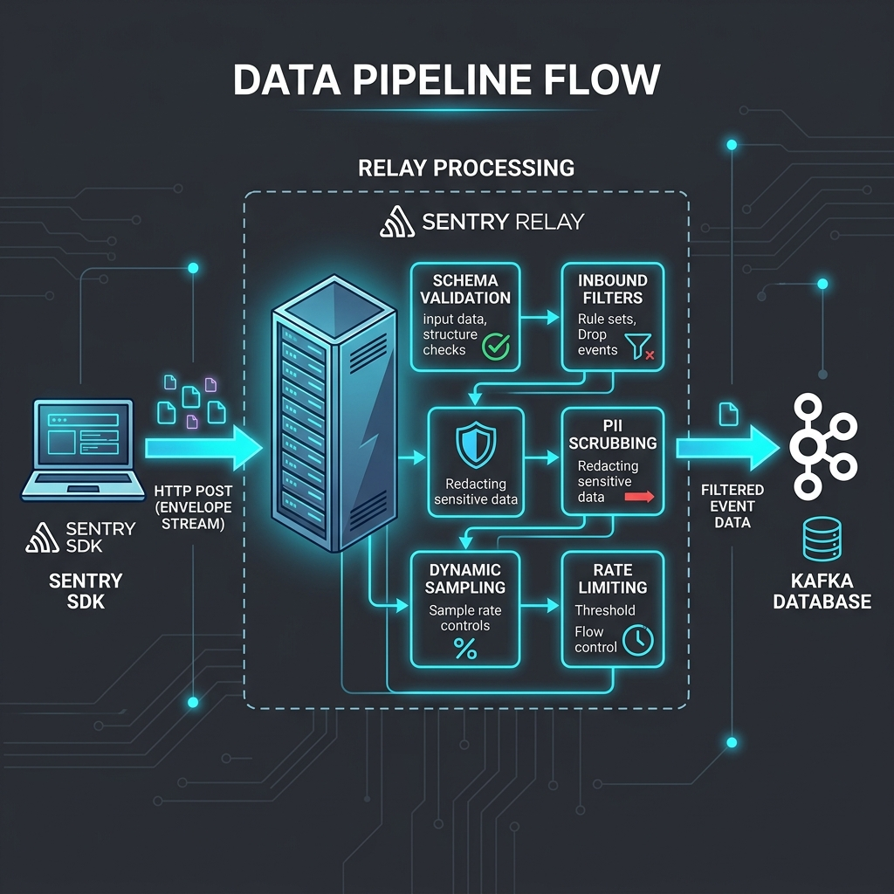

# Sentry Ingestion Protocol & Data Schema Specification (RFC-Level)

본 문서는 Sentry 호환 SDK를 개발하거나 Sentry Relay(수집 서버)를 자체 구현하려는 백엔드 엔지니어를 위한 **구현 수준(RFC-Level)의 기술 명세서**입니다. Sentry Relay 공식 소스코드(`getsentry/relay`) 분석을 바탕으로, 데이터 수집 파이프라인, 바이트 레벨의 파싱 규칙, 최대 길이 제약, Rate Limiting 응답 프로토콜, 극한의 엣지케이스, 그리고 **모든 데이터 타입에 대한 실제 JSON 샘플 페이로드**를 완벽하게 제공합니다.

---

## 1. Relay 핵심 처리 파이프라인 (Processing Pipeline)

SDK가 전송한 인벨롭(Envelope)이 저장소(ClickHouse/Kafka)에 도달하기 전, Sentry Relay는 엣지(Edge) 레이어에서 다음 5단계의 연산들을 처리합니다. 백엔드 수집기 구현 시 반드시 고려되어야 하는 아키텍처적 요구사항입니다.



### 1.1. 스키마 검증 및 정규화 (Schema Validation & Normalization)
* 인벨롭 스트림을 디코딩하여 `relay-event-schema`에 정의된 규격에 맞는지 검증합니다.
* 비정상적인 JSON 구조나, 길이 제한을 초과하는 문자열(기본 8,192자 초과 시 절삭), 규격에 맞지 않는 환경 변수(Environment: 64자 제한, 공백 금지) 등을 교정하거나 즉각 드롭합니다.
* `contexts`에 흩어진 사용자 정보, 타임스탬프, 플랫폼 특수 태그 등을 표준 위치로 병합 정규화합니다.

### 1.2. 인바운드 필터 (Inbound Data Filters)
프로젝트 설정에 따라 불필요한 노이즈 데이터를 폐기(Discard)하여 쿼터를 아낍니다.
* 로컬 호스트 필터링 (예: `localhost`, `127.0.0.1` 발송 오류).
* 봇 및 웹 크롤러 차단.
* 레거시 브라우저 필터링 (예: IE 11 이하 에러).
* 특정 에러 메시지/정규식 기반 차단.

### 1.3. PII 스크러빙 (Data Scrubbing & Privacy)
가장 높은 CPU를 소모하는 단계로, 개인정보(PII)를 Kafka나 데이터베이스에 쓰기 전에 삭제합니다.
* IP 주소, 신용카드 번호, 비밀번호, API 토큰(LLM 토큰 포함) 등을 정규식을 통해 마스킹(`[Filtered]`)합니다.
* Relay는 설정된 `Advanced Data Scrubbing` 룰셋에 따라 페이로드를 순회하며 문자열 치환 연산을 수행합니다.

### 1.4. 동적 샘플링 (Dynamic Sampling)
APM 트랜잭션 데이터가 쿼터를 너무 많이 소모하는 것을 방지하기 위해, 전체 트레이스(Trace)의 맥락을 고려하여 헤더의 `trace` (DSC, Dynamic Sampling Context)를 분석합니다.
* 루트 서비스의 샘플링 룰에 따라 이 트랜잭션을 저장할지 폐기할지 지능적으로 결정합니다.

### 1.5. Rate Limiting 및 Quota 통제 (중요)
조직(Org)이나 프로젝트의 요금제 한도를 초과했거나 트래픽 스파이크가 발생하면, Relay는 남은 이벤트를 즉각 드롭하고 **HTTP 429 Too Many Requests** 상태 코드와 함께 특별한 응답 헤더를 SDK로 내려보냅니다.

* **응답 헤더 포맷**: `X-Sentry-Rate-Limits: <quota_limit>, <quota_limit>, ...`
* **`<quota_limit>` 구조**: `retry_after:categories:scope:reason_code:namespaces`
* **예시**: `X-Sentry-Rate-Limits: 60:error,transaction:project:quota_exceeded:`
  * *의미: "앞으로 60초 동안 에러(error)와 트랜잭션(transaction) 카테고리의 전송을 중단하라 (프로젝트 쿼터 초과)."*
* **SDK 요구사항**: 호환 SDK를 구현할 때는 이 헤더를 반드시 파싱하여, 지정된 `retry_after` 초(Seconds) 동안 해당 카테고리의 데이터를 수집하지 않고 자체 버퍼에서 버려야 합니다(이를 `client_report`로 나중에 보고함).

---

## 2. Envelope 스트림 파싱 알고리즘 (Byte-Level)

SDK와 수집 서버 간의 모든 통신은 멀티파트 스트림 포맷인 인벨롭(Envelope)을 사용합니다. HTTP POST 요청으로 전달되며 본문은 줄바꿈 문자로 분할됩니다.

### 2.1. 실제 Envelope 스트림 구조 (샘플)
각 줄은 엄격하게 `\n` 바이트로 끝납니다.

```json
{"event_id":"9ec79c33ec9942abaf11fa067e2b1400","dsn":"https://public@sentry.example.com/1","sdk":{"name":"sentry.javascript.react","version":"8.0.0"},"trace":{"trace_id":"112120e1cb694cb380c1f618a800e234","public_key":"public","sample_rate":"1.0","sampled":"true","environment":"production"}}
{"type":"transaction","length":512,"content_type":"application/json"}
{"type":"transaction","transaction":"GET /api/users","start_timestamp":1717937020.1,"timestamp":1717937020.8,"contexts":{"trace":{"trace_id":"112120e1cb694cb380c1f618a800e234","span_id":"a800e234112120e1","op":"http.server","status":"ok"}},"spans":[]}
```

### 2.2. 파싱(Parsing) 핵심 알고리즘
수집 서버(Backend) 구현 시 **단순 JSON 분리(Split by `\n`)를 사용하면 바이너리 첨부 파일이나 이스케이프되지 않은 JSON 페이로드 파싱 시 치명적인 에러가 발생**합니다. 반드시 아래의 바이트 레벨 커서(Cursor) 이동 알고리즘을 구현해야 합니다.

1. **줄바꿈 문자 규격**: 오직 UNIX 줄바꿈(`\n`, ASCII `0x0A`)만 구분자로 사용됩니다. (Carriage Return `\r`은 페이로드의 일부로 간주됨)
2. **헤더 파싱**: 처음부터 첫 번째 `\n`까지 바이트를 읽어 디코딩 (Envelope Header).
3. **Item 루프 진입**:
   * **Item Header 파싱**: 커서에서 다음 `\n`까지 읽어 `type`과 `length` 추출.
   * **Payload 파싱 (length가 있는 경우)**: `length` 값만큼 정확히 N 바이트 스트림 스킵 및 읽기. 직후에 오는 1바이트의 `\n` 버리기. (바이너리 `attachment`나 `replay_recording` 손실 방지용)
   * **Payload 파싱 (length가 없는 경우)**: 다음 `\n`까지 읽기.

### 2.3. 최대 크기 제한 (Constraints)
* **단일 일반 아이템(event, transaction)**: 압축 해제 시 최대 **1MB**.
* **첨부 파일 및 리플레이 아이템**: 최대 **200MB**.
* **전체 인벨롭**: 최대 크기 **200MB**. (초과 시 413 반환)
* **식별자 제약**: 대시(`-`) 없는 32자리 소문자 16진수 UUID v4 형식.

---

## 3. 엣지케이스 및 방어 로직 (Edge Cases & Fault Tolerance)
백엔드 수집기나 SDK를 직접 구현할 때 흔히 놓치기 쉬우며, 시스템 장애나 메모리 오버플로우를 유발할 수 있는 예외 상황들입니다.

### 3.1. 파서 오동작 방어
* **`length` 누락과 바이너리 페이로드**: 바이너리 페이로드 전송 시 Item Header에 `length`를 누락하면, 내부의 `\n`(0x0A) 바이트 때문에 파서가 전체 인벨롭 파싱 상태를 망가뜨립니다. **바이너리 아이템에는 `length` 명시가 필수**입니다.
* **마지막 라인의 Trailing Newline 누락**: 마지막 페이로드 뒤에 `\n`이 없을 수 있습니다. 파서는 스트림 EOF 도달 시 정상 종료해야 합니다.

### 3.2. 데이터 강제 절삭 및 제한
* `breadcrumbs` 배열: **100개** 초과 시 가장 오래된 요소 절삭.
* `spans` 배열: 트랜잭션당 최대 **1,000개** 초과 시 절삭.
* 중첩 깊이 (Nesting Depth): 최대 **5단계** 초과 트리는 `[Object]` 문자열 처리.
* 문자열 최대 길이: 안전 장치로 **8,192바이트** 초과 시 생략 부호(`...`) 처리.

### 3.3. 시계열 및 동시성 방어
* **클록 스큐 (Clock Skew)**: 단말기 시계가 고장나 너무 과거이거나 미래인 이벤트는 서버단에서 수집 기준 **30일 제한**을 두고 즉시 Drop해야 합니다.
* **리플레이 순서 엇갈림**: 네트워크 이슈로 Replay Segment가 순서대로 안 들어오면 `segment_id` 기준으로 정렬/버퍼링하여 순서를 복원해야 합니다.

### 3.4. 파셜 레이트 리밋 (Partial Rate Limiting)
* `transaction` 한도가 끝났어도 동일 인벨롭 안에 있는 `profile_chunk`는 정상 수집해야 하는 **부분 수용(Partial Accept)** 처리가 필수입니다.

### 3.5. 상호 배타적 아이템 규약
* `event`와 `transaction`은 동일한 인벨롭 내에 존재해서는 안 됩니다.

---

## 4. Telemetry 페이로드 스키마 및 실제 JSON 샘플 (Exhaustive)

### 4.1. 에러 이벤트 (`type: "event"`)
#### 💡 Payload 샘플
```json
{
  "event_id": "c29ee852df97d382712b30f9fba928e7",
  "timestamp": 1717937030.123,
  "platform": "javascript",
  "level": "error",
  "transaction": "/user/profile",
  "server_name": "app-server-01",
  "release": "sentry-test-app@1.0.0",
  "environment": "production",
  "tags": { "app.name": "sentry-test-app" },
  "user": { "id": "user-001", "email": "test@example.com", "ip_address": "127.0.0.1" },
  "request": {
    "url": "http://localhost:3000/api/save",
    "method": "POST",
    "headers": { "User-Agent": "Mozilla/5.0..." }
  },
  "contexts": {
    "os": { "name": "macOS", "version": "14.4.1" },
    "browser": { "name": "Chrome", "version": "124.0.0" }
  },
  "exception": {
    "values": [
      {
        "type": "TypeError",
        "value": "Cannot read properties of undefined (reading 'name')",
        "mechanism": { "type": "onerror", "handled": false },
        "stacktrace": {
          "frames": [
            {
              "filename": "app.bundle.js",
              "function": "renderProfile",
              "module": "profile",
              "lineno": 142,
              "colno": 29,
              "in_app": true,
              "vars": { "userId": "user-001" }
            }
          ]
        }
      }
    ]
  }
}
```
* **프레임 역순 규칙**: `frames` 배열의 마지막 요소가 에러가 발생한 최하위(Innermost) 함수입니다.

### 4.2. 성능 트랜잭션 (`type: "transaction"`)
#### 💡 Payload 샘플
```json
{
  "event_id": "86aa3a9bc376407191ed1af2dad177f3",
  "type": "transaction",
  "start_timestamp": 1717937020.100,
  "timestamp": 1717937020.800,
  "transaction": "GET /api/users",
  "transaction_info": { "source": "route" },
  "contexts": {
    "trace": {
      "trace_id": "112120e1cb694cb380c1f618a800e234",
      "span_id": "a800e234112120e1",
      "op": "http.server",
      "status": "ok"
    }
  },
  "measurements": {
    "lcp": { "value": 1100.0, "unit": "millisecond" },
    "fcp": { "value": 240.5, "unit": "millisecond" }
  },
  "spans": [
    {
      "trace_id": "112120e1cb694cb380c1f618a800e234",
      "span_id": "f892a00c14b2721a",
      "parent_span_id": "a800e234112120e1",
      "op": "db.query",
      "description": "SELECT * FROM users",
      "start_timestamp": 1717937020.150,
      "timestamp": 1717937020.300,
      "tags": { "db.system": "postgresql" }
    }
  ]
}
```

### 4.3. 사용자 피드백 (`type: "feedback"`)
#### 💡 Payload 샘플
```json
{
  "event_id": "86aa3a9bc376407191ed1af2dad177f3",
  "timestamp": 1717937020.100,
  "platform": "javascript",
  "contexts": {
    "feedback": {
      "message": "결제 버튼이 눌러지지 않습니다.",
      "contact_email": "user@example.com",
      "name": "홍길동",
      "url": "http://localhost:3000/payment",
      "associated_event_id": "c29ee852df97d382712b30f9fba928e7",
      "replay_id": "37a7af05-be66-dc4f-9a75-b9fed1fe866d"
    }
  }
}
```
* **주의**: 이메일 키는 `email`이 아니라 `contact_email` 입니다.

### 4.4. 릴리즈 헬스 세션 (`type: "session"`)
#### 💡 Payload 샘플
```json
{
  "sid": "d90fb8e4-e0c1-4b11-a83d-1a8c9e5e3240",
  "did": "device-uuid-123",
  "seq": 0,
  "timestamp": "2026-06-09T05:43:50.000Z",
  "started": "2026-06-09T05:43:50.000Z",
  "init": true,
  "status": "ok",
  "errors": 0,
  "duration": 0.0,
  "attrs": {
    "release": "sentry-test-app@1.0.0",
    "environment": "production"
  }
}
```

### 4.5. 클라이언트 로컬 드롭 통계 (`type: "client_report"`)
#### 💡 Payload 샘플
```json
{
  "timestamp": "2026-06-09T05:43:50.000Z",
  "discarded_events": [
    {
      "reason": "sample_rate",
      "category": "transaction",
      "quantity": 25
    },
    {
      "reason": "ratelimit_backoff",
      "category": "error",
      "quantity": 3
    }
  ]
}
```

### 4.6. 크론/배치 모니터링 (`type: "check_in"`)
#### 💡 Payload 샘플
```json
{
  "check_in_id": "a5be8f5732a2f3f69b86aa3a9bc37640",
  "monitor_slug": "nightly-cleanup-job",
  "status": "ok",
  "duration": 45.2,
  "release": "sentry-test-app@1.0.0",
  "environment": "production",
  "monitor_config": {
    "schedule": {
      "type": "crontab",
      "value": "0 2 * * *"
    },
    "checkin_margin": 5,
    "max_runtime": 10,
    "timezone": "Asia/Seoul"
  }
}
```

### 4.7. V2 연속 프로파일링 (`type: "profile_chunk"`)
#### 💡 Payload 샘플
```json
{
  "profiler_id": "a9bc376407191ed1af2dad177f386aa3",
  "chunk_id": "37a7af05be66dc4f9a75b9fed1fe866d",
  "client_sdk": { "name": "sentry.javascript.node", "version": "8.0.0" },
  "profile": {
    "frames": [
      { "function": "root", "filename": "index.js", "lineno": 10 },
      { "function": "calculateTaxes", "filename": "billing.js", "lineno": 45 }
    ],
    "stacks": [
      [0],
      [0, 1]
    ],
    "samples": [
      { "elapsed_since_start_ns": 1000000, "thread_id": "1", "stack_id": 0 },
      { "elapsed_since_start_ns": 1010000, "thread_id": "1", "stack_id": 1 }
    ],
    "threads": {
      "1": { "name": "main" }
    }
  }
}
```

### 4.8. 세션 리플레이 스트림 (`type: "replay_event"` & `"replay_recording"`)
#### 💡 `replay_event` 메타데이터 샘플
```json
{
  "type": "replay_event",
  "replay_id": "37a7af05-be66-dc4f-9a75-b9fed1fe866d",
  "segment_id": 0,
  "timestamp": 1717937020.100,
  "urls": ["http://localhost:3000/home"],
  "error_ids": ["c29ee852df97d382712b30f9fba928e7"],
  "trace_ids": []
}
```
#### 💡 `replay_recording` 스트림 샘플 (rrweb 압축 해제 시)
```json
[
  {
    "type": 4,
    "timestamp": 1717937020102,
    "data": { "width": 1920, "height": 1080, "href": "http://localhost:3000/home" }
  },
  {
    "type": 2,
    "timestamp": 1717937020105,
    "data": {
      "node": {
        "type": 0,
        "childNodes": [{"type": 1, "name": "html", "publicId": "", "systemId": ""}]
      }
    }
  }
]
```
* **`type` (rrweb Enum 매핑)**:
  * `0`: `DomContentLoaded`, `1`: `Load`
  * `2`: `FullSnapshot` (최초 전체 DOM 트리)
  * `3`: `IncrementalSnapshot` (델타 이동/클릭)
  * `4`: `Meta` (크기, URL), `5`: `Custom` (콘솔/네트워크 등)
