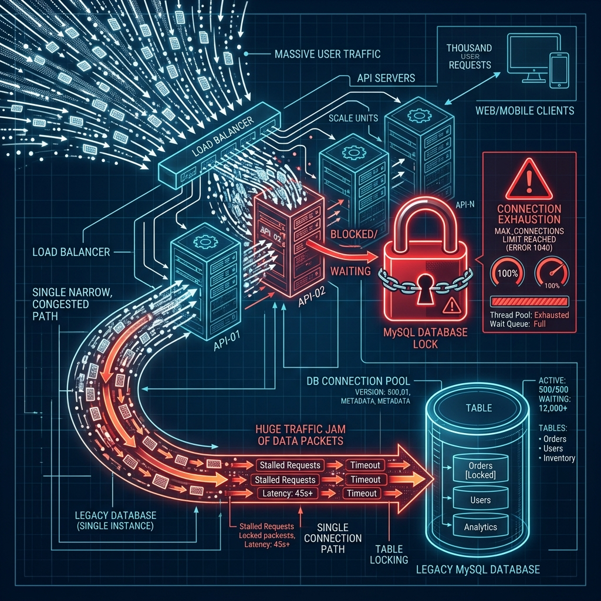
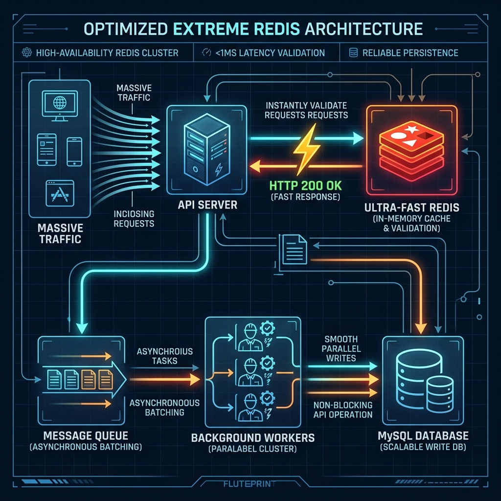

# Extreme Redis Optimization (Zero DB Write-Lock)

## 개요 (도입 배경)
이번 아키텍처 개선의 **가장 핵심적인 목적은 "전체 Gatrix Backend의 글로벌 지연(Global Hang) 현상 제거"**입니다.

과거 오픈 초기 등 쿠폰 사용량이 시간당 수천 건 수준으로 폭증할 때, 개별 유저의 응답성이 떨어지는 것을 넘어 **Gatrix Backend 시스템 전체의 응답 속도가 수 초에서 수십 초까지 지연되는 심각한 문제**가 발생했습니다.

### ⚠️ 원인 분석: 왜 전체 시스템이 마비되었는가?
1. **공유 자원에 대한 DB Lock (`forUpdate`)**: 쿠폰 사용 시 `g_coupon_settings` 테이블의 특정 쿠폰 row에 배타적 쓰기 락(`forUpdate`)을 겁니다.
2. **병목 현상**: 수많은 유저가 동시에 같은 쿠폰 코드를 입력하면, MySQL은 이 row에 대한 락을 순차적으로 처리합니다. 
3. **커넥션 풀 고갈 (Connection Pool Exhaustion)**: 락을 대기하는 동안 각 쿠폰 요청은 Node.js의 DB 커넥션을 쥐고 놓지 않습니다. 순식간에 Knex 커넥션 풀이 꽉 차게 됩니다.
4. **글로벌 장애**: 커넥션 풀이 고갈되면, 쿠폰과 전혀 상관없는 로그인, 상점 조회, 캐릭터 데이터 갱신 등 **모든 백엔드 API 요청이 DB 커넥션을 할당받지 못해 무한정 대기**하게 됩니다. 이로 인해 시스템 전체가 수십 초간 응답하지 않는 현상이 발생했습니다.

이를 근본적으로 해결하기 위해, 메인 DB(MySQL)를 쿠폰 검증의 크리티컬 패스(Critical Path)에서 완전히 격리시키는 **Extreme Redis Architecture**를 도입했습니다.

## 아키텍처 개요

### 처리 흐름 (2-Phase Architecture)

**PHASE 1: Read-only DB Validation (Lock 없음)**
- `g_coupons` 테이블에서 쿠폰 코드 조회 (NORMAL) 또는 `g_coupon_settings`에서 조회 (SPECIAL)
- 쿠폰 상태(`ACTIVE`), 유효 기간, 타게팅 조건 등을 **Read-only 쿼리**로 검증
- ⚠️ `SELECT ... FOR UPDATE` 같은 쓰기 락은 **일절 사용하지 않습니다**
- Read-only 쿼리는 DB 커넥션을 밀리초 단위로만 점유하며, 커넥션 풀 고갈의 원인이 되지 않습니다

**PHASE 2: Redis Atomic Validation (동시성 제어)**
- Redis 원자적 연산으로 중복 사용, 사용 횟수 제한, 총 사용량 제한을 검증
- 검증 통과 시 **즉시 HTTP 200 응답** → API 스레드 즉시 해제
- DB 영구 저장은 BullMQ 비동기 워커에게 위임

### 1. Redis 원자적 검증 상세

#### 단일 사용 쿠폰 (NORMAL): `SET NX EX`
- `SET key value NX EX ttl` 단일 명령으로 중복 사용을 원자적으로 차단
- `NX`(Not Exists) + `EX`(Expire) 플래그를 하나의 명령에 결합하여 키 생성과 TTL 설정을 원자적으로 수행
- TTL 90일: Redis 메모리 관리 목적. TTL 만료 후에도 PHASE 1의 DB `status === 'USED'` 체크가 영구 방어선 역할

#### 계정당/캐릭터당 사용 제한: `Lua Script (INCR + 조건부 보정)`
- Redis `INCR`로 사용 횟수를 원자적으로 증가
- **Lazy-Loading 보정**: Redis 캐시 미스(INCR 결과 = 1) 시, 사전 조회한 MySQL COUNT 값으로 카운터를 보정
- Lua Script로 INCR과 보정을 원자적으로 수행하여 동시 요청 시 카운터 유실 방지:
  ```lua
  local seq = redis.call('INCR', KEYS[1])
  if seq == 1 then
    local dbCount = tonumber(ARGV[1])
    if dbCount and dbCount > 0 then
      local corrected = dbCount + 1
      redis.call('SET', KEYS[1], corrected)
      return corrected
    end
  end
  return seq
  ```

#### 전체 사용량 제한 (SPECIAL, maxTotalUses): 동일 Lua 패턴
- 글로벌 사용 카운터에 동일한 Lua Script 패턴을 적용
- Lazy-Loading으로 기존 DB `usedCount`와 완벽 호환

### 2. 비동기 영구 저장 (Asynchronous Persistence via BullMQ)

Redis 검증이 성공하면, MySQL을 거치지 않고 **즉각 게임 서버에 보상 지급 성공(HTTP 200)을 응답**하여 해당 요청의 스레드와 생명주기를 즉시 종료시킵니다.

- **큐잉 & 백그라운드 워커**: 실제 DB 저장은 BullMQ 큐에 담아 백그라운드 워커(`processCouponRedeemJob`)가 잉여 DB 커넥션을 사용해 비동기로 안전하게 밀어넣습니다.
- **멱등성 보장**: 
  - `INSERT IGNORE` — 동일 ID의 중복 삽입 방지
  - SPECIAL 쿠폰의 `usedCount`는 `COUNT(*)` 서브쿼리로 갱신 — `INCREMENT`와 달리 재시도 시에도 정확한 값 유지
- **재시도**: 실패 시 지수 백오프(2s, 4s, 8s)로 3회 자동 재시도
- **안전장치**: Job 큐 등록 실패 시 Redis 상태를 롤백하여 유저가 재시도 가능

## 아키텍처 비교 (Before & After)

| 구분 | 레거시(Legacy) 구조 | Extreme Redis 구조 (개선 후) | 개선 효과 (가장 중요) |
| :--- | :--- | :--- | :--- |
| **시스템 전체 장애** | 쿠폰 락 대기로 인해 **전체 DB 커넥션 풀 고갈** | DB 쓰기 락 소멸. 커넥션 풀 점유 시간 극소화 | **전체 Gatrix Backend 병목(수십 초 지연) 완벽 제거** |
| **동시성 제어** | MySQL Row Lock (`forUpdate()`) | Redis 원자적 연산 (`SET NX EX`, Lua Script) | 수천/수만 건의 요청도 Lock 없이 즉시 처리 |
| **API 응답 생명주기** | DB 트랜잭션이 완전히 끝날 때까지 대기 | Redis 검증 후 즉시 응답 (10ms 이내) | API 스레드 고갈 방지 및 극한의 반응성 |
| **데이터 영구 저장** | 유저 요청 스레드에서 직접 `INSERT` | BullMQ 백그라운드 워커가 비동기 적재 | 트래픽 폭주 시에도 DB 부하가 평탄하게 분산됨 |
| **원자성** | MySQL 트랜잭션 (`forUpdate`) | Lua Script + Pipeline 원자적 연산 | Race condition 구조적 차단 |
| **멱등성** | 트랜잭션 내 1회 실행 보장 | `INSERT IGNORE` + `COUNT(*)` 서브쿼리 | BullMQ 재시도 시에도 데이터 정합성 유지 |

### 🔍 시뮬레이션: 왜 소수의 쿠폰 요청이 전체 장애를 유발하는가?

Knex 커넥션 풀의 최대 크기가 10개이고, 쿠폰 검증 트랜잭션이 100ms가 소요된다고 가정했을 때, **동시에 단 15명만 동일한 쿠폰을 요청해도 발생하는 장애 시뮬레이션**입니다.

| 시간 (ms) | 이벤트 발생 | 커넥션 풀 상태 (사용중/최대) | 시스템 상태 설명 |
| :--- | :--- | :--- | :--- |
| **0ms** | 유저 1~15명 동시 쿠폰 요청 | **10 / 10 (고갈)** | 유저 1~10명이 커넥션을 1개씩 선점. 유저 11~15명은 대기. |
| **5ms** | 유저 1이 DB Lock(`forUpdate`) 획득 | **10 / 10** | 유저 1은 처리 시작. **유저 2~10명은 Lock에 걸려 대기(커넥션 점유 상태)** |
| **10ms** | 🙎‍♂️ **유저 16 (일반 유저) '로그인' 요청** | **10 / 10** | **[장애 발생]** 빈 커넥션이 없으므로 로그인 API 무한 대기 시작. |
| **100ms** | 유저 1 처리 완료. 커넥션 반납 | **10 / 10** | 유저 11이 커넥션 획득. 유저 2가 Lock 획득 후 처리 시작. |
| **200ms** | 유저 2 처리 완료. 커넥션 반납 | **10 / 10** | 유저 12가 커넥션 획득. 유저 3이 Lock 획득 후 처리 시작. |
| ... | ... | ... | ... |
| **1,000ms** | 유저 10 처리 완료 | **10 / 10** | ⚠️ 로그인하려던 유저 16은 **1초째 무응답(Hang)** |
| **1,500ms** | 유저 15까지 쿠폰 처리 완료 | **0 / 10 (여유)** | 비로소 모든 쿠폰 처리가 끝나고 커넥션 풀이 비워짐. |
| **1,501ms** | 🙎‍♂️ **유저 16 로그인 처리 시작** | **1 / 10** | 로그인 유저는 **1.5초를 허공에 날린 뒤**에야 처리가 시작됨. |

💡 **핵심 포인트**: 고작 15명의 요청만으로도 트랜잭션이 직렬화되면서 **상관없는 유저가 1.5초 동안 서비스 먹통을 경험**하게 됩니다. 만약 150명이라면 **15초 동안 시스템 전체가 마비**되는 것이 바로 기존의 병목이었습니다. 이번 개선은 이를 원천 차단하여, **트래픽이 1만 명이 몰려도 메인 DB 커넥션 풀은 0~2개만 사용되도록 구조를 바꾼 것**입니다.

---

### 🛑 레거시 병목 구조 (Legacy DB Bottleneck)
공유 자원에 대한 Lock 대기가 DB 커넥션 풀을 모두 고갈시켜, 쿠폰 외의 다른 모든 백엔드 요청까지 수십 초간 마비시키는 현상입니다.


### ⚡ Extreme Redis 최적화 구조 (Optimized Architecture)
Redis가 방파제 역할을 하여 모든 동시성 검증을 인메모리로 끝냅니다. 메인 DB는 백그라운드 워커를 통해 천천히 여유롭게 데이터를 적재하므로, Gatrix Backend 전체의 안정성이 100% 유지됩니다.


## 방어선 구조 (Defense-in-Depth)

| 방어선 | 대상 | 메커니즘 | 지속성 |
|--------|------|----------|--------|
| **1차 (DB Read)** | NORMAL: 이미 사용된 코드 | `g_coupons.status === 'USED'` 조회 | **영구적** (DB에 기록) |
| **2차 (Redis)** | 동시 요청 Race Condition | `SET NX EX` / Lua INCR | TTL 90일 (메모리 관리) |
| **3차 (BullMQ)** | DB 영구 저장 실패 | 3회 재시도 + `INSERT IGNORE` 멱등성 | Job 보존 |

> **TTL 만료 후 안전성**: Redis 키의 90일 TTL이 만료되더라도 1차 방어선(DB status 체크)이 영구적으로 동작하므로 중복 사용은 불가능합니다.

## 핵심 성과 (Key Outcomes)
이번 구조 개선을 통해, 오픈 초기 등 **순간적으로 극심한 트래픽이 몰리더라도 Gatrix Backend가 전체적으로 느려지는 현상을 구조적으로 완전히 제거**했습니다. DB 커넥션 풀은 항상 여유를 가지며, 쿠폰 시스템은 메인 시스템의 성능에 더 이상 어떠한 악영향도 주지 않습니다.

## 관련 코드
- `src/services/coupon-redeem-service.ts` (API 엔드포인트, DB 조회, Redis 원자적 검증)
- `src/services/jobs/coupon-redeem-job.ts` (비동기 DB 저장 BullMQ 워커)
- `src/services/queue-service.ts` (큐 등록 및 관리)
