# Feature Flag Value Resolution Specification

## 1. Core Principles

- **Separation of State and Value**: `Enabled/Disabled` is a state. The returned `Value` is decoupled from this state.
- **Per-Environment State Management**: Flag `Enabled/Disabled` state is managed **per-environment only**. There is no global `isEnabled`.
- **Explicit Defaults**: Every Feature Flag MUST explicitly define `enabledValue` and `disabledValue`. Implicit `null` or `undefined` is not permitted.
- **Mandatory Value Type**: `valueType` MUST be defined (`boolean`, `string`, `number`, `json`).

## 2. Value Hierarchy & Evaluation Priority

When evaluating a Feature Flag, the returned value is determined by the following priority (higher takes precedence):

1.  **Variant Value** (when a Variant is successfully matched)
    - If a Variant exists and the user/context matches the Variant distribution rules:
    - Returns `variant.value`.
    - *Note*: When a Variant is selected, the Flag is effectively considered "Enabled" with that Variant's value.

2.  **Environment Override**
    - Environment-specific settings take precedence over global defaults.
    - **When Flag is Enabled**:
        - If `Environment.enabledValue` exists, return it.
        - Otherwise, return `Flag.enabledValue` (global default).
    - **When Flag is Disabled**:
        - If `Environment.disabledValue` exists, return it.
        - Otherwise, return `Flag.disabledValue` (global default).

3.  **Global Default (Baseline)**
    - When no environment-specific override exists:
    - **When Enabled**: Return `Flag.enabledValue`.
    - **When Disabled**: Return `Flag.disabledValue`.

## 3. Configuration Fields

### Global Feature Flag (`g_feature_flags`)
| Field | Type | Required | Description |
|---|---|---|---|
| `valueType` | Enum | Yes | Value data type (`boolean`, `string`, `number`, `json`) |
| `enabledValue` | JSON | **Yes** | Global default value when flag is ON |
| `disabledValue` | JSON | **Yes** | Global default value when flag is OFF |

> ⚠️ **Note**: `isEnabled` does NOT exist on the global flag table. State management is handled per-environment only.

### Environment Settings (`g_feature_flag_environments`)
| Field | Type | Required | Description |
|---|---|---|---|
| `isEnabled` | Boolean | Yes | Flag enabled state for this environment |
| `enabledValue` | JSON | No (optional) | Environment-specific `enabledValue` override |
| `disabledValue` | JSON | No (optional) | Environment-specific `disabledValue` override |

### Variant (`g_feature_variants`)
| Field | Type | Required | Description |
|---|---|---|---|
| `value` | JSON | Yes | Value returned when this Variant is selected |
| `valueType` | Enum | Yes | Value data type |

## 4. Evaluation Logic (Pseudocode)

```typescript
function evaluate(flag, context, environment) {
  // 1. Consistency check
  if (!flag.enabledValue || !flag.disabledValue) {
    throw Error("Invalid flag configuration: required default values are missing.");
  }

  // 2. State determination (per-environment only - no global isEnabled)
  const envSettings = flag.environments[environment];
  const isEnabled = envSettings?.isEnabled ?? false; // Default to Disabled if no env settings

  // 3. Variant check (only when Enabled)
  if (isEnabled && flag.variants.length > 0) {
    const variant = matchVariant(flag.variants, context);
    if (variant) {
      return {
        enabled: true,
        value: variant.value,
        valueSource: 'variant',
        variant: variant.name
      };
    }
  }

  // 4. Value determination based on state
  let value;
  let valueSource;

  if (isEnabled) {
    // Enabled path
    if (envSettings && envSettings.enabledValue !== undefined) {
      value = envSettings.enabledValue;
      valueSource = 'environment';
    } else {
      value = flag.enabledValue;
      valueSource = 'flag';
    }
  } else {
    // Disabled path
    if (envSettings && envSettings.disabledValue !== undefined) {
      value = envSettings.disabledValue;
      valueSource = 'environment';
    } else {
      value = flag.disabledValue;
      valueSource = 'flag';
    }
  }

  return {
    enabled: isEnabled,
    value: value,
    valueSource: valueSource,
    variant: isEnabled ? '$default' : '$disabled'
  };
}
```

## 5. Evaluation Flow Diagram

```mermaid
flowchart TD
    Start([Start Flag Evaluation]) --> GetEnv[Get Environment Settings]
    GetEnv --> CheckEnabled{Enabled in<br/>this Environment?}
    
    CheckEnabled -- No --> DisabledPath
    CheckEnabled -- Yes --> CheckVariants{Has Variants?}
    
    CheckVariants -- Yes --> MatchVariant{Variant Rule<br/>Match?}
    CheckVariants -- No --> EnabledPath
    
    MatchVariant -- Yes --> ReturnVariant([✅ Return variant.value<br/>variant: variant.name])
    MatchVariant -- No --> EnabledPath
    
    subgraph DisabledPath [Disabled State]
        CheckEnvDis{Env disabledValue<br/>exists?}
        CheckEnvDis -- Yes --> EnvDisVal([Return env disabledValue<br/>variant: $disabled])
        CheckEnvDis -- No --> FlagDisVal([Return global disabledValue<br/>variant: $disabled])
    end
    
    subgraph EnabledPath [Enabled State]
        CheckEnvEn{Env enabledValue<br/>exists?}
        CheckEnvEn -- Yes --> EnvEnVal([Return env enabledValue<br/>variant: $default])
        CheckEnvEn -- No --> FlagEnVal([Return global enabledValue<br/>variant: $default])
    end
```



## 6. Error Handling

- **Missing Flag ($missing)**:
  - When the requested Flag is not found in configuration (e.g., typo, sync delay):
  - Returns `enabled: false`.
  - `value`: Returns the **caller-provided `missingValue`**. (Avoid returning null)
  - Returns `variant: '$missing'`.

- **Archived Flag ($disabled)**:
  - Archived Flags are evaluated as Disabled.
  - Returns `disabledValue` with `variant: '$disabled'`.

## 7. SDK Function Signatures

The last parameter of SDK flag evaluation functions is named `missingValue`.
This value is returned when the Flag does not exist (`$missing`).

```typescript
// ✅ Correct naming
function boolVariation(flagName: string, missingValue: boolean): boolean;
function stringVariation(flagName: string, missingValue: string): string;
function numberVariation(flagName: string, missingValue: number): number;
function jsonVariation<T>(flagName: string, missingValue: T): T;

// ❌ Do NOT use this naming
// function boolVariation(flagName: string, defaultValue: boolean): boolean;
```

> 💡 **Why `missingValue`?**  
> The name `defaultValue` can be confused with the flag's `enabledValue`/`disabledValue`.
> `missingValue` clearly communicates "the value used when the flag is missing."

## 8. Client SDK Response Format

When the server sends Flag definitions to client SDKs, environment-specific values should be pre-resolved for SDK simplicity.

```json
{
  "id": "...",
  "name": "new-feature",
  "enabled": true,
  "valueType": "string",
  "enabledValue": "v2",
  "disabledValue": "v1",
  "variant": {
    "name": "$default",
    "value": "v2"
  },
  "variants": [...]
}
```

SDK behavior:
1. Check `enabled`.
2. Check `variants` (when Enabled).
3. Return `variant.value` or `enabledValue` or `disabledValue`.

## 9. Terminology

| Term | Description |
|---|---|
| `enabledValue` | Default value returned when Flag is in Enabled state |
| `disabledValue` | Default value returned when Flag is in Disabled state |
| `valueType` | Data type of the value (`boolean`, `string`, `number`, `json`) |
| `valueSource` | Origin of the value (`variant`, `environment`, `flag`) |
| `variant.value` | Value returned when a Variant is selected |
| `missingValue` | Fallback value used in SDK functions when Flag is not found |
| `$default` | Virtual Variant name when Enabled but no Variant matched |
| `$disabled` | Virtual Variant name when Disabled |
| `$missing` | Virtual Variant name when Flag does not exist |
