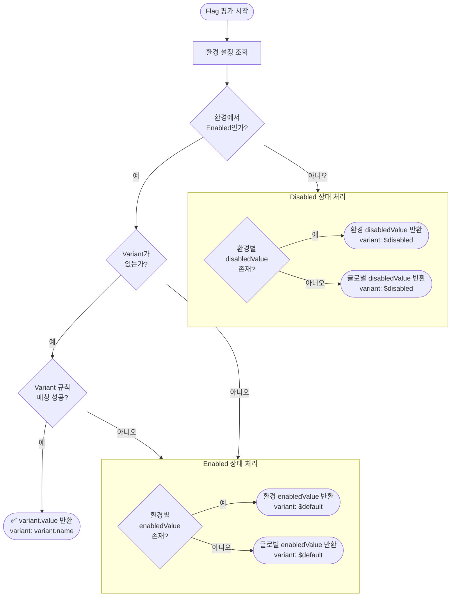

# Feature Flag 값 결정 사양서 (Value Resolution Specification)

## 1. 핵심 원칙

- **상태와 값의 분리 (Separation of State and Value)**: `Enabled/Disabled`는 상태(State)입니다. 반환되는 `값(Value)`은 이 상태와 분리되어야 합니다.
- **환경별 상태 관리 (Per-Environment State)**: Flag의 `Enabled/Disabled` 상태는 **환경별(Environment)**로만 관리됩니다. 전역 `isEnabled`는 존재하지 않습니다.
- **명시적 기본값 (Explicit Defaults)**: 모든 Feature Flag는 반드시 `enabledValue`와 `disabledValue`를 명시적으로 가지고 있어야 합니다. 암묵적인 `null`이나 `undefined`는 허용되지 않습니다.
- **필수 값 타입 (Mandatory Value Type)**: `valueType`은 반드시 정의되어야 합니다 (`boolean`, `string`, `number`, `json`).

## 2. 값의 위계 및 평가 우선순위 (Value Hierarchy & Evaluation Priority)

Feature Flag 평가 시 반환되는 값은 다음 우선순위에 따라 결정됩니다 (상위 항목 우선):

1.  **Variant 값 (Variant Value)** (Variant가 성공적으로 매칭된 경우)
    - Variant가 존재하고, 사용자/컨텍스트가 Variant 분배 규칙에 매칭된 경우:
    - `variant.value`를 반환합니다.
    - *참고*: Variant가 선택되면, 해당 Flag는 해당 Variant 값과 함께 효과적으로 "Enabled" 상태로 간주됩니다.

2.  **환경별 오버라이드 (Environment Override)**
    - 환경별 설정은 글로벌 기본값보다 우선합니다.
    - **Flag가 Enabled인 경우**:
        - `Environment.enabledValue`가 존재하면 반환합니다.
        - 없으면 `Flag.enabledValue`(글로벌 기본값)를 반환합니다.
    - **Flag가 Disabled인 경우**:
        - `Environment.disabledValue`가 존재하면 반환합니다.
        - 없으면 `Flag.disabledValue`(글로벌 기본값)를 반환합니다.

3.  **글로벌 기본값 (Global Default / Baseline)**
    - 환경별 오버라이드가 없는 경우:
    - **Flag가 Enabled인 경우**: `Flag.enabledValue`를 반환합니다.
    - **Flag가 Disabled인 경우**: `Flag.disabledValue`를 반환합니다.

## 3. 구성 필드 (Configuration Fields)

### 글로벌 Feature Flag (`g_feature_flags`)
| 필드명 | 타입 | 필수 여부 | 설명 |
|---|---|---|---|
| `valueType` | Enum | 예 | 값의 타입 (`boolean`, `string`, `number`, `json`) |
| `enabledValue` | JSON | **예** | Flag가 ON일 때의 글로벌 기본값 |
| `disabledValue` | JSON | **예** | Flag가 OFF일 때의 글로벌 기본값 |

> ⚠️ **참고**: `isEnabled`는 글로벌 플래그 테이블에 존재하지 않습니다. 상태 관리는 환경별 테이블에서만 수행됩니다.

### 환경별 설정 (`g_feature_flag_environments`)
| 필드명 | 타입 | 필수 여부 | 설명 |
|---|---|---|---|
| `isEnabled` | Boolean | 예 | 이 환경에서의 Flag 활성화 상태 |
| `enabledValue` | JSON | 아니오 (선택) | 이 환경에서의 `enabledValue` 오버라이드 |
| `disabledValue` | JSON | 아니오 (선택) | 이 환경에서의 `disabledValue` 오버라이드 |

### Variant (`g_feature_variants`)
| 필드명 | 타입 | 필수 여부 | 설명 |
|---|---|---|---|
| `value` | JSON | 예 | 이 Variant가 선택되었을 때 반환되는 값 |
| `valueType` | Enum | 예 | 값의 타입 |

## 4. 평가 로직 (의사 코드)

```typescript
function evaluate(flag, context, environment) {
  // 1. 일관성 검사
  if (!flag.enabledValue || !flag.disabledValue) {
    throw Error("Flag 구성이 유효하지 않음: 필수 기본값이 누락되었습니다.");
  }

  // 2. 상태 결정 (환경별 - 전역 isEnabled는 없음)
  const envSettings = flag.environments[environment];
  const isEnabled = envSettings?.isEnabled ?? false; // 환경 설정 없으면 기본 Disabled

  // 3. Variant 확인 (Enabled 상태일 때만 평가)
  if (isEnabled && flag.variants.length > 0) {
    const variant = matchVariant(flag.variants, context);
    if (variant) {
      return {
        enabled: true,
        value: variant.value,
        valueSource: 'variant',
        variant: variant.name
      };
    }
  }

  // 4. 상태에 따른 값 결정
  let value;
  let valueSource;

  if (isEnabled) {
    // Enabled 경로
    if (envSettings && envSettings.enabledValue !== undefined) {
      value = envSettings.enabledValue;
      valueSource = 'environment';
    } else {
      value = flag.enabledValue;
      valueSource = 'flag';
    }
  } else {
    // Disabled 경로
    if (envSettings && envSettings.disabledValue !== undefined) {
      value = envSettings.disabledValue;
      valueSource = 'environment';
    } else {
      value = flag.disabledValue;
      valueSource = 'flag';
    }
  }

  return {
    enabled: isEnabled,
    value: value,
    valueSource: valueSource,
    variant: isEnabled ? '$default' : '$disabled' // Variant 미선택 시 $ 접두어 사용
  };
}
```

## 5. 평가 흐름도 (Evaluation Flow Diagram)



## 6. 에러 처리 (Error Handling)

- **Flag 누락 ($missing)**:
  - 요청한 Flag가 구성에서 발견되지 않는 경우 (예: 오타, 동기화 지연):
  - `enabled: false`를 반환합니다.
  - `value`: **호출자가 제공한 `missingValue`를 반환합니다.** (null 반환 지양)
  - `variant: '$missing'`을 반환합니다.

- **보관된 Flag ($disabled)**:
  - 보관(Archived)된 Flag는 Disabled 상태로 평가됩니다.
  - `disabledValue`를 반환하며, `variant: '$disabled'`를 사용합니다.

## 7. SDK 함수 시그니처

SDK에서 Flag 값을 조회하는 함수의 마지막 매개변수는 `missingValue`로 명명합니다.
이 값은 Flag가 존재하지 않을 때(`$missing`) 반환되는 값입니다.

```typescript
// ✅ 올바른 네이밍
function boolVariation(flagName: string, missingValue: boolean): boolean;
function stringVariation(flagName: string, missingValue: string): string;
function numberVariation(flagName: string, missingValue: number): number;
function jsonVariation<T>(flagName: string, missingValue: T): T;

// ❌ 사용하지 않는 네이밍
// function boolVariation(flagName: string, defaultValue: boolean): boolean;
```

> 💡 **왜 `missingValue`인가?**  
> `defaultValue`라는 이름은 Flag의 `enabledValue`/`disabledValue`와 혼동될 수 있습니다. 
> `missingValue`는 "Flag가 누락되었을 때 사용되는 값"이라는 의미를 명확하게 전달합니다.

## 8. 클라이언트 SDK 응답 포맷

서버가 클라이언트 SDK에 Flag 정의를 내려줄 때, SDK 로직 단순화를 위해 환경별 값을 미리 결정(Resolve)해서 내려주어야 합니다.

```json
{
  "id": "...",
  "name": "new-feature",
  "enabled": true,
  "valueType": "string",
  "enabledValue": "v2",
  "disabledValue": "v1",
  "variant": {
    "name": "$default",
    "value": "v2"
  },
  "variants": [...]
}
```

SDK 동작:
1. `enabled` 확인.
2. `variants` 확인 (Enabled인 경우).
3. `variant.value` 또는 `enabledValue` 또는 `disabledValue` 반환.

## 9. 용어 정리 (Terminology)

| 용어 | 설명 |
|---|---|
| `enabledValue` | Flag가 Enabled 상태일 때 반환되는 기본값 |
| `disabledValue` | Flag가 Disabled 상태일 때 반환되는 기본값 |
| `valueType` | 값의 데이터 타입 (`boolean`, `string`, `number`, `json`) |
| `valueSource` | 값의 출처 (`variant`, `environment`, `flag`) |
| `variant.value` | Variant가 선택되었을 때 반환되는 값 |
| `missingValue` | SDK 함수에서 Flag가 누락되었을 때 사용되는 대체 값 |
| `$default` | Enabled 상태이나 Variant가 매칭되지 않았을 때의 가상 Variant 이름 |
| `$disabled` | Disabled 상태일 때의 가상 Variant 이름 |
| `$missing` | Flag가 존재하지 않을 때의 가상 Variant 이름 |
