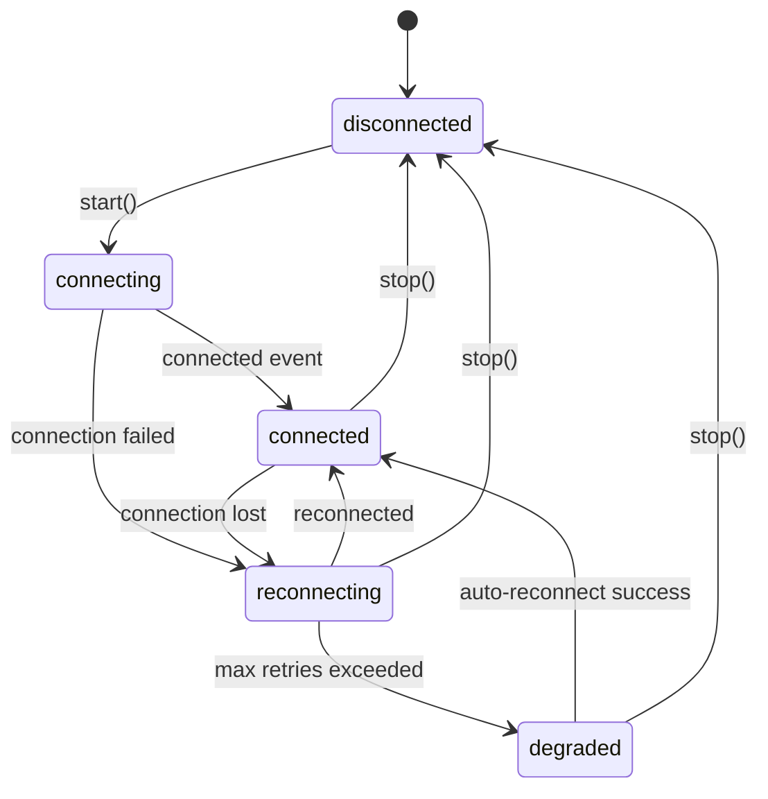

# Gatrix Client SDK Specification

This document defines the core architecture, API, and behavior for all Gatrix Client SDKs.

## Scope and Future Expansion

> [!IMPORTANT]
> The Gatrix Client SDK is designed as a unified platform for multiple Gatrix services. While the initial focus is on **Feature Flags (Gatrix Features)**, the architecture allows for seamless integration of future services, including:
>
> - **Gatrix Features**: Feature flags and remote configuration (Current focus).
> - **Gatrix Surveys**: Client-side survey triggering and responses.
> - **Gatrix Maintenance**: Maintenance window management and whitelisting.
> - **Gatrix Messaging**: In-app notifications and messaging.
>
> All naming conventions and event structures should be designed to be service-agnostic or explicitly namespaced (e.g., using `flags.` prefix for feature flag events) to avoid collisions with future features.

## Terminology

> [!CAUTION]
> Gatrix uses the term **"flag"** (or **"feature flag"**) ??never **"toggle"** or **"feature toggle"**.
> All SDK code, APIs, metrics payloads, documentation, and comments MUST use `flag`/`flags` consistently.
> For example, metrics payloads use `bucket.flags`, not `bucket.toggles`.

## Metrics Payload Format

When sending metrics to the backend, the payload MUST follow this structure:

```json
{
  "appName": "MyApp",
  "environment": "production",
  "sdkName": "gatrix-js-client-sdk",
  "sdkVersion": "1.0.0",
  "connectionId": "uuid-string",
  "bucket": {
    "start": "2024-01-01T00:00:00.000Z",
    "stop": "2024-01-01T00:01:00.000Z",
    "flags": {
      "my-flag": {
        "yes": 10,
        "no": 2,
        "variants": {
          "variant-a": 7,
          "variant-b": 3
        }
      }
    },
    "missing": {
      "unknown-flag": 5
    }
  }
}
```

- `bucket.flags` ??per-flag access counts (`yes` = enabled, `no` = disabled, `variants` = variant name counts)
- `bucket.missing` ??flags that were accessed but not found in the local cache

## Overview

This specification defines the requirements and interfaces for Gatrix client-side SDKs. These SDKs are designed to run in browser environments, mobile applications, and game engines (like Unity), communicating with the Gatrix Edge API.

## Core Concepts

### 1. Server-Side Evaluation (for Features)

For the Feature Flag service, client-side SDKs:

- Fetch pre-evaluated flags from the Edge API
- Periodically poll for flag updates
- Store flags locally for offline access

### 2. Global Context

Client-side SDKs manage context globally since they represent a single user/session:

- Context is set once and reused for all evaluations
- Context updates trigger a re-fetch of evaluated flags
- No need to pass context to every function call

### 3. Repository Pattern

Inspired by Unleash SDK architecture:

- `Repository`: Manages flag storage and synchronization
- `StorageProvider`: Interface for persistent storage (localStorage, AsyncStorage, etc.)

### 4. Explicit Sync Mode

Based on unleash-proxy-lua's pattern:

- Flags are fetched in real-time but applied at controlled sync points
- Prevents mid-session flag changes that could cause inconsistent UX
- `syncFlags()` applies pending flag changes

## API Response Format

The Edge API returns evaluated flags in this format:

```json
{
  "success": true,
  "data": {
    "flags": [
      {
        "name": "feature-name",
        "enabled": true,
        "variant": {
          "name": "dark-theme",
          "enabled": true,
          "value": {"key": "value"}
        },
        "valueType": "json",
        "version": 12,
        "impressionData": true
      }
    ]
  }
}
```

### Flag Structure

| `name` | string | Unique flag identifier |
| `enabled` | boolean | Whether the flag is enabled |
| `variant` | object | Selected variant details |
| `variant.name` | string | Variant name |
| `variant.enabled` | boolean | Whether variant is enabled |
| `variant.value` | string \| number \| boolean \| object | Variant value (flexible type) |
| `valueType` | "string" \| "number" \| "boolean" \| "json" | Value type hint (server response never contains "none"; "none" is SDK-internal only for missing/disabled flags) |
| `version` | number | Flag version for change detection |
| `impressionData` | boolean? | Whether to track impressions |
| `reason` | string? | Evaluation reason (e.g., "targeting_match", "disabled", "not_found") |

## SDK Configuration

```typescript
interface GatrixClientConfig {
  // Required
  apiUrl: string; // Base API URL for Edge or Backend server (e.g., https://edge.your-api.com/api/v1)
  apiToken: string; // Client API token
  appName: string; // Application name
  environment: string; // Environment name (required)

  // Optional - Polling
  refreshInterval?: number; // Seconds between polls (default: 30)
  disableRefresh?: boolean; // Disable automatic polling

  // Optional - Context
  context?: GatrixContext; // Initial context

  // Optional - Storage
  storageProvider?: IStorageProvider; // Custom storage provider

  // Optional - Sync Mode
  explicitSyncMode?: boolean; // Enable explicit sync mode

  // Optional - Offline Mode
  offlineMode?: boolean; // Start in offline mode (no network requests)
  // Requires bootstrap or cached flags, throws error if none available

  // Optional - Bootstrap
  bootstrap?: EvaluatedFlag[]; // Initial flags for instant availability
  bootstrapOverride?: boolean; // Override stored flags with bootstrap

  // Optional - Advanced
  customHeaders?: Record<string, string>;
  disableMetrics?: boolean; // Disable server-side metrics collection
  disableStats?: boolean; // Disable local statistics tracking (default: false)
  impressionDataAll?: boolean; // Track impressions for all flags

  // Optional - Debug
  enableDevMode?: boolean; // Enable detailed debug logging (default: false)

  // Optional - Storage
  cacheKeyPrefix?: string; // Prefix for cache storage keys (default: "gatrix_cache")

  // Optional - Fetch Retry Options
  fetchRetryOptions?: FetchRetryOptions; // Configure retry/backoff behavior

  // Optional - Request Method
  usePOSTRequests?: boolean; // Use POST instead of GET for flag evaluation (default: false)
}

interface FetchRetryOptions {
  nonRetryableStatusCodes?: number[]; // HTTP status codes that stop polling (default: [401, 403])
  initialBackoffMs?: number; // Initial backoff delay in ms (default: 1000)
  maxBackoffMs?: number; // Maximum backoff delay in ms (default: 60000)
}
```

### Streaming Configuration

Real-time flag invalidation is supported via two transport types: **SSE** (Server-Sent Events) and **WebSocket**.

```typescript
type StreamingTransport = 'sse' | 'websocket';

interface SseStreamingConfig {
  url?: string;           // SSE endpoint URL override (default: derived from apiUrl)
  reconnectBase?: number; // Reconnect initial delay in seconds (default: 1)
  reconnectMax?: number;  // Reconnect max delay in seconds (default: 30)
  pollingJitter?: number; // Polling jitter range in seconds (default: 5)
}

interface WebSocketStreamingConfig {
  url?: string;           // WebSocket endpoint URL override (default: derived from apiUrl)
  reconnectBase?: number; // Reconnect initial delay in seconds (default: 1)
  reconnectMax?: number;  // Reconnect max delay in seconds (default: 30)
  pingInterval?: number;  // Client-side ping interval in seconds (default: 30)
}

interface StreamingConfig {
  enabled?: boolean;                  // Enable streaming (default: true)
  transport?: StreamingTransport;     // Transport type (default: 'sse')
  sse?: SseStreamingConfig;           // SSE-specific settings
  websocket?: WebSocketStreamingConfig; // WebSocket-specific settings
}
```

### Streaming Protocol

#### Endpoints

| Transport | Endpoint |
|-----------|----------|
| SSE | `GET /client/features/:environment/stream/sse` |
| WebSocket | `GET /client/features/:environment/stream/ws` |

#### Authentication

- **SSE**: Uses standard HTTP headers (`X-API-Token`, `X-Application-Name`)
- **WebSocket**: Uses query parameters (`x-api-token`) since browsers cannot set custom headers on WebSocket upgrade requests

#### Message Format

Both transports use the same event types with identical payloads:

| Event | Description | Payload |
|-------|-------------|---------|
| `connected` | Initial connection established | `{ globalRevision: number }` |
| `flags_changed` | Flag(s) changed on server | `{ globalRevision: number, changedKeys: string[], timestamp: number }` |
| `heartbeat` | Server heartbeat (keepalive) | `{ timestamp: number }` |

**SSE format:**
```
event: connected
data: {"globalRevision":42}
```

**WebSocket format (JSON envelope):**
```json
{ "type": "connected", "data": { "globalRevision": 42 } }
```

> [!IMPORTANT]
> Streaming is an **invalidation signal** mechanism with **selective partial fetch** optimization. When a `flags_changed` event is received:
> - If the number of `changedKeys` is small (< 50% of cached flags), the SDK performs a **partial fetch** requesting only those keys via the `flagNames` query parameter. The existing ETag remains intact for the next full polling cycle.
> - If the number is large (≥ 50% of cached flags), or no flags are cached yet, the SDK clears its ETag and performs a **full fetch**.
> - Keys present in `changedKeys` but absent from the partial fetch response are treated as **deleted** and removed from the local cache.

> [!NOTE]
> **Unity WebGL platform**: The WebSocket transport uses a JS interop layer (`GatrixWebSocket.jslib`) on WebGL builds since `System.Net.WebSockets.ClientWebSocket` is not available in the browser sandbox. The SDK automatically selects the appropriate implementation via `GatrixWebSocketFactory`. Desktop (Windows/macOS/Linux), Android, iOS, and WebGL platforms are all supported.

#### Connection State Machine

```
disconnected ──► connecting ──► connected
     ▲                              │
     │                              ▼
     └── degraded ◄── reconnecting ◄┘
```

| State | Description |
|-------|-------------|
| `disconnected` | Not connected (initial or intentional disconnect) |
| `connecting` | Attempting to establish connection |
| `connected` | Connection active, receiving events |
| `reconnecting` | Connection lost, attempting reconnection |
| `degraded` | Multiple reconnection failures (≥5 attempts), polling-only mode |

#### Reconnection Strategy

Exponential backoff with jitter:
- **Delay** = `min(reconnectBase × 2^(attempt-1), reconnectMax)` + random jitter (0-1000ms)
- **Degraded mode**: After ≥5 consecutive failures, streaming state transitions to `degraded` and SDK falls back to polling-only until reconnection succeeds

#### Gap Recovery

When a streaming connection is (re-)established, the server sends a `connected` event with the current `globalRevision`. The SDK compares this with its local `localGlobalRevision`:
- If `serverRevision > localRevision` and `localRevision > 0`: Gap detected, triggers immediate `fetchFlags()` for recovery
- If `localRevision === 0`: First connection, records initial revision

### Fetch Retry & Backoff Behavior

All client SDKs implement a **schedule-after-completion** pattern for polling:

1. **Normal polling**: After a successful fetch (200) or not-modified response (304), the SDK schedules the next fetch after `refreshInterval` seconds.
2. **Retryable errors**: On HTTP errors not in `nonRetryableStatusCodes` or network errors, the SDK increments a `consecutiveFailures` counter and schedules the next fetch with exponential backoff: `min(initialBackoffMs * 2^(failures-1), maxBackoffMs)`.
3. **Non-retryable errors**: On HTTP status codes listed in `nonRetryableStatusCodes` (default: 401, 403), polling is stopped entirely. Call `fetchFlags()` manually to resume.
4. **Recovery**: On any successful response after errors, `consecutiveFailures` is reset to 0 and normal polling resumes.
5. **Manual fetchFlags()**: Calling `fetchFlags()` manually resets `pollingStopped` and cancels any pending timer, allowing recovery from non-retryable errors.
6. **start()/stop()**: `start()` resets `consecutiveFailures` and `pollingStopped`. `stop()` sets `pollingStopped = true` and resets `consecutiveFailures`.

### HTTP Headers

All client SDKs MUST include the following standard headers on every HTTP request. This ensures consistent authentication, identification, and traceability across all platforms.

#### Common Headers (fetchFlags + sendMetrics)

| Header | Value | Description |
|--------|-------|-------------|
| `X-API-Token` | `{apiToken}` | Client API token for authentication |
| `X-Application-Name` | `{appName}` | Application name from config |
| `X-Connection-Id` | `{connectionId}` | Unique connection identifier (UUID, generated once per SDK instance) |
| `X-SDK-Version` | `{sdkName}/{sdkVersion}` | SDK identification string (e.g., `@gatrix/js-client-sdk/1.0.0`) |
| `Content-Type` | `application/json` | Required for POST requests |
| `...customHeaders` | User-defined | Spread/merged from `config.customHeaders` |

### POST vs GET for Flag Evaluation

By default, SDKs use **GET** requests with context in query parameters for flag evaluation. When `usePOSTRequests` is enabled, SDKs switch to **POST** requests with context and flagNames in a JSON body.

#### When to use POST

- **Sensitive context fields**: Query parameters appear in server logs, CDN caches, and browser history. POST keeps context data in the request body.
- **Large context**: URL length limits (~2048 chars) can be hit with many context properties. POST has no practical body size limit.
- **Many flagNames**: Partial fetch with many keys can exceed URL length limits.

#### POST Body Format

```json
{
  "context": {
    "appName": "MyApp",
    "environment": "production",
    "userId": "user-123",
    "sessionId": "session-456",
    "properties": {
      "country": "KR",
      "plan": "premium"
    }
  },
  "flagNames": ["feature-a", "feature-b"]
}
```

- `context` (required): Same fields as the GET query parameters
- `flagNames` (optional): Array of specific flag keys to evaluate. If omitted, all flags are evaluated.

#### ETag Behavior with POST

- `If-None-Match` header works the same way with both GET and POST
- The server generates ETags identically regardless of HTTP method
- Conditional fetch (304 Not Modified) is fully supported with POST

#### fetchFlags-Only Headers

| Header | Value | Description |
|--------|-------|-------------|
| `X-Environment` | `{environment}` | Environment name from config |
| `If-None-Match` | `{etag}` | ETag from previous response (only when etag exists, enables 304 Not Modified) |

#### X-SDK-Version Format

The `X-SDK-Version` header combines SDK name and version in a single value using the format `{sdkName}/{sdkVersion}`.

Standard SDK names:
- `@gatrix/js-client-sdk` (JavaScript)
- `gatrix-unity-client-sdk` (Unity)
- `gatrix-unreal-client-sdk` (Unreal Engine)
- `gatrix-cocos2dx-client-sdk` (Cocos2d-x)
- `gatrix-flutter-client-sdk` (Flutter)
- `gatrix-godot-client-sdk` (Godot)
- `gatrix-python-client-sdk` (Python)

#### Authentication Note

All SDKs use `X-API-Token` as the primary authentication header. The server also accepts `Authorization: Bearer {token}` as a fallback, but SDKs SHOULD prefer `X-API-Token` for consistency.

### Metrics Retry Behavior

All client SDKs implement retry logic for `sendMetrics` requests:

1. **Max retries**: Up to 2 retry attempts after the initial failure.
2. **Retryable conditions**: Network errors, HTTP 408 (Timeout), 429 (Too Many Requests), or 5xx (Server Error).
3. **Backoff**: Exponential backoff with delay = `2^attempt` seconds (2s, 4s).
4. **Non-retryable**: HTTP 4xx errors (except 408, 429) are not retried.
5. **On final failure**: Emit `FLAGS_METRICS_ERROR` event and increment error counter.

### Config Validation

All client SDKs MUST validate configuration at initialization time and fail fast with clear error messages. Validation runs in the constructor/init before any network calls.

#### Required Fields

| Field | Rule | Error |
|-------|------|-------|
| `apiUrl` | Non-empty, trimmed | `"apiUrl is required"` |
| `apiToken` | Non-empty, trimmed | `"apiToken is required"` |
| `appName` | Non-empty, trimmed | `"appName is required"` |
| `environment` | Non-empty, trimmed | `"environment is required"` |

#### Format Validation

| Field | Rule | Error |
|-------|------|-------|
| `apiUrl` | Must be valid HTTP/HTTPS URL | `"apiUrl must be a valid HTTP/HTTPS URL"` |
| `apiUrl`, `apiToken` | No leading/trailing whitespace | `"must not have leading or trailing whitespace"` |
| `cacheKeyPrefix` | <= 100 characters | `"cacheKeyPrefix must be <= 100 characters"` |

#### Numeric Range Validation

| Field | Min | Max | Unit |
|-------|-----|-----|------|
| `refreshInterval` | 1 | 86400 | seconds |
| `metricsInterval` | 1 | 86400 | seconds |
| `metricsIntervalInitial` | 0 | 3600 | seconds |
| `fetchRetryLimit` | 0 | 10 | count |
| `fetchTimeout` | 1 (or 1000ms) | 120 (or 120000ms) | seconds/ms |
| `initialBackoffMs` | 100 | 60000 | ms |
| `maxBackoffMs` | 1000 | 600000 | ms |
| `streaming.sse.reconnectBase` | 0.5 | 60 | seconds |
| `streaming.sse.reconnectMax` | 1 | 300 | seconds |
| `streaming.sse.pollingJitter` | 0 | 30 | seconds |
| `streaming.websocket.reconnectBase` | 0.5 | 60 | seconds |
| `streaming.websocket.reconnectMax` | 1 | 300 | seconds |
| `streaming.websocket.pingInterval` | 5 | 300 | seconds |

#### Cross-Field Validation

- `initialBackoffMs` must be <= `maxBackoffMs`
- `nonRetryableStatusCodes` entries must be in range 400-599
- `streaming.transport` must be `'sse'` or `'websocket'` (if provided)
- `streaming.sse.reconnectBase` must be <= `streaming.sse.reconnectMax` (if both provided)
- `streaming.websocket.reconnectBase` must be <= `streaming.websocket.reconnectMax` (if both provided)
- `streaming.sse.url` and `streaming.websocket.url` must be valid URLs (if provided)

### Dev Mode Logging

When `enableDevMode` is set to `true`, the SDK outputs detailed debug logs at key lifecycle points:

- **start()**: Logs configuration values (offlineMode, refreshInterval, explicitSyncMode, disableRefresh)
- **stop()**: Logs that stop was called
- **fetchFlags()**: Logs fetch initiation with current etag
- **scheduleNextRefresh()**: Logs scheduled delay, consecutive failures count, and polling stopped state
- **setFlags()**: Logs number of flags loaded and sync mode
- **setReady()**: Logs total flag count when SDK becomes ready
- **initFromStorage()**: Logs number of cached flags loaded

All dev mode log messages are prefixed with `[DEV]` for easy filtering. By default, `enableDevMode` is `false` and no debug logs are emitted.

### Cache Key Prefix

The `cacheKeyPrefix` option (default: `"gatrix_cache"`) allows customization of the prefix used for all storage keys. This is useful when multiple SDK instances share the same storage space (e.g., multiple app environments).

- **JS SDK**: Used in localStorage key names (e.g., `gatrix_cache_flags`, `gatrix_cache_etag`)
- **Flutter SDK**: Used in SharedPreferences key names
- **Unity SDK**: Used in storage provider key names
- **Unreal SDK**: Used as file name prefix in file-based storage
- **Cocos2d-x SDK**: Available in config for custom storage implementations
- **Godot SDK**: Available in config for storage key customization

### Unreal SDK Specifics

#### Log Category

The Unreal SDK declares a dedicated log category `LogGatrix` for all log output. Use this in the Output Log filter to isolate Gatrix SDK messages:

```
LogGatrix: Log: Features ready. 12 flags loaded.
LogGatrix: Log: [DEV] Start() called. offlineMode=False, refreshInterval=30.0, disableRefresh=False
```

#### File-Based Caching

The Unreal SDK uses `FGatrixFileStorageProvider` by default, which persists flag data as JSON files in `{ProjectSaved}/Gatrix/`. Files are named using the pattern `{cacheKeyPrefix}_{key}.json`. This provides:

- **Persistent storage** across game sessions
- **Thread-safe** access via `FCriticalSection`
- **Automatic directory creation** on first use
- **Safe filename sanitization** for keys containing special characters

## Context Interface

```typescript
interface GatrixContext {
  userId?: string;
  sessionId?: string;
  currentTime?: string;
  properties?: Record<string, string | number | boolean>;
}
```

## Events

All events use the `flags.*` prefix for namespacing:

| Event                     | Description                                          | Payload                              |
| ------------------------- | ---------------------------------------------------- | ------------------------------------ |
| `flags.init`              | SDK initialized (from storage/bootstrap)             | -                                    |
| `flags.ready`             | First successful fetch completed                     | -                                    |
| `flags.fetch`             | Started fetching flags from server                   | `{ etag: string \| null }`           |
| `flags.fetch_start`       | Started fetching flags from server (alias for fetch) | `{ etag: string \| null }`           |
| `flags.fetch_success`     | Successfully fetched flags from server               | -                                    |
| `flags.fetch_error`       | Error occurred during fetching                       | `{ status?: number, error?: Error }` |
| `flags.fetch_end`         | Completed fetching flags (success or error)          | -                                    |
| `flags.change`            | Flags changed from server                            | `{ flags: EvaluatedFlag[] }`         |
| `flags.removed`           | One or more flags removed from server                | `string[]` (removed flag names)      |
| `flags.error`             | General SDK error occurred                           | `{ type: string, error: Error }`     |
| `flags.recovered`         | SDK recovered from error state                       | -                                    |
| `flags.impression`        | Flag accessed (if impressionData enabled)            | `ImpressionEvent`                    |
| `flags.pending_sync`      | Pending sync flags available (explicitSyncMode)      | -                                    |
| `flags.{flagName}.change` | Specific flag created or updated                     | `(newFlag, oldFlag, changeType)` where changeType is `'created'` or `'updated'` |
| `flags.metrics.sent`      | Metrics successfully sent to server                  | `{ count: number }`                  |

### Per-Flag Change Events (`flags.{flagName}.change`)

Per-flag change events are emitted when a flag is **created** (new flag) or **updated** (existing flag value changed). Each event includes a `changeType` parameter:

- `'created'`: The flag is new and did not exist in the previous fetch
- `'updated'`: The flag existed before but its value, enabled state, or variant changed

**Flag removals are NOT emitted as per-flag change events.** Instead, a bulk `flags.removed` event is emitted with an array of removed flag names.

### Watch Callback Behavior

The SDK provides two families of watch functions for different use cases:

#### Realtime Watch (`watchRealtimeFlag`, `watchRealtimeFlagWithInitialState`)

Reacts to the latest server-side flag state **immediately** when flags are fetched, regardless of `explicitSyncMode`.

- Callbacks are stored in an internal `realtimeWatchCallbacks` map.
- Invoked in `storeFlags()` whenever flag data changes from the server.
- Useful for debug UIs, monitoring dashboards, or any component that needs the absolute latest flag state.

#### Synced Watch (`watchSyncedFlag`, `watchSyncedFlagWithInitialState`)

Reacts to flag changes only at **controlled synchronization points**.

- Callbacks are stored in an internal `syncedWatchCallbacks` map.
- In **normal mode** (`explicitSyncMode=false`): Behaves identically to realtime watch — invoked immediately when flags are fetched.
- In **explicit sync mode** (`explicitSyncMode=true`): Invoked **only** when `syncFlags()` is called, comparing `synchronizedFlags` (old) with `realtimeFlags` (new).
- Useful for game logic, UI rendering, or any component where mid-session flag changes would cause inconsistent UX.

#### Common Behavior

**What triggers callbacks (both families):**
- ✅ **Reacts to**: Flag created (`changeType: 'created'`), Flag updated (`changeType: 'updated'`)
- ✅ **Reacts to**: Flag removal — callback receives a proxy with `null`/`undefined` flag. The bulk `flags.removed` event is also emitted separately.

**Behavior comparison in `explicitSyncMode=true`:**

| Event | `watchRealtimeFlag` | `watchSyncedFlag` |
|-------|-------------------|------------------|
| Server fetch completes | ✅ Fires immediately | ❌ Not fired |
| `syncFlags()` called | ❌ Not fired | ✅ Fires with synced diff |

#### `invokeWatchCallbacks` Implementation Rules

All SDKs MUST implement the internal `invokeWatchCallbacks` method (or equivalent) with the following rules:

**1. `forceRealtime` parameter is REQUIRED:**

The method MUST accept a `forceRealtime` boolean parameter. When creating `FlagProxy` instances inside watch callbacks, this parameter MUST be passed through to the `FlagProxy` constructor:

- **Realtime watch callbacks** → `forceRealtime = true` (proxy reads from `realtimeFlags`)
- **Synced watch callbacks** → `forceRealtime = false` (proxy reads from `synchronizedFlags` in explicit sync mode)

```
// Pseudocode — correct implementation
invokeWatchCallbacks(callbackMap, oldFlags, newFlags, forceRealtime):
    for each changed flag:
        proxy = new FlagProxy(client, flagName, forceRealtime)  // ← MUST pass forceRealtime
        invoke callbacks with proxy
```

> [!CAUTION]
> **Never hardcode `forceRealtime` inside `invokeWatchCallbacks`.** A common bug is to always pass `true` or always use the default (`false`) when creating `FlagProxy`. This causes:
> - `forceRealtime=false` for realtime watchers → Proxy reads synchronized (stale) flags instead of realtime flags in explicit sync mode.
> - `forceRealtime=true` for synced watchers → Proxy reads realtime flags instead of synchronized flags, defeating the purpose of explicit sync.

**2. Realtime watch callbacks MUST fire regardless of `explicitSyncMode`:**

In `storeFlags()` (or equivalent), realtime watch callbacks MUST always be invoked when flag data changes from the server. They MUST NOT be gated behind `!explicitSyncMode`:

```
// Pseudocode — correct implementation in storeFlags()
invokeWatchCallbacks(realtimeWatchCallbacks, oldFlags, newFlags, forceRealtime=true)   // ← ALWAYS

if not explicitSyncMode:
    invokeWatchCallbacks(syncedWatchCallbacks, oldFlags, newFlags, forceRealtime=false) // ← only in normal mode
```

**3. Call site summary:**

| Call Site | Callback Map | `forceRealtime` |
|-----------|-------------|-----------------|
| `storeFlags()` — realtime | `realtimeWatchCallbacks` | `true` |
| `storeFlags()` — synced (non-explicit mode) | `syncedWatchCallbacks` | `false` |
| `syncFlags()` — synced | `syncedWatchCallbacks` | `false` |

## Main Interface

### GatrixClient

```typescript
class GatrixClient {
  constructor(config: GatrixClientConfig);

  // Access to FeaturesClient
  get features(): FeaturesClient;

  // Lifecycle
  start(): Promise<void>;
  stop(): void;
  isReady(): boolean;
  getError(): unknown;

  // Event Subscription
  on(event: string, callback: (...args: any[]) => void | Promise<void>, name?: string): this;
  once(event: string, callback: (...args: any[]) => void | Promise<void>, name?: string): this;
  off(event: string, callback?: (...args: any[]) => void | Promise<void>): this;
  onAny(callback: (event: string, ...args: any[]) => void, name?: string): this; // Subscribe to ALL events
  offAny(callback?: (event: string, ...args: any[]) => void): this; // Unsubscribe from ALL events

  // Static
  static get version(): string;
  static get EVENTS(): typeof EVENTS;
}

class FeaturesClient implements VariationProvider {
  // Context Management
  getContext(): GatrixContext;
  updateContext(context: Partial<GatrixContext>): Promise<void>;

  // Flag Access - Basic
  // All flag access methods accept an optional `forceRealtime` parameter (default: false).
  // When `forceRealtime: true`, the method always returns values from `realtimeFlags`
  // regardless of `explicitSyncMode`. This is useful for displaying real-time
  // status in dashboards or debug UIs while keeping the main app synchronized.
  isEnabled(flagName: string, forceRealtime?: boolean): boolean;
  getVariant(flagName: string, forceRealtime?: boolean): Variant; // Never returns null/undefined
  getAllFlags(forceRealtime?: boolean): EvaluatedFlag[];
  hasFlag(flagName: string, forceRealtime?: boolean): boolean;

  // Flag Access - Typed Variations (fallbackValue is REQUIRED)
  variation(flagName: string, fallbackValue: string, forceRealtime?: boolean): string; // Variant name only
  boolVariation(flagName: string, fallbackValue: boolean, forceRealtime?: boolean): boolean;
  stringVariation(flagName: string, fallbackValue: string, forceRealtime?: boolean): string;
  numberVariation(flagName: string, fallbackValue: number, forceRealtime?: boolean): number; // JS/TS only
  jsonVariation<T>(flagName: string, fallbackValue: T, forceRealtime?: boolean): T;

  // Variation Details - Returns detailed result with reason (fallbackValue is REQUIRED)
  boolVariationDetails(flagName: string, fallbackValue: boolean, forceRealtime?: boolean): VariationResult<boolean>;
  stringVariationDetails(flagName: string, fallbackValue: string, forceRealtime?: boolean): VariationResult<string>;
  numberVariationDetails(flagName: string, fallbackValue: number, forceRealtime?: boolean): VariationResult<number>;
  jsonVariationDetails<T>(flagName: string, fallbackValue: T, forceRealtime?: boolean): VariationResult<T>;

  // Strict Variations - Throws GatrixFeatureError on not found/disabled/invalid
  boolVariationOrThrow(flagName: string, forceRealtime?: boolean): boolean;
  stringVariationOrThrow(flagName: string, forceRealtime?: boolean): string;
  numberVariationOrThrow(flagName: string, forceRealtime?: boolean): number;
  jsonVariationOrThrow<T>(flagName: string, forceRealtime?: boolean): T;

  // Explicit Sync Mode
  isExplicitSyncEnabled(): boolean;
  setExplicitSyncMode(enabled: boolean): void; // Change mode at runtime
  hasPendingSyncFlags(): boolean;
  syncFlags(fetchNow?: boolean): Promise<void>;

  // Watch - Realtime (reacts immediately to server-fetched flag changes)
  watchRealtimeFlag(
    flagName: string,
    callback: (flag: FlagProxy) => void | Promise<void>,
    name?: string
  ): () => void;
  watchRealtimeFlagWithInitialState(
    flagName: string,
    callback: (flag: FlagProxy) => void | Promise<void>,
    name?: string
  ): () => void;

  // Watch - Synced (reacts at syncFlags() in explicitSyncMode, or immediately in normal mode)
  watchSyncedFlag(
    flagName: string,
    callback: (flag: FlagProxy) => void | Promise<void>,
    name?: string
  ): () => void;
  watchSyncedFlagWithInitialState(
    flagName: string,
    callback: (flag: FlagProxy) => void | Promise<void>,
    name?: string
  ): () => void;

  createWatchFlagGroup(name: string): WatchFlagGroup;

  // Event Tracking (future implementation)
  track(eventName: string, ...eventArgs: any[]): void;

  // Statistics (Debugging & Monitoring)
  getStats(): GatrixSdkStats;
}
```

> [!IMPORTANT]
> **`numberVariation` availability**: JS/TS SDKs retain `numberVariation` because TypeScript's `number` type covers both integers and floats. All other SDKs (C++, C#, GDScript, Dart, Python) MUST use type-specific functions instead: `intVariation` + `floatVariation` (or `doubleVariation`).

### Variation Metric Requirements

Every flag access method (`isEnabled`, `variation`, `boolVariation`, etc.) MUST track the following metrics:
- **Impression**: If the flag being accessed has `impressionData` enabled, an impression event must be sent.
- **Missing**: If the requested `flagName` does not exist in the SDK's local cache, a `missing` metric MUST be recorded (visible in `SdkStats.missingFlags`).
- **Access Counts**: Successful flag evaluations should increment internal access counters (`flagEnabledCounts`, `flagVariantCounts`).

These requirements ensure consistent observability across all SDKs.

### SDK Statistics

The `getStats()` method returns comprehensive SDK statistics for debugging and monitoring:

```typescript
interface SdkStats {
  // Counts
  totalFlagCount: number; // Total flags in cache
  fetchFlagsCount: number; // Number of fetchFlags calls
  updateCount: number; // Successful updates (flag data changed)
  notModifiedCount: number; // 304 Not Modified responses
  errorCount: number; // Total fetch errors
  recoveryCount: number; // Recoveries from error state
  impressionCount: number; // Impression events sent
  contextChangeCount: number; // Context change count
  syncFlagsCount: number; // syncFlags calls
  metricsSentCount: number; // Metrics payloads successfully sent
  metricsErrorCount: number; // Metrics send errors

  // Timestamps
  startTime: Date | null; // SDK start time (set when start() is called)
  lastFetchTime: Date | null; // Last fetch attempt
  lastUpdateTime: Date | null; // Last successful update
  lastErrorTime: Date | null; // Last error occurrence
  lastRecoveryTime: Date | null; // Last recovery from error

  // State
  sdkState: SdkState; // 'initializing' | 'ready' | 'healthy' | 'error'
  connectionId: string; // Unique connection ID (UUID)
  etag: string | null; // Current ETag
  offlineMode: boolean; // Offline mode status
  lastError: Error | null; // Last error object
  missingFlags: Record<string, number>; // Missing flag access counts

  // Per-flag data
  flagEnabledCounts: Record<string, { yes: number; no: number }>;
  flagVariantCounts: Record<string, Record<string, number>>;
  flagLastChangedTimes: Record<string, Date>; // Per-flag last change time
  activeWatchGroups: string[]; // Active watch group names

  // Event Handler Monitoring
  eventHandlerStats: Record<string, EventHandlerStats[]>; // eventName -> handlers
}

interface EventHandlerStats {
  name: string; // User-provided name or auto-generated
  callCount: number; // Total number of times this handler was called
  isOnce: boolean; // Whether the handler is registered with once()
  registeredAt: Date; // Timestamp of registration
}
```

### API Call Frequency Guide

Understanding which methods can be called frequently is important for performance:

**Safe for Hot Paths (call frequently):**

- `isEnabled()`, `boolVariation()`, `stringVariation()`, `numberVariation()`, `jsonVariation()`
- `*VariationDetails()`, `*VariationOrThrow()`
- `getVariant()`, `getAllFlags()`, `getContext()`

These methods read from in-memory cache and are safe to call in render loops, event handlers, or any hot code path.

**Moderate Frequency:**

- `watchFlag()`, `watchFlagWithInitialState()` - Register once, no need to call repeatedly

**Infrequent / Setup Only:**

- `start()`, `stop()` - Call once per app lifecycle
- `updateContext()`, `syncFlags()` - Triggers network request, debounce if calling from user input
- `fetchFlags()` - Manual refresh, avoid calling in loops

> [!CAUTION]
> **Context Update Performance**: Client-side SDKs use **remote evaluation only** (flags are evaluated on the server, not locally). This means every `updateContext()` call requires a network request to get re-evaluated flags. Avoid putting frequently changing values (timestamps, counters, animation frames) in context. For time-based targeting, use the server-side `currentTime` context field which is evaluated on the server without client-side updates.

> [!TIP]
> Flag evaluation methods are purely in-memory operations. The SDK automatically fetches flags on `start()` and periodically using configurable `fetchInterval`.

## Storage Provider Interface

```typescript
interface IStorageProvider {
  get(key: string): Promise<any>;
  save(key: string, value: any): Promise<void>;
  delete?(key: string): Promise<void>;
}
```

Built-in implementations:

- `LocalStorageProvider`: Uses browser localStorage
- `InMemoryStorageProvider`: In-memory only (no persistence)

### Custom Storage Provider

You can implement your own storage provider for different use cases (e.g., Redis, IndexedDB, or custom backend storage):

```typescript
// Example: Redis Storage Provider for Node.js
class RedisStorageProvider implements IStorageProvider {
  private client: RedisClient;

  constructor(client: RedisClient) {
    this.client = client;
  }

  async get(key: string): Promise<any> {
    const value = await this.client.get(key);
    return value ? JSON.parse(value) : null;
  }

  async save(key: string, value: any): Promise<void> {
    await this.client.set(key, JSON.stringify(value));
  }

  async delete(key: string): Promise<void> {
    await this.client.del(key);
  }
}

// Usage
const client = new GatrixClient({
  apiUrl: 'https://edge.your-api.com/api/v1',
  apiToken: 'your-token',
  appName: 'my-app',
  environment: 'production',
  storageProvider: new RedisStorageProvider(redisClient),
});
```

## Variation Functions

All variation functions:

- Use the global context (no context parameter needed)
- Return the default value if flag not found or disabled
- Count metrics for the flag access

### Why Default Values Are Required

All variation methods require an explicit default value parameter. This is a deliberate design decision:

1. **Prevents Ambiguity:** When a flag doesn't exist or has no value, the SDK returns your specified default?봭ot `undefined` or `null`.
2. **Type Safety:** The default value establishes the expected return type.
3. **Fail-Safe Behavior:** Your application always receives a usable value, even during network failures or SDK initialization.
4. **Explicit Intent:** Forces developers to consider the fallback scenario, reducing bugs.

| Function           | Return Type | Description                    |
| ------------------ | ----------- | ------------------------------ |
| `variation`        | string      | Variant name only              |
| `boolVariation`    | boolean     | Boolean variant value (`variant.value`). Strict: `valueType` must be `boolean`. |
| `stringVariation`  | string      | Variant value as string. Strict: `valueType` must be `string`. |
| `numberVariation`  | number      | Variant value as number (JS/TS only). Strict: `valueType` must be `number`. |
| `intVariation`     | int         | Variant value as integer (non-JS SDKs). Strict: `valueType` must be `number`. |
| `floatVariation`   | float/double | Variant value as float (non-JS SDKs). Strict: `valueType` must be `number`. |
| `jsonVariation<T>` | T           | Variant value parsed as JSON. Strict: `valueType` must be `json`. |

### VariationResult Interface

```typescript
interface VariationResult<T> {
  value: T; // The evaluated value
  reason: string; // Evaluation reason
  flagExists: boolean; // Whether flag exists
  enabled: boolean; // Flag enabled state
}
```

### Reserved Variant Names

The following variant names are system-reserved and use a `$` prefix:

| Name | Meaning |
|------|---------|
| `$missing` | Flag does not exist in cache |
| `$disabled` | Flag is disabled |
| `$config` | Flag uses configuration value |

SDKs MUST NOT allow user-defined variant names starting with `$`.

### VariationInternal Pattern

All SDKs MUST implement the `variationInternal` pattern for centralized flag logic:

**Architecture:**
- `FeaturesClient` contains `*VariationInternal()` methods that handle **all** logic: flag lookup + value extraction + metrics tracking.
- Public variation methods (e.g., `boolVariation`) simply delegate to the internal methods.
- `FlagProxy` is a **convenience shell** that delegates all variation calls back to `FeaturesClient`'s internal methods.
- All internal methods accept an optional `forceRealtime` parameter (default: `false`). When `true`, the method reads from `realtimeFlags` directly, bypassing `selectFlags()` logic.

```typescript
// VariationProvider interface (separate file to avoid circular deps)
interface VariationProvider {
  isEnabledInternal(flagName: string, forceRealtime?: boolean): boolean;
  getVariantInternal(flagName: string, forceRealtime?: boolean): Variant;
  variationInternal(flagName: string, fallbackValue: string, forceRealtime?: boolean): string;
  boolVariationInternal(flagName: string, fallbackValue: boolean, forceRealtime?: boolean): boolean;
  stringVariationInternal(flagName: string, fallbackValue: string, forceRealtime?: boolean): string;
  numberVariationInternal(flagName: string, fallbackValue: number, forceRealtime?: boolean): number;
  jsonVariationInternal<T>(flagName: string, fallbackValue: T, forceRealtime?: boolean): T;
  // ... Details and OrThrow variants follow the same pattern
}

// FeaturesClient implements VariationProvider
class FeaturesClient implements VariationProvider {
  // Internal: does flag lookup + value extraction + metrics tracking
  boolVariationInternal(flagName: string, fallbackValue: boolean): boolean {
    const flag = this.lookupFlag(flagName);
    if (!flag) {
      this.trackFlagAccess(flagName, undefined, 'getVariant');
      return fallbackValue;
    }
    this.trackFlagAccess(flagName, flag, 'getVariant', flag.variant.name);
    if (flag.valueType !== 'boolean') return fallbackValue;
    return Boolean(flag.variant.value);
  }

  // Public: delegates to internal
  boolVariation(flagName: string, fallbackValue: boolean): boolean {
    return this.boolVariationInternal(flagName, fallbackValue);
  }
}
```

### FlagProxy Class

FlagProxy is a **convenience shell** that delegates all variation logic to `FeaturesClient`.

**Architecture:**
- Uses **null object pattern**: `this.flag` is never null/undefined. A `MISSING_FLAG` sentinel is used for non-existent flags.
- Holds a reference to `VariationProvider` (interface, not `FeaturesClient` directly) to avoid circular dependencies.
- All variation methods delegate to `VariationProvider`'s internal methods.
- Read-only property accessors (`variant`, `valueType`, `version`, etc.) access flag data directly from the snapshot.
- **No `onAccess` callback** — metrics tracking is handled entirely by the internal methods.
- **Strict type checking**: All variation methods validate `valueType` to prevent misuse.
- **Not a public API**: `FlagProxy` is created internally by `watchFlag()` and `watchFlagWithInitialState()`. There is no public `getFlag()` method.

#### Immutable Snapshot Requirement

> [!CAUTION]
> **FlagProxy MUST hold a deep-cloned snapshot of the `EvaluatedFlag` data at construction time.** FlagProxy MUST NOT hold a raw pointer or reference to the internal flags store. The internal flags map can be replaced at any time when new data is fetched from the server. If FlagProxy holds a pointer/reference to the old map entry, it becomes a **dangling pointer** (C/C++) or a **stale reference** (managed languages) after the map is updated.
>
> **Implementation by language:**
> - **C/C++ (Cocos2d-x)**: Copy the `EvaluatedFlag` struct by value into FlagProxy (not a pointer). The `Variant` struct is also copied by value.
> - **C++ (Unreal)**: Use `FGatrixEvaluatedFlag` as a value member (already a UStruct, copied by value via `Initialize`).
> - **C# (Unity)**: Create a `new EvaluatedFlag` with all fields copied, including a `new Variant`.
> - **JavaScript/TypeScript**: Spread-copy `{ ...flag, variant: { ...flag.variant } }`.
> - **Dart (Flutter)**: Flag classes use `final` fields, making them effectively immutable after construction.
> - **GDScript (Godot)**: Use `flag.duplicate()` to create a deep copy.
> - **Python**: Use `copy.deepcopy()` or construct a new dataclass instance.
>
> The `variant` property getter should also return a defensive copy (e.g., `{ ...this.flag.variant }` in JS) to prevent callers from mutating the snapshot.

> [!WARNING]
> **GC and Circular Reference Considerations**: FlagProxy holds a reference to VariationProvider (FeaturesClient). In languages with reference counting GC (C++, Swift), use weak pointers/references. In managed languages (JS, C#, Dart, Python) with mark-and-sweep GC, cycles are handled automatically. FlagProxy instances are typically short-lived (created for one-shot variation calls and immediately discarded).

> [!IMPORTANT]
> **FlagProxy.client is ALWAYS non-null**: FlagProxy is exclusively created by `FeaturesClient` (via `watchFlag()`, etc.) and always receives the creating client as its `VariationProvider`. SDK implementations MUST NOT add null/undefined checks for the `client` parameter inside FlagProxy methods. The `client` constructor parameter is non-optional and guaranteed to be a valid `VariationProvider` instance. Adding unnecessary null checks creates misleading code that suggests FlagProxy can function without a client, which is architecturally incorrect.

**`boolVariation` behavior:**
- Checks `valueType === 'boolean'` strictly.
- Returns `Boolean(variant.value)`, NOT `flag.enabled`.
- `flag.enabled` is purely the flag's on/off state; `boolVariation` extracts the actual boolean value from the variant.

```typescript
class FlagProxy {
  constructor(
    flag: EvaluatedFlag | undefined,
    client: VariationProvider, // Replaces onAccess callback
    flagName?: string
  );

  // Read-only property accessors
  get exists(): boolean;
  get enabled(): boolean; // Delegates to client.isEnabledInternal()
  get name(): string;
  get variant(): Variant; // Never null/undefined
  get valueType(): ValueType;
  get version(): number;
  get reason(): string | undefined;
  get impressionData(): boolean;
  get raw(): EvaluatedFlag | undefined;

  // All variation methods delegate to VariationProvider
  variation(fallbackValue: string): string;
  boolVariation(fallbackValue: boolean): boolean;
  stringVariation(fallbackValue: string): string;
  numberVariation(fallbackValue: number): number; // JS/TS only
  jsonVariation<T>(fallbackValue: T): T;

  // Variation details
  boolVariationDetails(fallbackValue: boolean): VariationResult<boolean>;
  stringVariationDetails(fallbackValue: string): VariationResult<string>;
  numberVariationDetails(fallbackValue: number): VariationResult<number>;
  jsonVariationDetails<T>(fallbackValue: T): VariationResult<T>;

  // Strict variations
  boolVariationOrThrow(): boolean;
  stringVariationOrThrow(): string;
  numberVariationOrThrow(): number;
  jsonVariationOrThrow<T>(): T;
}
```

#### FlagProxy Variation Logic Summary

| Method | valueType Check | Value Source | Fallback |
|--------|----------------|--------------|----------|
| `enabled` | none | `flag.enabled` | `false` |
| `variation` | none | `variant.name` | fallbackValue |
| `boolVariation` | `boolean` | `Boolean(variant.value)` | fallbackValue |
| `stringVariation` | `string` | `String(variant.value)` | fallbackValue |
| `numberVariation` | `number` | `Number(variant.value)` | fallbackValue |
| `intVariation` | `number` | `int(variant.value)` | fallbackValue |
| `floatVariation` | `number` | `float(variant.value)` | fallbackValue |
| `jsonVariation` | `json` + object check | `variant.value` | fallbackValue |

> [!IMPORTANT]
> **`boolVariation` ??`isEnabled`**: `isEnabled()` returns `flag.enabled`, while `boolVariation()` returns the boolean *value* from `variant.value`. These serve different purposes:
> - `isEnabled()`: Is the feature flag turned on?
> - `boolVariation()`: What boolean value did the flag evaluate to?

### WatchFlagGroup Class

Batch management for multiple flag watchers:

```typescript
class WatchFlagGroup {
  constructor(client: FeaturesClient, name: string);

  getName(): string;

  // Realtime watchers
  watchRealtimeFlag(flagName: string, callback: (flag: FlagProxy) => void): this;
  watchRealtimeFlagWithInitialState(flagName: string, callback: (flag: FlagProxy) => void): this;

  // Synced watchers
  watchSyncedFlag(flagName: string, callback: (flag: FlagProxy) => void): this;
  watchSyncedFlagWithInitialState(flagName: string, callback: (flag: FlagProxy) => void): this;

  unwatchAll(): void;
  destroy(): void;
  get size(): number;
}

// Usage
const group = client.createWatchGroup('my-group');
group.watchRealtimeFlag('flag-1', handler1)
     .watchSyncedFlag('flag-2', handler2);

// Later, unsubscribe all at once
group.unwatchAll();
```

## Explicit Sync Mode

When `explicitSyncMode: true`:

1. Flags are fetched in the background (forceRealtime store)
2. Application reads from synchronized store
3. Call `syncFlags()` at safe points to apply changes
4. When `pendingSync` transitions from `false` to `true`, the SDK emits `flags.pending_sync` event
5. Flag access methods accept an optional `forceRealtime` parameter to bypass sync and read directly from forceRealtime store

### Runtime Mode Switching

`setExplicitSyncMode(enabled)` allows changing the sync mode at runtime:

- **Enabling** (`false ??true`): Current `realtimeFlags` are copied to `synchronizedFlags`, `pendingSync` is set to `false`. Subsequent fetches will buffer changes.
- **Disabling** (`true ??false`): `synchronizedFlags` are updated to match `realtimeFlags`, `pendingSync` is set to `false`. All reads immediately return forceRealtime values.

### forceRealtime Parameter

All flag access methods (`isEnabled`, `*Variation`, `getVariant`, etc.) accept an optional `forceRealtime` parameter (default: `false`):

- When `forceRealtime: false` (default): Returns values from `synchronizedFlags` if `explicitSyncMode` is enabled, otherwise from `realtimeFlags`.
- When `forceRealtime: true`: Always returns values from `realtimeFlags`, regardless of `explicitSyncMode` setting.

This is useful for:
- Debug/monitoring UIs that need to show the latest server values
- Dashboards displaying real-time flag status alongside the app's synchronized state

```typescript
// Enable explicit sync mode
const client = new GatrixClient({
  url: 'https://edge.gatrix.com/api/v1',
  apiKey: 'client-key',
  appName: 'my-app',
  explicitSyncMode: true,
});

// Read from synchronized store (default)
const enabled = client.isEnabled('my-feature');

// Read from forceRealtime store (bypass sync)
const realtimeEnabled = client.isEnabled('my-feature', true);

// Listen for pending sync availability
client.on('flags.pending_sync', () => {
  console.log('New flag values available, call syncFlags() to apply');
});

// Apply pending changes at safe point (e.g., scene transition)
await client.syncFlags();

// Switch to non-explicit mode at runtime
client.features.setExplicitSyncMode(false);
```

## Watch Pattern

Reactive change detection for individual flags. Two watch families are provided:

> [!CAUTION]
> **`watchRealtimeFlag*` methods MUST always read from `realtimeFlags`**, regardless of `explicitSyncMode`.
> When creating a `FlagProxy` for realtime watch callbacks or emitting the initial state,
> always call `selectFlags(forceRealtime: true)` (or equivalent) to ensure the latest data is used.
>
> **`watchSyncedFlag*` methods** read from `synchronizedFlags` in `explicitSyncMode` (or `realtimeFlags` in normal mode).
> When emitting the initial state for synced watchers, call `selectFlags(forceRealtime: false)`.

```typescript
// Realtime: reacts immediately to server-fetched changes
const unwatch = client.watchRealtimeFlag('my-feature', (flag) => {
  console.log('Realtime flag changed:', flag.enabled);
});

// Realtime with initial state
const unwatch2 = client.watchRealtimeFlagWithInitialState('my-feature', (flag) => {
  console.log('Realtime flag state:', flag.enabled);
});

// Synced: reacts only at syncFlags() in explicitSyncMode
const unwatch3 = client.watchSyncedFlag('my-feature', (flag) => {
  console.log('Synced flag changed:', flag.enabled);
});

// Synced with initial state
const unwatch4 = client.watchSyncedFlagWithInitialState('my-feature', (flag) => {
  console.log('Synced flag state:', flag.enabled);
});

// Stop watching
unwatch();
```

## Events

SDK emits the following events that you can subscribe to:

| `flags.init`          | `EVENTS.FLAGS_INIT`    | SDK initialized (from storage/bootstrap)             | -                                                   |
| `flags.ready`         | `EVENTS.FLAGS_READY`   | First successful fetch completed                     | -                                                   |
| `flags.fetch`         | `EVENTS.FLAGS_FETCH`   | Started fetching flags from server                   | `{ etag: string \| null }`                          |
| `flags.fetch_start`   | `EVENTS.FLAGS_FETCH_START` | Started fetching flags from server (alias for fetch) | `{ etag: string \| null }`                          |
| `flags.fetch_success` | `EVENTS.FLAGS_FETCH_SUCCESS` | Successfully fetched flags from server               | -                                                   |
| `flags.fetch_error`   | `EVENTS.FLAGS_FETCH_ERROR` | Error occurred during fetching                       | `{ status?: number, error?: Error }`                |
| `flags.fetch_end`     | `EVENTS.FLAGS_FETCH_END` | Completed fetching flags (success or error)          | -                                                   |
| `flags.change`        | `EVENTS.FLAGS_CHANGE`  | Flags changed from server                            | `{ flags: EvaluatedFlag[] }`                        |
| `flags.{name}.change` | -                      | Individual flag changed                              | `(newFlag: EvaluatedFlag, oldFlag?: EvaluatedFlag)` |
| `flags.error`         | `EVENTS.SDK_ERROR`     | General error occurred                               | `{ type: string, message: string }`                 |
| `flags.recovered`     | `EVENTS.FLAGS_RECOVERED` | SDK recovered from error state                       | -                                                   |
| `flags.sync`          | `EVENTS.FLAGS_SYNC`    | Flags synchronized (explicitSyncMode)                | -                                                   |
| `flags.pending_sync`  | `EVENTS.FLAGS_PENDING_SYNC` | Pending sync flags available (explicitSyncMode)     | -                                                   |
| `flags.impression`    | `EVENTS.FLAGS_IMPRESSION` | Flag accessed (if impressionData enabled)            | `{ featureName, enabled, variant, ... }`            |

### Event Subscription

```typescript
// Subscribe to specific event
client.on(EVENTS.READY, () => {
  console.log('SDK is ready');
});

// Subscribe to ALL events at once (useful for debugging)
client.onAny((eventName, data) => {
  console.log(`Event: ${eventName}`, data);
});

// Unsubscribe
client.off(EVENTS.READY, myCallback);
client.offAny(myAnyCallback);
```

## Metrics

When metrics enabled, SDK tracks:

- Flag access counts (enabled: yes/no)
- Variant selections
- Impression events (if impressionData enabled)
- **notFound events** (when accessing non-existent flags)

Metrics are batched and sent periodically to the Edge API.

## Fetch Method Support

All SDKs MUST support both **GET** and **POST** HTTP methods for flag evaluation requests:

### GET (default)

- Context fields are sent as query parameters
- Suitable for small context payloads
- Endpoint: `GET /client/features/{environment}/eval?userId=xxx&sessionId=yyy`

### POST

- Context fields are sent in the request body as JSON
- Required when context contains large or complex data (e.g., many properties)
- Endpoint: `POST /client/features/{environment}/eval`
- Body: `{ "userId": "xxx", "sessionId": "yyy", "properties": { ... } }`

SDKs SHOULD default to GET and provide a configuration option to switch to POST.

## Event Tracking (track)

All SDKs MUST provide a `track()` method for sending custom events to the analytics system.

```typescript
// Signature
track(eventName: string, ...eventArgs: any[]): void;
```

> [!NOTE]
> The `track()` method is currently a stub (no-op). Implementation will be added in a future release. The interface is defined now to ensure consistent API surface across all SDKs.

## Design Rules

> [!IMPORTANT]
> **getVariant never returns null/undefined** - Always returns a fallback variant (`{ name: '$missing', enabled: false }`) when flag not found.

- All variation functions return default values for disabled/not-found flags
- `*VariationOrThrow` methods throw for strict checking scenarios
- Context updates trigger automatic re-fetch of flags
- SessionId is automatically generated if not provided
- `deviceId` is NOT a standard context field ??SDKs MUST NOT include it automatically

## Error Handling

SDK should be resilient:

- Graceful degradation with cached/bootstrap flags
- Exponential backoff on fetch failures
- Error events emitted, not thrown

### Polling Resilience

> [!IMPORTANT]
> **Polling MUST continue after errors.** When `fetchFlags()` fails (network error, HTTP error, etc.), the SDK MUST schedule the next refresh. Polling must never stop permanently due to errors. The SDK relies on fetch retry (via HTTP client like `ky`) for individual request retries, and uses `scheduleNextRefresh()` to maintain the polling loop regardless of success or failure.

Error path behavior:
1. **HTTP errors (4xx/5xx):** Call `handleFetchError()`, emit error events, then `scheduleNextRefresh()`
2. **Network errors (fetch exception):** Set `sdkState` to `error`, increment `errorCount`, emit error events, then `scheduleNextRefresh()`
3. **Abort errors:** Ignore (intentional cancellation)

### Cache-Based Ready State

> [!IMPORTANT]
> **Cached flags trigger ready state.** During `init()`, if cached flags are loaded from storage and the list is non-empty, the SDK MUST call `setReady()` immediately. This enables offline-first behavior where the application can start rendering flags from cache before the first network request completes.

Ready state flow:
1. `init()`: Load cached flags from storage ??if non-empty, call `setReady()`
2. `init()`: Load bootstrap flags ??if present, call `setReady()` (may override cached)
3. `start()`: First successful `fetchFlags()` ??call `setReady()` if not already called

### SDK State Reporting

> [!IMPORTANT]
> **Statistics must reflect actual state.** `GatrixClient.getStats()` MUST use actual values from `FeaturesClient`, not computed proxies:
> - `sdkState`: Use `FeaturesClient._sdkState` directly (not derived from `getError()`)
> - `errorCount`: Use `FeaturesClient._errorCount` (not `metricsErrorCount`)
> - `startTime`: Use `FeaturesClient._startTime` (not `lastFetchTime`)
> - `lastError`: Use `FeaturesClient._lastError` directly
> - `lastErrorTime`: Use `FeaturesClient._lastErrorTime` directly

### Error Recovery

When the SDK transitions from `error` state to a successful fetch:
1. Set `sdkState` to `healthy`
2. Increment `recoveryCount`
3. Set `lastRecoveryTime`
4. Emit `flags.recovered` event

## Revision-Based Invalidate + Conditional Pull Synchronization

This section defines the real-time flag synchronization protocol. All Client SDKs MUST implement this pattern for efficient, scalable flag updates.

> [!IMPORTANT]
> The streaming channel (implemented via SSE internally) is used **only for invalidation signals**, NOT for data delivery. Actual flag data is always fetched via HTTP Pull with ETag-based conditional requests.

### Streaming Events

The streaming endpoint (`/client/features/{environment}/stream`) emits the following server-sent events:

| Event | Payload | Description |
|-------|---------|-------------|
| `connected` | `{ globalRevision: number }` | Initial connection established with current server revision |
| `flags_changed` | `{ globalRevision: number, changedKeys: string[] }` | Invalidation signal: listed flags have evaluation-affecting changes |
| `heartbeat` | `{ timestamp: number }` | Connection health check (every 30s) |

**Rules:**
- `changedKeys` only includes flags whose **evaluation result** has changed (not metadata-only changes)
- `globalRevision` is monotonically increasing and never decreases
- Event replay is NOT supported; clients reconcile by comparing revisions after reconnection

### Streaming Configuration

Streaming options are grouped under a dedicated `streaming` sub-object within `FeaturesConfig`:

```typescript
interface FeaturesConfig {
  // ... existing fields

  /** Streaming configuration for real-time flag invalidation */
  streaming?: StreamingConfig;
}

interface StreamingConfig {
  /** Enable streaming (default: true) */
  enabled?: boolean;

  /** Streaming endpoint URL override (default: derived from apiUrl) */
  url?: string;

  /** Reconnect initial delay in seconds (default: 1) */
  reconnectBase?: number;

  /** Reconnect max delay in seconds (default: 30) */
  reconnectMax?: number;

  /** Polling jitter range in seconds to prevent thundering herd (default: 5) */
  pollingJitter?: number;
}
```

> [!NOTE]
> All time-related configuration values in Gatrix SDKs use **seconds** as the unit.
> Internal implementations convert to milliseconds where needed (e.g., `reconnectBase * 1000`).

### Streaming Events (SDK)

| Event | Constant | Description | Payload |
|-------|----------|-------------|---------|
| `flags.streaming_connected` | `FLAGS_STREAMING_CONNECTED` | Streaming connected | `{ globalRevision: number }` |
| `flags.streaming_disconnected` | `FLAGS_STREAMING_DISCONNECTED` | Streaming disconnected | - |
| `flags.streaming_reconnecting` | `FLAGS_STREAMING_RECONNECTING` | Reconnection attempt | `{ attempt: number, delayMs: number }` |
| `flags.streaming_error` | `FLAGS_STREAMING_ERROR` | Streaming error | `{ error: Error }` |
| `flags.invalidated` | `FLAGS_INVALIDATED` | Server invalidation signal received | `{ globalRevision: number, changedKeys: string[] }` |

### Connection State Machine



**State descriptions:**
- `disconnected`: Streaming not active. Polling-only mode.
- `connecting`: Initial connection attempt in progress.
- `connected`: Streaming active. Receiving invalidation signals.
- `reconnecting`: Connection lost, attempting to reconnect with exponential backoff.
- `degraded`: Streaming failed after max retries. Polling fallback active. Periodic reconnect attempts continue.

### Reconnection Strategy

SDKs MUST implement exponential backoff with jitter for streaming reconnection:

```
delay = min(reconnectBase * 1000 * 2^(attempt-1), reconnectMax * 1000) + random(0, 1000)
```

- Default `reconnectBase`: 1 second
- Default `reconnectMax`: 30 seconds
- Jitter: 0-1000ms random offset to prevent thundering herd
- In `degraded` state, reconnect attempts continue at `reconnectMax` interval

### Revision Tracking

SDKs MUST track the following revision state:

```typescript
// Internal state
localGlobalRevision: number;        // last known server globalRevision
flagETags: Map<string, string>;     // per-flag ETag (e.g., "rev-16")
```

**Revision comparison rules:**
1. On `flags_changed` event: if `event.globalRevision > localGlobalRevision`, trigger conditional fetch for each `changedKey`
2. On successful fetch: update `localGlobalRevision` to `max(localGlobalRevision, response.globalRevision)`
3. Revisions NEVER decrease; ignore events with `globalRevision <= localGlobalRevision`

### Conditional Fetch Flow (Partial Fetch Optimization)

When an invalidation signal is received for specific keys:

```
function handleStreamingInvalidation(changedKeys):
  totalFlags = realtimeFlags.count

  // Threshold check: large change sets use full fetch
  if changedKeys.count == 0 OR totalFlags == 0 OR changedKeys.count >= totalFlags / 2:
    etag = ""  // Clear ETag for full fetch
    if not isFetchingFlags:
      fetchFlagsAsync()  // Full fetch
    else:
      pendingInvalidationKeys.clear()
      pendingInvalidationKeys.add("*")  // Sentinel for full fetch
    return

  // Small change set: partial fetch
  if not isFetchingFlags:
    fetchPartialFlags(changedKeys)
  else:
    pendingInvalidationKeys.addAll(changedKeys)

function fetchPartialFlags(flagKeys):
  1. GET /client/features/{env}/eval?flagNames={comma-separated-keys}
     - NO If-None-Match header (ETag intentionally skipped)
  2. If 200 OK:
     - Merge returned flags into existing cache
     - Remove keys from changedKeys not in response (deleted flags)
     - Ignore ETag from response (keep existing ETag for polling)
     - Emit flag change events for affected flags
  3. If error:
     - Fall back to full fetch (clear ETag + fetchFlags)
```

> [!IMPORTANT]
> **Partial fetch ETag handling**: During a partial fetch, the SDK MUST NOT send `If-None-Match` and MUST NOT store the response `ETag`. The existing ETag from the last full fetch is preserved, ensuring the next polling cycle performs correct full-state conditional validation. This provides a natural **self-healing** mechanism: if the partial merge produces an inconsistent state, the next poll will detect the ETag mismatch and get fresh data.

> [!IMPORTANT]
> **Deleted flag detection**: When a partial fetch is performed for specific keys, any `changedKey` that the server does NOT return in the response is treated as a **deleted flag** and must be removed from the local cache. This prevents "zombie flags" from persisting indefinitely.

> [!CAUTION]
> **Pending Invalidation (Key Accumulation)**: When an SSE invalidation signal arrives while a fetch is already in progress, the SDK MUST NOT silently drop the invalidation. Instead:
> 1. Maintain a `pendingInvalidationKeys` Set (not a simple boolean)
> 2. Add each `changedKey` to the Set. A special sentinel `"*"` indicates a full fetch is needed.
> 3. When the current fetch completes (in the `finally` block), drain `pendingInvalidationKeys`:
>    - If the Set contains `"*"` → clear ETag + full fetch
>    - If the Set size ≥ 50% of total flags → clear ETag + full fetch
>    - Otherwise → partial fetch for the accumulated keys
>
> This Set-based approach correctly handles burst scenarios where multiple streaming events arrive during a single in-flight fetch, ensuring no changes are lost.

### Gap Recovery

When the streaming connection is re-established after a disconnection:

1. Server sends `connected` event with current `globalRevision`
2. Client compares `event.globalRevision` with `localGlobalRevision`
3. If `event.globalRevision > localGlobalRevision`:
   - Perform a full flag re-fetch (`fetchFlagsInternal('gap_recovery')`) to catch any missed changes
4. If `event.globalRevision === localGlobalRevision`:
   - No gap detected, resume normal operation

### Polling with Streaming

When streaming is active, polling serves as a **sanity check fallback**:

- Polling continues at the configured `refreshInterval` (with jitter applied)
- If streaming is `connected`, polling can optionally use a longer interval
- Polling uses the existing ETag-based conditional request flow
- If polling detects a revision mismatch that streaming missed, a full sync is triggered

**Jitter**: All SDKs MUST add random jitter to polling intervals to prevent thundering herd:
```
jitterSec = streaming.pollingJitter  // default: 5 seconds
actualDelay = refreshInterval + random(-jitterSec/2, jitterSec/2)
```

### Statistics Extensions

`FeaturesStats` MUST include the following streaming-related fields:

```typescript
interface FeaturesStats {
  // ... existing fields

  // Streaming state
  /** Whether streaming is enabled in configuration */
  streamingEnabled: boolean;
  /** Current streaming connection state */
  streamingState: StreamingConnectionState;
  /** Configured streaming transport type */
  streamingTransport: StreamingTransport;

  // Streaming counters
  /** Total number of streaming events received (connected, flags_changed, heartbeat, etc.) */
  streamingEventCount: number;
  /** Number of streaming reconnection attempts */
  streamingReconnectCount: number;
  /** Total streaming error count */
  streamingErrorCount: number;
  /** Total streaming recovery count (successful reconnections after errors) */
  streamingRecoveryCount: number;

  // Streaming timestamps
  /** Timestamp of last streaming event received */
  lastStreamingEventTime: Date | null;
  /** Timestamp of last streaming error */
  lastStreamingErrorTime: Date | null;
  /** Timestamp of last streaming recovery */
  lastStreamingRecoveryTime: Date | null;
  /** Last streaming error message */
  lastStreamingError: string | null;
}

type StreamingConnectionState = 'disconnected' | 'connecting' | 'connected' | 'reconnecting' | 'degraded';
type StreamingTransport = 'sse' | 'websocket';
```

## Implementation Checklist (gatrix-js-client-sdk)

- [x] Core GatrixClient class with event emitter
- [x] Configuration validation
- [x] Repository pattern with storage providers
- [x] Polling mechanism with backoff
- [x] Context management (global)
- [x] Explicit sync mode (isExplicitSyncEnabled, hasPendingSyncFlags)
- [x] Watch pattern for change detection (watchRealtimeFlag, watchSyncedFlag, WatchFlagGroup)
- [x] Variation functions (bool, string, number, json)
- [x] Variation details and OrThrow variants
- [x] FlagProxy convenience shell (delegates to VariationProvider)
- [x] VariationInternal pattern (centralized flag logic)
- [x] Metrics collection with notFound tracking
- [x] TypeScript types and exports
- [x] Browser build (ES modules + CJS + UMD)
- [ ] track() event tracking
- [ ] GET/POST method support
- [ ] Streaming invalidation channel (SSE)
- [ ] Revision-based conditional fetch
- [ ] Gap recovery on reconnection
- [ ] Polling jitter
