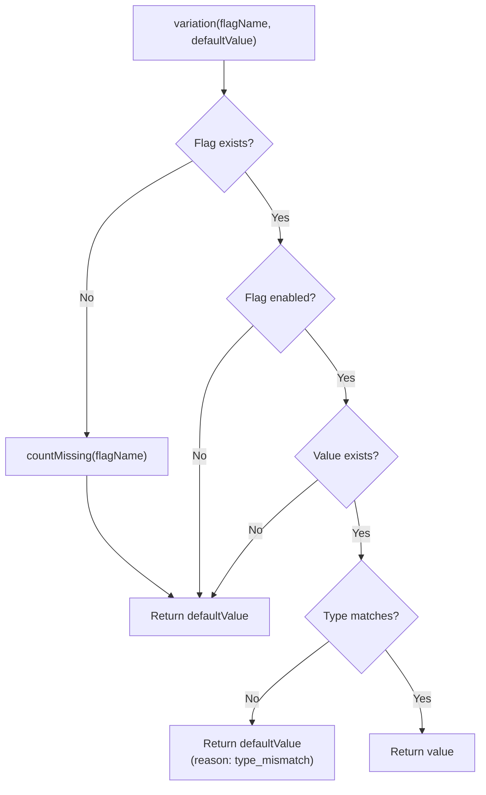

# gatrix-js-client-sdk

Client-side JavaScript SDK for the Gatrix platform.

## Installation

```bash
npm install @gatrix/js-client-sdk
# or
yarn add @gatrix/js-client-sdk
```

## Quick Start

```typescript
import { GatrixClient } from '@gatrix/js-client-sdk';

const client = new GatrixClient({
  apiUrl: 'https://your-api.com/api/v1', // Base URL only (required)
  apiToken: 'your-api-token', // Client API token (required)
  appName: 'my-app', // Application name (required)
  environment: 'production', // Environment name (required)
  context: {
    userId: 'user-123',
  },
  features: {
    refreshInterval: 30, // seconds (default: 30)
  },
});

// Start the client
await client.start();

// Check if a feature is enabled
const isEnabled = client.features.isEnabled('my-feature');

// Get variations with explicit default values
const stringValue = client.features.stringVariation('my-string-flag', 'default-value');
const numberValue = client.features.numberVariation('my-number-flag', 0);
const jsonValue = client.features.jsonVariation('my-json-flag', { fallback: true });

// Clean up
client.stop();
```

## Configuration

### Required Fields

| Field         | Type     | Description                                                                                                                     |
| ------------- | -------- | ------------------------------------------------------------------------------------------------------------------------------- |
| `apiUrl`      | `string` | Base API URL for Edge or Backend server (e.g., `https://edge.your-api.com/api/v1`). The SDK constructs endpoints automatically. |
| `apiToken`    | `string` | Client API token for authentication.                                                                                            |
| `appName`     | `string` | Application name for identification.                                                                                            |
| `environment` | `string` | Environment name (e.g., `development`, `staging`, `production`).                                                                |

> **Note:** The SDK automatically constructs the feature flag endpoint as:
> `{apiUrl}/client/features/{environment}/eval`

### Optional Fields

| Field                      | Type              | Default | Description                        |
| -------------------------- | ----------------- | ------- | ---------------------------------- |
| `context`                  | `object`          | `{}`    | Initial evaluation context.        |
| `enableDevMode`            | `boolean`         | `false` | Enable detailed debug logging.     |
| `logger`                   | `Logger`          | Console | Custom logger implementation.      |
| `features.refreshInterval` | `number`          | `30`    | Polling interval in seconds.       |
| `features.disableRefresh`  | `boolean`         | `false` | Disable automatic polling.         |
| `features.bootstrap`       | `EvaluatedFlag[]` | -       | Initial flag data for offline/SSR. |
| `features.offlineMode`     | `boolean`         | `false` | Use only cached/bootstrap data.    |

## Logging & Debug Mode

### Enable Dev Mode

Set `enableDevMode: true` to enable detailed debug logging for SDK internals:

```typescript
const client = new GatrixClient({
  // ...
  enableDevMode: true,
});
```

### Custom Logger

Provide a custom logger to capture all SDK log messages:

```typescript
const client = new GatrixClient({
  // ...
  logger: {
    debug: (msg, ...args) => myLogger.debug(msg, ...args),
    info: (msg, ...args) => myLogger.info(msg, ...args),
    warn: (msg, ...args) => myLogger.warn(msg, ...args),
    error: (msg, ...args) => myLogger.error(msg, ...args),
  },
});
```

### Fetch Caller Identification

When `fetchFlags` is called, the SDK logs identify the caller:

| Caller           | Description                                              |
| ---------------- | -------------------------------------------------------- |
| `init`           | Initial fetch during `start()`                           |
| `polling`        | Automatic periodic polling (via `refreshInterval`)       |
| `manual`         | External call via `client.features.fetchFlags()`         |
| `syncFlags`      | Explicit sync via `client.features.syncFlags()`          |
| `contextChange`  | Triggered by `updateContext()` / `setContextField()` etc |

Log format: `fetchFlags [caller]: starting fetch. etag=...`

### Recovery Logging

When the SDK recovers from an error state, it always logs (regardless of `enableDevMode`):

```
SDK recovered from error state (recovery #1)
```

## Understanding Flag Evaluation

### Server Response Structure

Each flag from the server contains:

```typescript
interface EvaluatedFlag {
  name: string; // Flag name
  enabled: boolean; // Whether flag is enabled
  variant: {
    name: string; // Variant name
    enabled: boolean; // Whether variant is enabled
    value?: any; // Variant value (optional)
  };
  variantType?: string; // Expected type: 'string' | 'number' | 'json' | 'none'
  reason?: string; // Evaluation reason
  version: number; // Flag version
}
```

### Why Default Values Are Required

All variation methods require an explicit default value:

```typescript
// ✓ Correct: explicit default value
const value = client.features.stringVariation('my-flag', 'fallback');

// ✗ Not supported: no default value
const value = client.features.stringVariation('my-flag');
```

**Rationale:**

1. **Prevents Ambiguity:** When a flag doesn't exist or has no value, the SDK returns your specified default—not `undefined` or `null`.
2. **Type Safety:** The default value establishes the expected return type.
3. **Fail-Safe Behavior:** Your application always receives a usable value, even during network failures or SDK initialization.
4. **Explicit Intent:** Forces developers to consider the fallback scenario, reducing bugs.

### Evaluation Scenarios

| Scenario                 | `enabled`   | `variant`        | Return Value          |
| ------------------------ | ----------- | ---------------- | --------------------- |
| Flag exists & enabled    | `true`      | Server variant   | Variant value         |
| Flag exists but disabled | `false`     | Disabled variant | **Default value**     |
| Flag not found           | N/A         | N/A              | **Default value**     |
| Network error            | Last cached | Last cached      | Cached or **default** |
| Value type mismatch      | `true`      | Server variant   | **Default value**     |



### Variation Methods

#### Simple Variations

Return the value or default. Use when you don't need evaluation details:

```typescript
// Boolean - returns flag.enabled
const isEnabled = client.features.boolVariation('my-flag', false);

// String - returns variant.value as string
const text = client.features.stringVariation('my-flag', 'default');

// Number - returns variant.value as number
const count = client.features.numberVariation('my-flag', 0);

// JSON - returns variant.value as object
const config = client.features.jsonVariation('my-flag', { theme: 'light' });
```

#### Variation Details

Get the value along with evaluation metadata:

```typescript
const result = client.features.stringVariationDetails('my-flag', 'default');

console.log(result);
// {
//   value: 'hello',           // The actual value
//   reason: 'evaluated',      // Why this value was returned
//   flagExists: true,         // Whether flag exists
//   enabled: true             // Whether flag is enabled
// }
```

**Possible `reason` values:**

- `evaluated` - Normal evaluation
- `flag_not_found` - Flag doesn't exist
- `disabled` - Flag is disabled
- `no_value` - No value in variant
- `type_mismatch:expected_X_got_Y` - Value type doesn't match expected
- `type_mismatch:value_not_object` - JSON variation but value is not object

#### Strict Variations (OrThrow)

Throws `GatrixFeatureError` if evaluation fails:

```typescript
import { GatrixFeatureError } from '@gatrix/js-client-sdk';

try {
  const value = client.features.stringVariationOrThrow('my-flag');
} catch (error) {
  if (error instanceof GatrixFeatureError) {
    console.error(error.code, error.flagName, error.message);
  }
}
```

## Watching Flag Changes

### Single Flag

```typescript
// Watch for changes (callback on change only)
const unwatch = client.features.watchFlag('my-feature', (flag) => {
  console.log('Flag changed:', flag.enabled);
});

// Watch with immediate initial callback
const unwatch = client.features.watchFlagWithInitialState('my-feature', (flag) => {
  console.log('Current state:', flag.enabled);
});

// Stop watching
unwatch();
```

### Watch Flag Groups

For managing multiple watchers together (useful for components):

```typescript
// Create a named group
const group = client.features.createWatchFlagGroup('my-component');

// Register multiple watchers (chainable)
group
  .watchFlag('feature-a', (flag) => console.log('A:', flag.enabled))
  .watchFlag('feature-b', (flag) => console.log('B:', flag.enabled))
  .watchFlagWithInitialState('feature-c', (flag) => console.log('C:', flag.enabled));

console.log(group.size); // 3

// Unwatch all at once (e.g., on component unmount)
group.destroy();
```

## Events

```typescript
import { GatrixClient, EVENTS } from '@gatrix/js-client-sdk';

client.on(EVENTS.READY, () => {
  console.log('SDK is ready');
});

client.on(EVENTS.FETCH_START, () => {
  console.log('Started fetching flags');
});

client.on(EVENTS.FETCH_SUCCESS, () => {
  console.log('Successfully fetched flags');
});

client.on(EVENTS.FETCH_ERROR, (error) => {
  console.error('Fetch error:', error);
});

client.on(EVENTS.FETCH_END, () => {
  console.log('Fetch process completed');
});

client.on(EVENTS.CHANGE, ({ flags }) => {
  console.log('Flags changed:', flags);
});

client.on(EVENTS.ERROR, (error) => {
  console.error('Error:', error);
});

client.on(EVENTS.RECOVERED, () => {
  console.log('SDK recovered from error');
});

// Watch specific flag changes
client.on('flags.my-feature.change', (flag) => {
  console.log('my-feature changed:', flag);
});
```

## Offline Mode

```typescript
const client = new GatrixClient({
  // ...
  features: {
    offlineMode: true,
    bootstrap: [
      { name: 'feature-a', enabled: true, variant: { name: 'on', enabled: true }, version: 1 },
    ],
  },
});

await client.start(); // Uses bootstrap data, no network requests
```

## Explicit Sync Mode

For full control over when flags are fetched:

```typescript
const client = new GatrixClient({
  // ...
  features: {
    explicitSyncMode: true,
    disableRefresh: true,
  },
});

// Flags won't update until you explicitly sync
await client.features.syncFlags();
```

## API Reference

### GatrixClient

| Method                 | Description                  |
| ---------------------- | ---------------------------- |
| `start()`              | Initialize and start the SDK |
| `stop()`               | Stop polling and clean up    |
| `isReady()`            | Check if SDK is ready        |
| `getError()`           | Get last error               |
| `on(event, callback)`  | Subscribe to events          |
| `off(event, callback)` | Unsubscribe from events      |
| `features`             | Access FeaturesClient        |

### FeaturesClient (via `client.features`)

| Method                                          | Description                 |
| ----------------------------------------------- | --------------------------- |
| `isEnabled(flagName)`                           | Check if flag is enabled    |
| `boolVariation(flagName, default)`              | Get boolean (flag.enabled)  |
| `stringVariation(flagName, default)`            | Get string value            |
| `numberVariation(flagName, default)`            | Get number value            |
| `jsonVariation(flagName, default)`              | Get JSON value              |
| `stringVariationDetails(flagName, default)`     | Get string with details     |
| `numberVariationDetails(flagName, default)`     | Get number with details     |
| `jsonVariationDetails(flagName, default)`       | Get JSON with details       |
| `stringVariationOrThrow(flagName)`              | Get string or throw         |
| `numberVariationOrThrow(flagName)`              | Get number or throw         |
| `jsonVariationOrThrow(flagName)`                | Get JSON or throw           |
| `getVariant(flagName)`                          | Get raw variant             |
| `getAllFlags()`                                 | Get all flags               |
| `watchFlag(flagName, callback)`                 | Watch for changes           |
| `watchFlagWithInitialState(flagName, callback)` | Watch with initial callback |
| `createWatchFlagGroup(name)`                    | Create a watch group        |
| `isFetching()`                                  | Check if currently fetching |
| `isExplicitSync()`                              | Check if explicit mode      |
| `canSyncFlags()`                                | Check if sync can be called |
| `syncFlags(fetchNow?)`                          | Manual sync (explicit mode) |
| `updateContext(context)`                        | Update evaluation context   |
| `getContext()`                                  | Get current context         |

### WatchFlagGroup

| Method                                          | Description                                |
| ----------------------------------------------- | ------------------------------------------ |
| `watchFlag(flagName, callback)`                 | Add watcher (chainable)                    |
| `watchFlagWithInitialState(flagName, callback)` | Add watcher with initial state (chainable) |
| `unwatchAll()`                                  | Remove all watchers                        |
| `destroy()`                                     | Alias for unwatchAll                       |
| `size`                                          | Number of active watchers                  |
| `getName()`                                     | Get group name                             |
