# Gatrix Unity SDK

> **피처 플래그, A/B 테스트, 원격 구성 — Unity를 위한 공식 Gatrix SDK입니다.**

Gatrix Unity SDK를 사용하면 새 빌드를 배포하지 않고도 게임의 동작을 실시간으로 제어할 수 있습니다. 기능 토글, A/B 실험, 게임 파라미터 튜닝, 점진적 롤아웃 — 모든 것을 Gatrix 대시보드에서 수행할 수 있습니다.

### 🏷️ 피처 플래그란?

피처 플래그는 두 가지 요소로 구성됩니다:

| 요소 | 타입 | 설명 |
|---|---|---|
| **상태** (`enabled`) | `bool` | 기능이 켜져 있는가, 꺼져 있는가 — `IsEnabled()`로 확인 |
| **값** (`variant`) | `boolean` `string` `number` `json` | 평가된 구성 값 — `BoolVariation()`, `StringVariation()`, `FloatVariation()`, `JsonVariation()`으로 읽음 |

플래그는 **켜져 있으면서도** 특정 값을 가질 수 있습니다 (예: `difficulty = "hard"`). 상태와 값은 독립적 — 항상 두 가지 모두 처리해야 합니다.


### ⚡ Quick Examples

#### 1. 피처 토글 (`IsEnabled`)
코드 배포 없이 기능을 즉시 켜거나 끌 수 있습니다.

```mermaid
flowchart LR
    DASHBOARD["🖥️ 대시보드<br/>Toggle: ON"]:::dash ==> GAME["🎮 게임 클라이언트<br/>if (IsEnabled)"]:::game
    GAME --> FEATURE("✨ 새 상점 UI 표시"):::feature

    classDef dash fill:#2d3436,stroke:#00b894,stroke-width:2px,color:white;
    classDef game fill:#2d3436,stroke:#0984e3,stroke-width:2px,color:white;
    classDef feature fill:#2d3436,stroke:#fdcb6e,stroke-width:2px,color:white,stroke-dasharray: 5 5;
```



```csharp
if (GatrixBehaviour.Client.Features.IsEnabled("new-shop"))
{
    // 기능이 ON 상태 -> 새 상점 UI 표시
    ShowNewShop();
}
else
{
    // 기능이 OFF 상태 (또는 플래그 없음) -> 기존 상점으로 폴백
    ShowLegacyShop();
}
```

#### 2. 원격 구성 (`Variation`)
게임 밸런스, 텍스트 등을 원격에서 조정합니다. 문자열, 숫자, JSON을 지원합니다.

```mermaid
flowchart LR
    DASHBOARD["🖥️ 대시보드<br/>game-speed: 2.0<br/>welcome-msg: '안녕!'"]:::dash ==> GAME["🎮 게임 클라이언트<br/>FloatVariation / StringVariation"]:::game
    GAME --> VALUE1("🚀 속도 = 2.0"):::feature
    GAME --> VALUE2("💬 텍스트 = '안녕!'"):::feature

    classDef dash fill:#2d3436,stroke:#00b894,stroke-width:2px,color:white;
    classDef game fill:#2d3436,stroke:#0984e3,stroke-width:2px,color:white;
    classDef feature fill:#2d3436,stroke:#fdcb6e,stroke-width:2px,color:white,stroke-dasharray: 5 5;
```



```csharp
// float 값 가져오기 (설정이 없으면 기본값 1.0f 사용)
float speed = GatrixBehaviour.Client.Features.FloatVariation("game-speed", 1.0f);

// string 값 가져오기
string message = GatrixBehaviour.Client.Features.StringVariation("welcome-msg", "환영합니다");
```

#### 3. 조건부 타겟팅
특정 사용자 그룹(국가, 레벨, 앱 버전 등)에게만 다른 값을 제공합니다.

```mermaid
flowchart LR
    RULE["🖥️ 규칙:<br/>IF 레벨 >= 10<br/>THEN 'difficulty' = 'Hard'"]:::dash ==> GAME["🎮 게임 클라이언트<br/>Context: { Level: 15 }"]:::game
    GAME --> RESULT("🔥 난이도: Hard"):::feature

    classDef dash fill:#2d3436,stroke:#d63031,stroke-width:2px,color:white;
    classDef game fill:#2d3436,stroke:#0984e3,stroke-width:2px,color:white;
    classDef feature fill:#2d3436,stroke:#fdcb6e,stroke-width:2px,color:white,stroke-dasharray: 5 5;
```



```csharp
// 대시보드의 규칙이 사용자 컨텍스트(예: Level 15)를 기반으로 값을 결정합니다.
// 클라이언트는 단순히 값을 읽기만 하면 됩니다 — 로직은 서버에 있습니다!
string difficulty = GatrixBehaviour.Client.Features.StringVariation("difficulty", "Normal");
```

**더 복잡한 타겟팅 시나리오 — 모두 서버에서 평가됩니다:**

```csharp
var features = GatrixBehaviour.Client.Features;

// ── 예제 1: VIP 등급별 분기 ────────────────────────────────────────────
// 대시보드 규칙:
//   vipTier == "gold"    → "boss-drop-rate" = 2.0
//   vipTier == "silver"  → "boss-drop-rate" = 1.5
//   (그 외)              → "boss-drop-rate" = 1.0  (플래그 기본값)
float dropRate = features.FloatVariation("boss-drop-rate", 1.0f);
// 이 유저의 VIP 등급에 맞는 값이 자동으로 반환됩니다

// ── 예제 2: 지역 + 버전 조건 이벤트 롤아웃 ──────────────────────────────
// 대시보드 규칙:
//   country == "KR" AND appVersion >= "2.5.0" → "summer-event" 활성화
//   country == "JP"                            → "summer-event" 활성화 (별도 롤아웃)
//   (그 외)                                    → "summer-event" 비활성화
if (features.IsEnabled("summer-event"))
{
    ShowSummerEventBanner();
}
else
{
    ShowDefaultLobby();  // 이 지역/버전에는 이벤트 없음
}

// ── 예제 3: JSON 배리언트로 전체 설정 테이블 제어 ──────────────────────
// 대시보드가 세그먼트별 다른 JSON을 반환:
//   "whales" 세그먼트   → { "shopDiscount": 0, "gemBonus": 50, "exclusiveItems": true }
//   "신규 유저"          → { "shopDiscount": 30, "gemBonus": 0,  "exclusiveItems": false }
//   (기본)              → { "shopDiscount": 10, "gemBonus": 0,  "exclusiveItems": false }
var defaultConfig = new Dictionary<string, object>
{
    ["shopDiscount"]   = 10,
    ["gemBonus"]       = 0,
    ["exclusiveItems"] = false
};
var shopConfig = features.JsonVariation("shop-config", defaultConfig);

int discount      = Convert.ToInt32(shopConfig["shopDiscount"]);
int gemBonus      = Convert.ToInt32(shopConfig["gemBonus"]);
bool hasExclusive = Convert.ToBoolean(shopConfig["exclusiveItems"]);
ApplyShopConfig(discount, gemBonus, hasExclusive);

// ── 예제 4: 퍼센트 롤아웃으로 새 UI 점진적 공개 ────────────────────────
// 대시보드: "new-inventory-ui"를 20% 사용자에게만 활성화 (sticky — 항상 같은 결과)
if (features.IsEnabled("new-inventory-ui"))
{
    ShowNewInventoryUI();     // 20% 롤아웃 그룹
}
else
{
    ShowLegacyInventoryUI();  // 나머지 80%
}
```

Gatrix를 사용하면 사용자 세그먼트, 커스텀 속성(예: `vipTier`), 롤아웃 비율 등을 조합하여 정교한 타게팅 규칙을 설정할 수 있습니다:


> 빌드도, 배포도 필요 없습니다 — [Gatrix 대시보드](https://your-dashboard.example.com)에서 값을 변경하면 게임에 즉시 반영됩니다.

아래는 실제 Gatrix 대시보드 화면입니다 — 모든 피처 플래그를 관리하고, 환경별 토글을 제어하며, 상태를 한눈에 모니터링할 수 있습니다:


---

## ✨ Gatrix를 사용해야 하는 이유

| Gatrix 없이 | Gatrix와 함께 |
|---|---|
| 값 하나 바꾸려면 새 빌드 배포 | 대시보드에서 실시간 변경 |
| 모든 플레이어가 같은 경험 | A/B 테스트로 다양한 경험 제공 |
| 하드코딩된 피처 플래그 | 실시간 원격 구성 |
| 위험한 빅뱅 릴리스 | 즉시 롤백 가능한 점진적 배포 |

### 🎯 실전 활용 시나리오

#### 📱 모바일 앱 스토어 심사 대응

모바일 게임 업데이트는 앱 스토어 심사 과정을 거쳐야 하며, **수일 이상** 소요될 수 있습니다. 피처 플래그를 사용하면 새 기능의 코드가 **이미 포함되어 있지만 비활성화된 상태**로 빌드를 제출하고, 심사가 승인된 후 — 또는 원하는 시점에 — 대시보드에서 즉시 활성화할 수 있습니다.

```mermaid
sequenceDiagram
    participant Dev as 🧑‍💻 개발자
    participant Store as 📱 앱 스토어
    participant Dashboard as 🖥️ Gatrix 대시보드
    participant Game as 🎮 게임 클라이언트

    Dev->>Store: 빌드 v2.1 제출<br/>(새 기능 코드 포함, 플래그 OFF)
    Note over Store: 심사 진행 중<br/>(3–7일)
    Store->>Game: v2.1 심사 통과 & 배포됨

    Note over Dev: 출시 준비 완료!
    Dev->>Dashboard: "summer-event" 플래그 활성화
    Dashboard->>Game: 스트리밍을 통해 플래그 업데이트
    Note over Game: 🎉 기능 즉시 활성화!

    Note over Dev: 문제 발견!
    Dev->>Dashboard: "summer-event" 플래그 비활성화
    Dashboard->>Game: 스트리밍을 통해 플래그 업데이트
    Note over Game: 🛑 기능 즉시 비활성화<br/>새 빌드 불필요
```



> 💡 **Gatrix 없이:** 제출 타이밍을 완벽하게 맞추거나, 기능을 활성화/비활성화하기 위해 *또 다른* 업데이트를 제출하고 다시 심사를 기다려야 합니다.

#### ⚖️ 규제 및 법규 준수 (GDPR 등)

GDPR, COPPA, 각 지역의 도박 관련 법률과 같은 법규는 특정 지역이나 사용자 세그먼트에 대해 특정 기능을 **즉시 비활성화**해야 할 수 있습니다. 피처 플래그를 사용하면:

- 앱 업데이트 없이 **특정 국가에서 기능을 비활성화**할 수 있습니다
- 규제 명령에 **수일이 아닌 수분 내에 대응**할 수 있습니다
- **사용자 컨텍스트**(지역, 연령대 등)로 타게팅하여 현지 법규를 준수할 수 있습니다

```
예시: 독일에서 내일부터 새로운 도박 규제가 시행됩니다.
  → 타게팅 규칙 설정: country = "DE" → "loot-box-feature" 비활성화
  → 모든 독일 플레이어에게 즉시 적용됩니다.
  → 앱 업데이트 없음, 심사 없음, 다운타임 없음.
```

#### 🤷 시행 여부가 불확실한 상황

기능을 *언제* — 또는 *출시할지 여부*조차 — 알 수 없는 경우가 있습니다:

- **파트너십 계약**이 최종 승인 대기 중 → 코드는 준비됐지만, 계약 성사 시까지 플래그 OFF 유지
- **시즌 이벤트**가 취소되거나 연기될 수 있음 → 확정 시에만 활성화
- **정부 정책**이 시행될지 불확실 → 양쪽 경로를 준비하고 결과에 따라 토글
- **경쟁사 대응** — 경쟁사가 출시하면 즉시 대응 기능을 활성화

> 피처 플래그를 사용하면 코드는 **항상 준비된 상태**입니다. *언제 출시할지*라는 비즈니스 결정은 엔지니어링 일정과 완전히 분리됩니다.

#### 🔬 A/B 테스트 및 데이터 기반 의사결정
플레이어가 무엇을 좋아하는지 추측하지 마세요. 피처 플래그를 사용하여 그룹별로 다른 경험을 제공하고 결과를 측정하세요:

- **난이도 튜닝**: A 그룹은 "보통", B 그룹은 "어려움". 어느 그룹의 리텐션(재방문율)이 더 높을까요?
- **수익화 실험**: 두 가지 상점 레이아웃을 테스트하여 어느 쪽이 더 높은 매출을 내는지 확인하세요.
- **유저 반응 살피기**: 기능을 전체 유저의 5%에게만 먼저 공개하세요. 커뮤니티 반응이 부정적이라면 즉시 롤백하고 개선할 수 있습니다.

> 회의실에서 무엇이 더 나은지 논쟁하는 대신, **데이터가 결정하도록 하세요.**

#### 🚨 긴급 킬 스위치

프로덕션에서 문제가 발생했을 때 — 크래시를 유발하는 기능, 익스플로잇, 예상치 못한 서버 부하 등 — *빠르게* 대응해야 합니다:

- **문제가 되는 기능을** 수시간이 아닌 **수초 내에 비활성화**
- **핫픽스 빌드 불필요** — 플래그만 토글하면 됩니다
- **점진적 재활성화** — 수정 확인 후 1% → 10% → 50% → 100%로 롤아웃

#### 🛡️ SafeGuard (자동 차단 시스템)
개발자가 24시간 릴리스를 모니터링할 수는 없습니다. **Gatrix SafeGuard**는 외부 SaaS 연동 없이, 플랫폼 내에서 직접 **임팩트 메트릭(Impact Metrics)**을 수집합니다. 크래시 수, 에러율, 사용자 정의 KPI 등을 통해 이상 징후를 자동으로 감지합니다:

- **자동 비활성화**: 릴리스 후 메트릭이 설정된 임계치를 초과하면, SafeGuard가 **해당 플래그를 자동으로 비활성화**합니다 — 문제가 퍼지기 전에.
- **릴리스 플로우 일시정지**: 플래그를 즉시 끄는 대신, SafeGuard가 **릴리스 플로우의 마일스톤을 일시정지**시켜 점진적 롤아웃을 멈추고 수동 검토를 기다릴 수도 있습니다.
- **안심 배포**: 대시보드를 직접 감시할 필요 없이 — SafeGuard가 롤아웃을 대신 지켜봅니다.


### 🤔 Gatrix가 필요하지 않을 수 있는 경우

Gatrix가 모든 프로젝트에 적합한 것은 아닙니다. 아래 항목에 해당하는지 확인해 보세요:

- **출시 후 업데이트가 없는 싱글플레이어 오프라인 게임** — 한 번 출시하고 더 이상 패치하지 않는다면, 원격 구성은 불필요한 복잡성을 추가합니다.
- **매우 소규모이거나 프로토타입 프로젝트** — 1~2명 팀이고 게임 규모가 작다면, 하드코딩된 값이 관리하기 더 간단할 수 있습니다.
- **엄격한 지연 시간 요구 사항** — SDK는 시작 시 네트워크 페치를 수행합니다. 수백 밀리초의 추가 시작 지연도 허용할 수 없다면 신중하게 평가하세요.
- **서버 인프라가 없는 경우** — Gatrix는 백엔드 서버가 필요합니다. 프로젝트에 서버 구성 요소가 전혀 없고 완전한 서버리스 환경을 유지하고 싶다면 적합하지 않을 수 있습니다.
- **규제 제한** — 일부 환경에서는 게임 클라이언트의 외부 네트워크 요청을 제한합니다. 배포 환경에서 SDK 통신이 허용되는지 확인하세요.

---

## 🏗️ 평가 모델: 원격 평가 전용

Gatrix는 **원격 평가** 방식만을 사용합니다 — 타게팅 규칙과 롤아웃 로직은 절대 서버 밖으로 나가지 않습니다.

1. SDK가 **컨텍스트**(userId, env, properties)를 서버로 전송
2. 서버가 모든 규칙을 평가하고 **최종 플래그 값만** 반환
3. SDK가 결과를 캐시하고 동기적으로 제공

| | 원격 평가 (Gatrix) | 로컬 평가 |
|---|---|---|
| **보안** | ✅ 규칙이 서버 밖으로 나가지 않음 | ⚠️ 클라이언트에 규칙 노출 |
| **일관성** | ✅ 모든 SDK에서 동일한 결과 | ⚠️ 각 SDK가 규칙을 재구현해야 함 |
| **페이로드** | ✅ 소규모 (최종 값만) | ⚠️ 대규모 (전체 규칙 세트) |
| **첫 실행 오프라인** | ⚠️ 최소 1회 연결 또는 부트스트랩 데이터 필요 | ✅ 규칙을 빌드 시점에 번들링 가능 |

> 🌐 **오프라인 & 가용성:** SDK는 서버에 연결할 수 없을 때 항상 로컬 캐시에서 값을 제공합니다. fallbackValue로 네트워크 문제로 인한 게임 중단은 절대 발생하지 않습니다.

> 📖 전체 상세 내용 — 값 리졸루션 흐름, 예약 배리언트 이름(`$missing`, `$env-default-enabled` ...), `fallbackValue` 설계 이유:  
> **[→ 평가 모델 자세히 보기](docs/EVALUATION_MODEL.ko.md)**
---


---

## 📦 설치

### Unity Package Manager (UPM)

`Packages/manifest.json`에 추가:

```json
{
  "dependencies": {
    "com.gatrix.unity.sdk": "file:../../path/to/gatrix-unity-sdk"
  }
}
```

또는 **Window → Package Manager → Add package from disk...** 에서 `package.json`을 선택합니다.

---

## 🚀 빠른 시작

### 옵션 A: 코드 없이 설정 (권장)

1. Unity 메뉴에서 **Window → Gatrix → Setup Wizard**로 이동
2. API URL, 토큰, 앱 이름 입력
3. **Create SDK Manager** 클릭 — 완료!


설정이 완료되면 **GatrixBehaviour** 컴포넌트가 자동으로 씬에 추가됩니다:


### 옵션 B: 코드로 설정

```csharp
using Gatrix.Unity.SDK;
using UnityEngine;

public class GameManager : MonoBehaviour
{
    async void Start()
    {
        var config = new GatrixClientConfig
        {
            ApiUrl    = "https://your-api.example.com/api/v1",
            ApiToken  = "your-client-api-token",
            AppName   = "my-unity-game",
            Environment = "production",
            Context   = new GatrixContext { UserId = "player-123" }
        };

        await GatrixBehaviour.InitializeAsync(config);
        Debug.Log("Gatrix 준비 완료!");
    }
}
```

---

## 🎮 피처 플래그 읽기

```csharp
var features = GatrixBehaviour.Client.Features;

// Boolean 체크
bool newUIEnabled = features.IsEnabled("new-ui");

// 타입별 안전한 기본값 (예외 발생 없음)
bool   showBanner  = features.BoolVariation("show-banner", false);
string theme       = features.StringVariation("app-theme", "dark");
int    maxRetries  = features.IntVariation("max-retries", 3);
float  gameSpeed   = features.FloatVariation("game-speed", 1.0f);
double dropRate    = features.NumberVariation("item-drop-rate", 0.05);

// 전체 배리언트 정보 (이름 + 값)
Variant variant = features.GetVariant("experiment-a");
Debug.Log($"Variant: {variant.Name}, Value: {variant.Value}");

// 평가 상세 정보 (결정 이유 포함)
var details = features.BoolVariationDetails("feature-x", false);
Debug.Log($"Value: {details.Value}, Reason: {details.Reason}");
```

---

## 👁️ 변경 감지 (Watch)

Gatrix는 두 가지 Watch 방식을 제공합니다:

| 메서드 | 콜백 발생 시점 |
|---|---|
| `WatchRealtimeFlag` | 서버 페치 후 즉시 |
| `WatchSyncedFlag` | `SyncFlagsAsync()` 호출 시 (`ExplicitSyncMode = true`일 때) |

```csharp
var features = GatrixBehaviour.Client.Features;

// 리얼타임 — 변경 즉시 발생 (디버그 UI, 비게임플레이용)
features.WatchRealtimeFlagWithInitialState("dark-mode", proxy =>
{
    ApplyTheme(proxy.Enabled ? "dark" : "light");
});

// 동기화 — SyncFlagsAsync() 호출 시 발생 (게임플레이 안전)
features.WatchSyncedFlagWithInitialState("difficulty", proxy =>
{
    SetDifficulty(proxy.StringVariation("normal"));
});

// 안전한 시점에 적용 (로딩 화면, 라운드 사이)
await features.SyncFlagsAsync();
```

> 📖 전체 Watch API 레퍼런스 — `FlagProxy` 속성, API 표, Watch 그룹, `forceRealtime`, 실전 동기화 시나리오:  
> **[→ Watch API 자세히 보기](docs/WATCH_API.ko.md)**

---

## 🧩 제로 코드 컴포넌트 (Zero-Code Components)

C# 코드 없이 Unity 씬 속성을 피처 플래그에 바인딩합니다.

추가 방법: **우클릭 → Gatrix → UI / Logic / Debug / Visual / Audio / Rendering / AI / Environment...**


**제공 컴포넌트 카테고리:**

| 카테고리 | 컴포넌트 |
|---|---|
| **Logic** | [`GatrixFlagToggle`](docs/COMPONENTS.ko.md#gatrixflagtoggle), [`GatrixFlagEvent`](docs/COMPONENTS.ko.md#gatrixflagevent), [`GatrixEventListener`](docs/COMPONENTS.ko.md#gatrixeventlistener), [`GatrixVariantSwitch`](docs/COMPONENTS.ko.md#gatrixvariantswitch), [`GatrixFlagSceneRedirect`](docs/COMPONENTS.ko.md#gatrixflagsceneredirect), [`GatrixFlagBehaviourEnabled`](docs/COMPONENTS.ko.md#gatrixflagbehaviourenabled) |
| **UI** | [`GatrixFlagValue`](docs/COMPONENTS.ko.md#gatrixflagvalue), [`GatrixFlagImage`](docs/COMPONENTS.ko.md#gatrixflagimage), [`GatrixFlagColor`](docs/COMPONENTS.ko.md#gatrixflagcolor), [`GatrixFlagCanvas`](docs/COMPONENTS.ko.md#gatrixflagcanvas), [`GatrixFlagSlider`](docs/COMPONENTS.ko.md#gatrixflagslider), [`GatrixFlagButtonInteractable`](docs/COMPONENTS.ko.md#gatrixflagbuttoninteractable), [`GatrixFlagInputField`](docs/COMPONENTS.ko.md#gatrixflaginputfield), [`GatrixFlagScrollRect`](docs/COMPONENTS.ko.md#gatrixflagscrollrect) |
| **Rendering** | [`GatrixFlagMaterial`](docs/COMPONENTS.ko.md#gatrixflagmaterial), [`GatrixFlagTransform`](docs/COMPONENTS.ko.md#gatrixflagtransform), [`GatrixFlagSpriteRenderer`](docs/COMPONENTS.ko.md#gatrixflagspriterenderer), [`GatrixFlagRendererToggle`](docs/COMPONENTS.ko.md#gatrixflagrenderertoggle), [`GatrixFlagParticles`](docs/COMPONENTS.ko.md#gatrixflagparticles), [`GatrixFlagQualitySettings`](docs/COMPONENTS.ko.md#gatrixflagqualitysettings), [`GatrixFlagShaderProperty`](docs/COMPONENTS.ko.md#gatrixflagshaderproperty), [`GatrixFlagTrailRenderer`](docs/COMPONENTS.ko.md#gatrixflagtrailrenderer), [`GatrixFlagLineRenderer`](docs/COMPONENTS.ko.md#gatrixflaglinerenderer), [`GatrixFlagGlobalShader`](docs/COMPONENTS.ko.md#gatrixflagglobalshader) |
| **Audio** | [`GatrixFlagAudio`](docs/COMPONENTS.ko.md#gatrixflagaudio), [`GatrixFlagAnimator`](docs/COMPONENTS.ko.md#gatrixflaganimator), [`GatrixFlagAudioMixer`](docs/COMPONENTS.ko.md#gatrixflagaudiomixer), [`GatrixFlagAudioSource`](docs/COMPONENTS.ko.md#gatrixflagaudiosource) |
| **Camera** | [`GatrixFlagCamera`](docs/COMPONENTS.ko.md#gatrixflagcamera) |
| **Lighting** | [`GatrixFlagLight`](docs/COMPONENTS.ko.md#gatrixflaglight) |
| **Environment** | [`GatrixFlagFog`](docs/COMPONENTS.ko.md#gatrixflagfog), [`GatrixFlagAmbientLight`](docs/COMPONENTS.ko.md#gatrixflagambientlight), [`GatrixFlagSkybox`](docs/COMPONENTS.ko.md#gatrixflagskybox), [`GatrixFlagWindZone`](docs/COMPONENTS.ko.md#gatrixflagwindzone) |
| **Physics** | [`GatrixFlagRigidbody`](docs/COMPONENTS.ko.md#gatrixflagrigidbody), [`GatrixFlagGravity`](docs/COMPONENTS.ko.md#gatrixflaggravity), [`GatrixFlagCollider`](docs/COMPONENTS.ko.md#gatrixflagcollider) |
| **2D** | [`GatrixFlagRigidbody2D`](docs/COMPONENTS.ko.md#gatrixflagrigidbody2d), [`GatrixFlagSortingOrder`](docs/COMPONENTS.ko.md#gatrixflagsortingorder), [`GatrixFlagTilemap`](docs/COMPONENTS.ko.md#gatrixflagtilemap), [`GatrixFlagPhysicsMaterial2D`](docs/COMPONENTS.ko.md#gatrixflagphysicsmaterial2d), [`GatrixFlagJoint2D`](docs/COMPONENTS.ko.md#gatrixflagjoint2d), [`GatrixFlagEffector2D`](docs/COMPONENTS.ko.md#gatrixflageffector2d) |
| **AI** | [`GatrixFlagNavMeshAgent`](docs/COMPONENTS.ko.md#gatrixflagnavmeshagent), [`GatrixFlagNavMeshObstacle`](docs/COMPONENTS.ko.md#gatrixflagnavmeshobstacle), [`GatrixFlagAIAnimator`](docs/COMPONENTS.ko.md#gatrixflagaianimator), [`GatrixFlagDetectionRange`](docs/COMPONENTS.ko.md#gatrixflagdetectionrange) |
| **Time** | [`GatrixFlagTimeScale`](docs/COMPONENTS.ko.md#gatrixflagtimescale), [`GatrixFlagFrameRate`](docs/COMPONENTS.ko.md#gatrixflagframerate) |
| **Post FX** | [`GatrixFlagPostProcessVolume`](docs/COMPONENTS.ko.md#gatrixflagpostprocessvolume) |
| **Debug** | [`GatrixFlagLogger`](docs/COMPONENTS.ko.md#gatrixflaglogger) |

> 📖 컴포넌트 상세 레퍼런스 — 플래그 값 타입, 각 모드별 설명, 활용 시나리오:  
> **[→ 컴포넌트 레퍼런스 자세히 보기](docs/COMPONENTS.ko.md)**

---

## 🛠️ 에디터 도구


### 모니터 윈도우
**Window → Gatrix → Monitor**

SDK 상태에 대한 실시간 대시보드:

| 탭 | 표시 내용 |
|-----|-------------|
| **Overview** | SDK 상태, 연결 ID, 페치 통계 (횟수, 오류, 복구), 스트리밍 통계 (이벤트, 오류, 복구, 전송 유형), 씬 구성 |
| **Flags** | 모든 플래그의 실시간 ON/OFF 상태, 배리언트, 값. 최근 변경된 플래그를 노란색으로 하이라이트 |
| **Events** | 실시간 이벤트 로그 — 타임스탬프와 상세 정보가 포함된 모든 SDK 이벤트 |
| **Context** | 현재 평가 컨텍스트 (userId, sessionId, 커스텀 속성) |
| **Metrics** | 이중 뷰 메트릭: 실시간 시계열 차트의 **Graph** 모드 또는 상세 테이블의 **Report** 모드. 플래그별 타임라인 차트 |
| **Stats** | 상세 카운터, 스트리밍 카운터, 플래그 접근 횟수, 배리언트 히트 횟수, 누락된 플래그, 이벤트 핸들러 누수 감지 |

#### Overview 탭


#### Flags 탭


#### Events 탭


#### Context 탭


#### Metrics 탭
**Metrics** 탭에는 에디터에서 직접 렌더링되는 인터랙티브 시계열 그래프가 포함됩니다:
- **Network Activity** — 시간에 따른 페치, 업데이트, 오류 표시
- **Impressions & Delivery** — 시간에 따른 노출 횟수와 메트릭 전송
- **Streaming** — 재연결 시도, 스트림 이벤트, 스트림 오류
- 플래그별 타임라인 차트로 boolean 및 배리언트 상태 변화 시각화
- 1초 간격 수집, 300초 데이터 보존
- 자동 스케일 Y축, 그리드 라인, 시간축 레이블, 컬러 코딩된 범례
- 시간 오프셋 슬라이더로 과거 데이터 스크롤
- **Graph**와 **Report** 뷰를 원클릭으로 전환


#### Stats 탭


**툴바 빠른 동작:**
- **⚡ Sync** — 명시적 동기화 모드에서 보류 중인 변경이 있을 때 표시
- **↻** — 수동 새로고침
- **● Auto / ○ Auto** — 자동 새로고침 토글
- **Setup ↗** — Setup Wizard 열기
- **About** — SDK 버전 정보

---

### Setup Wizard
**Window → Gatrix → Setup Wizard**

최초 구성을 위한 가이드 설정. 사전 구성된 SDK Manager 프리팹을 생성합니다.


---

### About 윈도우
**Window → Gatrix → About**

SDK 버전, Unity 버전, 플랫폼 정보, 런타임 연결 상태를 확인할 수 있습니다.


---

### 커스텀 인스펙터
모든 Gatrix 컴포넌트에는 다듬어진 커스텀 인스펙터가 있습니다:
- **◆ GATRIX** 파란색 강조가 있는 타이틀 바
- **● LIVE** 플레이 모드 중 배지
- **실시간 플래그 상태** — 현재 ON/OFF 상태와 배리언트 표시
- **Monitor ↗** — 모니터 윈도우로 바로 이동하는 빠른 접근 버튼
- 명확한 레이블이 있는 정리된 그룹


---

### 프로젝트 설정
**Edit → Project Settings → Gatrix SDK**

프로젝트 설정 윈도우에서 접근 가능한 전역 설정과 바로가기입니다.

---

## 🔄 컨텍스트 관리

### 컨텍스트란?

**컨텍스트**는 **현재 사용자와 그 환경**을 설명하는 속성들의 집합입니다. Gatrix 서버는 컨텍스트를 사용하여 각 플래그에 대해 어떤 배리언트를 반환할지 결정합니다 — 모든 타게팅 규칙, 비율 롤아웃, A/B 실험의 입력이 됩니다.

컨텍스트가 없으면 서버는 사용자를 구분할 수 없으며, 모든 사용자에게 기본 플래그 값만 반환할 수 있습니다.

### 컨텍스트 필드

| 필드 | 타입 | 설명 |
|------|------|------|
| `AppName` | `string` | 앱 이름 (시스템 필드 — 초기화 시 설정, 변경 불가) |
| `Environment` | `string` | 환경 이름 (시스템 필드 — 초기화 시 설정, 변경 불가) |
| `UserId` | `string` | 고유 사용자 식별자 — **타게팅에 가장 중요한 필드** |
| `SessionId` | `string` | 세션 범위 실험을 위한 세션 식별자 |
| `CurrentTime` | `string` | 시간 기반 타게팅을 위한 시간 오버라이드 (시스템 필드) |
| `Properties` | `Dictionary` | 추가 타게팅 속성을 위한 커스텀 키-값 쌍 |

> 💡 **함수 호출처럼 생각하세요.** 컨텍스트는 여러분이 전달하는 **인자(argument)**이고, 서버의 타게팅 규칙은 **함수 내부의 조건문**입니다. 서버가 함수를 실행하고 결과를 반환합니다 — 로직 자체는 외부에 노출되지 않습니다.

```
// 개념적으로 Gatrix 서버가 각 플래그에 대해 하는 일:
EvaluatedFlag evaluate(flagName, context):

    if context.userId == "admin-1234":
        return variant("debug-mode-on", value: true)

    if context.properties["vipTier"] == "gold":
        return variant("gold-shop", value: { discount: 0, gemBonus: 50 })

    if context.properties["country"] == "KR"
    and context.properties["appVersion"] >= "2.5.0":
        return variant("kr-summer-event", value: true)

    if context.properties["level"] >= 10:
        return variant("hard-difficulty", value: "hard")

    if rollout(context.userId, percentage: 20):
        return variant("new-ui-rollout", value: true)

    return defaultVariant(value: ...)   // 매칭된 규칙 없음

// 게임 코드에서는 단순히 이렇게 호출합니다:
features.IsEnabled("summer-event")             // context는 자동으로 전송됨
features.StringVariation("difficulty", "Normal")
```

> SDK는 모든 요청마다 컨텍스트를 서버로 전송합니다. **게임 코드에서 사용자 속성 기반 `if` 체인을 직접 작성할 필요가 없습니다** — 그것은 서버가 담당하는 일입니다.


### 컨텍스트 설정 시점

컨텍스트는 사용 가능한 정보에 따라 **세 가지 단계**에서 제공할 수 있습니다:

```mermaid
flowchart LR
    subgraph S1 ["📱 앱 실행"]
        A["초기화 컨텍스트<br/>디바이스, 플랫폼, 버전"]
    end
    subgraph S2 ["🔑 사용자 로그인"]
        B["컨텍스트 업데이트<br/>userId, plan, country"]
    end
    subgraph S3 ["🎮 세션 중"]
        C["필드 단위 업데이트<br/>level, plan, score"]
    end
    S1 --> S2 --> S3
```



**1단계: 초기화 시점 (로그인 전)**

즉시 사용 가능한 디바이스 수준의 컨텍스트를 제공합니다. SDK가 첫 번째 요청에서 이 컨텍스트를 사용하여 플래그를 가져옵니다.

```csharp
var config = new GatrixClientConfig
{
    ApiUrl = "https://api.example.com/api/v1",
    ApiToken = "your-token",
    AppName = "my-game",
    Environment = "production",
    Context = new GatrixContext
    {
        // 로그인 전에도 사용 가능한 정보
        Properties = new Dictionary<string, object>
        {
            { "platform", "iOS" },
            { "appVersion", "2.1.0" },
            { "deviceType", "tablet" }
        }
    }
};
await GatrixBehaviour.InitializeAsync(config);
```

**2단계: 로그인 이후**

사용자 인증이 완료되면 사용자별 정보로 컨텍스트를 업데이트합니다. 이 시점에서 새로운 컨텍스트로 재페치가 트리거됩니다.

```csharp
await features.UpdateContextAsync(new GatrixContext
{
    UserId    = "player-456",
    SessionId = "session-abc",
    Properties = new Dictionary<string, object>
    {
        { "plan",    "premium" },
        { "level",   42 },
        { "country", "KR" }
    }
});
```

**3단계: 세션 중**

게임플레이 도중 사용자 상태가 변할 때 개별 필드를 업데이트합니다.

```csharp
// 플레이어 레벨 업
await features.SetContextFieldAsync("level", 43);

// 플레이어 구독 변경
await features.SetContextFieldAsync("plan", "vip");

// 속성 제거
await features.RemoveContextFieldAsync("trialUser");
```

### ⚠️ 컨텍스트 변경의 부작용

> **모든 컨텍스트 변경은 서버에서 자동 재페치를 트리거합니다.** 서버가 업데이트된 컨텍스트로 타게팅 규칙을 다시 평가해야 하기 때문입니다.

| 호출 | 동작 |
|------|------|
| `UpdateContextAsync()` | 새 컨텍스트 병합 → 해시 확인 → 변경 시 재페치 |
| `SetContextFieldAsync()` | 단일 필드 업데이트 → 해시 확인 → 변경 시 재페치 |
| `RemoveContextFieldAsync()` | 필드 제거 → 해시 확인 → 변경 시 재페치 |

**중요한 영향:**
- **네트워크 요청**: 실제 값이 변경되는 컨텍스트 변경마다 서버에 HTTP 요청을 보냅니다. 반복문 안에서 컨텍스트를 업데이트하지 마세요.
- **플래그 값 변경 가능**: 재페치 이후 새로운 타게팅 컨텍스트에 따라 모든 플래그 값이 달라질 수 있습니다. 값이 변경되면 Watch 콜백이 호출됩니다.
- **해시 기반 중복 제거**: 이미 같은 값으로 필드를 설정하면 네트워크 요청이 발생하지 않습니다 — SDK가 해시 비교를 통해 변경 없음을 감지합니다.
- **시스템 필드 보호**: `AppName`, `Environment`, `CurrentTime`은 초기화 이후 변경할 수 없습니다. 변경을 시도하면 경고 로그가 기록되고 무시됩니다.

### 모범 사례

```csharp
// ✅ 좋은 예: 자연스러운 전환 시점에 컨텍스트 설정
async void OnLoginComplete(UserData user)
{
    await features.UpdateContextAsync(new GatrixContext
    {
        UserId = user.Id,
        Properties = new Dictionary<string, object>
        {
            { "plan", user.Plan },
            { "country", user.Country },
            { "level", user.Level }
        }
    });
}

// ✅ 좋은 예: 여러 변경을 UpdateContextAsync로 일괄 처리
await features.UpdateContextAsync(new GatrixContext
{
    Properties = new Dictionary<string, object>
    {
        { "level", 43 },        // 변경
        { "score", 15000 },     // 변경
        { "region", "asia" }    // 변경
    }
});
// ↑ 모든 변경에 대해 단일 재페치

// ❌ 나쁜 예: 여러 SetContextFieldAsync 호출은 여러 번의 재페치를 유발
await features.SetContextFieldAsync("level", 43);    // 재페치 #1
await features.SetContextFieldAsync("score", 15000); // 재페치 #2
await features.SetContextFieldAsync("region", "asia"); // 재페치 #3
```

---

## ⏱️ 명시적 동기화 모드 (Explicit Sync Mode)

플래그 변경이 게임에 적용되는 시점을 정확히 제어합니다 — **라이브 게임을 위한 가장 중요한 기능**입니다.

동기화 모드가 없으면, 서버의 플래그 변경이 즉시 적용됩니다. 간단한 앱에서는 괜찮지만, 게임에서는 다음과 같은 문제를 일으킬 수 있습니다:
- 🎮 **전투 중 스탯 변경** — 버그나 치팅으로 느껴짐
- 🔗 **의존성 문제** — 의존하는 시스템이 준비되기 전에 플래그가 변경됨
- 😤 **갑작스러운 UX 변화** — 플레이어가 상호작용 중인데 UI가 바뀜

명시적 동기화 모드를 사용하면, 변경 적용 시점을 **완벽하게 제어**할 수 있습니다 — 로딩 화면, 라운드 사이, 자연스러운 일시정지 시점에 적용하세요.

```csharp
var config = new GatrixClientConfig
{
    Features = new FeaturesConfig { ExplicitSyncMode = true }
};

await GatrixBehaviour.InitializeAsync(config);

var features = GatrixBehaviour.Client.Features;

// 플래그가 백그라운드에서 업데이트되지만 게임플레이에는 아직 영향을 주지 않음.
// WatchSyncedFlag를 사용하여 변경 적용 시에만 반응:
features.WatchSyncedFlagWithInitialState("difficulty", proxy =>
{
    SetDifficulty(proxy.StringVariation("normal"));
});

// 안전한 시점에 변경 적용 (예: 라운드 사이):
if (features.HasPendingSyncFlags())
{
    await features.SyncFlagsAsync(fetchNow: false);
}
```

### 권장 동기화 시점

| 동기화 시점 | 예시 |
|---|---|
| **로딩 화면** | 씬 전환, 레벨 로딩 |
| **라운드 사이** | 매치 종료 후, 다음 라운드 시작 전 |
| **메뉴/일시정지 화면** | 플레이어가 설정이나 인벤토리를 열 때 |
| **리스폰** | 플레이어 사망 후, 다음 스폰 전 |
| **로비** | 매치 시작 전, 캐릭터 선택 화면 |

**Monitor → Flags** 탭에서 명시적 동기화 모드일 때 활성 플래그와 보류 중인 변경을 나란히 보여줍니다.

---

## 📡 이벤트

```csharp
var client = GatrixBehaviour.Client;

client.On(GatrixEvents.Ready,       args => Debug.Log("SDK 준비 완료"));
client.On(GatrixEvents.Change,      args => Debug.Log("플래그 업데이트됨"));
client.On(GatrixEvents.Error,       args => Debug.LogError("SDK 오류"));
client.On(GatrixEvents.FetchEnd,    args => Debug.Log("페치 완료"));
client.On(GatrixEvents.Impression,  args => Debug.Log("노출 추적됨"));

// 스트리밍 이벤트
client.On(GatrixEvents.FlagsStreamingConnected,    args => Debug.Log("스트리밍 연결됨"));
client.On(GatrixEvents.FlagsStreamingDisconnected, args => Debug.Log("스트리밍 연결 끊김"));
client.On(GatrixEvents.FlagsStreamingReconnecting, args => Debug.Log("스트리밍 재연결 중"));
client.On(GatrixEvents.FlagsStreamingError,        args => Debug.LogWarning("스트리밍 오류"));

// 한 번만 구독
client.Once(GatrixEvents.Ready, args => ShowWelcomeScreen());

// 모든 이벤트 구독 (디버깅에 유용)
client.Events.OnAny((eventName, args) => Debug.Log($"[Gatrix] {eventName}"));
```

---

## � 운영 모드

SDK는 세 가지 운영 모드를 지원합니다. 기본값은 **스트리밍 + 폴링 하이브리드** — 스트리밍이 실시간 변경을 전달하고, 폴링은 안전망(fallback)으로 동작합니다. 폴링은 **ETag 기반 HTTP 캐싱**을 사용하므로, 데이터 변경이 없는 폴링은 대역폭을 거의 소모하지 않습니다.

> 📖 심화 내용 — 폴링 주기, ETag 동작, 스트리밍 전송 방식, 하이브리드 장애 시나리오, 설정 레퍼런스:  
> **[→ 폴링 / 스트리밍 / 하이브리드 자세히 보기](docs/OPERATING_MODES.ko.md)**


### 모드 비교

| | 스트리밍 + 폴링 (기본) | 폴링 전용 | 오프라인 |
|---|---|---|---|
| **네트워크** | ✅ 필요 | ✅ 필요 | ❌ 불필요 |
| **실시간 업데이트** | ✅ SSE/WebSocket으로 즉시 | ❌ 주기적 요청만 | ❌ 없음 |
| **폴링** | ✅ 폴백으로 사용 | ✅ 주요 수단 | ❌ 비활성 |
| **대역폭** | 중간 (영속 연결) | 낮음 (주기적 요청) | 제로 |
| **적합한 경우** | 라이브 게임, 실시간 실험 | 변경 빈도 낮음, 제한된 환경 | 테스트, 비행기 모드, CI |

### 흐름 다이어그램

```mermaid
flowchart LR
    INIT["📦 부트스트랩 / 캐시"] --> SDK["SDK"]

    subgraph M1 ["⚡ 스트리밍 + 폴링 (기본값)"]
        direction LR
        A1["🖥️ 서버"] -->|stream| B1["SDK"]
        A1 -->|poll| B1
    end

    subgraph M2 ["🔄 폴링 전용"]
        direction LR
        A2["🖥️ 서버"] -->|poll| B2["SDK"]
    end

    subgraph M3 ["📴 오프라인"]
        direction LR
        A3["네트워크 없음"] -.->|"×"| B3["SDK"]
    end

    SDK --> M1 & M2 & M3
```



> 📦 **부트스트랩 / 캐시는 항상 첫 번째 단계입니다.** 운영 모드에 관계없이, SDK는 시작 시 부트스트랩 데이터와 캐시된 플래그를 로드하여 네트워크 요청 전에 즉시 사용할 수 있도록 합니다.

### 모드 1: 스트리밍 + 폴링 (기본값)

기본 모드입니다. SDK가 영속적인 스트림(SSE 또는 WebSocket)을 연결하여 거의 즉각적인 플래그 업데이트를 받으면서, `RefreshInterval`마다 폴링도 수행하여 안전망으로 사용합니다.

```csharp
var config = new GatrixClientConfig
{
    ApiUrl = "https://api.example.com/api/v1",
    ApiToken = "your-token",
    Features = new FeaturesConfig
    {
        RefreshInterval = 30,   // 폴백 폴링 30초 간격 (기본값)
        Streaming = new StreamingConfig
        {
            Enabled = true,     // 기본값: true
            Transport = StreamingTransport.Sse  // SSE (기본값) 또는 WebSocket
        }
    }
};
```

**사용 권장 시점:**
- 플래그 변경이 수초 내에 적용되어야 하는 프로덕션 라이브 게임
- 실시간 실험 전환이 필요한 A/B 테스트
- 낮은 지연 시간이 중요한 모든 시나리오

### 모드 2: 폴링 전용

스트리밍을 비활성화하고 주기적인 HTTP 폴링에만 의존합니다. 단순하지만 지연 시간이 더 깁니다.

```csharp
var config = new GatrixClientConfig
{
    Features = new FeaturesConfig
    {
        RefreshInterval = 60,   // 60초마다 폴링
        Streaming = new StreamingConfig { Enabled = false }
    }
};
```

**사용 권장 시점:**
- 플래그가 드물게 변경되는 경우 (일간/주간 배포)
- 스트리밍을 지원하지 않는 방화벽이나 프록시 서버 환경
- 종량제 연결에서 대역폭을 줄여야 하는 경우

### 모드 3: 오프라인

네트워크 요청이 전혀 없습니다. SDK가 부트스트랩 데이터 또는 이전에 저장된 플래그 캐시를 사용합니다.

```csharp
var config = new GatrixClientConfig
{
    OfflineMode = true,
    Features = new FeaturesConfig
    {
        Bootstrap = cachedFlagData  // 사전 로드된 플래그 데이터
    }
};
```

**사용 권장 시점:**
- 단위 테스트 및 CI 환경
- 백엔드 없이 개발할 때
- 비행기 모드 또는 오프라인이 보장되는 시나리오
- 첫 네트워크 요청 완료 전 즉각적인 플래그 가용성 제공

### 저장소 및 영속성

SDK는 세션 간 플래그를 캐시하는 영속 저장소를 지원하여, 네트워크가 느릴 때도 빠르게 시작할 수 있습니다:

```csharp
// 파일 기반 영속성 (프로덕션 권장)
config.StorageProvider = new FileStorageProvider("gatrix");
```

> 저장소가 활성화되면, SDK가 시작 시 캐시된 플래그를 로드하여 즉시 사용 가능하게 한 후, 비동기적으로 서버에서 최신 데이터를 가져옵니다. 플레이어는 "플래그 로딩 중" 상태를 보지 않습니다.

---

## ⚡ 성능 및 스레딩

SDK는 Unity의 단일 스레드 모델에 맞게 설계되었습니다:

- **동기적 플래그 읽기** — `IsEnabled()`, `BoolVariation()` 등은 인메모리 캐시에서 읽습니다. 비동기 오버헤드 없음.
- **메인 스레드 콜백** — 모든 이벤트 콜백과 플래그 변경 알림은 메인 스레드에서 호출됩니다.
- **UniTask** — 비동기 메서드는 제로 할당 및 Unity 통합을 위해 `UniTask`/`UniTask<T>`를 사용합니다.
- **스레드 안전 메트릭** — 메트릭 버킷은 잠금 사용; 이벤트는 `SynchronizationContext`를 통해 디스패치.
- **MainThreadDispatcher** — 백그라운드 작업 결과가 자동으로 메인 스레드로 전달됩니다.

---

## 📡 스트리밍 전송

SDK는 실시간 플래그 업데이트 수신을 위해 두 가지 스트리밍 전송 방식을 지원합니다:

| 전송 방식 | 플랫폼 | 상세 |
|-----------|-----------|-------------|
| **SSE** (Server-Sent Events) | 모든 플랫폼 | 기본값. 단방향 HTTP 스트리밍. |
| **WebSocket** | WebGL 포함 모든 플랫폼 | 전이중, 낮은 지연. 연결 유지를 위한 자동 핑. |

```csharp
var config = new GatrixClientConfig
{
    // ...
    Features = new FeaturesConfig
    {
        Streaming = new StreamingConfig
        {
            Transport = StreamingTransport.WebSocket  // 기본값: SSE
        }
    }
};
```

### WebGL 지원

SDK는 Unity **WebGL** 빌드를 완벽하게 지원합니다:

- WebSocket 전송은 WebGL에서 **JavaScript 인터롭 레이어** (`GatrixWebSocket.jslib`)를 자동 사용합니다 (`System.Net.WebSockets.ClientWebSocket`이 브라우저 샌드박스에서 사용 불가하므로).
- SDK가 `GatrixWebSocketFactory`를 통해 올바른 WebSocket 구현을 선택합니다 — 수동 구성 불필요.
- 지원 플랫폼: **Windows, macOS, Linux, Android, iOS, WebGL**.

### 크로스 플랫폼 WebSocket 추상화

| 클래스 | 플랫폼 | 구현 |
|-------|----------|----------------|
| `StandaloneWebSocket` | Desktop, Android, iOS | 이벤트 기반 폴링으로 `System.Net.WebSockets.ClientWebSocket` 래핑 |
| `WebGLWebSocket` | WebGL | `GatrixWebSocket.jslib`를 통한 JavaScript 인터롭, 브라우저의 네이티브 WebSocket API 사용 |
| `GatrixWebSocketFactory` | 전체 | 런타임에 올바른 구현을 자동 선택 |

---

## 🧹 정리

```csharp
// GatrixBehaviour가 애플리케이션 종료 시 자동 처리
GatrixBehaviour.Shutdown();

// 또는 수동 해제
GatrixBehaviour.Client.Dispose();
```

---

## 📖 API 레퍼런스

### FeaturesClient (`GatrixBehaviour.Client.Features`)

| 메서드 | 반환 타입 | 설명 |
|--------|---------|-------------|
| `IsEnabled(flagName)` | `bool` | 플래그 활성화 여부 확인 |
| `HasFlag(flagName)` | `bool` | 플래그가 캐시에 존재하는지 확인 |
| `GetVariant(flagName)` | `Variant` | 배리언트 가져오기 (null 아님) |
| `BoolVariation(flag, default)` | `bool` | Boolean 값 가져오기 |
| `StringVariation(flag, default)` | `string` | 문자열 값 가져오기 |
| `IntVariation(flag, default)` | `int` | 정수 값 가져오기 |
| `FloatVariation(flag, default)` | `float` | float 값 가져오기 |
| `NumberVariation(flag, default)` | `double` | double 값 가져오기 |
| `JsonVariation(flag, default)` | `Dictionary` | JSON을 Dictionary로 가져오기 |
| `BoolVariationDetails(flag, default)` | `VariationResult<bool>` | 평가 이유 포함 Boolean 값 |
| `StringVariationDetails(flag, default)` | `VariationResult<string>` | 평가 이유 포함 문자열 값 |
| `UpdateContextAsync(ctx)` | `UniTask` | 평가 컨텍스트 업데이트 |
| `SetContextFieldAsync(key, value)` | `UniTask` | 단일 컨텍스트 필드 업데이트 |
| `RemoveContextFieldAsync(key)` | `UniTask` | 컨텍스트 필드 제거 |
| `WatchRealtimeFlag(flag, callback)` | `Action` | 실시간 플래그 변경 감지 |
| `WatchRealtimeFlagWithInitialState(flag, cb)` | `Action` | 실시간 감지 + 즉시 호출 |
| `WatchSyncedFlag(flag, callback)` | `Action` | 동기화된 플래그 변경 감지 |
| `WatchSyncedFlagWithInitialState(flag, cb)` | `Action` | 동기화 감지 + 즉시 호출 |
| `CreateWatchGroup(name)` | `WatchFlagGroup` | 명명된 감시자 그룹 생성 |
| `SyncFlagsAsync()` | `UniTask` | 보류 중인 플래그 변경 적용 |
| `HasPendingSyncFlags()` | `bool` | 보류 중인 동기화 변경이 있는지 확인 |
| `SetExplicitSyncMode(enabled)` | `void` | 런타임에 명시적 동기화 모드 토글 |
| `GetStats()` | `FeaturesStats` | SDK 통계 가져오기 |

### GatrixClient (`GatrixBehaviour.Client`)

| 메서드 | 반환 타입 | 설명 |
|--------|---------|-------------|
| `StartAsync()` | `UniTask` | SDK 초기화 및 시작 |
| `Stop()` | `void` | 폴링 및 메트릭 중지 |
| `On(event, callback)` | `GatrixClient` | SDK 이벤트 구독 |
| `Once(event, callback)` | `GatrixClient` | 일회성 구독 |
| `Off(event, callback?)` | `GatrixClient` | 구독 해제 |
| `OnAny(callback)` | `GatrixClient` | 모든 이벤트 구독 |
| `OffAny(callback)` | `GatrixClient` | 모든 이벤트 구독 해제 |
| `GetStats()` | `GatrixSdkStats` | 종합 SDK 통계 가져오기 |
| `Dispose()` | `void` | 리소스 정리 |

### GatrixEventEmitter (`GatrixBehaviour.Client.Events`)

| 메서드/속성 | 설명 |
|----------------|-------------|
| `On(event, callback)` | 이벤트 구독 |
| `Once(event, callback)` | 일회성 구독 |
| `Off(event, callback?)` | 구독 해제 |
| `OnAny(callback)` | 모든 이벤트 구독 |
| `OffAny(callback)` | 모든 이벤트 구독 해제 |
| `Emit(event, args)` | 이벤트 발생 |
| `ListenerCount(event)` | 특정 이벤트의 핸들러 수 |
| `TotalListenerCount` | 모든 이벤트의 총 핸들러 수 |
| `RemoveAllListeners()` | 모든 리스너 제거 |

---

## 🎯 자주 사용하는 레시피

### 게임 속도 튜닝
```csharp
var features = GatrixBehaviour.Client.Features;
features.WatchRealtimeFlagWithInitialState("game-speed", proxy =>
{
    Time.timeScale = proxy.FloatVariation(1f);
});
```

### 시즌 이벤트
```csharp
// GatrixFlagToggle 컴포넌트를 시즌 콘텐츠 루트에 사용
// 또는 코드로:
var features = GatrixBehaviour.Client.Features;
features.WatchRealtimeFlagWithInitialState("winter-event", proxy =>
{
    winterEventRoot.SetActive(proxy.Enabled);
});
```

### A/B 테스트 UI 카피
```csharp
// GatrixFlagValue 컴포넌트를 Text/TMP 컴포넌트에 사용
// 또는 코드로:
var features = GatrixBehaviour.Client.Features;
features.WatchRealtimeFlagWithInitialState("cta-button-text", proxy =>
{
    ctaButton.text = proxy.StringVariation("Play Now");
});
```

### 점진적 기능 롤아웃
```csharp
// 새 기능 표시 전 플래그 확인
var features = GatrixBehaviour.Client.Features;
if (features.IsEnabled("new-inventory-system"))
{
    newInventory.SetActive(true);
    legacyInventory.SetActive(false);
}
```

### 제어된 게임플레이 업데이트 (명시적 동기화)
```csharp
// 게임플레이에 영향을 주는 값에는 동기화 감지자 사용
var features = GatrixBehaviour.Client.Features;
features.WatchSyncedFlagWithInitialState("enemy-hp-multiplier", proxy =>
{
    enemyHpMultiplier = proxy.FloatVariation(1.0f);
});

// 안전한 시점에 적용 (예: 라운드 사이)
if (features.HasPendingSyncFlags())
{
    await features.SyncFlagsAsync();
}
```

### 로그인 흐름과 컨텍스트 업데이트
```csharp
// 1. 디바이스 수준의 컨텍스트로 초기화 (로그인 전)
var config = new GatrixClientConfig
{
    Context = new GatrixContext
    {
        Properties = new Dictionary<string, object>
        {
            { "platform", Application.platform.ToString() },
            { "appVersion", Application.version }
        }
    }
};
await GatrixBehaviour.InitializeAsync(config);

// 2. 로그인 후, 사용자 컨텍스트로 업데이트 (재페치 트리거)
await features.UpdateContextAsync(new GatrixContext
{
    UserId = loginResult.UserId,
    Properties = new Dictionary<string, object>
    {
        { "plan", loginResult.Plan },
        { "level", loginResult.Level }
    }
});
```

### 로딩 화면에서 안전한 동기화
```csharp
async void OnLoadingScreenStart()
{
    var features = GatrixBehaviour.Client.Features;
    
    // 자연스러운 일시정지 시점에 보류 중인 변경 동기화
    if (features.HasPendingSyncFlags())
    {
        await features.SyncFlagsAsync(fetchNow: true);
    }
    
    // 일관된 플래그 값으로 다음 씬 로드
    await SceneManager.LoadSceneAsync("GameScene");
}
```

### 대기 중인 업데이트 표시기
```csharp
// 동기화된 값과 리얼타임 값을 비교하여 "업데이트 대기 중" 배지 표시
var features = GatrixBehaviour.Client.Features;

bool syncedValue  = features.IsEnabled("new-shop");
bool realtimeValue = features.IsEnabled("new-shop", forceRealtime: true);

if (syncedValue != realtimeValue)
{
    pendingUpdateBadge.SetActive(true); // "새로운 업데이트가 있습니다"
}
```

### 오프라인 폴백과 부트스트랩
```csharp
// 로컬 JSON 파일에서 플래그를 로드하여 즉시 사용 가능하게 함
var bootstrapJson = Resources.Load<TextAsset>("default-flags");
var bootstrapFlags = JsonUtility.FromJson<List<EvaluatedFlag>>(bootstrapJson.text);

var config = new GatrixClientConfig
{
    Features = new FeaturesConfig
    {
        Bootstrap = bootstrapFlags,
        BootstrapOverride = false  // 캐시된 플래그를 부트스트랩으로 덮어쓰지 않음
    }
};
```

### Watch 그룹을 이용한 다중 플래그 의존성 관리
```csharp
var features = GatrixBehaviour.Client.Features;
var group = features.CreateWatchGroup("shop-system");

bool shopEnabled = false;
float discountRate = 0f;

group.WatchSyncedFlag("new-shop-enabled", p => shopEnabled = p.Enabled)
     .WatchSyncedFlag("discount-rate",    p => discountRate = p.FloatVariation(0f));

// 동기화 시점에 두 플래그가 함께 적용됨
// 상점은 활성화되었는데 할인율이 오래된 부분 상태가 발생하지 않음
```

---

## ❓ FAQ & 문제 해결

### 1. 플래그 변경이 실시간으로 감지되지 않음

**증상:** 대시보드에서 플래그를 변경했는데 게임에 반영되지 않습니다.

**가능한 원인 및 해결:**

| 원인 | 해결 방법 |
|------|---------|
| 스트리밍이 비활성화됨 | 설정에서 `Streaming.Enabled` 확인 (기본값: `true`) |
| 방화벽/프록시가 SSE 차단 | WebSocket 전환: `Transport = StreamingTransport.WebSocket` |
| 폴링 간격이 너무 길음 | `RefreshInterval` 축소 (기본값: 30초) |
| `ExplicitSyncMode`가 켜져 있음 | 플래그는 업데이트되었으나 버퍼링됨 — `SyncFlagsAsync()` 호출 필요 |
| `WatchSyncedFlag` 사용 중 | 동기화 감지자는 `SyncFlagsAsync()` 전까지 호출되지 않음 — `WatchRealtimeFlag` 사용 |
| 오프라인 모드 활성화됨 | `OfflineMode = false`로 라이브 연결 허용 |

---

### 2. `WatchSyncedFlag` 콜백이 호출되지 않음

**증상:** `WatchSyncedFlag` 콜백을 등록했는데 실행되지 않습니다.

**원인:** `ExplicitSyncMode`가 비활성화(기본값)되어 있습니다. 비활성 상태에서는 동기화 저장소가 없으므로, 동기화 감지자가 트리거할 대상이 없습니다.

**해결:**
```csharp
// ExplicitSyncMode 활성화
config.Features = new FeaturesConfig { ExplicitSyncMode = true };

// WithInitialState를 사용하여 첫 번째 콜백을 즉시 받음
features.WatchSyncedFlagWithInitialState("my-flag", proxy => { /* ... */ });

// SyncFlagsAsync를 호출하여 후속 콜백 트리거
await features.SyncFlagsAsync();
```

---

### 3. `WatchRealtimeFlag`와 `WatchSyncedFlag`의 혼동

**증상:** 어떤 Watch 메서드를 사용해야 할지 모르겠습니다.

**빠른 판단 가이드:**

```mermaid
flowchart TD
    Q1{"ExplicitSyncMode<br/>활성화?"}
    Q1 -->|아니오| A1["둘 다 동일하게 동작<br/>WatchRealtimeFlag 권장"]
    Q1 -->|예| Q2{"이 플래그가 세션 중<br/>게임플레이에 영향?"}
    Q2 -->|예| A2["WatchSyncedFlag 사용<br/>SyncFlagsAsync 시점에 적용"]
    Q2 -->|아니오| A3["WatchRealtimeFlag 사용<br/>디버그 UI, 모니터링용"]
```



---

### 4. `forceRealtime` 파라미터가 아무 효과 없음

**증상:** `forceRealtime: true`로 설정해도 `false`와 같은 값이 반환됩니다.

**원인:** `ExplicitSyncMode`가 비활성화되어 있습니다. 비활성 상태에서는 저장소가 하나(리얼타임)뿐이므로 `forceRealtime`은 효과가 없습니다.

**해결:** 별도의 동기화/리얼타임 저장소가 필요한 경우 `ExplicitSyncMode`를 활성화하세요:
```csharp
config.Features = new FeaturesConfig { ExplicitSyncMode = true };
```

---

### 5. 게임플레이 도중 플래그 값이 예기치 않게 변경됨

**증상:** 플레이어가 매치 중 스탯/UI가 갑자기 바뀐다고 보고합니다.

**원인:** `ExplicitSyncMode` 없이 `WatchRealtimeFlag`로 게임플레이에 중요한 값을 사용하고 있습니다.

**해결:**
```csharp
// 1. ExplicitSyncMode 활성화
config.Features = new FeaturesConfig { ExplicitSyncMode = true };

// 2. 게임플레이 값에는 WatchSyncedFlag 사용
features.WatchSyncedFlagWithInitialState("difficulty", proxy =>
{
    SetDifficulty(proxy.StringVariation("normal"));
});

// 3. 안전한 시점에서만 변경 적용
async void OnRoundEnd()
{
    if (features.HasPendingSyncFlags())
        await features.SyncFlagsAsync();
}
```

---

### 6. 컨텍스트 업데이트 시 다수의 재페치 발생

**증상:** 여러 컨텍스트 필드를 설정하면 여러 네트워크 요청이 발생하고 지연이 생깁니다.

**원인:** 각 `SetContextFieldAsync` 호출이 별도의 재페치를 트리거합니다.

**해결:** `UpdateContextAsync`로 일괄 처리하세요:
```csharp
// ❌ 나쁜 예: 3번의 개별 재페치
await features.SetContextFieldAsync("level", 43);
await features.SetContextFieldAsync("score", 15000);
await features.SetContextFieldAsync("region", "asia");

// ✅ 좋은 예: 1번의 재페치
await features.UpdateContextAsync(new GatrixContext
{
    Properties = new Dictionary<string, object>
    {
        { "level", 43 },
        { "score", 15000 },
        { "region", "asia" }
    }
});
```

---

### 7. 초기화 후 플래그가 폴백 값을 반환함

**증상:** 대시보드에 플래그가 설정되어 있는데 `IsEnabled`가 `false`를 반환하고, 배리에이션이 폴백 값을 반환합니다.

**가능한 원인 및 해결:**

| 원인 | 해결 방법 |
|------|---------|
| SDK가 아직 준비되지 않음 | `Ready` 이벤트를 대기하거나 `WatchRealtimeFlagWithInitialState` 사용 |
| `AppName` 또는 `Environment`가 다름 | 설정이 대시보드와 일치하는지 확인 |
| 컨텍스트에 `UserId` 미설정 | 사용자 ID 없이 타게팅 규칙이 매치되지 않을 수 있음 |
| 첫 페치에서 네트워크 오류 | 로그에서 페치 오류 확인; API URL 확인 |
| 플래그가 이 환경에 할당되지 않음 | 대시보드에서 대상 환경에 플래그가 활성화되어 있는지 확인 |

```csharp
// SDK 준비 완료 후 플래그 확인
client.Once(GatrixEvents.Ready, args =>
{
    bool enabled = features.IsEnabled("my-flag");
    Debug.Log($"Flag is {enabled}");
});
```

---

### 8. `SyncFlagsAsync`가 효과 없음

**증상:** `SyncFlagsAsync()`를 호출해도 플래그 값이 변경되지 않습니다.

**가능한 원인:**
- `ExplicitSyncMode`가 활성화되지 않음 — 동기화는 활성화 시에만 의미가 있습니다
- 보류 중인 변경이 없음 — 동기화 저장소가 이미 최신 상태
- `HasPendingSyncFlags()`가 `false` 반환 — 동기화할 새 데이터 없음

```csharp
// 선택 사항: 보류 중인 변경 사항 확인
if (features.HasPendingSyncFlags())
{
    await features.SyncFlagsAsync();
    Debug.Log("플래그 동기화 완료");
}
else
{
    Debug.Log("보류 중인 변경 없음");
}
```

---

### 9. 시작 시 Watch 콜백이 여러 번 호출됨

**증상:** `WithInitialState` 콜백이 한 번 호출된 후, 첫 번째 페치 직후에 다시 호출됩니다.

**원인:** 이것은 정상적인 동작입니다. `WithInitialState`는 현재 캐시된 값으로 즉시 호출된 후, 서버에서 새 데이터가 도착하면(값이 다를 경우) 다시 호출됩니다.

**해결:** 이것은 의도된 설계입니다. 첫 번째 값만 필요한 경우 `WatchRealtimeFlag`(`WithInitialState` 없이)를 사용하고 초기 상태를 수동으로 처리하세요.

---

### 10. 시스템 컨텍스트 필드를 수정할 수 없음

**증상:** `SetContextFieldAsync("appName", ...)`이 경고를 로그하고 아무것도 하지 않습니다.

**원인:** `AppName`, `Environment`, `CurrentTime`은 초기화 이후 변경할 수 없는 시스템 필드입니다.

**해결:** `InitializeAsync` 호출 전에 `GatrixClientConfig`에서 이 값들을 설정하세요:
```csharp
var config = new GatrixClientConfig
{
    AppName = "my-game",
    Environment = "production"
};
```

---

### 11. 스트리밍이 자주 연결 해제됨

**증상:** 스트리밍 상태가 Connected → Disconnected → Reconnecting 사이를 반복합니다.

**해결:**

| 접근 방식 | 설정 |
|----------|------|
| 재연결 허용 범위 증가 | `Streaming.Sse.ReconnectMax = 60` |
| WebSocket으로 전환 | `Streaming.Transport = StreamingTransport.WebSocket` |
| 폴링 전용으로 전환 | `Streaming.Enabled = false` + 더 짧은 `RefreshInterval` |
| 네트워크 안정성 확인 | 디바이스의 연결 상태가 안정적인지 확인 |

---

### 12. Watch 콜백으로 인한 메모리 누수

**증상:** Watch 콜백이 이전 씬이나 파괴된 오브젝트를 참조하여 메모리 해제가 안 됩니다.

**해결 A (수동):** MonoBehaviour가 파괴될 때 직접 Unwatch 하세요:
```csharp
private Action _unwatch;

void Start()
{
    _unwatch = features.WatchRealtimeFlagWithInitialState("my-flag", proxy =>
    {
        // ...
    });
}

void OnDestroy()
{
    _unwatch?.Invoke(); // 감지자 정리
}
```

**해결 B (권장): 라이프사이클 바인딩 확장 메서드 사용** — 아래 참고.

---

## 🔄 라이프사이클 바인딩 Watch 확장

Unity 개발자는 흔히 Watch 구독을 MonoBehaviour의 enable/disable/destroy 라이프사이클에 맞춰야 합니다. SDK가 이를 자동으로 처리하는 확장 메서드를 제공합니다.

> 💡 **네임스페이스:** 이 확장 메서드들은 `Gatrix.Unity.SDK.Extensions` 네임스페이스에 있습니다. 사용하려면 `using Gatrix.Unity.SDK.Extensions;`를 추가하세요.

### 동작 방식

| 라이프사이클 이벤트 | 동작 |
|-------------------|------|
| **OnEnable** | 콜백이 활성화됩니다. 지연된 초기 상태가 전달됩니다. |
| **OnDisable** | 콜백이 억제됩니다 (구독은 유지되지만 콜백이 게이트됩니다). |
| **OnDestroy** | 모든 구독이 자동으로 정리됩니다. 수동 Unwatch가 필요 없습니다. |

### 개별 Watch

```csharp
using Gatrix.Unity.SDK.Extensions;

public class MyUnit : MonoBehaviour
{
    void Start()
    {
        // 라이프사이클 바인딩: destroy 시 자동 정리, isActiveAndEnabled로 콜백 게이트
        this.WatchRealtimeFlagWithInitialState("boss-buff", proxy =>
        {
            EnableBossBuffVfx(proxy.Enabled);
        });

        this.WatchSyncedFlagWithInitialState("difficulty", proxy =>
        {
            SetDifficulty(proxy.StringVariation("normal"));
        });
    }

    // OnDestroy가 필요 없습니다! 정리가 자동으로 됩니다.
}
```

### 라이프사이클 바인딩 Watch 그룹

```csharp
using Gatrix.Unity.SDK.Extensions;

public class ShopController : MonoBehaviour
{
    void Start()
    {
        // LifecycleBoundWatchGroup: 모든 콜백 게이트 + 자동 파괴
        var group = this.CreateGatrixWatchGroup("shop");

        group.WatchSyncedFlagWithInitialState("new-shop-enabled", p =>
        {
            shopRoot.SetActive(p.Enabled);
        })
        .WatchSyncedFlagWithInitialState("discount-rate", p =>
        {
            discountLabel.text = $"{p.FloatVariation(0f) * 100}%";
        });

        // OnDestroy가 필요 없습니다! 그룹이 GameObject와 함께 자동으로 파괴됩니다.
    }
}
```

### 비교 표

| 접근 방식 | 자동 정리 | Enable/Disable 존중 | 초기 상태 지연 전달 | 수동 코드 |
|----------|:-------:|:-----------------:|:----------------:|:--------:|
| 수동 `unwatch()` + `OnDestroy` | ❌ | ❌ | ❌ | 직접 작성 필요 |
| `WatchFlagGroup` + 수동 `Destroy` | ❌ | ❌ | ❌ | 직접 작성 필요 |
| **`this.WatchRealtimeFlag(...)`** | ✅ | ✅ | ✅ | **없음** |
| **`this.CreateGatrixWatchGroup(...)`** | ✅ | ✅ | ✅ | **없음** |

> 💡 **팁:** 기본 제공 컴포넌트([`GatrixFlagToggle`](docs/COMPONENTS.ko.md#gatrixflagtoggle), [`GatrixFlagValue`](docs/COMPONENTS.ko.md#gatrixflagvalue) 등)는 `GatrixFlagComponentBase`를 통해 이미 라이프사이클을 처리합니다. 이 확장 메서드는 **커스텀 MonoBehaviour**를 위한 것입니다.

---

## 🔗 링크

- [Gatrix 대시보드](https://app.gatrix.io)
- [문서](https://docs.gatrix.io)
- [English README](./README.md)
- [알려진 이슈 & 주의사항](./ISSUES.md)
- [지원](mailto:support@gatrix.io)
