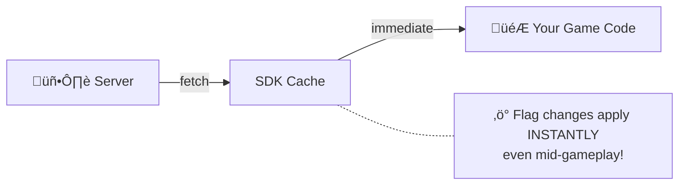
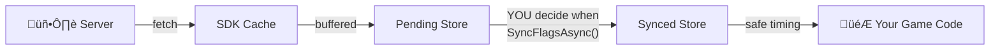
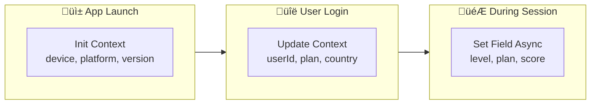

# Gatrix Unity SDK

> **Feature flags, A/B testing, and remote configuration — built for Unity game developers.**

The Gatrix Unity SDK lets you control your game's behavior in real-time without shipping a new build. Toggle features, run A/B experiments, tune game parameters, and roll out changes gradually — all from the Gatrix dashboard.

---

## ✨ Why Gatrix?

| Without Gatrix | With Gatrix |
|---|---|
| Ship a new build to change a value | Change it live from the dashboard |
| All players get the same experience | A/B test different experiences |
| Hard-coded feature flags | Real-time remote configuration |
| Risky big-bang releases | Gradual rollouts with instant rollback |

---

## 📦 Installation

### Unity Package Manager (UPM)

Add to your `Packages/manifest.json`:

```json
{
  "dependencies": {
    "com.gatrix.unity.sdk": "file:../../path/to/gatrix-unity-sdk"
  }
}
```

Or use **Window → Package Manager → Add package from disk...** and select `package.json`.

---

## 🚀 Quick Start

### Option A: Zero-Code Setup (Recommended)

1. In the Unity menu, go to **Window → Gatrix → Setup Wizard**
2. Enter your API URL, token, and app name
3. Click **Create SDK Manager** — done!

### Option B: Code Setup

```csharp
using Gatrix.Unity.SDK;
using UnityEngine;

public class GameManager : MonoBehaviour
{
    async void Start()
    {
        var config = new GatrixClientConfig
        {
            ApiUrl    = "https://your-api.example.com/api/v1",
            ApiToken  = "your-client-api-token",
            AppName   = "my-unity-game",
            Environment = "production",
            Context   = new GatrixContext { UserId = "player-123" }
        };

        await GatrixBehaviour.InitializeAsync(config);
        Debug.Log("Gatrix ready!");
    }
}
```

---

## 🎮 Reading Feature Flags

```csharp
var features = GatrixBehaviour.Client.Features;

// Boolean check
bool newUIEnabled = features.IsEnabled("new-ui");

// Typed values with safe defaults (never throws)
bool   showBanner  = features.BoolVariation("show-banner", false);
string theme       = features.StringVariation("app-theme", "dark");
int    maxRetries  = features.IntVariation("max-retries", 3);
float  gameSpeed   = features.FloatVariation("game-speed", 1.0f);
double dropRate    = features.NumberVariation("item-drop-rate", 0.05);

// Full variant info (name + value)
Variant variant = features.GetVariant("experiment-a");
Debug.Log($"Variant: {variant.Name}, Value: {variant.Value}");

// Evaluation details (includes reason for the decision)
var details = features.BoolVariationDetails("feature-x", false);
Debug.Log($"Value: {details.Value}, Reason: {details.Reason}");
```

---

## 👁️ Watching for Changes

Gatrix provides two families of watch methods for different use cases:

### Realtime Watching

**`WatchRealtimeFlag`** fires the callback **immediately** whenever a flag change is fetched from the server, regardless of `ExplicitSyncMode`. Use this for debug UIs, monitoring dashboards, or any case where you always want the latest server value.

```csharp
var features = GatrixBehaviour.Client.Features;

// Watch a flag — callback fires on every server-side change
var unsubscribe = features.WatchRealtimeFlag("game-speed", proxy =>
{
    Debug.Log($"Server changed game-speed to: {proxy.FloatVariation(1f)}");
});

// Stop watching
unsubscribe();

// Watch with initial state (callback fires immediately with current value, then on changes)
features.WatchRealtimeFlagWithInitialState("dark-mode", proxy =>
{
    ApplyTheme(proxy.Enabled ? "dark" : "light");
});
```

### Synced Watching

**`WatchSyncedFlag`** fires the callback only when the **synchronized** flag store is updated. When `ExplicitSyncMode` is enabled, synced watchers wait until you call `SyncFlagsAsync()` to deliver changes. When `ExplicitSyncMode` is disabled, synced watchers behave identically to realtime watchers.

```csharp
var features = GatrixBehaviour.Client.Features;

// Synced watch — in ExplicitSyncMode, callback fires only after SyncFlagsAsync()
features.WatchSyncedFlagWithInitialState("difficulty", proxy =>
{
    SetDifficulty(proxy.StringVariation("normal"));
});

// Apply changes at a safe point (e.g., between rounds)
await features.SyncFlagsAsync();
// ↑ At this point, synced watchers will fire with the latest values
```

### Realtime vs Synced — When to Use Which?

| | Realtime | Synced |
|---|---|---|
| **Callback timing** | Immediately on fetch | After `SyncFlagsAsync()` (in ExplicitSyncMode) |
| **Use case** | Debug UI, monitoring, non-disruptive changes | Gameplay-affecting values that need controlled timing |
| **ExplicitSyncMode off** | Fires on change | Fires on change (same as realtime) |
| **ExplicitSyncMode on** | Fires on change | Fires only after `SyncFlagsAsync()` |

### ⚠️ Why Synced Mode Matters (Real-World Scenarios)

Realtime mode is simple and convenient, but applying flag changes **instantly** can cause serious problems in production:

| Problem | Example | Impact |
|---------|---------|--------|
| **Mid-gameplay disruption** | Enemy HP multiplier changes in the middle of a boss fight | Player feels cheated; may suspect hacks or bugs |
| **Dependency conflicts** | UI layout flag updates before the data it depends on is loaded | Crash or visual corruption |
| **User trust** | Item drop rates change while player is farming | Player loses trust in game fairness |
| **Visual jarring** | Theme or UI layout shifts while player is reading | Frustrating, disorienting UX |
| **Competitive integrity** | Matchmaking params change during an active match | Unfair advantage/disadvantage |

> 💡 **Rule of thumb:** If a flag change could cause a player to notice "something just changed" in a disruptive way, use **Synced** mode and apply changes at a natural transition point (loading screens, between rounds, menu transitions).

### 📊 Flow Diagram: Realtime vs Synced

**Realtime Mode:**



**Synced Mode (ExplicitSyncMode):**



### `forceRealtime` Parameter

All flag accessor methods accept an optional `forceRealtime` parameter (default: `false`).

When `ExplicitSyncMode` is enabled:
- **`forceRealtime: false`** (default) — reads from the **synced** store (safe, controlled values)
- **`forceRealtime: true`** — reads from the **realtime** store (latest server values, bypassing sync)

```csharp
var features = GatrixBehaviour.Client.Features;

// Default: reads synced values (safe for gameplay)
bool isEnabled = features.IsEnabled("boss-buff");
float speed    = features.FloatVariation("game-speed", 1.0f);

// Force realtime: read the latest server value even if not yet synced
// Useful for debug UIs or monitoring alongside sync mode
bool latestValue = features.IsEnabled("boss-buff", forceRealtime: true);
float latestSpeed = features.FloatVariation("game-speed", 1.0f, forceRealtime: true);
```

> ⚠️ **When `ExplicitSyncMode` is disabled (default):**
> The `forceRealtime` parameter is **completely ignored**, and `WatchSyncedFlag` / `WatchRealtimeFlag` behave identically.
> There is no synced store — all reads and callbacks operate on a **single realtime store** at all times.
> `forceRealtime` is **only meaningful when `ExplicitSyncMode = true`**.

### Built-in Components and Sync Mode

All built-in zero-code components (`GatrixFlagToggle`, `GatrixFlagValue`, `GatrixFlagColor`, etc.) use **realtime** watching by default, so they react instantly to server changes.

If your project uses `ExplicitSyncMode`, consider the following:
- Components like `GatrixFlagToggle` on **non-gameplay UI** (settings panels, debug overlays) can stay realtime — they won't disrupt the player.
- For **gameplay-critical** components (difficulty modifiers, economy values), prefer using code-based `WatchSyncedFlag` so you control exactly when changes take effect.
- You can read the current synced value in code using the default accessor (without `forceRealtime`), and compare it with the realtime value to show a "pending update" indicator.

### FlagProxy — The Watch Callback Parameter

Every watch callback receives a **`FlagProxy`** — a lightweight wrapper bound to a specific flag name. It is the primary way to read flag values inside watch callbacks.

**Key characteristics:**
- `FlagProxy` does **not** hold a copy of the flag data — it always reads **live** from the client's cache at the moment you access it.
- It is bound to a single flag name at creation time, so you don't need to pass the flag name again.
- In `ExplicitSyncMode`, the proxy's `forceRealtime` mode is set automatically based on the watch type:
  - `WatchRealtimeFlag` → proxy reads from the **realtime** store
  - `WatchSyncedFlag` → proxy reads from the **synced** store

```csharp
features.WatchRealtimeFlagWithInitialState("difficulty", proxy =>
{
    // Properties
    bool exists    = proxy.Exists;          // Does the flag exist in cache?
    bool enabled   = proxy.Enabled;         // Is the flag enabled?
    string name    = proxy.Name;            // Flag name ("difficulty")
    bool isRT      = proxy.IsRealtime;      // true for realtime watchers

    // Typed value access (with safe fallback, never throws)
    string diff    = proxy.StringVariation("normal");
    bool   show    = proxy.BoolVariation(false);
    int    level   = proxy.IntVariation(1);
    float  speed   = proxy.FloatVariation(1.0f);
    double rate    = proxy.DoubleVariation(0.5);

    // Full variant info
    Variant v = proxy.Variant;
    Debug.Log($"Variant: {v.Name} = {v.Value}");

    // Evaluation details (includes reason)
    var details = proxy.BoolVariationDetails(false);
    Debug.Log($"Value: {details.Value}, Reason: {details.Reason}");

    // Metadata
    ValueType type = proxy.ValueType;
    int version    = proxy.Version;
    string reason  = proxy.Reason;
});
```

**FlagProxy API Summary:**

| Category | Member | Returns | Description |
|----------|--------|---------|-------------|
| **Properties** | `Name` | `string` | Flag name |
| | `Exists` | `bool` | Flag exists in cache |
| | `Enabled` | `bool` | Flag is enabled |
| | `Variant` | `Variant` | Full variant (name + value) |
| | `IsRealtime` | `bool` | Proxy reads from realtime store |
| | `ValueType` | `ValueType` | Value type (bool/string/number/json) |
| | `Version` | `int` | Flag evaluation version |
| | `Reason` | `string` | Evaluation reason |
| **Variations** | `BoolVariation(fallback)` | `bool` | Boolean value |
| | `StringVariation(fallback)` | `string` | String value |
| | `IntVariation(fallback)` | `int` | Integer value |
| | `FloatVariation(fallback)` | `float` | Float value |
| | `DoubleVariation(fallback)` | `double` | Double value |
| | `JsonVariation(fallback)` | `Dictionary` | JSON as Dictionary |
| **Details** | `BoolVariationDetails(fallback)` | `VariationResult<bool>` | Value + evaluation reason |
| | `StringVariationDetails(fallback)` | `VariationResult<string>` | Value + evaluation reason |
| **OrThrow** | `BoolVariationOrThrow()` | `bool` | Value or throws if missing |
| | `StringVariationOrThrow()` | `string` | Value or throws if missing |

### Watch Groups

Watch multiple flags as a group and unsubscribe them all at once:

```csharp
var features = GatrixBehaviour.Client.Features;

var group = features.CreateWatchGroup("ui-flags");
group.WatchRealtimeFlag("dark-mode",   p => { /* ... */ })
     .WatchRealtimeFlag("show-ads",    p => { /* ... */ })
     .WatchSyncedFlag("premium-ui",    p => { /* ... */ });

// Unwatch all at once
group.Destroy();
```

---

## 🧩 Zero-Code Components

Drop these `MonoBehaviour` components onto any GameObject — no scripting required.

### `GatrixFlagToggle`
**Enable or disable GameObjects based on a flag.**

Perfect for: feature gating entire game systems, showing/hiding UI panels, enabling debug tools.

```
Inspector:
  Flag Name: "new-shop-ui"
  When Enabled: [ShopV2Panel]
  When Disabled: [ShopV1Panel]
```

---

### `GatrixFlagValue`
**Bind a flag's string/number value to a UI Text or TextMeshPro component.**

Perfect for: displaying server-driven text, showing A/B test copy, live countdown timers.

```
Inspector:
  Flag Name: "welcome-message"
  Format: "{0}"          ← {0} is replaced with the flag value
  Fallback Text: "Welcome!"
```

---

### `GatrixFlagImage`
**Swap sprites based on a flag's variant name.**

Perfect for: seasonal event banners, A/B testing button art, character skin rollouts.

```
Inspector:
  Flag Name: "hero-skin"
  Default Sprite: [DefaultHero]
  Variant Maps:
    "winter" → [WinterHero]
    "summer" → [SummerHero]
```

---

### `GatrixFlagMaterial`
**Swap materials or set shader properties based on a flag.**

Perfect for: visual A/B tests, seasonal shader effects, quality tier switching.

```
Inspector:
  Flag Name: "visual-quality"
  Mode: SwapMaterial
  Variant Maps:
    "high"   → [HighQualityMat]
    "medium" → [MediumQualityMat]
```

---

### `GatrixFlagTransform`
**Adjust position, rotation, or scale via flag values.**

Perfect for: live-tuning UI layout, adjusting spawn positions, A/B testing element placement.

```
Inspector:
  Flag Name: "button-scale"
  Mode: Scale
  Component: Y
```

---

### `GatrixFlagColor`
**Tint UI Graphics or Renderers based on flag state or variant.**

Perfect for: A/B testing UI color themes, status indicators, seasonal color changes.

```
Inspector:
  Flag Name: "ui-theme"
  Mode: ByVariant
  Variant Colors:
    "red"  → Color(1, 0.2, 0.2)
    "blue" → Color(0.2, 0.5, 1)
  Animate: true  ← smooth color lerp
```

---

### `GatrixFlagCanvas`
**Fade entire UI panels in/out using CanvasGroup.**

More powerful than GatrixFlagToggle for UI — supports alpha fading and disabling raycasts without hiding.

```
Inspector:
  Flag Name: "premium-hud"
  Enabled Alpha: 1.0
  Disabled Alpha: 0.0
  Animate: true  ← smooth fade
```

---

### `GatrixFlagAudio`
**Play different AudioClips based on flag state or variant.**

Perfect for: A/B testing music/SFX, seasonal audio, enabling special sound effects.

```
Inspector:
  Flag Name: "background-music"
  Mode: ByVariant
  Variant Clips:
    "winter" → [WinterTheme]
    "summer" → [SummerTheme]
  Play On Change: true
```

---

### `GatrixFlagAnimator`
**Control Animator parameters based on flag state or variant.**

Perfect for: enabling special animations, A/B testing character animations, triggering cutscenes.

```
Inspector:
  Flag Name: "hero-animation"
  Bool Parameter: "IsSpecialMode"
  Enabled Trigger: "SpecialEnter"
  Disabled Trigger: "SpecialExit"
```

---

### `GatrixFlagParticles`
**Play, stop, or pause ParticleSystems based on a flag.**

Perfect for: seasonal particle effects, enabling special VFX, A/B testing visual feedback.

```
Inspector:
  Flag Name: "snow-effect"
  On Enabled: Play
  On Disabled: Stop
  With Children: true
```

---

### `GatrixFlagEvent`
**Fire UnityEvents when a flag changes.**

Perfect for: triggering custom game logic, integrating with existing event systems.

```
Inspector:
  Flag Name: "tutorial-mode"
  On Enabled: [TutorialManager.StartTutorial()]
  On Disabled: [TutorialManager.StopTutorial()]
```

---

### `GatrixEventListener`
**Hook into SDK lifecycle events visually.**

Perfect for: showing loading spinners while SDK initializes, handling errors gracefully.

```
Inspector:
  On Ready: [UIManager.HideLoadingScreen()]
  On Error: [UIManager.ShowErrorBanner()]
```

---

### `GatrixFlagLogger`
**Log flag changes to the Unity Console.**

Perfect for: debugging flag behavior during development.

---

### `GatrixVariantSwitch`
**Activate different child GameObjects based on variant name.**

Perfect for: multi-variant UI layouts, switching between game modes.

---

### `GatrixFlagSceneRedirect`
**Load a different scene based on a flag.**

Perfect for: A/B testing onboarding flows, seasonal event scenes, gradual rollouts of new areas.

---

## 🛠️ Editor Tools

### Monitor Window
**Window → Gatrix → Monitor**

A real-time dashboard for your SDK state:

| Tab | What you see |
|-----|-------------|
| **Overview** | SDK health, connection ID, fetch stats (count, errors, recoveries), streaming stats (events, errors, recoveries, transport type), and scene configuration |
| **Flags** | All flags with live ON/OFF state, variant, and value. Highlights recently changed flags in yellow. |
| **Events** | Live event log — every SDK event with timestamp and details |
| **Context** | Current evaluation context (userId, sessionId, custom properties) |
| **Metrics** | Dual-view metrics: **Graph** mode with real-time time-series charts, or **Report** mode with detailed tables. Per-flag timeline charts for boolean/variant state history. |
| **Stats** | Detailed counters, streaming counters, flag access counts, variant hit counts, missing flags, event handler leak detection |

#### Metrics Graph View
The **Metrics** tab includes interactive time-series graphs rendered directly in the Editor:
- **Network Activity** — fetches, updates, and errors plotted over time
- **Impressions & Delivery** — impression count and metrics sent over time
- **Streaming** — reconnection attempts, stream events, and stream errors
- Per-flag timeline charts showing boolean and variant state changes over time
- Configurable collection interval (1 second) and data retention (300 seconds)
- Auto-scaling Y axis, grid lines, time axis labels, and color-coded legends
- Time offset slider for scrolling through historical data
- Toggle between **Graph** and **Report** views with a single click

**Quick actions in the toolbar:**
- **⚡ Sync** — appears when explicit sync mode has pending changes
- **↻** — manual refresh
- **● Auto / ○ Auto** — toggle auto-refresh
- **Setup ↗** — open Setup Wizard
- **About** — SDK version info

---

### Setup Wizard
**Window → Gatrix → Setup Wizard**

Guided setup for first-time configuration. Creates a pre-configured SDK Manager prefab.

---

### Custom Inspectors
Every Gatrix component has a polished custom inspector:
- **◆ GATRIX** title bar with blue accent
- **● LIVE** badge during Play Mode
- **Live flag status** showing current ON/OFF state and variant
- **Monitor ↗** quick-access button to jump to the Monitor window
- Organized groups with clear labels

---

### Project Settings
**Edit → Project Settings → Gatrix SDK**

Global settings and shortcuts accessible from the Project Settings window.

---

## 🔄 Context Management

### What Is Context?

**Context** is the set of attributes that describes the **current user and their environment**. The Gatrix server uses context to decide which variant of each flag to return — it is the input to all targeting rules, percentage rollouts, and A/B experiments.

Without context, the server has no way to differentiate users and can only return the default flag value for everyone.

### Context Fields

| Field | Type | Description |
|-------|------|-------------|
| `AppName` | `string` | Application name (system field — set at init, cannot be changed) |
| `Environment` | `string` | Environment name (system field — set at init, cannot be changed) |
| `UserId` | `string` | Unique user identifier — **most important field for targeting** |
| `SessionId` | `string` | Session identifier for session-scoped experiments |
| `CurrentTime` | `string` | Time override for time-based targeting (system field) |
| `Properties` | `Dictionary` | Custom key-value pairs for any additional targeting attributes |

### When to Set Context

Context can be provided at **three different stages**, depending on what information is available:



**Stage 1: At Initialization (before login)**

Provide device-level context that's available immediately. The SDK will fetch flags using this context on its first request.

```csharp
var config = new GatrixClientConfig
{
    ApiUrl = "https://api.example.com/api/v1",
    ApiToken = "your-token",
    AppName = "my-game",
    Environment = "production",
    Context = new GatrixContext
    {
        // Available before login
        Properties = new Dictionary<string, object>
        {
            { "platform", "iOS" },
            { "appVersion", "2.1.0" },
            { "deviceType", "tablet" }
        }
    }
};
await GatrixBehaviour.InitializeAsync(config);
```

**Stage 2: After Login**

Once the user is authenticated, update context with user-specific information. This triggers a re-fetch with the new context.

```csharp
await features.UpdateContextAsync(new GatrixContext
{
    UserId    = "player-456",
    SessionId = "session-abc",
    Properties = new Dictionary<string, object>
    {
        { "plan",    "premium" },
        { "level",   42 },
        { "country", "KR" }
    }
});
```

**Stage 3: During Session**

Update individual fields as user state changes during gameplay.

```csharp
// Player levels up
await features.SetContextFieldAsync("level", 43);

// Player changes subscription
await features.SetContextFieldAsync("plan", "vip");

// Remove a property
await features.RemoveContextFieldAsync("trialUser");
```

### ⚠️ Side Effects of Context Changes

> **Every context change triggers an automatic re-fetch from the server.** This is essential because the server needs the updated context to re-evaluate targeting rules.

| Operation | What Happens |
|-----------|-------------|
| `UpdateContextAsync()` | Merges new context → hash check → re-fetch if changed |
| `SetContextFieldAsync()` | Updates single field → hash check → re-fetch if changed |
| `RemoveContextFieldAsync()` | Removes field → hash check → re-fetch if changed |

**Important implications:**
- **Network request**: Each context change that actually modifies a value makes an HTTP request to the server. Avoid updating context in tight loops.
- **Flag values may change**: After re-fetch, all flag values may differ based on the new targeting context. Watch callbacks will fire if values changed.
- **Hash-based deduplication**: If you set a field to the same value it already has, no network request is made — the SDK detects no change via hash comparison.
- **System fields are protected**: `AppName`, `Environment`, and `CurrentTime` cannot be modified after initialization. Attempts to change them will log a warning and be ignored.

### Best Practices

```csharp
// ✅ Good: Set context at natural transition points
async void OnLoginComplete(UserData user)
{
    await features.UpdateContextAsync(new GatrixContext
    {
        UserId = user.Id,
        Properties = new Dictionary<string, object>
        {
            { "plan", user.Plan },
            { "country", user.Country },
            { "level", user.Level }
        }
    });
}

// ✅ Good: Batch multiple changes with UpdateContextAsync
await features.UpdateContextAsync(new GatrixContext
{
    Properties = new Dictionary<string, object>
    {
        { "level", 43 },        // Changed
        { "score", 15000 },     // Changed
        { "region", "asia" }    // Changed
    }
});
// ↑ Single re-fetch for all changes

// ❌ Bad: Multiple SetContextFieldAsync calls cause multiple re-fetches
await features.SetContextFieldAsync("level", 43);    // re-fetch #1
await features.SetContextFieldAsync("score", 15000); // re-fetch #2
await features.SetContextFieldAsync("region", "asia"); // re-fetch #3
```

---

## ⏱️ Explicit Sync Mode

Control exactly when flag changes are applied to your game — **the single most important feature for live games**.

Without sync mode, flag changes from the server are applied instantly. This is fine for simple apps, but in games it can cause:
- 🎮 **Mid-combat stat changes** that feel like bugs or cheating
- 🔗 **Dependency issues** where flags change before dependent systems are ready
- 😤 **Jarring UX** where the UI shifts while the player is interacting with it

With Explicit Sync Mode, you gain **complete control** over when changes take effect — apply them at loading screens, between rounds, or during natural pause points.

```csharp
var config = new GatrixClientConfig
{
    Features = new FeaturesConfig { ExplicitSyncMode = true }
};

await GatrixBehaviour.InitializeAsync(config);

var features = GatrixBehaviour.Client.Features;

// Flags update in the background but don't affect gameplay yet.
// Use WatchSyncedFlag to react only when you apply changes:
features.WatchSyncedFlagWithInitialState("difficulty", proxy =>
{
    SetDifficulty(proxy.StringVariation("normal"));
});

// Apply changes at a safe moment (e.g., between rounds):
if (features.CanSyncFlags())
{
    await features.SyncFlagsAsync(fetchNow: false);
}
```

### Typical Sync Points

| When to Sync | Example |
|---|---|
| **Loading screen** | Scene transitions, level loading |
| **Between rounds** | After match end, before next round start |
| **Menu/pause screen** | When player opens settings or inventory |
| **Respawn** | After player death, before next spawn |
| **Lobby** | Before match starts, in character select |

The **Monitor → Flags** tab shows both the active flags and pending changes side-by-side when in explicit sync mode.

---

## 📡 Events

```csharp
var client = GatrixBehaviour.Client;

client.On(GatrixEvents.Ready,       args => Debug.Log("SDK Ready"));
client.On(GatrixEvents.Change,      args => Debug.Log("Flags Updated"));
client.On(GatrixEvents.Error,       args => Debug.LogError("SDK Error"));
client.On(GatrixEvents.FetchEnd,    args => Debug.Log("Fetch complete"));
client.On(GatrixEvents.Impression,  args => Debug.Log("Impression tracked"));

// Streaming events
client.On(GatrixEvents.FlagsStreamingConnected,    args => Debug.Log("Streaming connected"));
client.On(GatrixEvents.FlagsStreamingDisconnected, args => Debug.Log("Streaming disconnected"));
client.On(GatrixEvents.FlagsStreamingReconnecting, args => Debug.Log("Streaming reconnecting"));
client.On(GatrixEvents.FlagsStreamingError,        args => Debug.LogWarning("Streaming error"));

// Subscribe once
client.Once(GatrixEvents.Ready, args => ShowWelcomeScreen());

// Subscribe to all events (useful for debugging)
client.Events.OnAny((eventName, args) => Debug.Log($"[Gatrix] {eventName}"));
```

---

## 🔌 Operating Modes

The SDK supports three operating modes. Choose based on your connectivity requirements and update frequency needs.

### Mode Comparison

| | Streaming + Polling (Default) | Polling Only | Offline |
|---|---|---|---|
| **Network** | ✅ Required | ✅ Required | ❌ Not needed |
| **Real-time updates** | ✅ Sub-second via SSE/WebSocket | ❌ Interval-based only | ❌ None |
| **Polling** | ✅ As fallback | ✅ Primary | ❌ Disabled |
| **Bandwidth** | Medium (persistent connection) | Low (periodic requests) | Zero |
| **Best for** | Live games, real-time experiments | Low-frequency changes, constrained environments | Testing, airplane mode, CI |

### Flow Diagram

```mermaid
flowchart LR
    subgraph M1 ["⚡ Streaming + Polling (Default)"]
        direction LR
        A1["🖥️ Server"] -->|stream| B1["SDK"]
        A1 -->|poll| B1
    end

    subgraph M2 ["🔄 Polling Only"]
        direction LR
        A2["🖥️ Server"] -->|poll| B2["SDK"]
    end

    subgraph M3 ["📴 Offline"]
        direction LR
        A3["Bootstrap/Cache"] --> B3["SDK"]
    end
```



### Mode 1: Streaming + Polling (Default)

The default mode. The SDK connects a persistent stream (SSE or WebSocket) for near-instant flag updates, while also polling at `RefreshInterval` as a fallback safety net.

```csharp
var config = new GatrixClientConfig
{
    ApiUrl = "https://api.example.com/api/v1",
    ApiToken = "your-token",
    Features = new FeaturesConfig
    {
        RefreshInterval = 30,   // Fallback polling every 30s (default)
        Streaming = new StreamingConfig
        {
            Enabled = true,     // Default: true
            Transport = StreamingTransport.Sse  // SSE (default) or WebSocket
        }
    }
};
```

**When to use:**
- Production live games where flag changes should take effect within seconds
- A/B testing with real-time experiment switching
- Any scenario where low latency matters

### Mode 2: Polling Only

Disable streaming and rely purely on periodic HTTP polling. Simpler but higher latency.

```csharp
var config = new GatrixClientConfig
{
    Features = new FeaturesConfig
    {
        RefreshInterval = 60,   // Poll every 60 seconds
        Streaming = new StreamingConfig { Enabled = false }
    }
};
```

**When to use:**
- Flags rarely change (daily/weekly deployments)
- Environments with restrictive firewalls or proxy servers that don't support streaming
- Reducing bandwidth on metered connections

### Mode 3: Offline

No network requests at all. The SDK uses bootstrap data or a previously cached flag set from storage.

```csharp
var config = new GatrixClientConfig
{
    OfflineMode = true,
    Features = new FeaturesConfig
    {
        Bootstrap = cachedFlagData  // Pre-loaded flag data
    }
};
```

**When to use:**
- Unit testing and CI environments
- Development without a running backend
- Airplane mode or guaranteed offline scenarios
- Providing instant flag availability before the first network request completes

### Storage & Persistence

The SDK supports persistent storage for caching flags across sessions, ensuring fast startup even when the network is slow:

```csharp
// File-based persistence (recommended for production)
config.StorageProvider = new FileStorageProvider("gatrix");
```

> With storage enabled, the SDK loads cached flags on startup for instant availability, then asynchronously fetches fresh data from the server. This ensures the player never sees a "loading flags" state.

---

## ⚡ Performance & Threading

The SDK is designed for Unity's single-threaded model:

- **Synchronous flag reads** — `IsEnabled()`, `BoolVariation()` etc. read from an in-memory cache. Zero async overhead.
- **Main thread callbacks** — All event callbacks and flag change notifications fire on the main thread.
- **ValueTask** — Async methods use `ValueTask`/`ValueTask<T>` for zero heap allocation on synchronous code paths.
- **Thread-safe metrics** — Metrics bucket uses locking; events are dispatched via `SynchronizationContext`.
- **MainThreadDispatcher** — Background task results are automatically marshaled to the main thread.

---

## 📡 Streaming Transport

The SDK supports two real-time streaming transports for receiving flag updates:

| Transport | Platforms | Details |
|-----------|-----------|-------------|
| **SSE** (Server-Sent Events) | All platforms | Default. One-way HTTP streaming. |
| **WebSocket** | All platforms including WebGL | Full-duplex, lower latency. Auto-ping to keep connection alive. |

```csharp
var config = new GatrixClientConfig
{
    // ...
    Features = new FeaturesConfig
    {
        Streaming = new StreamingConfig
        {
            Transport = StreamingTransport.WebSocket  // default: SSE
        }
    }
};
```

### WebGL Support

The SDK fully supports Unity **WebGL** builds:

- WebSocket transport automatically uses a **JavaScript interop layer** (`GatrixWebSocket.jslib`) on WebGL since `System.Net.WebSockets.ClientWebSocket` is unavailable in the browser sandbox.
- The SDK selects the correct WebSocket implementation via `GatrixWebSocketFactory` — no manual configuration needed.
- Supported platforms: **Windows, macOS, Linux, Android, iOS, and WebGL**.

### Cross-Platform WebSocket Abstraction

| Class | Platform | Implementation |
|-------|----------|----------------|
| `StandaloneWebSocket` | Desktop, Android, iOS | Wraps `System.Net.WebSockets.ClientWebSocket` with event-based polling |
| `WebGLWebSocket` | WebGL | JavaScript interop via `GatrixWebSocket.jslib` using browser's native WebSocket API |
| `GatrixWebSocketFactory` | All | Auto-selects the correct implementation at runtime |

---

## 🧹 Cleanup

```csharp
// Handled automatically by GatrixBehaviour on application quit
GatrixBehaviour.Shutdown();

// Or manual disposal
GatrixBehaviour.Client.Dispose();
```

---

## 📖 API Reference

### FeaturesClient (via `GatrixBehaviour.Client.Features`)

| Method | Returns | Description |
|--------|---------|-------------|
| `IsEnabled(flagName)` | `bool` | Check if flag is enabled |
| `HasFlag(flagName)` | `bool` | Check if flag exists in cache |
| `GetVariant(flagName)` | `Variant` | Get variant (never null) |
| `BoolVariation(flag, default)` | `bool` | Get boolean value |
| `StringVariation(flag, default)` | `string` | Get string value |
| `IntVariation(flag, default)` | `int` | Get integer value |
| `FloatVariation(flag, default)` | `float` | Get float value |
| `NumberVariation(flag, default)` | `double` | Get double value |
| `JsonVariation(flag, default)` | `Dictionary` | Get JSON as Dictionary |
| `BoolVariationDetails(flag, default)` | `VariationResult<bool>` | Bool value with evaluation reason |
| `StringVariationDetails(flag, default)` | `VariationResult<string>` | String value with evaluation reason |
| `UpdateContextAsync(ctx)` | `UniTask` | Update evaluation context |
| `SetContextFieldAsync(key, value)` | `UniTask` | Update a single context field |
| `RemoveContextFieldAsync(key)` | `UniTask` | Remove a context field |
| `WatchRealtimeFlag(flag, callback)` | `Action` | Watch for real-time flag changes |
| `WatchRealtimeFlagWithInitialState(flag, cb)` | `Action` | Watch real-time + fire immediately |
| `WatchSyncedFlag(flag, callback)` | `Action` | Watch for synced flag changes |
| `WatchSyncedFlagWithInitialState(flag, cb)` | `Action` | Watch synced + fire immediately |
| `CreateWatchGroup(name)` | `WatchFlagGroup` | Create a named group of watchers |
| `SyncFlagsAsync()` | `UniTask` | Apply pending flag changes |
| `CanSyncFlags()` | `bool` | Check if there are pending sync changes |
| `SetExplicitSyncMode(enabled)` | `void` | Toggle explicit sync mode at runtime |
| `GetStats()` | `FeaturesStats` | Get SDK statistics |

### GatrixClient (via `GatrixBehaviour.Client`)

| Method | Returns | Description |
|--------|---------|-------------|
| `StartAsync()` | `UniTask` | Initialize and start the SDK |
| `Stop()` | `void` | Stop polling and metrics |
| `On(event, callback)` | `GatrixClient` | Subscribe to an SDK event |
| `Once(event, callback)` | `GatrixClient` | Subscribe once |
| `Off(event, callback?)` | `GatrixClient` | Unsubscribe |
| `OnAny(callback)` | `GatrixClient` | Subscribe to all events |
| `OffAny(callback)` | `GatrixClient` | Unsubscribe from all events |
| `GetStats()` | `GatrixSdkStats` | Get combined SDK statistics |
| `Dispose()` | `void` | Clean up resources |

### GatrixEventEmitter (via `GatrixBehaviour.Client.Events`)

| Method/Property | Description |
|----------------|-------------|
| `On(event, callback)` | Subscribe to event |
| `Once(event, callback)` | Subscribe once |
| `Off(event, callback?)` | Unsubscribe |
| `OnAny(callback)` | Subscribe to all events |
| `OffAny(callback)` | Unsubscribe from all events |
| `Emit(event, args)` | Emit an event |
| `ListenerCount(event)` | Handler count for one event |
| `TotalListenerCount` | Total handlers across all events |
| `RemoveAllListeners()` | Remove all listeners |

---

## 🎯 Common Recipes

### Game Speed Tuning
```csharp
var features = GatrixBehaviour.Client.Features;
features.WatchRealtimeFlagWithInitialState("game-speed", proxy =>
{
    Time.timeScale = proxy.FloatVariation(1f);
});
```

### Seasonal Event
```csharp
// Use GatrixFlagToggle component on your seasonal content root
// Or in code:
var features = GatrixBehaviour.Client.Features;
features.WatchRealtimeFlagWithInitialState("winter-event", proxy =>
{
    winterEventRoot.SetActive(proxy.Enabled);
});
```

### A/B Test UI Copy
```csharp
// Use GatrixFlagValue component on your Text/TMP component
// Or in code:
var features = GatrixBehaviour.Client.Features;
features.WatchRealtimeFlagWithInitialState("cta-button-text", proxy =>
{
    ctaButton.text = proxy.StringVariation("Play Now");
});
```

### Gradual Feature Rollout
```csharp
// Check flag before showing new feature
var features = GatrixBehaviour.Client.Features;
if (features.IsEnabled("new-inventory-system"))
{
    newInventory.SetActive(true);
    legacyInventory.SetActive(false);
}
```

### Controlled Gameplay Updates (Explicit Sync)
```csharp
// Use synced watchers for gameplay-affecting values
var features = GatrixBehaviour.Client.Features;
features.WatchSyncedFlagWithInitialState("enemy-hp-multiplier", proxy =>
{
    enemyHpMultiplier = proxy.FloatVariation(1.0f);
});

// Apply at a safe point (e.g., between rounds)
if (features.CanSyncFlags())
{
    await features.SyncFlagsAsync();
}
```

### Login Flow with Context Update
```csharp
// 1. Initialize with device-level context (before login)
var config = new GatrixClientConfig
{
    Context = new GatrixContext
    {
        Properties = new Dictionary<string, object>
        {
            { "platform", Application.platform.ToString() },
            { "appVersion", Application.version }
        }
    }
};
await GatrixBehaviour.InitializeAsync(config);

// 2. After login, update with user context (triggers re-fetch)
await features.UpdateContextAsync(new GatrixContext
{
    UserId = loginResult.UserId,
    Properties = new Dictionary<string, object>
    {
        { "plan", loginResult.Plan },
        { "level", loginResult.Level }
    }
});
```

### Scene-Safe Sync on Loading Screen
```csharp
async void OnLoadingScreenStart()
{
    var features = GatrixBehaviour.Client.Features;
    
    // Sync pending changes during natural pause
    if (features.CanSyncFlags())
    {
        await features.SyncFlagsAsync(fetchNow: true);
    }
    
    // Now load the next scene with consistent flag values
    await SceneManager.LoadSceneAsync("GameScene");
}
```

### Pending Update Indicator
```csharp
// Compare synced vs realtime values to show "update pending" badge
var features = GatrixBehaviour.Client.Features;

bool syncedValue  = features.IsEnabled("new-shop");
bool realtimeValue = features.IsEnabled("new-shop", forceRealtime: true);

if (syncedValue != realtimeValue)
{
    pendingUpdateBadge.SetActive(true); // "New update available"
}
```

### Offline Fallback with Bootstrap
```csharp
// Load flags from a local JSON file for instant availability
var bootstrapJson = Resources.Load<TextAsset>("default-flags");
var bootstrapFlags = JsonUtility.FromJson<List<EvaluatedFlag>>(bootstrapJson.text);

var config = new GatrixClientConfig
{
    Features = new FeaturesConfig
    {
        Bootstrap = bootstrapFlags,
        BootstrapOverride = false  // Don't override cached flags with bootstrap
    }
};
```

### Multi-Flag Dependency with Watch Group
```csharp
var features = GatrixBehaviour.Client.Features;
var group = features.CreateWatchGroup("shop-system");

bool shopEnabled = false;
float discountRate = 0f;

group.WatchSyncedFlag("new-shop-enabled", p => shopEnabled = p.Enabled)
     .WatchSyncedFlag("discount-rate",    p => discountRate = p.FloatVariation(0f));

// Both flags are applied together at sync time
// No partial state where shop is enabled but discount is stale
```

---

## ❓ FAQ & Troubleshooting

### 1. Flag changes are not detected in real time

**Symptom:** You changed a flag on the dashboard, but the game doesn't reflect the change.

**Possible causes & solutions:**

| Cause | Solution |
|-------|----------|
| Streaming is disabled | Check `Streaming.Enabled` in config (default: `true`) |
| Firewall / proxy blocks SSE | Try WebSocket transport: `Transport = StreamingTransport.WebSocket` |
| Polling interval too long | Reduce `RefreshInterval` (default: 30s) |
| `ExplicitSyncMode` is on | Flag is updated but buffered — call `SyncFlagsAsync()` to apply |
| Using `WatchSyncedFlag` | Synced watchers don't fire until `SyncFlagsAsync()` — use `WatchRealtimeFlag` instead |
| Offline mode is enabled | Set `OfflineMode = false` for live connections |

---

### 2. `WatchSyncedFlag` callback never fires

**Symptom:** You registered a `WatchSyncedFlag` callback but it never executes.

**Cause:** `ExplicitSyncMode` is disabled (default). Without it, there is no synced store, so synced watchers have nothing to trigger on initial value delivery.

**Solution:**
```csharp
// Enable ExplicitSyncMode
config.Features = new FeaturesConfig { ExplicitSyncMode = true };

// Use WithInitialState to get the first callback immediately
features.WatchSyncedFlagWithInitialState("my-flag", proxy => { /* ... */ });

// Call SyncFlagsAsync to trigger subsequent callbacks
await features.SyncFlagsAsync();
```

---

### 3. Confusion between `WatchRealtimeFlag` and `WatchSyncedFlag`

**Symptom:** Not sure which watch method to use.

**Quick decision guide:**


---

### 4. `forceRealtime` parameter does nothing

**Symptom:** Setting `forceRealtime: true` returns the same value as `false`.

**Cause:** `ExplicitSyncMode` is disabled. Without it, there is only one store (realtime), so `forceRealtime` has no effect.

**Solution:** Enable `ExplicitSyncMode` if you need separate synced/realtime stores:
```csharp
config.Features = new FeaturesConfig { ExplicitSyncMode = true };
```

---

### 5. Flag values change unexpectedly during gameplay

**Symptom:** Player reports stats/UI suddenly changing mid-match.

**Cause:** Using `WatchRealtimeFlag` for gameplay-critical values without `ExplicitSyncMode`.

**Solution:**
```csharp
// 1. Enable ExplicitSyncMode
config.Features = new FeaturesConfig { ExplicitSyncMode = true };

// 2. Use WatchSyncedFlag for gameplay values
features.WatchSyncedFlagWithInitialState("difficulty", proxy =>
{
    SetDifficulty(proxy.StringVariation("normal"));
});

// 3. Apply changes only at safe points
async void OnRoundEnd()
{
    if (features.CanSyncFlags())
        await features.SyncFlagsAsync();
}
```

---

### 6. Multiple re-fetches when updating context

**Symptom:** Setting several context fields causes multiple network requests and lag.

**Cause:** Each `SetContextFieldAsync` call triggers a separate re-fetch.

**Solution:** Batch changes with `UpdateContextAsync`:
```csharp
// ❌ Bad: 3 separate re-fetches
await features.SetContextFieldAsync("level", 43);
await features.SetContextFieldAsync("score", 15000);
await features.SetContextFieldAsync("region", "asia");

// ✅ Good: 1 re-fetch
await features.UpdateContextAsync(new GatrixContext
{
    Properties = new Dictionary<string, object>
    {
        { "level", 43 },
        { "score", 15000 },
        { "region", "asia" }
    }
});
```

---

### 7. Flags return fallback values after initialization

**Symptom:** `IsEnabled` returns `false` and variations return fallback values even though the flag is configured on the dashboard.

**Possible causes & solutions:**

| Cause | Solution |
|-------|----------|
| SDK not ready yet | Wait for `Ready` event or use `WatchRealtimeFlagWithInitialState` |
| Wrong `AppName` or `Environment` | Double-check config matches dashboard settings |
| Context `UserId` not set | Targeting rules may not match without a user ID |
| Network error on first fetch | Check logs for fetch errors; ensure API URL is correct |
| Flag not assigned to this environment | Verify flag is enabled for the target environment in the dashboard |

```csharp
// Wait for SDK to be ready before checking flags
client.Once(GatrixEvents.Ready, args =>
{
    bool enabled = features.IsEnabled("my-flag");
    Debug.Log($"Flag is {enabled}");
});
```

---

### 8. `SyncFlagsAsync` has no effect

**Symptom:** Calling `SyncFlagsAsync()` doesn't change any flag values.

**Possible causes:**
- `ExplicitSyncMode` is not enabled — sync is only meaningful with it on
- No pending changes — the synced store is already up to date
- `CanSyncFlags()` returns `false` — no new data to sync

```csharp
// Always check CanSyncFlags before syncing
if (features.CanSyncFlags())
{
    await features.SyncFlagsAsync();
    Debug.Log("Flags synced");
}
else
{
    Debug.Log("No pending changes");
}
```

---

### 9. Watch callback fires multiple times on startup

**Symptom:** `WithInitialState` callback fires once, then fires again immediately after the first fetch.

**Cause:** This is expected behavior. `WithInitialState` fires immediately with the current cached value, and then fires again when fresh data arrives from the server (if the value differs).

**Solution:** This is by design. If you only want the first value, use `WatchRealtimeFlag` (without `WithInitialState`) and handle the initial state manually.

---

### 10. System context fields cannot be modified

**Symptom:** `SetContextFieldAsync("appName", ...)` logs a warning and does nothing.

**Cause:** `AppName`, `Environment`, and `CurrentTime` are system fields that cannot be changed after initialization.

**Solution:** Set these values in `GatrixClientConfig` before calling `InitializeAsync`:
```csharp
var config = new GatrixClientConfig
{
    AppName = "my-game",
    Environment = "production"
};
```

---

### 11. Streaming disconnects frequently

**Symptom:** Streaming state cycles between Connected → Disconnected → Reconnecting.

**Solutions:**

| Approach | Configuration |
|----------|--------------|
| Increase reconnect tolerance | `Streaming.Sse.ReconnectMax = 60` |
| Switch to WebSocket | `Streaming.Transport = StreamingTransport.WebSocket` |
| Fall back to polling only | `Streaming.Enabled = false` with lower `RefreshInterval` |
| Check network stability | Ensure the device has a stable connection |

---

### 12. Memory leak from watch callbacks

**Symptom:** Watch callbacks keep an old scene or destroyed objects alive.

**Solution:** Always unwatch when a MonoBehaviour is destroyed:
```csharp
private IDisposable _watcher;

void Start()
{
    _watcher = features.WatchRealtimeFlagWithInitialState("my-flag", proxy =>
    {
        // ...
    });
}

void OnDestroy()
{
    _watcher?.Dispose(); // Clean up the watcher
}

// Or use watch groups for bulk cleanup
private WatchGroup _group;

void Start()
{
    _group = features.CreateWatchGroup("my-scene");
    _group.WatchRealtimeFlag("flag-a", p => { /* ... */ })
          .WatchRealtimeFlag("flag-b", p => { /* ... */ });
}

void OnDestroy()
{
    _group?.Destroy(); // Unwatch all at once
}
```

---

## 🔗 Links

- [Gatrix Dashboard](https://app.gatrix.io)
- [Documentation](https://docs.gatrix.io)
- [한국어 문서 (README.ko.md)](./README.ko.md)
- [Known Issues & Gotchas](./ISSUES.md)
- [Support](mailto:support@gatrix.io)
