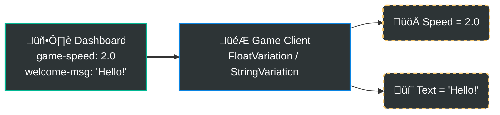
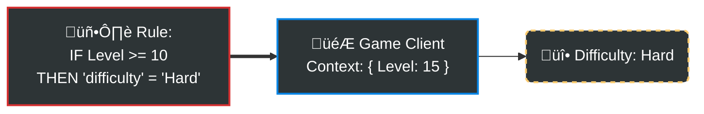
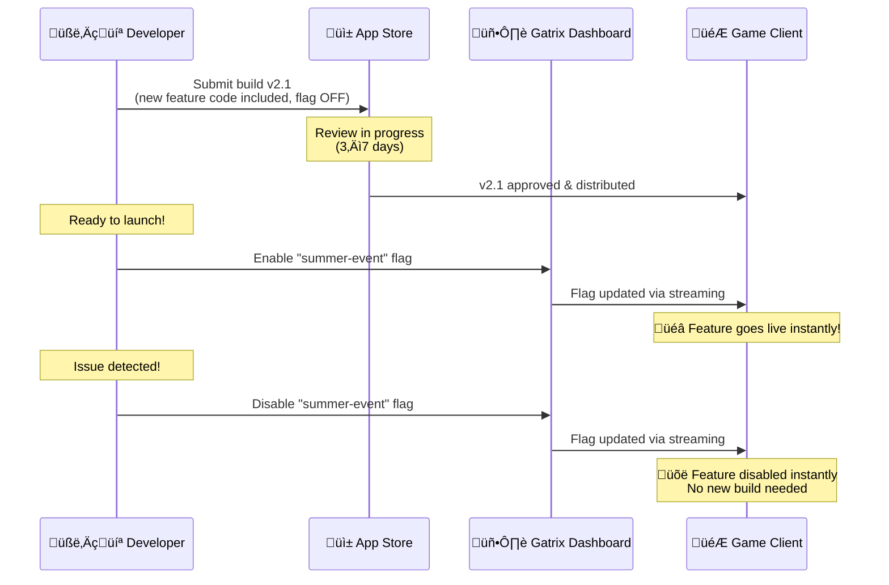
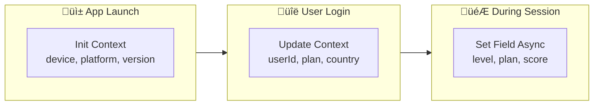
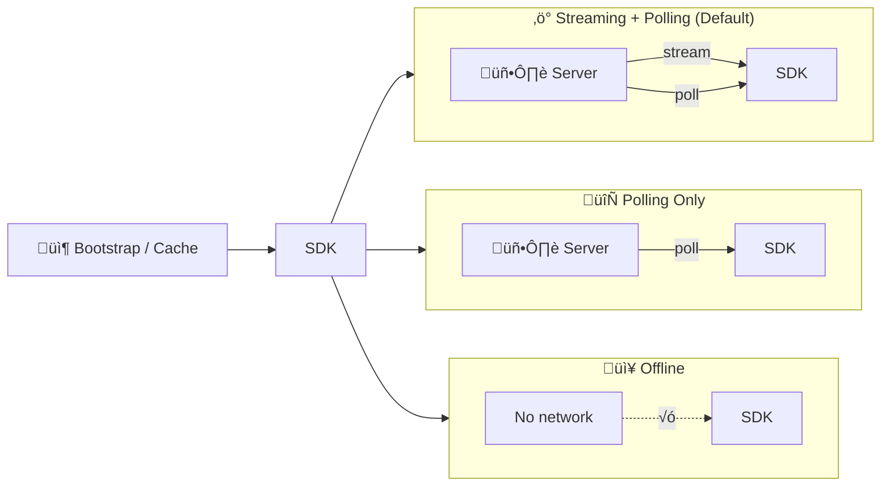

# Gatrix Unity SDK

> **Feature flags, A/B testing, and remote configuration — official Gatrix SDK for Unity.**

The Gatrix Unity SDK lets you control your game's behavior in real-time without shipping a new build. Toggle features, run A/B experiments, tune game parameters, and roll out changes gradually — all from the Gatrix dashboard.

### 🏷️ What is a Feature Flag?

A feature flag has two parts:

| Part | Type | Description |
|---|---|---|
| **State** (`enabled`) | `bool` | Is the feature on or off? — checked with `IsEnabled()` |
| **Value** (`variant`) | `boolean` `string` `number` `json` | The evaluated configuration value — read with `BoolVariation()`, `StringVariation()`, `FloatVariation()`, `JsonVariation()` |

A flag can be **on** but still carry a value (e.g., `difficulty = "hard"`). State and value are independent — always handle both.


### ⚡ Quick Examples

#### 1. Feature Toggle (`IsEnabled`)
Turn a feature on or off instantly without code deployment.


```csharp
if (GatrixBehaviour.Client.Features.IsEnabled("new-shop"))
{
    // Feature is ON -> Show the new shop UI
    ShowNewShop();
}
else
{
    // Feature is OFF (or flag missing) -> Fall back to the legacy shop
    ShowLegacyShop();
}
```

#### 2. Remote Configuration (`Variation`)
Tune gameplay values or text remotely. Supports string, number, and JSON.



```csharp
// Get a float value (defaulting to 1.0f if not set)
float speed = GatrixBehaviour.Client.Features.FloatVariation("game-speed", 1.0f);

// Get a string value
string message = GatrixBehaviour.Client.Features.StringVariation("welcome-msg", "Welcome");
```

#### 3. Conditional Targeting
Target specific users based on rules (e.g., country, level, app version).



```csharp
// The dashboard rule decides the value based on the user's context (e.g., Level 15)
// You just read the value — logic stays on the server!
string difficulty = GatrixBehaviour.Client.Features.StringVariation("difficulty", "Normal");
```

**More complex targeting scenarios — all evaluated server-side:**

```csharp
var features = GatrixBehaviour.Client.Features;

// ── Example 1: VIP tier branching ─────────────────────────────────────
// Dashboard rules:
//   vipTier == "gold"    → "boss-drop-rate" = 2.0
//   vipTier == "silver"  → "boss-drop-rate" = 1.5
//   (everyone else)      → "boss-drop-rate" = 1.0  (flag default)
float dropRate = features.FloatVariation("boss-drop-rate", 1.0f);
// dropRate is automatically correct for this user's VIP tier

// ── Example 2: Region-specific event rollout ──────────────────────────
// Dashboard rules:
//   country == "KR" AND appVersion >= "2.5.0" → "summer-event" enabled
//   country == "JP"                            → "summer-event" enabled (different rollout)
//   (everyone else)                            → "summer-event" disabled
if (features.IsEnabled("summer-event"))
{
    ShowSummerEventBanner();
}
else
{
    ShowDefaultLobby();  // No event for this region/version
}

// ── Example 3: JSON variant for a full config table ───────────────────
// Dashboard returns different JSON per segment:
//   "whales" segment  → { "shopDiscount": 0, "gemBonus": 50, "exclusiveItems": true }
//   "new users"       → { "shopDiscount": 30, "gemBonus": 0,  "exclusiveItems": false }
//   (default)         → { "shopDiscount": 10, "gemBonus": 0,  "exclusiveItems": false }
var defaultConfig = new Dictionary<string, object>
{
    ["shopDiscount"]   = 10,
    ["gemBonus"]       = 0,
    ["exclusiveItems"] = false
};
var shopConfig = features.JsonVariation("shop-config", defaultConfig);

int discount       = Convert.ToInt32(shopConfig["shopDiscount"]);
int gemBonus       = Convert.ToInt32(shopConfig["gemBonus"]);
bool hasExclusive  = Convert.ToBoolean(shopConfig["exclusiveItems"]);
ApplyShopConfig(discount, gemBonus, hasExclusive);

// ── Example 4: Percentage rollout with new feature ────────────────────
// Dashboard: "new-inventory-ui" enabled for 20% of users (random, sticky)
// SDK handles the assignment consistently — same user always gets same result
if (features.IsEnabled("new-inventory-ui"))
{
    ShowNewInventoryUI();   // Part of 20% rollout group
}
else
{
    ShowLegacyInventoryUI();  // The other 80%
}
```

Gatrix allows you to define these rules based on user segments, custom attributes (like `vipTier`), and percentage rollouts:


> No build, no deploy — change these values from the [Gatrix Dashboard](https://your-dashboard.example.com) and they go live instantly.

Here's what the actual Gatrix Dashboard looks like — manage all your feature flags, toggle environments, and monitor status at a glance:


---

## ✨ Why Gatrix?

| Without Gatrix | With Gatrix |
|---|---|
| Ship a new build to change a value | Change it live from the dashboard |
| All players get the same experience | A/B test different experiences |
| Hard-coded feature flags | Real-time remote configuration |
| Risky big-bang releases | Gradual rollouts with instant rollback |

### 🎯 Real-World Scenarios

#### 📱 Mobile App Store Review

Mobile game updates go through an app store review process that can take **days or even weeks**. With feature flags, you can submit your build with new features **already coded but disabled**, then enable them instantly from the dashboard once the review is approved — or whenever you're ready.



> 💡 **Without Gatrix:** You'd either have to time your submission perfectly, or submit *another* update and wait for another review cycle just to enable or disable a feature.

#### ⚖️ Regulatory & Legal Compliance (GDPR, etc.)

Laws and regulations — like GDPR, COPPA, or region-specific gambling laws — can require you to **immediately disable** certain features for specific regions or user segments. Feature flags let you:

- **Disable a feature in specific countries** without an app update
- **Respond to a regulatory order within minutes**, not days
- **Target by user context** (region, age group, etc.) to comply with local laws

```
Example: A new gambling regulation takes effect in Germany tomorrow.
  → Set targeting rule: country = "DE" → disable "loot-box-feature"
  → All German players see the change immediately.
  → No app update, no review, no downtime.
```

#### 🤷 Uncertain Launch Timing

Sometimes you don't know *when* — or even *if* — a feature should go live:

- **Partnership deal** pending final approval → code is ready, flag stays off until the deal closes
- **Seasonal event** that might be canceled or postponed → enable only if confirmed
- **Government policy** that may or may not take effect → prepare both paths, toggle based on the outcome
- **Competitive response** — quickly enable a counter-feature when a competitor launches

> With feature flags, your code is **always ready**. The business decision of *when to launch* is completely decoupled from the engineering timeline.

#### � A/B Testing & Data-Driven Decisions
Stop guessing what players want. Use feature flags to show different variants to different groups and measure the impact:

- **Difficulty Tuning**: Group A gets "Normal", Group B gets "Hard". Which group plays longer?
- **Monetization**: Test two different shop layouts. Which one drives more revenue?
- **User Feedback**: Release a feature to 5% of users first. If community feedback is negative, disable it immediately and iterate.

> Instead of arguing about which design is better, **let the data decide.**

#### �🚨 Emergency Kill Switch

When something goes wrong in production — a crash-causing feature, an exploit, or unexpected server load — you need to act *fast*:

- **Disable the problematic feature** in seconds, not hours
- **No hotfix build required** — just toggle the flag
- **Gradual re-enable** — roll out to 1% → 10% → 50% → 100% after the fix is verified

#### 🛡️ SafeGuard (Automated Circuit Breaker)
You're not always awake to monitor a release. **Gatrix SafeGuard** collects its own **Impact Metrics** (crash counts, error rates, custom KPIs) directly within the platform — no external tools required:

- **Auto-Disable**: If a metric crosses the defined threshold after a release, SafeGuard **automatically disables** the flag — before the problem spreads.
- **Release Flow Pause**: SafeGuard can also **pause a Release Flow milestone**, stopping the gradual rollout until you review and resume manually.
- **Sleep Soundly**: No need to stare at dashboards — SafeGuard watches the rollout for you.


### 🤔 When you might NOT need Gatrix

Gatrix isn't the right fit for every project. Consider whether these apply to you:

- **Single-player offline games** with no post-launch updates — if you ship once and never patch, remote configuration adds unnecessary complexity.
- **Very small or prototype projects** — if your team is 1–2 people and the game's scope is small, hard-coded values may be simpler to manage.
- **Strict latency budgets** — the SDK adds a network fetch at startup. If your game cannot tolerate any additional startup delay (even a few hundred milliseconds), evaluate carefully.
- **No server infrastructure** — Gatrix requires a running backend. If your project has no server component at all and you want to stay fully serverless, this may not be the right tool.
- **Regulatory restrictions** — some environments restrict outbound network requests from the game client. Verify that your deployment context allows SDK communication.

---

## 🏗️ Evaluation Model: Remote Evaluation Only

Gatrix uses **remote evaluation** exclusively — targeting rules and rollout logic never leave the server.

1. SDK sends **context** (userId, env, properties) to the server
2. Server evaluates all rules and returns **final flag values only**
3. SDK caches results and serves them synchronously

| | Remote (Gatrix) | Local Evaluation |
|---|---|---|
| **Security** | ✅ Rules never leave server | ⚠️ Rules exposed to client |
| **Consistency** | ✅ Same result on all SDKs | ⚠️ SDK must re-implement rules |
| **Payload** | ✅ Small (final values only) | ⚠️ Large (full rule set) |
| **First-run offline** | ⚠️ Needs at least one prior fetch or bootstrap data | ✅ Rules can be bundled at build time |

> 🌐 **Offline & Availability:** The SDK always serves from local cache if the server is unreachable. Fallback values ensure the game never crashes due to connectivity issues.

> 📖 Full details — value resolution flow, reserved variant names (`$missing`, `$env-default-enabled`, …), and `fallbackValue` rationale:  
> **[→ Evaluation Model 자세히 보기](docs/EVALUATION_MODEL.md)**
---


---

## �📦 Installation

### Unity Package Manager (UPM)

Add to your `Packages/manifest.json`:

```json
{
  "dependencies": {
    "com.gatrix.unity.sdk": "file:../../path/to/gatrix-unity-sdk"
  }
}
```

Or use **Window → Package Manager → Add package from disk...** and select `package.json`.

---

## 🚀 Quick Start

### Option A: Zero-Code Setup (Recommended)

1. In the Unity menu, go to **Window → Gatrix → Setup Wizard**
2. Enter your API URL, token, and app name
3. Click **Create SDK Manager** — done!


Once setup is complete, the **GatrixBehaviour** component is automatically added to your scene:


### Option B: Code Setup

```csharp
using Gatrix.Unity.SDK;
using UnityEngine;

public class GameManager : MonoBehaviour
{
    async void Start()
    {
        var config = new GatrixClientConfig
        {
            ApiUrl    = "https://your-api.example.com/api/v1",
            ApiToken  = "your-client-api-token",
            AppName   = "my-unity-game",
            Environment = "production",
            Context   = new GatrixContext { UserId = "player-123" }
        };

        await GatrixBehaviour.InitializeAsync(config);
        Debug.Log("Gatrix ready!");
    }
}
```

---

## 🎮 Reading Feature Flags

```csharp
var features = GatrixBehaviour.Client.Features;

// Boolean check
bool newUIEnabled = features.IsEnabled("new-ui");

// Typed values with safe defaults (never throws)
bool   showBanner  = features.BoolVariation("show-banner", false);
string theme       = features.StringVariation("app-theme", "dark");
int    maxRetries  = features.IntVariation("max-retries", 3);
float  gameSpeed   = features.FloatVariation("game-speed", 1.0f);
double dropRate    = features.NumberVariation("item-drop-rate", 0.05);

// Full variant info (name + value)
Variant variant = features.GetVariant("experiment-a");
Debug.Log($"Variant: {variant.Name}, Value: {variant.Value}");

// Evaluation details (includes reason for the decision)
var details = features.BoolVariationDetails("feature-x", false);
Debug.Log($"Value: {details.Value}, Reason: {details.Reason}");
```

---

## 👁️ Watching for Changes

Gatrix provides two families of watch methods:

| Method family | When callback fires |
|---|---|
| `WatchRealtimeFlag` | Immediately on every server fetch |
| `WatchSyncedFlag` | Only after `SyncFlagsAsync()` (when `ExplicitSyncMode = true`) |

```csharp
var features = GatrixBehaviour.Client.Features;

// Realtime — fires on every change (good for debug UI, non-gameplay props)
features.WatchRealtimeFlagWithInitialState("dark-mode", proxy =>
{
    ApplyTheme(proxy.Enabled ? "dark" : "light");
});

// Synced — fires only when YOU call SyncFlagsAsync (safe for gameplay)
features.WatchSyncedFlagWithInitialState("difficulty", proxy =>
{
    SetDifficulty(proxy.StringVariation("normal"));
});

// Apply at a safe moment (loading screen, between rounds)
await features.SyncFlagsAsync();
```

> 📖 Full Watch API reference — `FlagProxy` properties, `FlagProxy` API table, Watch Groups, `forceRealtime`, and real-world sync scenarios:  
> **[→ Watch API 자세히 보기](docs/WATCH_API.md)**
---

## 🧩 Zero-Code Components

Drop these `MonoBehaviour` components onto any GameObject — no scripting required.

Add via: **Right-click → Gatrix → UI / Logic / Debug / Visual / Audio / Rendering / AI / Environment...**


**Available component categories:**

| Category | Components |
|---|---|
| **Logic** | [`GatrixFlagToggle`](docs/COMPONENTS.md#gatrixflagtoggle), [`GatrixFlagEvent`](docs/COMPONENTS.md#gatrixflagevent), [`GatrixEventListener`](docs/COMPONENTS.md#gatrixeventlistener), [`GatrixVariantSwitch`](docs/COMPONENTS.md#gatrixvariantswitch), [`GatrixFlagSceneRedirect`](docs/COMPONENTS.md#gatrixflagsceneredirect), [`GatrixFlagBehaviourEnabled`](docs/COMPONENTS.md#gatrixflagbehaviourenabled) |
| **UI** | [`GatrixFlagValue`](docs/COMPONENTS.md#gatrixflagvalue), [`GatrixFlagImage`](docs/COMPONENTS.md#gatrixflagimage), [`GatrixFlagColor`](docs/COMPONENTS.md#gatrixflagcolor), [`GatrixFlagCanvas`](docs/COMPONENTS.md#gatrixflagcanvas), [`GatrixFlagSlider`](docs/COMPONENTS.md#gatrixflagslider), [`GatrixFlagButtonInteractable`](docs/COMPONENTS.md#gatrixflagbuttoninteractable), [`GatrixFlagInputField`](docs/COMPONENTS.md#gatrixflaginputfield), [`GatrixFlagScrollRect`](docs/COMPONENTS.md#gatrixflagscrollrect) |
| **Rendering** | [`GatrixFlagMaterial`](docs/COMPONENTS.md#gatrixflagmaterial), [`GatrixFlagTransform`](docs/COMPONENTS.md#gatrixflagtransform), [`GatrixFlagSpriteRenderer`](docs/COMPONENTS.md#gatrixflagspriterenderer), [`GatrixFlagRendererToggle`](docs/COMPONENTS.md#gatrixflagrenderertoggle), [`GatrixFlagParticles`](docs/COMPONENTS.md#gatrixflagparticles), [`GatrixFlagQualitySettings`](docs/COMPONENTS.md#gatrixflagqualitysettings), [`GatrixFlagShaderProperty`](docs/COMPONENTS.md#gatrixflagshaderproperty), [`GatrixFlagTrailRenderer`](docs/COMPONENTS.md#gatrixflagtrailrenderer), [`GatrixFlagLineRenderer`](docs/COMPONENTS.md#gatrixflaglinerenderer), [`GatrixFlagGlobalShader`](docs/COMPONENTS.md#gatrixflagglobalshader) |
| **Audio** | [`GatrixFlagAudio`](docs/COMPONENTS.md#gatrixflagaudio), [`GatrixFlagAnimator`](docs/COMPONENTS.md#gatrixflaganimator), [`GatrixFlagAudioMixer`](docs/COMPONENTS.md#gatrixflagaudiomixer), [`GatrixFlagAudioSource`](docs/COMPONENTS.md#gatrixflagaudiosource) |
| **Camera** | [`GatrixFlagCamera`](docs/COMPONENTS.md#gatrixflagcamera) |
| **Lighting** | [`GatrixFlagLight`](docs/COMPONENTS.md#gatrixflaglight) |
| **Environment** | [`GatrixFlagFog`](docs/COMPONENTS.md#gatrixflagfog), [`GatrixFlagAmbientLight`](docs/COMPONENTS.md#gatrixflagambientlight), [`GatrixFlagSkybox`](docs/COMPONENTS.md#gatrixflagskybox), [`GatrixFlagWindZone`](docs/COMPONENTS.md#gatrixflagwindzone) |
| **Physics** | [`GatrixFlagRigidbody`](docs/COMPONENTS.md#gatrixflagrigidbody), [`GatrixFlagGravity`](docs/COMPONENTS.md#gatrixflaggravity), [`GatrixFlagCollider`](docs/COMPONENTS.md#gatrixflagcollider) |
| **2D** | [`GatrixFlagRigidbody2D`](docs/COMPONENTS.md#gatrixflagrigidbody2d), [`GatrixFlagSortingOrder`](docs/COMPONENTS.md#gatrixflagsortingorder), [`GatrixFlagTilemap`](docs/COMPONENTS.md#gatrixflagtilemap), [`GatrixFlagPhysicsMaterial2D`](docs/COMPONENTS.md#gatrixflagphysicsmaterial2d), [`GatrixFlagJoint2D`](docs/COMPONENTS.md#gatrixflagjoint2d), [`GatrixFlagEffector2D`](docs/COMPONENTS.md#gatrixflageffector2d) |
| **AI** | [`GatrixFlagNavMeshAgent`](docs/COMPONENTS.md#gatrixflagnavmeshagent), [`GatrixFlagNavMeshObstacle`](docs/COMPONENTS.md#gatrixflagnavmeshobstacle), [`GatrixFlagAIAnimator`](docs/COMPONENTS.md#gatrixflagaianimator), [`GatrixFlagDetectionRange`](docs/COMPONENTS.md#gatrixflagdetectionrange) |
| **Time** | [`GatrixFlagTimeScale`](docs/COMPONENTS.md#gatrixflagtimescale), [`GatrixFlagFrameRate`](docs/COMPONENTS.md#gatrixflagframerate) |
| **Post FX** | [`GatrixFlagPostProcessVolume`](docs/COMPONENTS.md#gatrixflagpostprocessvolume) |
| **Debug** | [`GatrixFlagLogger`](docs/COMPONENTS.md#gatrixflaglogger) |

> 📖 Detailed component reference — flag value types, all modes, use cases & A/B test scenarios:  
> **[→ Component Reference 자세히 보기](docs/COMPONENTS.md)**
---

## 🛠️ Editor Tools

### Monitor Window
**Window → Gatrix → Monitor**

A real-time dashboard for your SDK state:

| Tab | What you see |
|-----|-------------|
| **Overview** | SDK health, connection ID, fetch stats (count, errors, recoveries), streaming stats (events, errors, recoveries, transport type), and scene configuration |
| **Flags** | All flags with live ON/OFF state, variant, and value. Highlights recently changed flags in yellow. |
| **Events** | Live event log — every SDK event with timestamp and details |
| **Context** | Current evaluation context (userId, sessionId, custom properties) |
| **Metrics** | Dual-view metrics: **Graph** mode with real-time time-series charts, or **Report** mode with detailed tables. Per-flag timeline charts for boolean/variant state history. |
| **Stats** | Detailed counters, streaming counters, flag access counts, variant hit counts, missing flags, event handler leak detection |

#### Overview Tab


#### Flags Tab


#### Events Tab


#### Context Tab


#### Metrics Tab
The **Metrics** tab includes interactive time-series graphs rendered directly in the Editor:
- **Network Activity** — fetches, updates, and errors plotted over time
- **Impressions & Delivery** — impression count and metrics sent over time
- **Streaming** — reconnection attempts, stream events, and stream errors
- Per-flag timeline charts showing boolean and variant state changes over time
- Configurable collection interval (1 second) and data retention (300 seconds)
- Auto-scaling Y axis, grid lines, time axis labels, and color-coded legends
- Time offset slider for scrolling through historical data
- Toggle between **Graph** and **Report** views with a single click


#### Stats Tab


**Quick actions in the toolbar:**
- **⚡ Sync** — appears when explicit sync mode has pending changes
- **↻** — manual refresh
- **● Auto / ○ Auto** — toggle auto-refresh
- **Setup ↗** — open Setup Wizard
- **About** — SDK version info

---

### Setup Wizard
**Window → Gatrix → Setup Wizard**

Guided setup for first-time configuration. Creates a pre-configured SDK Manager prefab.


---

### About Window
**Window → Gatrix → About**

View SDK version, Unity version, platform information, and runtime connection status.


---

### Custom Inspectors
Every Gatrix component has a polished custom inspector:
- **◆ GATRIX** title bar with blue accent
- **● LIVE** badge during Play Mode
- **Live flag status** showing current ON/OFF state and variant
- **Monitor ↗** quick-access button to jump to the Monitor window
- Organized groups with clear labels


---

### Project Settings
**Edit → Project Settings → Gatrix SDK**

Global settings and shortcuts accessible from the Project Settings window.

---

## 🔄 Context Management

### What Is Context?

**Context** is the set of attributes that describes the **current user and their environment**. The Gatrix server uses context to decide which variant of each flag to return — it is the input to all targeting rules, percentage rollouts, and A/B experiments.

Without context, the server has no way to differentiate users and can only return the default flag value for everyone.

### Context Fields

| Field | Type | Description |
|-------|------|-------------|
| `AppName` | `string` | Application name (system field — set at init, cannot be changed) |
| `Environment` | `string` | Environment name (system field — set at init, cannot be changed) |
| `UserId` | `string` | Unique user identifier — **most important field for targeting** |
| `SessionId` | `string` | Session identifier for session-scoped experiments |
| `CurrentTime` | `string` | Time override for time-based targeting (system field) |
| `Properties` | `Dictionary` | Custom key-value pairs for any additional targeting attributes |

### When to Set Context

Context can be provided at **three different stages**, depending on what information is available:



**Stage 1: At Initialization (before login)**

Provide device-level context that's available immediately. The SDK will fetch flags using this context on its first request.

```csharp
var config = new GatrixClientConfig
{
    ApiUrl = "https://api.example.com/api/v1",
    ApiToken = "your-token",
    AppName = "my-game",
    Environment = "production",
    Context = new GatrixContext
    {
        // Available before login
        Properties = new Dictionary<string, object>
        {
            { "platform", "iOS" },
            { "appVersion", "2.1.0" },
            { "deviceType", "tablet" }
        }
    }
};
await GatrixBehaviour.InitializeAsync(config);
```

**Stage 2: After Login**

Once the user is authenticated, update context with user-specific information. This triggers a re-fetch with the new context.

```csharp
await features.UpdateContextAsync(new GatrixContext
{
    UserId    = "player-456",
    SessionId = "session-abc",
    Properties = new Dictionary<string, object>
    {
        { "plan",    "premium" },
        { "level",   42 },
        { "country", "KR" }
    }
});
```

**Stage 3: During Session**

Update individual fields as user state changes during gameplay.

```csharp
// Player levels up
await features.SetContextFieldAsync("level", 43);

// Player changes subscription
await features.SetContextFieldAsync("plan", "vip");

// Remove a property
await features.RemoveContextFieldAsync("trialUser");
```

### ⚠️ Side Effects of Context Changes

> **Every context change triggers an automatic re-fetch from the server.** This is essential because the server needs the updated context to re-evaluate targeting rules.

| Operation | What Happens |
|-----------|-------------|
| `UpdateContextAsync()` | Merges new context → hash check → re-fetch if changed |
| `SetContextFieldAsync()` | Updates single field → hash check → re-fetch if changed |
| `RemoveContextFieldAsync()` | Removes field → hash check → re-fetch if changed |

**Important implications:**
- **Network request**: Each context change that actually modifies a value makes an HTTP request to the server. Avoid updating context in tight loops.
- **Flag values may change**: After re-fetch, all flag values may differ based on the new targeting context. Watch callbacks will fire if values changed.
- **Hash-based deduplication**: If you set a field to the same value it already has, no network request is made — the SDK detects no change via hash comparison.
- **System fields are protected**: `AppName`, `Environment`, and `CurrentTime` cannot be modified after initialization. Attempts to change them will log a warning and be ignored.

### Best Practices

```csharp
// ✅ Good: Set context at natural transition points
async void OnLoginComplete(UserData user)
{
    await features.UpdateContextAsync(new GatrixContext
    {
        UserId = user.Id,
        Properties = new Dictionary<string, object>
        {
            { "plan", user.Plan },
            { "country", user.Country },
            { "level", user.Level }
        }
    });
}

// ✅ Good: Batch multiple changes with UpdateContextAsync
await features.UpdateContextAsync(new GatrixContext
{
    Properties = new Dictionary<string, object>
    {
        { "level", 43 },        // Changed
        { "score", 15000 },     // Changed
        { "region", "asia" }    // Changed
    }
});
// ↑ Single re-fetch for all changes

// ❌ Bad: Multiple SetContextFieldAsync calls cause multiple re-fetches
await features.SetContextFieldAsync("level", 43);    // re-fetch #1
await features.SetContextFieldAsync("score", 15000); // re-fetch #2
await features.SetContextFieldAsync("region", "asia"); // re-fetch #3
```

---

## ⏱️ Explicit Sync Mode

Control exactly when flag changes are applied to your game — **the single most important feature for live games**.

Without sync mode, flag changes from the server are applied instantly. This is fine for simple apps, but in games it can cause:
- 🎮 **Mid-combat stat changes** that feel like bugs or cheating
- 🔗 **Dependency issues** where flags change before dependent systems are ready
- 😤 **Jarring UX** where the UI shifts while the player is interacting with it

With Explicit Sync Mode, you gain **complete control** over when changes take effect — apply them at loading screens, between rounds, or during natural pause points.

```csharp
var config = new GatrixClientConfig
{
    Features = new FeaturesConfig { ExplicitSyncMode = true }
};

await GatrixBehaviour.InitializeAsync(config);

var features = GatrixBehaviour.Client.Features;

// Flags update in the background but don't affect gameplay yet.
// Use WatchSyncedFlag to react only when you apply changes:
features.WatchSyncedFlagWithInitialState("difficulty", proxy =>
{
    SetDifficulty(proxy.StringVariation("normal"));
});

// Apply changes at a safe moment (e.g., between rounds):
if (features.HasPendingSyncFlags())
{
    await features.SyncFlagsAsync(fetchNow: false);
}
```

### Typical Sync Points

| When to Sync | Example |
|---|---|
| **Loading screen** | Scene transitions, level loading |
| **Between rounds** | After match end, before next round start |
| **Menu/pause screen** | When player opens settings or inventory |
| **Respawn** | After player death, before next spawn |
| **Lobby** | Before match starts, in character select |

The **Monitor → Flags** tab shows both the active flags and pending changes side-by-side when in explicit sync mode.

---

## 📡 Events

```csharp
var client = GatrixBehaviour.Client;

client.On(GatrixEvents.Ready,       args => Debug.Log("SDK Ready"));
client.On(GatrixEvents.Change,      args => Debug.Log("Flags Updated"));
client.On(GatrixEvents.Error,       args => Debug.LogError("SDK Error"));
client.On(GatrixEvents.FetchEnd,    args => Debug.Log("Fetch complete"));
client.On(GatrixEvents.Impression,  args => Debug.Log("Impression tracked"));

// Streaming events
client.On(GatrixEvents.FlagsStreamingConnected,    args => Debug.Log("Streaming connected"));
client.On(GatrixEvents.FlagsStreamingDisconnected, args => Debug.Log("Streaming disconnected"));
client.On(GatrixEvents.FlagsStreamingReconnecting, args => Debug.Log("Streaming reconnecting"));
client.On(GatrixEvents.FlagsStreamingError,        args => Debug.LogWarning("Streaming error"));

// Subscribe once
client.Once(GatrixEvents.Ready, args => ShowWelcomeScreen());

// Subscribe to all events (useful for debugging)
client.Events.OnAny((eventName, args) => Debug.Log($"[Gatrix] {eventName}"));
```

---

## 🔌 Operating Modes

The SDK supports three operating modes. By default, Gatrix uses a **Streaming + Polling hybrid** — streaming delivers flag changes in real time, while polling acts as a safety fallback. Polling uses **ETag-based HTTP caching**, so polls that find no changes consume near-zero bandwidth.

> 📖 Deep dive — polling intervals, ETag behaviour, streaming transports, hybrid failure scenarios, and configuration reference:  
> **[→ Polling / Streaming / Hybrid 자세히 보기](docs/OPERATING_MODES.md)**


### Mode Comparison

| | Streaming + Polling (Default) | Polling Only | Offline |
|---|---|---|---|
| **Network** | ✅ Required | ✅ Required | ❌ Not needed |
| **Real-time updates** | ✅ Sub-second via SSE/WebSocket | ❌ Interval-based only | ❌ None |
| **Polling** | ✅ As fallback | ✅ Primary | ❌ Disabled |
| **Bandwidth** | Medium (persistent connection) | Low (periodic requests) | Zero |
| **Best for** | Live games, real-time experiments | Low-frequency changes, constrained environments | Testing, airplane mode, CI |

### Flow Diagram



> 📦 **Bootstrap / Cache is always the first step.** Regardless of the operating mode, the SDK loads bootstrap data and cached flags on startup for instant availability before any network request.

### Mode 1: Streaming + Polling (Default)

The default mode. The SDK connects a persistent stream (SSE or WebSocket) for near-instant flag updates, while also polling at `RefreshInterval` as a fallback safety net.

```csharp
var config = new GatrixClientConfig
{
    ApiUrl = "https://api.example.com/api/v1",
    ApiToken = "your-token",
    Features = new FeaturesConfig
    {
        RefreshInterval = 30,   // Fallback polling every 30s (default)
        Streaming = new StreamingConfig
        {
            Enabled = true,     // Default: true
            Transport = StreamingTransport.Sse  // SSE (default) or WebSocket
        }
    }
};
```

**When to use:**
- Production live games where flag changes should take effect within seconds
- A/B testing with real-time experiment switching
- Any scenario where low latency matters

### Mode 2: Polling Only

Disable streaming and rely purely on periodic HTTP polling. Simpler but higher latency.

```csharp
var config = new GatrixClientConfig
{
    Features = new FeaturesConfig
    {
        RefreshInterval = 60,   // Poll every 60 seconds
        Streaming = new StreamingConfig { Enabled = false }
    }
};
```

**When to use:**
- Flags rarely change (daily/weekly deployments)
- Environments with restrictive firewalls or proxy servers that don't support streaming
- Reducing bandwidth on metered connections

### Mode 3: Offline

No network requests at all. The SDK uses bootstrap data or a previously cached flag set from storage.

```csharp
var config = new GatrixClientConfig
{
    OfflineMode = true,
    Features = new FeaturesConfig
    {
        Bootstrap = cachedFlagData  // Pre-loaded flag data
    }
};
```

**When to use:**
- Unit testing and CI environments
- Development without a running backend
- Airplane mode or guaranteed offline scenarios
- Providing instant flag availability before the first network request completes

### Storage & Persistence

The SDK supports persistent storage for caching flags across sessions, ensuring fast startup even when the network is slow:

```csharp
// File-based persistence (recommended for production)
config.StorageProvider = new FileStorageProvider("gatrix");
```

> With storage enabled, the SDK loads cached flags on startup for instant availability, then asynchronously fetches fresh data from the server. This ensures the player never sees a "loading flags" state.

---

## ⚡ Performance & Threading

The SDK is designed for Unity's single-threaded model:

- **Synchronous flag reads** — `IsEnabled()`, `BoolVariation()` etc. read from an in-memory cache. Zero async overhead.
- **Main thread callbacks** — All event callbacks and flag change notifications fire on the main thread.
- **UniTask** — Async methods use `UniTask`/`UniTask<T>` for zero allocation and Unity integration.
- **Thread-safe metrics** — Metrics bucket uses locking; events are dispatched via `SynchronizationContext`.
- **MainThreadDispatcher** — Background task results are automatically marshaled to the main thread.

---

## 📡 Streaming Transport

The SDK supports two real-time streaming transports for receiving flag updates:

| Transport | Platforms | Details |
|-----------|-----------|-------------|
| **SSE** (Server-Sent Events) | All platforms | Default. One-way HTTP streaming. |
| **WebSocket** | All platforms including WebGL | Full-duplex, lower latency. Auto-ping to keep connection alive. |

```csharp
var config = new GatrixClientConfig
{
    // ...
    Features = new FeaturesConfig
    {
        Streaming = new StreamingConfig
        {
            Transport = StreamingTransport.WebSocket  // default: SSE
        }
    }
};
```

### WebGL Support

The SDK fully supports Unity **WebGL** builds:

- WebSocket transport automatically uses a **JavaScript interop layer** (`GatrixWebSocket.jslib`) on WebGL since `System.Net.WebSockets.ClientWebSocket` is unavailable in the browser sandbox.
- The SDK selects the correct WebSocket implementation via `GatrixWebSocketFactory` — no manual configuration needed.
- Supported platforms: **Windows, macOS, Linux, Android, iOS, and WebGL**.

### Cross-Platform WebSocket Abstraction

| Class | Platform | Implementation |
|-------|----------|----------------|
| `StandaloneWebSocket` | Desktop, Android, iOS | Wraps `System.Net.WebSockets.ClientWebSocket` with event-based polling |
| `WebGLWebSocket` | WebGL | JavaScript interop via `GatrixWebSocket.jslib` using browser's native WebSocket API |
| `GatrixWebSocketFactory` | All | Auto-selects the correct implementation at runtime |

---

## 🧹 Cleanup

```csharp
// Handled automatically by GatrixBehaviour on application quit
GatrixBehaviour.Shutdown();

// Or manual disposal
GatrixBehaviour.Client.Dispose();
```

---

## 📖 API Reference

### FeaturesClient (via `GatrixBehaviour.Client.Features`)

| Method | Returns | Description |
|--------|---------|-------------|
| `IsEnabled(flagName)` | `bool` | Check if flag is enabled |
| `HasFlag(flagName)` | `bool` | Check if flag exists in cache |
| `GetVariant(flagName)` | `Variant` | Get variant (never null) |
| `BoolVariation(flag, default)` | `bool` | Get boolean value |
| `StringVariation(flag, default)` | `string` | Get string value |
| `IntVariation(flag, default)` | `int` | Get integer value |
| `FloatVariation(flag, default)` | `float` | Get float value |
| `NumberVariation(flag, default)` | `double` | Get double value |
| `JsonVariation(flag, default)` | `Dictionary` | Get JSON as Dictionary |
| `BoolVariationDetails(flag, default)` | `VariationResult<bool>` | Bool value with evaluation reason |
| `StringVariationDetails(flag, default)` | `VariationResult<string>` | String value with evaluation reason |
| `UpdateContextAsync(ctx)` | `UniTask` | Update evaluation context |
| `SetContextFieldAsync(key, value)` | `UniTask` | Update a single context field |
| `RemoveContextFieldAsync(key)` | `UniTask` | Remove a context field |
| `WatchRealtimeFlag(flag, callback)` | `Action` | Watch for real-time flag changes |
| `WatchRealtimeFlagWithInitialState(flag, cb)` | `Action` | Watch real-time + fire immediately |
| `WatchSyncedFlag(flag, callback)` | `Action` | Watch for synced flag changes |
| `WatchSyncedFlagWithInitialState(flag, cb)` | `Action` | Watch synced + fire immediately |
| `CreateWatchGroup(name)` | `WatchFlagGroup` | Create a named group of watchers |
| `SyncFlagsAsync()` | `UniTask` | Apply pending flag changes |
| `HasPendingSyncFlags()` | `bool` | Check if there are pending sync changes |
| `SetExplicitSyncMode(enabled)` | `void` | Toggle explicit sync mode at runtime |
| `GetStats()` | `FeaturesStats` | Get SDK statistics |

### GatrixClient (via `GatrixBehaviour.Client`)

| Method | Returns | Description |
|--------|---------|-------------|
| `StartAsync()` | `UniTask` | Initialize and start the SDK |
| `Stop()` | `void` | Stop polling and metrics |
| `On(event, callback)` | `GatrixClient` | Subscribe to an SDK event |
| `Once(event, callback)` | `GatrixClient` | Subscribe once |
| `Off(event, callback?)` | `GatrixClient` | Unsubscribe |
| `OnAny(callback)` | `GatrixClient` | Subscribe to all events |
| `OffAny(callback)` | `GatrixClient` | Unsubscribe from all events |
| `GetStats()` | `GatrixSdkStats` | Get combined SDK statistics |
| `Dispose()` | `void` | Clean up resources |

### GatrixEventEmitter (via `GatrixBehaviour.Client.Events`)

| Method/Property | Description |
|----------------|-------------|
| `On(event, callback)` | Subscribe to event |
| `Once(event, callback)` | Subscribe once |
| `Off(event, callback?)` | Unsubscribe |
| `OnAny(callback)` | Subscribe to all events |
| `OffAny(callback)` | Unsubscribe from all events |
| `Emit(event, args)` | Emit an event |
| `ListenerCount(event)` | Handler count for one event |
| `TotalListenerCount` | Total handlers across all events |
| `RemoveAllListeners()` | Remove all listeners |

---

## 🎯 Common Recipes

### Game Speed Tuning
```csharp
var features = GatrixBehaviour.Client.Features;
features.WatchRealtimeFlagWithInitialState("game-speed", proxy =>
{
    Time.timeScale = proxy.FloatVariation(1f);
});
```

### Seasonal Event
```csharp
// Use GatrixFlagToggle component on your seasonal content root
// Or in code:
var features = GatrixBehaviour.Client.Features;
features.WatchRealtimeFlagWithInitialState("winter-event", proxy =>
{
    winterEventRoot.SetActive(proxy.Enabled);
});
```

### A/B Test UI Copy
```csharp
// Use GatrixFlagValue component on your Text/TMP component
// Or in code:
var features = GatrixBehaviour.Client.Features;
features.WatchRealtimeFlagWithInitialState("cta-button-text", proxy =>
{
    ctaButton.text = proxy.StringVariation("Play Now");
});
```

### Gradual Feature Rollout
```csharp
// Check flag before showing new feature
var features = GatrixBehaviour.Client.Features;
if (features.IsEnabled("new-inventory-system"))
{
    newInventory.SetActive(true);
    legacyInventory.SetActive(false);
}
```

### Controlled Gameplay Updates (Explicit Sync)
```csharp
// Use synced watchers for gameplay-affecting values
var features = GatrixBehaviour.Client.Features;
features.WatchSyncedFlagWithInitialState("enemy-hp-multiplier", proxy =>
{
    enemyHpMultiplier = proxy.FloatVariation(1.0f);
});

// Apply at a safe point (e.g., between rounds)
if (features.HasPendingSyncFlags())
{
    await features.SyncFlagsAsync();
}
```

### Login Flow with Context Update
```csharp
// 1. Initialize with device-level context (before login)
var config = new GatrixClientConfig
{
    Context = new GatrixContext
    {
        Properties = new Dictionary<string, object>
        {
            { "platform", Application.platform.ToString() },
            { "appVersion", Application.version }
        }
    }
};
await GatrixBehaviour.InitializeAsync(config);

// 2. After login, update with user context (triggers re-fetch)
await features.UpdateContextAsync(new GatrixContext
{
    UserId = loginResult.UserId,
    Properties = new Dictionary<string, object>
    {
        { "plan", loginResult.Plan },
        { "level", loginResult.Level }
    }
});
```

### Scene-Safe Sync on Loading Screen
```csharp
async void OnLoadingScreenStart()
{
    var features = GatrixBehaviour.Client.Features;
    
    // Sync pending changes during natural pause
    if (features.HasPendingSyncFlags())
    {
        await features.SyncFlagsAsync(fetchNow: true);
    }
    
    // Now load the next scene with consistent flag values
    await SceneManager.LoadSceneAsync("GameScene");
}
```

### Pending Update Indicator
```csharp
// Compare synced vs realtime values to show "update pending" badge
var features = GatrixBehaviour.Client.Features;

bool syncedValue  = features.IsEnabled("new-shop");
bool realtimeValue = features.IsEnabled("new-shop", forceRealtime: true);

if (syncedValue != realtimeValue)
{
    pendingUpdateBadge.SetActive(true); // "New update available"
}
```

### Offline Fallback with Bootstrap
```csharp
// Load flags from a local JSON file for instant availability
var bootstrapJson = Resources.Load<TextAsset>("default-flags");
var bootstrapFlags = JsonUtility.FromJson<List<EvaluatedFlag>>(bootstrapJson.text);

var config = new GatrixClientConfig
{
    Features = new FeaturesConfig
    {
        Bootstrap = bootstrapFlags,
        BootstrapOverride = false  // Don't override cached flags with bootstrap
    }
};
```

### Multi-Flag Dependency with Watch Group
```csharp
var features = GatrixBehaviour.Client.Features;
var group = features.CreateWatchGroup("shop-system");

bool shopEnabled = false;
float discountRate = 0f;

group.WatchSyncedFlag("new-shop-enabled", p => shopEnabled = p.Enabled)
     .WatchSyncedFlag("discount-rate",    p => discountRate = p.FloatVariation(0f));

// Both flags are applied together at sync time
// No partial state where shop is enabled but discount is stale
```

---

## ❓ FAQ & Troubleshooting

### 1. Flag changes are not detected in real time

**Symptom:** You changed a flag on the dashboard, but the game doesn't reflect the change.

**Possible causes & solutions:**

| Cause | Solution |
|-------|----------|
| Streaming is disabled | Check `Streaming.Enabled` in config (default: `true`) |
| Firewall / proxy blocks SSE | Try WebSocket transport: `Transport = StreamingTransport.WebSocket` |
| Polling interval too long | Reduce `RefreshInterval` (default: 30s) |
| `ExplicitSyncMode` is on | Flag is updated but buffered — call `SyncFlagsAsync()` to apply |
| Using `WatchSyncedFlag` | Synced watchers don't fire until `SyncFlagsAsync()` — use `WatchRealtimeFlag` instead |
| Offline mode is enabled | Set `OfflineMode = false` for live connections |

---

### 2. `WatchSyncedFlag` callback never fires

**Symptom:** You registered a `WatchSyncedFlag` callback but it never executes.

**Cause:** `ExplicitSyncMode` is disabled (default). Without it, there is no synced store, so synced watchers have nothing to trigger on initial value delivery.

**Solution:**
```csharp
// Enable ExplicitSyncMode
config.Features = new FeaturesConfig { ExplicitSyncMode = true };

// Use WithInitialState to get the first callback immediately
features.WatchSyncedFlagWithInitialState("my-flag", proxy => { /* ... */ });

// Call SyncFlagsAsync to trigger subsequent callbacks
await features.SyncFlagsAsync();
```

---

### 3. Confusion between `WatchRealtimeFlag` and `WatchSyncedFlag`

**Symptom:** Not sure which watch method to use.

**Quick decision guide:**


---

### 4. `forceRealtime` parameter does nothing

**Symptom:** Setting `forceRealtime: true` returns the same value as `false`.

**Cause:** `ExplicitSyncMode` is disabled. Without it, there is only one store (realtime), so `forceRealtime` has no effect.

**Solution:** Enable `ExplicitSyncMode` if you need separate synced/realtime stores:
```csharp
config.Features = new FeaturesConfig { ExplicitSyncMode = true };
```

---

### 5. Flag values change unexpectedly during gameplay

**Symptom:** Player reports stats/UI suddenly changing mid-match.

**Cause:** Using `WatchRealtimeFlag` for gameplay-critical values without `ExplicitSyncMode`.

**Solution:**
```csharp
// 1. Enable ExplicitSyncMode
config.Features = new FeaturesConfig { ExplicitSyncMode = true };

// 2. Use WatchSyncedFlag for gameplay values
features.WatchSyncedFlagWithInitialState("difficulty", proxy =>
{
    SetDifficulty(proxy.StringVariation("normal"));
});

// 3. Apply changes only at safe points
async void OnRoundEnd()
{
    if (features.HasPendingSyncFlags())
        await features.SyncFlagsAsync();
}
```

---

### 6. Multiple re-fetches when updating context

**Symptom:** Setting several context fields causes multiple network requests and lag.

**Cause:** Each `SetContextFieldAsync` call triggers a separate re-fetch.

**Solution:** Batch changes with `UpdateContextAsync`:
```csharp
// ❌ Bad: 3 separate re-fetches
await features.SetContextFieldAsync("level", 43);
await features.SetContextFieldAsync("score", 15000);
await features.SetContextFieldAsync("region", "asia");

// ✅ Good: 1 re-fetch
await features.UpdateContextAsync(new GatrixContext
{
    Properties = new Dictionary<string, object>
    {
        { "level", 43 },
        { "score", 15000 },
        { "region", "asia" }
    }
});
```

---

### 7. Flags return fallback values after initialization

**Symptom:** `IsEnabled` returns `false` and variations return fallback values even though the flag is configured on the dashboard.

**Possible causes & solutions:**

| Cause | Solution |
|-------|----------|
| SDK not ready yet | Wait for `Ready` event or use `WatchRealtimeFlagWithInitialState` |
| Wrong `AppName` or `Environment` | Double-check config matches dashboard settings |
| Context `UserId` not set | Targeting rules may not match without a user ID |
| Network error on first fetch | Check logs for fetch errors; ensure API URL is correct |
| Flag not assigned to this environment | Verify flag is enabled for the target environment in the dashboard |

```csharp
// Wait for SDK to be ready before checking flags
client.Once(GatrixEvents.Ready, args =>
{
    bool enabled = features.IsEnabled("my-flag");
    Debug.Log($"Flag is {enabled}");
});
```

---

### 8. `SyncFlagsAsync` has no effect

**Symptom:** Calling `SyncFlagsAsync()` doesn't change any flag values.

**Possible causes:**
- `ExplicitSyncMode` is not enabled — sync is only meaningful with it on
- No pending changes — the synced store is already up to date
- `HasPendingSyncFlags()` returns `false` — no new data to sync

```csharp
// Optional: Check if there are pending changes
if (features.HasPendingSyncFlags())
{
    await features.SyncFlagsAsync();
    Debug.Log("Flags synced");
}
else
{
    Debug.Log("No pending changes");
}
```

---

### 9. Watch callback fires multiple times on startup

**Symptom:** `WithInitialState` callback fires once, then fires again immediately after the first fetch.

**Cause:** This is expected behavior. `WithInitialState` fires immediately with the current cached value, and then fires again when fresh data arrives from the server (if the value differs).

**Solution:** This is by design. If you only want the first value, use `WatchRealtimeFlag` (without `WithInitialState`) and handle the initial state manually.

---

### 10. System context fields cannot be modified

**Symptom:** `SetContextFieldAsync("appName", ...)` logs a warning and does nothing.

**Cause:** `AppName`, `Environment`, and `CurrentTime` are system fields that cannot be changed after initialization.

**Solution:** Set these values in `GatrixClientConfig` before calling `InitializeAsync`:
```csharp
var config = new GatrixClientConfig
{
    AppName = "my-game",
    Environment = "production"
};
```

---

### 11. Streaming disconnects frequently

**Symptom:** Streaming state cycles between Connected → Disconnected → Reconnecting.

**Solutions:**

| Approach | Configuration |
|----------|--------------|
| Increase reconnect tolerance | `Streaming.Sse.ReconnectMax = 60` |
| Switch to WebSocket | `Streaming.Transport = StreamingTransport.WebSocket` |
| Fall back to polling only | `Streaming.Enabled = false` with lower `RefreshInterval` |
| Check network stability | Ensure the device has a stable connection |

---

### 12. Memory leak from watch callbacks

**Symptom:** Watch callbacks keep an old scene or destroyed objects alive.

**Solution A (Manual):** Unwatch when a MonoBehaviour is destroyed:
```csharp
private Action _unwatch;

void Start()
{
    _unwatch = features.WatchRealtimeFlagWithInitialState("my-flag", proxy =>
    {
        // ...
    });
}

void OnDestroy()
{
    _unwatch?.Invoke(); // Clean up the watcher
}
```

**Solution B (Recommended): Use Lifecycle-Bound Extensions** — see below.

---

## 🔄 Lifecycle-Bound Watch Extensions

Unity developers commonly need to bind watch subscriptions to their MonoBehaviour's enable/disable/destroy lifecycle. The SDK provides extension methods that handle this automatically.

> 💡 **Namespace:** These extension methods live in `Gatrix.Unity.SDK.Extensions`. Add `using Gatrix.Unity.SDK.Extensions;` to use them.

### Behavior

| Lifecycle Event | What Happens |
|----------------|-------------|
| **OnEnable** | Callbacks start firing. Any deferred initial state is delivered. |
| **OnDisable** | Callbacks are suppressed (the subscription stays active but callbacks are gated). |
| **OnDestroy** | All subscriptions are automatically cleaned up. No manual unwatch needed. |

### Individual Watch

```csharp
using Gatrix.Unity.SDK.Extensions;

public class MyUnit : MonoBehaviour
{
    void Start()
    {
        // Lifecycle-bound: auto-cleanup on destroy, callbacks gated by isActiveAndEnabled
        this.WatchRealtimeFlagWithInitialState("boss-buff", proxy =>
        {
            EnableBossBuffVfx(proxy.Enabled);
        });

        this.WatchSyncedFlagWithInitialState("difficulty", proxy =>
        {
            SetDifficulty(proxy.StringVariation("normal"));
        });
    }

    // No OnDestroy needed! Cleanup is automatic.
}
```

### Lifecycle-Bound Watch Group

```csharp
using Gatrix.Unity.SDK.Extensions;

public class ShopController : MonoBehaviour
{
    void Start()
    {
        // LifecycleBoundWatchGroup: all callbacks gated + auto-destroy
        var group = this.CreateGatrixWatchGroup("shop");

        group.WatchSyncedFlagWithInitialState("new-shop-enabled", p =>
        {
            shopRoot.SetActive(p.Enabled);
        })
        .WatchSyncedFlagWithInitialState("discount-rate", p =>
        {
            discountLabel.text = $"{p.FloatVariation(0f) * 100}%";
        });

        // No OnDestroy needed! Group is auto-destroyed with the GameObject.
    }
}
```

### Comparison Table

| Approach | Auto-Cleanup | Respects Enable/Disable | Deferred Initial State | Manual Code |
|----------|:----------:|:---------------------:|:--------------------:|:-----------:|
| Manual `unwatch()` in `OnDestroy` | ❌ | ❌ | ❌ | Must write |
| `WatchFlagGroup` + manual `Destroy` | ❌ | ❌ | ❌ | Must write |
| **`this.WatchRealtimeFlag(...)`** | ✅ | ✅ | ✅ | **None** |
| **`this.CreateGatrixWatchGroup(...)`** | ✅ | ✅ | ✅ | **None** |

> 💡 **Tip:** Built-in components ([`GatrixFlagToggle`](docs/COMPONENTS.md#gatrixflagtoggle), [`GatrixFlagValue`](docs/COMPONENTS.md#gatrixflagvalue), etc.) already handle lifecycle through `GatrixFlagComponentBase`. The lifecycle extensions are for your **custom MonoBehaviours**.

---

## 🔗 Links

- [Gatrix Dashboard](https://app.gatrix.io)
- [Documentation](https://docs.gatrix.io)
- [한국어 문서 (README.ko.md)](./README.ko.md)
- [Known Issues & Gotchas](./ISSUES.md)
- [Support](mailto:support@gatrix.io)

