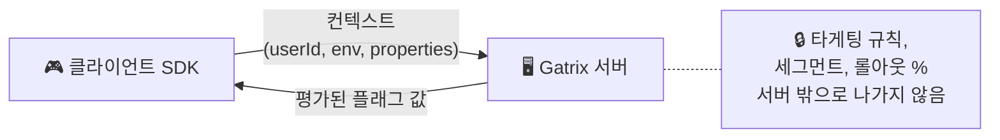
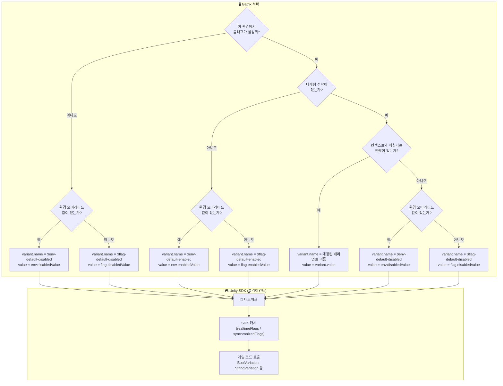
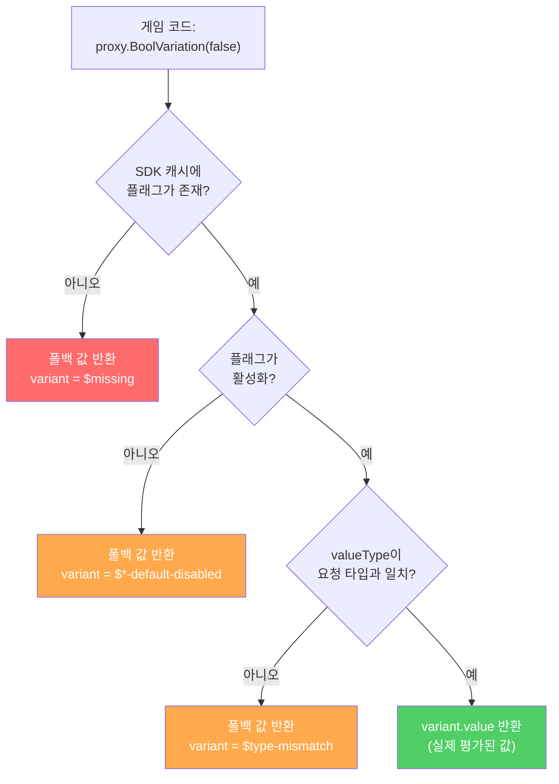

# Gatrix Unity SDK — 평가 모델

---

## 🏗️ 평가 모델: 원격 평가 전용

Gatrix 클라이언트 SDK들은 **원격 평가(Remote Evaluation)** 방식만을 사용합니다. 이것은 보안과 일관성을 위한 의도적인 아키텍처 결정입니다.

### 동작 방식



1. SDK가 **컨텍스트**(userId, 환경, 커스텀 속성)를 Gatrix 서버에 전송합니다.
2. 서버가 모든 타게팅 규칙, 세그먼트, 롤아웃 비율을 **원격으로** 평가합니다.
3. SDK는 **최종 평가된 플래그 값**만 수신합니다 — 규칙, 세그먼트, 원시 구성은 전달되지 않습니다.

### 원격 평가 vs 로컬 평가

| | 원격 평가 (Gatrix) | 로컬 평가 |
|---|---|---|
| **동작 방식** | 서버가 규칙 평가 → 클라이언트가 최종 값 수신 | 클라이언트가 모든 규칙 다운로드 → 로컬에서 평가 |
| **보안** | ✅ 타게팅 규칙, 세그먼트 정의, 롤아웃 로직이 **클라이언트에 노출되지 않음** | ⚠️ 모든 규칙이 클라이언트에 전송되어 검사, 역공학, 변조될 수 있음 |
| **일관성** | ✅ 평가 로직이 중앙 집중화 — 모든 SDK와 플랫폼이 동일한 결과를 받음 | ⚠️ 각 SDK가 동일한 평가 엔진을 독립적으로 구현해야 함; 미묘한 차이로 결과가 달라질 수 있음 |
| **페이로드 크기** | ✅ 최종 값만 전송됨 (작은 페이로드) | ⚠️ 전체 규칙 세트를 다운로드해야 함 (플래그/세그먼트가 많으면 클 수 있음) |
| **오프라인 지원** | ⚠️ 초기 네트워크 요청 필요; 오프라인 사용은 캐시된 값이나 부트스트랩 데이터에 의존 | ✅ 규칙을 한 번 다운로드하면 완전한 오프라인 평가 가능 |
| **평가 지연** | ⚠️ 초기 페치에 네트워크 왕복 시간 필요 | ✅ 초기 다운로드 이후 네트워크 불필요 |
| **규칙 업데이트 속도** | ✅ 스트리밍/폴링을 통해 새 값이 즉시 사용 가능 | ⚠️ 변경 사항을 적용하려면 전체 규칙 세트를 다시 다운로드해야 함 |

### Gatrix가 원격 평가를 선택한 이유

1. **보안 우선.** 게임 개발에서 클라이언트는 본질적으로 신뢰할 수 없습니다. 타게팅 규칙(예: "세그먼트 X의 사용자에게 10% 롤아웃")을 클라이언트에 전송하면 롤아웃 전략, 내부 세그먼트, 비즈니스 로직이 노출됩니다. 원격 평가에서는 최종 `true`/`false` 또는 배리언트 문자열만 클라이언트에 도달합니다.

2. **SDK 간 일관성.** Gatrix는 Unity, Unreal, Cocos2d-x, Godot, JavaScript, Flutter, Python 등을 지원합니다. 모든 언어에서 동일한 평가 로직을 구현하는 것은 오류가 발생하기 쉽습니다. 원격 평가는 SDK에 관계없이 동일한 결과를 보장합니다.

3. **간결한 SDK.** 클라이언트 SDK는 가벼운 캐시 레이어입니다 — 타게팅 규칙, 비율 롤아웃, 세그먼트 멤버십을 이해할 필요가 없습니다. 이로 인해 SDK가 경량화되고 버그 발생 영역이 줄어듭니다.

> 💡 **오프라인 & 부트스트랩:** 평가가 서버에서 이루어지더라도, SDK는 마지막으로 알려진 플래그 값을 로컬에 캐시합니다. 완전한 오프라인 시나리오를 위해 **부트스트랩 데이터**를 제공할 수도 있습니다. 자세한 내용은 [운영 모드](#-운영-모드) 섹션을 참고하세요.

### 🌐 오프라인 지원 및 안정성 (Offline & Availability)
Gatrix SDK는 **완벽한 실시간 동기화보다 서비스의 가용성(Availability)에 초점**을 맞추어 설계되었습니다. 네트워크 상태가 좋지 않거나 서버에 연결할 수 없더라도 게임은 절대 중단되지 않아야 합니다.

*   **네트워크 장애 시에도 정상 동작**: 네트워크가 끊기면 SDK는 로컬 캐시에 저장된 마지막 값을 사용합니다. 캐시가 없더라도 개발자가 코드에 명시한 안전한 `fallbackValue`를 사용하여 문제없이 실행됩니다.
*   **완전 오프라인 모드**: 오프라인 상태에서도 게임을 시작하고 플레이할 수 있습니다.
*   **자동 복구**: 네트워크 연결이 복구되면 백그라운드에서 최신 구성을 자동으로 가져와 로컬 저장소를 업데이트합니다.

이러한 설계는 네트워크 변동성이 플레이어 경험을 저해하지 않도록 보장합니다.

---

## 🔍 플래그 값 리졸루션 흐름

플래그 값이 서버에서 게임 코드로 전달되는 과정을 이해하는 것이 올바른 사용의 핵심입니다.

### 전체 흐름 개요



### 값 출처 우선순위 (원격)

서버가 플래그를 평가할 때, 다음 우선순위로 값이 결정됩니다:

| 우선순위 | 조건 | 값 소스 | `variant.name` |
|:--------:|------|--------|:---------------|
| 1 | 플래그 활성화 + 배리언트가 있는 전략 매칭 | 매칭된 배리언트의 `variant.value` | 배리언트 이름 (예: `"dark-theme"`) |
| 2 | 플래그 활성화 + 배리언트 매칭 없음 + 환경 오버라이드 설정됨 | `env.enabledValue` | `$env-default-enabled` |
| 3 | 플래그 활성화 + 배리언트 매칭 없음 + 환경 오버라이드 없음 | `flag.enabledValue` | `$flag-default-enabled` |
| 4 | 플래그 비활성화 + 환경 오버라이드 설정됨 | `env.disabledValue` | `$env-default-disabled` |
| 5 | 플래그 비활성화 + 환경 오버라이드 없음 | `flag.disabledValue` | `$flag-default-disabled` |
| 6 | 서버에 플래그 없음 | 응답에 포함되지 않음 | *(SDK가 `$missing` 생성)* |

> 💡 `variant.name`을 통해 값이 **어디서** 왔는지 정확히 알 수 있습니다. Monitor 창에서 디버깅할 때 매우 유용합니다.

### SDK 측: 게임 코드가 값을 받는 방식



### 예약된 배리언트 이름

SDK는 `$` 접두사가 붙은 배리언트 이름으로 값의 출처를 나타냅니다. `VariantSource.cs`에 정의되어 있습니다:

| 배리언트 이름 | 의미 | `enabled` | 발생 시점 |
|:-------------|------|:---------:|----------|
| `$missing` | SDK 캐시에 플래그가 없음 | `false` | 플래그 이름 오타, 아직 생성되지 않음, 또는 SDK 미초기화 |
| `$type-mismatch` | 요청 타입이 플래그의 `valueType`과 불일치 | `false` | `string` 플래그에 `BoolVariation` 호출 등 |
| `$env-default-enabled` | 플래그 활성화, 환경 수준 `enabledValue`에서 값 가져옴 | `true` | 배리언트 매칭 없음; 환경 오버라이드 설정됨 |
| `$flag-default-enabled` | 플래그 활성화, 플래그 수준(글로벌) `enabledValue`에서 값 가져옴 | `true` | 배리언트 매칭 없음; 환경 오버라이드 없음 |
| `$env-default-disabled` | 플래그 비활성화, 환경 수준 `disabledValue`에서 값 가져옴 | `false` | 플래그 비활성화; 환경 오버라이드 설정됨 |
| `$flag-default-disabled` | 플래그 비활성화, 플래그 수준(글로벌) `disabledValue`에서 값 가져옴 | `false` | 플래그 비활성화; 환경 오버라이드 없음 |
| *(사용자 정의 이름)* | 타게팅에 의해 특정 배리언트가 선택됨 | `true` | 전략이 매칭되어 해당 배리언트 선택 |

### Variation API 시그니처 (`FlagProxy`)

`FlagProxy`의 모든 variation 메서드는 `fallbackValue` 파라미터가 **필수**입니다 — 생략할 수 없습니다:

```csharp
// 불리언
bool   BoolVariation(bool fallbackValue)

// 문자열
string StringVariation(string fallbackValue)

// 숫자
int    IntVariation(int fallbackValue)
float  FloatVariation(float fallbackValue)
double DoubleVariation(double fallbackValue)

// JSON
Dictionary<string, object> JsonVariation(Dictionary<string, object> fallbackValue)

// 배리언트 이름만
string Variation(string fallbackValue)
```

#### `fallbackValue`가 필수인 이유 (생략 불가)

`fallbackValue` 파라미터는 의도적으로 필수로 설계되었습니다. 이를 통해 게임이 **어떤 실패 상황에서도 항상 사용 가능한 값을 받을 수 있습니다**:

1. **SDK 미초기화** — SDK가 아직 연결 중일 수 있습니다. 폴백이 없으면 `null`이나 크래시가 발생합니다.
2. **플래그 미존재** — 플래그 이름 오타이거나 플래그가 삭제된 경우. 폴백이 예기치 않은 동작을 방지합니다.
3. **네트워크 실패** — SDK가 서버에 접속할 수 없고 캐시된 데이터도 없을 때, 폴백이 게임 실행을 유지합니다.
4. **타입 불일치** — `string` 타입 플래그에 `BoolVariation`을 호출한 경우. 폴백이 타입 오류를 방지합니다.
5. **타입 안전성** — 폴백 값이 컴파일 시점에 기대되는 반환 타입을 확정합니다.

> ⚠️ **기본값 없는 오버로드는 없습니다.** 문제가 발생했을 때 어떤 값을 사용할지 항상 명시적으로 선택해야 합니다. 이것은 모든 Gatrix SDK에서 공유하는 의도적인 설계 결정입니다.

### 전체 예제: 모든 시나리오

```csharp
// 시나리오 1: 플래그 활성화, 전략 매칭 → 실제 배리언트 값 반환
this.WatchSyncedFlagWithInitialState("dark-theme", proxy =>
{
    // proxy.Exists      == true
    // proxy.Enabled     == true
    // proxy.Variant     == { name: "dark", value: true }
    // proxy.ValueType   == "boolean"

    bool isDark = proxy.BoolVariation(false);  // fallbackValue: false
    // isDark == true (variant.value에서 가져옴)
});

// 시나리오 2: 플래그 활성화, 배리언트 매칭 없음 → enabledValue 반환
this.WatchSyncedFlagWithInitialState("welcome-message", proxy =>
{
    // proxy.Variant == { name: "$env-default-enabled", value: "Hello!" }
    //   또는         { name: "$flag-default-enabled", value: "Hello!" }

    string msg = proxy.StringVariation("Fallback");  // fallbackValue: "Fallback"
    // msg == "Hello!" (enabledValue에서 가져옴)
});

// 시나리오 3: 플래그 비활성화 → fallbackValue 반환
this.WatchSyncedFlagWithInitialState("maintenance-mode", proxy =>
{
    // proxy.Enabled     == false
    // proxy.Variant     == { name: "$flag-default-disabled", value: "..." }

    bool maintenance = proxy.BoolVariation(false);  // fallbackValue: false
    // maintenance == false (플래그가 비활성화이므로 fallbackValue 반환)
});

// 시나리오 4: 플래그가 존재하지 않음 → $missing, fallbackValue 반환
this.WatchSyncedFlagWithInitialState("typo-flag-nmae", proxy =>
{
    // proxy.Exists      == false
    // proxy.Variant     == { name: "$missing" }

    bool val = proxy.BoolVariation(false);  // fallbackValue: false
    // val == false (플래그가 없으므로 fallbackValue 반환)
});

// 시나리오 5: 타입 불일치 → fallbackValue 반환
this.WatchSyncedFlagWithInitialState("string-flag", proxy =>
{
    // proxy.ValueType   == "string"

    bool val = proxy.BoolVariation(false);  // fallbackValue: false
    // val == false (valueType이 "string"이므로 "boolean"과 불일치, fallbackValue 반환)
});
```

### isEnabled vs BoolVariation

이 두 메서드는 **서로 다른 목적**을 가집니다 — 혼동하지 마세요:

| 메서드 | 반환 값 | 용도 |
|--------|---------|------|
| `proxy.Enabled` | `flag.enabled` | 피처 플래그가 **켜져 있는가?** |
| `proxy.BoolVariation(fallbackValue)` | `variant.value` (`bool`) | 플래그가 평가한 **불리언 값**은 무엇인가? |

```csharp
// 플래그가 활성화되어 있지만 불리언 값으로 false를 반환할 수 있습니다!
// enabled=true, variant.value=false → "기능은 켜졌지만, 불리언 설정은 false"
bool isOn = proxy.Enabled;              // true (플래그가 켜져 있음)
bool value = proxy.BoolVariation(true); // false (설정된 값)
```

---

