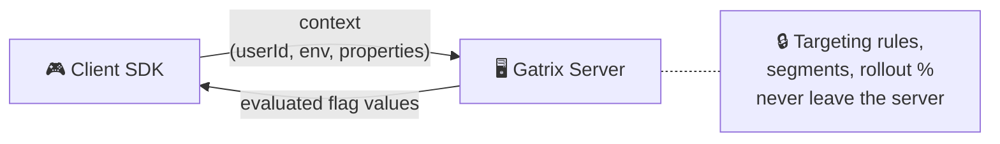
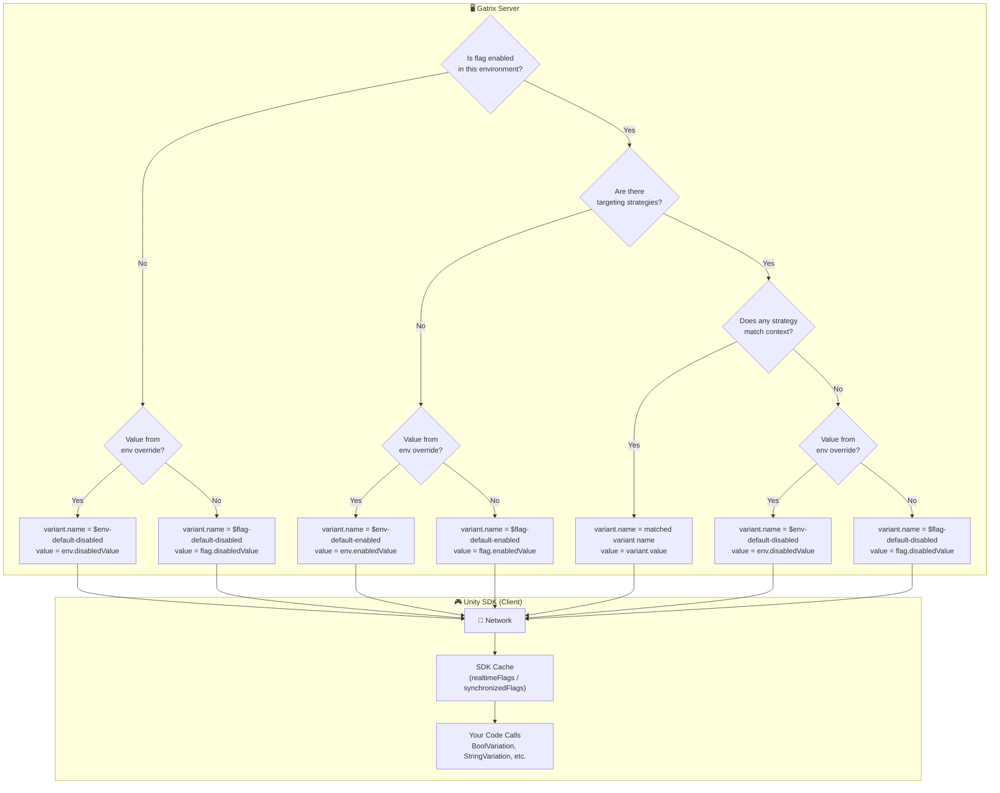
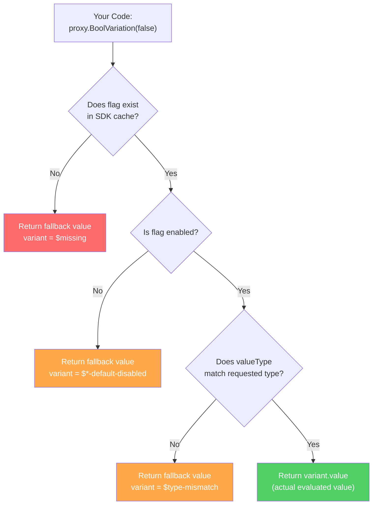

# Gatrix Unity SDK — Evaluation Model

---

## 🏗️ Evaluation Model: Remote Evaluation Only

Gatrix client SDKs use **remote evaluation** exclusively. This is a deliberate architectural decision for security and consistency.

### How It Works



1. The SDK sends **context** (userId, environment, custom properties) to the Gatrix server.
2. The server evaluates all targeting rules, segments, and rollout percentages **remotely**.
3. The SDK receives only the **final evaluated flag values** — no rules, no segments, no raw configuration.

### Remote Evaluation vs Local Evaluation

| | Remote Evaluation (Gatrix) | Local Evaluation |
|---|---|---|
| **How it works** | Server evaluates rules → client receives final values | Client downloads all rules → evaluates locally |
| **Security** | ✅ Targeting rules, segment definitions, and rollout logic are **never exposed** to the client | ⚠️ All rules are sent to the client and can be inspected, reverse-engineered, or tampered with |
| **Consistency** | ✅ Evaluation logic is centralized — all SDKs and platforms get identical results | ⚠️ Each SDK must implement the same evaluation engine independently; subtle differences can lead to inconsistent results |
| **Payload size** | ✅ Only final values are transmitted (small payload) | ⚠️ Full rule set must be downloaded (can be large with many flags/segments) |
| **Offline support** | ⚠️ Requires an initial network request; offline use relies on cached values or bootstrap data | ✅ Once rules are downloaded, evaluation works fully offline |
| **Evaluation latency** | ⚠️ Depends on network round-trip for the initial fetch | ✅ No network needed after initial download |
| **Rule update speed** | ✅ New values are available immediately via streaming/polling | ⚠️ Client must re-download the full rule set to pick up changes |

### Why Gatrix Chose Remote Evaluation

1. **Security first.** In game development, clients are inherently untrusted. Sending targeting rules (e.g., "10% rollout for users in segment X") to the client exposes your rollout strategy, internal segments, and business logic. With server-side evaluation, only the final `true`/`false` or variant string reaches the client.

2. **Consistency across SDKs.** Gatrix supports Unity, Unreal, Cocos2d-x, Godot, JavaScript, Flutter, Python, and more. Implementing identical evaluation logic in every language is error-prone. Server-side evaluation guarantees identical results regardless of SDK.

3. **Simpler SDK.** The client SDK is a thin cache layer — it doesn't need to understand targeting rules, percentage rollouts, or segment membership. This keeps the SDK lightweight and reduces the surface area for bugs.

> 💡 **Offline & Bootstrap:** Even though evaluation happens on the server, the SDK caches the last known flag values locally. You can also provide **bootstrap data** for fully offline scenarios. See the [Operating Modes](#-operating-modes) section for details.

### 🌐 Offline Support & Reliability
Gatrix SDK is architected to prioritize **Availability** over perfect real-time consistency. Your game must never crash or stop working just because the feature flag server is unreachable.

*   **Works Without Network**: If the internet is down, the SDK seamlessly serves values from its local cache. If no cache exists, it uses the safe `fallbackValue` you provide in code.
*   **Offline Mode**: Fully supported. Players can start and play the game offline using the last fetched configuration.
*   **Automatic Recovery**: When network connectivity is restored, the SDK automatically fetches the latest values in the background and updates the local store.

This design ensures that network hiccups never degrade the player experience.

---

## 🔍 Flag Value Resolution Flow

Understanding how a flag value travels from the server to your game code is essential for correct usage.

### End-to-End Flow Overview



### Value Source Priority (Remote)

When the server evaluates a flag, values are resolved in the following priority order:

| Priority | Condition | Value Source | `variant.name` |
|:--------:|-----------|-------------|:---------------|
| 1 | Flag enabled + strategy matched with variant | `variant.value` from matched variant | Variant name (e.g., `"dark-theme"`) |
| 2 | Flag enabled + no variant matched + env override set | `env.enabledValue` | `$env-default-enabled` |
| 3 | Flag enabled + no variant matched + no env override | `flag.enabledValue` | `$flag-default-enabled` |
| 4 | Flag disabled + env override set | `env.disabledValue` | `$env-default-disabled` |
| 5 | Flag disabled + no env override | `flag.disabledValue` | `$flag-default-disabled` |
| 6 | Flag not found on server | Not included in response | *(SDK generates `$missing`)* |

> 💡 The `variant.name` tells you exactly **where** the value came from. This is very useful for debugging in the Monitor window.

### SDK-Side: How Your Code Receives Values



### Reserved Variant Names

The SDK uses `$`-prefixed variant names to indicate value origin. These are defined in `VariantSource.cs`:

| Variant Name | Meaning | `enabled` | When It Happens |
|:-------------|---------|:---------:|-----------------|
| `$missing` | Flag does not exist in SDK cache | `false` | Flag name typo, flag not created yet, or SDK not initialized |
| `$type-mismatch` | Requested type doesn't match flag's `valueType` | `false` | Called `BoolVariation` on a `string` flag, etc. |
| `$env-default-enabled` | Flag enabled, value from environment-level `enabledValue` | `true` | No variant matched; env override is set |
| `$flag-default-enabled` | Flag enabled, value from flag-level (global) `enabledValue` | `true` | No variant matched; no env override |
| `$env-default-disabled` | Flag disabled, value from environment-level `disabledValue` | `false` | Flag disabled; env override is set |
| `$flag-default-disabled` | Flag disabled, value from flag-level (global) `disabledValue` | `false` | Flag disabled; no env override |
| *(user-defined name)* | A specific variant was selected by targeting | `true` | Strategy matched and selected this variant |

### Variation API Signatures (from `FlagProxy`)

All variation methods on `FlagProxy` require a `fallbackValue` parameter — this is **not optional**:

```csharp
// Boolean
bool   BoolVariation(bool fallbackValue)

// String
string StringVariation(string fallbackValue)

// Numeric
int    IntVariation(int fallbackValue)
float  FloatVariation(float fallbackValue)
double DoubleVariation(double fallbackValue)

// JSON
Dictionary<string, object> JsonVariation(Dictionary<string, object> fallbackValue)

// Variant name only
string Variation(string fallbackValue)
```

#### Why `fallbackValue` Is Required (Not Optional)

The `fallbackValue` parameter is mandatory by design. This ensures your game **always receives a usable value**, even in failure scenarios:

1. **SDK not initialized yet** — The SDK may still be connecting. Without a fallback, you'd get `null` or a crash.
2. **Flag doesn't exist** — A typo in the flag name, or the flag was deleted. The fallback prevents unexpected behavior.
3. **Network failure** — If the SDK can't reach the server and has no cached data, the fallback keeps the game running.
4. **Type mismatch** — Called `BoolVariation` on a `string`-type flag. The fallback prevents a type error.
5. **Type safety** — The fallback value establishes the expected return type at compile time.

> ⚠️ **There is no default-less overload.** You must always explicitly choose what happens when things go wrong. This is a deliberate design decision shared across all Gatrix SDKs.

### Complete Example: All Scenarios

```csharp
// Scenario 1: Flag enabled, strategy matched → actual variant value
this.WatchSyncedFlagWithInitialState("dark-theme", proxy =>
{
    // proxy.Exists      == true
    // proxy.Enabled     == true
    // proxy.Variant     == { name: "dark", value: true }
    // proxy.ValueType   == "boolean"

    bool isDark = proxy.BoolVariation(false);  // fallbackValue: false
    // isDark == true (from variant.value)
});

// Scenario 2: Flag enabled, no variant matched → enabledValue
this.WatchSyncedFlagWithInitialState("welcome-message", proxy =>
{
    // proxy.Variant == { name: "$env-default-enabled", value: "Hello!" }
    //   or           { name: "$flag-default-enabled", value: "Hello!" }

    string msg = proxy.StringVariation("Fallback");  // fallbackValue: "Fallback"
    // msg == "Hello!" (from enabledValue)
});

// Scenario 3: Flag disabled → fallbackValue returned
this.WatchSyncedFlagWithInitialState("maintenance-mode", proxy =>
{
    // proxy.Enabled     == false
    // proxy.Variant     == { name: "$flag-default-disabled", value: "..." }

    bool maintenance = proxy.BoolVariation(false);  // fallbackValue: false
    // maintenance == false (fallbackValue returned, because flag is disabled)
});

// Scenario 4: Flag does NOT exist → $missing, fallbackValue returned
this.WatchSyncedFlagWithInitialState("typo-flag-nmae", proxy =>
{
    // proxy.Exists      == false
    // proxy.Variant     == { name: "$missing" }

    bool val = proxy.BoolVariation(false);  // fallbackValue: false
    // val == false (fallbackValue returned, because flag is missing)
});

// Scenario 5: Type mismatch → fallbackValue returned
this.WatchSyncedFlagWithInitialState("string-flag", proxy =>
{
    // proxy.ValueType   == "string"

    bool val = proxy.BoolVariation(false);  // fallbackValue: false
    // val == false (fallbackValue returned, because valueType is "string", not "boolean")
});
```

### isEnabled vs BoolVariation

These two methods serve **different purposes** — don't confuse them:

| Method | Returns | Purpose |
|--------|---------|---------|
| `proxy.Enabled` | `flag.enabled` | Is the feature flag **turned on**? |
| `proxy.BoolVariation(fallbackValue)` | `variant.value` as `bool` | What **boolean value** did the flag evaluate to? |

```csharp
// A flag can be enabled but return false as its boolean value!
// enabled=true, variant.value=false → "Feature is ON, but the bool config is false"
bool isOn = proxy.Enabled;              // true (flag is on)
bool value = proxy.BoolVariation(true); // false (the configured value)
```

---
