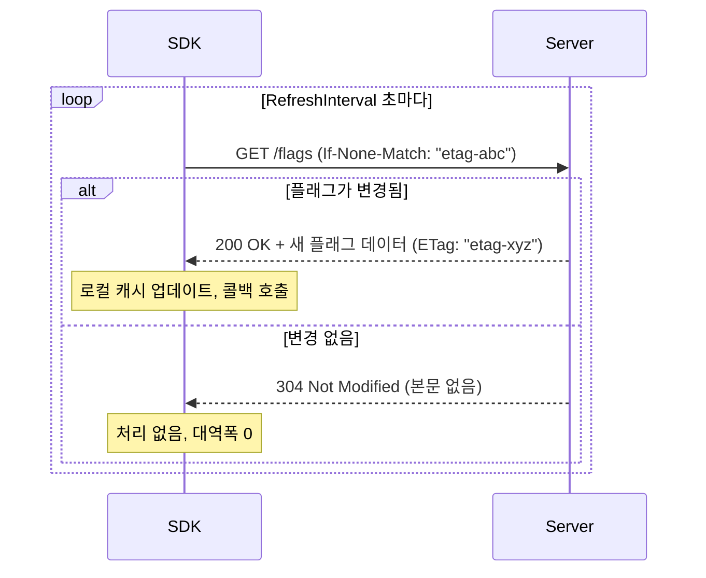
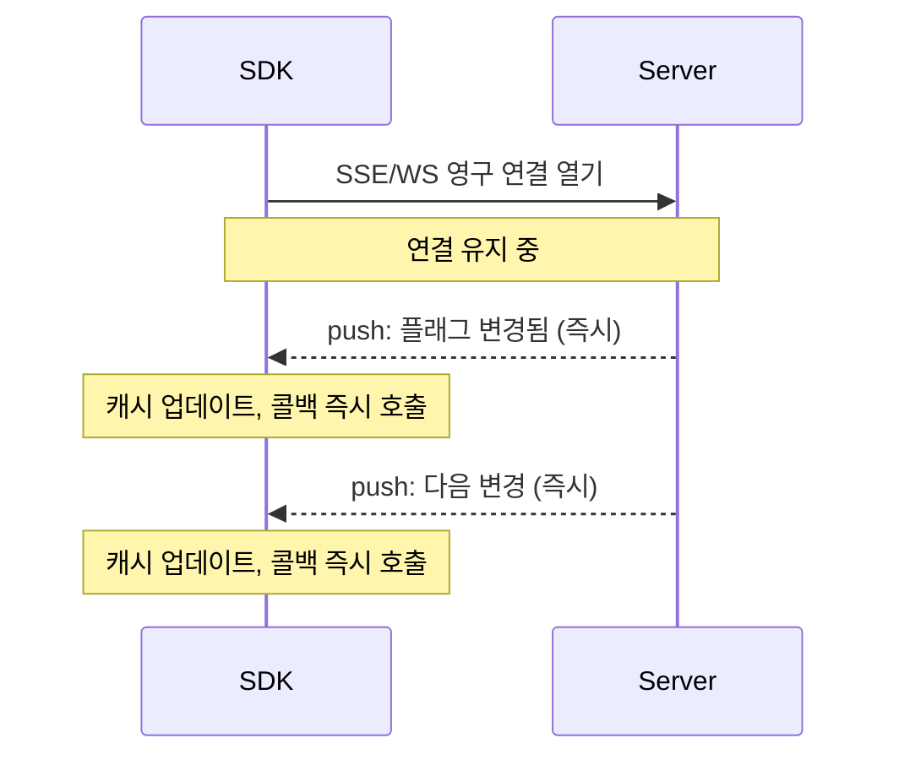
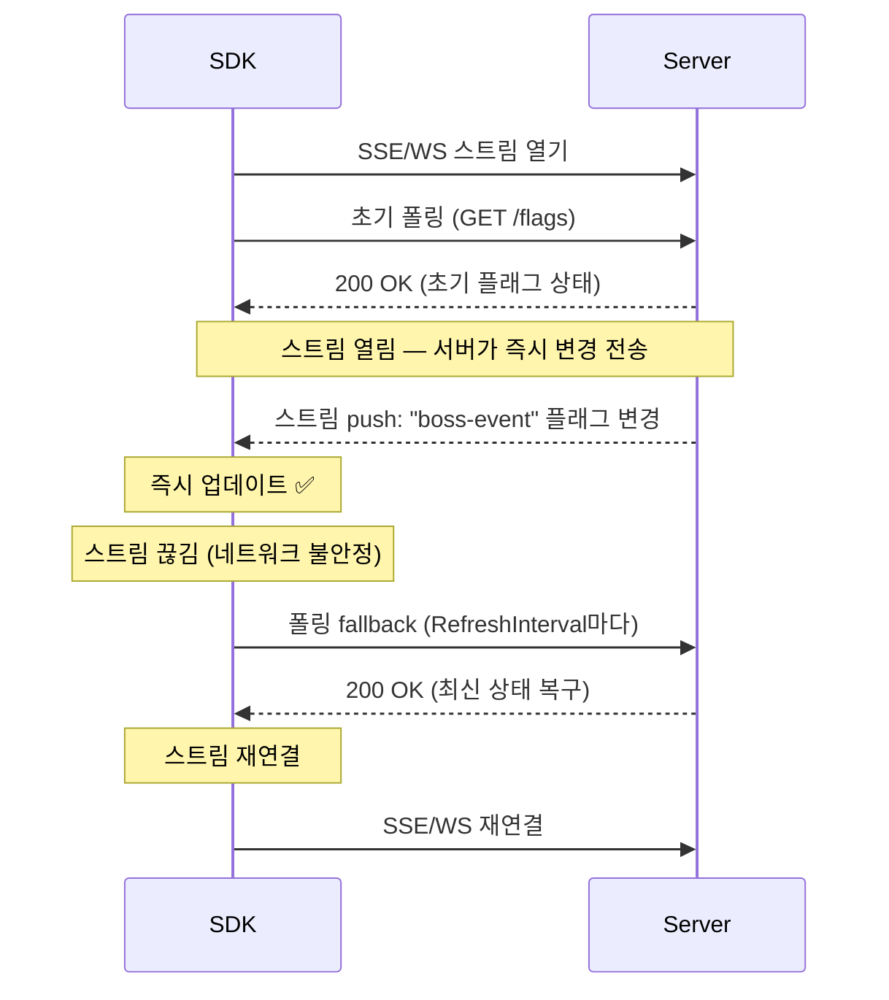

# Gatrix Unity SDK — 폴링, 스트리밍 & 하이브리드 모드

---

## 📡 폴링 vs 스트리밍 vs 하이브리드

Gatrix SDK는 서버에서 플래그 변경을 수신하는 세 가지 방식을 지원합니다. 각 방식의 특성을 이해하면 환경에 맞는 최적 설정을 선택할 수 있습니다.

---

## 🔄 폴링 (Polling)

폴링은 주기적으로 HTTP 요청을 보내 *"플래그가 변경되었나요?"* 라고 서버에 묻는 방식입니다.

```csharp
Features = new FeaturesConfig
{
    RefreshInterval = 30  // 30초마다 폴링 (기본값)
}
```

### 동작 방식



### ETag 기반 캐싱

서버는 **HTTP ETag**를 사용해 중복 데이터 전송을 방지합니다. 매 폴링마다:

1. SDK가 `If-None-Match: "<last-etag>"` 헤더를 포함해 요청을 보냅니다.
2. 플래그가 **변경되지 않았으면**, 서버는 **304 Not Modified**를 반환합니다 — 본문 없음, 대역폭 최소.
3. 플래그가 **변경되었으면**, 서버는 **200 OK**와 새 데이터, 새 ETag를 반환합니다.

> 💡 **폴링을 자주 해도 데이터가 없으면 대역폭은 소비되지 않습니다.** 그러나 변경이 없어도 네트워크 왕복은 발생합니다. `RefreshInterval`을 너무 짧게 설정(예: 1~5초)하면 서버 부하와 모바일 배터리 소모가 증가합니다.

**`RefreshInterval` 권장값:**

| 시나리오 | 권장 주기 |
|---|---|
| 라이브 게임, 빈번한 업데이트 | `30s` (기본값) — 실시간은 스트리밍이 담당 |
| 플래그 변경이 드문 경우 (주 1회) | `300s`–`600s` |
| 폴링 전용, 적당한 신선도 | `60s`–`120s` |
| CI / 테스트 | `3600s` 또는 오프라인 모드 |

> ⚠️ **프로덕션에서 `RefreshInterval`을 10초 미만으로 설정하지 마세요.** 스트리밍이 켜진 상태(기본)에서는 실시간 변경이 SSE/WebSocket으로 즉시 도착합니다. 폴링은 안전망(fallback)이므로 빠를 필요가 없습니다.

### 폴링의 장단점

| ✅ 장점 | ⚠️ 단점 |
|---|---|
| 단순 — 일반 HTTP, 모든 환경에서 동작 | 변경 반영까지 최대 `RefreshInterval`만큼 지연 |
| 모든 프록시 / 방화벽 통과 | 클라이언트 수 × 주기만큼 서버 부하 증가 |
| 영구 연결 없이 가벼움 | 주기가 짧으면 모바일 배터리에 영향 |
| ETag 캐싱으로 중복 전송 방지 | 실시간 실험의 유일한 전달 수단으로는 부적합 |

---

## ⚡ 스트리밍 (SSE / WebSocket)

스트리밍은 **영구 연결**을 유지하고, 서버가 플래그 변경을 **즉시 SDK로 전송(push)**합니다. 다음 폴링 사이클을 기다릴 필요가 없습니다.

```csharp
Features = new FeaturesConfig
{
    Streaming = new StreamingConfig
    {
        Enabled = true,                           // 기본값: true
        Transport = StreamingTransport.Sse        // SSE (기본) 또는 WebSocket
    }
}
```

### 동작 방식



### 전송 방식 비교

| 전송 방식 | 프로토콜 | 설명 |
|---|---|---|
| **SSE** (Server-Sent Events) | HTTP/1.1 단방향 스트림 | 기본값. WebGL 포함 모든 환경 지원. 단순하고 안정적. |
| **WebSocket** | 양방향 TCP | 더 낮은 지연, ping/keepalive 지원. SSE가 차단된 환경에 적합. WebGL에서는 JS interop으로 자동 처리. |

### 스트리밍의 장단점

| ✅ 장점 | ⚠️ 단점 |
|---|---|
| 플래그 변경 즉시 전달 (1초 미만) | 영구 연결 필요 (일부 기업 방화벽/프록시가 차단) |
| 변경이 있을 때만 전송 — 낭비 없음 | 연결이 끊기면 재연결 오버헤드 발생 |
| 실시간 A/B 실험 및 킬 스위치에 이상적 | 오프라인 / 폴링 전용 설정에서는 사용 불가 |
| 서버 팬아웃으로 효율적인 확장 | 영구 연결은 서버 리소스를 소모 |

---

## 🔀 하이브리드 모드: 스트리밍 + 폴링 (기본값)

**Gatrix의 기본 설정**은 스트리밍과 폴링을 **동시에** 사용하는 하이브리드 방식입니다. 프로덕션 게임에 권장하는 방식입니다.



### 왜 하이브리드인가?

스트리밍만 사용하면 연결이 끊길 때 취약합니다. 폴링만 사용하면 느립니다. 하이브리드는 두 방식의 장점을 결합합니다:

| | 스트리밍 전용 | 폴링 전용 | **하이브리드 (기본값)** |
|---|---|---|---|
| **변경 반영 지연** | ✅ 1초 미만 | ⚠️ 최대 주기만큼 지연 | ✅ 1초 미만 |
| **연결 끊김 복구** | ⚠️ 재연결 전까지 공백 | ✅ 다음 폴링이 복구 | ✅ 폴링이 공백을 메움 |
| **방화벽 / 프록시 호환성** | ⚠️ 차단될 수 있음 | ✅ 항상 동작 | ✅ 폴링으로 자동 fallback |
| **대역폭** | ✅ push 전용 | ✅ ETag 캐싱 | ✅ 두 가지 최적화 모두 |
| **복잡도** | 낮음 | 낮음 | 낮음 (SDK가 자동 처리) |

> 💡 **하이브리드 모드에서 `RefreshInterval`은 실시간 전달 채널이 아닌 안전망입니다.** 스트리밍이 실시간 변경을 처리하므로, 기본값 `30s`를 유지하면 충분합니다.

### 하이브리드가 처리하는 장애 시나리오

| 장애 상황 | 스트리밍 전용 | **하이브리드** |
|---|---|---|
| SSE/WS 연결이 5초 동안 끊김 | 5초간 변경 누락, 재연결 후 복구 | `RefreshInterval` 이내에 폴링이 누락 변경을 복구 |
| 기업 프록시가 SSE 차단 | ❌ 업데이트 불가 | ✅ 폴링으로 seamless 전환 |
| 서버 재시작 | 스트림 재연결 전까지 공백 | `RefreshInterval` 이내에 폴링이 처리 |
| 모바일 네트워크 전환 (WiFi → 4G) | 짧은 공백 | 다음 폴링으로 복구 |

---

## 설정 레퍼런스

```csharp
var config = new GatrixClientConfig
{
    Features = new FeaturesConfig
    {
        // 폴링 주기 (초 단위, 기본값: 30)
        // 하이브리드 모드에서는 안전망 — 10초 미만으로 설정하지 마세요
        RefreshInterval = 30,

        Streaming = new StreamingConfig
        {
            Enabled = true,                              // false = 폴링 전용
            Transport = StreamingTransport.Sse           // 또는 WebSocket
        }
    }
};
```

| 설정 | 기본값 | 권장 |
|---|---|---|
| `RefreshInterval` | `30` | 스트리밍 사용 시 `30`으로 유지. 대역폭이 제한적이면 `60`–`300`으로 증가. |
| `Streaming.Enabled` | `true` | 네트워크 환경이 영구 연결을 차단하지 않으면 활성 유지. |
| `Streaming.Transport` | `Sse` | SSE가 차단되거나 WebGL 빌드라면 `WebSocket`으로 전환. |
