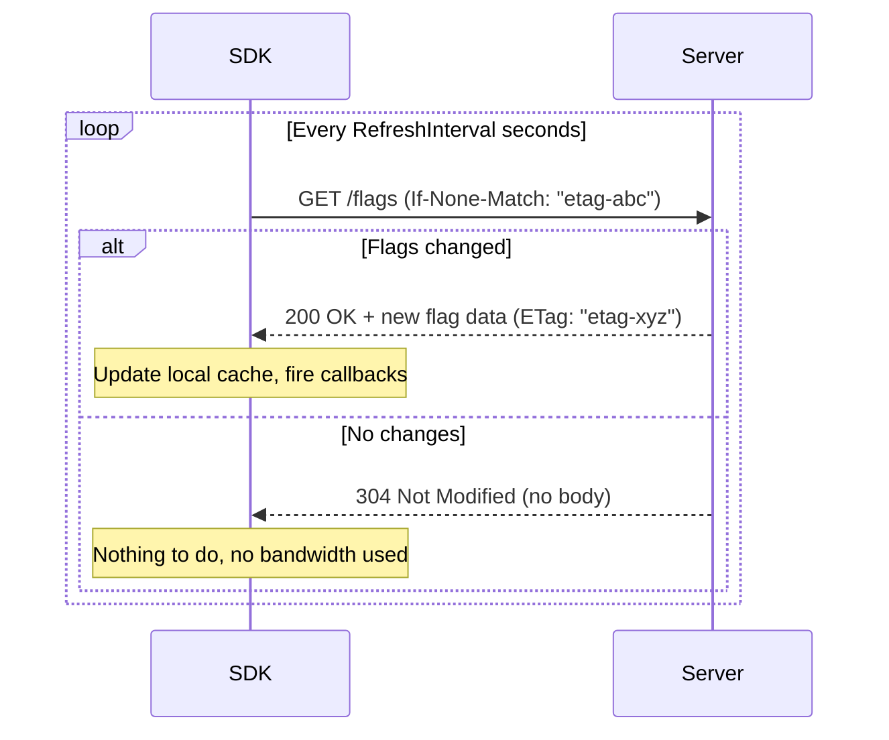
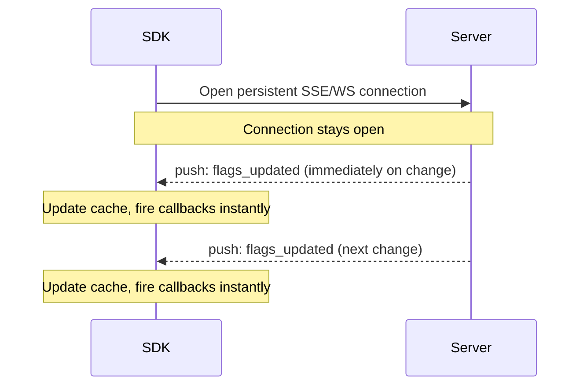

# Gatrix Unity SDK — Polling, Streaming & Hybrid Mode

---

## 📡 Polling vs Streaming vs Hybrid

Gatrix SDK can receive flag updates from the server in three ways. Understanding the trade-offs helps you pick the right configuration for your environment.

---

## 🔄 Polling

Polling sends a periodic HTTP request to the server to ask: *"Have any flags changed?"*

```csharp
Features = new FeaturesConfig
{
    RefreshInterval = 30  // Poll every 30 seconds (default)
}
```

### How It Works



### ETag-Based Caching

The server uses **HTTP ETags** to avoid sending duplicate data. On every poll:

1. The SDK sends the `If-None-Match: "<last-etag>"` header.
2. If flags **have not changed**, the server returns **304 Not Modified** — no body, minimal bandwidth.
3. If flags **have changed**, the server returns **200 OK** with the new data and a new ETag.

> 💡 This means polling frequently does **not** waste bandwidth when nothing has changed. However, it still creates network round-trips. Setting `RefreshInterval` too low (e.g., 1–5 seconds) increases server load and battery usage on mobile even when data is identical.

**Recommended `RefreshInterval` values:**

| Scenario | Recommended interval |
|---|---|
| Live game, frequent updates | `30s` (default) — streaming handles real-time |
| Flags change rarely (weekly) | `300s`–`600s` |
| Polling-only mode, moderate freshness | `60s`–`120s` |
| CI / testing | `3600s` or Offline mode |

> ⚠️ **Do not set `RefreshInterval` below `10s`** in production. With streaming enabled (default), real-time updates arrive via SSE/WebSocket anyway. Polling is a safety fallback — it doesn't need to be fast.

### Pros & Cons of Polling

| ✅ Pros | ⚠️ Cons |
|---|---|
| Simple — just HTTP, works everywhere | Higher latency (changes take up to `RefreshInterval` to arrive) |
| Works through all proxies and firewalls | Server load grows with client count × frequency |
| No persistent connection overhead | Battery impact on mobile if interval is too short |
| ETag caching prevents redundant data transfer | Not suitable as the only delivery method for real-time experiments |

---

## ⚡ Streaming (SSE / WebSocket)

Streaming keeps a **persistent connection** open. The server **pushes** flag changes to the SDK immediately — no waiting for the next poll cycle.

```csharp
Features = new FeaturesConfig
{
    Streaming = new StreamingConfig
    {
        Enabled = true,                           // Default: true
        Transport = StreamingTransport.Sse        // SSE (default) or WebSocket
    }
}
```

### How It Works



### Transport Options

| Transport | Protocol | Notes |
|---|---|---|
| **SSE** (Server-Sent Events) | HTTP/1.1 one-way stream | Default. Works everywhere including WebGL. Simple, battle-tested. |
| **WebSocket** | Bidirectional TCP | Lower latency, supports ping/keepalive. Required for environments that block SSE. Auto-selected for WebGL via JS interop. |

### Pros & Cons of Streaming

| ✅ Pros | ⚠️ Cons |
|---|---|
| Near-instant flag delivery (sub-second) | Requires a persistent connection (some corporate firewalls or proxies block SSE/WS) |
| Server pushes only on actual changes — no wasted requests | Reconnection overhead if connection drops |
| Ideal for real-time A/B experiments and kill switches | Not available in offline / polling-only configuration |
| Scales well — server fan-out is efficient | Persistent connections consume server resources |

---

## 🔀 Hybrid Mode: Streaming + Polling (Default)

The **default Gatrix configuration** uses **both** streaming and polling together. This is the recommended approach for production games.

```mermaid
sequenceDiagram
    participant SDK
    participant Server

    SDK->>Server: Open SSE/WS stream
    SDK->>Server: Initial poll (GET /flags)
    Server-->>SDK: 200 OK (initial flag state)

    Note over Server,SDK: Stream is open — server pushes changes instantly

    Server-->>SDK: Stream push: "boss-event" flag changed
    Note over SDK: Immediate update ✅

    Note over SDK: Stream drops (network hiccup)
    SDK->>Server: Polling fallback (every RefreshInterval)
    Server-->>SDK: 200 OK (latest state recovered)
    Note over SDK: Reconnect stream
    SDK->>Server: Re-open SSE/WS stream
```



### Why Hybrid?

Streaming alone is fragile — connections drop. Polling alone is slow. The hybrid combines both strengths:

| | Streaming only | Polling only | **Hybrid (default)** |
|---|---|---|---|
| **Latency on change** | ✅ Sub-second | ⚠️ Up to interval | ✅ Sub-second |
| **Resilience to connection drop** | ⚠️ Gap until reconnect | ✅ Next poll catches it | ✅ Polling fills the gap |
| **Firewall / proxy compatibility** | ⚠️ May be blocked | ✅ Always works | ✅ Falls back to polling |
| **Bandwidth** | ✅ Push-only | ✅ ETag caching | ✅ Both optimizations |
| **Complexity** | Low | Low | Low (SDK handles it) |

> 💡 **In hybrid mode, `RefreshInterval` is a safety net, not the primary delivery channel.** You can keep it at the default `30s` without worrying about freshness — streaming delivers changes in real time.

### Failure Scenarios Handled by Hybrid

| Failure | Streaming only | **Hybrid** |
|---|---|---|
| SSE/WS connection drops for 5 seconds | Changes missed for 5s, then recovered on reconnect | Polling catches any missed changes within `RefreshInterval` |
| Corporate proxy blocks SSE | ❌ No updates | ✅ Falls back to polling seamlessly |
| Server restart | Gap until stream reconnects | Polling fires within `RefreshInterval` |
| Mobile network handoff (WiFi → 4G) | Brief gap | Gap filled by next poll |

---

## Configuration Reference

```csharp
var config = new GatrixClientConfig
{
    Features = new FeaturesConfig
    {
        // Polling interval in seconds (default: 30)
        // In hybrid mode this is a safety fallback — don't set < 10s
        RefreshInterval = 30,

        Streaming = new StreamingConfig
        {
            Enabled = true,                              // false = polling-only
            Transport = StreamingTransport.Sse           // or WebSocket
        }
    }
};
```

| Setting | Default | Recommendation |
|---|---|---|
| `RefreshInterval` | `30` | Keep at `30` with streaming on. Increase to `60`–`300` if bandwidth is a concern. |
| `Streaming.Enabled` | `true` | Keep enabled unless your network environment blocks persistent connections. |
| `Streaming.Transport` | `Sse` | Switch to `WebSocket` if SSE is blocked or for WebGL builds. |
