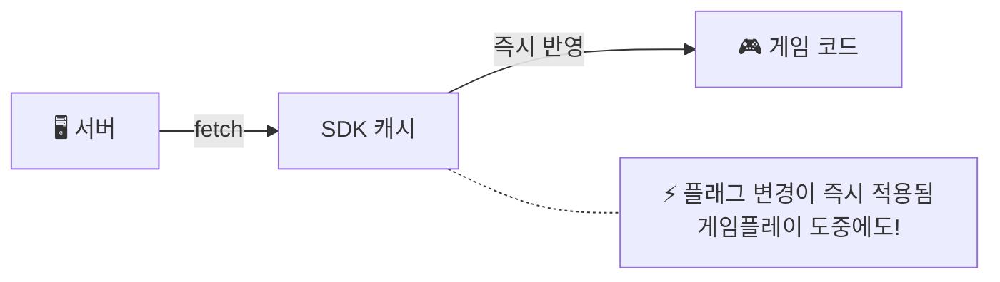
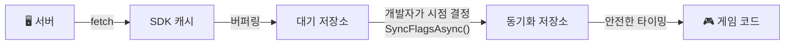

# Gatrix Unity SDK — Watch API & FlagProxy

---

## 👁️ 변경 감지 (Watch)

Gatrix는 용도에 따라 두 가지 Watch 메서드 패밀리를 제공합니다:

### 리얼타임 감지 (Realtime)

**`WatchRealtimeFlag`** 는 `ExplicitSyncMode` 설정과 **무관하게**, 서버에서 플래그 변경을 가져오는 즉시 콜백을 호출합니다. 디버그 UI, 모니터링 대시보드, 또는 항상 최신 서버 값이 필요한 경우에 적합합니다.

```csharp
var features = GatrixBehaviour.Client.Features;

// 플래그 감지 — 서버 측 변경 시마다 콜백 호출
var unsubscribe = features.WatchRealtimeFlag("game-speed", proxy =>
{
    Debug.Log($"서버에서 game-speed 변경됨: {proxy.FloatVariation(1f)}");
});

// 감지 중단
unsubscribe();

// 초기 상태 포함 감지 (현재 값으로 즉시 콜백 호출 후, 변경 시마다 호출)
features.WatchRealtimeFlagWithInitialState("dark-mode", proxy =>
{
    ApplyTheme(proxy.Enabled ? "dark" : "light");
});
```

### 동기화 감지 (Synced)

**`WatchSyncedFlag`** 는 **동기화된** 플래그 저장소가 업데이트될 때만 콜백을 호출합니다. `ExplicitSyncMode`가 활성화된 경우, 동기화 감지자는 `SyncFlagsAsync()` 호출 시까지 변경 전달을 대기합니다. `ExplicitSyncMode`가 비활성화된 경우에는 리얼타임 감지와 동일하게 동작합니다.

```csharp
var features = GatrixBehaviour.Client.Features;

// 동기화 감지 — ExplicitSyncMode에서는 SyncFlagsAsync() 이후에만 콜백 호출
features.WatchSyncedFlagWithInitialState("difficulty", proxy =>
{
    SetDifficulty(proxy.StringVariation("normal"));
});

// 안전한 시점에 변경 적용 (예: 라운드 사이)
await features.SyncFlagsAsync();
// ↑ 이 시점에서 동기화 감지자의 콜백이 최신 값으로 호출됨
```

### 리얼타임 vs 동기화 — 언제 무엇을 사용할까?

| | 리얼타임 (Realtime) | 동기화 (Synced) |
|---|---|---|
| **콜백 타이밍** | 서버에서 가져오는 즉시 | `SyncFlagsAsync()` 호출 후 (ExplicitSyncMode 시) |
| **적합한 용도** | 디버그 UI, 모니터링, 방해되지 않는 변경 | 게임플레이에 영향을 주는 값, 타이밍 제어 필요 |
| **ExplicitSyncMode 비활성** | 변경 시 즉시 호출 | 변경 시 즉시 호출 (리얼타임과 동일) |
| **ExplicitSyncMode 활성** | 변경 시 즉시 호출 | `SyncFlagsAsync()` 호출 후에만 호출 |

### ⚠️ 동기화 모드가 중요한 이유 (실전 시나리오)

리얼타임 모드는 간단하고 편리하지만, 플래그 변경을 **즉시** 적용하면 실제 서비스에서 심각한 문제를 일으킬 수 있습니다:

| 문제 상황 | 예시 | 영향 |
|---------|---------|--------|
| **게임플레이 중간 변경** | 보스전 도중 적 HP 배율이 변경됨 | 플레이어가 치팅을 의심하거나 버그로 느낌 |
| **의존성 충돌** | UI 레이아웃 플래그가 의존하는 데이터 로드 전에 변경됨 | 크래시 또는 화면 깨짐 |
| **사용자 신뢰 훼손** | 파밍 중 아이템 드롭률이 변경됨 | 플레이어가 게임의 공정성을 불신 |
| **시각적 불쾌감** | 플레이어가 읽는 중에 테마나 UI가 갑자기 바뀜 | 답답하고 혼란스러운 UX |
| **경쟁 무결성** | 매치 중 매칭 파라미터가 변경됨 | 불공정한 유리/불리 발생 |

> 💡 **경험 법칙:** 플래그 변경이 플레이어에게 "뭔가 갑자기 바뀌었다"는 불쾌한 느낌을 줄 수 있다면, **동기화** 모드를 사용하고 자연스러운 전환 시점(로딩 화면, 라운드 사이, 메뉴 전환)에 변경을 적용하세요.

### 📊 흐름 다이어그램: 리얼타임 vs 동기화

**리얼타임 모드:**



**동기화 모드 (ExplicitSyncMode):**



동기화 모드를 활용하면, 대시보드에서 변경한 값이 **개발자가 의도한 안전한 시점**에만 게임에 반영됩니다. 플레이어는 갑작스러운 변화 없이 매끄러운 경험을 유지하고, 운영팀은 언제든 자유롭게 플래그를 조정할 수 있습니다.

### `forceRealtime` 파라미터

모든 플래그 접근 메서드는 선택적 `forceRealtime` 파라미터를 지원합니다 (기본값: `false`).

`ExplicitSyncMode`가 활성화된 경우:
- **`forceRealtime: false`** (기본값) — **동기화된** 저장소에서 읽습니다 (안전하고 제어된 값)
- **`forceRealtime: true`** — **리얼타임** 저장소에서 읽습니다 (동기화를 우회하여 최신 서버 값을 즉시 확인)

```csharp
var features = GatrixBehaviour.Client.Features;

// 기본값: 동기화된 값을 읽음 (게임플레이에 안전)
bool isEnabled = features.IsEnabled("boss-buff");
float speed    = features.FloatVariation("game-speed", 1.0f);

// forceRealtime: 아직 동기화되지 않은 최신 서버 값을 읽음
// 디버그 UI나 동기화 모드와 함께 모니터링할 때 유용
bool latestValue = features.IsEnabled("boss-buff", forceRealtime: true);
float latestSpeed = features.FloatVariation("game-speed", 1.0f, forceRealtime: true);
```

> ⚠️ **`ExplicitSyncMode`가 비활성(기본값)인 경우:**
> `forceRealtime` 파라미터는 **완전히 무시**되며, `WatchSyncedFlag`와 `WatchRealtimeFlag`는 동일하게 동작합니다.
> 동기화 저장소 자체가 존재하지 않으므로 모든 읽기와 콜백이 **항상 리얼타임 기반**으로 동작합니다.
> `forceRealtime`은 **오직 `ExplicitSyncMode = true`일 때만 의미**가 있습니다.

### 기본 제공 컴포넌트와 동기화 모드

기본 제공 제로 코드 컴포넌트(`GatrixFlagToggle`, `GatrixFlagValue`, `GatrixFlagColor` 등)는 **리얼타임** 감지를 기본으로 사용하므로, 서버 변경에 즉시 반응합니다.

`ExplicitSyncMode`를 사용하는 프로젝트에서는 다음을 고려하세요:
- **게임플레이에 영향을 주지 않는 UI**에 붙인 컴포넌트(설정 패널, 디버그 오버레이)는 리얼타임으로 두어도 됩니다 — 플레이어에게 방해가 되지 않습니다.
- **게임플레이에 영향을 주는** 컴포넌트(난이도 수정, 경제 수치)는 코드 기반 `WatchSyncedFlag`를 사용하여 변경 적용 시점을 정확히 제어하는 것을 권장합니다.
- 현재 동기화된 값(`forceRealtime` 없이)과 리얼타임 값(`forceRealtime: true`)을 비교하여 "새로운 업데이트 대기 중" 표시기를 구현할 수 있습니다.

### FlagProxy — Watch 콜백 파라미터

모든 Watch 콜백은 **`FlagProxy`** 를 전달받습니다 — 특정 플래그 이름에 바인딩된 경량 래퍼입니다. Watch 콜백 내에서 플래그 값을 읽는 주요 수단입니다.

**핵심 특성:**
- `FlagProxy`는 플래그 데이터의 복사본을 **보관하지 않습니다** — 접근 시점에 항상 클라이언트 캐시에서 **실시간으로** 읽습니다.
- 생성 시점에 단일 플래그 이름에 바인딩되므로, 플래그 이름을 다시 전달할 필요가 없습니다.
- `ExplicitSyncMode`에서 proxy의 `forceRealtime` 모드는 Watch 유형에 따라 자동 설정됩니다:
  - `WatchRealtimeFlag` → proxy는 **리얼타임** 저장소에서 읽음
  - `WatchSyncedFlag` → proxy는 **동기화된** 저장소에서 읽음

```csharp
features.WatchRealtimeFlagWithInitialState("difficulty", proxy =>
{
    // 속성
    bool exists    = proxy.Exists;          // 플래그가 캐시에 존재하는가?
    bool enabled   = proxy.Enabled;         // 플래그가 활성화되었는가?
    string name    = proxy.Name;            // 플래그 이름 ("difficulty")
    bool isRT      = proxy.IsRealtime;      // 리얼타임 감지자이면 true

    // 타입별 안전한 값 접근 (폴백 포함, 예외 발생 없음)
    string diff    = proxy.StringVariation("normal");
    bool   show    = proxy.BoolVariation(false);
    int    level   = proxy.IntVariation(1);
    float  speed   = proxy.FloatVariation(1.0f);
    double rate    = proxy.DoubleVariation(0.5);

    // 전체 배리언트 정보
    Variant v = proxy.Variant;
    Debug.Log($"Variant: {v.Name} = {v.Value}");

    // 평가 상세 정보 (결정 이유 포함)
    var details = proxy.BoolVariationDetails(false);
    Debug.Log($"Value: {details.Value}, Reason: {details.Reason}");

    // 메타데이터
    ValueType type = proxy.ValueType;
    int version    = proxy.Version;
    string reason  = proxy.Reason;
});
```

**FlagProxy API 요약:**

| 카테고리 | 멤버 | 반환 타입 | 설명 |
|----------|------|---------|------|
| **속성** | `Name` | `string` | 플래그 이름 |
| | `Exists` | `bool` | 플래그가 캐시에 존재하는지 여부 |
| | `Enabled` | `bool` | 플래그 활성화 여부 |
| | `Variant` | `Variant` | 전체 배리언트 (이름 + 값) |
| | `IsRealtime` | `bool` | 리얼타임 저장소에서 읽는지 여부 |
| | `ValueType` | `ValueType` | 값 타입 (bool/string/number/json) |
| | `Version` | `int` | 플래그 평가 버전 |
| | `Reason` | `string` | 평가 이유 |
| **값 접근** | `BoolVariation(fallback)` | `bool` | Boolean 값 |
| | `StringVariation(fallback)` | `string` | 문자열 값 |
| | `IntVariation(fallback)` | `int` | 정수 값 |
| | `FloatVariation(fallback)` | `float` | float 값 |
| | `DoubleVariation(fallback)` | `double` | double 값 |
| | `JsonVariation(fallback)` | `Dictionary` | JSON을 Dictionary로 |
| **상세** | `BoolVariationDetails(fallback)` | `VariationResult<bool>` | 값 + 평가 이유 |
| | `StringVariationDetails(fallback)` | `VariationResult<string>` | 값 + 평가 이유 |
| **OrThrow** | `BoolVariationOrThrow()` | `bool` | 값 반환 또는 없으면 예외 |
| | `StringVariationOrThrow()` | `string` | 값 반환 또는 없으면 예외 |

### Watch 그룹

여러 플래그를 그룹으로 감지하고 한 번에 구독 해제할 수 있습니다:

```csharp
var features = GatrixBehaviour.Client.Features;

var group = features.CreateWatchGroup("ui-flags");
group.WatchRealtimeFlag("dark-mode",   p => { /* ... */ })
     .WatchRealtimeFlag("show-ads",    p => { /* ... */ })
     .WatchSyncedFlag("premium-ui",    p => { /* ... */ });

// 모두 한 번에 해제
group.Destroy();
```

