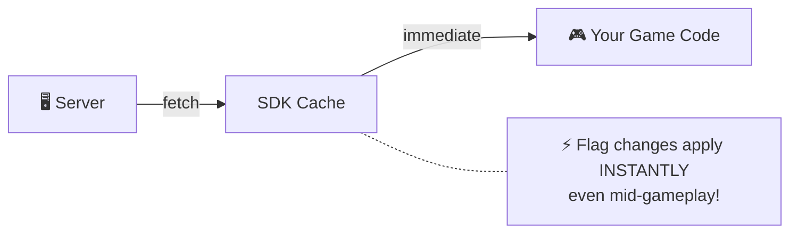
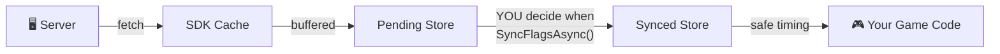

# Gatrix Unity SDK — Watch API & FlagProxy

---

## 👁️ Watching for Changes

Gatrix provides two families of watch methods for different use cases:

### Realtime Watching

**`WatchRealtimeFlag`** fires the callback **immediately** whenever a flag change is fetched from the server, regardless of `ExplicitSyncMode`. Use this for debug UIs, monitoring dashboards, or any case where you always want the latest server value.

```csharp
var features = GatrixBehaviour.Client.Features;

// Watch a flag — callback fires on every server-side change
var unsubscribe = features.WatchRealtimeFlag("game-speed", proxy =>
{
    Debug.Log($"Server changed game-speed to: {proxy.FloatVariation(1f)}");
});

// Stop watching
unsubscribe();

// Watch with initial state (callback fires immediately with current value, then on changes)
features.WatchRealtimeFlagWithInitialState("dark-mode", proxy =>
{
    ApplyTheme(proxy.Enabled ? "dark" : "light");
});
```

### Synced Watching

**`WatchSyncedFlag`** fires the callback only when the **synchronized** flag store is updated. When `ExplicitSyncMode` is enabled, synced watchers wait until you call `SyncFlagsAsync()` to deliver changes. When `ExplicitSyncMode` is disabled, synced watchers behave identically to realtime watchers.

```csharp
var features = GatrixBehaviour.Client.Features;

// Synced watch — in ExplicitSyncMode, callback fires only after SyncFlagsAsync()
features.WatchSyncedFlagWithInitialState("difficulty", proxy =>
{
    SetDifficulty(proxy.StringVariation("normal"));
});

// Apply changes at a safe point (e.g., between rounds)
await features.SyncFlagsAsync();
// ↑ At this point, synced watchers will fire with the latest values
```

### Realtime vs Synced — When to Use Which?

| | Realtime | Synced |
|---|---|---|
| **Callback timing** | Immediately on fetch | After `SyncFlagsAsync()` (in ExplicitSyncMode) |
| **Use case** | Debug UI, monitoring, non-disruptive changes | Gameplay-affecting values that need controlled timing |
| **ExplicitSyncMode off** | Fires on change | Fires on change (same as realtime) |
| **ExplicitSyncMode on** | Fires on change | Fires only after `SyncFlagsAsync()` |

### ⚠️ Why Synced Mode Matters (Real-World Scenarios)

Realtime mode is simple and convenient, but applying flag changes **instantly** can cause serious problems in production:

| Problem | Example | Impact |
|---------|---------|--------|
| **Mid-gameplay disruption** | Enemy HP multiplier changes in the middle of a boss fight | Player feels cheated; may suspect hacks or bugs |
| **Dependency conflicts** | UI layout flag updates before the data it depends on is loaded | Crash or visual corruption |
| **User trust** | Item drop rates change while player is farming | Player loses trust in game fairness |
| **Visual jarring** | Theme or UI layout shifts while player is reading | Frustrating, disorienting UX |
| **Competitive integrity** | Matchmaking params change during an active match | Unfair advantage/disadvantage |

> 💡 **Rule of thumb:** If a flag change could cause a player to notice "something just changed" in a disruptive way, use **Synced** mode and apply changes at a natural transition point (loading screens, between rounds, menu transitions).

### 📊 Flow Diagram: Realtime vs Synced

**Realtime Mode:**



**Synced Mode (ExplicitSyncMode):**



### `forceRealtime` Parameter

All flag accessor methods accept an optional `forceRealtime` parameter (default: `false`).

When `ExplicitSyncMode` is enabled:
- **`forceRealtime: false`** (default) — reads from the **synced** store (safe, controlled values)
- **`forceRealtime: true`** — reads from the **realtime** store (latest server values, bypassing sync)

```csharp
var features = GatrixBehaviour.Client.Features;

// Default: reads synced values (safe for gameplay)
bool isEnabled = features.IsEnabled("boss-buff");
float speed    = features.FloatVariation("game-speed", 1.0f);

// Force realtime: read the latest server value even if not yet synced
// Useful for debug UIs or monitoring alongside sync mode
bool latestValue = features.IsEnabled("boss-buff", forceRealtime: true);
float latestSpeed = features.FloatVariation("game-speed", 1.0f, forceRealtime: true);
```

> ⚠️ **When `ExplicitSyncMode` is disabled (default):**
> The `forceRealtime` parameter is **completely ignored**, and `WatchSyncedFlag` / `WatchRealtimeFlag` behave identically.
> There is no synced store — all reads and callbacks operate on a **single realtime store** at all times.
> `forceRealtime` is **only meaningful when `ExplicitSyncMode = true`**.

### Built-in Components and Sync Mode

All built-in zero-code components (`GatrixFlagToggle`, `GatrixFlagValue`, `GatrixFlagColor`, etc.) use **realtime** watching by default, so they react instantly to server changes.

If your project uses `ExplicitSyncMode`, consider the following:
- Components like `GatrixFlagToggle` on **non-gameplay UI** (settings panels, debug overlays) can stay realtime — they won't disrupt the player.
- For **gameplay-critical** components (difficulty modifiers, economy values), prefer using code-based `WatchSyncedFlag` so you control exactly when changes take effect.
- You can read the current synced value in code using the default accessor (without `forceRealtime`), and compare it with the realtime value to show a "pending update" indicator.

### FlagProxy — The Watch Callback Parameter

Every watch callback receives a **`FlagProxy`** — a lightweight wrapper bound to a specific flag name. It is the primary way to read flag values inside watch callbacks.

**Key characteristics:**
- `FlagProxy` does **not** hold a copy of the flag data — it always reads **live** from the client's cache at the moment you access it.
- It is bound to a single flag name at creation time, so you don't need to pass the flag name again.
- In `ExplicitSyncMode`, the proxy's `forceRealtime` mode is set automatically based on the watch type:
  - `WatchRealtimeFlag` → proxy reads from the **realtime** store
  - `WatchSyncedFlag` → proxy reads from the **synced** store

```csharp
features.WatchRealtimeFlagWithInitialState("difficulty", proxy =>
{
    // Properties
    bool exists    = proxy.Exists;          // Does the flag exist in cache?
    bool enabled   = proxy.Enabled;         // Is the flag enabled?
    string name    = proxy.Name;            // Flag name ("difficulty")
    bool isRT      = proxy.IsRealtime;      // true for realtime watchers

    // Typed value access (with safe fallback, never throws)
    string diff    = proxy.StringVariation("normal");
    bool   show    = proxy.BoolVariation(false);
    int    level   = proxy.IntVariation(1);
    float  speed   = proxy.FloatVariation(1.0f);
    double rate    = proxy.DoubleVariation(0.5);

    // Full variant info
    Variant v = proxy.Variant;
    Debug.Log($"Variant: {v.Name} = {v.Value}");

    // Evaluation details (includes reason)
    var details = proxy.BoolVariationDetails(false);
    Debug.Log($"Value: {details.Value}, Reason: {details.Reason}");

    // Metadata
    ValueType type = proxy.ValueType;
    int version    = proxy.Version;
    string reason  = proxy.Reason;
});
```

**FlagProxy API Summary:**

| Category | Member | Returns | Description |
|----------|--------|---------|-------------|
| **Properties** | `Name` | `string` | Flag name |
| | `Exists` | `bool` | Flag exists in cache |
| | `Enabled` | `bool` | Flag is enabled |
| | `Variant` | `Variant` | Full variant (name + value) |
| | `IsRealtime` | `bool` | Proxy reads from realtime store |
| | `ValueType` | `ValueType` | Value type (bool/string/number/json) |
| | `Version` | `int` | Flag evaluation version |
| | `Reason` | `string` | Evaluation reason |
| **Variations** | `BoolVariation(fallback)` | `bool` | Boolean value |
| | `StringVariation(fallback)` | `string` | String value |
| | `IntVariation(fallback)` | `int` | Integer value |
| | `FloatVariation(fallback)` | `float` | Float value |
| | `DoubleVariation(fallback)` | `double` | Double value |
| | `JsonVariation(fallback)` | `Dictionary` | JSON as Dictionary |
| **Details** | `BoolVariationDetails(fallback)` | `VariationResult<bool>` | Value + evaluation reason |
| | `StringVariationDetails(fallback)` | `VariationResult<string>` | Value + evaluation reason |
| **OrThrow** | `BoolVariationOrThrow()` | `bool` | Value or throws if missing |
| | `StringVariationOrThrow()` | `string` | Value or throws if missing |

### Watch Groups

Watch multiple flags as a group and unsubscribe them all at once:

```csharp
var features = GatrixBehaviour.Client.Features;

var group = features.CreateWatchGroup("ui-flags");
group.WatchRealtimeFlag("dark-mode",   p => { /* ... */ })
     .WatchRealtimeFlag("show-ads",    p => { /* ... */ })
     .WatchSyncedFlag("premium-ui",    p => { /* ... */ });

// Unwatch all at once
group.Destroy();
```

---
