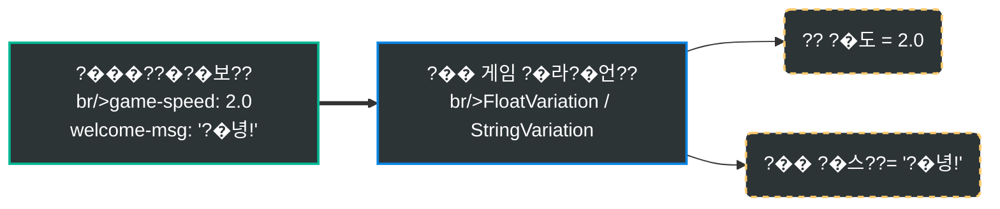
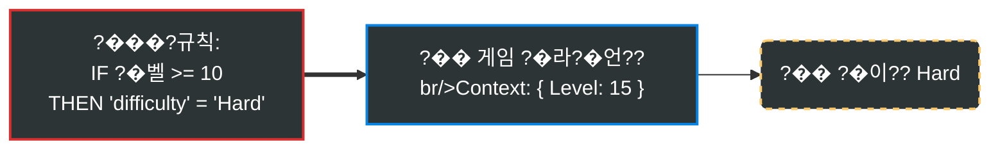

# Gatrix Unreal SDK

> **?�처 ?�래�? A/B ?�스?? ?�격 구성 ??Unreal Engine???�한 공식 Gatrix SDK?�니??**

Gatrix Unreal SDK�??�용?�면 ??빌드�?배포?��? ?�고??게임???�작???�시간으�??�어?????�습?�다. 기능 ?��?, A/B ?�험, 게임 ?�라미터 ?�닝, ?�진??롤아????모든 것을 Gatrix ?�?�보?�에???�행?????�습?�다.

## ?���??�처 ?�래그�??

?�처 ?�래그는 ??가지 ?�소�?구성?�니??

| ?�소 | ?�??| ?�명 |
|---|---|---|
| **?�태** (`enabled`) | `bool` | 기능??켜져 ?�는가, 꺼져 ?�는가 ??`IsEnabled()`�??�인 |
| **�?* (`variant`) | `boolean` `string` `number` `json` | ?��???구성 �???`BoolVariation()`, `StringVariation()`, `FloatVariation()`?�로 ?�음 |

?�래그는 **켜져 ?�으면서??* ?�정 값을 가�????�습?�다 (?? `difficulty = "hard"`). ?�태?� 값�? ?�립??????�� ??가지 모두 처리?�야 ?�니??

---

## ??Quick Examples

### 1. ?�처 ?��? (`IsEnabled`)
코드 배포 ?�이 기능??즉시 켜거???????�습?�다.


```cpp
UGatrixClient* Client = UGatrixClient::Get();

if (Client->GetFeatures()->IsEnabled(TEXT("new-shop")))
{
    // 기능??ON ?�태 -> ???�점 UI ?�시
    ShowNewShop();
}
else
{
    // 기능??OFF ?�태 (?�는 ?�래�??�음) -> 기존 ?�점?�로 ?�백
    ShowLegacyShop();
}
```

### 2. ?�격 구성 (`Variation`)
게임 밸런?? ?�스???�을 ?�격?�서 조정?�니??



```cpp
// float �?가?�오�?(?�정???�으�?기본�?1.0f ?�용)
float Speed = Client->GetFeatures()->FloatVariation(TEXT("game-speed"), 1.0f);

// string �?가?�오�?
FString Message = Client->GetFeatures()->StringVariation(TEXT("welcome-msg"), TEXT("?�영?�니??));
```

### 3. 조건부 ?�겟팅
?�정 ?�용??그룹(�??, ?�벨, ??버전 ???�게�??�른 값을 ?�공?�니??



```cpp
// ?�?�보?�의 규칙???�용??컨텍?�트(?? Level 15)�?기반?�로 값을 결정?�니??
// ?�라?�언?�는 ?�순??값을 ?�기�??�면 ?�니????로직?� ?�버???�습?�다!
FString Difficulty = Client->GetFeatures()->StringVariation(TEXT("difficulty"), TEXT("Normal"));
```

---

## ??주요 기능

- **?�처 ?�래�?* ???�시�??�래�??��? (?�링 + ?�트리밍)
- **?�트리밍** ??SSE / WebSocket ?�시�??�래�?갱신 + ?�동 ?�연�?
- **Variations** ??Bool, String, Float, Int, Double, JSON 배리?�이??
- **컨텍?�트** ??커스?� ?�성???�함???�적 ?��? 컨텍?�트
- **ETag 캐싱** ??조건부 ?�청?�로 ?�??�� 최소??
- **명시???�기??* ???�래�?변�??�용 ?�점 ?�어
- **Watch ?�턴** ???�래그별 변�?구독
- **메트�?* ???�동 ?�용 ?�계 보고
- **?�프?�션** ???�래�??�근 ?�벤??추적
- **블루?�린??지??* ??UCLASS/USTRUCT/UFUNCTION 기반 ?�전 ?�합
- **?�레???�전** ??Lock-free 카운?? atomic boolean, FCriticalSection

---

## ??Gatrix�??�용?�야 ?�는 ?�유

| Gatrix ?�이 | Gatrix?� ?�께 |
|---|---|
| �??�나 바꾸?�면 ??빌드 배포 | ?�?�보?�에???�시�?변�?|
| 모든 ?�레?�어가 같�? 경험 | A/B ?�스?�로 ?�양??경험 ?�공 |
| ?�드코딩???�처 ?�래�?| ?�시�??�격 구성 |
| ?�험??빅뱅 릴리??| 즉시 롤백 가?�한 ?�진??배포 |

### ?�� ?�전 ?�용 ?�나리오

#### ?�� 모바??콘솔 ?�사 ?�??
??기능??코드가 **?��? ?�함?�어 ?��?�?비활?�화???�태**�?빌드�??�출?�고, ?�사가 ?�인?????�?�보?�에??즉시 ?�성?�할 ???�습?�다.

#### ?�️ 규제 �?법규 준??(GDPR ??
???�데?�트 ?�이 **?�정 �???�서 기능??비활?�화**?�고, 규제 명령??**?�분 ?�에 ?�??*?????�습?�다.

#### ?�� 긴급 ???�위�?
?�로?�션?�서 문제가 발생?�을 ?????�래?��? ?�발?�는 기능, ?�스?�로?? ?�상�?못한 ?�버 부????**?�초 ?�에 비활?�화**?????�습?�다, ?�픽??빌드 ?�이.

#### ?�� A/B ?�스??
?�처 ?�래그�? ?�용?�여 그룹별로 ?�른 경험???�공?�고 결과�?측정?�세?? ?�이???�닝, ?�익???�험, ?�진??롤아????

---

## ?�� ?�치

1. `GatrixClientSDK` ?�더�??�로?�트??`Plugins/` ?�렉?�리??복사?�니??
2. ?�로?�트 ?�일???�생?�합?�다
3. 게임 모듈??`.Build.cs`??추�??�니??

```csharp
PublicDependencyModuleNames.AddRange(new string[] { "GatrixClientSDK" });
```

---

## ?? 빠른 ?�작 (C++)

```cpp
#include "GatrixClient.h"
#include "GatrixEvents.h"

// ?�정
FGatrixClientConfig Config;
Config.ApiUrl = TEXT("https://your-api.example.com/api/v1");
Config.ApiToken = TEXT("your-client-api-token");
Config.AppName = TEXT("MyGame");
Config.Environment = TEXT("production");

// 컨텍?�트 ?�정 (?�택)
Config.Context.UserId = TEXT("player-123");
Config.Context.SessionId = TEXT("session-abc");
Config.Context.Properties.Add(TEXT("level"), TEXT("5"));

// 초기??& ?�작
UGatrixClient* Client = UGatrixClient::Get();
Client->Init(Config);
Client->Start();

// Ready ?�벤???��?
Client->On(GatrixEvents::FlagsReady, [](const TArray<FString>& Args)
{
    UE_LOG(LogTemp, Log, TEXT("Gatrix SDK 준�??�료!"));
});

// ?�래�?변�?감�?
Client->On(GatrixEvents::FlagsChange, [Client](const TArray<FString>& Args)
{
    float GameSpeed = Client->GetFeatures()->FloatVariation(TEXT("game-speed"), 1.0f);
    int32 Difficulty = Client->GetFeatures()->IntVariation(TEXT("difficulty"), 1);
});

// 직접 ?�래�??�근
bool bFeatureOn = Client->GetFeatures()->IsEnabled(TEXT("new-feature"));
bool bBool = Client->GetFeatures()->BoolVariation(TEXT("my-flag"), false);
FString Str = Client->GetFeatures()->StringVariation(TEXT("theme"), TEXT("default"));
float Num = Client->GetFeatures()->FloatVariation(TEXT("speed"), 1.0f);
int32 Level = Client->GetFeatures()->IntVariation(TEXT("level"), 1);

// 종료
Client->Stop();
```

---

## ?? 빠른 ?�작 (블루?�린??

1. **"Get Gatrix Client"** ?�드�??��??�을 가?�옵?�다
2. **Init** ?�드??`GatrixClientConfig` 구조체�? ?�달?�니??
3. **Start** ?�드�??�칭???�작?�니??
4. **Bool Variation**, **String Variation** ?�으�??�래�?값을 ?�습?�다
5. **OnReady**, **OnChange**, **OnError** ?�벤?�에 바인?�합?�다

### 블루?�린???�벤??

| ?�벤??| ?�명 |
|-------|------|
| `OnReady` | �?번째 ?�공???�치 ?�료 |
| `OnChange` | ?�버?�서 ?�래�?변경됨 |
| `OnSync` | ?�래�??�기?�됨 (명시???�기??모드) |
| `OnRecovered` | SDK가 ?�러 ?�태??복구??|
| `OnError` | SDK ?�러 발생 |
| `OnImpression` | ?�래�??�프?�션 기록 |

---

## ?�� ?�처 ?�래�??�기

```cpp
auto* Features = Client->GetFeatures();

// Boolean 체크
bool bNewUI = Client->GetFeatures()->IsEnabled(TEXT("new-ui"));

// ?�?�별 ?�전??기본�?(?�외 발생 ?�음)
bool bShowBanner = Client->GetFeatures()->BoolVariation(TEXT("show-banner"), false);
FString Theme = Client->GetFeatures()->StringVariation(TEXT("app-theme"), TEXT("dark"));
int32 MaxRetries = Client->GetFeatures()->IntVariation(TEXT("max-retries"), 3);
float GameSpeed = Client->GetFeatures()->FloatVariation(TEXT("game-speed"), 1.0f);
double DropRate = Client->DoubleVariation(TEXT("item-drop-rate"), 0.05);

// ?�체 배리?�트 ?�보 (?�름 + �?
FGatrixVariant Variant = Features->GetVariant(TEXT("experiment-a"));
UE_LOG(LogTemp, Log, TEXT("Variant: %s, Value: %s"), *Variant.Name, *Variant.Value);

// ?�래�??�록??(?�세 ?�보)
UGatrixFlagProxy* Proxy = Features->GetFlag(TEXT("feature-x"));
if (Proxy)
{
    UE_LOG(LogTemp, Log, TEXT("Enabled: %s, Reason: %s"),
        Proxy->IsEnabled() ? TEXT("true") : TEXT("false"),
        *Proxy->GetReason());
}
```

---

## ?���?변�?감�? (Watch)

Gatrix????가지 Watch 방식???�공?�니??

| 메서??| 콜백 발생 ?�점 |
|---|---|
| `WatchRealtimeFlag` | ?�버 ?�치 ??즉시 |
| `WatchSyncedFlag` | `SyncFlags()` ?�출 ??(`ExplicitSyncMode = true`???? |

```cpp
auto* Features = Client->GetFeatures();

// 리얼?�????변�?즉시 발생   (?�버�?UI, 비게?�플?�이??
FGatrixFlagWatchDelegate RealtimeCallback;
RealtimeCallback.BindLambda([](UGatrixFlagProxy* Proxy)
{
    UE_LOG(LogTemp, Log, TEXT("Flag changed: %s = %s"),
        *Proxy->GetName(), Proxy->IsEnabled() ? TEXT("ON") : TEXT("OFF"));
});
int32 WatchHandle = Features->WatchRealtimeFlag(TEXT("dark-mode"), RealtimeCallback);

// 초기 ?�태 ?�함 (?�록 즉시 ?�재 값으로도 콜백)
int32 WatchHandle2 = Features->WatchRealtimeFlagWithInitialState(
    TEXT("difficulty"), RealtimeCallback);

// ?�기????SyncFlags() ?�출 ??발생 (게임?�레???�전)
int32 SyncHandle = Features->WatchSyncedFlag(TEXT("difficulty"), SyncedCallback);

// Watch ?�제
Features->UnwatchFlag(WatchHandle);
```

---

## ?�� 컨텍?�트 관�?

### 컨텍?�트?�?

**컨텍?�트**??**?�재 ?�용?��? �??�경**???�명?�는 ?�성?�의 집합?�니?? Gatrix ?�버??컨텍?�트�??�용?�여 �??�래그에 ?�???�떤 배리?�트�?반환?��? 결정?�니??

### 컨텍?�트 ?�드

| ?�드 | ?�??| ?�명 |
|------|------|------|
| `AppName` | `FString` | ???�름 (초기?????�정, 변�?불�?) |
| `Environment` | `FString` | ?�경 ?�름 (초기?????�정, 변�?불�?) |
| `UserId` | `FString` | 고유 ?�용???�별?????�겟팅??가??중요 |
| `SessionId` | `FString` | ?�션 범위 ?�험???�한 ?�션 ?�별??|
| `Properties` | `TMap<FString, FString>` | 커스?� ??�???|

### 컨텍?�트 ?�데?�트

```cpp
// 초기 ?�정 (Init ??
Config.Context.UserId = TEXT("player-123");
Config.Context.Properties.Add(TEXT("level"), TEXT("5"));

// ?��???�??�데?�트
FGatrixContext NewContext;
NewContext.UserId = TEXT("player-456");
NewContext.Properties.Add(TEXT("level"), TEXT("42"));
NewContext.Properties.Add(TEXT("country"), TEXT("KR"));
Client->UpdateContext(NewContext);

// ?�일 ?�드 ?�데?�트
Client->GetFeatures()->SetContextField(TEXT("level"), TEXT("43"));

// ?�드 ?�거
Client->GetFeatures()->RemoveContextField(TEXT("trialUser"));
```

> ?�️ **모든 컨텍?�트 변경�? ?�동 ?�페치�? ?�리거합?�다.** 반복�??�에??컨텍?�트�??�데?�트?��? 마세?? ?�러 ?�드�??�시??변경하?�면 `UpdateContext`�??�용?�세??

---

## ?�️ 명시???�기??모드 (Explicit Sync Mode)

?�래�?변경이 게임???�용?�는 ?�점???�확???�어?�니????**?�이�?게임???�한 가??중요??기능**?�니??

```cpp
// ?�정
Config.Features.bExplicitSyncMode = true;

// ?�기??Watch: SyncFlags() ?�출 ?�에�?콜백 발생
Features->WatchSyncedFlagWithInitialState(TEXT("difficulty"), SyncCallback);

// ?�전???�점??변�??�용 (로딩 ?�면, ?�운???�이)
if (Features->HasPendingSyncFlags())
{
    Features->SyncFlags(false); // fetchNow = false
}
```

### 권장 ?�기???�점

| ?�기???�점 | ?�시 |
|---|---|
| **로딩 ?�면** | ???�환, ?�벨 로딩 |
| **?�운???�이** | 매치 종료 ?? ?�음 ?�운???�작 ??|
| **메뉴/?�시?��?** | ?�정?�나 ?�벤?�리�?????|
| **리스??* | ?�레?�어 ?�망 ?? ?�음 ?�폰 ??|
| **로비** | 매치 ?�작 ?? 캐릭???�택 ?�면 |

---

## ?�� ?�트리밍 ?�정

SSE ?�는 WebSocket ?�트리밍?�로 거의 즉각?�인 ?�래�??�데?�트�?받습?�다.

```cpp
// SSE ?�트리밍 (기본)
Config.Features.Streaming.bEnabled = true;
Config.Features.Streaming.Transport = EGatrixStreamingTransport::Sse;
Config.Features.Streaming.Sse.ReconnectBase = 1;  // �?
Config.Features.Streaming.Sse.ReconnectMax = 30;   // �?

// ?�는 WebSocket ?�트리밍
Config.Features.Streaming.Transport = EGatrixStreamingTransport::WebSocket;
Config.Features.Streaming.WebSocket.PingInterval = 30;   // �?
Config.Features.Streaming.WebSocket.ReconnectBase = 1;
Config.Features.Streaming.WebSocket.ReconnectMax = 30;

// ?�트리밍 ?�벤??리스??
Client->On(GatrixEvents::FlagsStreamingConnected, [](const TArray<FString>& Args)
{
    UE_LOG(LogTemp, Log, TEXT("?�트리밍 ?�결??"));
});

Client->On(GatrixEvents::FlagsStreamingError, [](const TArray<FString>& Args)
{
    UE_LOG(LogTemp, Warning, TEXT("?�트리밍 ?�러: %s"),
        Args.Num() > 0 ? *Args[0] : TEXT("unknown"));
});
```

---

## ?�� ?�벤??

```cpp
// ?�벤??구독
Client->On(GatrixEvents::FlagsReady, [](const TArray<FString>& Args)
{
    UE_LOG(LogTemp, Log, TEXT("SDK 준�??�료"));
});

Client->On(GatrixEvents::FlagsChange, [](const TArray<FString>& Args)
{
    UE_LOG(LogTemp, Log, TEXT("?�래�??�데?�트??));
});

Client->On(GatrixEvents::SdkError, [](const TArray<FString>& Args)
{
    UE_LOG(LogTemp, Error, TEXT("SDK ?�러"));
});

// ??번만 구독
Client->Once(GatrixEvents::FlagsReady, [](const TArray<FString>& Args)
{
    ShowWelcomeScreen();
});

// 모든 ?�벤??구독 (?�버깅에 ?�용)
Client->OnAny([](const FString& EventName, const TArray<FString>& Args)
{
    UE_LOG(LogTemp, Log, TEXT("[Gatrix] %s"), *EventName);
});
```

### ?�벤???�수

| ?�수 | �?| ?�명 |
|------|-----|------|
| `GatrixEvents::FlagsInit` | `flags.init` | SDK 초기?�됨 (?�토리�?/부?�스?�랩) |
| `GatrixEvents::FlagsReady` | `flags.ready` | �??�공???�치 ?�료 |
| `GatrixEvents::FlagsFetchStart` | `flags.fetch_start` | ?�치 ?�작 |
| `GatrixEvents::FlagsFetchSuccess` | `flags.fetch_success` | ?�치 ?�공 |
| `GatrixEvents::FlagsFetchError` | `flags.fetch_error` | ?�치 ?�러 |
| `GatrixEvents::FlagsFetchEnd` | `flags.fetch_end` | ?�치 ?�료 (?�공/?�러) |
| `GatrixEvents::FlagsChange` | `flags.change` | ?�버?�서 ?�래�?변�?|
| `GatrixEvents::SdkError` | `flags.error` | SDK ?�러 |
| `GatrixEvents::FlagsImpression` | `flags.impression` | ?�래�??�프?�션 |
| `GatrixEvents::FlagsSync` | `flags.sync` | ?�래�??�기?�됨 |
| `GatrixEvents::FlagsPendingSync` | `flags.pending_sync` | 보류 중인 ?�기??|
| `GatrixEvents::FlagsRecovered` | `flags.recovered` | ?�러 ?�태?�서 복구 |
| `GatrixEvents::FlagsMetricsSent` | `flags.metrics_sent` | 메트�??�송 ?�료 |
| `GatrixEvents::FlagsMetricsError` | `flags.metrics_error` | 메트�??�송 ?�러 |
| `GatrixEvents::FlagsStreamingConnected` | `flags.streaming_connected` | ?�트리밍 ?�결 |
| `GatrixEvents::FlagsStreamingDisconnected` | `flags.streaming_disconnected` | ?�트리밍 ?�결 ?��? |
| `GatrixEvents::FlagsStreamingError` | `flags.streaming_error` | ?�트리밍 ?�러 |
| `GatrixEvents::FlagsStreamingReconnecting` | `flags.streaming_reconnecting` | ?�트리밍 ?�연�?�?|
| `GatrixEvents::FlagsInvalidated` | `flags.invalidated` | ?�트리밍???�한 ?�래�?무효??|
| `GatrixEvents::FlagsRemoved` | `flags.removed` | ?�버?�서 ?�래�???�� |

---

## ?���??�키?�처

```
UGatrixClient (?��???
?��??� FGatrixEventEmitter (?�레???�전: on/once/off/onAny)
?��??� IGatrixStorageProvider (?�러그인 ?�토리�?)
?��??� UGatrixFeaturesClient
    ?��??� HTTP Fetching (FHttpModule + ETag)
    ?��??� Flag Storage (FCriticalSection 보호)
    ?��??� Polling (UWorld TimerManager + 지??
    ?��??� Streaming
    ??  ?��??� FGatrixSseConnection (SSE via FHttpModule progress)
    ??  ?��??� FGatrixWebSocketConnection (IWebSocket + ping/pong)
    ??  ?��??� Gap Recovery (globalRevision 추적)
    ??  ?��??� Auto-Reconnect (지??백오??+ 지??
    ?��??� Metrics (배치 POST + ?�시??
    ?��??� Watch Pattern (?�래그별 ?�벤??
    ?��??� Blueprint Delegates
```

---

## ?�� ?�레???�전??

- ?�래�??�기/?�기??`FCriticalSection`?�로 보호
- ?�계 카운?�는 Lock-free `FThreadSafeCounter` ?�용 (??경합 ?�음)
- Boolean ?�태 ?�래그는 `std::atomic<bool>`�?Lock-free ?�근
- HTTP 콜백?� 게임 ?�레?�에??처리 (UE FHttpModule ?�작)
- ?�트리밍 콜백?� `AsyncTask`�??�해 게임 ?�레?�로 ?�스?�치
- ?�벤??발행: ???�래?�서 콜백 ?�집 ?????�제 ???�출 (?�드??방�?)
- ?�토리�? ?�로바이??(InMemory)???�체 `FCriticalSection` ?�용

---

## ?�️ ?�정 ?�퍼?�스

| ?�드 | ?�??| 기본�?| ?�명 |
|------|------|--------|------|
| `ApiUrl` | FString | - | 베이??API URL (?�수) |
| `ApiToken` | FString | - | ?�라?�언??API ?�큰 (?�수) |
| `AppName` | FString | - | ?�플리�??�션 ?�름 (?�수) |
| `Environment` | FString | - | ?�경 ?�름 (?�수) |
| `bOfflineMode` | bool | false | ?�프?�인 모드�??�작 |
| `bEnableDevMode` | bool | false | 개발 모드 ?�성??|
| `Features.RefreshInterval` | float | 30.0 | ?�링 간격 (�? |
| `Features.bDisableRefresh` | bool | false | ?�동 ?�링 비활?�화 |
| `Features.bExplicitSyncMode` | bool | false | ?�동 ?�래�??�기??|
| `Features.bDisableMetrics` | bool | false | 메트�?비활?�화 |
| `Features.bImpressionDataAll` | bool | false | 모든 ?�래�??�프?�션 추적 |
| `Features.bUsePOSTRequests` | bool | false | ?�칭??POST ?�청 ?�용 |
| `Features.Streaming.bEnabled` | bool | false | ?�트리밍 ?�성??|
| `Features.Streaming.Transport` | enum | Sse | SSE ?�는 WebSocket |
| `Features.Streaming.Sse.Url` | FString | auto | 커스?� SSE ?�드?�인??|
| `Features.Streaming.Sse.ReconnectBase` | int32 | 1 | 기본 ?�연�??�레??(�? |
| `Features.Streaming.Sse.ReconnectMax` | int32 | 30 | 최�? ?�연�??�레??(�? |
| `Features.Streaming.WebSocket.Url` | FString | auto | 커스?� WS ?�드?�인??|
| `Features.Streaming.WebSocket.PingInterval` | int32 | 30 | ??간격 (�? |
| `Features.Streaming.WebSocket.ReconnectBase` | int32 | 1 | 기본 ?�연�??�레??(�? |
| `Features.Streaming.WebSocket.ReconnectMax` | int32 | 30 | 최�? ?�연�??�레??(�? |

---

## ?���??��? 모델: ?�격 ?��? ?�용

Gatrix??**?�격 ?��?** 방식만을 ?�용?�니?????�겟팅 규칙�?롤아??로직?� ?��? ?�버 밖으�??��?지 ?�습?�다.

1. SDK가 **컨텍?�트**(userId, env, properties)�??�버�??�송
2. ?�버가 모든 규칙???��??�고 **최종 ?�래�?값만** 반환
3. SDK가 결과�?캐시?�고 ?�기?�으�??�공

| | ?�격 ?��? (Gatrix) | 로컬 ?��? |
|---|---|---|
| **보안** | ??규칙???�버 밖으�??��?지 ?�음 | ?�️ ?�라?�언?�에 규칙 ?�출 |
| **?��???* | ??모든 SDK?�서 ?�일??결과 | ?�️ �?SDK가 규칙???�구?�해????|
| **?�이로드** | ???�규�?(최종 값만) | ?�️ ?�규모 (?�체 규칙 ?�트) |
| **?�프?�인** | ?�️ 최소 1???�결 ?�요 | ??규칙??빌드 ?�점??번들�?가??|

> ?�� **?�프?�인 & 가?�성:** SDK???�버???�결?????�을 ????�� 로컬 캐시?�서 값을 ?�공?�니?? fallbackValue�??�트?�크 문제�??�한 게임 중단?� ?��? 발생?��? ?�습?�다.

---

## ?�� ?�구 ?�항

- Unreal Engine 4.27+
- C++ ?�로?�트 (Blueprint ?�용 ?�로?�트??지??

---

## ?�� ?�이?�스

Copyright Gatrix. All Rights Reserved.
