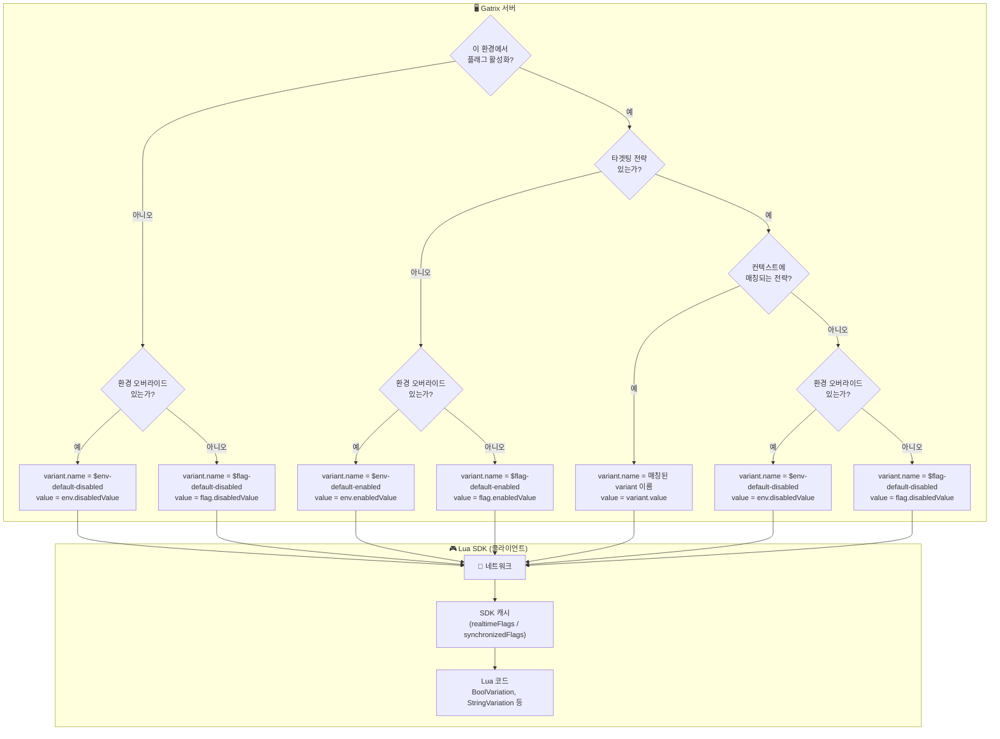
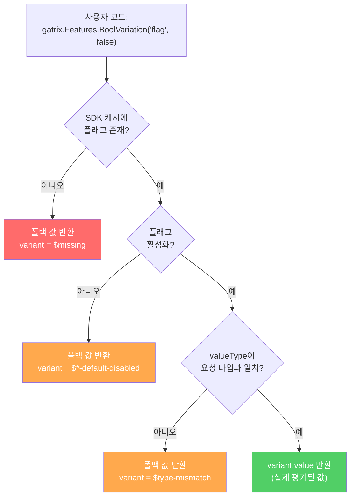
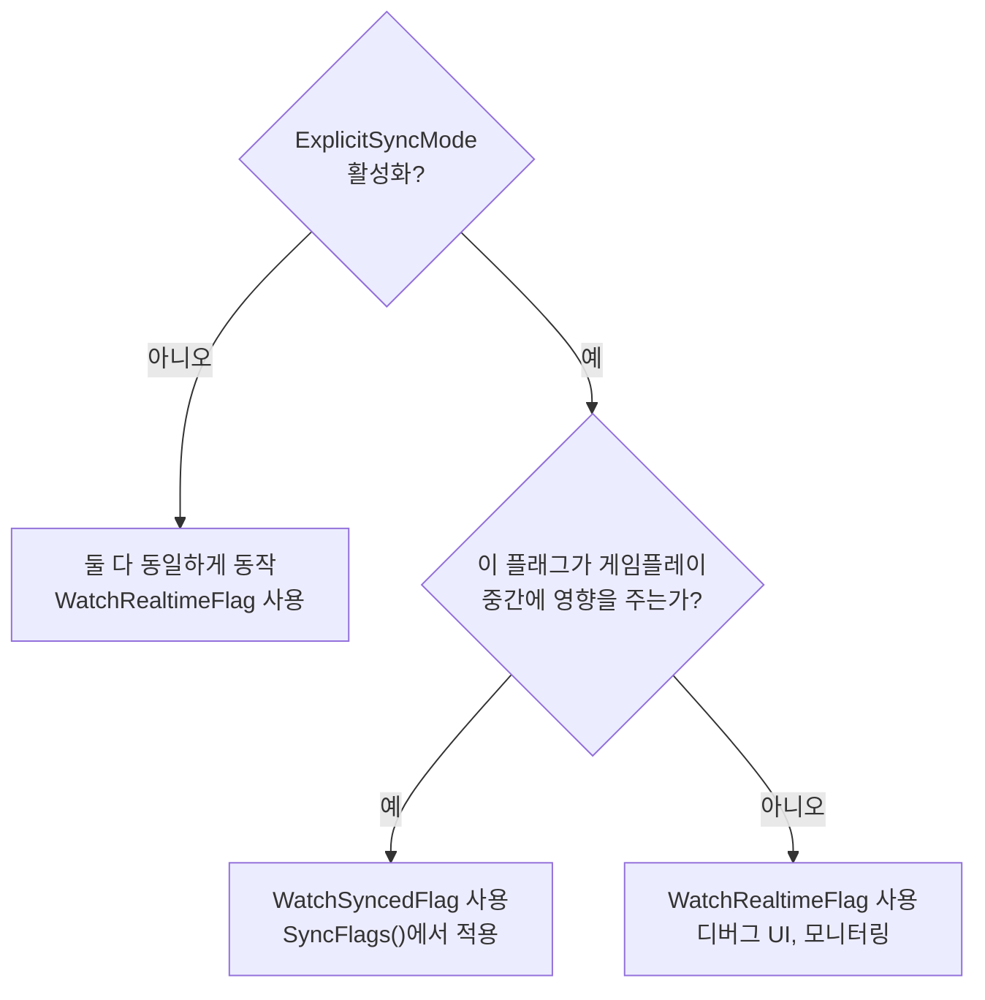

# Gatrix Lua SDK for Unreal Engine

> **피처 플래그, A/B 테스트, 원격 설정 — Unreal Engine용 공식 Gatrix Lua 바인딩.**

Gatrix Unreal SDK를 Lua 스크립트에서 사용할 수 있는 바인딩 플러그인입니다. **순수 Lua C API** (`lua_State*`) 기반으로 피처 플래그, 변형값, 컨텍스트, 이벤트, 워치 기능을 제공합니다.

### ⚡ 빠른 예시

#### 1. 피처 토글 (`IsEnabled`)

코드 배포 없이 기능을 즉시 켜고 끕니다.

```lua
if gatrix.Features.IsEnabled("new-shop") then
    -- 기능이 ON → 새로운 상점 UI 표시
    ShowNewShop()
end
```

#### 2. 원격 설정 (타입별 Variation)

게임플레이 값을 원격으로 조정합니다. string, number, boolean, JSON을 지원합니다.

```lua
-- 숫자 값 가져오기 (설정되지 않은 경우 기본값 1.0)
local Speed = gatrix.Features.FloatVariation("game-speed", 1.0)

-- 문자열 값 가져오기
local Message = gatrix.Features.StringVariation("welcome-msg", "Welcome")

-- 불리언 값 가져오기
local DarkMode = gatrix.Features.BoolVariation("dark-mode", false)
```

#### 3. 실시간 변경 감지

서버에서 푸시된 플래그 변경에 반응합니다:

```lua
gatrix.Features.WatchSyncedFlagWithInitialState("difficulty", function(Proxy)
    SetDifficulty(Proxy.Variant.Value)
end)
```

> 빌드도 배포도 필요 없습니다 — Gatrix 대시보드에서 값을 변경하면 즉시 반영됩니다.

---

## ✨ 왜 Gatrix인가?

| Gatrix 없이 | Gatrix와 함께 |
|---|---|
| 값 하나 바꾸려면 새 빌드 배포 | 대시보드에서 실시간 변경 |
| 모든 플레이어에게 동일한 경험 | A/B 테스트로 다른 경험 제공 |
| 하드코딩된 피처 플래그 | 실시간 원격 설정 |
| 위험한 빅뱅 릴리스 | 점진적 배포 + 즉시 롤백 |

### 🎯 핵심 시나리오

- **📱 모바일 앱 스토어 심사** — 기능 비활성화 상태로 제출, 승인 후 즉시 활성화. 재심사 불필요.
- **⚖️ 규제 대응** — 법률 변경 시 (GDPR, COPPA 등) 지역별로 기능 즉시 비활성화.
- **🚨 비상 킬 스위치** — 크래시를 유발하는 기능을 몇 초 만에 비활성화. 핫픽스 빌드 불필요.
- **🧪 A/B 테스트** — 다른 그룹에 다른 변형값을 보여주고 영향을 측정.
- **🤷 불확실한 타이밍** — 코드는 항상 준비 완료; 비즈니스가 출시 시점을 결정.

---

## 🏗️ 평가 모델: 원격 평가 전용

Gatrix 클라이언트 SDK들은 **원격 평가(Remote Evaluation)** 방식만 사용합니다:

1. SDK가 **컨텍스트** (userId, environment, properties)를 Gatrix 서버에 전송합니다.
2. 서버가 모든 타겟팅 규칙을 **원격으로** 평가합니다.
3. SDK는 **최종 평가된 플래그 값만** 수신합니다 — 규칙은 클라이언트에 노출되지 않습니다.

| | 원격 평가 (Gatrix) | 로컬 평가 |
|---|---|---|
| **보안** | ✅ 규칙이 서버를 벗어나지 않음 | ⚠️ 규칙이 클라이언트에 노출 |
| **일관성** | ✅ 모든 SDK에서 동일한 결과 | ⚠️ 각 SDK가 로직을 재구현해야 함 |
| **페이로드** | ✅ 최종 값만 전송 (작음) | ⚠️ 전체 규칙 세트 (큼) |
| **오프라인** | ⚠️ 캐시된 값 또는 부트스트랩 | ✅ 다운로드 후 완전 오프라인 |

> 💡 SDK는 마지막으로 알려진 값을 로컬에 캐시합니다. 네트워크 문제로 게임이 멈추지 않습니다 — 캐시 또는 부트스트랩 값으로 폴백합니다.

---

## 🔍 플래그 값 결정 흐름

### 값 출처 우선순위 (원격)



| 우선순위 | 조건 | 값 출처 | `variant.name` |
|:---:|---|---|:---|
| 1 | 플래그 활성화 + 전략 매칭 | `variant.value` | Variant 이름 (예: `"dark-theme"`) |
| 2 | 플래그 활성화 + 매칭 없음 + 환경 오버라이드 | `env.enabledValue` | `$env-default-enabled` |
| 3 | 플래그 활성화 + 매칭 없음 + 오버라이드 없음 | `flag.enabledValue` | `$flag-default-enabled` |
| 4 | 플래그 비활성화 + 환경 오버라이드 | `env.disabledValue` | `$env-default-disabled` |
| 5 | 플래그 비활성화 + 오버라이드 없음 | `flag.disabledValue` | `$flag-default-disabled` |
| 6 | 플래그 없음 | 응답에 미포함 | `$missing` |

### SDK 측: 코드에서 값을 받는 방식



### FallbackValue가 필수인 이유

`FallbackValue` 파라미터는 **의도적으로 필수**입니다 — 게임이 **항상** 사용 가능한 값을 받습니다:

1. **SDK 미초기화** — 아직 연결 중 → 폴백으로 게임 유지
2. **플래그 미존재** — 오타 또는 삭제된 플래그 → 크래시 없음
3. **네트워크 장애** — 서버 없음, 캐시 없음 → 여전히 동작
4. **타입 불일치** — string 플래그에 `BoolVariation` 호출 → 안전한 기본값
5. **플래그 비활성화** — 플래그 OFF → variant 값 대신 폴백 반환

```lua
-- ⚠️ 기본값 없는 오버로드는 없습니다. 문제 발생 시 어떤 값을 사용할지 반드시 명시해야 합니다.
local Speed = gatrix.Features.FloatVariation("game-speed", 1.0)  -- 문제가 생기면 1.0
```

### IsEnabled vs BoolVariation

이 두 함수는 **서로 다른 목적**을 가집니다 — 혼동하지 마세요:

| 함수 | 반환값 | 목적 |
|---|---|---|
| `gatrix.Features.IsEnabled("flag")` | `flag.enabled` | 피처 플래그가 **켜져 있는가**? |
| `gatrix.Features.BoolVariation("flag", false)` | `variant.value` (boolean) | 플래그가 평가한 **불리언 값**은? |

```lua
-- 플래그가 활성화되어 있지만 불리언 값이 false일 수 있습니다!
-- enabled=true, variant.value=false → "기능은 ON이지만 불리언 설정값은 false"
local IsOn = gatrix.Features.IsEnabled("my-flag")             -- true (플래그 ON)
local Value = gatrix.Features.BoolVariation("my-flag", true)   -- false (설정된 값)
```

---

## 특징

- **순수 Lua C API** — 게임 엔진 전용 Lua 래퍼에 의존하지 않음
- **메모리 안전 콜백** — `TSharedPtr<bool>` alive 플래그로 댕글링 포인터 방지
- **전체 SDK 커버리지** — 초기화, 플래그, 변형값, 컨텍스트, 이벤트, 워치, 워치 그룹, 동기화
- **자동 정리** — `Unregister()`가 모든 참조를 해제하고 콜백을 무효화

## 플러그인 구조

```
gatrix-unreal-lua-sdk/
├── GatrixLuaSDK.uplugin
├── README.md
├── README.ko.md
└── Source/GatrixLuaSDK/
    ├── GatrixLuaSDK.Build.cs
    ├── Public/
    │   ├── GatrixLuaSDKModule.h
    │   └── LuaGatrix.h
    └── Private/
        ├── GatrixLuaSDKModule.cpp
        └── LuaGatrix.cpp
```

## 통합 방법

### 1. 프로젝트에 플러그인 추가

`gatrix-unreal-lua-sdk` 폴더를 프로젝트의 `Plugins/` 디렉토리에 `gatrix-unreal-sdk` 플러그인과 함께 복사합니다.

### 2. 플러그인 의존성 활성화

프로젝트의 `.uproject` 또는 게임 모듈 `.Build.cs`에서:

```csharp
// YourGame.Build.cs
PublicDependencyModuleNames.AddRange(new string[] {
    "GatrixSDK",
    "GatrixLuaSDK"
});
```

### 3. Lua 모듈 경로

프로젝트에서 `Lua`가 아닌 다른 이름의 Lua 모듈을 사용하는 경우, `GatrixLuaSDK.Build.cs`를 수정합니다:

```csharp
PublicDependencyModuleNames.Add("커스텀Lua모듈이름");
```

### 4. C++에서 등록

```cpp
#include "LuaGatrix.h"

// Lua VM이 준비되면
FGatrixLuaBindings::Register(YourLuaState);

// lua_close() 전에 반드시 호출 — 메모리 누수 방지
FGatrixLuaBindings::Unregister(YourLuaState);
```

## Lua API 레퍼런스

> **API 구조:**
> - `gatrix.*` — 라이프사이클, 컨텍스트, 이벤트 (SDK 수준)
> - `gatrix.Features.*` — 피처 플래그, 변형값, 워치, 동기화
>
> `gatrix.Features.IsEnabled(...)` 형태의 전역 접근과 `local Gatrix = require("gatrix")` 모두 가능합니다.

### 라이프사이클

```lua
--- SDK를 초기화합니다 (Start 전에 호출 필수)
--- @param Config table  -- 설정 테이블
gatrix.Init({
    ApiUrl          = "http://host/api/v1",  -- string   Edge API URL
    ApiToken        = "your-client-token",   -- string   클라이언트 API 토큰
    AppName         = "my-game",             -- string   애플리케이션 이름
    Environment     = "production",          -- string   환경 이름
    RefreshInterval  = 30,     -- number?  폴링 간격(초) (기본값: 30)
    DisableRefresh   = false,  -- boolean? 자동 폴링 비활성화
    ExplicitSyncMode = false,  -- boolean? 명시적 동기화 모드 활성화
    DisableMetrics   = false,  -- boolean? 서버 측 메트릭 비활성화
    ImpressionDataAll = false, -- boolean? 모든 플래그에 대해 노출 추적
    EnableDevMode    = false,  -- boolean? 상세 디버그 로깅 활성화
    OfflineMode      = false,  -- boolean? 네트워크 요청 없이 시작
})

--- SDK를 시작합니다 (페칭, 폴링, 메트릭 시작)
gatrix.Start()

--- SDK를 중지합니다 (폴링 중지, 정리)
gatrix.Stop()
```

### 플래그 접근 (`gatrix.Features`)

```lua
--- 플래그 활성화 여부를 확인합니다
--- @param FlagName string
--- @return boolean
local Enabled = gatrix.Features.IsEnabled("my_flag")

--- 배리언트 이름(string)을 가져옵니다
--- @param FlagName string
--- @param Fallback string
--- @return string
local VariantName = gatrix.Features.Variation("my_flag", "default")

--- 원시 플래그 데이터를 EvaluatedFlag 테이블로 가져옵니다
--- @param FlagName string
--- @return EvaluatedFlag
local Flag = gatrix.Features.GetFlag("my_flag")

--- 플래그의 변형값을 가져옵니다 (nil이 아님)
--- @param FlagName string
--- @return Variant
local Variant = gatrix.Features.GetVariant("my_flag")

--- 모든 평가된 플래그를 가져옵니다
--- @return EvaluatedFlag[]
local Flags = gatrix.Features.GetAllFlags()

--- 플래그가 캐시에 존재하는지 확인합니다
--- @param FlagName string
--- @return boolean
local Exists = gatrix.Features.HasFlag("my_flag")
```

### 타입이 지정된 변형값 (`gatrix.Features`)

```lua
--- @param FlagName     string
--- @param FallbackValue boolean
--- @return boolean
local BoolVal = gatrix.Features.BoolVariation("flag", false)

--- @param FlagName     string
--- @param FallbackValue string
--- @return string
local StrVal = gatrix.Features.StringVariation("flag", "default")

--- @param FlagName     string
--- @param FallbackValue integer
--- @return integer
local IntVal = gatrix.Features.IntVariation("flag", 0)

--- @param FlagName     string
--- @param FallbackValue number
--- @return number
local FloatVal = gatrix.Features.FloatVariation("flag", 0.0)

--- 상세 평가 결과를 가져옵니다
--- @return {Value: any, Reason: string, FlagExists: boolean, Enabled: boolean}
local Result = gatrix.Features.BoolVariationDetails("flag", false)

--- 값을 가져오거나 실패 시 Lua 에러 발생
--- @return boolean
local MustExist = gatrix.Features.BoolVariationOrThrow("critical_flag")
```

### 반환 테이블 구조

> **`Variant.Value`는 `ValueType`에 따라 네이티브 Lua 타입으로 자동 변환됩니다.**
> 직접 파싱할 필요 없이 `boolean`, `number`, `string`을 그대로 받습니다.

**ValueType 열거형:**

| 값 | 타입 | `Value`의 Lua 타입 |
|---|---|---|
| `0` | string | `string` |
| `1` | number | `number` |
| `2` | boolean | `boolean` |
| `3` | json | `string` (JSON 인코딩, `json.decode(Value)` 사용) |

**Variant:**

| 필드 | 타입 | 설명 |
|---|---|---|
| `Name` | `string` | 변형값 이름 (예: `"dark-theme"`, `"$flag-default-enabled"`) |
| `Enabled` | `boolean` | 이 변형값이 활성화 상태인지 여부 |
| `Value` | `boolean` / `number` / `string` | 변형값 값. `ValueType`에 따라 자동으로 타입이 결정됩니다. |

```lua
-- 예시: boolean 플래그 → Value는 Lua boolean
{
    Name    = "dark-theme",
    Enabled = true,
    Value   = true,       -- boolean ("true" 문자열이 아님)
}

-- 예시: number 플래그 → Value는 Lua number
{
    Name    = "$flag-default-enabled",
    Enabled = true,
    Value   = 3,          -- number ("3" 문자열이 아님)
}
```

**EvaluatedFlag:**

| 필드 | 타입 | 설명 |
|---|---|---|
| `Name` | `string` | 플래그 이름 |
| `Enabled` | `boolean` | 플래그 활성화 여부 |
| `Variant` | `Variant` | 변형값 서브 테이블 (위 참조) |
| `ValueType` | `integer` | 값 타입 열거형 (`0`=string, `1`=number, `2`=boolean, `3`=json) |
| `Version` | `integer` | 플래그 버전 번호 |
| `Reason` | `string` | 평가 사유 (예: `"evaluated"`, `"default"`, `"not-found"`) |
| `ImpressionData` | `boolean` | 이 플래그에 대해 노출 추적이 활성화되었는지 여부 |

```lua
-- 예시: number 타입 플래그
local Flag = gatrix.Features.GetFlag("max_retries")
-- Flag.ValueType == 1, Flag.Variant.Value는 이미 number
local MaxRetries = Flag.Variant.Value  -- 3 (number, tonumber() 불필요)
```

**FlagProxy** (워치 콜백에서 제공):

| 필드 | 타입 | 설명 |
|---|---|---|
| `Name` | `string` | 플래그 이름 |
| `Enabled` | `boolean` | 플래그 활성화 여부 |
| `Exists` | `boolean` | 플래그가 캐시에 존재하는지 여부 |
| `Realtime` | `boolean` | 이 프록시가 실시간 플래그에서 읽는지 (동기화된 것이 아닌) |
| `Variant` | `Variant` | 변형값 서브 테이블 (위 참조) |
| `ValueType` | `integer` | 값 타입 열거형 (`0`=string, `1`=number, `2`=boolean, `3`=json) |
| `Version` | `integer` | 플래그 버전 번호 |
| `Reason` | `string` | 평가 사유 |

```lua
-- 예시: 워치 콜백
gatrix.Features.WatchRealtimeFlag("theme_color", function(Proxy)
    -- Proxy.ValueType == 0 (string), Value는 Lua string
    local Color = Proxy.Variant.Value  -- "blue"
    print("Theme:", Color)
end)

gatrix.Features.WatchRealtimeFlag("dark_mode", function(Proxy)
    -- Proxy.ValueType == 2 (boolean), Value는 Lua boolean
    if Proxy.Variant.Value then
        enableDarkMode()
    end
end)
```

**VariationResult** (`*Details`에서 제공):

| 필드 | 타입 | 설명 |
|---|---|---|
| `Value` | `any` | 플래그 값 (boolean/string/number) |
| `Reason` | `string` | 평가 사유 |
| `FlagExists` | `boolean` | 캐시에 플래그 존재 여부 |
| `Enabled` | `boolean` | 플래그 활성화 여부 |


### 예약된 Variant 이름

SDK는 `$` 접두사가 붙은 variant 이름을 사용하여 **값의 출처**를 나타냅니다.
이들은 시스템이 자동 생성하는 이름이며, 사용자가 정의하는 variant 이름이 아닙니다.

| Variant 이름 | 의미 | `Enabled` | 발생 조건 |
|:---|---|:---:|---|
| `$missing` | SDK 캐시에 플래그가 존재하지 않음 | `false` | 플래그 이름 오타, 아직 생성되지 않은 플래그, 또는 SDK 미초기화 |
| `$type-mismatch` | 요청한 타입이 플래그의 `ValueType`과 불일치 | `false` | `string` 플래그에 `BoolVariation`을 호출한 경우 등 |
| `$env-default-enabled` | 플래그 활성화, **환경 수준** `enabledValue`에서 값 가져옴 | `true` | 매칭된 variant 없음; 환경 오버라이드 설정됨 |
| `$flag-default-enabled` | 플래그 활성화, **플래그 수준**(글로벌) `enabledValue`에서 값 가져옴 | `true` | 매칭된 variant 없음; 환경 오버라이드 없음 |
| `$env-default-disabled` | 플래그 비활성화, **환경 수준** `disabledValue`에서 값 가져옴 | `false` | 플래그 비활성화; 환경 오버라이드 설정됨 |
| `$flag-default-disabled` | 플래그 비활성화, **플래그 수준**(글로벌) `disabledValue`에서 값 가져옴 | `false` | 플래그 비활성화; 환경 오버라이드 없음 |
| *(사용자 정의)* | 타겟팅 전략에 의해 특정 variant가 선택됨 | `true` | 전략 매칭 후 해당 variant 선택 |

```lua
-- 예시: variant 이름으로 값의 출처 확인
local Flag = gatrix.Features.GetFlag("my-feature")
local VName = Flag.Variant.Name

if VName == "$missing" then
    print("플래그를 찾을 수 없습니다!")
elseif VName:sub(1, 1) == "$" then
    print("기본값 사용 중 (출처:", VName, ")")
else
    print("매칭된 variant:", VName)
end
```

### 컨텍스트

```lua
--- 평가 컨텍스트를 업데이트합니다 (재 페칭 트리거)
--- @param Ctx table
gatrix.UpdateContext({
    UserId      = "user123",
    SessionId   = "sess456",
    CurrentTime = "2025-01-01T00:00:00Z",
    Properties  = {
        Role = "admin",
        Tier = "premium",
    },
})

--- 현재 컨텍스트를 가져옵니다
--- @return table {AppName, Environment, UserId, SessionId, CurrentTime, Properties}
local Ctx = gatrix.GetContext()
```

### 이벤트

```lua
--- 이벤트를 구독합니다 (Off를 위한 핸들 반환)
--- @param EventName string
--- @param Callback  fun(Args: string[])
--- @return integer  Handle
local Handle = gatrix.On("flags.ready", function(Args)
    print("Gatrix 플래그 준비 완료!")
end)

--- 일회성 구독 (첫 호출 후 자동 해제)
--- @param EventName string
--- @param Callback  fun(Args: string[])
--- @return integer  Handle
gatrix.Once("flags.change", function(Args)
    print("플래그 변경됨")
end)

--- 핸들로 구독 해제
--- @param Handle integer
gatrix.Off(Handle)

--- 모든 이벤트를 구독합니다 (OffAny를 위한 핸들 반환)
--- @param Callback fun(EventName: string, Args: string[])
--- @return integer Handle
local AnyHandle = gatrix.OnAny(function(EventName, Args)
    print("이벤트:", EventName)
end)

--- any-event 리스너를 핸들로 구독 해제
--- @param Handle integer
gatrix.OffAny(AnyHandle)
```

**사용 가능한 이벤트:**

| 이벤트 | 설명 |
|---|---|
| `flags.init` | SDK 초기화됨 (스토리지/부트스트랩) |
| `flags.ready` | 첫 번째 성공적인 페칭 완료 |
| `flags.fetch_start` | 플래그 페칭 시작 |
| `flags.fetch_success` | 플래그 페칭 성공 |
| `flags.fetch_error` | 페칭 중 오류 |
| `flags.fetch_end` | 페칭 완료 (성공 또는 오류) |
| `flags.change` | 서버에서 플래그 변경됨 |
| `flags.change:<flagName>` | 특정 플래그 변경됨 |
| `flags.error` | 일반 SDK 오류 |
| `flags.impression` | 플래그 접근됨 (impressionData 활성화 시) |
| `flags.sync` | 플래그 동기화됨 (explicitSyncMode) |
| `flags.pending_sync` | 대기 중인 동기화 있음 |
| `flags.removed` | 서버에서 플래그 제거됨 |
| `flags.recovered` | SDK가 오류에서 복구됨 |
| `flags.streaming_connected` | 스트리밍 연결됨 |
| `flags.streaming_disconnected` | 스트리밍 연결 해제됨 |
| `flags.streaming_error` | 스트리밍 오류 |
| `flags.invalidated` | 스트리밍에 의해 플래그 무효화됨 |

### 워치 (`gatrix.Features`)

Gatrix는 두 가지 워치 함수 계열을 제공합니다:

#### 실시간 워치 (Realtime)

**`WatchRealtimeFlag`**은 `ExplicitSyncMode`와 관계없이 서버에서 플래그 변경이 페치될 때마다 **즉시** 콜백을 호출합니다.

```lua
--- @param FlagName string
--- @param Callback fun(Proxy: FlagProxy)
--- @return integer Handle
local Handle = gatrix.Features.WatchRealtimeFlag("my_flag", function(Proxy)
    print("플래그 변경:", Proxy.Name, Proxy.Enabled)
end)

--- 초기 상태 포함 (현재 값으로 즉시 호출, 이후 변경 시 호출)
local Handle2 = gatrix.Features.WatchRealtimeFlagWithInitialState("my_flag", function(Proxy)
    print("초기 + 변경:", Proxy.Name, Proxy.Enabled)
end)
```

#### 동기화 워치 (Synced)

**`WatchSyncedFlag`**은 **동기화된** 플래그 스토어가 업데이트될 때만 콜백을 호출합니다. `ExplicitSyncMode`가 활성화된 경우, `SyncFlags()` 호출 시까지 대기합니다.

```lua
--- @param FlagName string
--- @param Callback fun(Proxy: FlagProxy)
--- @return integer Handle
local Handle3 = gatrix.Features.WatchSyncedFlag("my_flag", function(Proxy)
    print("동기화됨:", Proxy.Name, Proxy.Variant.Value)
end)

local Handle4 = gatrix.Features.WatchSyncedFlagWithInitialState("my_flag", function(Proxy)
    print("초기 동기화:", Proxy.Name, Proxy.Variant.Value)
end)

--- 핸들로 워치 해제
--- @param Handle integer
gatrix.Features.UnwatchFlag(Handle)
```

#### 실시간 vs 동기화 — 언제 어떤 것을 사용할까?

| | 실시간 (Realtime) | 동기화 (Synced) |
|---|---|---|
| **콜백 시점** | 페칭 즉시 | `SyncFlags()` 이후 (ExplicitSyncMode) |
| **사용처** | 디버그 UI, 모니터링, 비파괴적 변경 | 게임플레이에 영향을 주는 값 |
| **ExplicitSyncMode 꺼짐** | 변경 시 호출 | 변경 시 호출 (실시간과 동일) |
| **ExplicitSyncMode 켜짐** | 변경 시 호출 | `SyncFlags()` **이후에만** 호출 |

#### ⚠️ ExplicitSyncMode — 왜 중요한가

실시간 모드는 간단하지만, 플래그 변경을 **즉시** 적용하면 게임에서 문제가 발생할 수 있습니다:

| 문제 | 예시 | 영향 |
|---|---|---|
| **게임플레이 중 방해** | 보스전 도중 적 HP 변경 | 플레이어가 불공정하게 느낌 |
| **의존성 충돌** | 데이터 로드 전 UI 레이아웃 변경 | 크래시 또는 시각적 깨짐 |
| **신뢰 저하** | 파밍 중 드롭률 변경 | 플레이어 신뢰 상실 |
| **경쟁 무결성** | 매치 도중 파라미터 변경 | 불공정한 이점 |

**ExplicitSyncMode**는 변경사항을 **버퍼링**하여 안전한 시점에 적용할 수 있게 합니다:

```lua
-- 초기화 시 ExplicitSyncMode 활성화
gatrix.Init({
    ApiUrl          = "https://api.example.com/api/v1",
    ApiToken        = "token",
    AppName         = "app",
    Environment     = "production",
    ExplicitSyncMode = true,
})

-- 게임플레이에 중요한 값은 동기화 워치 사용
gatrix.Features.WatchSyncedFlagWithInitialState("difficulty", function(Proxy)
    SetDifficulty(Proxy.Variant.Value)  -- SyncFlags() 이후에만 호출
end)

-- 디버그/모니터링은 실시간 워치 사용 (항상 최신)
gatrix.Features.WatchRealtimeFlagWithInitialState("debug_overlay", function(Proxy)
    ToggleDebugOverlay(Proxy.Enabled)  -- 즉시 호출
end)

-- 안전한 시점에 동기화 적용 (예: 로딩 화면, 라운드 사이)
gatrix.Features.SyncFlags()
-- ↑ 여기서 동기화 워처들이 최신 값으로 호출됨
```

> 💡 **경험 법칙:** 플래그 변경이 플레이어 경험을 방해할 수 있다면, **동기화** 모드를 사용하고 자연스러운 전환 시점(로딩 화면, 라운드 사이, 메뉴 전환)에서 `SyncFlags()`를 호출하세요.

> ⚠️ `ExplicitSyncMode`가 **비활성화**(기본값)인 경우, `WatchSyncedFlag`와 `WatchRealtimeFlag`는 **동일하게** 동작합니다. 버퍼링이 없으며 모든 읽기와 콜백이 단일 실시간 스토어에서 작동합니다.

### 워치 그룹 (`gatrix.Features`)

여러 플래그 워처를 일괄 관리합니다. 메서드는 체이닝을 위해 `self`를 반환합니다.

```lua
--- 이름이 지정된 워치 그룹을 생성합니다
--- @param Name string
--- @return WatchGroup  워치 메서드를 가진 유저데이터
local Group = gatrix.Features.CreateWatchGroup("ui-flags")

-- 메서드는 체이닝을 지원합니다 (각각 그룹을 반환)
Group
    :WatchRealtimeFlag("dark-mode", function(Proxy)
        print("다크 모드:", Proxy.Enabled)
    end)
    :WatchSyncedFlag("show-ads", function(Proxy)
        print("광고:", Proxy.Variant.Value)
    end)
    :WatchRealtimeFlagWithInitialState("new-ui", function(Proxy)
        print("새 UI (초기 + 변경):", Proxy.Enabled)
    end)

--- 그룹 이름 가져오기
--- @return string
print(Group:GetName())  -- "ui-flags"

--- 활성 워처 수 가져오기
--- @return integer
print(Group:Size())     -- 3

--- 그룹의 모든 워처 해제
Group:UnwatchAll()

--- 그룹 파괴 (모든 워치 해제 및 메모리 해제)
Group:Destroy()
-- 참고: 명시적으로 Destroy하지 않아도 Lua GC에 의해 수집됩니다
```

### 상태 및 동기화 (`gatrix.Features`)

```lua
--- SDK가 준비되었는지 확인합니다 (첫 페칭 완료)
--- @return boolean
local Ready = gatrix.Features.IsReady()

--- SDK가 초기화되었는지 확인합니다
--- @return boolean
local Initialized = gatrix.Features.IsInitialized()

--- 서버에서 플래그를 강제로 페칭합니다
gatrix.Features.FetchFlags()

--- explicitSyncMode에서 플래그를 동기화합니다
--- @param FetchNow boolean? -- true = 동기화 전 페칭 (기본값: true)
gatrix.Features.SyncFlags(true)
```

## 메모리 안전성

모든 콜백은 원시 `lua_State*` 대신 `TSharedPtr<bool>` alive 플래그를 캡처합니다:

1. `Register()`가 `bAlive = true`인 세션을 생성합니다
2. 모든 콜백 람다가 이 공유 포인터의 사본을 보관합니다
3. `Unregister()` / `Stop()`이 정리 **전에** `*bAlive = false`로 설정합니다
4. 모든 진행 중인 콜백이 `lua_State*`에 접근하기 전에 `*CapturedAlive`를 확인합니다
5. 모든 `luaL_ref` 참조가 추적되고 정리 시 `luaL_unref`가 보장됩니다
6. WatchGroup 유저데이터는 `__gc` 메타메서드에 의해 Lua GC가 수집합니다

이를 통해 댕글링 포인터 접근과 메모리 누수를 모두 방지합니다.

---

## 🎯 실전 레시피

### 게임 속도 조정

```lua
gatrix.Features.WatchRealtimeFlagWithInitialState("game-speed", function(Proxy)
    UE.SetTimeScale(Proxy.Variant.Value)  -- number 타입: 이미 Lua number
end)
```

### 시즌 이벤트 토글

```lua
gatrix.Features.WatchRealtimeFlagWithInitialState("winter-event", function(Proxy)
    SetWinterEventActive(Proxy.Enabled)
end)
```

### A/B 테스트 UI 텍스트

```lua
gatrix.Features.WatchRealtimeFlagWithInitialState("cta-button-text", function(Proxy)
    SetButtonText(Proxy.Variant.Value)  -- string 타입
end)
```

### 점진적 기능 롤아웃

```lua
if gatrix.Features.IsEnabled("new-inventory-system") then
    ShowNewInventory()
else
    ShowLegacyInventory()
end
```

### 제어된 게임플레이 업데이트 (명시적 동기화)

```lua
-- 게임플레이에 영향을 주는 값은 동기화 감지 사용
gatrix.Features.WatchSyncedFlagWithInitialState("enemy-hp-multiplier", function(Proxy)
    SetEnemyHpMultiplier(Proxy.Variant.Value)
end)

-- 안전한 시점에 변경 적용 (예: 라운드 사이)
gatrix.Features.SyncFlags()
```

### 다중 플래그 의존성 (Watch Group)

```lua
local Group = gatrix.Features.CreateWatchGroup("shop-system")

Group
    :WatchSyncedFlagWithInitialState("new-shop-enabled", function(Proxy)
        SetShopEnabled(Proxy.Enabled)
    end)
    :WatchSyncedFlagWithInitialState("discount-rate", function(Proxy)
        SetDiscountRate(Proxy.Variant.Value)
    end)

-- 두 플래그 모두 동기화 시점에 함께 적용됩니다
-- 상점은 활성화되었는데 할인율은 이전 값인 부분 상태가 없습니다
```

---

## ❓ FAQ & 트러블슈팅

### 1. 플래그 변경이 실시간으로 감지되지 않음

**증상:** 대시보드에서 플래그를 변경했는데 게임에 반영되지 않습니다.

**원인 및 해결 방법:**

| 원인 | 해결 방법 |
|------|----------|
| 폴링 간격이 너무 긴 경우 | `RefreshInterval` 줄이기 (기본값: 30초) |
| `ExplicitSyncMode`가 켜져 있음 | 플래그는 업데이트되었지만 버퍼링됨 — `SyncFlags()` 호출 필요 |
| `WatchSyncedFlag` 사용 중 | 동기화 감지는 `SyncFlags()` 전까지 실행되지 않음 — `WatchRealtimeFlag` 사용 |
| `OfflineMode`가 활성화됨 | 라이브 연결을 위해 `OfflineMode = false`로 설정 |
| `AppName` 또는 `Environment`가 잘못됨 | 설정이 대시보드와 일치하는지 확인 |

---

### 2. `WatchSyncedFlag` 콜백이 실행되지 않음

**증상:** `WatchSyncedFlag` 콜백을 등록했는데 실행되지 않습니다.

**원인:** `ExplicitSyncMode`가 비활성화(기본값)되어 있습니다. 이 모드 없이는 동기화 저장소가 없으므로 동기화 감지가 트리거되지 않습니다.

**해결 방법:**
```lua
-- ExplicitSyncMode 활성화
gatrix.Init({
    -- ... 필수 필드 ...
    ExplicitSyncMode = true,
})

-- WithInitialState로 첫 콜백을 즉시 받기
gatrix.Features.WatchSyncedFlagWithInitialState("my-flag", function(Proxy)
    -- 현재 값으로 즉시 실행, 이후 SyncFlags()에서 실행
end)

-- SyncFlags 호출로 후속 콜백 트리거
gatrix.Features.SyncFlags()
```

---

### 3. `WatchRealtimeFlag`와 `WatchSyncedFlag` 구분

**증상:** 어떤 Watch 메서드를 사용해야 할지 모르겠습니다.

**빠른 판단 가이드:**



---

### 4. 게임플레이 중 플래그 값이 예기치 않게 변경됨

**증상:** 플레이어가 매치 도중 스탯/UI가 갑자기 변경되었다고 보고합니다.

**원인:** `ExplicitSyncMode` 없이 게임플레이 핵심 값에 `WatchRealtimeFlag`를 사용하고 있습니다.

**해결 방법:**
```lua
-- 1. ExplicitSyncMode 활성화
gatrix.Init({
    -- ... 필수 필드 ...
    ExplicitSyncMode = true,
})

-- 2. 게임플레이 값에는 WatchSyncedFlag 사용
gatrix.Features.WatchSyncedFlagWithInitialState("difficulty", function(Proxy)
    SetDifficulty(Proxy.Variant.Value)
end)

-- 3. 안전한 시점에서만 변경 적용 (예: 라운드 사이)
gatrix.Features.SyncFlags()
```

---

### 5. 초기화 후 플래그가 폴백 값을 반환함

**증상:** `IsEnabled`가 `false`를 반환하고 variation이 폴백 값을 반환하는데, 대시보드에는 플래그가 설정되어 있습니다.

**원인 및 해결 방법:**

| 원인 | 해결 방법 |
|------|----------|
| SDK가 아직 준비되지 않음 | `flags.ready` 이벤트 대기 또는 `WatchRealtimeFlagWithInitialState` 사용 |
| `AppName` 또는 `Environment`가 잘못됨 | 설정이 대시보드와 일치하는지 확인 |
| 플래그가 이 환경에 할당되지 않음 | 대시보드에서 해당 환경에서 플래그가 활성화되어 있는지 확인 |
| 첫 번째 페치에서 네트워크 오류 | `flags.fetch_error` 이벤트를 감지하고 로그 확인 |

```lua
-- SDK가 준비될 때까지 대기한 후 플래그 확인
gatrix.Once("flags.ready", function(Args)
    local Enabled = gatrix.Features.IsEnabled("my-flag")
    print("Flag is", Enabled)
end)
```

---

### 6. `SyncFlags`가 효과가 없음

**증상:** `SyncFlags()`를 호출해도 플래그 값이 변경되지 않습니다.

**원인:**
- `ExplicitSyncMode`가 활성화되지 않음 — 동기화는 이 모드에서만 의미가 있습니다
- 대기 중인 변경 사항 없음 — 동기화 저장소가 이미 최신 상태

---

### 7. Watch 콜백이 시작 시 여러 번 실행됨

**증상:** `WithInitialState` 콜백이 한 번 실행된 후 첫 번째 페치 후 바로 다시 실행됩니다.

**원인:** 이것은 의도된 동작입니다. `WithInitialState`는 현재 캐시된 값으로 즉시 실행되고, 서버에서 새 데이터가 도착하면 (값이 다를 경우) 다시 실행됩니다.

**해결 방법:** 이것은 설계상 의도된 동작입니다. 초기값 이후 변경만 원할 경우, `WatchRealtimeFlag` (WithInitialState 없이)를 사용하고 초기 상태를 수동으로 처리하세요.

---

### 8. Lua 콜백에서 메모리 누수

**증상:** Lua 상태가 닫혔는데 콜백이 여전히 참조하고 있습니다.

**원인:** `lua_close()` 전에 `Unregister()`가 호출되지 않았습니다.

**해결 방법:** Lua 상태를 닫기 전에 항상 `Unregister()`를 호출하세요:
```cpp
// 누수와 댕글링 포인터를 방지하기 위해 lua_close() 전에 반드시 호출
FGatrixLuaBindings::Unregister(YourLuaState);
lua_close(YourLuaState);
```

또는 `WatchGroup:Destroy()`로 특정 그룹을 정리할 수 있습니다:
```lua
local Group = gatrix.Features.CreateWatchGroup("ui-flags")
-- ... 감시자 추가 ...

-- 완료 시 정리
Group:Destroy()
```

---

### 9. WatchGroup이 정리되지 않음

**증상:** Watch 콜백이 중단을 기대한 후에도 계속 실행됩니다.

**원인:** `WatchGroup:Destroy()`가 호출되지 않았고 Lua GC가 아직 수집하지 않았습니다.

**해결 방법:** 결정적 정리를 위해 `Destroy()`를 명시적으로 호출하세요:
```lua
-- 명시적 정리 (권장)
Group:Destroy()

-- GC도 정리하지만 타이밍이 비결정적입니다
-- 게임플레이에 중요한 정리에는 GC에 의존하지 마세요
```
