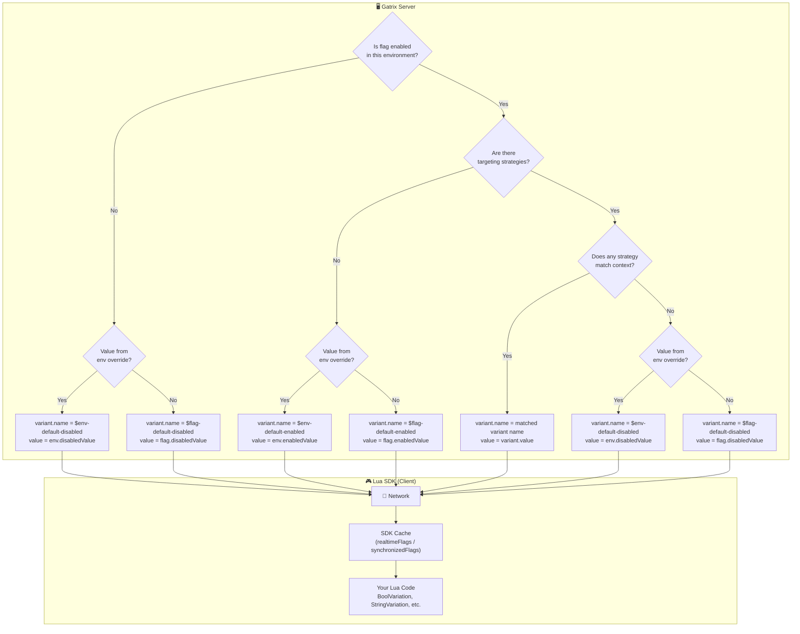
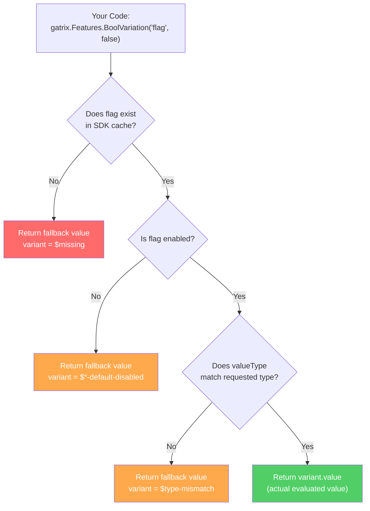
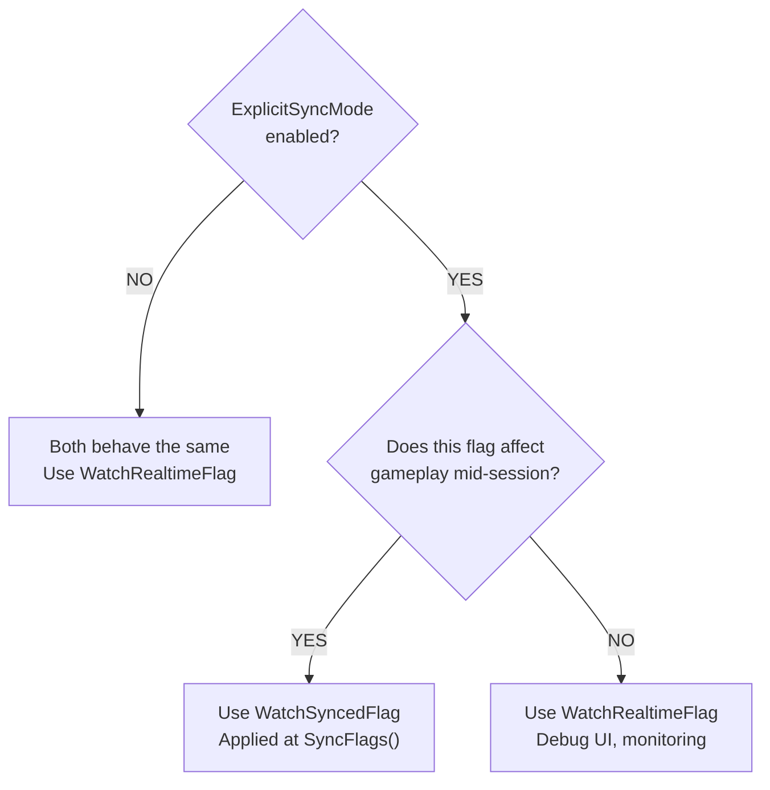

# Gatrix Lua SDK for Unreal Engine

> **Feature flags, A/B testing, and remote configuration — official Gatrix Lua binding for Unreal Engine.**

Lua binding plugin for Gatrix Unreal SDK. Exposes feature flags, variations, context, events, and watch to Lua scripts via the **pure Lua C API** (`lua_State*`).

### ⚡ Quick Examples

#### 1. Feature Toggle (`IsEnabled`)

Turn a feature on or off instantly without code deployment.

```lua
if gatrix.Features.IsEnabled("new-shop") then
    -- Feature is ON → Show the new shop UI
    ShowNewShop()
end
```

#### 2. Remote Configuration (Typed Variations)

Tune gameplay values remotely. Supports string, number, boolean, and JSON.

```lua
-- Get a number value (defaulting to 1.0 if not set)
local Speed = gatrix.Features.FloatVariation("game-speed", 1.0)

-- Get a string value
local Message = gatrix.Features.StringVariation("welcome-msg", "Welcome")

-- Get a boolean value
local DarkMode = gatrix.Features.BoolVariation("dark-mode", false)
```

#### 3. Watch for Real-Time Changes

React to flag changes pushed from the server:

```lua
gatrix.Features.WatchSyncedFlagWithInitialState("difficulty", function(Proxy)
    SetDifficulty(Proxy.Variant.Value)
end)
```

> No build, no deploy — change these values from the Gatrix Dashboard and they go live instantly.

---

## ✨ Why Gatrix?

| Without Gatrix | With Gatrix |
|---|---|
| Ship a new build to change a value | Change it live from the dashboard |
| All players get the same experience | A/B test different experiences |
| Hard-coded feature flags | Real-time remote configuration |
| Risky big-bang releases | Gradual rollouts with instant rollback |

### 🎯 Key Scenarios

- **📱 Mobile App Store Review** — Submit with features disabled, enable after approval. No second review needed.
- **⚖️ Regulatory Compliance** — Disable features by region instantly when laws change (GDPR, COPPA, etc.).
- **🚨 Emergency Kill Switch** — Disable a crashing feature in seconds, not hours. No hotfix build needed.
- **🧪 A/B Testing** — Show different variants to different groups and measure impact.
- **🤷 Uncertain Timing** — Code is always ready; business decides when to launch.

---

## 🏗️ Evaluation Model: Remote Evaluation Only

Gatrix client SDKs use **remote evaluation** exclusively:

1. The SDK sends **context** (userId, environment, properties) to the Gatrix server.
2. The server evaluates all targeting rules **remotely**.
3. The SDK receives only the **final evaluated flag values** — no rules are exposed to the client.

| | Remote Evaluation (Gatrix) | Local Evaluation |
|---|---|---|
| **Security** | ✅ Rules never leave the server | ⚠️ Rules visible to client |
| **Consistency** | ✅ Identical results across all SDKs | ⚠️ Each SDK must reimplement logic |
| **Payload** | ✅ Only final values (small) | ⚠️ Full rule set (large) |
| **Offline** | ⚠️ Cached values or bootstrap | ✅ Full offline after download |

> 💡 The SDK caches last known values locally. Your game never crashes due to network issues — it falls back to cached or bootstrap values.

---

## 🔍 Flag Value Resolution Flow

### Value Source Priority (Remote)



| Priority | Condition | Value Source | `variant.name` |
|:---:|---|---|:---|
| 1 | Flag enabled + strategy matched | `variant.value` | Variant name (e.g. `"dark-theme"`) |
| 2 | Flag enabled + no match + env override | `env.enabledValue` | `$env-default-enabled` |
| 3 | Flag enabled + no match + no override | `flag.enabledValue` | `$flag-default-enabled` |
| 4 | Flag disabled + env override | `env.disabledValue` | `$env-default-disabled` |
| 5 | Flag disabled + no override | `flag.disabledValue` | `$flag-default-disabled` |
| 6 | Flag not found | Not in response | `$missing` |

### SDK-Side: How Your Code Receives Values



### Why FallbackValue Is Required

The `FallbackValue` parameter is **mandatory** by design — your game **always** receives a usable value:

1. **SDK not initialized** — still connecting → fallback keeps the game running
2. **Flag doesn't exist** — typo or deleted flag → no crash
3. **Network failure** — no server, no cache → still works
4. **Type mismatch** — called `BoolVariation` on a string flag → safe default
5. **Flag disabled** — flag is off → returns fallback, not the variant value

```lua
-- ⚠️ There is no default-less overload. You MUST always specify what happens when things go wrong.
local Speed = gatrix.Features.FloatVariation("game-speed", 1.0)  -- 1.0 if anything goes wrong
```

### IsEnabled vs BoolVariation

These serve **different purposes** — don't confuse them:

| Function | Returns | Purpose |
|---|---|---|
| `gatrix.Features.IsEnabled("flag")` | `flag.enabled` | Is the feature flag **turned on**? |
| `gatrix.Features.BoolVariation("flag", false)` | `variant.value` as boolean | What **boolean value** did the flag evaluate to? |

```lua
-- A flag can be enabled but return false as its boolean value!
-- enabled=true, variant.value=false → "Feature is ON, but the bool config says false"
local IsOn = gatrix.Features.IsEnabled("my-flag")             -- true (flag is on)
local Value = gatrix.Features.BoolVariation("my-flag", true)   -- false (the configured value)
```

---

## Features

- **Pure Lua C API** — no dependency on game-specific Lua wrappers
- **Memory-safe callbacks** — `TSharedPtr<bool>` alive flag prevents dangling pointer access
- **Full SDK coverage** — init, flags, variations, context, events, watch, watch groups, sync
- **Automatic cleanup** — `Unregister()` releases all refs and invalidates callbacks

## Plugin Structure

```
gatrix-unreal-lua-sdk/
├── GatrixLuaSDK.uplugin
├── README.md
├── README.ko.md
└── Source/GatrixLuaSDK/
    ├── GatrixLuaSDK.Build.cs
    ├── Public/
    │   ├── GatrixLuaSDKModule.h
    │   └── LuaGatrix.h
    └── Private/
        ├── GatrixLuaSDKModule.cpp
        └── LuaGatrix.cpp
```

## Integration

### 1. Add Plugin to Project

Copy the `gatrix-unreal-lua-sdk` folder into your project's `Plugins/` directory alongside the `gatrix-unreal-sdk` plugin.

### 2. Enable Plugin Dependency

In your project's `.uproject` or game module `.Build.cs`:

```csharp
// YourGame.Build.cs
PublicDependencyModuleNames.AddRange(new string[] {
    "GatrixSDK",
    "GatrixLuaSDK"
});
```

### 3. Lua Module Path

If your project uses a different Lua module name (not `Lua`), update `GatrixLuaSDK.Build.cs`:

```csharp
PublicDependencyModuleNames.Add("YourLuaModuleName");
```

### 4. Register in C++

```cpp
#include "LuaGatrix.h"

// When your Lua VM is ready
FGatrixLuaBindings::Register(YourLuaState);

// Before lua_close() - MUST call to prevent leaks
FGatrixLuaBindings::Unregister(YourLuaState);
```

## Lua API Reference

> **API Structure:**
> - `gatrix.*` — Lifecycle, context, events (SDK-level)
> - `gatrix.Features.*` — Feature flags, variations, watch, sync
>
> Both `gatrix.Features.IsEnabled(...)` and `local Gatrix = require("gatrix")` work.

### Lifecycle

```lua
--- Initialize the SDK (required before Start)
--- @param Config table  -- Configuration table
gatrix.Init({
    ApiUrl          = "http://host/api/v1",  -- string   Edge API URL
    ApiToken        = "your-client-token",   -- string   Client API token
    AppName         = "my-game",             -- string   Application name
    Environment     = "production",          -- string   Environment name
    RefreshInterval  = 30,     -- number?  Seconds between polls (default: 30)
    DisableRefresh   = false,  -- boolean? Disable automatic polling
    ExplicitSyncMode = false,  -- boolean? Enable explicit sync mode
    DisableMetrics   = false,  -- boolean? Disable server-side metrics
    ImpressionDataAll = false, -- boolean? Track impressions for all flags
    EnableDevMode    = false,  -- boolean? Enable detailed debug logging
    OfflineMode      = false,  -- boolean? Start without network requests
})

--- Start the SDK (begins fetching, polling, metrics)
gatrix.Start()

--- Stop the SDK (stops polling, cleans up)
gatrix.Stop()
```

### Flag Access (`gatrix.Features`)

```lua
--- Check if a flag is enabled
--- @param FlagName string
--- @return boolean
local Enabled = gatrix.Features.IsEnabled("my_flag")

--- Get variant name (string)
--- @param FlagName string
--- @param Fallback string
--- @return string
local VariantName = gatrix.Features.Variation("my_flag", "default")


--- Get raw flag data as EvaluatedFlag table
--- @param FlagName string
--- @return EvaluatedFlag
local Flag = gatrix.Features.GetFlag("my_flag")

--- Get variant for a flag (never nil)
--- @param FlagName string
--- @return Variant
local Variant = gatrix.Features.GetVariant("my_flag")

--- Get all evaluated flags
--- @return EvaluatedFlag[]
local Flags = gatrix.Features.GetAllFlags()

--- Check if a flag exists in the cache
--- @param FlagName string
--- @return boolean
local Exists = gatrix.Features.HasFlag("my_flag")
```

### Typed Variations (`gatrix.Features`)

```lua
--- @param FlagName     string
--- @param FallbackValue boolean
--- @return boolean
local BoolVal = gatrix.Features.BoolVariation("flag", false)

--- @param FlagName     string
--- @param FallbackValue string
--- @return string
local StrVal = gatrix.Features.StringVariation("flag", "default")

--- @param FlagName     string
--- @param FallbackValue integer
--- @return integer
local IntVal = gatrix.Features.IntVariation("flag", 0)

--- @param FlagName     string
--- @param FallbackValue number
--- @return number
local FloatVal = gatrix.Features.FloatVariation("flag", 0.0)

--- Get detailed variation result
--- @return {Value: any, Reason: string, FlagExists: boolean, Enabled: boolean}
local Result = gatrix.Features.BoolVariationDetails("flag", false)

--- Get value or raise Lua error if missing/mismatched
--- @return boolean
local MustExist = gatrix.Features.BoolVariationOrThrow("critical_flag")
```

### Returned Table Shapes

> **`Variant.Value` is automatically converted to the native Lua type** based on `ValueType`.
> No manual parsing is needed — you receive `boolean`, `number`, or `string` directly.

**ValueType Enum:**

| Value | Type | Lua type of `Value` |
|---|---|---|
| `0` | string | `string` |
| `1` | number | `number` |
| `2` | boolean | `boolean` |
| `3` | json | `string` (JSON-encoded, use `json.decode(Value)`) |

**Variant:**

| Field | Type | Description |
|---|---|---|
| `Name` | `string` | Variant name (e.g. `"dark-theme"`, `"$flag-default-enabled"`) |
| `Enabled` | `boolean` | Whether this variant is the enabled state |
| `Value` | `boolean` / `number` / `string` | Variant value, automatically typed based on `ValueType` |

```lua
-- Example: boolean flag → Value is a Lua boolean
{
    Name    = "dark-theme",
    Enabled = true,
    Value   = true,       -- boolean (not the string "true")
}

-- Example: number flag → Value is a Lua number
{
    Name    = "$flag-default-enabled",
    Enabled = true,
    Value   = 3,          -- number (not the string "3")
}
```

**EvaluatedFlag:**

| Field | Type | Description |
|---|---|---|
| `Name` | `string` | Flag name |
| `Enabled` | `boolean` | Whether the flag is enabled |
| `Variant` | `Variant` | Variant sub-table (see above) |
| `ValueType` | `integer` | Value type enum (`0`=string, `1`=number, `2`=boolean, `3`=json) |
| `Version` | `integer` | Flag version number |
| `Reason` | `string` | Evaluation reason (e.g. `"evaluated"`, `"default"`, `"not-found"`) |
| `ImpressionData` | `boolean` | Whether impression tracking is enabled for this flag |

```lua
-- Example: number type flag
local Flag = gatrix.Features.GetFlag("max_retries")
-- Flag.ValueType == 1, Flag.Variant.Value is already a number
local MaxRetries = Flag.Variant.Value  -- 3 (number, no tonumber() needed)
```

**FlagProxy** (from watch callbacks):

| Field | Type | Description |
|---|---|---|
| `Name` | `string` | Flag name |
| `Enabled` | `boolean` | Whether the flag is enabled |
| `Exists` | `boolean` | Whether the flag exists in cache |
| `Realtime` | `boolean` | Whether this proxy reads from realtime flags (vs synced) |
| `Variant` | `Variant` | Variant sub-table (see above) |
| `ValueType` | `integer` | Value type enum (`0`=string, `1`=number, `2`=boolean, `3`=json) |
| `Version` | `integer` | Flag version number |
| `Reason` | `string` | Evaluation reason |

```lua
-- Example: watch callback
gatrix.Features.WatchRealtimeFlag("theme_color", function(Proxy)
    -- Proxy.ValueType == 0 (string), Value is a Lua string
    local Color = Proxy.Variant.Value  -- "blue"
    print("Theme:", Color)
end)

gatrix.Features.WatchRealtimeFlag("dark_mode", function(Proxy)
    -- Proxy.ValueType == 2 (boolean), Value is a Lua boolean
    if Proxy.Variant.Value then
        enableDarkMode()
    end
end)
```

**VariationResult** (from `*Details`):

| Field | Type | Description |
|---|---|---|
| `Value` | `any` | Flag value (boolean/string/number) |
| `Reason` | `string` | Evaluation reason |
| `FlagExists` | `boolean` | Whether flag exists in cache |
| `Enabled` | `boolean` | Whether flag is enabled |


### Reserved Variant Names

The SDK uses `$`-prefixed variant names to indicate **where a value came from**.
These are system-generated — not user-defined variant names.

| Variant Name | Meaning | `Enabled` | When It Happens |
|:---|---|:---:|---|
| `$missing` | Flag does not exist in SDK cache | `false` | Flag name typo, flag not created yet, or SDK not initialized |
| `$type-mismatch` | Requested type doesn't match flag's `ValueType` | `false` | Called `BoolVariation` on a `string` flag, etc. |
| `$env-default-enabled` | Flag enabled, value from **environment-level** `enabledValue` | `true` | No variant matched; environment override is set |
| `$flag-default-enabled` | Flag enabled, value from **flag-level** (global) `enabledValue` | `true` | No variant matched; no environment override |
| `$env-default-disabled` | Flag disabled, value from **environment-level** `disabledValue` | `false` | Flag disabled; environment override is set |
| `$flag-default-disabled` | Flag disabled, value from **flag-level** (global) `disabledValue` | `false` | Flag disabled; no environment override |
| *(user-defined)* | A specific variant was selected by targeting strategy | `true` | Strategy matched and selected this variant |

```lua
-- Example: checking variant name to understand value source
local Flag = gatrix.Features.GetFlag("my-feature")
local VName = Flag.Variant.Name

if VName == "$missing" then
    print("Flag not found!")
elseif VName:sub(1, 1) == "$" then
    print("Using default value from:", VName)
else
    print("Matched variant:", VName)
end
```

### Context

```lua
--- Update evaluation context (triggers re-fetch)
--- @param Ctx table
gatrix.UpdateContext({
    UserId      = "user123",
    SessionId   = "sess456",
    CurrentTime = "2025-01-01T00:00:00Z",
    Properties  = {
        Role = "admin",
        Tier = "premium",
    },
})

--- Get current context
--- @return table {AppName, Environment, UserId, SessionId, CurrentTime, Properties}
local Ctx = gatrix.GetContext()
```

### Events

```lua
--- Subscribe to an event (returns handle for Off)
--- @param EventName string
--- @param Callback  fun(Args: string[])
--- @return integer  Handle
local Handle = gatrix.On("flags.ready", function(Args)
    print("Gatrix flags ready!")
end)

--- One-time subscription (auto-unsubscribes after first call)
--- @param EventName string
--- @param Callback  fun(Args: string[])
--- @return integer  Handle
gatrix.Once("flags.change", function(Args)
    print("Flags changed")
end)

--- Unsubscribe by handle
--- @param Handle integer
gatrix.Off(Handle)

--- Subscribe to ALL events (returns handle for OffAny)
--- @param Callback fun(EventName: string, Args: string[])
--- @return integer Handle
local AnyHandle = gatrix.OnAny(function(EventName, Args)
    print("Event:", EventName)
end)

--- Unsubscribe an any-event listener by handle
--- @param Handle integer
gatrix.OffAny(AnyHandle)
```

**Available Events:**

| Event | Description |
|---|---|
| `flags.init` | SDK initialized (from storage/bootstrap) |
| `flags.ready` | First successful fetch completed |
| `flags.fetch_start` | Started fetching flags |
| `flags.fetch_success` | Successfully fetched flags |
| `flags.fetch_error` | Error during fetch |
| `flags.fetch_end` | Fetch completed (success or error) |
| `flags.change` | Flags changed from server |
| `flags.change:<flagName>` | Specific flag changed |
| `flags.error` | General SDK error |
| `flags.impression` | Flag accessed (if impressionData enabled) |
| `flags.sync` | Flags synchronized (explicitSyncMode) |
| `flags.pending_sync` | Pending sync available |
| `flags.removed` | Flags removed from server |
| `flags.recovered` | SDK recovered from error |
| `flags.streaming_connected` | Streaming connected |
| `flags.streaming_disconnected` | Streaming disconnected |
| `flags.streaming_error` | Streaming error |
| `flags.invalidated` | Flags invalidated by streaming |

### Watch (`gatrix.Features`)

Gatrix provides two families of watch functions for different use cases:

#### Realtime Watching

**`WatchRealtimeFlag`** fires the callback **immediately** whenever a flag change is fetched from the server, regardless of `ExplicitSyncMode`.

```lua
--- @param FlagName string
--- @param Callback fun(Proxy: FlagProxy)
--- @return integer Handle
local Handle = gatrix.Features.WatchRealtimeFlag("my_flag", function(Proxy)
    print("Flag changed:", Proxy.Name, Proxy.Enabled)
end)

--- With initial state (fires immediately with current value, then on changes)
local Handle2 = gatrix.Features.WatchRealtimeFlagWithInitialState("my_flag", function(Proxy)
    print("Initial + changes:", Proxy.Name, Proxy.Enabled)
end)
```

#### Synced Watching

**`WatchSyncedFlag`** fires the callback only when the **synchronized** flag store is updated. When `ExplicitSyncMode` is enabled, synced watchers wait until you call `SyncFlags()`.

```lua
--- @param FlagName string
--- @param Callback fun(Proxy: FlagProxy)
--- @return integer Handle
local Handle3 = gatrix.Features.WatchSyncedFlag("my_flag", function(Proxy)
    print("Synced:", Proxy.Name, Proxy.Variant.Value)
end)

local Handle4 = gatrix.Features.WatchSyncedFlagWithInitialState("my_flag", function(Proxy)
    print("Initial synced:", Proxy.Name, Proxy.Variant.Value)
end)

--- Unwatch by handle
--- @param Handle integer
gatrix.Features.UnwatchFlag(Handle)
```

#### Realtime vs Synced — When to Use Which?

| | Realtime | Synced |
|---|---|---|
| **Callback timing** | Immediately on fetch | After `SyncFlags()` (in ExplicitSyncMode) |
| **Use case** | Debug UI, monitoring, non-disruptive changes | Gameplay values that need controlled timing |
| **ExplicitSyncMode off** | Fires on change | Fires on change (same as realtime) |
| **ExplicitSyncMode on** | Fires on change | Fires **only** after `SyncFlags()` |

#### ⚠️ ExplicitSyncMode — Why It Matters

Realtime mode is simple, but applying flag changes **instantly** can cause problems in games:

| Problem | Example | Impact |
|---|---|---|
| **Mid-gameplay disruption** | Enemy HP changes mid-boss fight | Player feels cheated |
| **Dependency conflicts** | UI layout changes before data loads | Crash or visual corruption |
| **User trust** | Drop rates change while farming | Players lose trust |
| **Competitive integrity** | Match params change mid-match | Unfair advantage |

**ExplicitSyncMode** solves this by **buffering** changes until you apply them at a safe point:

```lua
-- Enable ExplicitSyncMode during initialization
gatrix.Init({
    ApiUrl          = "https://api.example.com/api/v1",
    ApiToken        = "token",
    AppName         = "app",
    Environment     = "production",
    ExplicitSyncMode = true,
})

-- Use synced watchers for gameplay-critical values
gatrix.Features.WatchSyncedFlagWithInitialState("difficulty", function(Proxy)
    SetDifficulty(Proxy.Variant.Value)  -- Only fires after SyncFlags()
end)

-- Use realtime watchers for debug/monitoring (always up-to-date)
gatrix.Features.WatchRealtimeFlagWithInitialState("debug_overlay", function(Proxy)
    ToggleDebugOverlay(Proxy.Enabled)  -- Fires immediately
end)

-- Apply synced changes at a safe moment (e.g., loading screen, between rounds)
gatrix.Features.SyncFlags()
-- ↑ Synced watchers fire here with the latest values
```

> 💡 **Rule of thumb:** If a flag change could disrupt the player experience, use **Synced** mode and call `SyncFlags()` at natural transition points (loading screens, between rounds, menu transitions).

> ⚠️ When `ExplicitSyncMode` is **disabled** (default), `WatchSyncedFlag` and `WatchRealtimeFlag` behave **identically**. There is no buffering — all reads and callbacks operate on a single realtime store.

### Watch Group (`gatrix.Features`)

Batch management for multiple flag watchers. Methods return `self` for chaining.

```lua
--- Create a named watch group
--- @param Name string
--- @return WatchGroup  Userdata with watch methods
local Group = gatrix.Features.CreateWatchGroup("ui-flags")

-- Methods support chaining (each returns the group)
Group
    :WatchRealtimeFlag("dark-mode", function(Proxy)
        print("Dark mode:", Proxy.Enabled)
    end)
    :WatchSyncedFlag("show-ads", function(Proxy)
        print("Ads:", Proxy.Variant.Value)
    end)
    :WatchRealtimeFlagWithInitialState("new-ui", function(Proxy)
        print("New UI (initial + changes):", Proxy.Enabled)
    end)

--- Get group name
--- @return string
print(Group:GetName())  -- "ui-flags"

--- Get number of active watchers
--- @return integer
print(Group:Size())     -- 3

--- Unwatch all watchers in the group
Group:UnwatchAll()

--- Destroy the group (unwatches all and frees memory)
Group:Destroy()
-- Note: Group is also collected by Lua GC if not explicitly destroyed
```

### State & Sync (`gatrix.Features`)

```lua
--- Check if SDK is ready (first fetch completed)
--- @return boolean
local Ready = gatrix.Features.IsReady()

--- Check if SDK has been initialized
--- @return boolean
local Initialized = gatrix.Features.IsInitialized()

--- Force fetch flags from server
gatrix.Features.FetchFlags()

--- Sync flags in explicitSyncMode
--- @param FetchNow boolean? -- true = fetch before sync (default: true)
gatrix.Features.SyncFlags(true)
```

## Memory Safety

All callbacks capture a `TSharedPtr<bool>` alive flag rather than a raw `lua_State*`:

1. `Register()` creates a session with `bAlive = true`
2. Every callback lambda holds a copy of this shared pointer
3. `Unregister()` / `Stop()` sets `*bAlive = false` **before** any cleanup
4. All in-flight callbacks check `*CapturedAlive` before touching `lua_State*`
5. All `luaL_ref` references are tracked and guaranteed `luaL_unref` on cleanup
6. WatchGroup userdata is collected by Lua GC with `__gc` metamethod

This prevents both dangling pointer access and memory leaks.

---

## 🎯 Common Recipes

### Game Speed Tuning

```lua
gatrix.Features.WatchRealtimeFlagWithInitialState("game-speed", function(Proxy)
    UE.SetTimeScale(Proxy.Variant.Value)  -- number type: already a Lua number
end)
```

### Seasonal Event Toggle

```lua
gatrix.Features.WatchRealtimeFlagWithInitialState("winter-event", function(Proxy)
    SetWinterEventActive(Proxy.Enabled)
end)
```

### A/B Test UI Copy

```lua
gatrix.Features.WatchRealtimeFlagWithInitialState("cta-button-text", function(Proxy)
    SetButtonText(Proxy.Variant.Value)  -- string type
end)
```

### Gradual Feature Rollout

```lua
if gatrix.Features.IsEnabled("new-inventory-system") then
    ShowNewInventory()
else
    ShowLegacyInventory()
end
```

### Controlled Gameplay Updates (Explicit Sync)

```lua
-- Use synced watchers for gameplay-affecting values
gatrix.Features.WatchSyncedFlagWithInitialState("enemy-hp-multiplier", function(Proxy)
    SetEnemyHpMultiplier(Proxy.Variant.Value)
end)

-- Apply at a safe point (e.g., between rounds)
gatrix.Features.SyncFlags()
```

### Multi-Flag Dependency with Watch Group

```lua
local Group = gatrix.Features.CreateWatchGroup("shop-system")

Group
    :WatchSyncedFlagWithInitialState("new-shop-enabled", function(Proxy)
        SetShopEnabled(Proxy.Enabled)
    end)
    :WatchSyncedFlagWithInitialState("discount-rate", function(Proxy)
        SetDiscountRate(Proxy.Variant.Value)
    end)

-- Both flags are applied together at sync time
-- No partial state where shop is enabled but discount is stale
```

---

## ❓ FAQ & Troubleshooting

### 1. Flag changes are not detected in real time

**Symptom:** You changed a flag on the dashboard, but the game doesn't reflect the change.

**Possible causes & solutions:**

| Cause | Solution |
|-------|----------|
| Polling interval too long | Reduce `RefreshInterval` (default: 30s) |
| `ExplicitSyncMode` is on | Flag is updated but buffered — call `SyncFlags()` to apply |
| Using `WatchSyncedFlag` | Synced watchers don't fire until `SyncFlags()` — use `WatchRealtimeFlag` instead |
| `OfflineMode` is enabled | Set `OfflineMode = false` for live connections |
| Wrong `AppName` or `Environment` | Double-check config matches dashboard settings |

---

### 2. `WatchSyncedFlag` callback never fires

**Symptom:** You registered a `WatchSyncedFlag` callback but it never executes.

**Cause:** `ExplicitSyncMode` is disabled (default). Without it, there is no synced store, so synced watchers have nothing to trigger on.

**Solution:**
```lua
-- Enable ExplicitSyncMode
gatrix.Init({
    -- ... required fields ...
    ExplicitSyncMode = true,
})

-- Use WithInitialState to get the first callback immediately
gatrix.Features.WatchSyncedFlagWithInitialState("my-flag", function(Proxy)
    -- fires immediately with current value, then on SyncFlags()
end)

-- Call SyncFlags to trigger subsequent callbacks
gatrix.Features.SyncFlags()
```

---

### 3. Confusion between `WatchRealtimeFlag` and `WatchSyncedFlag`

**Symptom:** Not sure which watch method to use.

**Quick decision guide:**



---

### 4. Flag values change unexpectedly during gameplay

**Symptom:** Player reports stats/UI suddenly changing mid-match.

**Cause:** Using `WatchRealtimeFlag` for gameplay-critical values without `ExplicitSyncMode`.

**Solution:**
```lua
-- 1. Enable ExplicitSyncMode
gatrix.Init({
    -- ... required fields ...
    ExplicitSyncMode = true,
})

-- 2. Use WatchSyncedFlag for gameplay values
gatrix.Features.WatchSyncedFlagWithInitialState("difficulty", function(Proxy)
    SetDifficulty(Proxy.Variant.Value)
end)

-- 3. Apply changes only at safe points (e.g., between rounds)
gatrix.Features.SyncFlags()
```

---

### 5. Flags return fallback values after initialization

**Symptom:** `IsEnabled` returns `false` and variations return fallback values even though the flag is configured on the dashboard.

**Possible causes & solutions:**

| Cause | Solution |
|-------|----------|
| SDK not ready yet | Wait for `flags.ready` event or use `WatchRealtimeFlagWithInitialState` |
| Wrong `AppName` or `Environment` | Double-check config matches dashboard settings |
| Flag not assigned to this environment | Verify flag is enabled for the target environment in the dashboard |
| Network error on first fetch | Listen for `flags.fetch_error` event and check logs |

```lua
-- Wait for SDK to be ready before checking flags
gatrix.Once("flags.ready", function(Args)
    local Enabled = gatrix.Features.IsEnabled("my-flag")
    print("Flag is", Enabled)
end)
```

---

### 6. `SyncFlags` has no effect

**Symptom:** Calling `SyncFlags()` doesn't change any flag values.

**Possible causes:**
- `ExplicitSyncMode` is not enabled — sync is only meaningful with it on
- No pending changes — the synced store is already up to date

---

### 7. Watch callback fires multiple times on startup

**Symptom:** `WithInitialState` callback fires once, then fires again immediately after the first fetch.

**Cause:** This is expected behavior. `WithInitialState` fires immediately with the current cached value, and then fires again when fresh data arrives from the server (if the value differs).

**Solution:** This is by design. If you only want changes after the initial value, use `WatchRealtimeFlag` (without `WithInitialState`) and handle the initial state manually.

---

### 8. Memory leak from Lua callbacks

**Symptom:** Lua state is closed but callbacks still reference it.

**Cause:** `Unregister()` was not called before `lua_close()`.

**Solution:** Always call `Unregister()` before closing the Lua state:
```cpp
// MUST call before lua_close() to prevent leaks and dangling pointers
FGatrixLuaBindings::Unregister(YourLuaState);
lua_close(YourLuaState);
```

Alternatively, use `WatchGroup:Destroy()` to clean up specific groups:
```lua
local Group = gatrix.Features.CreateWatchGroup("ui-flags")
-- ... add watchers ...

-- Clean up when done
Group:Destroy()
```

---

### 9. WatchGroup not cleaned up

**Symptom:** Watch callbacks keep firing after you expect them to stop.

**Cause:** `WatchGroup:Destroy()` was not called, but the Lua GC hasn't collected it yet.

**Solution:** Call `Destroy()` explicitly for deterministic cleanup:
```lua
-- Explicit cleanup (recommended)
Group:Destroy()

-- GC will also clean up, but timing is non-deterministic
-- Don't rely on GC for gameplay-critical cleanup
```
