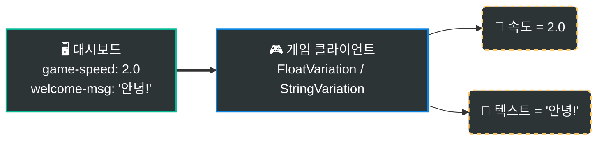
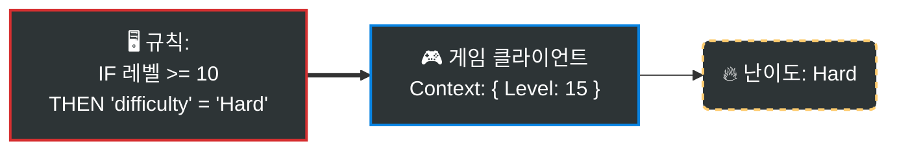

# Gatrix Unreal SDK

> **피처 플래그, A/B 테스트, 원격 구성 — Unreal Engine을 위한 공식 Gatrix SDK입니다.**

Gatrix Unreal SDK를 사용하면 새 빌드를 배포하지 않고도 게임의 동작을 실시간으로 제어할 수 있습니다. 기능 토글, A/B 실험, 게임 파라미터 튜닝, 점진적 롤아웃 — 모든 것을 Gatrix 대시보드에서 수행할 수 있습니다.

## 🏷️ 피처 플래그란?

피처 플래그는 두 가지 요소로 구성됩니다:

| 요소 | 타입 | 설명 |
|---|---|---|
| **상태** (`enabled`) | `bool` | 기능이 켜져 있는가, 꺼져 있는가 — `IsEnabled()`로 확인 |
| **값** (`variant`) | `boolean` `string` `number` `json` | 평가된 구성 값 — `BoolVariation()`, `StringVariation()`, `FloatVariation()`으로 읽음 |

플래그는 **켜져 있으면서도** 특정 값을 가질 수 있습니다 (예: `difficulty = "hard"`). 상태와 값은 독립적 — 항상 두 가지 모두 처리해야 합니다.

---

## ⚡ Quick Examples

### 1. 피처 토글 (`IsEnabled`)
코드 배포 없이 기능을 즉시 켜거나 끌 수 있습니다.


```cpp
UGatrixClient* Client = UGatrixClient::Get();

if (Client->IsEnabled(TEXT("new-shop")))
{
    // 기능이 ON 상태 -> 새 상점 UI 표시
    ShowNewShop();
}
else
{
    // 기능이 OFF 상태 (또는 플래그 없음) -> 기존 상점으로 폴백
    ShowLegacyShop();
}
```

### 2. 원격 구성 (`Variation`)
게임 밸런스, 텍스트 등을 원격에서 조정합니다.



```cpp
// float 값 가져오기 (설정이 없으면 기본값 1.0f 사용)
float Speed = Client->FloatVariation(TEXT("game-speed"), 1.0f);

// string 값 가져오기
FString Message = Client->StringVariation(TEXT("welcome-msg"), TEXT("환영합니다"));
```

### 3. 조건부 타겟팅
특정 사용자 그룹(국가, 레벨, 앱 버전 등)에게만 다른 값을 제공합니다.



```cpp
// 대시보드의 규칙이 사용자 컨텍스트(예: Level 15)를 기반으로 값을 결정합니다.
// 클라이언트는 단순히 값을 읽기만 하면 됩니다 — 로직은 서버에 있습니다!
FString Difficulty = Client->StringVariation(TEXT("difficulty"), TEXT("Normal"));
```

---

## ✨ 주요 기능

- **피처 플래그** — 실시간 플래그 평가 (폴링 + 스트리밍)
- **스트리밍** — SSE / WebSocket 실시간 플래그 갱신 + 자동 재연결
- **Variations** — Bool, String, Float, Int, Double, JSON 배리에이션
- **컨텍스트** — 커스텀 속성을 포함한 동적 평가 컨텍스트
- **ETag 캐싱** — 조건부 요청으로 대역폭 최소화
- **명시적 동기화** — 플래그 변경 적용 시점 제어
- **Watch 패턴** — 플래그별 변경 구독
- **메트릭** — 자동 사용 통계 보고
- **임프레션** — 플래그 접근 이벤트 추적
- **블루프린트 지원** — UCLASS/USTRUCT/UFUNCTION 기반 완전 통합
- **스레드 안전** — Lock-free 카운터, atomic boolean, FCriticalSection

---

## ✨ Gatrix를 사용해야 하는 이유

| Gatrix 없이 | Gatrix와 함께 |
|---|---|
| 값 하나 바꾸려면 새 빌드 배포 | 대시보드에서 실시간 변경 |
| 모든 플레이어가 같은 경험 | A/B 테스트로 다양한 경험 제공 |
| 하드코딩된 피처 플래그 | 실시간 원격 구성 |
| 위험한 빅뱅 릴리스 | 즉시 롤백 가능한 점진적 배포 |

### 🎯 실전 활용 시나리오

#### 📱 모바일/콘솔 심사 대응
새 기능의 코드가 **이미 포함되어 있지만 비활성화된 상태**로 빌드를 제출하고, 심사가 승인된 후 대시보드에서 즉시 활성화할 수 있습니다.

#### ⚖️ 규제 및 법규 준수 (GDPR 등)
앱 업데이트 없이 **특정 국가에서 기능을 비활성화**하고, 규제 명령에 **수분 내에 대응**할 수 있습니다.

#### 🚨 긴급 킬 스위치
프로덕션에서 문제가 발생했을 때 — 크래시를 유발하는 기능, 익스플로잇, 예상치 못한 서버 부하 — **수초 내에 비활성화**할 수 있습니다, 핫픽스 빌드 없이.

#### 🔬 A/B 테스트
피처 플래그를 사용하여 그룹별로 다른 경험을 제공하고 결과를 측정하세요. 난이도 튜닝, 수익화 실험, 점진적 롤아웃 등.

---

## 📦 설치

1. `GatrixSDK` 폴더를 프로젝트의 `Plugins/` 디렉토리에 복사합니다
2. 프로젝트 파일을 재생성합니다
3. 게임 모듈의 `.Build.cs`에 추가합니다:

```csharp
PublicDependencyModuleNames.AddRange(new string[] { "GatrixSDK" });
```

---

## 🚀 빠른 시작 (C++)

```cpp
#include "GatrixClient.h"
#include "GatrixEvents.h"

// 설정
FGatrixClientConfig Config;
Config.ApiUrl = TEXT("https://your-api.example.com/api/v1");
Config.ApiToken = TEXT("your-client-api-token");
Config.AppName = TEXT("MyGame");
Config.Environment = TEXT("production");

// 컨텍스트 설정 (선택)
Config.Context.UserId = TEXT("player-123");
Config.Context.SessionId = TEXT("session-abc");
Config.Context.Properties.Add(TEXT("level"), TEXT("5"));

// 초기화 & 시작
UGatrixClient* Client = UGatrixClient::Get();
Client->Init(Config);
Client->Start();

// Ready 이벤트 대기
Client->On(GatrixEvents::FlagsReady, [](const TArray<FString>& Args)
{
    UE_LOG(LogTemp, Log, TEXT("Gatrix SDK 준비 완료!"));
});

// 플래그 변경 감지
Client->On(GatrixEvents::FlagsChange, [Client](const TArray<FString>& Args)
{
    float GameSpeed = Client->FloatVariation(TEXT("game-speed"), 1.0f);
    int32 Difficulty = Client->IntVariation(TEXT("difficulty"), 1);
});

// 직접 플래그 접근
bool bFeatureOn = Client->IsEnabled(TEXT("new-feature"));
bool bBool = Client->BoolVariation(TEXT("my-flag"), false);
FString Str = Client->StringVariation(TEXT("theme"), TEXT("default"));
float Num = Client->FloatVariation(TEXT("speed"), 1.0f);
int32 Level = Client->IntVariation(TEXT("level"), 1);

// 종료
Client->Stop();
```

---

## 🚀 빠른 시작 (블루프린트)

1. **"Get Gatrix Client"** 노드로 싱글턴을 가져옵니다
2. **Init** 노드에 `GatrixClientConfig` 구조체를 전달합니다
3. **Start** 노드로 페칭을 시작합니다
4. **Bool Variation**, **String Variation** 등으로 플래그 값을 읽습니다
5. **OnReady**, **OnChange**, **OnError** 이벤트에 바인딩합니다

### 블루프린트 이벤트

| 이벤트 | 설명 |
|-------|------|
| `OnReady` | 첫 번째 성공적 페치 완료 |
| `OnChange` | 서버에서 플래그 변경됨 |
| `OnSync` | 플래그 동기화됨 (명시적 동기화 모드) |
| `OnRecovered` | SDK가 에러 상태서 복구됨 |
| `OnError` | SDK 에러 발생 |
| `OnImpression` | 플래그 임프레션 기록 |

---

## 🎮 피처 플래그 읽기

```cpp
auto* Features = Client->GetFeatures();

// Boolean 체크
bool bNewUI = Client->IsEnabled(TEXT("new-ui"));

// 타입별 안전한 기본값 (예외 발생 없음)
bool bShowBanner = Client->BoolVariation(TEXT("show-banner"), false);
FString Theme = Client->StringVariation(TEXT("app-theme"), TEXT("dark"));
int32 MaxRetries = Client->IntVariation(TEXT("max-retries"), 3);
float GameSpeed = Client->FloatVariation(TEXT("game-speed"), 1.0f);
double DropRate = Client->DoubleVariation(TEXT("item-drop-rate"), 0.05);

// 전체 배리언트 정보 (이름 + 값)
FGatrixVariant Variant = Features->GetVariant(TEXT("experiment-a"));
UE_LOG(LogTemp, Log, TEXT("Variant: %s, Value: %s"), *Variant.Name, *Variant.Value);

// 플래그 프록시 (상세 정보)
UGatrixFlagProxy* Proxy = Features->GetFlag(TEXT("feature-x"));
if (Proxy)
{
    UE_LOG(LogTemp, Log, TEXT("Enabled: %s, Reason: %s"),
        Proxy->IsEnabled() ? TEXT("true") : TEXT("false"),
        *Proxy->GetReason());
}
```

---

## 👁️ 변경 감지 (Watch)

Gatrix는 두 가지 Watch 방식을 제공합니다:

| 메서드 | 콜백 발생 시점 |
|---|---|
| `WatchRealtimeFlag` | 서버 페치 후 즉시 |
| `WatchSyncedFlag` | `SyncFlags()` 호출 시 (`ExplicitSyncMode = true`일 때) |

```cpp
auto* Features = Client->GetFeatures();

// 리얼타임 — 변경 즉시 발생   (디버그 UI, 비게임플레이용)
FGatrixFlagWatchDelegate RealtimeCallback;
RealtimeCallback.BindLambda([](UGatrixFlagProxy* Proxy)
{
    UE_LOG(LogTemp, Log, TEXT("Flag changed: %s = %s"),
        *Proxy->GetName(), Proxy->IsEnabled() ? TEXT("ON") : TEXT("OFF"));
});
int32 WatchHandle = Features->WatchRealtimeFlag(TEXT("dark-mode"), RealtimeCallback);

// 초기 상태 포함 (등록 즉시 현재 값으로도 콜백)
int32 WatchHandle2 = Features->WatchRealtimeFlagWithInitialState(
    TEXT("difficulty"), RealtimeCallback);

// 동기화 — SyncFlags() 호출 시 발생 (게임플레이 안전)
int32 SyncHandle = Features->WatchSyncedFlag(TEXT("difficulty"), SyncedCallback);

// Watch 해제
Features->UnwatchFlag(WatchHandle);
```

---

## 🔄 컨텍스트 관리

### 컨텍스트란?

**컨텍스트**는 **현재 사용자와 그 환경**을 설명하는 속성들의 집합입니다. Gatrix 서버는 컨텍스트를 사용하여 각 플래그에 대해 어떤 배리언트를 반환할지 결정합니다.

### 컨텍스트 필드

| 필드 | 타입 | 설명 |
|------|------|------|
| `AppName` | `FString` | 앱 이름 (초기화 시 설정, 변경 불가) |
| `Environment` | `FString` | 환경 이름 (초기화 시 설정, 변경 불가) |
| `UserId` | `FString` | 고유 사용자 식별자 — 타겟팅에 가장 중요 |
| `SessionId` | `FString` | 세션 범위 실험을 위한 세션 식별자 |
| `Properties` | `TMap<FString, FString>` | 커스텀 키-값 쌍 |

### 컨텍스트 업데이트

```cpp
// 초기 설정 (Init 시)
Config.Context.UserId = TEXT("player-123");
Config.Context.Properties.Add(TEXT("level"), TEXT("5"));

// 런타임 중 업데이트
FGatrixContext NewContext;
NewContext.UserId = TEXT("player-456");
NewContext.Properties.Add(TEXT("level"), TEXT("42"));
NewContext.Properties.Add(TEXT("country"), TEXT("KR"));
Client->UpdateContext(NewContext);

// 단일 필드 업데이트
Client->GetFeatures()->SetContextField(TEXT("level"), TEXT("43"));

// 필드 제거
Client->GetFeatures()->RemoveContextField(TEXT("trialUser"));
```

> ⚠️ **모든 컨텍스트 변경은 자동 재페치를 트리거합니다.** 반복문 안에서 컨텍스트를 업데이트하지 마세요. 여러 필드를 동시에 변경하려면 `UpdateContext`를 사용하세요.

---

## ⏱️ 명시적 동기화 모드 (Explicit Sync Mode)

플래그 변경이 게임에 적용되는 시점을 정확히 제어합니다 — **라이브 게임을 위한 가장 중요한 기능**입니다.

```cpp
// 설정
Config.Features.bExplicitSyncMode = true;

// 동기화 Watch: SyncFlags() 호출 시에만 콜백 발생
Features->WatchSyncedFlagWithInitialState(TEXT("difficulty"), SyncCallback);

// 안전한 시점에 변경 적용 (로딩 화면, 라운드 사이)
if (Features->HasPendingSyncFlags())
{
    Features->SyncFlags(false); // fetchNow = false
}
```

### 권장 동기화 시점

| 동기화 시점 | 예시 |
|---|---|
| **로딩 화면** | 씬 전환, 레벨 로딩 |
| **라운드 사이** | 매치 종료 후, 다음 라운드 시작 전 |
| **메뉴/일시정지** | 설정이나 인벤토리를 열 때 |
| **리스폰** | 플레이어 사망 후, 다음 스폰 전 |
| **로비** | 매치 시작 전, 캐릭터 선택 화면 |

---

## 📡 스트리밍 설정

SSE 또는 WebSocket 스트리밍으로 거의 즉각적인 플래그 업데이트를 받습니다.

```cpp
// SSE 스트리밍 (기본)
Config.Features.Streaming.bEnabled = true;
Config.Features.Streaming.Transport = EGatrixStreamingTransport::Sse;
Config.Features.Streaming.Sse.ReconnectBase = 1;  // 초
Config.Features.Streaming.Sse.ReconnectMax = 30;   // 초

// 또는 WebSocket 스트리밍
Config.Features.Streaming.Transport = EGatrixStreamingTransport::WebSocket;
Config.Features.Streaming.WebSocket.PingInterval = 30;   // 초
Config.Features.Streaming.WebSocket.ReconnectBase = 1;
Config.Features.Streaming.WebSocket.ReconnectMax = 30;

// 스트리밍 이벤트 리스닝
Client->On(GatrixEvents::FlagsStreamingConnected, [](const TArray<FString>& Args)
{
    UE_LOG(LogTemp, Log, TEXT("스트리밍 연결됨!"));
});

Client->On(GatrixEvents::FlagsStreamingError, [](const TArray<FString>& Args)
{
    UE_LOG(LogTemp, Warning, TEXT("스트리밍 에러: %s"),
        Args.Num() > 0 ? *Args[0] : TEXT("unknown"));
});
```

---

## 📡 이벤트

```cpp
// 이벤트 구독
Client->On(GatrixEvents::FlagsReady, [](const TArray<FString>& Args)
{
    UE_LOG(LogTemp, Log, TEXT("SDK 준비 완료"));
});

Client->On(GatrixEvents::FlagsChange, [](const TArray<FString>& Args)
{
    UE_LOG(LogTemp, Log, TEXT("플래그 업데이트됨"));
});

Client->On(GatrixEvents::SdkError, [](const TArray<FString>& Args)
{
    UE_LOG(LogTemp, Error, TEXT("SDK 에러"));
});

// 한 번만 구독
Client->Once(GatrixEvents::FlagsReady, [](const TArray<FString>& Args)
{
    ShowWelcomeScreen();
});

// 모든 이벤트 구독 (디버깅에 유용)
Client->OnAny([](const FString& EventName, const TArray<FString>& Args)
{
    UE_LOG(LogTemp, Log, TEXT("[Gatrix] %s"), *EventName);
});
```

### 이벤트 상수

| 상수 | 값 | 설명 |
|------|-----|------|
| `GatrixEvents::FlagsInit` | `flags.init` | SDK 초기화됨 (스토리지/부트스트랩) |
| `GatrixEvents::FlagsReady` | `flags.ready` | 첫 성공적 페치 완료 |
| `GatrixEvents::FlagsFetchStart` | `flags.fetch_start` | 페치 시작 |
| `GatrixEvents::FlagsFetchSuccess` | `flags.fetch_success` | 페치 성공 |
| `GatrixEvents::FlagsFetchError` | `flags.fetch_error` | 페치 에러 |
| `GatrixEvents::FlagsFetchEnd` | `flags.fetch_end` | 페치 완료 (성공/에러) |
| `GatrixEvents::FlagsChange` | `flags.change` | 서버에서 플래그 변경 |
| `GatrixEvents::SdkError` | `flags.error` | SDK 에러 |
| `GatrixEvents::FlagsImpression` | `flags.impression` | 플래그 임프레션 |
| `GatrixEvents::FlagsSync` | `flags.sync` | 플래그 동기화됨 |
| `GatrixEvents::FlagsPendingSync` | `flags.pending_sync` | 보류 중인 동기화 |
| `GatrixEvents::FlagsRecovered` | `flags.recovered` | 에러 상태에서 복구 |
| `GatrixEvents::FlagsMetricsSent` | `flags.metrics_sent` | 메트릭 전송 완료 |
| `GatrixEvents::FlagsMetricsError` | `flags.metrics_error` | 메트릭 전송 에러 |
| `GatrixEvents::FlagsStreamingConnected` | `flags.streaming_connected` | 스트리밍 연결 |
| `GatrixEvents::FlagsStreamingDisconnected` | `flags.streaming_disconnected` | 스트리밍 연결 끊김 |
| `GatrixEvents::FlagsStreamingError` | `flags.streaming_error` | 스트리밍 에러 |
| `GatrixEvents::FlagsStreamingReconnecting` | `flags.streaming_reconnecting` | 스트리밍 재연결 중 |
| `GatrixEvents::FlagsInvalidated` | `flags.invalidated` | 스트리밍에 의한 플래그 무효화 |
| `GatrixEvents::FlagsRemoved` | `flags.removed` | 서버에서 플래그 삭제 |

---

## 🏗️ 아키텍처

```
UGatrixClient (싱글턴)
├── FGatrixEventEmitter (스레드 안전: on/once/off/onAny)
├── IGatrixStorageProvider (플러그인 스토리지)
└── UGatrixFeaturesClient
    ├── HTTP Fetching (FHttpModule + ETag)
    ├── Flag Storage (FCriticalSection 보호)
    ├── Polling (UWorld TimerManager + 지터)
    ├── Streaming
    │   ├── FGatrixSseConnection (SSE via FHttpModule progress)
    │   ├── FGatrixWebSocketConnection (IWebSocket + ping/pong)
    │   ├── Gap Recovery (globalRevision 추적)
    │   └── Auto-Reconnect (지수 백오프 + 지터)
    ├── Metrics (배치 POST + 재시도)
    ├── Watch Pattern (플래그별 이벤트)
    └── Blueprint Delegates
```

---

## 🔒 스레드 안전성

- 플래그 읽기/쓰기는 `FCriticalSection`으로 보호
- 통계 카운터는 Lock-free `FThreadSafeCounter` 사용 (락 경합 없음)
- Boolean 상태 플래그는 `std::atomic<bool>`로 Lock-free 접근
- HTTP 콜백은 게임 스레드에서 처리 (UE FHttpModule 동작)
- 스트리밍 콜백은 `AsyncTask`를 통해 게임 스레드로 디스패치
- 이벤트 발행: 락 아래에서 콜백 수집 → 락 해제 후 호출 (데드락 방지)
- 스토리지 프로바이더 (InMemory)는 자체 `FCriticalSection` 사용

---

## ⚙️ 설정 레퍼런스

| 필드 | 타입 | 기본값 | 설명 |
|------|------|--------|------|
| `ApiUrl` | FString | - | 베이스 API URL (필수) |
| `ApiToken` | FString | - | 클라이언트 API 토큰 (필수) |
| `AppName` | FString | - | 애플리케이션 이름 (필수) |
| `Environment` | FString | - | 환경 이름 (필수) |
| `bOfflineMode` | bool | false | 오프라인 모드로 시작 |
| `bEnableDevMode` | bool | false | 개발 모드 활성화 |
| `Features.RefreshInterval` | float | 30.0 | 폴링 간격 (초) |
| `Features.bDisableRefresh` | bool | false | 자동 폴링 비활성화 |
| `Features.bExplicitSyncMode` | bool | false | 수동 플래그 동기화 |
| `Features.bDisableMetrics` | bool | false | 메트릭 비활성화 |
| `Features.bImpressionDataAll` | bool | false | 모든 플래그 임프레션 추적 |
| `Features.bUsePOSTRequests` | bool | false | 페칭에 POST 요청 사용 |
| `Features.Streaming.bEnabled` | bool | false | 스트리밍 활성화 |
| `Features.Streaming.Transport` | enum | Sse | SSE 또는 WebSocket |
| `Features.Streaming.Sse.Url` | FString | auto | 커스텀 SSE 엔드포인트 |
| `Features.Streaming.Sse.ReconnectBase` | int32 | 1 | 기본 재연결 딜레이 (초) |
| `Features.Streaming.Sse.ReconnectMax` | int32 | 30 | 최대 재연결 딜레이 (초) |
| `Features.Streaming.WebSocket.Url` | FString | auto | 커스텀 WS 엔드포인트 |
| `Features.Streaming.WebSocket.PingInterval` | int32 | 30 | 핑 간격 (초) |
| `Features.Streaming.WebSocket.ReconnectBase` | int32 | 1 | 기본 재연결 딜레이 (초) |
| `Features.Streaming.WebSocket.ReconnectMax` | int32 | 30 | 최대 재연결 딜레이 (초) |

---

## 🏗️ 평가 모델: 원격 평가 전용

Gatrix는 **원격 평가** 방식만을 사용합니다 — 타겟팅 규칙과 롤아웃 로직은 절대 서버 밖으로 나가지 않습니다.

1. SDK가 **컨텍스트**(userId, env, properties)를 서버로 전송
2. 서버가 모든 규칙을 평가하고 **최종 플래그 값만** 반환
3. SDK가 결과를 캐시하고 동기적으로 제공

| | 원격 평가 (Gatrix) | 로컬 평가 |
|---|---|---|
| **보안** | ✅ 규칙이 서버 밖으로 나가지 않음 | ⚠️ 클라이언트에 규칙 노출 |
| **일관성** | ✅ 모든 SDK에서 동일한 결과 | ⚠️ 각 SDK가 규칙을 재구현해야 함 |
| **페이로드** | ✅ 소규모 (최종 값만) | ⚠️ 대규모 (전체 규칙 세트) |
| **오프라인** | ⚠️ 최소 1회 연결 필요 | ✅ 규칙을 빌드 시점에 번들링 가능 |

> 🌐 **오프라인 & 가용성:** SDK는 서버에 연결할 수 없을 때 항상 로컬 캐시에서 값을 제공합니다. fallbackValue로 네트워크 문제로 인한 게임 중단은 절대 발생하지 않습니다.

---

## 📋 요구 사항

- Unreal Engine 4.27+
- C++ 프로젝트 (Blueprint 전용 프로젝트도 지원)

---

## 📄 라이선스

Copyright Gatrix. All Rights Reserved.
