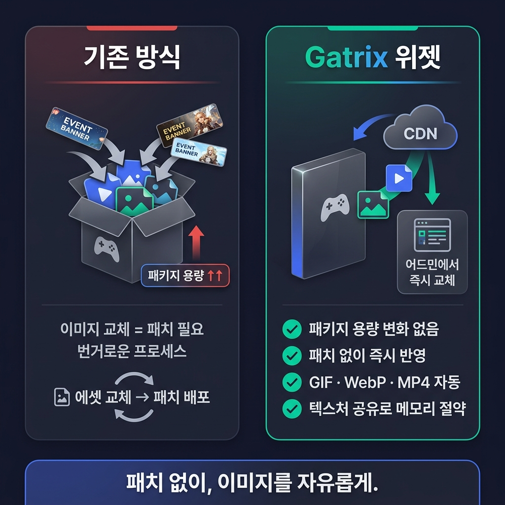
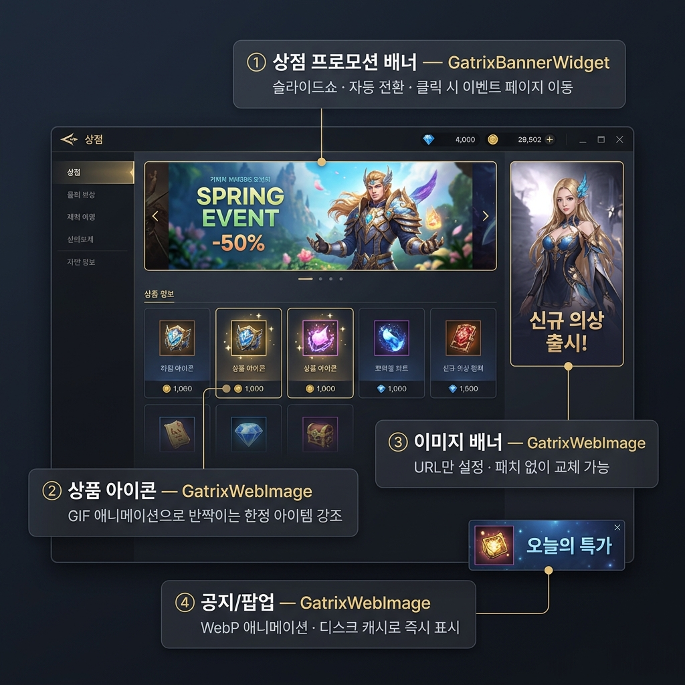
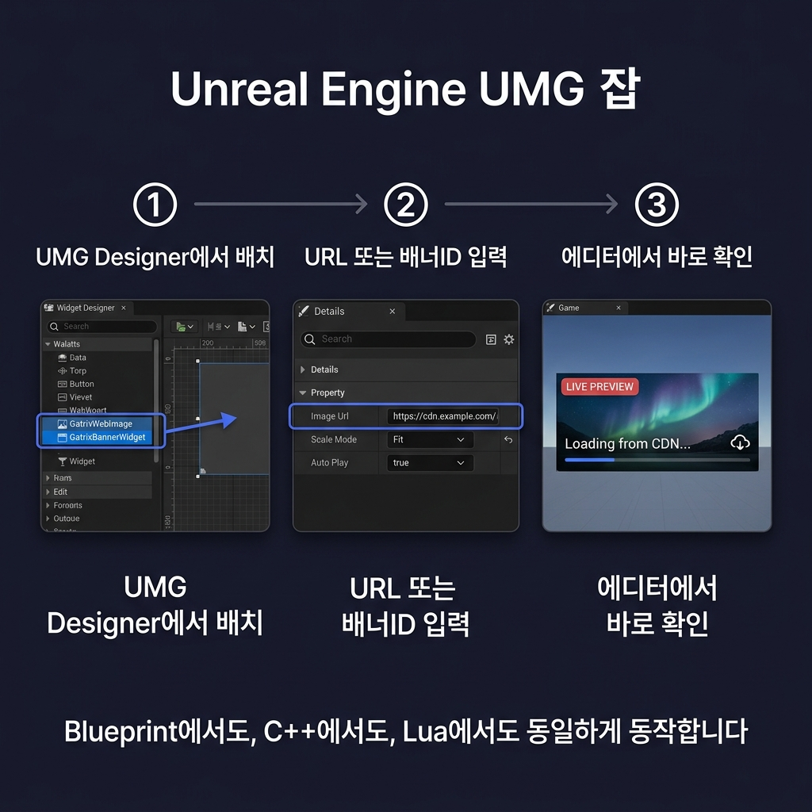
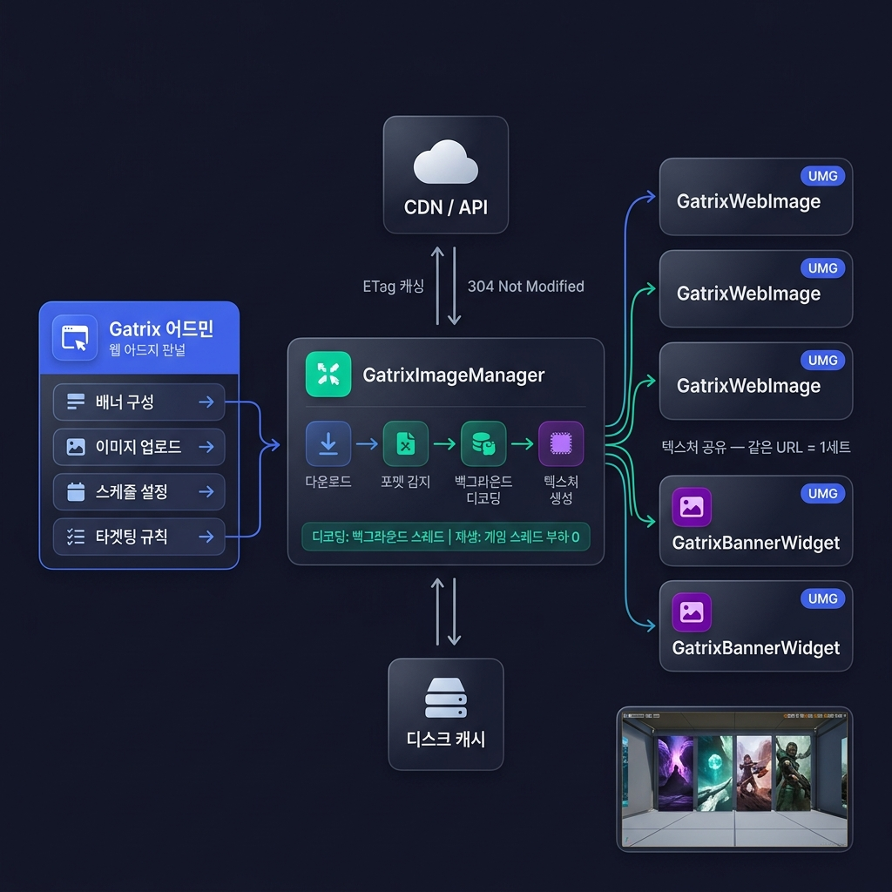

# Gatrix 이미지 & 배너 위젯

 

 

## 지금 우리가 겪고 있는 문제

 

### 📦 패키지가 계속 커지고 있습니다

이벤트 배너, 프로모션 이미지, 공지 팝업 — 전부 패키지 안에 에셋으로 들어갑니다.

이벤트 하나 할 때마다 이미지가 쌓이고, 이벤트가 끝나도 패키지에서 빠지지 않습니다. 시즌 지날수록 패키지 용량은 늘어만 갑니다. 이벤트 배너 이미지가 게임 로직보다 더 큰 용량을 차지하는 상황이 실제로 벌어지고 있습니다.

 

### 🔒 이미지를 바꾸려면 패치가 필요합니다

배너를 교체하려면 이미지 에셋 교체 → 패치 배포 과정을 거쳐야 합니다. 불가능한 건 아니지만 **번거롭습니다.** 운영 일정에 맞춰 패치 타이밍을 조율해야 하고, 배너 하나 때문에 패치를 넣기도 부담스럽습니다.

 

### 🎯 동적인 운영이 안 됩니다

- 유저 레벨별로 다른 배너를 보여주고 싶다 → 안 됩니다
- A/B 테스트로 어떤 배너가 효과적인지 비교하고 싶다 → 안 됩니다
- 이벤트 종료 시점에 자동으로 배너를 내리고 싶다 → 안 됩니다
- GIF 애니메이션 배너를 넣고 싶다 → 직접 구현해야 합니다

패키지에 박힌 정적 이미지로는 이런 운영이 불가능합니다.

 

---

 

## Gatrix 위젯이 해결하는 것

 

### ✅ 이미지가 패키지에 들어가지 않습니다

이미지를 CDN에서 실시간으로 다운로드합니다. **패키지 용량 증가 0.** 이벤트 100개를 해도 패키지는 그대로입니다. 끝난 이벤트 이미지는 서버에서 내리면 되고, 클라이언트에 남는 로컬 캐시는 자동으로 관리됩니다.

 

### ✅ 패치 없이 배너를 바꿀 수 있습니다

Gatrix 어드민 웹에서 이미지를 올리고 배너를 구성합니다. **저장 즉시 반영.** 패치를 기다릴 필요 없이, 운영이 필요한 시점에 바로 교체할 수 있습니다.

 

### ✅ 동적인 운영이 가능해집니다

- **타겟팅**: 유저 속성(레벨, 지역, VIP 등급)에 따라 다른 배너 노출
- **스케줄링**: 시작/종료 시간 설정 → 자동 노출, 자동 종료
- **슬라이드쇼**: 여러 장의 이미지를 자동 전환 (트랜지션 효과 포함)
- **GIF / WebP 애니메이션**: 자동 재생. 직접 구현할 필요 없음
- **MP4 영상**: 배너에 영상도 넣을 수 있음
- **클릭 액션**: 배너 터치 시 웹페이지, 딥링크, 게임 내 이동 등 연결

 

### ✅ 성능 걱정을 할 필요가 없습니다

- 이미지 디코딩은 **100% 백그라운드 스레드**에서 수행. 초기 로드 시 텍스처 생성만 게임 스레드에서 처리되고, **재생 중에는 게임 스레드 부하 0**
- 같은 URL 이미지를 여러 곳에서 써도 **텍스처 1세트만 생성** — VRAM 절약
- 디스크 캐시 + ETag로 **네트워크 트래픽 최소화** — 두 번째 실행부터 즉시 표시
- 네트워크가 끊겨도 **캐시에서 정상 동작**

 

---

 

## 어디에 쓸 수 있나

 

### 🛒 상점 프로모션 배너

상점 상단의 슬라이드쇼 배너. 여러 프로모션 이미지가 자동으로 전환되고, 터치하면 이벤트 페이지로 이동합니다. Gatrix 어드민에서 구성하면 **패치 없이 즉시 교체**됩니다. 이벤트 시작/종료 스케줄도 설정할 수 있습니다.

→ `GatrixBannerWidget` — 배너 ID만 넣으면 슬라이드쇼, 전환 효과, 클릭 액션 전부 자동

 

### 🖼️ 이미지 배너

상점 사이드, 로비, 공지 팝업 등에 쓰이는 단일 이미지 배너. PNG, JPG는 물론 **GIF, WebP 애니메이션**도 지원합니다. URL만 설정하면 포맷을 자동으로 감지하고 재생합니다.

→ `GatrixWebImage` — URL 하나로 끝. 교체할 때도 URL만 바꾸면 됨

 

### ✨ 상품 아이콘 (애니메이션)

한정 아이템, 신규 상품 등을 강조할 때 정적인 아이콘 대신 **애니메이션 GIF 아이콘**을 사용할 수 있습니다. 반짝이는 테두리, 빛나는 이펙트 등을 이미지 자체에 포함시켜서 별도의 파티클이나 머티리얼 없이도 시각적으로 차별화할 수 있습니다.

→ `GatrixWebImage` — GIF/WebP URL을 넣으면 애니메이션 자동 재생. 아이콘 교체도 서버에서 URL만 바꾸면 즉시 반영

 

### 📢 공지 / 팝업

긴급 공지, 오늘의 특가, 복귀 유저 환영 등 — 항상 달라져야 하는 콘텐츠. 패치 사이클을 기다리지 않고 어드민에서 바로 관리할 수 있습니다. 디스크 캐시 덕분에 앱 재시작 시에도 즉시 표시됩니다.

 

---

 

## 언리얼 UMG에서 바로 쓸 수 있습니다

별도의 설치나 설정이 필요 없습니다. **UMG Widget Designer에서 바로 사용할 수 있는 네이티브 위젯**입니다.

 

일반 `UImage`를 쓰듯이 UMG 팔레트에서 **드래그 & 드롭**하면 됩니다. Details 패널에서 URL이나 배너 ID를 입력하고, 스케일 모드 같은 설정을 조정하면 **에디터에서 바로 프리뷰**를 확인할 수 있습니다.

Blueprint, C++, Lua — 어디서든 동일하게 동작합니다.

 

### 🖼️ `GatrixWebImage`

**이미지 하나를 표시**할 때 사용합니다. 아바타, 공지 이미지, 프로모션 배너 등.

URL을 넣으면 다운로드, 캐싱, 포맷 자동 감지, GIF/WebP 애니메이션 재생까지 전부 자동으로 처리됩니다. 이미지 스케일 모드(Fit, Fill, Stretch, MatchImage)와 로딩 중 배경색 등을 설정할 수 있습니다.

 

### 📺 `GatrixBannerWidget`

**Gatrix 어드민에서 구성한 배너를 재생**할 때 사용합니다.

배너 ID를 넣으면 API에서 배너 데이터를 가져오고, 이미지를 다운로드하고, 프레임을 자동 전환합니다. 트랜지션 효과, 다음 프레임 프리페치, 클릭 시 액션 실행이 모두 내장되어 있습니다.

자동 재생이 기본이지만, **재생을 직접 제어**할 수도 있습니다. 재생/일시정지/정지, 다음/이전 프레임 수동 이동, 재생 속도 조절이 가능합니다. 특정 시점에만 배너를 보여주거나, 유저 인터랙션에 따라 프레임을 넘기는 등의 커스텀 동작을 구현할 수 있습니다.

로드 완료, 클릭 액션, 재생 완료 등의 이벤트를 바인딩할 수 있습니다.

 

### 🔌 기존 UI에 끼워 넣기

이미 레이아웃에 `UImage`가 있다면, 새 위젯을 추가하지 않고 **기존 UImage에 바로 렌더링**할 수 있습니다. Lua 바인딩에서 특히 유용합니다.

 

---

 

## 내부 구조

전체 시스템이 어떻게 동작하는지 궁금하다면:

 

### 이미지를 폰트처럼 다룹니다

폰트를 생각해보면, "A"라는 글자를 화면 100곳에 표시해도 글리프 데이터는 하나만 존재합니다. 각 텍스트 위젯이 같은 글리프를 참조할 뿐이지, 위젯마다 "A"의 픽셀을 복제하지는 않습니다.

Gatrix 이미지 시스템은 **같은 원리**입니다. 같은 URL의 이미지를 화면 10곳에 표시해도, GPU 텍스처는 **1세트만 존재**합니다. 10개의 위젯이 같은 텍스처를 참조할 뿐입니다. 사용하는 곳이 늘어나도 메모리는 늘어나지 않습니다.

GIF 애니메이션도 마찬가지입니다. 70프레임짜리 GIF를 5곳에서 표시해도, 프레임 텍스처 70장은 **한 벌만 존재**하고 모든 위젯이 동일한 현재 프레임을 참조합니다. Manager가 프레임 인덱스를 하나 올리면, 5개의 위젯이 동시에 다음 프레임을 표시합니다.

이 설계 덕분에:
- **VRAM**: 같은 URL을 N곳에서 써도 1세트 분량만 사용
- **CPU**: 프레임 전환은 정수 하나를 바꾸는 것 — 게임 스레드 부하 0
- **다운로드/디코딩**: URL당 1회만 수행

 

**GatrixImageManager**가 이 모든 라이프사이클을 관리합니다. 위젯은 "이 URL을 보여줘"라고 요청할 뿐이고, 다운로드 · 디코딩 · 캐싱 · 텍스처 공유 · 메모리 해제는 전부 Manager가 처리합니다.

 

---

 

## 디버깅

에디터 콘솔에서 이미지 시스템의 실시간 상태를 확인할 수 있습니다.

| 명령어 | 설명 |
|--------|------|
| `Gatrix.ImageStats` | 이미지 소스별 상세 통계 |
| `Gatrix.ImageStats.Summary` | 한줄 요약 |
| `Gatrix.ImageConfig` | 현재 설정값 |
