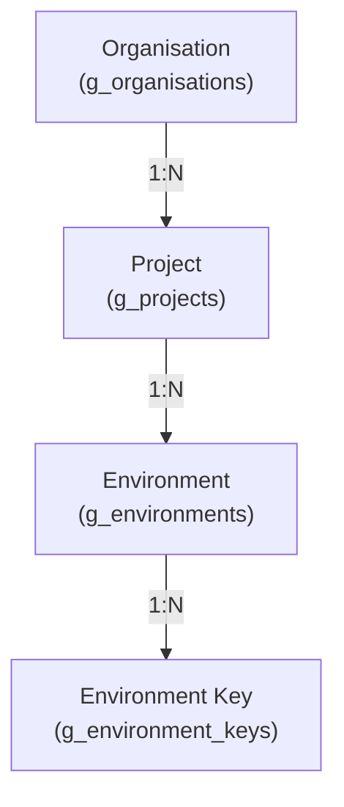

# Gatrix RBAC 스펙 문서

> Version: 1.0 | Date: 2026-02-28
> DB 초기화 전제. Flagsmith RBAC 체계 기반 재설계.

---

## 목차

1. [개요](#1-개요)
2. [데이터 계층 모델](#2-데이터-계층-모델)
3. [사용자 모델](#3-사용자-모델)
4. [역할(Role) 시스템](#4-역할role-시스템)
5. [그룹(Group) 시스템](#5-그룹group-시스템)
6. [권한(Permission) 정의](#6-권한permission-정의)
7. [권한 계산 엔진](#7-권한-계산-엔진)
8. [키/토큰 체계](#8-키토큰-체계)
9. [SDK 인증 흐름](#9-sdk-인증-흐름)
10. [Admin API 인증](#10-admin-api-인증)
11. [API 라우트 설계](#11-api-라우트-설계)
12. [DB 스키마](#12-db-스키마)
13. [Service Account 통합](#13-service-account-통합)
14. [엣지케이스 및 보안](#14-엣지케이스-및-보안)
15. [기존 매핑 테이블](#15-기존-매핑-테이블)
16. [Edge 프록시 통합](#16-edge-프록시-통합)
17. [SSO 통합](#17-sso-통합)

---

## 1. 개요

### 1.1 목적

현재 gatrix의 flat 권한 모델을 Flagsmith 스타일의 3-level 계층형 RBAC로 전환한다.

### 1.2 핵심 변경점

| 항목            | 현재                        | 목표                                      |
| --------------- | --------------------------- | ----------------------------------------- |
| 계층            | Flat (단일)                 | Organisation → Project → Environment      |
| 역할            | admin/user (2단계)          | Org Admin + Custom Roles                  |
| 권한 할당       | User → Permission 직접      | Role → Permission, User/Group → Role      |
| 그룹            | 없음                        | Group 기반 역할 할당                      |
| 환경 접근       | allowAllEnvironments + 지정 | Role의 Environment 권한으로 통합          |
| 권한 범위       | 글로벌 동일                 | Org/Project/Environment 별 세분화         |
| SDK 키          | 토큰 1개 → 멀티 환경        | Environment Key (1키=1환경, 자동 resolve) |
| Admin API       | SDK와 동일 토큰             | 별도 Admin API Token (RBAC 적용)          |
| Service Account | User 테이블에 혼합          | 독립 모델 + Role 기반 권한                |

### 1.3 설계 원칙

1. **키 = 환경**: SDK 키 하나로 environment, project, organisation을 자동 resolve
2. **write는 read를 포함**: `write` 권한이 있으면 `read` 별도 체크 불필요
3. **합집합 계산**: 사용자의 최종 권한 = 직접 Role ∪ Group Role
4. **Admin은 전체 허용**: Org Admin은 모든 권한을 가짐
5. **네이밍 규칙**: `{scope}.{resource}.{read|write|access|create|approve}`

---

## 2. 데이터 계층 모델

### 2.1 계층 구조



### 2.2 Organisation

시스템의 최상위 단위. 모든 리소스는 Organisation 아래에 존재한다.

| 필드        | 타입          | 설명                                  |
| ----------- | ------------- | ------------------------------------- |
| id          | CHAR(26) ULID | PK                                    |
| orgName     | VARCHAR(100)  | 고유 식별자 (lowercase, alphanumeric) |
| displayName | VARCHAR(200)  | 표시 이름                             |
| description | TEXT          | 설명                                  |
| isActive    | BOOLEAN       | 활성 여부                             |

> **확정**: gatrix는 **멀티 Organisation**을 지원한다. self-hosted 환경에서도 여러 조직을 호스팅할 수 있도록 설계한다.

### 2.3 Project

Organisation 내에서 독립적인 기능 그룹 단위.

| 필드        | 타입          | 설명                      |
| ----------- | ------------- | ------------------------- |
| id          | CHAR(26) ULID | PK                        |
| orgId       | CHAR(26)      | FK → g_organisations      |
| projectName | VARCHAR(100)  | 고유 식별자 (org 내 유일) |
| displayName | VARCHAR(200)  | 표시 이름                 |
| isDefault   | BOOLEAN       | 기본 프로젝트 여부        |
| isActive    | BOOLEAN       | 활성 여부                 |

**Project에 속하는 리소스:**
- Feature Flags (정의, 이름, 설명, 타입)
- Segments
- Context Fields
- Tags
- Planning Data
- Release Flows
- Service Accounts
- Signal Endpoints
- Actions/Action Sets
- Feature Code References
- Impact Metric Configs

### 2.4 Environment

Project 내에서 독립적인 배포 환경 단위.

| 필드              | 타입         | 설명                              |
| ----------------- | ------------ | --------------------------------- |
| environment       | VARCHAR(100) | PK (이름 자체가 ID)               |
| projectId         | CHAR(26)     | FK → g_projects                   |
| displayName       | VARCHAR(200) | 표시 이름                         |
| environmentType   | ENUM         | development/qa/staging/production |
| isSystemDefined   | BOOLEAN      | 시스템 정의 환경 여부             |
| displayOrder      | INT          | 정렬 순서                         |
| color             | VARCHAR(20)  | UI 표시 색상                      |
| requiresApproval  | BOOLEAN      | 변경 승인 필요 여부               |
| requiredApprovers | INT          | 필요 승인자 수                    |

**Environment에 속하는 리소스:**
- Feature Flag 상태 (enabled/disabled, value)
- Feature Flag 전략 (Strategies)
- Feature Flag 변형 (Variants)
- Segment Overrides
- Client Versions
- Game Worlds
- Maintenance 설정
- Service Notices
- Banners
- Coupons / Coupon Settings
- Surveys
- Store Products
- Reward Templates
- Ingame Popup Notices
- Operation Events
- Vars (KV Data)
- Server Lifecycle Events
- Change Requests
- Environment Keys

### 2.5 계층 간 관계 요약

```
Organisation
├── Users (Org 멤버십)
├── Groups
├── Roles
├── Admin API Tokens
├── Audit Logs
├── Monitoring Alerts
└── Project A
    ├── Feature Flags (정의)
    ├── Segments
    ├── Context Fields
    ├── Tags
    ├── Service Accounts
    ├── Signal Endpoints
    ├── Actions
    └── Environment: development
    │   ├── Flag 상태/전략/변형
    │   ├── Environment Keys (client/server)
    │   ├── Client Versions
    │   ├── Game Worlds
    │   ├── Maintenance
    │   ├── Service Notices
    │   └── ...
    └── Environment: production
        ├── Flag 상태/전략/변형
        ├── Environment Keys (client/server)
        └── ...
```

---

## 3. 사용자 모델

### 3.1 g_users 변경

```diff
 CREATE TABLE g_users (
   id INT AUTO_INCREMENT PRIMARY KEY,
   email VARCHAR(255) NOT NULL UNIQUE,
   name VARCHAR(100) NOT NULL,
   passwordHash VARCHAR(255),
-  role ENUM('admin', 'user') DEFAULT 'user',
+  -- 제거: g_organisation_members.orgRole로 이전
   status ENUM('active', 'pending', 'suspended') DEFAULT 'pending',
   authType VARCHAR(20) DEFAULT 'local',
-  allowAllEnvironments BOOLEAN DEFAULT FALSE,
+  -- 제거: Role 환경 권한으로 대체
   ...
 );
```

**삭제되는 필드:**
- `role`: `g_organisation_members.orgRole`로 이전
- `allowAllEnvironments`: Role의 Environment 권한으로 대체

### 3.2 Organisation 멤버십

```sql
CREATE TABLE g_organisation_members (
  id INT AUTO_INCREMENT PRIMARY KEY,
  orgId CHAR(26) NOT NULL,
  userId INT NOT NULL,
  orgRole ENUM('admin', 'user') DEFAULT 'user',
  joinedAt TIMESTAMP DEFAULT UTC_TIMESTAMP(),
  invitedBy INT,
  UNIQUE KEY uniq_org_user (orgId, userId)
);
```

| orgRole | 의미                                                  |
| ------- | ----------------------------------------------------- |
| `admin` | Org Admin - 모든 권한 보유 (기존 `role='admin'` 대체) |
| `user`  | 일반 사용자 - Custom Role/Group으로 권한 부여         |

### 3.3 JWT Payload 변경

```typescript
// 현재
interface JWTPayload {
  userId: number;
  email: string;
  role: string;  // 'admin' | 'user'
}

// 변경 후
interface JWTPayload {
  userId: number;
  email: string;
  orgId: string;      // 소속 Organisation
  orgRole: string;    // 'admin' | 'user'
}
```

---

## 4. 역할(Role) 시스템

### 4.1 역할 정의

Role은 **권한의 묶음**이다. Organisation 범위로 생성되며, 3가지 레벨의 권한을 포함할 수 있다.

```sql
CREATE TABLE g_roles (
  id INT AUTO_INCREMENT PRIMARY KEY,
  orgId CHAR(26) NOT NULL,
  roleName VARCHAR(100) NOT NULL,
  description TEXT,
  createdBy INT,
  updatedBy INT,
  createdAt TIMESTAMP DEFAULT UTC_TIMESTAMP(),
  updatedAt TIMESTAMP DEFAULT UTC_TIMESTAMP() ON UPDATE UTC_TIMESTAMP(),
  UNIQUE KEY uniq_org_role (orgId, roleName)
);
```

### 4.2 Role 권한 할당

하나의 Role에 Org/Project/Environment 레벨의 권한을 각각 할당한다.

#### Organisation 레벨 권한

```sql
CREATE TABLE g_role_org_permissions (
  id INT AUTO_INCREMENT PRIMARY KEY,
  roleId INT NOT NULL,
  permission VARCHAR(100) NOT NULL,  -- e.g. 'org.users.write'
  UNIQUE KEY uniq_role_org_perm (roleId, permission)
);
```

#### Project 레벨 권한

```sql
CREATE TABLE g_role_project_permissions (
  id INT AUTO_INCREMENT PRIMARY KEY,
  roleId INT NOT NULL,
  projectId CHAR(26) NOT NULL,       -- 특정 프로젝트에 대한 권한
  permission VARCHAR(100) NOT NULL,  -- e.g. 'project.features.write'
  isAdmin BOOLEAN DEFAULT FALSE,     -- TRUE = Project Admin (해당 프로젝트 전체 접근)
  UNIQUE KEY uniq_role_proj_perm (roleId, projectId, permission)
);
```

> `isAdmin=TRUE`이면 해당 프로젝트의 모든 Project/Environment 권한을 가진다.

#### Environment 레벨 권한

```sql
CREATE TABLE g_role_environment_permissions (
  id INT AUTO_INCREMENT PRIMARY KEY,
  roleId INT NOT NULL,
  environment VARCHAR(100) NOT NULL, -- 특정 환경에 대한 권한
  permission VARCHAR(100) NOT NULL,  -- e.g. 'env.features.write'
  isAdmin BOOLEAN DEFAULT FALSE,     -- TRUE = Env Admin (해당 환경 전체 접근)
  UNIQUE KEY uniq_role_env_perm (roleId, environment, permission)
);
```

### 4.3 User-Role 할당

```sql
CREATE TABLE g_user_roles (
  id INT AUTO_INCREMENT PRIMARY KEY,
  userId INT NOT NULL,
  roleId INT NOT NULL,
  assignedBy INT,
  assignedAt TIMESTAMP DEFAULT UTC_TIMESTAMP(),
  UNIQUE KEY uniq_user_role (userId, roleId)
);
```

### 4.4 Built-in Role 종류

| 유형          | 설명               | 구현                                            |
| ------------- | ------------------ | ----------------------------------------------- |
| Org Admin     | 조직 전체 접근     | `g_organisation_members.orgRole = 'admin'`      |
| Project Admin | 특정 프로젝트 전체 | `g_role_project_permissions.isAdmin = TRUE`     |
| Env Admin     | 특정 환경 전체     | `g_role_environment_permissions.isAdmin = TRUE` |
| Custom        | 사용자 정의        | 개별 Permission 조합                            |

### 4.5 역할 예시

```
Role: "Developer"
├── Org: (없음)
├── Project "my-game":
│   ├── project.read
│   ├── project.features.write
│   └── project.tags.read
├── Environment "development": isAdmin = TRUE
├── Environment "qa": isAdmin = TRUE
└── Environment "production":
    ├── env.read
    └── env.change_requests.create
```

---

## 5. 그룹(Group) 시스템

### 5.1 그룹 정의

```sql
CREATE TABLE g_groups (
  id INT AUTO_INCREMENT PRIMARY KEY,
  orgId CHAR(26) NOT NULL,
  groupName VARCHAR(100) NOT NULL,
  description TEXT,
  addNewUsersByDefault BOOLEAN DEFAULT FALSE,
  createdBy INT,
  updatedBy INT,
  createdAt TIMESTAMP DEFAULT UTC_TIMESTAMP(),
  updatedAt TIMESTAMP DEFAULT UTC_TIMESTAMP() ON UPDATE UTC_TIMESTAMP(),
  UNIQUE KEY uniq_org_group (orgId, groupName)
);
```

| 필드                 | 설명                                               |
| -------------------- | -------------------------------------------------- |
| addNewUsersByDefault | TRUE이면 새 사용자 가입 시 자동으로 이 그룹에 추가 |

### 5.2 그룹 멤버십

```sql
CREATE TABLE g_group_members (
  id INT AUTO_INCREMENT PRIMARY KEY,
  groupId INT NOT NULL,
  userId INT NOT NULL,
  isGroupAdmin BOOLEAN DEFAULT FALSE,
  addedBy INT,
  addedAt TIMESTAMP DEFAULT UTC_TIMESTAMP(),
  UNIQUE KEY uniq_group_user (groupId, userId)
);
```

| 필드         | 설명                              |
| ------------ | --------------------------------- |
| isGroupAdmin | Group Admin - 그룹 멤버 관리 가능 |

### 5.3 Group-Role 할당

```sql
CREATE TABLE g_group_roles (
  id INT AUTO_INCREMENT PRIMARY KEY,
  groupId INT NOT NULL,
  roleId INT NOT NULL,
  assignedBy INT,
  assignedAt TIMESTAMP DEFAULT UTC_TIMESTAMP(),
  UNIQUE KEY uniq_group_role (groupId, roleId)
);
```

### 5.4 그룹 활용 시나리오

| 그룹                               | 역할           | 효과                                          |
| ---------------------------------- | -------------- | --------------------------------------------- |
| "QA Team"                          | "QA Viewer"    | QA팀 전원에게 QA 환경 읽기 권한 일괄 부여     |
| "Operations"                       | "Operator"     | 운영팀 전원에게 운영 권한 일괄 부여           |
| "All Staff" (addNewUsersByDefault) | "Basic Access" | 모든 신규 사용자에게 기본 접근 권한 자동 부여 |

---

## 6. 권한(Permission) 정의

### 6.1 네이밍 규칙

```
{scope}.{resource}.{action}

scope: org | project | env
action: read | write | access | create | approve
```

**규칙:**
- `write`는 `read`를 포함 (write 권한이 있으면 read 별도 체크 불필요)
- `access`는 콘솔/채팅 등 read/write로 분류하기 어려운 특수 접근
- `create`/`approve`는 change request처럼 세분화가 필요한 경우에만 사용

### 6.2 Organisation Level Permissions

| Key                           | 설명                   | 현재 매핑                       |
| ----------------------------- | ---------------------- | ------------------------------- |
| `org.users.read`              | 사용자 조회            | `users.view`                    |
| `org.users.write`             | 사용자 CRUD            | `users.manage`                  |
| `org.groups.write`            | 그룹 관리              | 신규                            |
| `org.group_membership.write`  | 그룹 멤버십 변경       | 신규                            |
| `org.roles.write`             | 역할 관리              | 신규                            |
| `org.admin_tokens.write`      | Admin API 토큰 관리    | `security.manage` (일부)        |
| `org.system_settings.read`    | 시스템 설정 조회       | `system-settings.view`          |
| `org.system_settings.write`   | 시스템 설정 관리       | `system-settings.manage`        |
| `org.audit_logs.read`         | 감사 로그 조회         | `audit-logs.view`               |
| `org.monitoring.read`         | 모니터링               | `monitoring.view`               |
| `org.console.access`          | 콘솔 접근              | `console.access`                |
| `org.event_lens.read`         | Event Lens 조회        | `event-lens.view`               |
| `org.event_lens.write`        | Event Lens 관리        | `event-lens.manage`             |
| `org.chat.access`             | 채팅                   | `chat.access`                   |
| `org.projects.write`          | 프로젝트 CRUD          | 신규                            |
| `org.crash_events.read`       | 크래시 이벤트          | `crash-events.view`             |
| `org.realtime_events.read`    | 실시간 이벤트          | `realtime-events.view`          |
| `org.scheduler.read`          | 스케줄러 조회          | `scheduler.view`                |
| `org.scheduler.write`         | 스케줄러 관리          | `scheduler.manage`              |
| `org.open_api.read`           | Open API 조회          | `open-api.view`                 |
| `org.invitations.write`       | 초대 관리              | 신규 (users.manage에서 분리)    |
| `org.ip_whitelist.read`       | IP 화이트리스트 조회   | 신규 (security.view에서 분리)   |
| `org.ip_whitelist.write`      | IP 화이트리스트 관리   | 신규 (security.manage에서 분리) |
| `org.account_whitelist.read`  | 계정 화이트리스트 조회 | 신규 (security.view에서 분리)   |
| `org.account_whitelist.write` | 계정 화이트리스트 관리 | 신규 (security.manage에서 분리) |
| `org.integrations.read`       | 연동 조회              | 신규 (security.view에서 분리)   |
| `org.integrations.write`      | 연동 관리              | 신규 (security.manage에서 분리) |
| `org.translation.write`       | 번역 관리              | 신규                            |

### 6.3 Project Level Permissions

| Key                              | 설명                   | 현재 매핑                     |
| -------------------------------- | ---------------------- | ----------------------------- |
| `project.read`                   | 프로젝트 정보 조회     | 신규                          |
| `project.features.write`         | Feature Flag 생성/삭제 | `feature-flags.manage` (일부) |
| `project.segments.write`         | 세그먼트 관리          | `feature-flags.manage` (일부) |
| `project.context_fields.write`   | 컨텍스트 필드 관리     | `feature-flags.manage` (일부) |
| `project.tags.read`              | 태그 조회              | `tags.view`                   |
| `project.tags.write`             | 태그 관리              | `tags.manage`                 |
| `project.planning_data.read`     | 기획 데이터 조회       | `planning-data.view`          |
| `project.planning_data.write`    | 기획 데이터 관리       | `planning-data.manage`        |
| `project.release_flows.write`    | 릴리즈 플로우 관리     | `feature-flags.manage` (일부) |
| `project.service_accounts.read`  | 서비스 계정 조회       | `service-accounts.view`       |
| `project.service_accounts.write` | 서비스 계정 관리       | `service-accounts.manage`     |
| `project.signal_endpoints.read`  | 시그널 엔드포인트 조회 | `signal-endpoints.view`       |
| `project.signal_endpoints.write` | 시그널 엔드포인트 관리 | `signal-endpoints.manage`     |
| `project.actions.read`           | 액션 조회              | `actions.view`                |
| `project.actions.write`          | 액션 관리              | `actions.manage`              |
| `project.data.read`              | 데이터 관리 조회       | `data-management.view`        |
| `project.data.write`             | 데이터 관리            | `data-management.manage`      |
| `project.unknown_flags.read`     | 미등록 플래그 조회     | 신규                          |
| `project.impact_metrics.read`    | 임팩트 메트릭 조회     | 신규                          |
| `project.impact_metrics.write`   | 임팩트 메트릭 관리     | 신규                          |

### 6.4 Environment Level Permissions

| Key                               | 설명                                | 현재 매핑                             |
| --------------------------------- | ----------------------------------- | ------------------------------------- |
| `env.read`                        | 환경 정보 조회                      | `environments.view`                   |
| `env.settings.write`              | 환경 설정 관리 (승인 설정 등)       | `environments.manage`                 |
| `env.features.write`              | Flag 상태/전략/변형/오버라이드 변경 | `feature-flags.manage` (일부)         |
| `env.change_requests.create`      | 승인 요청 생성                      | `change-requests.manage` (일부)       |
| `env.change_requests.approve`     | 승인 요청 승인/거부                 | `change-requests.manage` (일부)       |
| `env.env_keys.write`              | Environment Key 관리                | `security.manage` (일부)              |
| `env.client_versions.read`        | 클라이언트 버전 조회                | `client-versions.view`                |
| `env.client_versions.write`       | 클라이언트 버전 관리                | `client-versions.manage`              |
| `env.game_worlds.read`            | 게임 월드 조회                      | `game-worlds.view`                    |
| `env.game_worlds.write`           | 게임 월드 관리                      | `game-worlds.manage`                  |
| `env.maintenance.read`            | 점검 조회                           | `maintenance.view`                    |
| `env.maintenance.write`           | 점검 관리                           | `maintenance.manage`                  |
| `env.maintenance_templates.read`  | 점검 템플릿 조회                    | `maintenance-templates.view`          |
| `env.maintenance_templates.write` | 점검 템플릿 관리                    | `maintenance-templates.manage`        |
| `env.service_notices.read`        | 공지사항 조회                       | `service-notices.view`                |
| `env.service_notices.write`       | 공지사항 관리                       | `service-notices.manage`              |
| `env.banners.read`                | 배너 조회                           | `banners.view`                        |
| `env.banners.write`               | 배너 관리                           | `banners.manage`                      |
| `env.coupons.read`                | 쿠폰 조회                           | `coupons.view`                        |
| `env.coupons.write`               | 쿠폰 관리                           | `coupons.manage`                      |
| `env.surveys.read`                | 설문 조회                           | `surveys.view`                        |
| `env.surveys.write`               | 설문 관리                           | `surveys.manage`                      |
| `env.store_products.read`         | 상점 상품 조회                      | `store-products.view`                 |
| `env.store_products.write`        | 상점 상품 관리                      | `store-products.manage`               |
| `env.reward_templates.read`       | 보상 템플릿 조회                    | `reward-templates.view`               |
| `env.reward_templates.write`      | 보상 템플릿 관리                    | `reward-templates.manage`             |
| `env.ingame_popups.read`          | 인게임 팝업 조회                    | `ingame-popup-notices.view`           |
| `env.ingame_popups.write`         | 인게임 팝업 관리                    | `ingame-popup-notices.manage`         |
| `env.operation_events.read`       | 운영 이벤트 조회                    | `operation-events.view`               |
| `env.operation_events.write`      | 운영 이벤트 관리                    | `operation-events.manage`             |
| `env.vars.write`                  | KV 관리                             | 없음 (vars 라우트는 무권한)           |
| `env.servers.read`                | 서버 조회                           | `servers.view`                        |
| `env.servers.write`               | 서버 관리                           | `servers.manage`                      |
| `env.coupon_settings.read`        | 쿠폰 설정 조회                      | 신규 (coupons에서 분리)               |
| `env.coupon_settings.write`       | 쿠폰 설정 관리                      | 신규 (coupons에서 분리)               |
| `env.message_templates.read`      | 메시지 템플릿 조회                  | 신규 (maintenance_templates에서 분리) |
| `env.message_templates.write`     | 메시지 템플릿 관리                  | 신규 (maintenance_templates에서 분리) |
| `env.platform_defaults.read`      | 플랫폼 기본값 조회                  | 신규 (client_versions에서 분리)       |
| `env.platform_defaults.write`     | 플랫폼 기본값 관리                  | 신규 (client_versions에서 분리)       |
| `env.cms_cash_shop.read`          | CMS 캐시샵 조회                     | 신규 (store_products에서 분리)        |
| `env.cms_cash_shop.write`         | CMS 캐시샵 관리                     | 신규 (store_products에서 분리)        |

### 6.5 기존 → 신규 매핑 불가능 항목

| 기존 권한                                         | 이유                                            | 처리                                                                                             |
| ------------------------------------------------- | ----------------------------------------------- | ------------------------------------------------------------------------------------------------ |
| `security.view` / `security.manage`               | Org(Admin Token, Whitelist) + Env(Env Key) 혼합 | 분리: `org.admin_tokens.write`, `org.security.write`(IP/Account Whitelist), `env.env_keys.write` |
| `feature-flags.view` / `feature-flags.manage`     | Project(정의) + Env(상태) 혼합                  | 분리: `project.features.write`, `env.features.write`                                             |
| `change-requests.view` / `change-requests.manage` | create와 approve 분리 필요                      | 분리: `env.change_requests.create`, `env.change_requests.approve`                                |

---

## 7. 권한 계산 엔진

### 7.1 권한 확인 순서

```
hasPermission(userId, level, permission, resourceId?) → boolean

1. Org Admin 체크
   → g_organisation_members.orgRole = 'admin'
   → TRUE이면 즉시 허용 (모든 권한)

2. 직접 Role 확인
   → g_user_roles → g_roles → g_role_{org|project|env}_permissions
   → 매칭되는 permission 존재 여부

3. Group Role 확인
   → g_group_members → g_group_roles → g_roles → g_role_{org|project|env}_permissions
   → 매칭되는 permission 존재 여부

4. Admin 플래그 확인
   → Project Admin (isAdmin=TRUE): 해당 projectId의 모든 project.* + 하위 env.* 허용
   → Env Admin (isAdmin=TRUE): 해당 environment의 모든 env.* 허용

5. write → read 자동 포함
   → 리소스 X에 대해 X.write 보유 시 X.read도 허용

최종: 2 ∪ 3 ∪ 4 (합집합)
```

### 7.2 의사코드

```typescript
class PermissionService {

  async hasOrgPermission(userId: number, orgId: string, perm: string): Promise<boolean> {
    // 1. Org Admin?
    if (await this.isOrgAdmin(userId, orgId)) return true;

    // 2. Get all roleIds (direct + group)
    const roleIds = await this.getAllRoleIds(userId);

    // 3. Check org permissions
    const hasExact = await db('g_role_org_permissions')
      .whereIn('roleId', roleIds)
      .where('permission', perm)
      .first();
    if (hasExact) return true;

    // 4. write → read fallback
    if (perm.endsWith('.read')) {
      const writePerm = perm.replace('.read', '.write');
      const hasWrite = await db('g_role_org_permissions')
        .whereIn('roleId', roleIds)
        .where('permission', writePerm)
        .first();
      if (hasWrite) return true;
    }

    return false;
  }

  async hasProjectPermission(userId: number, orgId: string, projectId: string, perm: string): Promise<boolean> {
    // 1. Org Admin?
    if (await this.isOrgAdmin(userId, orgId)) return true;

    const roleIds = await this.getAllRoleIds(userId);

    // 2. Project Admin?
    const isProjectAdmin = await db('g_role_project_permissions')
      .whereIn('roleId', roleIds)
      .where('projectId', projectId)
      .where('isAdmin', true)
      .first();
    if (isProjectAdmin) return true;

    // 3. Check project permissions
    const hasExact = await db('g_role_project_permissions')
      .whereIn('roleId', roleIds)
      .where('projectId', projectId)
      .where('permission', perm)
      .first();
    if (hasExact) return true;

    // 4. write → read fallback
    if (perm.endsWith('.read')) {
      const writePerm = perm.replace('.read', '.write');
      const hasWrite = await db('g_role_project_permissions')
        .whereIn('roleId', roleIds)
        .where('projectId', projectId)
        .where('permission', writePerm)
        .first();
      if (hasWrite) return true;
    }

    return false;
  }

  async hasEnvPermission(userId: number, orgId: string, projectId: string, env: string, perm: string): Promise<boolean> {
    // 1. Org Admin?
    if (await this.isOrgAdmin(userId, orgId)) return true;

    const roleIds = await this.getAllRoleIds(userId);

    // 2. Project Admin? (프로젝트 Admin이면 하위 환경 전체 접근)
    const isProjectAdmin = await db('g_role_project_permissions')
      .whereIn('roleId', roleIds)
      .where('projectId', projectId)
      .where('isAdmin', true)
      .first();
    if (isProjectAdmin) return true;

    // 3. Env Admin?
    const isEnvAdmin = await db('g_role_environment_permissions')
      .whereIn('roleId', roleIds)
      .where('environment', env)
      .where('isAdmin', true)
      .first();
    if (isEnvAdmin) return true;

    // 4. Check env permissions
    const hasExact = await db('g_role_environment_permissions')
      .whereIn('roleId', roleIds)
      .where('environment', env)
      .where('permission', perm)
      .first();
    if (hasExact) return true;

    // 5. write → read fallback
    if (perm.endsWith('.read')) {
      const writePerm = perm.replace('.read', '.write');
      return !!(await db('g_role_environment_permissions')
        .whereIn('roleId', roleIds)
        .where('environment', env)
        .where('permission', writePerm)
        .first());
    }

    return false;
  }

  // Helper: 사용자의 모든 roleId (직접 + 그룹)
  private async getAllRoleIds(userId: number): Promise<number[]> {
    const directRoles = await db('g_user_roles').where('userId', userId).select('roleId');
    const groupRoles = await db('g_group_members as gm')
      .join('g_group_roles as gr', 'gm.groupId', 'gr.groupId')
      .where('gm.userId', userId)
      .select('gr.roleId');

    const all = new Set([
      ...directRoles.map(r => r.roleId),
      ...groupRoles.map(r => r.roleId),
    ]);
    return Array.from(all);
  }
}
```

### 7.3 캐싱 전략

권한 확인은 빈번하게 호출되므로 캐싱이 필수:

| 캐시 키                      | TTL  | 무효화 조건       |
| ---------------------------- | ---- | ----------------- |
| `user_roles:{userId}`        | 5분  | 역할 할당/해제 시 |
| `user_groups:{userId}`       | 5분  | 그룹 가입/탈퇴 시 |
| `role_perms:{roleId}`        | 10분 | 역할 권한 변경 시 |
| `org_admin:{userId}:{orgId}` | 5분  | 멤버십 변경 시    |

---

## 8. 키/토큰 체계

### 8.1 Environment Key (SDK용)

```sql
CREATE TABLE g_environment_keys (
  id CHAR(26) PRIMARY KEY,             -- ULID
  environment VARCHAR(100) NOT NULL,    -- FK → g_environments
  keyType ENUM('client', 'server') NOT NULL,
  keyValue VARCHAR(255) NOT NULL UNIQUE,
  keyName VARCHAR(200) NOT NULL,        -- 관리용 이름
  isActive BOOLEAN DEFAULT TRUE,
  createdBy INT,
  createdAt TIMESTAMP DEFAULT UTC_TIMESTAMP(),
  FOREIGN KEY (environment) REFERENCES g_environments(environment) ON DELETE CASCADE
);
```

**설계 원칙:**
- **1키 = 1환경**: 키 하나는 정확히 하나의 환경에 매핑
- **N키 per 환경**: 환경 하나당 client/server 키를 여러 개 생성 가능 (키 교체 지원)
- **키로 계층 자동 resolve**: `key → environment → project → organisation`
- **Prefix 규칙**: `gx_client_` (client-side), `gx_server_` (server-side)

| keyType  | 공개 여부                   | 접근 범위                         |
| -------- | --------------------------- | --------------------------------- |
| `client` | 공개 가능 (브라우저/모바일) | Flag 상태만 조회                  |
| `server` | 비밀 유지                   | 세그먼트 규칙 포함 전체 환경 문서 |

### 8.2 Admin API Token (관리용)

```sql
CREATE TABLE g_admin_api_tokens (
  id CHAR(26) PRIMARY KEY,
  orgId CHAR(26) NOT NULL,
  tokenName VARCHAR(200) NOT NULL,
  tokenValue VARCHAR(255) NOT NULL UNIQUE,
  description TEXT,
  roleId INT,                -- Custom Role 할당 (RBAC!)
  expiresAt TIMESTAMP NULL,
  lastUsedAt TIMESTAMP NULL,
  createdBy INT,
  createdAt TIMESTAMP DEFAULT UTC_TIMESTAMP(),
  updatedAt TIMESTAMP DEFAULT UTC_TIMESTAMP() ON UPDATE UTC_TIMESTAMP(),
  FOREIGN KEY (orgId) REFERENCES g_organisations(id) ON DELETE CASCADE,
  FOREIGN KEY (roleId) REFERENCES g_roles(id) ON DELETE SET NULL
);
```

**설계 원칙:**
- SDK용과 **완전 분리**
- **RBAC 적용**: Custom Role을 할당하여 토큰별로 다른 권한
- **Prefix**: `gx_admin_`

### 8.3 삭제되는 기존 테이블

| 테이블                            | 대체                                        |
| --------------------------------- | ------------------------------------------- |
| `g_api_access_tokens`             | `g_environment_keys` + `g_admin_api_tokens` |
| `g_api_access_token_environments` | 불필요 (키=환경)                            |
| `g_user_permissions`              | `g_role_*_permissions`                      |
| `g_user_environments`             | `g_role_environment_permissions`            |

---

## 9. SDK 인증 흐름

### 9.1 현재 흐름

```
SDK → Bearer {api_token} + X-Environment: production → Backend
      1. api_token 조회 (g_api_access_tokens)
      2. tokenType 확인 (client/server)
      3. X-Environment 헤더에서 환경 이름 추출
      4. 토큰이 해당 환경 접근 가능한지 확인 (g_api_access_token_environments)
```

### 9.2 변경 후 흐름

```
SDK → Bearer {environment_key} → Backend
      1. environment_key 조회 (g_environment_keys)
      2. key에서 environment 자동 resolve
      3. environment에서 projectId 자동 resolve (g_environments)
      4. project에서 orgId 자동 resolve (g_projects)
      5. keyType으로 client/server 구분
```

### 9.3 미들웨어 체인

```typescript
// Client SDK
export const clientSDKAuth = [
  authenticateEnvironmentKey,   // 키 인증 + 환경/프로젝트/조직 resolve
  requireKeyType('client'),     // client 키 타입 확인
  validateApplicationName,      // X-Application-Name 헤더 확인
  sdkRateLimit,                 // Rate limiting
];

// Server SDK
export const serverSDKAuth = [
  authenticateEnvironmentKey,
  requireKeyType('server'),
  validateApplicationName,
  sdkRateLimit,
];
```

### 9.4 Unsecured/Bypass 토큰 처리

개발 환경 셋업 시 Environment Key를 자동 생성하여 하드코딩 토큰을 제거한다.

```
환경 생성 시 자동 처리:
1. environment 생성
2. client Environment Key 자동 생성
3. server Environment Key 자동 생성
```

개발 편의를 위한 설정 옵션:
```env
# .env (개발 환경만)
ALLOW_UNSECURED_SDK=true  # true이면 키 없이도 SDK 접근 허용 (개발용)
```

---

## 10. Admin API 인증

### 10.1 현재: JWT + requireAdmin + requirePermission

```
Admin UI → JWT Token → requireAdmin → requirePermission('feature-flags.manage')
```

### 10.2 변경 후

**Human User (Admin UI):**
```
Admin UI → JWT Token → requireOrgPermission / requireProjectPermission / requireEnvPermission
```

**Admin API Token (프로그래밍):**
```
API Call → Bearer {admin_api_token}
         → Token의 roleId에서 Role 조회
         → Role의 권한으로 동일한 Permission 체크
```

### 10.3 미들웨어 함수

```typescript
// Organisation level
function requireOrgPermission(perm: string) {
  return async (req, res, next) => {
    const user = req.user; // JWT 또는 Admin API Token에서 resolve
    const orgId = req.orgId; // JWT payload 또는 Token에서 resolve
    if (await permissionService.hasOrgPermission(user.id, orgId, perm)) {
      return next();
    }
    return res.status(403).json({ error: 'Permission denied' });
  };
}

// Project level - projectId는 URL param 또는 body에서 추출
function requireProjectPermission(perm: string) {
  return async (req, res, next) => {
    const user = req.user;
    const orgId = req.orgId;
    const projectId = req.params.projectId || req.body.projectId;
    if (await permissionService.hasProjectPermission(user.id, orgId, projectId, perm)) {
      return next();
    }
    return res.status(403).json({ error: 'Permission denied' });
  };
}

// Environment level - environment는 URL param 또는 X-Environment 헤더
function requireEnvPermission(perm: string) {
  return async (req, res, next) => {
    const user = req.user;
    const orgId = req.orgId;
    const projectId = req.projectId; // 이전 미들웨어에서 resolve
    const env = req.params.environment || req.headers['x-environment'];
    if (await permissionService.hasEnvPermission(user.id, orgId, projectId, env, perm)) {
      return next();
    }
    return res.status(403).json({ error: 'Permission denied' });
  };
}
```

---

## 11. API 라우트 설계

### 11.1 현재 구조

```
/api/admin/features
/api/admin/environments
/api/admin/users
/api/admin/game-worlds
```
모든 리소스가 flat하게 `/api/admin/` 아래에 나열.

### 11.2 변경 후 구조

Org/Project/Environment 계층을 URL에 반영:

```
# Organisation level (Org 권한)
/api/admin/users
/api/admin/groups
/api/admin/roles
/api/admin/admin-tokens
/api/admin/audit-logs
/api/admin/monitoring
/api/admin/console
/api/admin/event-lens
/api/admin/crash-events
/api/admin/scheduler
/api/admin/organisations

# Project level (Project 권한)
/api/admin/projects/:projectId/features        (Flag 정의 CRUD)
/api/admin/projects/:projectId/segments
/api/admin/projects/:projectId/context-fields
/api/admin/projects/:projectId/tags
/api/admin/projects/:projectId/planning-data
/api/admin/projects/:projectId/release-flows
/api/admin/projects/:projectId/service-accounts
/api/admin/projects/:projectId/signal-endpoints
/api/admin/projects/:projectId/actions
/api/admin/projects/:projectId/data-management

# Environment level (Env 권한)
/api/admin/projects/:projectId/environments/:env/features/:flagId/state
/api/admin/projects/:projectId/environments/:env/features/:flagId/strategies
/api/admin/projects/:projectId/environments/:env/features/:flagId/variants
/api/admin/projects/:projectId/environments/:env/client-versions
/api/admin/projects/:projectId/environments/:env/game-worlds
/api/admin/projects/:projectId/environments/:env/maintenance
/api/admin/projects/:projectId/environments/:env/service-notices
/api/admin/projects/:projectId/environments/:env/banners
/api/admin/projects/:projectId/environments/:env/coupons
/api/admin/projects/:projectId/environments/:env/surveys
/api/admin/projects/:projectId/environments/:env/store-products
/api/admin/projects/:projectId/environments/:env/reward-templates
/api/admin/projects/:projectId/environments/:env/ingame-popups
/api/admin/projects/:projectId/environments/:env/operation-events
/api/admin/projects/:projectId/environments/:env/vars
/api/admin/projects/:projectId/environments/:env/servers
/api/admin/projects/:projectId/environments/:env/change-requests
/api/admin/projects/:projectId/environments/:env/keys       (Env Key 관리)

# SDK routes (Environment Key 인증)
/api/client/flags       (client SDK - Flag 상태 조회)
/api/server/flags       (server SDK - 전체 문서)
/api/server/segments    (server SDK - 세그먼트)
```

### 11.3 현재 라우트 → 변경 매핑

| 현재                                        | 변경 후                                                         | 권한 레벨   |
| ------------------------------------------- | --------------------------------------------------------------- | ----------- |
| `/api/admin/features`                       | `/api/admin/projects/:pid/features`                             | Project     |
| `/api/admin/features/:id/environments/:env` | `/api/admin/projects/:pid/environments/:env/features/:id/state` | Environment |
| `/api/admin/environments`                   | `/api/admin/projects/:pid/environments`                         | Project/Env |
| `/api/admin/game-worlds`                    | `/api/admin/projects/:pid/environments/:env/game-worlds`        | Environment |
| `/api/admin/users`                          | `/api/admin/users`                                              | Org         |
| `/api/admin/tags`                           | `/api/admin/projects/:pid/tags`                                 | Project     |
| `/api/admin/audit-logs`                     | `/api/admin/audit-logs`                                         | Org         |

---

## 12. DB 스키마 (전체)

### 12.1 테이블 목록

| 테이블                            | 유형      | 설명                            |
| --------------------------------- | --------- | ------------------------------- |
| `g_organisations`                 | 신규      | Organisation                    |
| `g_organisation_members`          | 신규      | Org 멤버십                      |
| `g_projects`                      | 변경      | orgId 추가                      |
| `g_environments`                  | 기존 유지 | projectId 이미 존재             |
| `g_roles`                         | 신규      | Custom Role                     |
| `g_role_org_permissions`          | 신규      | Org 수준 권한                   |
| `g_role_project_permissions`      | 신규      | Project 수준 권한               |
| `g_role_environment_permissions`  | 신규      | Env 수준 권한                   |
| `g_user_roles`                    | 신규      | User → Role                     |
| `g_groups`                        | 신규      | Group                           |
| `g_group_members`                 | 신규      | Group 멤버십                    |
| `g_group_roles`                   | 신규      | Group → Role                    |
| `g_environment_keys`              | 신규      | SDK Environment Key             |
| `g_admin_api_tokens`              | 신규      | Admin API Token                 |
| `g_users`                         | 변경      | role, allowAllEnvironments 제거 |
| `g_user_permissions`              | **삭제**  | → Role 권한                     |
| `g_user_environments`             | **삭제**  | → Role 환경 권한                |
| `g_api_access_tokens`             | **삭제**  | → Env Key + Admin Token         |
| `g_api_access_token_environments` | **삭제**  | → 불필요                        |

### 12.2 전체 DDL

Section 2~8에서 정의한 각 테이블의 CREATE TABLE 문 참조.

---

## 13. Service Account 통합

### 13.1 현재 구조

- `g_users` 테이블에 `authType='service-account'`로 혼합 저장
- `g_user_permissions`로 flat 권한 할당
- `g_user_environments`로 환경 접근 제어
- `g_service_account_tokens`로 별도 토큰 관리

### 13.2 변경 후

**Option A: g_users에 유지 + RBAC 적용**
- `g_organisation_members`에 Service Account도 멤버로 등록
- `g_user_roles`로 Role 할당 (직접 Permission 할당 제거)
- `g_service_account_tokens` 유지 (인증 수단)
- 토큰으로 인증 → userId로 resolve → PermissionService로 권한 확인

**선택 이유**: Service Account가 이미 User 모델에 통합되어 있으므로, RBAC 체계만 적용하면 된다. 인증 수단(토큰)과 권한 체계(Role)를 분리하는 것이 깔끔하다.

### 13.3 Service Account 토큰 인증 흐름

```
Service Account Token → g_service_account_tokens에서 userId resolve
                      → PermissionService.hasXxxPermission(userId, ...) 호출
                      → 일반 사용자와 동일한 권한 확인 로직
```

---

## 14. 엣지케이스 및 보안

### 14.1 권한 충돌

| 시나리오                                                          | 처리                             |
| ----------------------------------------------------------------- | -------------------------------- |
| Role A: env.features.write(dev), Role B: 없음                     | 합집합 → dev에서 write 가능      |
| Direct Role: env.read(prod), Group Role: env.features.write(prod) | 합집합 → prod에서 write 가능     |
| Project Admin + Env 특정 권한 부여                                | Project Admin이 우선 (전체 접근) |

### 14.2 삭제/비활성화 시

| 이벤트           | 처리                                                                  |
| ---------------- | --------------------------------------------------------------------- |
| Role 삭제        | CASCADE → g_role_*_permissions, g_user_roles, g_group_roles 연쇄 삭제 |
| Group 삭제       | CASCADE → g_group_members, g_group_roles 삭제                         |
| Project 삭제     | CASCADE → g_role_project_permissions, g_environments 삭제             |
| Environment 삭제 | CASCADE → g_role_environment_permissions, g_environment_keys 삭제     |
| User 비활성화    | 권한 데이터 유지, 로그인만 차단                                       |

### 14.3 보안 고려사항

| 항목                 | 설명                                                   |
| -------------------- | ------------------------------------------------------ |
| Environment Key 노출 | client 키는 공개 가능하지만 server 키는 절대 노출 금지 |
| Admin API Token      | RBAC이 적용되지만 최소 권한 원칙 적용 권장             |
| JWT 탈취             | orgRole 변경 시 기존 JWT 무효화 필요                   |
| 권한 에스컬레이션    | Org Admin만 Role/Group 관리 가능하도록 제한            |
| 환경 키 교체         | 이전 키 비활성화 후 새 키로 교체하는 시나리오 지원     |

### 14.4 성능 고려사항

| 항목                        | 해결                                    |
| --------------------------- | --------------------------------------- |
| 매 요청마다 N개 테이블 JOIN | 캐싱 (Section 7.3 참조)                 |
| 역할 변경 시 캐시 무효화    | 이벤트 기반 캐시 무효화 (Redis pub/sub) |
| Environment Key 조회        | 인덱스 + 캐시 (keyValue 기준)           |

---

## 15. 기존 매핑 테이블

현재 43개의 Permission을 신규 3-level Permission으로 매핑하는 전체 테이블.

| #   | 기존 (permissions.ts)          | 신규                                                                   | 레벨    |
| --- | ------------------------------ | ---------------------------------------------------------------------- | ------- |
| 1   | `users.view`                   | `org.users.read`                                                       | Org     |
| 2   | `users.manage`                 | `org.users.write`                                                      | Org     |
| 3   | `client-versions.view`         | `env.client_versions.read`                                             | Env     |
| 4   | `client-versions.manage`       | `env.client_versions.write`                                            | Env     |
| 5   | `game-worlds.view`             | `env.game_worlds.read`                                                 | Env     |
| 6   | `game-worlds.manage`           | `env.game_worlds.write`                                                | Env     |
| 7   | `maintenance.view`             | `env.maintenance.read`                                                 | Env     |
| 8   | `maintenance.manage`           | `env.maintenance.write`                                                | Env     |
| 9   | `maintenance-templates.view`   | `env.maintenance_templates.read`                                       | Env     |
| 10  | `maintenance-templates.manage` | `env.maintenance_templates.write`                                      | Env     |
| 11  | `scheduler.view`               | `org.scheduler.read`                                                   | Org     |
| 12  | `scheduler.manage`             | `org.scheduler.write`                                                  | Org     |
| 13  | `audit-logs.view`              | `org.audit_logs.read`                                                  | Org     |
| 14  | `realtime-events.view`         | `org.realtime_events.read`                                             | Org     |
| 15  | `crash-events.view`            | `org.crash_events.read`                                                | Org     |
| 16  | `security.view`                | `org.security.read` + `env.env_keys.read`                              | 분리    |
| 17  | `security.manage`              | `org.security.write` + `org.admin_tokens.write` + `env.env_keys.write` | 분리    |
| 18  | `servers.view`                 | `env.servers.read`                                                     | Env     |
| 19  | `servers.manage`               | `env.servers.write`                                                    | Env     |
| 20  | `monitoring.view`              | `org.monitoring.read`                                                  | Org     |
| 21  | `open-api.view`                | `org.open_api.read`                                                    | Org     |
| 22  | `console.access`               | `org.console.access`                                                   | Org     |
| 23  | `service-notices.view`         | `env.service_notices.read`                                             | Env     |
| 24  | `service-notices.manage`       | `env.service_notices.write`                                            | Env     |
| 25  | `ingame-popup-notices.view`    | `env.ingame_popups.read`                                               | Env     |
| 26  | `ingame-popup-notices.manage`  | `env.ingame_popups.write`                                              | Env     |
| 27  | `coupons.view`                 | `env.coupons.read`                                                     | Env     |
| 28  | `coupons.manage`               | `env.coupons.write`                                                    | Env     |
| 29  | `surveys.view`                 | `env.surveys.read`                                                     | Env     |
| 30  | `surveys.manage`               | `env.surveys.write`                                                    | Env     |
| 31  | `operation-events.view`        | `env.operation_events.read`                                            | Env     |
| 32  | `operation-events.manage`      | `env.operation_events.write`                                           | Env     |
| 33  | `store-products.view`          | `env.store_products.read`                                              | Env     |
| 34  | `store-products.manage`        | `env.store_products.write`                                             | Env     |
| 35  | `reward-templates.view`        | `env.reward_templates.read`                                            | Env     |
| 36  | `reward-templates.manage`      | `env.reward_templates.write`                                           | Env     |
| 37  | `banners.view`                 | `env.banners.read`                                                     | Env     |
| 38  | `banners.manage`               | `env.banners.write`                                                    | Env     |
| 39  | `planning-data.view`           | `project.planning_data.read`                                           | Project |
| 40  | `planning-data.manage`         | `project.planning_data.write`                                          | Project |
| 41  | `feature-flags.view`           | `project.read` + `env.read`                                            | 분리    |
| 42  | `feature-flags.manage`         | `project.features.write` + `env.features.write`                        | 분리    |
| 43  | `change-requests.view`         | `env.read` (change request는 env.read에 포함)                          | Env     |
| 44  | `change-requests.manage`       | `env.change_requests.create` + `env.change_requests.approve`           | 분리    |
| 45  | `event-lens.view`              | `org.event_lens.read`                                                  | Org     |
| 46  | `event-lens.manage`            | `org.event_lens.write`                                                 | Org     |
| 47  | `tags.view`                    | `project.tags.read`                                                    | Project |
| 48  | `tags.manage`                  | `project.tags.write`                                                   | Project |
| 49  | `data-management.view`         | `project.data.read`                                                    | Project |
| 50  | `data-management.manage`       | `project.data.write`                                                   | Project |
| 51  | `environments.view`            | `env.read`                                                             | Env     |
| 52  | `environments.manage`          | `env.settings.write`                                                   | Env     |
| 53  | `system-settings.view`         | `org.system_settings.read`                                             | Org     |
| 54  | `system-settings.manage`       | `org.system_settings.write`                                            | Org     |
| 55  | `service-accounts.view`        | `project.service_accounts.read`                                        | Project |
| 56  | `service-accounts.manage`      | `project.service_accounts.write`                                       | Project |
| 57  | `signal-endpoints.view`        | `project.signal_endpoints.read`                                        | Project |
| 58  | `signal-endpoints.manage`      | `project.signal_endpoints.write`                                       | Project |
| 59  | `actions.view`                 | `project.actions.read`                                                 | Project |
| 60  | `actions.manage`               | `project.actions.write`                                                | Project |
| 61  | `chat.access`                  | `org.chat.access`                                                      | Org     |

---

## 16. Edge 프록시 통합

### 16.1 현재 구조

Edge는 Backend의 모든 API 토큰을 `TokenMirrorService`로 메모리에 미러링 (Redis PubSub 동기화):

- `tokens: Map<tokenValue, MirroredToken>` — 메모리 기반 검증
- 모든 Organisation/Project의 키를 보유 (프록시 특성)

### 16.2 MirroredToken 변경

```typescript
// 변경 후
interface MirroredEnvironmentKey {
  id: string;              // ULID
  keyValue: string;
  keyType: 'client' | 'server';
  environment: string;     // 키에서 곧바로 resolve
  projectId: string;       // 사전 resolve
  orgId: string;           // 사전 resolve
  isActive: boolean;
}
```

- `allowAllEnvironments` / `environments[]` 제거 (키 = 환경)
- `projectId` / `orgId` 사전 resolve → 매 요청마다 DB 조회 불필요

### 16.3 동기화 이벤트

```
env_key_created → Edge 메모리에 추가
env_key_updated → isActive 변경 반영
env_key_deleted → 메모리에서 제거
```

### 16.4 Edge ↔ Backend 내부 통신

Environment Key 체계와 독립적인 내부 bypass 토큰(`EDGE_INTERNAL_TOKEN` 환경변수)으로 Backend internal API 호출.

---

## 17. SSO 통합

### 17.1 지원 프로토콜

| 프로토콜 | Provider                        | 설명              |
| -------- | ------------------------------- | ----------------- |
| OIDC     | Keycloak, Okta, Auth0, Azure AD | OAuth2 + ID Token |
| SAML 2.0 | Keycloak, Okta, OneLogin        | 엔터프라이즈 SSO  |

### 17.2 DB 스키마

```sql
CREATE TABLE g_sso_providers (
  id INT AUTO_INCREMENT PRIMARY KEY,
  orgId CHAR(26) NOT NULL,
  providerName VARCHAR(100) NOT NULL,      -- 'keycloak', 'okta', 'custom-oidc'
  displayName VARCHAR(200) NOT NULL,
  protocol ENUM('oidc', 'saml') NOT NULL,
  -- OIDC
  clientId VARCHAR(255),
  clientSecret VARCHAR(500),               -- 암호화 저장
  issuerUrl VARCHAR(500),
  authorizationUrl VARCHAR(500),
  tokenUrl VARCHAR(500),
  userInfoUrl VARCHAR(500),
  -- SAML
  entityId VARCHAR(500),
  ssoUrl VARCHAR(500),
  certificate TEXT,
  -- 공통
  isActive BOOLEAN DEFAULT TRUE,
  autoCreateUsers BOOLEAN DEFAULT FALSE,   -- SSO 로그인 시 사용자 자동 생성
  defaultRoleId INT,                       -- 자동 생성 시 기본 Role
  defaultGroupIds JSON,                    -- 자동 생성 시 기본 Group IDs
  attributeMapping JSON,                   -- IdP 속성 → gatrix 필드 매핑
  createdBy INT,
  createdAt TIMESTAMP DEFAULT UTC_TIMESTAMP(),
  updatedAt TIMESTAMP DEFAULT UTC_TIMESTAMP() ON UPDATE UTC_TIMESTAMP(),
  UNIQUE KEY uniq_org_provider (orgId, providerName),
  FOREIGN KEY (orgId) REFERENCES g_organisations(id) ON DELETE CASCADE,
  FOREIGN KEY (defaultRoleId) REFERENCES g_roles(id) ON DELETE SET NULL
);
```

### 17.3 g_users 확장

```diff
- authType VARCHAR(20) DEFAULT 'local',
+ authType VARCHAR(50) DEFAULT 'local',
+   -- 'local' / 'service-account' / 'oidc:{providerId}' / 'saml:{providerId}'
+ ssoProviderId INT NULL,          -- FK → g_sso_providers
+ ssoSubjectId VARCHAR(255) NULL,  -- IdP 고유 사용자 ID (sub claim)
```

### 17.4 SSO 로그인 흐름

```
1. 로그인 페이지 → SSO Provider 선택
2. gatrix → IdP 리다이렉트
3. IdP 인증 → gatrix 콜백 (authorization code)
4. code → token 교환 → ID Token에서 사용자 정보 추출
5. ssoSubjectId로 g_users 조회
   - 있으면: JWT 발급
   - 없으면:
     a. autoCreateUsers=true → 자동 생성 + 기본 Role/Group 할당
     b. false → "관리자 문의" 안내
```

### 17.5 Attribute Mapping

```json
{
  "email": "email",
  "name": "preferred_username",
  "groups": "groups",       // IdP 그룹 → gatrix Group 자동 매핑 (선택)
  "role": "realm_roles"     // IdP 역할 → gatrix Role 자동 매핑 (선택)
}
```

---

*End of Spec Document*

