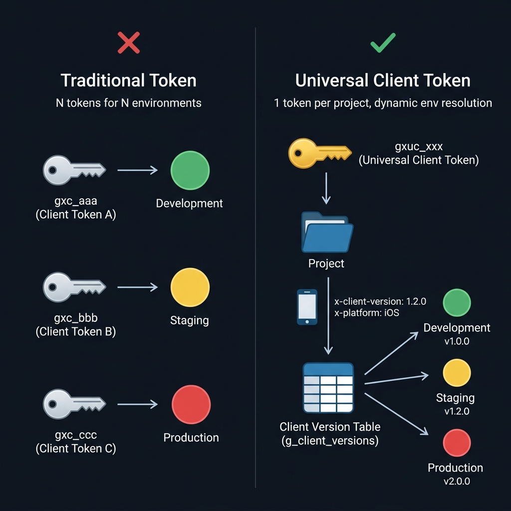

# Universal Client Token (Project-Scoped Token) Specification

## Overview

A Universal Client Token is a **project-scoped** API token. Unlike environment-bound Client Tokens, it is **issued per project** and the target environment is **dynamically resolved from the client version** at request time.

### Purpose
- A single token grants access to all environments within a project
- No need to hardcode environment-specific tokens in client builds
- Environment switching is handled server-side via Client Version configuration

### Architecture Diagram



> **Key Insight**: Traditional tokens require N tokens for N environments.
> Universal Client Token requires only **1 token per project** — the environment is resolved at runtime
> from the `g_client_versions` table using the client's version + platform.

---

## Token Type Classification

| Token Type | Prefix | Scope | Environment Resolution |
| --- | --- | --- | --- |
| `client` | `gxc_` | Environment | Bound `environmentId` on the token |
| `server` | `gxs_` | Environment | Bound `environmentId` on the token |
| `edge` | `gxe_` | Environment | Bound `environmentId` on the token |
| **`universal_client`** | **`gxuc_`** | **Project** | **Dynamic: Client Version → targetEnv** |

---

## Data Model

### DB Table: `g_api_access_tokens`

When creating a Universal Client Token:
- `projectId`: Project ID (required)
- `environmentId`: **NULL** (not bound to any specific environment)
- `tokenType`: `'universal_client'`
- `tokenValue`: `gxuc_` + 32-byte random hex string

```typescript
// packages/backend/src/models/api-access-token.ts
export type TokenType = 'client' | 'server' | 'edge' | 'universal_client';

static readonly TOKEN_PREFIXES: Record<TokenType, string> = {
  client: 'gxc_',
  server: 'gxs_',
  edge: 'gxe_',
  universal_client: 'gxuc_',
};
```

### Related Table: `g_client_versions`

The core table for dynamic environment resolution. Each record holds a mapping of `projectId` + `clientVersion` + `platform` → `targetEnv`.

```
g_client_versions
├── id (ULID)
├── projectId (FK → g_projects)
├── clientVersion (e.g. "1.2.0")
├── platform (e.g. "iOS", "Android")
├── targetEnv (FK → g_environments.id)  ← Key field for env resolution
├── clientStatus (ONLINE, MAINTENANCE, etc.)
└── ...
```

---

## Dynamic Environment Resolution Flow

### Required Headers / Parameters

When using a Universal Client Token, the following **must** be provided:

| Method | Field |
| --- | --- |
| HTTP Header | `x-client-version` |
| Query Parameter | `version` |

Optionally, platform information can also be provided:

| Method | Field |
| --- | --- |
| HTTP Header | `x-platform` |
| Query Parameter | `platform` |

### Backend Resolution (`setSDKEnvironment` middleware)

```
1. Authenticate token (authenticateApiToken)
2. Check token type
   └─ If universal_client with projectId:
      a. Read x-client-version header (400 if missing)
      b. ClientVersionModel.findByProjectAndVersion(projectId, version, platform)
         └─ Query g_client_versions matching projectId + clientVersion (+platform)
      c. Look up Environment using targetEnv from matched record
      d. Set req.environmentId = env.id
      e. Set req.projectId = token.projectId
```

### Edge Resolution (`clientAuth` middleware)

```
1. Validate token (tokenMirrorService.validateToken)
   └─ universal_client is accepted as a valid client type
2. If universal_client + projectId:
   a. Read x-client-version header (400 if missing)
   b. versionMapService.resolveEnvironment(projectId, version, platform)
      └─ O(1) in-memory Map lookup
      └─ Platform-specific mapping takes priority, generic mapping as fallback
   c. Validate environment ID via environmentRegistry
   d. Set clientContext.environmentId = resolved envId
      Set clientContext.projectId = token.projectId
```

### Edge VersionMapService

The Edge server mirrors version mapping data from the Backend for **O(1) in-memory lookups**.

```
Key format:
  Generic:  "{projectId}:{clientVersion}" → targetEnv
  Platform: "{projectId}:{platform}:{clientVersion}" → targetEnv

Lookup priority:
  1. Platform-specific mapping (projectId:platform:version)
  2. Generic mapping (projectId:version)
```

Synchronization:
- On initialization: Fetches from Backend `/api/v1/server/internal/version-map`
- Real-time: Auto-refreshes on Redis PubSub `client_version.*` events

---

## Unsecured Token Format (Development / Testing)

| Token Type | Format |
| --- | --- |
| Environment-bound | `unsecured-{org}:{project}:{env}-{client\|server\|edge}-api-token` |
| **Universal Client** | **`unsecured-{org}:{project}-universal-client-api-token`** |

> Universal Client unsecured tokens do not include an environment segment — the environment is dynamically resolved via `x-client-version`.

```typescript
// Regex (same in backend + edge)
const UNSECURED_UNIVERSAL_CLIENT_TOKEN_REGEX =
  /^unsecured-([^:]+):([^:]+)-universal-client-api-token$/;
```

---

## Permissions & Access Control

### Client SDK Auth Chain

Universal Client Tokens have the **same SDK access permissions as Client tokens**:

```typescript
// clientSDKAuth middleware
if (req.apiToken?.tokenType === 'universal_client') {
  return next(); // Treated as equivalent to client type
}
```

### Edge Token Type Validation

```typescript
// Prefix-based fast rejection allows universal_client → client compatibility
if (type !== requiredType &&
    !(type === 'universal_client' && requiredType === 'client')) {
  return { valid: false, reason: 'invalid_type' };
}
```

### Environment Binding Check (Skipped)

Regular tokens are validated with `token.environmentId === requestedEnvironmentId`. Since Universal Client Tokens have a NULL `environmentId`, the environment binding check is **automatically skipped**.

---

## Creation & Management

### Admin API

```
POST   /api/v1/admin/orgs/:orgId/projects/:projectId/api-tokens
GET    /api/v1/admin/orgs/:orgId/projects/:projectId/api-tokens
PUT    /api/v1/admin/orgs/:orgId/projects/:projectId/api-tokens/:id
DELETE /api/v1/admin/orgs/:orgId/projects/:projectId/api-tokens/:id
POST   /api/v1/admin/orgs/:orgId/projects/:projectId/api-tokens/:id/regenerate
```

### Creation Request (Backend Validation)

```typescript
body('tokenType')
  .isIn(['client', 'server', 'edge', 'universal_client']),

body('environmentId')
  .if(body('tokenType').not().equals('universal_client'))
  .notEmpty()
  .withMessage('Environment ID is required'),
// → universal_client type does NOT require environmentId
```

### Frontend Creation Form Behavior

1. When Token Type = `universal_client`:
   - **Environment selector is hidden** (environment is dynamically resolved)
   - **Project selector is shown** (ProjectTreeSelector component)
   - Sends `projectId` as `selectedProjectId`

2. When Token Type = `client` / `server` / `edge`:
   - Environment selector is shown
   - Sends `environmentId`

---

## Sequence Diagram

```
┌──────────┐     ┌──────────┐     ┌──────────────┐     ┌──────────────────┐
│  Client  │     │  Edge    │     │   Backend    │     │  g_client_       │
│  (SDK)   │     │  Server  │     │   Server     │     │  versions (DB)   │
└────┬─────┘     └────┬─────┘     └──────┬───────┘     └────────┬─────────┘
     │                │                   │                      │
     │  API Request   │                   │                      │
     │  x-api-token: gxuc_xxx            │                      │
     │  x-client-version: 1.2.0          │                      │
     │  x-platform: iOS                  │                      │
     │───────────────>│                   │                      │
     │                │                   │                      │
     │                │ 1. Validate token │                      │
     │                │    (in-memory)    │                      │
     │                │                   │                      │
     │                │ 2. Resolve env    │                      │
     │                │    from versionMap│                      │
     │                │    (O(1) lookup)  │                      │
     │                │                   │                      │
     │                │ 3. Proxy request  │                      │
     │                │    with resolved  │                      │
     │                │    environmentId  │                      │
     │                │──────────────────>│                      │
     │                │                   │                      │
     │                │                   │ (Or direct backend   │
     │                │                   │  path: same flow,    │
     │                │                   │  DB lookup instead   │
     │                │                   │  of in-memory)       │
     │                │                   │─────────────────────>│
     │                │                   │   findByProject      │
     │                │                   │   AndVersion()       │
     │                │                   │<─────────────────────│
     │                │                   │   targetEnv = envId  │
     │                │                   │                      │
     │<───────────────│<──────────────────│                      │
     │  Response      │                   │                      │
```

---

## Error Cases

| Scenario | HTTP | Error Code | Message |
| --- | --- | --- | --- |
| `x-client-version` not provided | 400 | `BAD_REQUEST` / `MISSING_CLIENT_VERSION` | x-client-version header or version query parameter is required |
| No version mapping found | 400 | `ENV_NOT_FOUND` / `ENVIRONMENT_NOT_FOUND` | No environment mapping found for version {version} |
| Target environment does not exist | 404 | `ENV_NOT_FOUND` | Target environment not found: {targetEnv} |
| Token expired | 401 | `AUTH_TOKEN_EXPIRED` / `TOKEN_EXPIRED` | API token has expired |
| Token invalid | 401 | `AUTH_TOKEN_INVALID` / `INVALID_TOKEN` | Invalid API token |

---

## Localization Keys

| Key | Purpose |
| --- | --- |
| `apiTokens.universalClientTokenType` | Type label display |
| `apiTokens.universalClientTokenDescription` | Type description text |
| `apiTokens.universalClientHelp` | Project selector helper text |

---

## History

- Originally implemented as `project` token type → Renamed to `universal_client` via migration (045)
- Token prefix changed from `gxp_` → `gxuc_`
